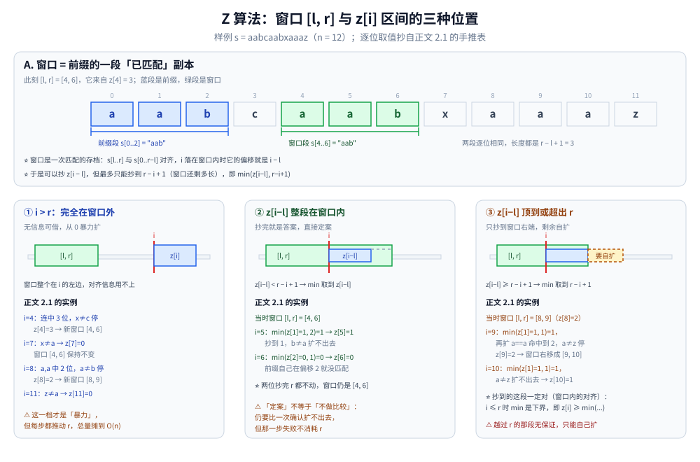
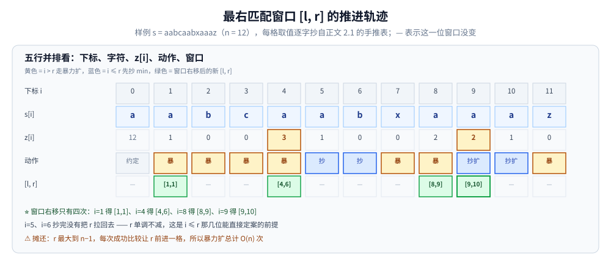

# Z 算法

> 求「每个后缀与原串的最长公共前缀」—— O(n) 求出 Z 数组，
> 是 KMP、Manacher 之外的另一种字符串匹配思路；部分资料里也叫**扩展 KMP**。
>
> ⭐ 边界先说清：本篇讲 Z 算法的原理与应用。
> `next` 数组（前缀函数）的完整讲解只在 [KMP.md](KMP.md)，本篇只讲两者的**区别与判据**；
> Manacher 见 [Manacher.md](Manacher.md)；字符串哈希见 [字符串哈希.md](字符串哈希.md)。
>
> 内容整理自个人学习笔记，素材见 [素材清单](../../../素材清单.md)。复杂度口径见 [复杂度分析.md](../基础算法/复杂度分析.md)。

---

## 一、Z 数组定义

**本节要点**：`z[i]` 回答的是「从 i 开始的后缀与原串能对齐多少位」—— 它和 KMP 的 `next` 是**同一类信息、不同方向**：`next` 看前缀的后缀，Z 数组看整个串的每个后缀。

对字符串 `s`，`z[i]` = `LCP(s, s[i..])`，即「s 本身与从 i 开始的后缀的最长公共前缀长度」。

**例**：`s = "aabcaabxaaaz"`

| i | 0 | 1 | 2 | 3 | 4 | 5 | 6 | 7 | 8 | 9 | 10 | 11 |
|---|---|---|---|---|---|---|---|---|---|---|---|----|
| z | 12 | 1 | 0 | 0 | 3 | 1 | 0 | 0 | 2 | 2 | 1 | 0 |

- `z[0] = n`（约定）
- `z[i] = k` 表示 `s[0..k-1] == s[i..i+k-1]`

⭐ 与「扩展 KMP」的关系：KMP 的 `next[i]` 是「前缀 `p[0..i]` 里最长的**既是前缀又是后缀**的长度」，信息源只有模式串一条链；Z 数组则是**整个串每个后缀**对全串前缀的匹配长度，一张表直接回答所有 LCP 问题。两串版本（对 `pattern + '#' + text` 求 Z）等价于「文本每个位置与模式的 LCP」，这就是「扩展 KMP」名字的来历。

---

## 二、Z 算法的核心

**本节要点**：维护「当前最右匹配区间」`[l, r]`，区间内的新位置先抄对称点 `z[i-l]` 的旧答案做起点，再补少量扩展 —— 与 Manacher 复用半径是同一手法。

维护一个「当前最右匹配区间」`[l, r]`：

- 若 `i <= r`，则 `z[i] >= min(z[i-l], r-i+1)`（利用对称性）
- 否则从 0 开始暴力扩展
- 扩展后更新 `[l, r]`

⭐ 第一条写的是**下界**而不是等号：抄来的那段一定匹配（它就是窗口内前缀复制的一部分），但可能还能再长，所以代码里抄完仍要进 `for` 循环逐位比 —— 比成功就把 `r` 往前推，比失败就直接定案。

```go
func zFunction(s string) []int {
	n := len(s)
	z := make([]int, n)
	z[0] = n
	l, r := 0, 0
	for i := 1; i < n; i++ {
		if i <= r {
			z[i] = min(r-i+1, z[i-l])
		}
		for i+z[i] < n && s[z[i]] == s[i+z[i]] {
			z[i]++
		}
		if i+z[i]-1 > r {
			l, r = i, i+z[i]-1
		}
	}
	return z
}
```



A 栏先把「窗口是一次匹配存档」画出来：`[l, r] = [4, 6]` 来自 `z[4] = 3`，窗口段 `s[4..6]` 与前缀段 `s[0..2]` 都是 `aab`，逐位相同、长度都是 `r − l + 1 = 3`。三个分栏按 `i` 与窗口的关系分支：**① `i > r`（完全在窗口外）** 无信息可借，`z[i]` 从 0 暴力扩（正文 2.1 的 `i=4`、`i=7`、`i=8`、`i=11`）；**② `z[i−l] < r − i + 1`（抄到的区间整段落在窗口内）** `min` 取到 `z[i−l]`，抄完直接定案（`i=5`：`min(z[1]=1, 2)=1`；`i=6`：`min(z[2]=0, 1)=0`）；**③ `z[i−l] ≥ r − i + 1`（顶到或超出 `r`）** 只能抄到窗口右端 `r − i + 1`，越过 `r` 的那段没有保证、必须自己扩（`i=9`：`min(1, 1)=1` 再扩到 2，窗口右移成 `[9, 10]`；`i=10`：`min(1, 1)=1` 后 `a≠z` 定案）。

### 2.1 手推：`aabcaabxaaaz` 的逐位过程

第一节的 Z 表是这样一位位算出来的（「抄」= 取 `min(z[i-l], r-i+1)` 做起点；扩 = 抄完后再逐位比）：

```text
s = a a b c a a b x a a a z     （n = 12）
i    动作                                                   z[i]   [l, r]
1    i>r，暴力扩：a==a，下一个 a≠b 停                        1     [1, 1]
2    i>r，暴力扩：b≠a                                        0     不变
3    i>r，暴力扩：c≠a                                        0     不变
4    i>r，暴力扩：a,a,b 连中 3 位，x≠c 停                    3     [4, 6]
5    i≤r，抄 min(z[1]=1, 2)=1，扩不出去（b≠a）               1     不变
6    i≤r，抄 min(z[2]=0, 1)=0，b≠a 扩不出去                  0     不变
7    i>r，暴力扩：x≠a                                        0     不变
8    i>r，暴力扩：a==a, a==a，第三个 a≠b 停                  2     [8, 9]
9    i≤r，抄 min(z[1]=1, 1)=1，扩：a==a 命中到 2，a≠z 停     2     [9, 10]
10   i≤r，抄 min(z[1]=1, 1)=1，扩：a≠z 停                   1     不变
11   i>r，暴力扩：z≠a                                        0     不变

→ z = [12, 1, 0, 0, 3, 1, 0, 0, 2, 2, 1, 0] ✓ 与第一节表一致
```

- 时间 O(n)：`r` 只增不减，真正"暴力扩"的总次数被 `r` 的移动量摊到 O(n)
- 空间 O(n)



把上面的手推表摊成五行（下标、`s[i]`、`z[i]`、动作、`[l, r]`）就能看清摊还在哪里：黄色「暴」是 `i > r` 走暴力扩，蓝色「抄」是 `i <= r` 先取 `min`，绿色格才是窗口真的动了的那些位 —— **整趟只有四次右移**：`i=1` 得 `[1,1]`、`i=4` 得 `[4,6]`、`i=8` 得 `[8,9]`、`i=9` 得 `[9,10]`；`i=5`、`i=6` 抄完并没有把 `r` 拉回去。`r` 最大到 `n-1`、每次成功比较只让它前进一格，所以暴力扩的总步数是 O(n)。

---

## 三、典型应用

**本节要点**：Z 数组天生适合一切「前缀对齐」问题 —— 匹配、周期、前后缀交叠都能从表里直接读出来。

| 场景 | 做法 |
|---|---|
| 模式匹配 | 拼接 `pattern + '#' + text`，找 `z[i] == len(pattern)` |
| 字符串周期 | 找最小的 `i` 使 `n % i == 0 && z[i] == n-i` |
| 最长公共前缀 | 直接读 z 数组 |
| 最长回文前缀 | 与逆序拼接 |
| 前后缀匹配 | z 数组的特定位置 |

⭐ **模式匹配**：`s = pattern + "#" + text`，若 `z[i] == len(pattern)`，则匹配成功。
用 `#` 分隔避免跨越边界。

⭐ **字符串周期**那一行的道理：`z[i] == n - i` 说明「从 `i` 开始的后缀和前缀一路对齐到串尾」，即 `s[i..n-1] == s[0..n-1-i]`；再叠加 `n % i == 0`，前 `i` 个字符就正好重复铺满整串 —— 满足这两条的最小 `i` 就是最小周期。表里 `z[4] = 3` 这类「没到串尾」的值只能说明局部对齐，判周期必须取到 `n - i`。

---

## 四、与其他算法的对比

**本节要点**：Z 算法与 KMP 复杂度相同、保证相同，差别只在预处理产出的信息形态 —— 只要匹配位置用 KMP，要"逐位置的 LCP"用 Z。

| 算法 | 时间 | 解决 |
|---|---|---|
| KMP | O(n) | 单模式匹配 |
| Z 算法 | O(n) | LCP、单模式匹配 |
| Manacher | O(n) | 最长回文 |
| 字符串哈希 | O(n) 期望 | 子串判等 |

⭐ **判据**：

- 只要单模式匹配 → [KMP.md](KMP.md) 或 Z 算法（KMP 更常见）
- 要 LCP 相关 → Z 算法
- 要回文 → [Manacher.md](Manacher.md)

与 KMP 的**区别**在预处理产物：KMP 的 `next` 只挂在模式串一条链上、失配时沿链回退；Z 数组把「每个后缀对前缀的匹配深度」全部存下来，所以周期、前后缀交叠这类问题一读就有答案，KMP 则要沿 `next` 链自己推。KMP 侧的完整论证见 [KMP.md](KMP.md) 第二节，本篇不重复。

---

## 延伸追问

- **Z 算法和 KMP 的联系？** → 本质相同，都是利用已匹配的信息避免重复比较；KMP 用 `next` 数组，Z 用区间 `[l, r]`。
- **Z 算法为什么是 O(n)？** → 区间 `[l, r]` 单调右移，总扩展次数 ≤ n（2.1 表里 `[l, r]` 只出现了 4 次右移）。
- **Z 算法能替代 KMP 吗？** → 能，两者复杂度相同；KMP 更常用于模式匹配，Z 算法更常用于 LCP 问题。
- **`#` 分隔符为什么必要？** → 防止匹配跨越 pattern 和 text 的边界。
- **抄 `z[i-l]` 时会不会抄过头？** → 会，这正是第三情形：`z[i-l]` 对应的匹配伸出了 `r`。`min` 里的 `r-i+1` 就是「窗口还剩多长」，把抄来的长度截在窗口内，越过 `r` 的那段一律不算数、要自己扩。
- **`z[0]` 为什么常写成 `n`？** → 约定：`s[0..]` 就是整串自己，公共前缀长度取 `n`（代码里 `z[0] = n`）。也有实现留 0，读别人的模板时先看这一位怎么约定，别把它当成算出来的结果。

---

## 关联

- [KMP.md](KMP.md) — 另一种 O(n) 匹配：`next` 数组的完整讲解在那一篇
- [Manacher.md](Manacher.md) — 同样靠「最右区间 + 对称抄答案」求回文半径
- [字符串哈希.md](字符串哈希.md) — 子串判等
- [README.md](README.md) — 字符串匹配导读
