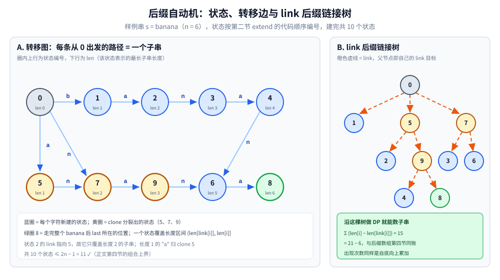
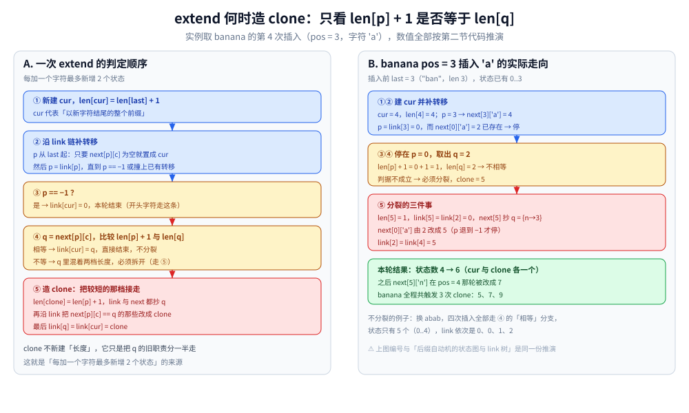

# 后缀自动机

> 把字符串的所有子串压缩成一个 DAG：状态数 O(n)，每条路径对应一个子串 ——
> 是处理「不同子串个数」「最长公共子串」「多模式匹配」的终极武器。
>
> ⭐ 边界先说清：本篇讲后缀自动机（下文缩写 SAM）的构造与典型应用。
> 后缀数组见 [后缀数组.md](后缀数组.md)；
> KMP 见 [KMP.md](KMP.md)。
>
> 内容整理自个人学习笔记，素材见 [素材清单](../../../素材清单.md)。复杂度口径见 [复杂度分析.md](../基础算法/复杂度分析.md)。

---

## 一、核心思想

**本节要点**：一个状态代表**一组 endpos 相同的子串**（在原串中所有结束位置集合相同），于是一台 O(n) 大小的自动机就装下了全部子串。

- 把字符串的所有子串表示成一个 **DAG**（有向无环图）
- 每个状态代表一组 endpos 相同的子串
- 状态数 O(n)，转移数 O(n)

⭐ **后缀自动机是「子串的压缩表示」**：所有子串都能从起点出发沿路径走到。

---

## 二、构造算法（在线）

**本节要点**：`extend` 做三件事 —— 给新字符建状态、沿后缀链接补转移、必要时 clone 分裂一个状态；每加一个字符最多新增 2 个状态。

SAM 是**在线**构造的：每加入一个字符，最多新增 2 个状态。

**核心概念**：

- `len[state]`：该状态表示的最长子串长度
- `link[state]`：后缀链接，指向「最长后缀所对应的状态」
- `next[state][c]`：转移函数

初始状态（根）为 `len = [0]`、`link = [-1]`、`next = [{}]`、`last = 0`；下文用「转移值为 0」表示无转移（0 号根不会作为任何转移的目标）：

```go
type SAM struct {
	len, link []int
	next      []map[byte]int
	last      int
}

func (s *SAM) extend(c byte) {
	cur := len(s.len)
	s.len = append(s.len, s.len[s.last]+1)
	s.link = append(s.link, 0)
	s.next = append(s.next, map[byte]int{})
	p := s.last
	for p != -1 && s.next[p][c] == 0 {
		s.next[p][c] = cur
		p = s.link[p]
	}
	if p == -1 {
		s.link[cur] = 0
	} else {
		q := s.next[p][c]
		if s.len[p]+1 == s.len[q] {
			s.link[cur] = q
		} else {
			clone := len(s.len)
			s.len = append(s.len, s.len[p]+1)
			s.link = append(s.link, s.link[q])
			s.next = append(s.next, copyMap(s.next[q]))
			for p != -1 && s.next[p][c] == q {
				s.next[p][c] = clone
				p = s.link[p]
			}
			s.link[q], s.link[cur] = clone, clone
		}
	}
	s.last = cur
}
```

⭐ **clone 操作**是 SAM 最微妙的部分：分裂状态以保持 len 与 link 的语义。
`copyMap` 是复制转移表的辅助函数（逐键复制一个 `map[byte]int`），不改变算法结构。

按上面的代码逐字符 `extend("banana")` 手推（`cur` 是本轮新建的状态、`clone` 是本轮分裂出的，`-1` 表示这一轮没有分裂）：

```text
插入过程：
  pos=0 'b'：cur=1  clone=-1  → 状态数 2
  pos=1 'a'：cur=2  clone=-1  → 状态数 3
  pos=2 'n'：cur=3  clone=-1  → 状态数 4
  pos=3 'a'：cur=4  clone=5   → 状态数 6   ← 第一次分裂
  pos=4 'n'：cur=6  clone=7   → 状态数 8
  pos=5 'a'：cur=8  clone=9   → 状态数 10

建完的状态表（编号: len / link / next）：
  0: len 0  link −1  next[a→5 b→1 n→7]
  1: len 1  link 0   next[a→2]
  2: len 2  link 5   next[n→3]
  3: len 3  link 7   next[a→4]
  4: len 4  link 9   next[n→6]
  5: len 1  link 0   next[n→7]   ← clone，把单字符 "a" 这一档接走
  6: len 5  link 7   next[a→8]
  7: len 2  link 0   next[a→9]   ← clone，管 "n" 与 "an"
  8: len 6  link 9   next[ ]     ← 整串 banana 所在的状态
  9: len 3  link 5   next[n→6]   ← clone，管 "na" 与 "ana"
```



说明段：左栏是转移图，圈内上行为状态编号、下行为 `len`，全部照抄上面的手推表；黄圈 5、7、9 是三次 clone 造出的状态，绿圈 8 是走完整个 `banana` 后 `last` 所在的位置。右栏把同一批状态按 `link` 重新连成一棵树 —— 每个节点的父节点就是它的 `link` 目标，`0` 号根的 `link` 是 `−1`。两栏合起来读：**转移边往后长，link 边往后缀缩**。沿右栏那棵树求 `Σ (len[i] − len[link[i]])` 得 **15**，与上面状态表逐项相加一致。



说明段：左栏把 `extend` 的判定顺序摊成四步 —— 建 `cur`、沿 `link` 补转移、判 `p == −1`、比 `len[p] + 1` 与 `len[q]`，只有最后那个「不相等」才会造 clone。右栏是 `banana` 第四轮（`pos = 3`，字符 `'a'`）的真实走向：`p` 从 `last = 3` 补上 `a→4` 后退到 `0`，撞上已有的 `next[0]['a'] = 2`，而 `len[0] + 1 = 1 ≠ len[2] = 2` → 造出 `clone = 5`（`len 1`、`link 0`、`next` 抄 `q = {n→3}`），再把 `next[0]['a']` 改指 5，最后 `link[2] = link[4] = 5`。⚠️ clone 复制的是**当时**的转移表：`next[5]['n']` 在 `pos = 4` 那轮又被改成 7，与状态表的终态一致。

---

## 三、典型应用

**本节要点**：一旦建好，「子串问题」都变成 DAG 上的读表 / DP —— 计数看 `len − len[link]`，匹配沿转移走，失配沿 link 跳。

| 场景 | 做法 |
|---|---|
| 不同子串个数 | `Σ (len[i] - len[link[i]])` |
| 最长公共子串（两串） | 在 SAM 上跑匹配，失配时跳 link |
| 模式串匹配 | 沿转移走 |
| 出现次数 | 沿 link 树 DP |
| 字典序第 K 小子串 | 在 DAG 上 DP |
| 多模式匹配 | 多串建 SAM |

⚠️ 表里的「模式串匹配」（沿转移走一遍即判存在）只做**存在性判断**；要**报出所有出现位置**仍是 [KMP.md](KMP.md) / [AC自动机.md](AC自动机.md) 的活 —— 判据与对照见 [README.md](README.md) 第二节。

用第二节的手推表验一笔账：`Σ (len[i] − len[link[i]])` 逐项是 `1 + 1 + 1 + 1 + 1 + 3 + 2 + 3 + 2 = 15`，正好等于 `6·7/2 − 6` —— [后缀数组.md](后缀数组.md) 第四节用 Height 算出的是同一个数，两条路线在「不同子串个数」上闭合。

---

## 四、复杂度

**本节要点**：状态 ≤ 2n−1、转移 ≤ 3n−4 是组合上界，与输入无关；用 map 存转移会带一个 log Σ 的因子。

| 维度 | 值 |
|---|---|
| 构造时间 | O(n) 平均，O(n log Σ) 带 map |
| 状态数 | ≤ 2n − 1 |
| 转移数 | ≤ 3n − 4 |
| 空间 | O(n × Σ) 或 O(n) |

第二节的 `banana` 手推正落在界内：`n = 6` → 状态数 `10 ≤ 2n − 1 = 11`，转移条数 `11 ≤ 3n − 4 = 14`。⚠️ 这两个上界是**组合上界**（与输入长什么样无关），所以最坏情况也不会翻车；但 clone 一次要复制一整张转移表，用 `map` 存时空间常数比后缀数组明显更大。

---

## 五、与后缀数组的对比

**本节要点**：两台机器存的是同一份信息（子串集合）—— [后缀数组.md](后缀数组.md) 是「排好序的后缀 + LCP」，SAM 是「压缩子串的 DAG」；差别在在线构造与实现难度。

| 维度 | 后缀自动机 | 后缀数组 |
|---|---|---|
| 时间 | O(n) | O(n log n) 或 O(n) |
| 空间 | O(n) | O(n) |
| 实现难度 | 高 | 中 |
| 在线构造 | ✅ | ❌ |
| 子串枚举 | 沿 DAG | 靠 Height |
| 常用度 | 较少 | ⭐ 更多 |

⭐ 后缀数组用一张排序表换来了「好写好调试」，SAM 用 clone 换来了在线扩展与更宽的应用面（第 K 小、出现次数都是 DAG 上的 DP）。工程上先问：**问题能不能落到「相邻后缀的 LCP」上？能 → 后缀数组；不能（要枚举 / 计数 / 在线）→ SAM。**

---

## 延伸追问

- **SAM 的状态代表什么？** → 一组 endpos 相同的子串，长度在 `(len[link[i]], len[i]]` 范围内。
- **clone 操作的作用？** → 分裂状态，让新状态与旧状态共享部分转移，保持语义正确。
- **clone 造出的状态代表哪些子串？** → 把 `q` 里**较短的那一档**接走：`len[clone] = len[p] + 1`，转移与 link 都照抄原来的 `q`；分裂后 `q` 的覆盖区间被 `clone` 截成 `(len[clone], len[q]]`，只剩较长的部分。第二节的 `banana` 里，`clone = 5` 接走单字符 `"a"`，`q = 2` 只剩 `"ba"`。
- **SAM 为什么是 DAG 而不是一棵树？** → 转移函数是确定的，但多个不同长度的子串会停在同一个状态（它们 endpos 相同），于是「从起点出发的路径」共用节点 → 压缩成 DAG。要每串一路径不合并的那棵树是 Trie，见 [AC自动机.md](AC自动机.md) 第二节。
- **SAM 为什么是线性的？** → 每次 extend 均摊 O(1) 状态与转移。
- **SAM 能处理多个字符串吗？** → 能，用广义后缀自动机（多串建 SAM）。
- **SAM 和 AC 自动机什么区别？** → SAM 处理**单个字符串的所有子串**；[AC自动机.md](AC自动机.md) 处理**多个给定模式串在文本中的匹配**。两者的"fail / link"方向相反：AC 沿 fail 找"还能接上的更短前缀"，SAM 沿 link 找"同一 endpos 类的最长真后缀"。

---

## 关联

- [后缀数组.md](后缀数组.md) — 等价路线（本篇第五节对照）
- [AC自动机.md](AC自动机.md) — 多模式匹配
- [KMP.md](KMP.md) — 单模式匹配
- [回文自动机.md](回文自动机.md) — 同族思路的"回文子串"版本
- [README.md](README.md) — 字符串匹配导读
