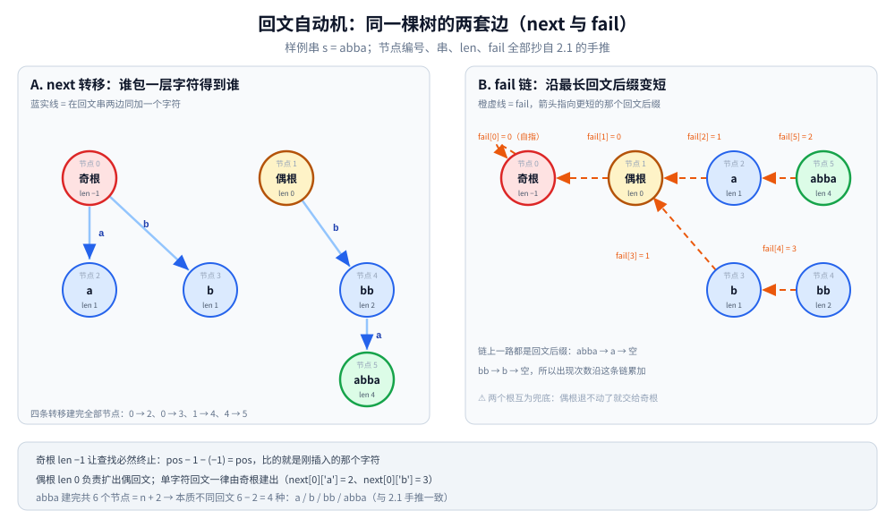

# 回文自动机

> 回文自动机（下文缩写 PAM）也叫「回文树」：把字符串的所有**本质不同回文子串**压缩成一棵树，
> 状态数 O(n)，处理回文相关问题时比 Manacher 更灵活。
>
> ⭐ 边界先说清：本篇讲回文自动机的构造与应用。
> 只求最长回文用 [Manacher.md](Manacher.md)；
> 另一类"压缩子串"的自动机见 [后缀自动机.md](后缀自动机.md)。
>
> 内容整理自个人学习笔记，素材见 [素材清单](../../../素材清单.md)。复杂度口径见 [复杂度分析.md](../基础算法/复杂度分析.md)。

---

## 一、核心思想

**本节要点**：每个节点存且仅存一个「本质不同的回文串」，节点数就是回文种类数 —— 这正是 Manacher 的半径表拿不到的信息。

- **每个节点代表一个本质不同的回文串**
- 每个节点有两个指针：
  - `len[i]`：该回文串的长度
  - `fail[i]`：失配指针，指向「最长回文后缀」
- 转移：`next[i][c]` 表示在回文串 i 两边加字符 c 后的回文串

⭐ **状态数 ≤ n+2**（每个字符最多新增 1 个节点），所以空间 O(n)。

⚠️ 与 [后缀自动机.md](后缀自动机.md) 的差别在这里：SAM 的状态是 endpos 等价类，一个状态可能装下好几个长度；PAM 的节点**一个只装一个回文串**，所以「节点数」直接就是本质不同回文子串数。上界 `n + 2` 里那两个多出来的节点就是两个根（长度 `-1` 与 `0`），它们不代表任何回文。

---

## 二、构造

**本节要点**：插入第 `pos` 个字符时，从 `last` 沿 fail 链找到「能在两边接住这个字符的最长回文后缀」，然后新建节点或复用已有转移；新节点的 fail 再用同样方法找一次。

初始化两个根节点：

- 节点 0：长度为 -1（奇回文的根）
- 节点 1：长度为 0（偶回文的根）
- `fail[0] = 0`，`fail[1] = 0`，`last` 初始指向节点 1

**逐字符插入**，每次找到「能扩展的最长回文后缀」，新增或复用节点。
长度为 -1 的根保证查找循环必然终止（它总能把当前位置自己算作回文中心）：

```go
type PAM struct {
	len, fail []int
	next      []map[byte]int
	last, n   int
}

func (p *PAM) extend(s string, pos int) {
	c := s[pos]
	cur := p.last
	for {
		if pos-1-p.len[cur] >= 0 && s[pos-1-p.len[cur]] == c {
			break
		}
		cur = p.fail[cur]
	}
	if _, ok := p.next[cur][c]; ok {
		p.last = p.next[cur][c]
		return
	}
	// 新建节点
	now := p.n
	p.n++
	p.len = append(p.len, p.len[cur]+2)
	p.next = append(p.next, map[byte]int{})
	p.fail = append(p.fail, 0)
	p.next[cur][c] = now
	if p.len[now] == 1 {
		p.fail[now] = 1
	} else {
		f := p.fail[cur]
		for {
			if pos-1-p.len[f] >= 0 && s[pos-1-p.len[f]] == c {
				break
			}
			f = p.fail[f]
		}
		p.fail[now] = p.next[f][c]
	}
	p.last = now
}
```

### 2.1 手推：插入 `abba` 的四个字符

```text
插入 'a'（pos=0）：last=1（len 0），pos−1−0 越界 → fail 跳到 0（len −1）命中
  → 新建节点 2："a"（len 1），fail[2] = 1（偶根）
插入 'b'（pos=1）：last=2（len 1），s[−1] 越界 → 2 的 fail=1：s[0]='a'≠'b' → 1 的 fail=0：命中
  → 新建节点 3："b"（len 1），fail[3] = 1
插入 'b'（pos=2）：last=3（len 1），s[0]='a'≠'b' → fail[3]=1：s[1]='b'=='b' ✓ 停在节点 1
  → 新建节点 4："bb"（len 2），fail[4] = next[0]['b'] = 3（"b"）
插入 'a'（pos=3）：last=4（len 2），s[0]='a'=='a' ✓ 停在节点 4
  → 新建节点 5："abba"（len 4），fail[5] = 2（"a"）

共 4 个新节点 → 本质不同回文子串 = a / b / bb / abba，恰好 4 种 ✓
```

⭐ 两个 'b' 停在不同根节点，正好演示查找的分工：第一个 'b' 一路退到奇根 0（len −1）才命中，从它建出节点 3 `"b"`；第二个 'b' 在偶根 1（len 0）处就停住（前一个字符 `s[1]='b'` 能接上），建出节点 4 `"bb"`。若包出来的回文早已登记（`next[cur][c]` 存在），就直接复用该转移更新 `last` 而不新增节点 —— 第一节「每个字符最多新增 1 个节点」靠的正是这个复用分支。



左栏把 `abba` 建完后的六个节点按 `next` 边摆开：蓝实线表示"在回文串两边同加一个字符"，四条转移 `0 → 2`、`0 → 3`、`1 → 4`、`4 → 5` 就把全部节点建完了，其中单字符回文一律由奇根建出（`next[0]['a'] = 2`、`next[0]['b'] = 3`）。右栏是同一批节点换一套边：橙虚线是 `fail`，箭头指向更短的回文后缀，`abba → a → 空`、`bb → b → 空`，`fail[0] = 0` 自指兜底。两栏合起来说明两个根的职责 —— 偶根（len 0）负责扩出偶回文，奇根（len −1）保证查找必然终止，因为 `pos − 1 − (−1) = pos` 比的就是刚插入的那个字符。底部一行读数：`abba` 共建 6 个节点 = `n + 2`，本质不同回文 `6 − 2 = 4` 种：a / b / bb / abba。


这条时序对应 2.1 手推的第三行（`s = abba`、`pos = 2`、起点 `last = 3`）。第一轮从 `cur = last = 3` 出发，`pos − 1 − len[3] = 0` 处 `s[0] = 'a' ≠ 'b'`，于是 `cur = fail[3] = 1`；再算 `pos − 1 − len[1] = 1`，`s[1] = 'b' == 'b'` 命中，停在偶根 1 并返回它作为可扩位置。`next[1]['b']` 不存在 → 新建节点 4，`len[4] = len[1] + 2 = 2`。第二轮从 `f = fail[cur] = fail[1] = 0` 起用同一个判据继续回退，`pos − 1 − len[0] = 2` 处 `s[2] = 'b' == 'b'` 停在奇根 0，于是 `fail[4] = next[0]['b'] = 3`。两轮的唯一区别只是起点：第一轮从 `last` 起，第二轮从 `fail[cur]` 起；`len[now] == 1` 时新节点是单字符，fail 直接给偶根 1，第二轮整个跳过。

---

## 三、典型应用

**本节要点**：树上做两件事就覆盖大部分回文题 —— 节点数回答"有多少种"，沿 fail 树自底向上累加回答"各出现几次"。

| 场景 | 做法 |
|---|---|
| 本质不同回文子串个数 | 状态数 − 2（去掉两个根） |
| 每个回文子串出现次数 | 沿 fail 树从下往上累加 |
| 最长回文子串 | 所有节点 len 的最大值 |
| 回文子串总数 | 每个位置统计 |
| 回文分割 | 配合 DP |
| 双倍回文 | 特殊处理 |

⭐ 拿 `abba` 验一笔账，两类问法走的是两条路径。**问种类**只看节点数：建完共 6 个节点，去掉两个根 → `6 − 2 = 4` 种，与 2.1 手推得到的 a / b / bb / abba 完全一致，这一项连字符串内容都不用读。**问次数**要先给每个位置的 `last` 记 1（`pos = 0..3` 的 `last` 依次是节点 2、3、4、5，即每种回文只在"它是最长回文后缀"的那个位置被直接记到），再按 `len` 从大到小沿 fail 链把计数交给更短的后缀：节点 5 → 2 使 `a` 得 1、节点 4 → 3 使 `b` 得 1，最终 `a = 2`、`b = 2`、`bb = 1`、`abba = 1`，合计 6 次 —— 正好是 `abba` 全部回文子串的枚举数（四个单字符 + `bb` + `abba`）。⚠️ 累加的方向不能反：`last` 只覆盖每个位置"最长"的那个回文后缀，它挂在 fail 链的顶端，链下方更短的回文后缀必须靠这一遍树形 DP 才能补齐；跳过累加直接用 `cnt` 会漏掉所有非最长的出现。

---

## 四、复杂度

**本节要点**：每字符的 fail 跳转均摊 O(1)（与 Manacher 的 `right` 单调同类），转移用 map 则带 log Σ 因子。

| 维度 | 值 |
|---|---|
| 时间 | O(n log Σ) 或 O(n) |
| 状态数 | ≤ n + 2 |
| 空间 | O(n × Σ) 或 O(n) |

---

## 五、与 Manacher 的对比

**本节要点**：两者都是 O(n)，问的却是不同问题 —— [Manacher.md](Manacher.md) 给「每个中心能扩多远」，PAM 给「有哪几种回文、各出现几次」，后者才能挂 DP。

| 维度 | 回文自动机 | Manacher |
|---|---|---|
| 时间 | O(n) | O(n) |
| 空间 | O(n × Σ) | O(n) |
| 处理问题 | 所有回文子串信息 | 最长回文、以某点为中心的回文 |
| 实现难度 | 中 | 中 |
| 扩展性 | ⭐ 更强 | 有限 |

⭐ **判据**：

- 只求最长回文 → Manacher
- 需要所有本质不同回文、出现次数、回文 DP → 回文自动机

---

## 延伸追问

- **回文自动机的状态数为什么是 O(n)？** → 每次插入最多新增 1 个节点。
- **fail 指针的含义？** → 当前回文串的最长回文后缀 —— 与 [AC自动机.md](AC自动机.md) 的 fail（"还能接上的更短前缀"）方向相反，AC 的是真后缀节点，PAM 的是真回文后缀。
- **怎么统计每个回文串的出现次数？** → 沿 fail 树从下往上累加 `cnt[i]`。
- **回文自动机能处理两串问题吗？** → 能，用广义回文自动机。
- **回文自动机和 Manacher 哪个更实用？** → 一般求最长回文用 Manacher；求所有回文信息用回文自动机。
- **新建节点后为什么还要再跑一遍 fail 查找？** → 两轮用的是同一条判据 `pos − 1 − len[x] ≥ 0 且 s[pos − 1 − len[x]] == c`，区别只在起点：第一轮从 `last` 起，找到的是"能接住新字符的最长回文后缀"，它直接给出新节点 `now`；而 `fail[now]` 要的是 `now` 的最长回文后缀，长度必须严格更短，所以只能从 `fail[cur]` 起跑。图 [一次插入沿fail链回退的时序.svg](images/一次插入沿fail链回退的时序.svg) 里 `pos = 2` 的第一轮停在偶根 1、第二轮停在奇根 0，正是同一个判据换起点的两次结果。若省掉第二轮、把 `cur` 或 `last` 直接当 fail 用，链上就会挂进一个不是回文后缀的节点，第三节"沿 fail 链累加出现次数"的口径随之全错。
- **`len[now] == 1` 时为什么特判 `fail[now] = 1`？** → 单字符回文的最长回文后缀只能是空串，偶根 1（len 0）就是它。更麻烦的是这种场景下第一轮必然停在奇根 0（`len[0] = −1` 是唯一能让 `pos − 1 − len[x] = pos` 成立的下标），于是 `p.next[0][c] = now` 已经写进去了；此时若走第二轮，起点 `f = fail[0] = 0` 的判据 `s[pos] == c` 比的是刚插入的字符本身、立刻成立，就会算出 `fail[now] = next[0][c] = now`，让 fail 指回自己。这个特判同时是那条自指边的出口。

---

## 关联

- [Manacher.md](Manacher.md) — 最长回文子串
- [字符串哈希.md](字符串哈希.md) — 回文判定的哈希方案
- [后缀自动机.md](后缀自动机.md) — 另一类自动机（压缩"子串"而非"回文"）
- [AC自动机.md](AC自动机.md) — 第三个带 fail 指针的自动机，三者 fail 语义对照
- [README.md](README.md) — 字符串匹配导读
