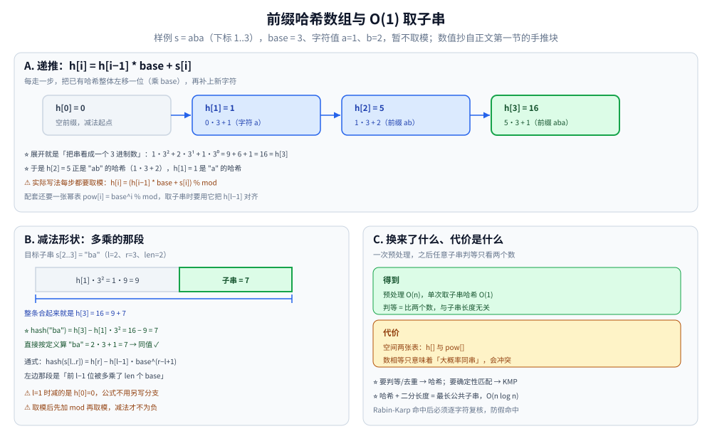
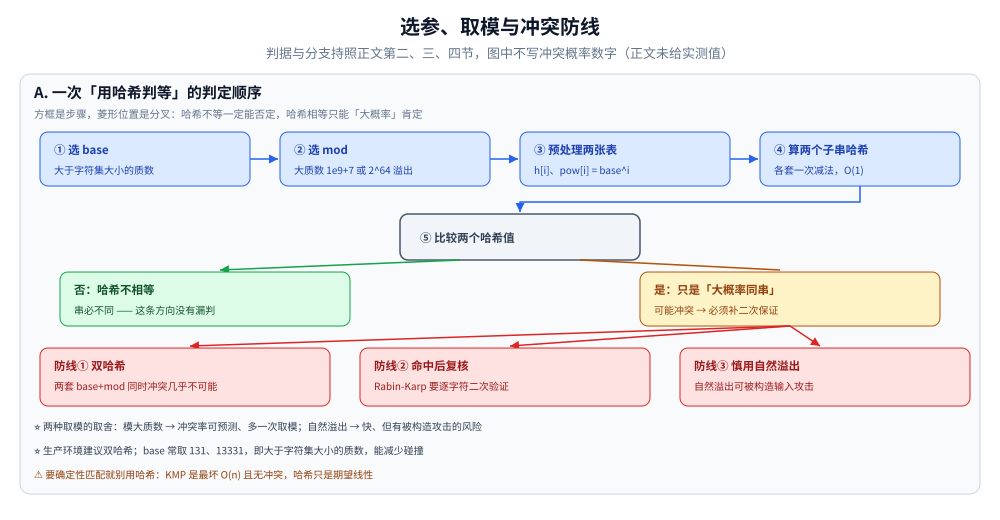

# 字符串哈希

> 用一次预处理，把「子串相等判断」从 O(len) 降到 **O(1)** ——
> 这是 KMP、后缀数组之外的另一条实用路线，常用于去重、判等、最长公共子串。
>
> ⭐ 边界先说清：本篇讲**滚动哈希（Rolling Hash）**的原理与工程应用。
> KMP 解决的是「模式串匹配」；字符串哈希解决的是「子串判等」。
> 完整字符串算法对比见 [README.md](README.md)。
>
> 内容整理自个人学习笔记，素材见 [素材清单](../../../素材清单.md)。复杂度口径见 [复杂度分析.md](../基础算法/复杂度分析.md)。

---

## 一、核心思想：把字符串映射成一个数

**本节要点**：把串看成 base 进制数、边扫边算前缀哈希，之后**任意子串的哈希都能 O(1) 算出**，判等只需比较两个数。

- 选择基数 `base`（如 131、13331）和模数 `mod`（如 1e9+7、2^64）
- 前缀哈希：`h[i] = h[i-1] * base + s[i]`（取模）
- 子串 `s[l..r]` 的哈希：`h[r] - h[l-1] * base^(r-l+1)`
- 下标从 1 开始编号、`h[0] = 0`：这样 `l = 1` 时减掉的是 0，取「整串前缀」和取「中间子串」共用同一条式子，不用特判
- 取模之后减法要写成 `(h[r] - h[l-1] * pow[r-l+1] + mod) % mod`：先加一个 `mod` 再取模，结果才不会落到负数

⭐ 有了这个公式，判等不再需要逐字符比较 —— 代价是**两个数相等只意味着"大概率同串"**（冲突问题见延伸追问）。

以小串手推一遍（取 `base = 3`、字符值 `a=1, b=2`、暂不取模以便看清算术）：

```text
s = a b a        下标 1..3
h[0] = 0
h[1] = 0·3 + 1 = 1
h[2] = 1·3 + 2 = 5
h[3] = 5·3 + 1 = 16

子串 s[2..3] = "ba" 的哈希 = h[3] − h[1]·3² = 16 − 9 = 7
直接按定义算 "ba"          = 2·3 + 1 = 7    ✓ 两条路径同值
```

⭐ 减去的正是「前 `l−1` 位被多乘了 `base^(r-l+1)` 的那部分」—— 这就是 `h[l-1] * base^(r-l+1)` 的来历，所以 `base` 的幂也要预处理一张表。



A 栏是递推链：`h[0]=0 → h[1]=1 → h[2]=5 → h[3]=16`，每格下面写了它是怎么来的（`5·3 + 1` 这种），展开就是「把串看成一个 3 进制数」：`1·3² + 2·3¹ + 1·3⁰ = 16`。B 栏是减法的几何：`h[3] = 16` 这条长条由两段拼成 —— 灰色的「`h[1]·3² = 1·9 = 9`」正是前 `l−1 = 1` 位被多乘了两个 `base` 的那部分，绿色的 `7` 才是子串 `"ba"` 的哈希；`16 − 9 = 7` 与按定义直接算 `2·3 + 1 = 7` 同值。C 栏把账结算清楚：预处理 O(n)、单次判等 O(1)，代价是多一张 `pow[]` 表与「数相等只是大概率同串」。

---

## 二、两种取模方式

**本节要点**：取大质数模还是让 uint64 自然溢出，本质是「可预测的冲突率」与「速度」的取舍；生产环境用双哈希兜底。

| 方式 | 优点 | 缺点 |
|---|---|---|
| 模大质数（1e9+7） | 冲突概率低，可预测 | 多一次取模运算 |
| 自然溢出（uint64） | 快，自动取模 2^64 | 有被构造攻击的风险 |

⭐ **生产环境建议双哈希**（两个不同 base 与 mod 组合），进一步降低冲突。

双哈希的写法是把 `h[]` 与 `pow[]` 各存两份，判等时**两对数都相等**才认定同串；只比一套就退化回单哈希的冲突率。



流程分五步：① 选 `base`（大于字符集大小的质数，正文给的常值是 131、13331）→ ② 选 `mod`（大质数 1e9+7 或让 uint64 自然溢出）→ ③ 预处理 `h[i]` 与 `pow[i]` 两张表 → ④ 各自 O(1) 算出两个子串哈希 → ⑤ 比较。**两个方向不对称**：哈希不相等 ⇒ 串必不同（绿色，没有漏判）；哈希相等 ⇒ 只是「大概率同串」（黄色，可能冲突）。所以冲突要有三道防线：双哈希（两套 `base+mod` 同时冲突几乎不可能）、Rabin-Karp 命中后逐字符复核、安全场景慎用自然溢出（可被构造输入攻击）。图中不写冲突概率的数字 —— 正文没有实测值。

---

## 三、典型应用

**本节要点**：哈希的强项是「判等 / 去重 / 配合二分」，模式匹配只是顺带（Rabin-Karp），且必须二次验证防冲突。

| 场景 | 做法 |
|---|---|
| 判断两子串是否相等 | 各自算哈希，O(1) 比较 |
| 最长公共子串 | 哈希 + 二分长度 |
| 字符串去重 | 哈希进 Set |
| 回文判定 | 正序哈希 + 逆序哈希比较（O(n) 全判见 [Manacher.md](Manacher.md)） |
| 模式串匹配 | 主串的每个窗口哈希与模式哈希比较（Rabin-Karp） |

⚠️ 最后一行就是 [README.md](README.md) 第四节表里的 Rabin-Karp：窗口哈希相等后**必须逐字符复核**，否则冲突会报出假命中。

---

## 四、与 KMP 的对比

**本节要点**：一句话分工 —— 要判等或去重用哈希（概率性、O(1) 判等），要确定性模式匹配用 [KMP.md](KMP.md)（最坏保证、无冲突）。

| 维度 | 字符串哈希 | KMP |
|---|---|---|
| 判子串相等 | O(1) | — |
| 单模式匹配 | O(n) 期望 | O(n) 最坏保证 |
| 多模式匹配 | 不擅长 | 用 [AC自动机.md](AC自动机.md) |
| 冲突 | 有（概率性） | 无 |
| 实现难度 | 低 | 中 |

⭐ **判据**：**要判等或去重 → 哈希；要确定性匹配 → KMP**。

两者的差别不在快慢，而在**保证的强度**：哈希匹配是「期望线性 + 有小概率出错」，KMP 是「最坏线性 + 绝对正确」；KMP 的 `next` 数组与跳跃论证见 [KMP.md](KMP.md) 第二、四节，本篇不重复。

---

## 延伸追问

- **字符串哈希为什么可能冲突？** → 不同的字符串可能映射到同一个数值。双哈希可把概率降到可忽略。
- **为什么 base 常用 131 或 13331？** → 大于字符集大小的质数，能减少碰撞。
- **自然溢出模数安全吗？** → 对普通数据够用；但可被构造输入攻击，安全场景用双哈希。
- **哈希怎么求最长公共子串？** → 二分长度 + 哈希判等，O(n log n)。后缀数组靠 Height 数组也能做，见 [后缀数组.md](后缀数组.md) 第三节。
- **哈希能替代 KMP 吗？** → 大多数场景可以；但 KMP 有最坏保证，且不需要调参（对照 [KMP.md](KMP.md)）。
- **为什么减法里要乘 `base^(r-l+1)`，不直接相减？** → `h[r]` 是整段前缀的值，`h[l-1]` 里那些位比目标子串多乘了「子串长度」个 `base`；不乘回去就对不齐，减出来的是错位数的差。所以 `pow[]` 表必须和 `h[]` 一起预处理。
- **自然溢出为什么等价于模 2^64？** → uint64 的乘法与加法在超出范围时直接丢弃高位，行为就是「对 2^64 取模」，省掉一次取模运算；代价是 2^64 是合数，第二节正是据此给它标上「有被构造攻击的风险」。

---

## 关联

- [KMP.md](KMP.md) — 确定性模式匹配
- [BM.md](BM.md) — 从后往前匹配的优化
- [AC自动机.md](AC自动机.md) — 多模式匹配
- [Manacher.md](Manacher.md) — 回文的 O(n) 解法
- [后缀数组.md](后缀数组.md) — 判等之外的「结构化」路线，最长公共子串的另一解
- [前缀和与差分.md](../基础算法/前缀和与差分.md) — 同一套「先累成全前缀、再做减法拿区间」的骨架：那里减的是数值和，这里减的是「被多乘了若干个 base 的高位段」
- [README.md](README.md) — 字符串匹配导读
> 反向引用（本篇被下列文档引到）：[Z算法.md](Z算法.md)、[回文自动机.md](回文自动机.md)、[数论基础.md](../数学基础/数论基础.md)
