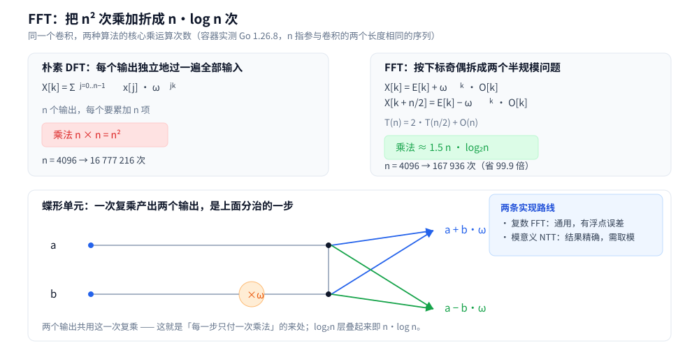

# FFT 与多项式

> 多项式乘法凭什么能从 `O(n²)` 降到 `O(n log n)`？——
> 关键在于**换一种表示**：系数表示换成点值表示后，乘法变成逐点相乘；
> 而 FFT 是这两种表示之间那座 `O(n log n)` 的桥。
>
> ⭐ 边界先说清：本篇讲**算法本体**（表示、分治、单位根、逆变换、NTT），
> 不讲信号处理的物理含义、也不展开数值分析里的误差理论；
> 快速幂 / 逆元 / 原根的数论底座见 [数论基础.md](数论基础.md)，
> 用多项式做计数的套路见 [组合数学.md](组合数学.md)，
> 线性递推的另一条加速路线（矩阵）见 [矩阵快速幂.md](../高级技巧/矩阵快速幂.md)。
>
> 内容整理自个人学习笔记，素材见 [素材清单](../../../素材清单.md)。复杂度口径见 [复杂度分析.md](../基础算法/复杂度分析.md)。

---

## 一、多项式为什么会有两种表示？

**本节要点**：同一件事有两种写法 —— **系数**（按幂次排开）与**点值**（取 n 个 x 得到 n 个 y）。两种表示能互相唯一确定，但**各自擅长的运算不同**。

一个 `n−1` 次多项式，标准写法是**系数表示**：

```text
A(x) = a₀ + a₁x + a₂x² + … + a_{n−1}x^{n−1}        ← 记作向量 [a₀, a₁, …, a_{n−1}]
```

它还有第二种写法 —— **点值表示**：给 `n` 个互不相同的 `x`，各算出一个 `y`：

```text
(x₀, y₀), (x₁, y₁), …, (x_{n−1}, y_{n−1})          其中 y_i = A(x_i)
```

| 表示 | 长相 | 擅长 | 吃力 |
|---|---|---|---|
| **系数表示** | `n` 个系数排开 | 加法（逐项加）、求单点值（秦九韶 `O(n)`） | **乘法 `O(n²)`**（每一项两两相乘） |
| **点值表示** | `n` 组 `(x, y)` | **乘法 `O(n)`**（同一 `x` 处的 `y` 直接相乘） | 求单点值要插值（`O(n²)`） |

⭐ **同一组点值只对应唯一一个 `n−1` 次多项式**（`n` 个点能定死 `n` 个系数）——
所以两种表示是**等价的**，可以按需来回换。

---

## 二、点值表示为什么让乘法变成 O(n)？

**本节要点**：乘法在点值下是**逐点相乘**；把 A、B 都转成同一组 `x` 上的点值，乘完再转回来，就成了「卷积」的另一条路线。

设要算 `C(x) = A(x) · B(x)`，其中 `A`、`B` 的次数都是 `n−1`，那么 `C` 的次数是 `2n−2`，需要 `2n−1` 个点才能定死它。

```text
① 取 2n−1 个互不相同的 x
② 求值：得到 A 的 2n−1 个点值与 B 的 2n−1 个点值
③ 逐点相乘：C(x_i) = A(x_i) · B(x_i)              ← 只要 2n−1 次乘法，O(n)
④ 插值：把 C 的 2n−1 个点值转回系数表示        ← 这一步很贵，朴素要 O(n²)
```

⚠️ **瓶颈在 ② 和 ④**：朴素的「按定义求值」和「插值」都是 `O(n²)`，绕一圈并没有变快。
**FFT 的全部价值，就是把这两步都压到 `O(n log n)`** —— 而它靠的是**精心挑选那组 `x`**。

系数表示下逐对相乘、结果按下标相加，得到的正是**卷积**：

```text
c[k] = Σ a[i] · b[j]        其中 i + j = k
```

所以「快速多项式乘法」与「快速卷积」是同一件事的两种说法。

---

## 三、FFT 凭什么能把「求值」做到 O(n log n)？

**本节要点**：选**单位根**作求值点，则「偶次项」与「奇次项」的求值可以互相复用 —— 一个规模为 n 的问题拆成两个 n/2 的问题，叠起来就是 `n log n`。

### 3.1 分治：按下标奇偶拆

把 `A(x)` 按**下标奇偶**分成两半：

```text
A(x) = A_even(x²) + x · A_odd(x²)

其中 A_even 收集偶数次项的系数，A_odd 收集奇数次项的系数
```

这样一来，求 `A(x)` 就能靠求两个**半规模**多项式在 `x²` 处的值拼出来。
但如果只是这样，`n` 个不同的 `x` 会变成 `n` 个不同的 `x²` —— 规模没减小。**关键在于选点**。

### 3.2 单位根：让 n 个点塌成 n/2 个

取 `ω = e^{2πi/n}`（**n 次单位根**），令求值点就是 `ω⁰, ω¹, …, ω^{n−1}`。它的两条性质是分治能成立的全部原因：

```text
① 折半性：ω^{k + n/2} = −ω^k          → 相隔 n/2 的两个点，平方后相同，值互为相反数
② 平方仍是单位根：ω^{2k} = e^{2πi·k/(n/2)}   → 平方后只剩 n/2 个不同的值
```

于是「`n` 个点」塌成「`n/2` 个点 + 符号」，递推式成立：

```text
T(n) = 2·T(n/2) + O(n)      →  T(n) = O(n log n)
```

⚠️ **这就是输入长度必须是「2 的幂」的根源** —— 折半要一直折到 1。不够就在高位**补零**（补零不改变乘法结果，却把它撑到 2 的幂）。

### 3.3 蝶形：一步只付一次乘法

每层把输入两两配对，每一对产出两个输出：



```text
上 = a + b·ω
下 = a − b·ω
```

⭐ **两个输出共用这一次复乘**（`b·ω` 只算一次）→ 每层 `n/2` 次复乘、共 `log n` 层 → 正变换约 `n/2·log n` 次。
算上「两次正变换 + 一次逆变换 + 一次点乘」，总量就是实测里的 **`≈1.5 n log₂n`**。

迭代实现的另一半是**位反转置换**：分治递归写出来的下标顺序是「按二进制位倒着排」的，
迭代版必须先把数组按位反转排好，再逐层做蝶形。

### 3.4 实测：换算法到底省了多少次乘法

**✅ 实测口径**：容器 `golang:1.26-alpine`，Go 1.26.8，只用 `math/cmplx` 与标准库、无第三方依赖；
两遍运行逐行相同。口径是**核心乘运算次数**（朴素数整数乘法，FFT 数复数乘法，NTT 数模乘法）——
三者是各自算法里最贵的那个动作，**只比量级、不比绝对纳秒**。

| 长度 n | 朴素 `n²` | FFT / NTT | 省 |
|---|---|---|---|
| 256 | 65 536 | 7 424 | 8.8 倍 |
| 1024 | 1 048 576 | 35 840 | 29.3 倍 |
| 4096 | 16 777 216 | 167 936 | **99.9 倍** |

⭐ **要记住的不是某个数，而是「差距随 n 拉大」**：`n` 翻 4 倍，倍数几乎翻 4 倍（8.8 → 29.3 → 99.9），
因为朴素是 `n²`、FFT 是 `n log n`，比值 `n / log n` 随 `n` 单调增长。

### 3.5 手推对照：小规模先信一遍

```text
(1 + 2x + 3x²) · (4 + 5x)
= 4 + (5 + 8)x + (10 + 12)x² + 15x³
= 4 + 13x + 22x² + 15x³
```

实测三种实现（朴素 / FFT / NTT）都给出 `[4 13 22 15]`，逐项相同 ——
**先在小规模上三法互校，才敢相信 `n` 很大时 FFT 的那个结果**。

---

## 四、怎么从点值转回系数？

**本节要点**：逆变换的结构与正变换**几乎一样**，只有两处不同 —— 单位根取共轭（指数取反）、最后**每一项除以 n**。

```text
DFT  ：X[k] = Σ x[j] · ω^(jk)            （j 从 0 到 n−1）
IDFT ：x[j] = (1/n) · Σ X[k] · ω^(−jk)   （k 从 0 到 n−1）
```

⭐ **「除以 n」是最常被漏掉的一步** —— 漏了它，乘出来的系数会整体放大 `n` 倍，
而代码**不报错、只是结果全错**（这类错误只能靠小规模对照发现）。

⚠️ 另一个必查项是**补零到 2 的幂**：如果长度没补够，点值相乘得到的是**循环卷积**
（下标超过长度会「绕回来」加到前面），而不是线性卷积 —— 结果看似合理、实则整段偏移。

---

## 五、系数是整数、要求精确时怎么办？

**本节要点**：把单位根换成**模意义下的原根**，浮点变成整数运算 —— 这就是 NTT，代价是必须取模、且模要挑对。

FFT 用复数，天然带浮点误差；而在「系数与结果都是整数、且要对质数取模」的题里，
我们需要**精确**。做法是把 `ω` 换成模 `p` 下的一个**阶恰为 `n` 的元素** —— 也就是**原根 `g`**：

```text
ω_n  ↔  g^{(p−1)/n} mod p          要求 n | (p−1)
```

⚠️ **这就是 NTT 对模数的硬要求**：`p` 必须形如 `c·2^k + 1`，才能支持长度到 `2^k` 的变换。
竞赛里最常用的是：

```text
998244353 = 119 · 2²³ + 1      原根 3      → 支持长度到 2²³（八百多万）
1004535809 = 479 · 2²¹ + 1     原根 3
```

**✅ 实测口径**（同上容器）：对 `998244353` 验证原根的两条性质 ——
`3^{(p−1)/2} mod p = p−1`（即 `−1`，说明阶不是 `(p−1)/2`），
`3^{p−1} mod p = 1`（说明阶整除 `p−1`）；两式与「`3` 是原根」一致。

**精度对照**（`n=2048`、系数随机取 `0..1000`，实测）：

| 路线 | 与精确整数的关系 |
|---|---|
| **FFT（复数）** | 最大绝对误差 **2.432e−05** → 四舍五入后与朴素**逐项相同** |
| **NTT（模意义）** | 与朴素**逐项相同**（整数运算，无误差） |

⭐ **判据：系数和长度决定误差量级** —— 上面这组参数（结果最大值约 `5.2e8`）误差还在 `1e−5` 量级，
四舍五入安全；但**当系数或长度再放大一个量级，`double` 的尾数（约 15~16 位十进制）就会被吃满**，
这时四舍五入会开始出错 → 要么改 NTT，要么**把系数拆成高低位分几次做**。
⚠️ **不要凭记忆相信「FFT 一定够精确」，要按「结果最大值的十进制位数」估算**。

单位根自身的浮点误差是这种累积的起点，实测（容器）：

```text
n=8 ：|ω^n − 1| = 6.661e−16 ，|ω^(n/2) − (−1)| = 2.776e−16
n=16：|ω^n − 1| = 4.475e−16 ，|ω^(n/2) − (−1)| = 1.665e−16
```

都是机器精度（`~1e−16`）量级 —— 单步很小，**危险的是它在 `log n` 层里被反复放大**。

---

## 六、FFT / NTT 在题里怎么用？

**本节要点**：绝大多数用法都可以归结为「**把问题写成卷积**」——只要结果能表示成 `c[k] = Σ a[i]·b[j] (i+j=k)`，就能上 FFT。

| 套路 | 把什么写成卷积 | 在哪类题里出现 |
|---|---|---|
| **大整数乘法** | 数字看成系数（低位在前） | 手写高精度乘法；⚠️ 之后要**逐位进位** |
| **多项式乘法 / 分治 NTT** | 直接就是卷积 | 生成函数题、多项式求逆 / 求导的底层 |
| **模式匹配（模糊匹配）** | 把字符编码成数值，用卷积统计「不匹配个数」 | 带通配符的字符串匹配 |
| **组合计数** | 生成函数的乘积，系数即方案数 | 多种物品组合计数（见 [组合数学.md](组合数学.md)） |
| **集合的并卷积 / 异或卷积** | 换一种变换（如 FWT，快速沃尔什变换） | 位运算版本的卷积类题 |

⭐ **判断顺序**：

```text
① 能不能写成 Σ a[i]·b[i+j] 这种「下标相加」的形状？  不能 → 不是卷积，别硬套
② 长度多大？ 小到 n² 能用 → 直接朴素，别为 1e3 上 FFT
③ 系数是整数且要取模吗？ 是 → 直接 NTT；只做数值近似 → FFT
```

⚠️ **别为小数据上 FFT**：实测里 `n` 小的时候 FFT 的常数开销（补零、位反转、三次变换）反而更重，
`n²` 直接算更省事 —— **FFT 的收益要到 `n` 上千才明显**。

---

## 使用：这些工具在工程里以什么形式出现

**本节要点**：你大概率不会手写 FFT，但**要知道它藏在哪些地方**，才不至于在该用它的时候绕远路。

| 场景 | 它在哪里起作用 | 说明 |
|---|---|---|
| **大数乘法** | 多数大整数库在超过某长度后，先换 Karatsuba / Toom-Cook，再往上换 FFT 类算法 | ⚠️ **具体切换阈值随库与版本变化，以各库源码 / 文档为准** |
| **信号与图像处理** | 时域 ↔ 频域互转、滤波、频谱分析 | FFT 的「主场」，`ω` 在这里有明确的物理含义 |
| **神经网络卷积** | 大卷积核时用 FFT 把卷积换成点乘 | 小卷积核通常直接算更快，与第六节的判据一致 |
| **音频指纹 / 相似度** | 先做频谱，再在频域上比对 | 「把不好比的东西换到好比的域」这一思想的典型 |

⚠️ **本篇的写法说明**：上面都是**按算法性质给出的判断**，示意范围而不是某个库的实现细节 ——
涉及具体库的阈值与版本，一律**以官方文档 / 源码为准**。

---

## 延伸追问

- **多项式卷积和「循环卷积」差在哪？** → 补零到 `≥ n+m−1` 就是线性卷积；补不够，下标超过长度会绕回来叠加，得到循环卷积 —— 这是最经典的静默错误。
- **FFT 为什么要求长度是 2 的幂？** → 折半要一直折到 1，否则每层拆不出两个等长子问题；不够就补零。
- **逆变换和正变换差几步？** → 两步：单位根取共轭（指数反号）、结果每项除以 `n`。结构完全相同，代码可以复用。
- **NTT 的模为什么要挑 `c·2^k+1`？** → 只有 `n | (p−1)` 时，模 `p` 下才存在阶恰为 `n` 的原根幂 `g^{(p−1)/n}`；这个模形状保证了对足够大的 `2^k` 成立。
- **FFT 的结果什么时候会出错？** → 当「结果最大值的十进制位数」逼近 `double` 的 15~16 位有效数字时，四舍五入开始出错；对策是改 NTT 或把系数拆成高低位。
- **为什么小数据不用 FFT？** → 补零、位反转、三次变换都是固定开销；`n` 上千后 `n²` 才明显更贵。
- **FFT 和矩阵快速幂是什么关系？** → 都是「加速线性递推 / 卷积」的工具：矩阵快速幂加速**递推的第 n 项**（[矩阵快速幂.md](../高级技巧/矩阵快速幂.md)），FFT 加速**两个序列的卷积**；一个在状态维度上加速，一个在长度维度上加速。

---

## 关联

- [数论基础.md](数论基础.md) — 快速幂 / 模逆元 / 原根的数论底座（NTT 全建立在它上面）
- [组合数学.md](组合数学.md) — 生成函数与「数方案」；卷积的系数就是计数题的答案
- [矩阵快速幂.md](../高级技巧/矩阵快速幂.md) — 另一条「线性递推加速」路线，与 FFT 各管一个维度
- [复杂度分析.md](../基础算法/复杂度分析.md) — `O(n²)` 与 `O(n log n)` 的分水岭、递推式展开（主定理）的口径
- [README.md](README.md) — 数学基础目录导读（本篇在其中的位置）
- [README.md](../README.md) — 算法目录总导读
- [素材清单.md](../../../素材清单.md) — 素材来源登记
> 反向引用（本篇被下列文档引到）：[计算几何.md](计算几何.md)
