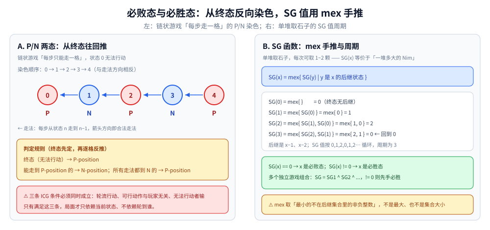
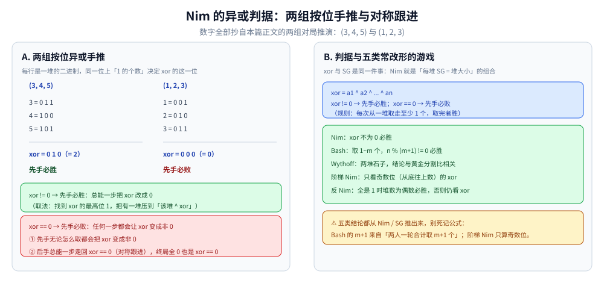

# 博弈论

> 公平组合游戏（ICG）：两人轮流操作，无法操作者输 —— 用 Nim 和 SG 函数
> 判断必胜必败。
>
> ⭐ 边界先说清：本篇讲公平组合游戏（ICG）。
> 非公平博弈（如扑克）需要更复杂的分析。
> 概率博弈见 [概率与期望.md](概率与期望.md)。
>
> 内容整理自个人学习笔记，素材见 [素材清单](../../../素材清单.md)。复杂度口径见 [复杂度分析](../基础算法/复杂度分析.md)。

---

## 一、什么样的游戏算公平组合游戏？

**本节要点**：ICG 的三个条件 —— 轮流行动、可行动作与"你是谁"无关、无法行动者输。

**三个条件**：

1. 两名玩家轮流行动
2. 每个局面的可选行动集合与玩家无关
3. 无法行动者输（normal play）

三条同时满足，局面才只依赖"当前状态"而不依赖"轮到谁"，后面的 P/N 染色与 SG 函数才成立。

---

## 二、必胜态与必败态怎么判定？

**本节要点**：从终态出发给游戏图反向染色 —— 能到 P 的染 N，只能到 N 的染 P。

- **P-position（必败态）**：当前玩家无论怎么走都输
- **N-position（必胜态）**：当前玩家存在一种走法进入 P-position

**判定规则**：

- 终态（无法行动）是 P-position
- 能到达 P-position 的是 N-position
- 所有走法都到 N-position 的是 P-position

最简单的"每次只能走一格"链状游戏，染色结果交替出现：

```text
状态:   0(终态)   1     2     3     4
染色:     P       N     P     N     P
依据: 面对 0 无法行动 → P；
      1 能一步走进 P → N；2 只能走进 N → P；以此交替
```



图怎么读：左面板是上表的图形版 —— 状态 0 到 4，从终态 0 起往回交替染出 P、N、P、N、P，向左的箭头就是合法走法「每步从状态 n 走到 n−1」；注意图的配色约定，**必败态 P 染红、必胜态 N 染蓝**。右面板预先给出第四节要用的「每次可取 1~2 颗」的 mex 手推：SG 值 0, 1, 2, 0、周期为 3。

---

## 三、Nim 为什么异或一把就能判定？

**本节要点**：n 堆取石子先手胜负 = 各堆大小的异或是否为 0；xor 为 0 时后手总能"对称跟进"。

**规则**：n 堆石子，每堆 `a_i` 个，每次从一堆取走任意数量（至少 1 个），取完者胜。

**结论**：

- `xor = a1 ^ a2 ^ ... ^ an`
- `xor != 0` → 先手必胜
- `xor == 0` → 先手必败

```go
func nimWin(piles []int) bool {
	xor := 0
	for _, p := range piles {
		xor ^= p
	}
	return xor != 0
}
```

两组对局各按位手推：

```text
(3, 4, 5)                    (1, 2, 3)
  3 = 0 1 1                    1 = 0 0 1
  4 = 1 0 0                    2 = 0 1 0
  5 = 1 0 1                    3 = 0 1 1
xor = 0 1 0 (= 2)            xor = 0 0 0 (= 0)
先手必胜                      先手必败
```



图怎么读：左面板是正文两组对局的按位手推 —— (3, 4, 5) 得 xor = 0 1 0 (= 2)，先手必胜；(1, 2, 3) 得 xor = 0 0 0 (= 0)，先手必败。绿框是必胜的一半：xor != 0 时总能一步把 xor 改成 0；红框是必败的一半：xor == 0 时任何一步都会让 xor 变成非 0，后手总能一步"对称跟进"走回 0。右面板汇总判据式与五类常改形的游戏，对应第五节的表。

---

## 四、SG 函数和 mex 是干什么的？

**本节要点**：SG 把任意 ICG 局面压成一个非负整数（"等价于多大的一堆 Nim"），多游戏组合时用异或合并。

**定义**：`SG(x) = mex{SG(y) | y 是 x 的后继}`

- `mex(S)` = 最小的不在 S 中的非负整数
- `SG(x) == 0` → x 是必败态
- `SG(x) != 0` → x 是必胜态

**SG 定理**：

- 多个独立游戏的组合，`SG = SG1 ^ SG2 ^ ...`
- `SG != 0` → 先手必胜

**计算**（`next(x)` 是"枚举 x 的全部后继状态"，按具体题意实现）：

```go
func sg(x int, memo []int) int {
	if memo[x] != -1 {
		return memo[x]
	}
	seen := map[int]bool{}
	for _, y := range next(x) {
		seen[sg(y, memo)] = true
	}
	g := 0
	for seen[g] {
		g++
	}
	memo[x] = g
	return g
}
```

以"每次可取 1~2 颗的单堆取石子"手推前几个 SG 值：

```text
SG(0) = mex{ }              = 0
SG(1) = mex{ SG(0) }        = mex{ 0 }     = 1
SG(2) = mex{ SG(1), SG(0) } = mex{ 1, 0 }  = 2
SG(3) = mex{ SG(2), SG(1) } = mex{ 2, 1 }  = 0   ← 回到 0，周期为 3
```

第二节末图的右面板就是这段手推的图形版：SG 值在 x = 3 处回到 0，形成周期 3，SG == 0 的局面即必败态。

---

## 五、典型博弈游戏各有什么结论？

**本节要点**：五类常改形的游戏，判定式都从 Nim / SG 推出来。

| 游戏 | 结论 |
|---|---|
| Nim | xor 不为 0 必胜 |
| Bash 博弈 | 取 1~m 个，n % (m+1) != 0 必胜 |
| Wythoff 博弈 | 两堆石子，黄金分割比相关 |
| 反 Nim | 全是 1 的堆时，堆数为偶数先手必胜；否则仍按 xor != 0 必胜判定 |
| 阶梯 Nim | 奇数位 xor |

---

## 六、博弈论工具能用在哪？

**本节要点**：一张表把本篇模型对号入座。

| 场景 | 说明 |
|---|---|
| 取石子游戏 | Nim 直接应用 |
| 棋盘博弈 | SG 函数 |
| 公平组合游戏 | SG 定理 |
| 多堆独立游戏 | SG 异或 |
| 拆分数游戏 | 递归求 SG |

---

## 延伸追问

- **SG 函数为什么用 mex？** → 因为状态值需要「最小不可达」来保证必胜/必败判定。
- **Nim 的 xor 为什么能判定？** → 因为 xor 为 0 时后手能对称操作，保持 xor 为 0。
- **SG 定理为什么成立？** → 因为 SG 值等价于 Nim 堆的大小，多个游戏组合等价于多堆 Nim。
- **Bash 博弈为什么是 n % (m+1)？** → 每轮两人合计可取 m+1 个，取模判断。
- **反 Nim 为什么要单独讨论"全是 1"？** → 策略在出现 ≥ 2 的堆时与普通 Nim 一致，仍按 xor != 0 必胜；只有终局退化成全是 1 时胜负条件反转，才改数堆数奇偶（偶数堆先手胜）。
- **博弈论在工程中的应用？** → 游戏 AI、策略分析、资源竞争建模。

---

## 关联

- [组合数学.md](组合数学.md) — 组合计数
- [概率与期望.md](概率与期望.md) — 随机博弈与确定性 ICG 相对照
- [状态压缩DP.md](../动态规划/状态压缩DP.md) — 状态枚举与 DP 技巧
- [位运算.md](../基础算法/位运算.md) — Nim 判定式里异或操作的底层
- [README.md](README.md) — 数学基础导读
