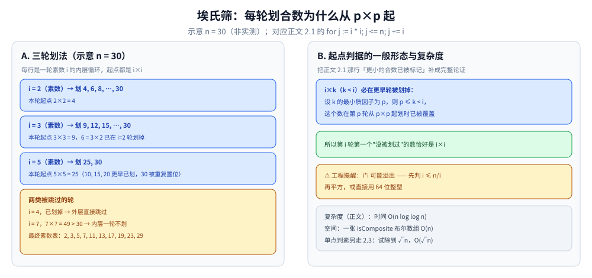
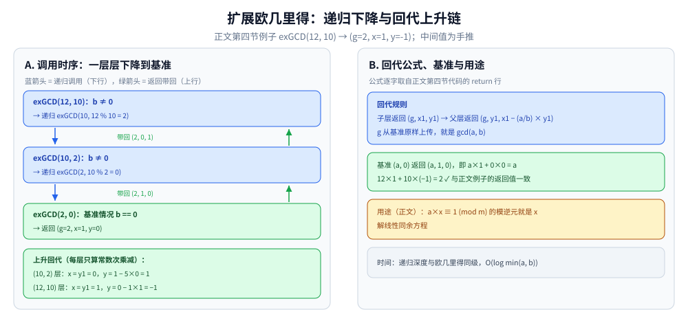

# 数论基础

> 编程中常用的数论工具：GCD / 素数筛 / 快速幂 / 模逆元 / 扩展欧几里得 ——
> 它们是加密、哈希、组合计数的基础。
>
> ⭐ 边界先说清：本篇只讲**工程与竞赛最常用的数论算法**，不展开证明。
> 组合数学（排列组合、容斥）另开一篇，见 [组合数学.md](组合数学.md)；
> 大数运算见各语言的 big.Int 库。
>
> 内容整理自个人学习笔记，素材见 [素材清单](../../../素材清单.md)。复杂度口径见 [复杂度分析](../基础算法/复杂度分析.md)。

---

## 一、辗转相除为什么能求出 GCD？

**本节要点**：GCD 用 `(a, b) → (b, a mod b)` 一路收缩到余数为 0；LCM 必须先除后乘，防中间溢出。

### 1.1 GCD：欧几里得算法

```go
func gcd(a, b int) int {
	for b != 0 {
		a, b = b, a%b
	}
	return a
}
```

拿 `gcd(48, 18)` 逐轮走一遍这段代码：

```text
初始   a = 48, b = 18
第 1 轮  b ≠ 0 → (a, b) = (18, 48 % 18 = 12)
第 2 轮  b ≠ 0 → (a, b) = (12, 18 % 12 =  6)
第 3 轮  b ≠ 0 → (a, b) = ( 6, 12 %  6 =  0)
第 4 轮  b == 0 → 退出，返回 a = 6
```

- 正确性依据：`a` 与 `b` 的公约数集合 = `b` 与 `a mod b` 的公约数集合，所以最大公约数不变；
- 时间 O(log min(a, b))。

### 1.2 LCM：为什么先除后乘？

```go
func lcm(a, b int) int {
	return a / gcd(a, b) * b // 先除后乘，避免溢出
}
```

- ⚠️ **lcm 先除后乘**：`a * b / gcd(a, b)` 的写法会让中间结果 `a * b` 先溢出，`a / gcd * b` 则始终不超过约束。
- 依据：`gcd(a, b)` 整除 `a`，先除是整除，最后 `* b` 的结果恰为 `lcm(a, b)` —— 中间值不会超过答案本身；先乘则中间值 `a * b` 是答案的 `gcd(a, b)` 倍。

---

## 二、筛素数为什么要从 i*i 开始、只筛一次？

**本节要点**：埃氏筛 O(n log log n) 靠"从 `i*i` 起标"，线性筛 O(n) 靠"每个合数只被最小质因子筛一次"，单点判素用 `i*i <= n` 试除到 √n。

### 2.1 埃氏筛

```go
func sieve(n int) []int {
	isComposite := make([]bool, n+1)
	var primes []int
	for i := 2; i <= n; i++ {
		if !isComposite[i] {
			primes = append(primes, i)
			for j := i * i; j <= n; j += i { // 从 i*i 开始
				isComposite[j] = true
			}
		}
	}
	return primes
}
```

- 时间 O(n log log n)
- ⚠️ **从 `i*i` 开始**：`i*2, i*3, …, i*(i-1)` 这些更小的合数已经被比 `i` 小的素数标记过了。
- 论证的一般形态：设 `k` 的最小质因子为 `p`，则 `i*k` 满足 `p ≤ k < i`，这个数在第 `p` 轮从 `p*p` 起划时已被划掉 —— 所以第 `i` 轮第一个"没被划过"的数恰好是 `i*i`。
- ⚠️ 工程提醒：`i*i` 可能溢出 —— 先判 `i <= n/i` 再平方，或用 64 位整型。



图怎么读：左面板是示意 n = 30 的三轮划数（非实测）—— i = 2 从 4 起划、i = 3 从 9 起划（6 = 3×2 已在 i=2 轮划掉）、i = 5 只从 25 起划（10, 15, 20 更早已划，30 被重复置位）；到 i = 7 时 7×7 = 49 > 30，内层一轮不划。右面板把起点论证写成一般形态（更小的倍数由最小质因子那一轮负责），并列出 O(n log log n) 与 `i*i` 防溢出两条工程注意。

### 2.2 线性筛（欧拉筛）

```go
func linearSieve(n int) []int {
	isComposite := make([]bool, n+1)
	var primes []int
	for i := 2; i <= n; i++ {
		if !isComposite[i] {
			primes = append(primes, i)
		}
		for _, p := range primes {
			if i*p > n {
				break
			}
			isComposite[i*p] = true
			if i%p == 0 {
				break // ⭐ 关键：每个合数只被最小质因子筛一次
			}
		}
	}
	return primes
}
```

以 `n = 15` 手推"每个合数只被最小质因子筛一次"：

```text
i=2  素数 → 筛 4（2×2，随后 2%2==0 停）
i=3  素数 → 筛 6（3×2）、9（3×3，随后 3%3==0 停）
i=4  已筛   → 筛 8（4×2，随后 4%2==0 停；12=4×3 不在这里筛）
i=5  素数 → 筛 10（5×2）、15（5×3）；试 p=5 时 25 > 15 跳出
i=6  已筛   → 筛 12（6×2 —— 12 由最小质因子 2 在这一轮被筛掉）
```

- 时间 O(n)：每个合数恰被"最小质因子 p × (合数/p)"筛到一次，上面的 12 不在 `i=4` 轮筛、留到 `i=6` 轮由 `p=2` 筛，正是这条不变式的体现。

### 2.3 单个数判素

```go
func isPrime(n int) bool {
	if n < 2 {
		return false
	}
	for i := 2; i*i <= n; i++ { // ⚠️ i*i <= n，避免开方
		if n%i == 0 {
			return false
		}
	}
	return true
}
```

- 时间 O(√n)；用 `i*i <= n` 而不是 `i <= sqrt(n)`，避开浮点开方的精度问题。

---

## 三、快速幂是怎么把指数折半的？

**本节要点**：按指数的二进制位从低到高扫描，一位一乘、每轮底数自乘，把 O(exp) 次乘法压成 O(log exp) 次。

```go
func powMod(base, exp, mod int) int {
	res := 1
	base %= mod
	for exp > 0 {
		if exp&1 == 1 {
			res = res * base % mod
		}
		base = base * base % mod
		exp >>= 1
	}
	return res
}
```

以 `3^13 mod 7`（13 = 1101b）逐轮手推：

```text
步骤  exp      exp 末位   动作              res   base
初始  13       —        初始化             1     3
1     13(1101) 1        res ×= base → 3    3     2   ← base 自乘 3×3 mod 7 = 2
2     6 (110)  0        只自乘 base        3     4   ← 2×2 mod 7 = 4
3     3 (11)   1        res ×= base → 5    5     2   ← 3×4 mod 7 = 5；base 4×4 mod 7 = 2
4     1 (1)    1        res ×= base → 3    3     4   ← 5×2 mod 7 = 3
结果  3^13 mod 7 = 3（校验：3^8·3^4·3^1 ≡ 2×4×3 = 24 ≡ 3 (mod 7)）
```

- 时间 O(log exp)
- ⚠️ **乘法可能溢出**：mod 很大时用 `math/big` 或 128 位乘法。

---

## 四、扩展欧几里得除了求 GCD 还能干什么？

**本节要点**：求 `ax + by = gcd(a, b)` 的一组整数解，是模逆元与线性同余方程的工具。

```go
func exGCD(a, b int) (g, x, y int) {
	if b == 0 {
		return a, 1, 0
	}
	g, x1, y1 := exGCD(b, a%b)
	return g, y1, x1 - (a/b)*y1
}
```

例：`exGCD(12, 10)` 返回 `(g=2, x=1, y=-1)`，即 `12×1 + 10×(−1) = 2`，等式可直接验算。

时间：递归深度与欧几里得同级，O(log min(a, b))，回代每层只有常数次乘减。



图怎么读：左面板是 exGCD(12, 10) 的调用时序 —— 蓝箭头逐层下降到基准 exGCD(2, 0)，它返回 (2, 1, 0)；绿箭头逐层上升，按 `(g, y1, x1 − (a/b) × y1)` 回代，(10, 2) 层得 (2, 0, 1)，(12, 10) 层得 (2, 1, −1)，验算 12×1 + 10×(−1) = 2 正是上文的返回值。右面板汇总回代规则、基准形态与模逆元、解同余两个用途。中间值为手推，非实测。

**用途**：

- 求模逆元：`a*x ≡ 1 (mod m)` → `x = exGCD(a, m)` 的 x
- 解线性同余方程

---

## 五、模运算里怎么做"除法"？

**本节要点**：模意义下的除法 = 乘模逆元；三种求法按"模数是否素数、要不要连续求"选。

| 方法 | 条件 | 复杂度 |
|---|---|---|
| 扩展欧几里得 | gcd(a, m) = 1 | O(log m) |
| 费马小定理 | m 为素数 | O(log m) |
| 线性递推 | 连续求 1..n 的逆元 | O(n) |

**费马小定理**：m 为素数时，`a^(m-1) ≡ 1 (mod m)` → `a^(-1) = a^(m-2) mod m`。

连续求逆元（`inv[i] = (m - m/i) * inv[m%i] % m`）的阶乘 + 逆元预处理用法，见 [组合数学.md](组合数学.md) 第 2.1 节。

---

## 六、数论工具在工程里通常用在哪？

**本节要点**：一张表把上面五节的工具对号入座到真实场景。

| 场景 | 用到的工具 |
|---|---|
| 分数化简 | GCD |
| 统计素数 | 筛法 |
| RSA 加密 | 快速幂 + 模逆元 + 扩展欧几里得 |
| 组合数取模 | 阶乘 + 逆元 |
| 循环节 | GCD / LCM |
| 同余方程 | 扩展欧几里得 |

---

## 延伸追问

- **为什么单个数判素是 O(√n)？** → 若 n = a\*b，a ≤ b，则 a ≤ √n，所以只需试到 √n。
- **线性筛为什么是 O(n)？** → 每个合数只被它的最小质因子筛一次。
- **快速幂为什么是 O(log n)？** → 每次把指数右移一位，共 log n 次。
- **模逆元有什么用？** → 在模运算下实现「除法」，组合数取模、RSA 都依赖它。
- **费马小定理求逆元的条件？** → 模数必须是素数；非素数用扩展欧几里得。
- **扩展欧几里得为什么能回代出解？** → 基准 (a, 0) 返回 (a, 1, 0) 使 a×1 + 0×0 = a 成立；每层用 `a mod b = a − (a/b)×b` 把子层等式 `b×x1 + (a mod b)×y1 = g` 换成父层的 `a×y1 + b×(x1 − (a/b)×y1) = g`，等式逐层保持。
- **乘法溢出怎么处理？** → 用 int64、`math/bits` 的乘法，或 `math/big`。

---

## 关联

- [位运算.md](../基础算法/位运算.md) — 快速幂按二进制位扫描的底层操作
- [字符串哈希.md](../字符串匹配/字符串哈希.md) — 大质数取模与滚动哈希同源的模运算技巧
- [背包问题.md](../动态规划/背包问题.md) — 组合计数类 DP
- [组合数学.md](组合数学.md) — 组合数取模直接依赖本篇的逆元与快速幂
- [矩阵快速幂.md](../高级技巧/矩阵快速幂.md) — 本篇快速幂的「作用到矩阵」升级版：幂次框架不变，乘法换成矩阵乘
- [README.md](README.md) — 数学基础导读
- [FFT与多项式.md](FFT与多项式.md) — **快速幂与逆元的另一个用武之地**：NTT 的「单位根」就是模意义下的原根
> 反向引用（本篇被下列文档引到）：[概率与期望.md](概率与期望.md)
