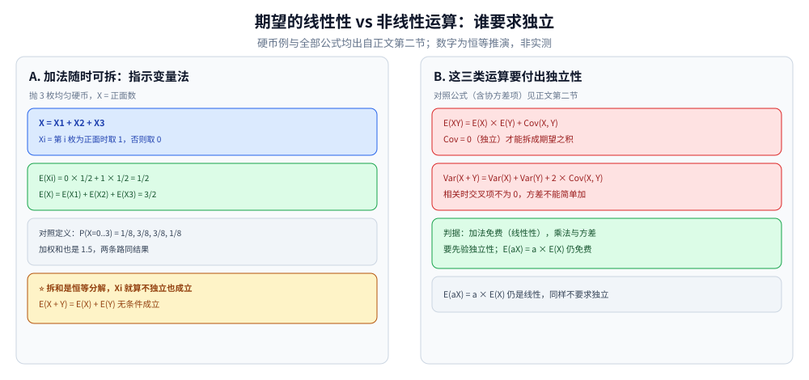
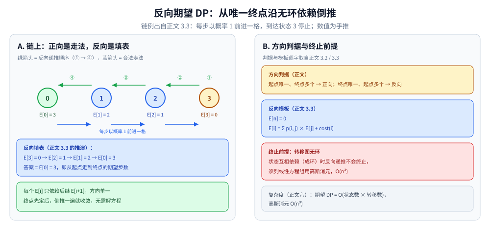

# 概率与期望

> 编程中的概率工具：条件概率、贝叶斯、期望的线性性、期望 DP ——
> 是游戏、风控、随机算法的基础。
>
> ⭐ 边界先说清：本篇讲常用概率计算与期望 DP。
> 组合数学见 [组合数学.md](组合数学.md)；
> DP 基础见 [线性DP.md](../动态规划/线性DP.md)。
>
> 内容整理自个人学习笔记，素材见 [素材清单](../../../素材清单.md)。复杂度口径见 [复杂度分析](../基础算法/复杂度分析.md)。

---

## 一、条件概率与贝叶斯公式怎么串起来？

**本节要点**：一张表摆清"条件 → 全概率 → 逆概率"的推导链：条件概率是底座，全概率把分情况摊平，贝叶斯把因果反过来。

| 概念 | 公式 |
|---|---|
| 条件概率 | `P(A\|B) = P(AB) / P(B)` |
| 独立事件 | `P(AB) = P(A) × P(B)` |
| 全概率公式 | `P(A) = Σ P(A\|Bi) × P(Bi)` |
| 贝叶斯公式 | `P(Bi\|A) = P(A\|Bi) × P(Bi) / P(A)` |
| 容斥 | `P(A∪B) = P(A) + P(B) − P(AB)` |

贝叶斯公式的分母 `P(A)` 正是对一组完备事件 `{Bi}` 套全概率公式得到的。

---

## 二、期望的线性性为什么最重要？

**本节要点**：`E(X + Y) = E(X) + E(Y)` **不要求独立**，因此可以把复杂随机变量拆成简单变量之和逐个算。

**定义**：`E(X) = Σ x × P(X = x)`

**线性性**（⭐ 最重要）：

```text
E(X + Y) = E(X) + E(Y)     // 不要求独立！
```

**其他性质**：

- `E(aX) = a × E(X)`
- `E(XY) = E(X) × E(Y)`（当 X、Y 独立时）

⭐ **线性性只覆盖"和"** —— 下面两个"拆"是要付出独立性代价的非线性运算：

```text
E(XY) = E(X) × E(Y) + Cov(X, Y)            // 只有 Cov = 0（独立/不相关）才能拆成期望之积
Var(X + Y) = Var(X) + Var(Y) + 2Cov(X, Y)  // 相关时交叉项不为 0，方差不能简单相加
```

⭐ **期望的线性性是最常用的工具**：把复杂随机变量拆成简单随机变量之和。

指示变量手推一例 —— "抛 3 枚均匀硬币，正面数 X 的期望"：

```text
X = X1 + X2 + X3，Xi = 第 i 枚为正面时取 1，否则取 0
E(Xi) = 0 × 1/2 + 1 × 1/2 = 1/2
E(X)  = E(X1) + E(X2) + E(X3) = 3/2
（对照定义：P(X=0..3) = 1/8, 3/8, 3/8, 1/8，加权和也是 1.5）
```



图怎么读：左面板是硬币例的指示变量路线 —— X = X1 + X2 + X3、E(Xi) = 1/2、E(X) = 3/2，对照定义路线（分布 1/8, 3/8, 3/8, 1/8）加权和同为 1.5，这条"拆和"不要求任何独立性；右面板两个红框就是上面推演块里的两条带协方差项公式 —— 拆"积的期望"或加"方差"必须先验 Cov(X, Y) = 0，而 `E(aX) = a × E(X)` 仍免费。

---

## 三、期望 DP 该正向推还是反向推？

**本节要点**：两个方向算的期望语义不同 —— 正向是"从起点走到 state"，反向是"从 state 走到终点"；选哪个取决于哪一端唯一。

### 3.1 正向期望 DP

从起点推终点：`E[state]` = 从起点到 state 的期望。

### 3.2 反向期望 DP

从终点推起点：`E[state]` = 从 state 到终点的期望。

⭐ **判据**：

- 起点唯一、终点多个 → 正向
- 终点唯一、起点多个 → 反向（更常见）
- ⚠️ 两个方向都默认**状态转移无环**：状态互相依赖（成环）时倒推不会终止，须列线性方程组用高斯消元解（见第五节技巧表）

### 3.3 模板

```go
// 反向期望 DP
// E[n] = 0
// E[i] = Σ p(i, j) × E[j] + cost(i)
```

链上的退化情形手推填表方向（每步以概率 1 前进一格，到达状态 3 停止）：

```text
E[3] = 0            ← 终点边界
E[2] = E[3] + 1 = 1 ← 从终点反向递推
E[1] = E[2] + 1 = 2
E[0] = E[1] + 1 = 3 ← 起点，即答案
```



图怎么读：绿箭头是反向递推顺序 ①→④ —— 先定终点边界 E[3] = 0，再倒推 E[2] = 1、E[1] = 2、E[0] = 3；蓝箭头是合法走法（每步以概率 1 前进一格），方向与填表恰好相反。每个 E[i] 只依赖后继 E[i+1]，依赖方向单一、无环，所以倒推一遍即收敛；右面板红框提醒：一旦成环就要换高斯消元 O(n³)。

---

## 四、哪些是典型的概率期望问题？

**本节要点**：八类常见模型各自对应第五节的一种技巧。

| 题 | 思路 |
|---|---|
| 抛硬币期望次数 | 几何分布 |
| 掷骰子期望 | 期望线性性 |
| 收集卡片问题 | 期望线性性 + 调和级数 |
| 随机游走期望步数 | 反向期望 DP |
| 游戏胜率 | 概率 DP |
| 抽卡期望 | 期望线性性 |
| 生日悖论 | 概率计算 |
| 期望逆序对 | 期望线性性 |

---

## 五、常用解题技巧有哪些？

**本节要点**：五件工具按"能不能拆成和、状态有没有环"来选。

| 技巧 | 说明 |
|---|---|
| **期望线性性** | 把复杂变量拆成简单变量之和 |
| **指示变量** | `X = Σ Xi`，其中 `Xi` 是 0/1 指示 |
| **反向 DP** | 从终点向起点递推 |
| **高斯消元** | 状态之间互相依赖时 |
| **几何分布** | 重复试验直到成功的期望次数 = 1/p |

---

## 六、各方法的复杂度是多少？

**本节要点**：线性性最便宜，DP 看状态与转移规模，成环上消元则是立方。

| 方法 | 时间 |
|---|---|
| 期望线性性 | O(n) |
| 期望 DP | O(状态数 × 转移数) |
| 高斯消元 | O(n³) |

---

## 延伸追问

- **期望的线性性为什么成立？** → 期望是线性算子，与是否独立无关。
- **方差为什么不能简单相加？** → Var(X+Y) 含交叉项 2Cov(X, Y)，独立（不相关）时才为 0 —— 线性性"对和成立、对积与方差不成立"的边界正在这里。
- **期望 DP 为什么常反向？** → 因为终点唯一，反向递推能避免处理多个终点。
- **什么时候用高斯消元？** → 状态之间有环，不能直接 DP。
- **期望和概率什么关系？** → 期望是「概率加权平均」，概率是单个事件的概率。
- **几何分布的期望为什么是 1/p？** → 每次成功概率 p，期望次数 = 1/p。

---

## 关联

- [组合数学.md](组合数学.md) — 组合计数
- [数论基础.md](数论基础.md) — 模逆元（概率取模时用）
- [线性DP.md](../动态规划/线性DP.md) — DP 基础
- [博弈论.md](博弈论.md) — 随机博弈与确定性的公平组合游戏相对照
- [README.md](README.md) — 数学基础导读
