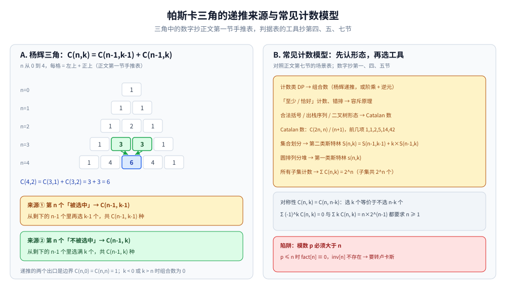
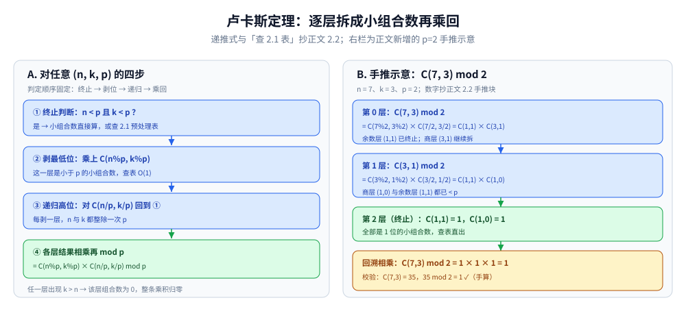
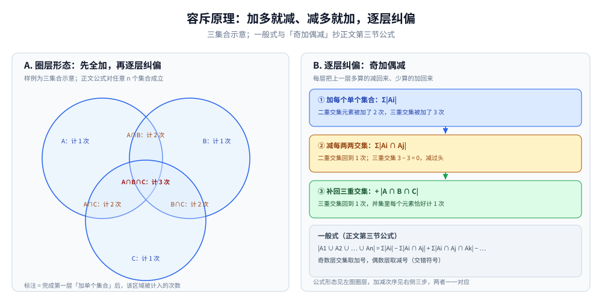

# 组合数学

> 编程中的组合计数工具：排列组合、容斥原理、Catalan 数、斯特林数、
> 卢卡斯定理 —— 是计数类 DP、概率问题的基础。
>
> ⭐ 边界先说清：本篇讲常用组合数学工具，不展开证明。
> 数论基础见 [数论基础.md](数论基础.md)；
> 概率与期望见 [概率与期望.md](概率与期望.md)。
>
> 内容整理自个人学习笔记，素材见 [素材清单](../../../素材清单.md)。复杂度口径见 [复杂度分析](../基础算法/复杂度分析.md)。

---

## 一、排列组合的基础公式有哪些？

**本节要点**：分清零不相干的 `P`（有序）与 `C`（无序），并记住杨辉三角递推 —— 它是所有预处理实现的根。

| 公式 | 含义 |
|---|---|
| `P(n, k) = n! / (n-k)!` | 从 n 个中选 k 个排列 |
| `C(n, k) = n! / (k! (n-k)!)` | 从 n 个中选 k 个组合 |
| `C(n, k) = C(n-1, k) + C(n-1, k-1)` | 杨辉三角递推 |
| `C(n, 0) = C(n, n) = 1` | 边界 |

**性质**：

- `C(n, k) = C(n, n-k)`（对称性）
- `Σ C(n, k) = 2^n`（所有子集个数）

杨辉三角手推一遍（n 从 0 到 4，每格 = 左上 + 正上）：

```text
n=0        1
n=1       1  1
n=2      1  2  1
n=3     1  3  3  1
n=4    1  4  6  4  1    ← C(4,2) = C(3,1) + C(3,2) = 3 + 3 = 6
```



图左半把上面手推表画成三角，绿色箭头演示 C(4,2) = C(3,1) + C(3,2) = 3 + 3 = 6。递推的两个来源就是箭头起点两格：左上格是「第 n 个被选中」（C(n-1, k-1)）、正上格是「第 n 个不被选中」（C(n-1, k)）；两个出口是边界 C(n,0) = C(n,n) = 1，k < 0 或 k > n 时组合数为 0。右半按「先认形态、再选工具」把本篇第一、四、五、七节的模型对号入座，红块提醒 2.1 的前提：模数 p 必须大于 n，否则要转卢卡斯。

---

## 二、组合数取模为什么要用逆元？

**本节要点**：模运算里没有直接除法，`C(n, k) = n!/(k!(n-k)!)` 取模要把除法换成乘逆元；n 不大用阶乘 + 逆元预处理，n 极大而模数是小素数用卢卡斯定理。

### 2.1 阶乘 + 逆元

`powMod`（快速幂取模）的定义见 [数论基础.md](数论基础.md) 第三节。

```go
func initFact(n, mod int) ([]int, []int) {
	fact := make([]int, n+1)
	inv := make([]int, n+1)
	fact[0] = 1
	for i := 1; i <= n; i++ {
		fact[i] = fact[i-1] * i % mod
	}
	inv[n] = powMod(fact[n], mod-2, mod)
	for i := n - 1; i >= 0; i-- {
		inv[i] = inv[i+1] * (i + 1) % mod
	}
	return fact, inv
}

func comb(n, k, mod int, fact, inv []int) int {
	if k < 0 || k > n {
		return 0
	}
	return fact[n] * inv[k] % mod * inv[n-k] % mod
}
```

- 预处理 O(n)，查询 O(1)
- 适用：n ≤ 1e6，mod 为素数
- 逆元数组只算 `inv[n]` 一个快速幂、其余全部递推，靠的是 `inv[i] = inv[i+1] × (i+1)` 这条相邻关系。

### 2.2 卢卡斯定理

当模数 `p` 是较小素数而 `n` 远大于 `p`（阶乘预处理撑不住 n，但撑得住 p）时：

```text
C(n, k) mod p = C(n%p, k%p) × C(n/p, k/p) mod p
```

- 适用：n 极大，p 是素数
- 把大组合数逐层拆成小于 p 的小组合数，小组合数用 2.1 的表直接查。

按位拆分手推一遍（示意：p = 2，n = 7，k = 3）：

```text
第 0 层：C(7,3) mod 2 = C(7%2, 3%2) × C(7/2, 3/2) = C(1,1) × C(3,1)
第 1 层： C(3,1) mod 2 = C(3%2, 1%2) × C(3/2, 1/2) = C(1,1) × C(1,0)
第 2 层：n、k 均不足 p 位 → 终止，C(1,1) = 1，C(1,0) = 1
回溯相乘：1 × 1 × 1 = 1    校验：C(7,3) = 35，35 mod 2 = 1 ✓
```



左栏是对任意 (n, k, p) 固定的四步顺序：终止判断（n 与 k 都小于 p 就查 2.1 表）→ 剥最低位乘上 C(n%p, k%p) → 对高位 C(n/p, k/p) 递归 → 各层结果相乘再 mod p。右栏把上面 p = 2 的手推画成三层递归链，回溯相乘得 1，与 35 mod 2 = 1 对上。任一层出现 k > n，该层组合数即为 0，整条乘积归零。

---

## 三、容斥原理解决什么问题？

**本节要点**：并集大小没法直接加 —— 加多交集就减、减多三重交集就加，逐层纠偏。

**公式**：

```text
|A1 ∪ A2 ∪ ... ∪ An| = Σ|Ai| - Σ|Ai ∩ Aj| + Σ|Ai ∩ Aj ∩ Ak| - ...
```

**典型应用**：

- 1 到 n 中与 m 互质的数个数
- 错排问题
- 有限制的排列计数



左图把公式的前三层画在三个交叠的圆上：完成第一层「加单个集合」后，落在两圆交里的元素被计了 2 次、三圆公共区被计了 3 次。右图逐层纠偏——先减每两两交集（二重交集回到 1 次，但三重交集 3 − 3 = 0 减过头）、再补回三重交集，最终并集里每个元素恰好计 1 次。样例是三集合示意，正文公式对任意 n 个集合按「奇数层加、偶数层减」成立。

---

## 四、Catalan 数为什么到处出现？

**本节要点**：凡是"带'不越过 / 不匹配非法'约束的等量配对计数"，答案往往就是 Catalan 数。

**公式**：

```text
C_n = C(2n, n) / (n+1)
```

**前几项**：1, 1, 2, 5, 14, 42, 132, 429, ...

**典型问题**：

- 括号匹配方案数
- 出栈序列数
- 二叉树形态数
- 凸多边形三角剖分数
- 网格路径不越过对角线

---

## 五、第一类与第二类斯特林数有什么区别？

**本节要点**：同叫"分成 k 份"，第一类份内**有序成环**、第二类份内**无序子集**，递推形状完全不同。

| 类型 | 含义 |
|---|---|
| **第一类** `s(n, k)` | n 个元素分成 k 个**圆排列**的方案数 |
| **第二类** `S(n, k)` | n 个元素分成 k 个**非空子集**的方案数 |

**第二类递推**：

```text
S(n, k) = S(n-1, k-1) + k × S(n-1, k)
```

第 n 个元素要么自成一堆（前一项），要么塞进已有 k 堆的任意一堆（乘 k）。

**贝尔数**：`B_n = Σ S(n, k)`（n 个元素的划分方案数）

---

## 六、要背的组合恒等式有哪些？

**本节要点**：五条最常用的恒等式，杨辉、二项式定理与范德蒙德卷积构成主体。

| 恒等式 | 说明 |
|---|---|
| `C(n, k) = C(n-1, k) + C(n-1, k-1)` | 杨辉恒等式 |
| `Σ C(n, k) = 2^n` | 二项式定理 |
| `Σ (-1)^k C(n, k) = 0` | 交错和 |
| `Σ k C(n, k) = n × 2^(n-1)` | 加权和 |
| `C(m+n, k) = Σ C(m, i) × C(n, k-i)` | 范德蒙德卷积 |

---

## 七、组合数学工具通常用在哪？

**本节要点**：一张表把本篇六节对号入座到真实场景。

| 场景 | 工具 |
|---|---|
| 计数类 DP | 组合数 |
| 错排问题 | 容斥 |
| 括号匹配计数 | Catalan |
| 集合划分 | 斯特林数 |
| 概率计算 | 组合数 + 概率 |
| 二项式展开 | 杨辉三角 |

---

## 延伸追问

- **组合数取模为什么要用逆元？** → 模运算下除法要用乘法逆元代替。
- **卢卡斯定理什么时候用？** → n 很大但 mod 是较小素数时。
- **Catalan 数为什么是 C(2n, n)/(n+1)？** → 组合证明：所有路径数减去越界路径数。
- **第一类和第二类斯特林数的区别？** → 第一类是圆排列，第二类是非空子集。
- **容斥原理的核心思想？** → 通过加加减减，把「并集大小」转化为「交集大小」的求和。
- **容斥的符号为什么是奇加偶减？** → 恰属于 t 个集合的元素，第 i 层交集会被计 C(t,i) 次，交错求和后恰好收敛为 1 次（见第三节配图右栏的三层纠偏链）。

---

## 关联

- [数论基础.md](数论基础.md) — 模逆元、快速幂
- [概率与期望.md](概率与期望.md) — 概率计算
- [背包问题.md](../动态规划/背包问题.md) — 计数类 DP
- [README.md](README.md) — 数学基础导读
> 反向引用（本篇被下列文档引到）：[数位DP.md](../动态规划/数位DP.md)、[博弈论.md](博弈论.md)
