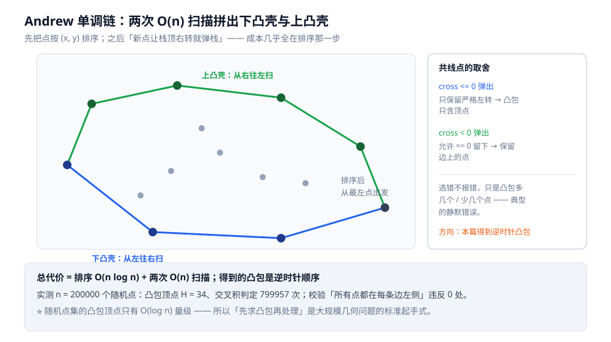
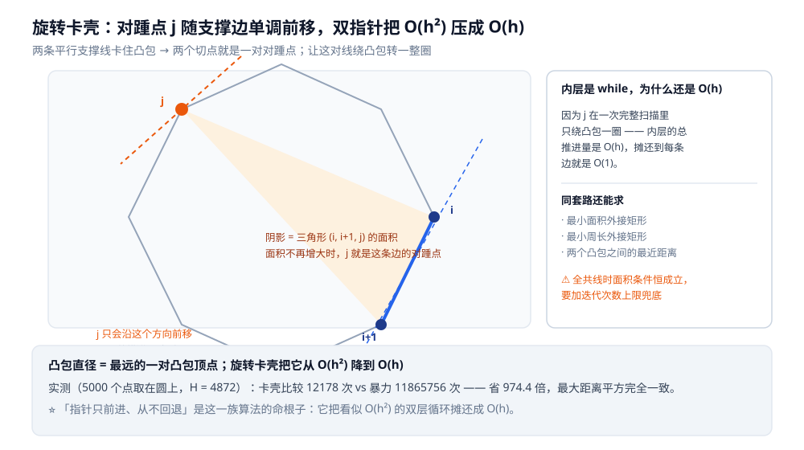
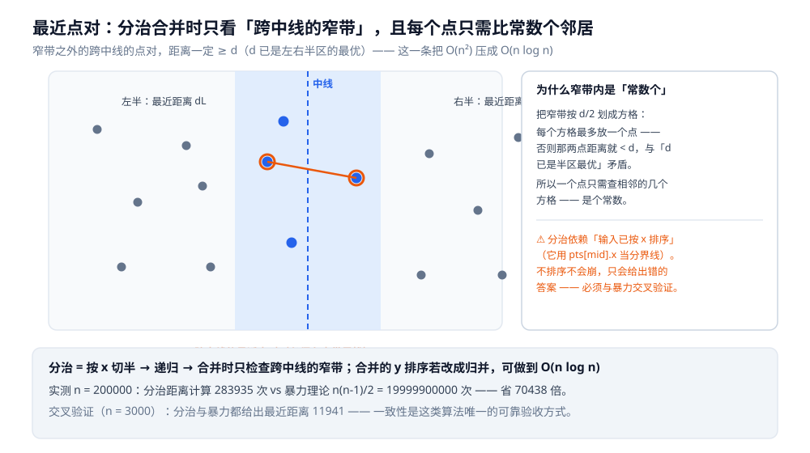

# 计算几何（凸包 · 旋转卡壳 · 最近点对 · 多边形）

> 前面所有篇章处理的对象都是「离散的量」—— 整数、序列、图。
> **计算几何**处理的是连续空间里的**点、线段、多边形**：
> 怎么判断「往左转还是往右转」、怎么求包住一堆点的最小多边形、
> 怎么在 `n` 个点里找最近的一对、怎么算多边形的面积与包含关系。
>
> 这一族问题的共同地基只有一个：**二维叉积**。把它讲透，后面都是它的推论。
>
> ⭐ 边界先说清：把二维问题按事件流降成一维的**通用技巧**见 [扫描线.md](../高级技巧/扫描线.md)
> （那篇讲的是「降维」这个念头，不做几何求面积）；磁盘 / GIS 上的空间索引（R 树、k-d 树、
> GeoHash）见 [空间索引与R树.md](../../数据结构/树/空间索引与R树.md) 与
> [KD树与高维索引.md](../../数据结构/树/KD树与高维索引.md)；
> 多项式与卷积加速见 [FFT与多项式.md](FFT与多项式.md)。
>
> 内容整理自个人学习笔记，素材见 [素材清单](../../../素材清单.md)。

---

## 一、地基：二维叉积

**本节要点**：二维叉积 `cross(o, a, b)` 是**三角形 `oab` 有向面积的两倍**，
它的**符号**就是「`b` 在 `oa` 的左边还是右边」—— 计算几何里几乎所有判断都归约到它。

```go
type P struct{ x, y int64 }

// (a-o) × (b-o)：>0 表示 o→a→b 左转，<0 右转，==0 三点共线
func cross(o, a, b P) int64 {
	return (a.x-o.x)*(b.y-o.y) - (a.y-o.y)*(b.x-o.x)
}
```

由它直接长出来的四个基本判断：

| 问题 | 用 `cross` 怎么写 |
|---|---|
| `o→a→b` 的转向 | `sign(cross(o, a, b))` |
| 点 `p` 在线段 `ab` 的哪一侧 | `sign(cross(a, b, p))` |
| 多边形（逆时针）的有向面积 ×2 | `Σ cross(原点, pᵢ, pᵢ₊₁)` |
| 线段 `ab` 与 `cd` 是否相交 | 两次「跨立」判定：`cross(a,b,c)` 与 `cross(a,b,d)` 异号，且反向也异号 |

⭐ **为什么整个族都绕着它转**：因为「面积」和「转向」是同一个东西的两种读法 ——
`o→a→b` 左转时，三角形 `oab` 的有向面积为正。于是**几何关系**（谁在谁左边）
被翻译成了**代数符号**（正负），可以精确地用整数比较。

⚠️ **两个必须现在就记住的坑**：

- **精度**：能用整数坐标就别用浮点。`int64` 叉积是**精确**的，
  浮点叉积在「三点几乎共线」时会因为舍入给出错误符号 —— 而凸包、相交判断全都在这些边界上做决策。
- **溢出**：叉积是两项乘积之差，量级是**坐标的平方**。
  坐标达到 `10^9` 时叉积约 `10^18`，已经逼近 `int64` 上限（约 `9.2×10^18`）；
  更大的坐标要换 128 位整数或大整数。

---

## 二、凸包：Andrew 单调链

**本节要点**：凸包 = 包住所有点的**最小凸多边形**。
Andrew 单调链把 `n log n` 全花在**排序**上，之后用**两次 O(n) 扫描**拼出下壳与上壳。

```text
① 所有点按 (x, y) 排序
② 从左往右扫，维护一个栈：栈里是「下凸壳」；新点若让上一步右转，就把栈顶弹掉
③ 从右往左再扫一遍，得到「上凸壳」
④ 两壳拼起来就是凸包（首尾点重合，去掉末点）
```

```go
func convexHull(pts []P) []P {
	sort.Slice(pts, func(i, j int) bool {
		if pts[i].x != pts[j].x {
			return pts[i].x < pts[j].x
		}
		return pts[i].y < pts[j].y
	})
	n := len(pts)
	h := make([]P, 0, 2*n)
	for i := 0; i < n; i++ { // 下凸壳
		for len(h) >= 2 && cross(h[len(h)-2], h[len(h)-1], pts[i]) <= 0 {
			h = h[:len(h)-1]
		}
		h = append(h, pts[i])
	}
	lower := len(h) + 1
	for i := n - 2; i >= 0; i-- { // 上凸壳
		for len(h) >= lower && cross(h[len(h)-2], h[len(h)-1], pts[i]) <= 0 {
			h = h[:len(h)-1]
		}
		h = append(h, pts[i])
	}
	return h[:len(h)-1] // 去掉与首点重合的末点
}
```



得到的凸包是**逆时针**顺序 —— 后面「点是否在多边形内」直接依赖这一点。

**实测**（容器 `golang:1.26-alpine`，Go 1.26.8；`n = 200000` 个随机整数点）：

```text
凸包顶点数 H = 34，交叉积判定次数 = 799957
校验：全部 200000 个点都在凸包每条边的左侧 —— 违反 0 处
```

⭐ 注意 `H = 34` 这个结果：**随机点集的凸包顶点数只有 `O(log n)` 量级**（这里 `n = 2×10^5`）。
也就是说「凸包」把绝大多数点都吃掉了 —— 这正是它有用的原因：
后面所有几何问题都可以只在凸包上做。

⚠️ **共线点怎么处理，全在比较符号上**：

| 写法 | 含义 | 结果 |
|---|---|---|
| `cross(...) <= 0` 弹出（本篇用法） | 只保留**严格左转** | 凸包**只含顶点**，边上的点被丢掉 |
| `cross(...) < 0` 弹出 | 允许 `== 0` 留在栈里 | 凸包**保留边上的点**（求「凸包周长」这类题需要） |

选错不会报错，只会让凸包多几个或少几个点 —— 这类**静默错误**是几何题最容易翻车的地方。

---

## 三、旋转卡壳：凸包直径与最远点对

**本节要点**：凸包直径 = **最远的一对凸包顶点**。暴力要 `O(h²)`，
但「对踵点」随边逆时针转**单调移动**，于是用**双指针**压到 `O(h)`。

**对踵点**：用两条平行的支撑线卡住凸包时，两个切点组成的点对。
旋转卡壳就是让这对支撑线一起转一圈 —— 卡壳的名字就是这么来的。

```text
for 每条凸包边 (i, i+1)：
    让 j 一直往前挪，直到「三角形 (i, i+1, j) 的面积」不再增大
    此时 j 就是这条边的对踵点
    用 dist(i, j) 与 dist(i+1, j) 更新答案
```

```go
func rotatingCalipers(hull []P) int64 {
	n := len(hull)
	best, j := int64(0), 1
	for i := 0; i < n; i++ {
		ni := (i + 1) % n
		for {
			cur := abs64(cross(hull[i], hull[ni], hull[j]))
			nxt := abs64(cross(hull[i], hull[ni], hull[(j+1)%n]))
			if nxt > cur { // 面积还在涨 → 对踵点继续前移
				j = (j + 1) % n
			} else {
				break
			}
		}
		if d := dist2(hull[i], hull[j]); d > best {
			best = d
		}
		if d := dist2(hull[ni], hull[j]); d > best {
			best = d
		}
	}
	return best
}
```



**实测**（`5000` 个点取在同一个圆上，凸包顶点 `H = 4872`）：

```text
旋转卡壳（O(H)）：比较次数 = 12178
暴力最远点对（O(H²)）：比较次数 = 11865756
→ 省 974.4 倍；两者最大距离平方一致 ✅
```

⭐ 关键：**「j 只往前走、从不后退」是这一族算法的命根子**。
一次卡壳里 `j` 总共只绕一圈，所以内层看似是 `while`，总代价却是 `O(h)`。
同一个套路还能求「最小面积外接矩形」「最小周长外接矩形」「凸包间最近距离」。

⚠️ **退化保护**：如果所有点共线（凸包退化成线段），对踵点的「面积增大」条件会一直成立，
指针可能绕圈不停。工程实现里要加**迭代次数上限**兜底。

---

## 四、最近点对：分治

**本节要点**：`n` 个点里最近的一对，暴力 `O(n²)`；分治把它降到 `O(n log n)` ——
关键在于合并时**只需要检查跨中线的「窄带」**，且窄带内每个点只需比**常数个** neighbor。

```text
① 按 x 排序，从中点切成左右两半
② 递归求左半、右半的最近距离，取 d = min(dL, dR)
③ 合并：只关心「与中线 x 距离 < d」的点（窄带）
④ 窄带内按 y 排序，每个点只往后比 —— 一旦 y 差 ≥ d 就停
```

```go
func closestPair(pts []P) int64 { // pts 必须已按 x 排序
	n := len(pts)
	if n <= 3 { /* 直接两两比 */ }
	mid := n / 2
	midX := pts[mid].x
	best := min(closestPair(pts[:mid]), closestPair(pts[mid:]))

	strip := pts 中满足 (p.x-midX)² < best 的点
	sort strip by y
	for i := range strip {
		for j := i + 1; j < len(strip) && (strip[j].y-strip[i].y)² < best; j++ {
			best = min(best, dist2(strip[i], strip[j]))
		}
	}
	return best
}
```



⭐ **为什么窄带内是常数个**：把窄带按 `d/2` 切成方格，**每个方格最多放一个点**
（否则那两点距离就 `< d`，与 `d` 已是半区最优矛盾）。
一个点只需检查自己所在方格与相邻的几个方格 —— 是个**常数**。
这就是分治能把 `O(n²)` 压到 `O(n log n)` 的全部理由。

**实测**（`n = 200000` 个随机点）：

```text
分治 O(n log n)：距离计算次数 = 283935
暴力理论        = n(n-1)/2 = 19999900000
→ 省 70438 倍

交叉验证（n = 3000）：分治 = 11941（4124 次距离计算），暴力 = 11941（4498500 次）
→ 两者最近距离一致 ✅
```

⚠️ **本轮实测踩到的一个真坑**：分治依赖「**输入已按 x 排序**」（它用 `pts[mid].x` 当分界线）。
第一次跑时我把**未排序**的数组直接喂进去，结果分治给出的「最近距离」比暴力大得多、
而且距离计算次数少得离谱 —— 这种「**结果错但不崩**」的 bug 只能靠**与暴力交叉验证**抓出来。
所以：**分治类算法一定要留一条「小规模跑暴力对答案」的验证路径**。

⚠️ 另一处取舍：合并时对窄带**重新排序**是 `O(n log n)` 一次 ⇒ 整体 `O(n log² n)`；
若改成「递归时顺带归并 y 序」，可以做到 `O(n log n)`。前者代码短，后者才是教科书复杂度。

---

## 五、多边形面积与「点在多边形内」

**本节要点**：面积用**鞋带公式**（有向面积）；「点在**凸**多边形内」用**叉积**，
线性 `O(h)`，靠 `hull[0]` 扇形二分可压到 `O(log h)`。

**鞋带公式**：把多边形顶点（逆时针）与原点之间的三角形有向面积加起来。

```go
func area2(poly []P) int64 { // 有向面积的两倍
	s := int64(0)
	for i := range poly {
		j := (i + 1) % len(poly)
		s += poly[i].x*poly[j].y - poly[j].x*poly[i].y
	}
	return s
}
```

**实测**：

```text
单位正方形 = 2（有向面积×2）→ 面积 = 1.0   ✅
三角形 (0,0)(4,0)(0,3) = 12            → 面积 = 6.0   ✅
```

⭐ **逆时针为正、顺时针为负** —— 于是「有向面积」顺带解决了「顶点是按什么方向给的」这个问题。
面积为零则说明所有点共线。这套写法可以无缝推广到「任意多边形面积」「多边形重心」。

**点在凸多边形内**：凸多边形逆时针时，`p` 在内部 ⟺ `p` 在**每条边的左侧**：

```go
// O(h)：逐边判断
func inConvexLinear(hull []P, p P) bool {
	for i := range hull {
		j := (i + 1) % len(hull)
		if cross(hull[i], hull[j], p) < 0 {
			return false
		}
	}
	return true
}

// O(log h)：先二分定位到「p 落在哪个扇形」，再判最后一条边
func inConvexBinary(hull []P, p P) bool {
	n := len(hull)
	if cross(hull[0], hull[1], p) < 0 || cross(hull[0], hull[n-1], p) > 0 {
		return false // 落在以 hull[0] 为顶点的扇形之外
	}
	lo, hi := 1, n-1
	for hi-lo > 1 {
		mid := (lo + hi) / 2
		if cross(hull[0], hull[mid], p) >= 0 {
			lo = mid
		} else {
			hi = mid
		}
	}
	return cross(hull[lo], hull[hi], p) >= 0
}
```

**实测**（凸包 `H = 2000`，查询 `m = 20000` 个随机点）：

```text
O(H) 线性扫描：叉积次数 = 35047745（平均每次 1752.4）
O(log H) 二分：叉积次数 =   279443（平均每次 14.0 ≈ log₂H + 2）
→ 省 125.4 倍；两法判定不一致 = 0 处 ✅
```

⚠️ 二分版**只对严格凸多边形成立**，而且要求 `hull[0]` 是一个顶点。
如果凸包允许共线点（第二节 `<=` / `<` 的选择），要先去掉共线点。
**两法交叉验证（不一致 0 处）是这里唯一可靠的验收方式**。

---

## 六、精度与退化：几何题翻车的四个地方

**本节要点**：几何的 bug 几乎全是**静默**的 —— 结果错，但不崩、也不报错。

| 翻车点 | 表现 | 怎么防 |
|---|---|---|
| **浮点叉积在近共线处判错符号** | 凸包少 / 多个点，或相交判断反 | 能用整数就用整数；必须浮点时用 `EPS` 容差比较，禁止 `==` |
| **`int64` 叉积溢出** | 坐标 `10^9` 时叉积 ~ `10^18`，接近上限 | 坐标上限换算一遍：`(范围)² × 2 < 9.2×10^18` 才安全 |
| **共线点的取舍没想清** | 凸包顶点数不对 | 先问「要不要保留边上的点」，再定 `<=` 还是 `<` |
| **退化输入**（单点 / 全共线 / 重复点） | 凸包退化成线段甚至空 | 特判 `n < 3`；去重；对「卡壳 / 二分」加迭代上限 |

⭐ **一条总原则**：几何题**不能只靠肉眼验算**。
每一段几何代码都要配一条**「与暴力版本交叉验证」**的路径 ——
小规模随机数据上跑一遍暴力，比对着图看半天可靠得多（第四节的排序坑就是这么抓出来的）。

---

## 使用：这些实现在你的系统里以什么形式出现

**本节要点**：计算几何在后端工程里不如算法题里显眼，但只要涉及「空间 / 图形」，底层都是它。

| 场景 | 用到的是哪一块 | 说明 |
|---|---|---|
| **地图 / 外卖的「配送范围」判定** | 鞋带面积 + 点在多边形内 | 判断一个坐标是否落在某个配送多边形内；凸多边形可用二分加速 |
| **GIS / 碰撞检测 / 游戏引擎** | 凸包 + 分离轴 | 包围盒、凸包近似，是碰撞剔除的第一步 |
| **图像处理 / OCR 的版面分析** | 凸包、最小外接矩形 | 「把一团文字框起来」的最小框 |
| **数据可视化 / 图表** | 凸包（凸层 / 轮廓） | 散点图的轮廓、异常点定位 |
| **机器学习 / 计算统计** | 最近点对、凸包 | 聚类预处理、凸包用于「凸层」可视化 |

⚠️ **本篇的写法说明**：上表是按**几何结构性质**给出的对应关系；
真实系统里通常由专门的几何库（如各语言的 geometry / GIS 库）实现，
具体算法与容差策略以各自文档 / 源码为准。**磁盘 / 高维场景请走空间索引那一族**（见引语里的边界）。

---

## 延伸追问

- **为什么整个计算几何都围着叉积转？** → 因为叉积把「面积」和「转向」变成了同一个数：`o→a→b` 左转 ⟺ 三角形有向面积为正。于是几何关系（谁在谁左边）被翻译成代数符号（正负），可以直接用整数比较，精确且快。
- **凸包为什么排序是瓶颈？** → 两次扫描各自 `O(n)`，排序 `O(n log n)`；所以整体就是 `O(n log n)`。也意味着「点已经按 x 有序」时凸包只要 `O(n)`。
- **随机点集的凸包顶点数为什么这么少？** → 期望是 `O(log n)`（实测 `n = 2×10^5` 时 `H = 34`）。边界上的点极少，所以「先求凸包、再在凸包上做后续」是对付大规模几何数据的标准起手式。
- **旋转卡壳凭什么 `O(h)`？** → 因为对踵点随支撑边单调移动：`j` 在一次完整扫描里只绕凸包一圈，内层 `while` 的总推进量是 `O(h)`，摊还到每条边就是 `O(1)`。
- **最近点对合并为什么只看窄带？** → 窄带之外的点和跨中线的点对，距离一定 `≥ d`（`d` 已是左右半区的最优）。再用「按 `d/2` 划格子、每格最多一个点」证明窄带内只需常数次比较。
- **`inConvexBinary` 为什么必须先判扇形？** → 二分的前提是「`p` 落在以 `hull[0]` 为顶点的某个三角形扇形里」。先做两次叉积把扇形外的点筛掉，后面的二分才是在一个单调的角序列上做。
- **浮点就不能用吗？** → 能用，但**判符号**这种决策必须留容差（`EPS`）。所有「等于零」「谁在左边」的判断在浮点下都不稳定；能转成整数运算就转。
- **`int64` 够用吗？** → 看坐标范围：叉积量级是坐标最大值的平方再乘 2。坐标 `10^9` 时约 `2×10^18`，逼近 `9.2×10^18` 的上限；再大就得 128 位或大整数。

---

## 关联

- [扫描线.md](../高级技巧/扫描线.md) — 「二维降一维」的通用技巧（本篇讲几何判定，它讲降维本身）
- [离散化.md](../高级技巧/离散化.md) — 大坐标压成名次轴，常与扫描线搭配
- [FFT与多项式.md](FFT与多项式.md) — 另一支「连续量的离散化处理」（多项式与卷积）
- [数论基础.md](数论基础.md) — 整数运算下的 GCD / 快速幂；与几何同属「整数的精确运算」
- [概率与期望.md](概率与期望.md) — 随机点集上「期望凸包大小是 O(log n)」这类结论的概率视角
- [空间索引与R树.md](../../数据结构/树/空间索引与R树.md) — 磁盘 / GIS 场景的空间索引（本篇是内存里的算法层）
- [KD树与高维索引.md](../../数据结构/树/KD树与高维索引.md) — 高维最近邻；与「最近点对」对照看二维 vs 高维的差别
- [复杂度分析.md](../基础算法/复杂度分析.md) — `O(n log n)`、摊还与「总推进量」的复杂度口径
- [素材清单.md](../../../素材清单.md) — 素材来源登记
