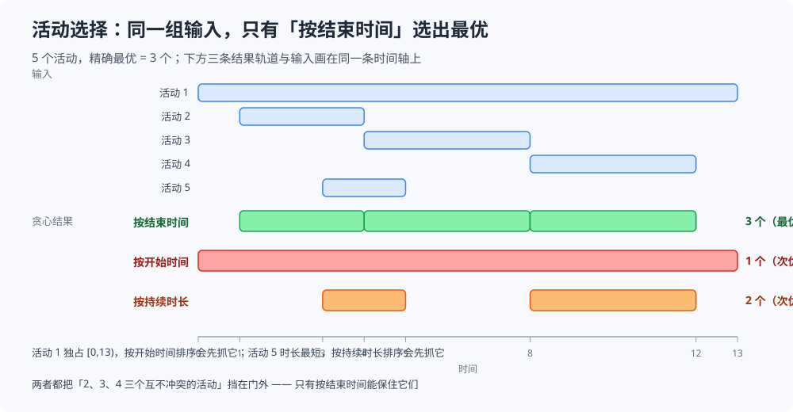

# 活动选择

> 贪心里最干净的一篇：**一个会议室、多个活动，选出最多的一批互不冲突的活动**。
> 全部机制只有一行 —— **按结束时间排序，然后顺序扫过去，能放就放**。
> 难点不在「怎么扫」，而在「为什么排序键就是结束时间，换一个为什么就不行」。
>
> ⭐ 本篇讲**「活动选择」这一个问题**：三种排序策略的实测对照、每种错法的具体反例、
> 交换论证怎么落到这个问题上、以及二万组随机用例的验证。
> 「交换论证 + 最优子结构」这套通用证明框架**不在这里重讲** —— 见 [霍夫曼编码.md](霍夫曼编码.md) 第 2.2、2.3 节；
> 同族的其他变体（区间合并、最少点覆盖、**带权区间调度**）见 [区间调度.md](区间调度.md) 第一节，两篇边界写在那里。
>
> 内容整理自个人学习笔记，素材见 [素材清单](../../../素材清单.md)。排序与堆的接口见 [堆与优先队列.md](../../数据结构/堆/堆与优先队列.md)；
> `O(n log n)` 的推导口径见 [复杂度分析.md](../基础算法/复杂度分析.md)。
>
> 📎 本篇所有输出均为本机实跑逐字抄录：**Go 1.26.5（windows/amd64）** 与 **JDK 1.8.0_321** 各实现一份，
> 输出**逐行对齐**（diff 只剩实验四的耗时列，那是两语言各自计时的必然差异）。

---

## 一、活动选择要解决的是什么？

**本节要点**：一句话 —— **单会议室、多个活动、选出最多互不冲突的活动**。看清「冲突」的定义与「个数最多」这个目标，后面所有讨论都挂在这个目标上。

### 1.1 问题定义

给定 `n` 个活动，每个活动有开始时间 `s` 和结束时间 `f`。两个活动 `i`、`j` **冲突**，当且仅当它们的时段有重叠；**兼容**则要求后一个的开始时间不低于前一个的结束时间（端点相接算兼容）。

目标只有一个：**选出数量最多的一组两两兼容的活动**。

⚠️ 三个容易被含糊过去的点，先说清：

| 点 | 本篇的口径 |
|---|---|
| 区间开闭 | 统一按**半开区间** `[s, f)` 处理，`f_i ≤ s_j` 即兼容（`f_i = s_j` 不算冲突） |
| 目标 | **只数个数**，每个活动权重都是 1。一旦给活动带上权值，这题就变成另一族问题（见 [区间调度.md](区间调度.md)） |
| 资源 | **只有一个**「会议室」。若要问「至少几个会议室才排得下」，那是它的对偶问题（见本篇延伸追问） |

### 1.2 两条规则

| 步骤 | 动作 |
|---|---|
| ① | 把所有活动**按结束时间升序**排序（相同则按开始时间、再按编号，保证可复现） |
| ② | 顺序扫描：若当前活动开始时间 **≥ 上一个被选中活动的结束时间**，就选它，并更新「上一个结束时间」 |
| ③ | 扫完即可，不做任何回溯 |

⭐ 第二步就是**贪心选择**：永远只做「当前看得到的最优」——结束最早的那个，从不回头。

⚠️ **一个极易写错的地方**：②里的「上一个结束时间」是**上一个被选中活动**的结束时间，不是「上一个被扫到的活动」的，也不是「当前活动自己的」。若写成后者，就退化成「只要活动之间有间隙就选」，结果必然不对。

### 1.3 逐步推演（本机实跑）

用经典的 11 活动例子（编号 `1..11`）：

```text
================ 实验一：逐步推演（经典 11 活动，按结束时间排序） ================

  活动（编号 开始-结束）：
     1: [ 1,  4)
     2: [ 3,  5)
     3: [ 0,  6)
     4: [ 5,  7)
     5: [ 3,  9)
     6: [ 5,  9)
     7: [ 6, 10)
     8: [ 8, 11)
     9: [ 8, 12)
    10: [ 2, 14)
    11: [12, 16)

  按结束时间排序后：1[1,4) 2[3,5) 3[0,6) 4[5,7) 5[3,9) 6[5,9) 7[6,10) 8[8,11) 9[8,12) 10[2,14) 11[12,16)

    选  1 [ 1, 4)   （开始  1 ≥ 上一个结束 -∞）
    弃  2 [ 3, 5)   （开始  3 < 上一个结束 4，冲突）
    弃  3 [ 0, 6)   （开始  0 < 上一个结束 4，冲突）
    选  4 [ 5, 7)   （开始  5 ≥ 上一个结束 4）
    弃  5 [ 3, 9)   （开始  3 < 上一个结束 7，冲突）
    弃  6 [ 5, 9)   （开始  5 < 上一个结束 7，冲突）
    弃  7 [ 6,10)   （开始  6 < 上一个结束 7，冲突）
    选  8 [ 8,11)   （开始  8 ≥ 上一个结束 7）
    弃  9 [ 8,12)   （开始  8 < 上一个结束 11，冲突）
    弃 10 [ 2,14)   （开始  2 < 上一个结束 11，冲突）
    选 11 [12,16)   （开始 12 ≥ 上一个结束 11）

  选中 4 个：{1, 4, 8, 11}
  精确 DP 最优值 = 4  →  贪心是否最优 = true
```

三处细节值得停一下：

1. **排序后编号是乱的**（`1 2 3 4 …` 看着齐，是因为原编号恰好接近结束顺序）。判别贪心时**只看排序后的顺序**，编号没有意义；
2. **「弃」比「选」多**：11 个活动只选中 4 个。贪心的产出天然稀疏 —— 这是「个数最多」的必然，不是浪费；
3. **`-∞` 那一行**：第一个活动没有「上一个」，等价于「一定放得下」。实现里用 `-1<<40` 之类的哨兵即可，别用 `0`（若活动开始时间可为 0，就会误判）。

---

## 二、为什么排序键必须是「结束时间」？

**本节要点**：本篇的核心。先说清「不是开始时间、也不是持续时长」，再用本机实测给出每种错法的反例 —— 反例都**先跑过、确认真的给出不同结果**才写进来。

### 2.1 三种排序策略在同一组输入上的对照（本机实测）



五个活动被刻意设计成「每种错法都会踩到一个陷阱」：

```text
================ 实验二：三种排序策略在同一组输入上的对照 ================

  活动（编号 开始-结束 时长）：
     1: [ 0, 13)  时长 13
     2: [ 1,  4)  时长 3
     3: [ 4,  8)  时长 4
     4: [ 8, 12)  时长 4
     5: [ 3,  5)  时长 2

  精确 DP 最优值 = 3

  按结束时间排序：顺序 [2 5 3 4 1] → 选中 {2, 3, 4}（3 个）  ✅ 最优
  按开始时间排序：顺序 [1 2 5 3 4] → 选中 {1}（1 个）  ❌ 比最优少 2 个
  按持续时长排序：顺序 [5 2 3 4 1] → 选中 {5, 4}（2 个）  ❌ 比最优少 1 个

  ⭐ 只有「按结束时间」拿到最优；另两种都给出了 5 个活动中的次优解
```

⭐ 同一组输入、同一个扫描逻辑，**只换了排序键**，结果 3 / 1 / 2 三种。这就是「排序键 = 算法本体」的含义。

### 2.2 按开始时间错在哪：一个长活动挡住了后面一串

最小反例（三个活动）：

```text
活动 A = [0, 10)   活动 B = [1, 2)   活动 C = [3, 4)
按开始时间排序：A(0) → B(1) → C(3)
  选 A[0,10) → B 开始 1 < 10 弃、C 开始 3 < 10 弃  →  结果 1 个
最优：{B, C} = 2 个
```

⚠️ **根因**：**开始得早 ≠ 结束得早**。`A` 抢到了「第一个位置」，却把一个很长的区间铺在那里，把后面所有短活动一并挡掉。

对应到实验二：活动 `1 = [0,13)` 就是那个「抢跑的长活动」，它一被选中，另外四个全被挡在门外。

⭐ 一句话记法：**按开始时间排序，等于「谁先来谁独占」—— 会议室不是这么用的。**

### 2.3 按持续时长错在哪：短不等于好放

最小反例（四个活动）：

```text
活动 A = [1, 4)  活动 B = [4, 8)  活动 C = [8, 12)  活动 D = [3, 5)
按持续时长排序：D(2) → A(3) → B(4) → C(4)
  选 D[3,5) → A 开始 1 < 5 弃、B 开始 4 < 5 弃 → C 开始 8 ≥ 5 选  →  结果 2 个
最优：{A, B, C} = 3 个
```

⚠️ **根因**：`D` 虽然最短，但它**横跨在 `A` 与 `B` 的交界上**（`D = [3,5)` 与 `A = [1,4)`、`B = [4,8)` 都重叠），一个它就撞掉两个。**「短」优化的是「占多少资源」，而这里要优化的是「不撞别人」** —— 这是两个不同的目标。

对应到实验二：活动 `5 = [3,5)` 就是那个「卡在 2 和 3 之间的短活动」。

⭐ 一句话记法：**按持续时长排序，等于「先给短任务腾地方」—— 可它并不比长任务更不容易撞人。**

### 2.4 为什么「结束时间」就对了

**交换论证的通用框架**（贪心选择性质 + 最优子结构）**见 [霍夫曼编码.md](霍夫曼编码.md) 第 2.2、2.3 节**，这里只把它落到本题上。

**结论（贪心选择性质）**：把活动按结束时间升序排成 `a₁, a₂, …, aₙ`，则**存在**一个最优解包含 `a₁`。

**证明**：任取一个最优解 `A`（若 `A` 已含 `a₁` 则证毕）。设 `A` 里按时间排最靠前的是 `aⱼ`。

1. `a₁` 是全体活动中**结束最早**的，故 `f₁ ≤ fⱼ`；
2. `A` 里其余活动的开始时间都 `≥ fⱼ`（否则与 `aⱼ` 冲突），于是也都 `≥ f₁`；
3. 所以把 `aⱼ` 换成 `a₁`，得到的新集合 `A' = A − {aⱼ} + {a₁}` 仍然两两兼容，且**个数不变**；
4. `A` 已是最优，`A'` 与它等大，故 `A'` **也是最优解**，且 `A'` 含 `a₁`。∎

⭐ 一句话直觉：**结束最早的 activity，占用的「未来」最少** —— 把它换进来，绝不会挡住原来那些已经在它之后的活动，所以「先选结束最早的」永远不亏。

**最优子结构**：选定 `a₁` 之后，剩下的问题变成「在所有 `s ≥ f₁` 的活动中选最多」——**与原子问题同型**，可以递归/迭代地用同一条规则做完。（这正是 [霍夫曼编码.md](霍夫曼编码.md) 第 2.3 节讲的同一件事。）

⚠️ 证明里 `f₁ ≤ fⱼ` 是唯一的支点：**只要「第一个活动结束最早」这一条成立，交换就安全**。这也解释了为什么换成开始时间/持续时长就崩 —— 那两个键都不保证「换进来的活动结束得最靠前」。

---

## 三、贪心真的从不出错吗？

**本节要点**：证明是一回事，跑出来是另一回事。这一节用二万组随机用例和精确 DP 正面对撞，再说清这种验证的边界。

### 3.1 二万组随机用例 vs 精确 DP（本机实测）

精确解用活动选择的 **DP**（`dp[i] = 1 + max{dp[j] : j < i 且 f_j ≤ s_i}`），它是精确的、可当裁判：

```text
================ 实验三：随机小规模（精确 DP 对照） ================

  随机用例 20000 个（活动 3~14 个，起止均取 0~31 的整数）：
    按结束时间排序：与最优不符 0 次（最大差 0）
    按开始时间排序：与最优不符 6812 次（最大差 4）
    按持续时长排序：与最优不符 13009 次（最大差 5）
  ⭐ 结束时间贪心 2 万次一次没错；另两种错法各占一半上下
```

⭐ 三条读法：

1. **结束时间贪心 0 次出错** —— 与 2.4 的证明一致；
2. **开始时间错 34%（6812/20000）**、**持续时长错 65%（13009/20000）** —— 错法不是「偶尔」，而是**常态**；
3. ⚠️ **最大差只有 4~5 个**。别被小数字骗了：**误差是「个数」上的，不是「比例」上的** —— 5 个活动的实例里差 4 个，等于几乎全错。小规模上「差几个」很不起眼，规模一大就是数量级的损失。

### 3.2 这个验证证明了什么、没证明什么

| 它证明了 | 它没证明 |
|---|---|
| 在 2 万个**具体**实例上，结束时间贪心与精确解一致 | 它**不是证明** —— 随机测试只能证伪，不能证明「永不出错」 |
| 开始时间 / 持续时长这两把键**确实会错**（拿到了具体错例） | 它没覆盖所有边界（如活动数为 0/1、时间戳相等、超长区间） |
| 两种错法的**出错频率**（约 1/3 与 2/3） | ⚠️ **不能反过来**：不能因为「随机测试过了」就省掉 2.4 的证明 |

⭐ **正确用法**：**证明定性质（2.4），测试找反例（3.1）**。本篇正是先有 2.4 的证明、再用 3.1 去撞它；若两者冲突，一定是证明或实现里有 bug（本项目的经验是**反例没选对**比**证明写错**更常见 —— 所以这里所有反例都先跑过才写进正文）。

---

## 四、复杂度：瓶颈在排序

**本节要点**：贪心本体只是「排序 + 一次线性扫描」，所以瓶颈完全在排序上。这一节给出量级，并用本机实测与朴素 DP 对照。

### 4.1 贪心 O(n log n)

| 阶段 | 复杂度 | 说明 |
|---|---|---|
| 排序 | `O(n log n)` | **瓶颈**，用任意比较排序 |
| 扫描 | `O(n)` | 每个活动看一次，`O(1)` 判断 |
| **合计** | **`O(n log n)`** | 空间 `O(n)`（排序本身）或 `O(1)`（原地排序） |

⚠️ **扫描那一步是「在线」的**：它不需要重排、不需要回头，只要按排序结果流式读即可。这也是实时场景（活动随时间到达）偏好它的原因。

### 4.2 与朴素 DP 的规模对照（本机实测）

同一组随机数据上，结束时间贪心 vs 活动选择的**朴素 O(n²) DP**：

```text
================ 实验四：规模对照 —— 贪心 O(n log n) vs 朴素 DP O(n²) ================

  活动数      结果(贪心/DP)      贪心 ms/次      朴素 DP ms/次      DP/贪心
  2000       519 / 519             1.3350         12.0682          9.04×   （重复 101/9 轮）
  4000       708 / 708             1.4400         42.0986         29.24×   （重复 100/3 轮）
  8000       1003 / 1003             3.4829        202.6853         58.19×   （重复 23/1 轮）

  ⚠️ 耗时列在两语言间必然不同（本机 Go time.Now 分辨率约 1ms，采用多轮累加取平均）；
     前两列（活动数、贪心/DP 的结果）两语言逐字相同。
```

本机多轮运行的范围（5 次）：

| 活动数 | 贪心 | 朴素 DP | DP / 贪心 |
|---|---|---|---|
| 2000 | 1.0 ~ 4.4 ms | 12.1 ~ 25.5 ms | **5.8 ~ 23×** |
| 4000 | 1.4 ~ 4.9 ms | 42.1 ~ 122.1 ms | **12 ~ 44×** |
| 8000 | 3.5 ~ 8.8 ms | 182.7 ~ 336.5 ms | **38 ~ 58×** |

⭐ **只断言趋势、不咬绝对值**（`time.Now` 的粒度问题，与 [Dijkstra.md](../图论算法/最短路/Dijkstra.md) 第 4.3 节同一原因）：

- **活动数翻倍，DP 耗时约变 4 倍**（`12 → 42 → 203`，典型平方增长），贪心只变 1~2 倍；
- 所以**倍率随规模上升**（9× → 29× → 58×）。⚠️ 小规模上两者都是零点几毫秒、看不出差别，**这正是「复杂度」要靠规模才显形的地方**；
- 两列「结果」始终相同（`519/519`、`708/708`、`1003/1003`）—— 又一次印证贪心拿到的是最优解。

⚠️ **一个诚实的补充**：带权版本（见 [区间调度.md](区间调度.md)）的 DP 可以用二分把 `O(n²)` 优化到 `O(n log n)`，与贪心同阶；但**活动选择这题根本不需要 DP** —— 贪心更快、更简单、还更容易写出流式版本。

---

## 使用：会议室预订是这题的最小内核

活动选择**几乎不会以「活动」的名字出现**，它的真正内核是「**一组互相争用同一份资源的时间段，选最多不冲突的**」。按这个内核看三层：

**第一层：会议室 / 排班 —— 最直接的对应**。一个会议室、一批会议，排最多场；一个诊室、一批挂号；一个工位、一批预约 —— 全是同一个模型。⚠️ **判据只有一条**：题目问的是「**最多几个**」，而不是「**总共多少时间**」或「**权值多大**」。问后者就得换模型（带权 → DP，见 [区间调度.md](区间调度.md)）。

**第二层：单份资源的任务编排**。单个 CPU 核心上的「不可抢占、各自有窗口」的任务、单条链路上的时隙分配、单播队列在固定窗口里的发送批次 —— 都是「按结束时间贪心」的直接套用。⚠️ **这里是「一个」资源**；一旦有多份资源并行，就变成它的对偶问题「最少几个会议室」（见延伸追问）。

**第三层：把它当成「排序键选择」的范本**。这一层的价值不在于解某一题，而在于提供一组**自检问题**：

| 自检问题 | 为什么 |
|---|---|
| 目标是「个数/可行性」还是「加权和」？ | 加权和几乎一定不能直接用这套贪心（见 [区间调度.md](区间调度.md)） |
| 排序键能不能用交换论证证明「换进来不亏」？ | 不能证明的排序键，**先跑小规模反例**再下结论（本篇 2.2/2.3 就是这样定案的） |
| 冲突定义里端点相接算不算冲突？ | 一个 `≤` 写成 `<`，结果就会漂 —— 与 [限流算法.md](../../../04-架构与系统/分布式/服务治理/限流算法.md) 里「窗口边界算哪边」是同一类坑 |

⭐ **归纳成一条判断**：**你几乎不会「写」活动选择，但你会「判断一个时间资源分配问题能不能用它」**。而 2.4 的证明给的就是那把尺子：**能不能找到一个排序键，让「第一个」总是可以被安全地留下**。

---

## 延伸追问

- **为什么不能按开始时间排？** → 因为「开始得早」不等于「结束得早」，一个抢跑的长活动会挡住后面一串（本机 2.2 反例：`{A} = 1` vs 最优 `{B, C} = 2`）。
- **为什么不能按持续时长排？** → 因为「短」优化的是「占多少资源」，而目标优化的是「不撞别人」，两者无关。最短的活动可能横跨在别人的交界处，一个撞两个（本机 2.3 反例：`{D, C} = 2` vs 最优 `{A, B, C} = 3`）。
- **为什么按结束时间就一定对？** → 因为「结束最早的 activity 占用的未来最少」，把它换进任意最优解都不会破坏兼容性（2.4 的交换论证）。⚠️ 证明的支点只有一句：**第一个活动的结束时间最小**。
- **端点相接（`f_i = s_j`）算冲突吗？** → **不算**。本篇统一按半开区间 `[s, f)`，`f_i ≤ s_j` 即兼容。⚠️ 若业务里「前一个会议结束、后一个紧接着开始」仍需缓冲，就得把 `≤` 改成 `<` 或在时间上加缓冲区 —— 别把口径混在算法里。
- **要「最少几个会议室」怎么办？** → 那是**对偶问题**：按开始时间排序，用一个**最小堆**存每个房间当前会议的结束时间；新会议来了就弹出所有已结束的房间、复用最早腾出的那个；堆的**最大长度**就是所需会议室数。⚠️ 注意它和本篇的排序键**正好相反**（这里要按开始时间排）——同一族问题，排序键随目标变化，不能记混。
- **如果活动带权值呢？** → **贪心直接失效**，必须换 DP。本机在 [区间调度.md](区间调度.md) 第四节给出了一个「贪心选 4 个、权值和只有 4，最优选 2 个、权值和 101」的实例 —— 这是「个数最多」与「权值最大」分道扬镳的最短证据。
- **随机测试过了，还需要证明吗？** → **需要**。随机测试只能证伪不能证明（本篇 3.2）。⚠️ 而且随机数据的分布会掩盖边界：计数类问题在「小规模整数区间」上很容易蒙对，规模一大、取值一散就现形。
- **时间有重叠、真要按秒判断怎么办？** → 只要能把每个活动归约成 `[s, f)` 一个区间，结论不变。⚠️ 真正要小心的是**同一时刻大量活动**（`n` 很大）：此时瓶颈是排序 `O(n log n)`，可考虑基数排序或按时间分桶（见 [../查找与排序对比.md](../基础算法/查找与排序对比.md)）。
- **活动数为 0 或 1 时会怎样？** → 0 个活动直接返回空集；1 个活动必然选中。⚠️ 这两个边界实现上最容易踩空的是哨兵值：用 `-∞` 表示「还没有上一个」，**别用 `0`**（开始时间可以为 0 时会误判）。
- **它和 [Dijkstra.md](../图论算法/最短路/Dijkstra.md) 有什么关系？** → 都是**贪心 + 一个排序/取极值规则**，但正确性的「支点」不同：Dijkstra 靠「边权非负 ⇒ 绕远路不会更便宜」，活动选择靠「结束最早 ⇒ 换进来不破坏兼容」。⚠️ 两篇都在实现里加了确定性 tiebreak，理由相同 —— 让输出可复现、可跨语言逐行对齐。

## 关联

- [霍夫曼编码.md](霍夫曼编码.md) — **同门第一篇**：本篇的「交换论证 + 最优子结构」通用框架不在正文重讲，直接引用它的第 2.2、2.3 节；两篇都是「先证明、再实测、再给边界」的同一体例
- [区间调度.md](区间调度.md) — **同族的总览篇**：区间合并、最少点覆盖、**带权区间调度**（贪心失效、必须 DP），以及「哪些能贪心、哪些必须 DP」的判据；两篇以「按结束时间排序」为交叉点
- [查找与排序对比.md](../基础算法/查找与排序对比.md) — 排序键的选择与各排序算法的取舍：本篇 `O(n log n)` 的瓶颈就在这一篇
- [堆/堆与优先队列.md](../../数据结构/堆/堆与优先队列.md) — 「最少会议室」对偶问题用的**最小堆**接口
- [复杂度分析.md](../基础算法/复杂度分析.md) — `O(n log n)` 与「规模决定复杂度是否显形」的推导口径
- [../图论算法/最短路/Dijkstra.md](../图论算法/最短路/Dijkstra.md) — 另一篇「贪心取极值」的样例：正确性的支点与 tiebreak 的可复现性
- [限流算法.md](../../../04-架构与系统/分布式/服务治理/限流算法.md) — 「窗口边界算哪边」的同类型取舍：一个 `≤` / `<` 就能改变结果
> 反向引用（本篇被下列文档引到）：[双指针.md](../基础算法/双指针.md)、[排序算法.md](../基础算法/排序算法.md)
