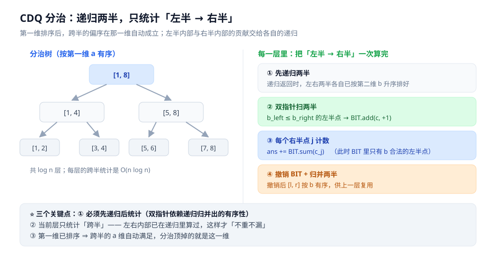
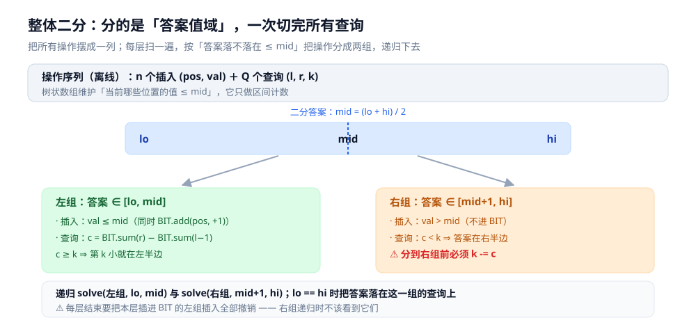

# CDQ 分治与整体二分

> 两个「用分治把维度消掉」的离线技巧：**CDQ 分治**把偏序问题的下标维消掉，
> **整体二分**把一批二分的答案维合并成一棵分治树。

> ⭐ 边界先说清：本篇讲**两个分治技巧本身**（适用问题、流程、复杂度、实测）。
> 底座结构（树状数组 / 线段树）见 [区间与索引树.md](../../数据结构/树/区间与索引树.md)；
> 「在答案空间上二分」的基本手法见 [二分答案.md](../基础算法/二分答案.md)；
> 另外三把「换角度」的刀（莫队、扫描线、离散化）见本目录 [README.md](README.md)。
>
> 内容整理自个人学习笔记，素材见 [素材清单](../../../素材清单.md)。复杂度口径见 [复杂度分析.md](../基础算法/复杂度分析.md)。
>
> 📎 本篇读数来自**自写的最小实现**，在本机**容器**里实跑逐字抄录：**Go 1.26.8（linux/amd64，`golang:1.26-alpine`）**。
> ⚠️ 实验**只数比较次数 / 操作次数、不依赖计时**；数据由固定 seed 的本地随机源生成，同一程序连跑两遍**逐行相同**。

---

## 一、CDQ 分治解决什么问题？

**本节要点**：CDQ 分治解的是**偏序问题** —— 统计「有多少对 `(i, j)` 同时满足 `a_i ≤ a_j`、`b_i ≤ b_j`、`c_i ≤ c_j`」。
暴力要 `O(n²)`；CDQ 用「**排序消一维 + 分治消一维 + 树状数组消一维**」把它压到 `O(n log² n)`。

把偏序按维数排一下，规律很清楚：

| 维数 | 做法 | 复杂度 |
|---|---|---|
| **一维**（数组里 `a_i ≤ a_j`） | 直接扫 | `O(n)` |
| **二维**（逆序对 / 二维数点） | **排序消一维 + 树状数组管一维** | `O(n log n)` |
| **三维** | ⭐ **CDQ 分治出场**：排序 + **分治** + 树状数组 | `O(n log² n)` |
| 四维及以上 | CDQ 套 CDQ（或树套树） | 更高阶 |

⭐ **为什么「分治」能顶掉一维**：分治把序列切成左右两半。因为**第一维 `a` 已经排好序**，
所以「左半的任意点 → 右半的任意点」在 `a` 这一维上**自动满足**。
于是当前层只需要统计「左半 → 右半」在**剩下两维**（`b`、`c`）上的偏序 ——
而左右两半**内部**的贡献，交给各自的递归去算。

**一句话**：CDQ 分治不是一种数据结构，而是「**一种让数据结构能处理更高维的调度方式**」——
它把「时间 / 下标」这一维从问题里消掉了。

---

## 二、CDQ 分治怎么工作？

**本节要点**：四步 —— **按第一维排序 → 递归左右 → 统计「左半 → 右半」→ 归并回来**。
三个关键点是「先递归后统计」「只统计跨半」「统计完撤销」。

```text
solve(l, r):
    if l >= r: return
    mid = (l + r) / 2
    ① solve(l, mid)            # 先递归：算左右内部的贡献，顺带把两半按 b 排好
    ② solve(mid+1, r)
    ③ 统计「左半 → 右半」：
         双指针扫两半（都按 b 升序）：把 b_left <= b_right 的左半点插入 BIT（下标 = c）
         对每个右半点 j，累加 BIT.sum(c_j)
    ④ 撤销第③步插进 BIT 的全部点
    ⑤ 归并两半（按 b），使 [l, r] 按 b 有序，供上一层复用
```

三个关键点：

1. **必须先递归、后统计**。递归返回时左右两半各自已经按 `b` 有序 —— 第 ③ 步的双指针才成立。
   先统计再递归，双指针面对的是乱序数组，结果直接错；
2. **只统计「跨半」**。「左半 → 右半」在当前层算，**两半内部**的偏序在递归里算 ——
   这就保证了「不重不漏」，也是 CDQ 正确性的全部依据；
3. ⭐ **顺序就是时间**。因为按 `a` 排序，「左 → 右」天然满足 `a_left ≤ a_right`。
   ⚠️ 如果题目里「顺序」有别的含义（比如操作的时间先后），那就是按**那个顺序**排序，不是按下标。



**复杂度**：分治 `log n` 层，每层归并 `O(n)`、树状数组操作 `O(n log n)` → 总计 `O(n log² n)`。

---

## 三、本机实测：CDQ vs 暴力（三维偏序）

**本节要点**：用 `n = 8000` 个随机点跑同一道三维偏序题，比较**暴力**与 **CDQ** 的比较次数与结果。

```text
=========== 实验一：三维偏序（暴力 O(n^2) vs CDQ 分治） ===========
数据：n = 8000 个点；a 维取唯一序号 1..n，b、c 维取 [1,4000]（含大量并列）
问题：统计有序对 (i,j) 的个数，满足 b_i <= b_j 且 c_i <= c_j（a 维由序号天然有序）

[暴力] 两两比较 31996000 次
       统计出偏序对 8056633 组

[CDQ ] 双指针比较 93659 次；归并比较 93659 次；BIT add/sum 共 145710 次
       统计出偏序对 8056633 组

=> 两法结果一致：true
=> 比较次数：暴力 31996000 次，CDQ 的 BIT 操作 145710 次（约 220 分之一）
```

**三点读法**：

- ⭐ **两个实现给出同一个数（8 056 633）** —— 暴力是「不需要证明就能信」的基准，
  两者一致才说明 CDQ 的「只统计跨半、不重不漏」没写错；
- **暴力比较 `31 996 000` = `n(n−1)/2`**，正是 `O(n²)` 的样子；
  **CDQ 的 BIT 操作 `145 710` ≈ `n log n`**（`8000 × 13 = 104000` 量级）—— **约 220 分之一**；
- **双指针比较 = 归并比较 = `93 659`**，两者都约 `n log n` ——
  说明 CDQ 的**成本主要落在树状数组上**，归并本身很便宜。这也解释了它为什么是 `O(n log² n)`
  而不是 `O(n log n)`：多出来的一个 `log` 全是 BIT 的。

---

## 四、整体二分解决什么问题？

**本节要点**：整体二分解的是**「一大批可以二分的查询」** —— 最典型是**区间第 k 小**的批量版本。
它把 `Q` 次独立的二分**合并成一次分治**，做到 `O((n + Q) log V)`。

「第 k 小」可以二分，这一点在 [二分答案.md](../基础算法/二分答案.md) 里已经讲过：
二分一个答案 `mid`，数「区间里 ≤ `mid` 的元素有几个」，若 ≥ `k` 就往小缩。问题是**代价**：

| 做法 | 每个查询的代价 | `Q` 个查询 |
|---|---|---|
| **逐个二分**（每次 check 扫区间） | `O(len · log V)` | `O(Q · len · log V)` |
| **逐个二分 + 主席树** | `O(log n · log V)` | `O(Q · log n · log V)` |
| ⭐ **整体二分** | 摊到 `O(log V)` 次 BIT 操作 | **`O((n + Q) log V)`** |

⭐ **一句话**：整体二分 = 「**把 Q 个独立的二分，改造成一棵按答案值域分裂的分治树**」。
每一层只扫一遍操作，就把所有查询的判断一起做完了。

---

## 五、整体二分怎么工作？

**本节要点**：三件东西 —— **操作序列**（插入 + 查询）、**答案值域二分**、**树状数组记账 + 撤销**。
⚠️ 最容易写错的两处是「`k -= c`」与「递归后撤销」。

三个要素：

1. **把所有操作摆成一列**：`n` 个「插入」（把 `a[i]` 放到位置 `i`）+ `Q` 个「查询」（`(l, r, k)`）；
2. **二分的是「答案值域」`[lo, hi]`**，不是数组下标。树状数组维护的是
   「**当前哪些位置上的值 ≤ `mid`**」；
3. **一次扫描，把操作分到两组**：

```text
solve(ops, lo, hi):
    if lo == hi: 落答案（这些 ops 里的查询答案都是 lo）; return
    mid = (lo + hi) / 2
    扫描 ops 的每个操作 o：
        o 是插入：
            val <= mid  →  BIT.add(o.pos, 1);  分到「左组」
            否则        →  分到「右组」
        o 是查询 (l, r, k)：
            c = BIT.sum(r) − BIT.sum(l−1)       # 区间里 <= mid 的元素个数
            c >= k      →  分到「左组」（答案 <= mid）
            否则        →  o.k -= c;  分到「右组」   # ⚠️ 必须扣掉左组已计入的
    撤销本层插入过的 BIT 点（左组里的插入全部 add(-1)）
    solve(左组, lo, mid)
    solve(右组, mid+1, hi)
```

⭐ 两个必须理解的点：

- **`k -= c`**：查询被分到右组，说明它要的第 `k` 小**不在 `≤ mid` 的那些里面**。
  右组递归时只会看到 `> mid` 的值，所以 `k` 要先扣掉左组已经数过的 `c` 个。
  ⚠️ 漏了这一步，右组所有查询的答案都会偏大 —— 这是整体二分最经典的错法；
- **撤销**：本层为了分组临时往 BIT 里插了「左组的插入」。
  右组递归时**不应该看到它们**（右组只关心 `> mid` 的值），所以必须撤干净。
  这也解释了为什么它要求**离线** —— 操作序列得能被反复重放。



---

## 六、本机实测：整体二分 vs 逐个二分

**本节要点**：`n = 1000` 个数、`q = 500` 个查询，比较两种做法的扫描 / 操作次数与答案。

```text
=========== 实验二：整体二分（区间第 k 小） ===========
数据：n = 1000 个整数（值域 [1,100000]）；q = 500 个查询 (l, r, k)
问题：每个查询求 a[l..r] 中第 k 小的值

[逐个二分] 每个查询独立二分答案：check 8350 次，累计扫描 2777904 个元素
           答案校验和 = 24906082

[整体二分] 一次分治回答全部 500 个查询：BIT add/sum 共 33672 次
           答案校验和 = 24906082

=> 两法答案逐个一致：true
=> 扫描/操作次数：逐个二分 2777904，整体二分 33672（约 82.5 分之一）
```

**三点读法**：

- ⭐ **答案校验和一致（24 906 082）**，且程序里逐个比对过 500 个答案 —— 说明分组与 `k -= c` 写对了；
- **逐个二分的 `check 8350` 次 ≈ `500 × 17`**（`log₂ 100000 ≈ 17`），累计扫描 `2 777 904` 个元素
  —— 这正是 `O(Q · len · log V)` 的样子；
- **整体二分只用 `33 672` 次 BIT 操作** —— **约 82.5 分之一**。
  ⭐ 而且**样本越大优势越大**：它的成本是 `O((n + Q) log V)`，**与区间长度无关**，
  而逐个二分的扫描量随区间长度**线性增长**。区间越长，差距越悬殊。

---

## 七、两者是什么关系？什么时候用哪个？

**本节要点**：**CDQ 分治「分治下标」**，**整体二分「分治答案」** ——
共同点是「离线 + 把操作分到两边」，区别在**分治的那条轴**与**要回答的问题**。

| 维度 | CDQ 分治 | 整体二分 |
|---|---|---|
| **分治的对象** | **下标 / 时间区间** | **答案值域** |
| **回答什么问题** | 「有多少对 / 贡献和是多少」（**计数**） | 「每个查询的答案是几」（**求值**） |
| **典型题** | 三维偏序、动态逆序对、CDQ 优化 DP | 区间第 k 小、带修改区间第 k 小 |
| **数据结构扮演什么** | 分治顶掉一维，BIT 顶掉另一维 | 分治切的是答案，BIT 只做「区间计数」 |
| **共同前提** | ⚠️ **离线**（操作 / 查询能先攒起来） | 同 |
| **共同手法** | ⭐ 「分治 + 分组」：切两半，让一半的信息只影响另一半 | 同 |

⭐ **选型判据**：

- 问「**有多少对 / 贡献和**」→ **CDQ 分治**；
- 问「**每个查询的答案是多少**」且答案**可二分** → **整体二分**。

⚠️ 两者可以叠起来用：「带修改的区间第 k 小」就是整体二分（分答案）套上 CDQ（分时间）的经典组合。

⭐ **它们共享的那句话**：**把一个「两两都要比」的 `O(n²)` 问题，改造成「切一半、批量统计一半」的 `O(n log² n)`**。
这是分治在「非排序」场景里最有力的一次应用。

---

## 八、最容易踩的坑有哪些？

**本节要点**：CDQ 的坑在**统计范围**（跨半 vs 内部）与**顺序**；整体二分的坑在**分组时的状态改写**（`k -= c`）与**撤销**。

| 坑 | 症状 | 怎么避免 |
|---|---|---|
| **CDQ 忘了「先递归后统计」** | 双指针面对乱序数组，结果错 | 顺序固定：递归 → 统计跨半 → 归并 |
| **CDQ 把跨半与内部重复统计** | 答案偏大（同一对算了两次） | 内部只由递归算，当前层**只算跨半** |
| **CDQ 统计完不撤销 BIT** | 上一层看到脏数据，结果乱 | 插了多少就撤多少 |
| **偏序用 `<` 还是 `≤` 没想清** | 有并列元素时数量差很多 | 先确认题目要严格还是非严格；非严格用 `≤` |
| **整体二分忘了 `k -= c`** | 右组查询答案**偏大**（经典错法） | 分到右组前必须扣掉左组已计入的 `c` |
| **整体二分递归后没撤销插入** | 左右组互相污染 | 每层结尾把本层插入的 `add(pos,-1)` 掉 |
| **把「值域」当「下标」二分** | 写成了「对数组下标二分」，逻辑不成立 | 二分的是**答案的取值范围** `[lo, hi]` |
| **在线场景硬上离线算法** | 前提不成立，根本写不出来 | 先确认「所有查询能不能先攒起来」 |

### 一条「实验设计」层面的坑

**别只看「倍数」这个单一数字**。本机两组实验一个省 220 倍、一个省 82.5 倍 ——
但这两个数**不代表算法优劣**，因为它们的规模、区间长度、值域都不同。
真正稳定的判据是**增长率**：CDQ 的成本 ≈ `n log n` 量级（与 `n²` 拉开），
整体二分的成本**与区间长度无关**（区间越长越划算）。
⭐ **报「省了多少倍」时必须同时报清规模与参数**，否则那个倍数换一组数据就不成立。

---

## 使用：这两个技巧在哪些系统里

**第一层：它们藏在「多维筛选统计」里。** 数据库中「满足 A 且 B 且 C 的记录有多少条」
本质就是三维偏序计数 —— 引擎内部可能用位图、可能用排序归并，但和 CDQ 是同一类问题。
离线数仓的**联表统计、漏斗分析**尤其适合这类离线算法。

**第二层：它们藏在「第 k 大 / 分位数」里。** 监控系统问「这个时间窗口里第 99 百分位的延迟是多少」、
搜索引擎问「这个区间里第 k 大的相关度」—— 都是「区间第 k 小」的实例。
⭐ 在线服务用**主席树**（可持久化，见 [可持久化数据结构.md](../../数据结构/树/可持久化数据结构.md)），
**离线批处理**才用整体二分。

**第三层：为什么工程代码里很少直接见到它们。**
⭐⭐ **CDQ 与整体二分都是离线算法** —— 它们要求「把全部查询攒起来，最后一次性算完」。
在线服务里请求边来边答，用不上；但**离线报表、批处理、日志分析、数据校验**里非常合适。
⭐ 所以看到这两个名字时，第一反应应该是「这是个**离线**场景的算法」，
而不是「它比在线算法更快」。

**第四层：它们示范了一条通用配方。**
「**一维交给排序、一维交给分治、一维交给数据结构**」——
处理多维问题的通用配方（同族的还有 [扫描线.md](扫描线.md) 的「二维降一维」、
[离散化.md](离散化.md) 的「值域压缩」）。
⭐ 遇到新的多维问题，先问：**哪一维可以排序消掉？哪一维可以分治消掉？剩下的交给什么结构？**

---

## 延伸追问

- **CDQ 分治为什么叫「CDQ」？** → 来自提出者**陈丹琦** 2009 年的国家队集训队论文（Chen Dan Qi 的缩写）。它本身不是「一种新算法」，而是**一类分治调度模式的命名** —— 论文里把它用于「带修改的问题怎么把时间维消掉」，后来成为偏序问题的标准解法。
- **二维偏序用 CDQ 是不是浪费？** → 是。二维偏序「排序一维 + 树状数组一维」就是 `O(n log n)`，用 CDQ 反而多一个 `log`。⭐ **CDQ 的价值只在三维及以上** —— 它的作用是把「本来要树套树」的问题，降成「分治 + 一维结构」。
- **为什么必须先递归后统计？** → 因为统计靠**双指针**，而双指针要求左右两半**各自按第二维有序** —— 这个有序性正是「先递归（递归里做了归并）」带来的。顺序一反，双指针的前提就没了。
- **CDQ 里树状数组能不能换成别的？** → 能，换成任何「支持单点加、前缀查」的结构都行（线段树、有序结构）。选 BIT 是因为它常数最小、代码最短。⚠️ 但**要求第三维可离散化**（值域要能压成下标）。
- **整体二分和主席树怎么选？** → 看**离线还是在线** + **有没有修改**：离线、批量 → 整体二分（常数小、能带修改）；在线、单点查询 → 主席树（可持久化，见 [可持久化数据结构.md](../../数据结构/树/可持久化数据结构.md)）。⭐ 两者的复杂度量级接近，**主要差别在「能不能离线」**。
- **整体二分能不能处理「带修改」？** → 能，而且这是它的强项。把「修改」也当成一个操作加进序列（先撤销旧值、再插入新值），分治时按时间顺序处理即可。⚠️ 那就要求「修改也能被重放」，本质是对时间维再做一层分治 —— 这就是「整体二分套 CDQ」。
- **为什么这两个算法必须离线？** → 因为它们的核心动作是「**把操作序列反复重扫、重分组**」：整体二分每层扫一遍全部操作，CDQ 每层归并一次。这要求「所有操作在开始时就已经知道」。⚠️ 在线场景里新查询随时到达，序列拼不出来。
- **CDQ 能优化 DP 吗？** → 能。当 DP 转移形如 `dp[i] = max/min{ dp[j] + f(j, i) }` 且 `j` 的范围由偏序条件给出时，可以用 CDQ 按「`dp[j]` 算好了才能更新 `dp[i]`」的顺序分治处理，把 `O(n²)` 的转移降到 `O(n log² n)`。⚠️ 关键是**转移满足偏序性**（右边只依赖左边），否则不成立。

---

## 关联

- [README.md](README.md) — **上级导读**：高级技巧各篇「把什么转成什么」的对照与选型
- [离散化.md](离散化.md) — **前置**：大值域压成小值域（三个维度的下标都要能落进 BIT）
- [分块.md](分块.md) — **对照组**：在线区间维护（CDQ / 整体二分都是离线，与它互补）
- [莫队算法.md](莫队算法.md) — **同族**：同样「离线 + 排序 + 移动指针」，处理区间查询
- [扫描线.md](扫描线.md) — **同族思路**：「二维降一维」；本篇是「三维降两维」
- [树链剖分.md](树链剖分.md) — 另一条「把不连续映射成连续」的路线
- [区间与索引树.md](../../数据结构/树/区间与索引树.md) — **底座**：树状数组 / 线段树（两个技巧都要用）
- [可持久化数据结构.md](../../数据结构/树/可持久化数据结构.md) — **在线版本**：主席树求区间第 k 小（整体二分的在线对照）
- [二分答案.md](../基础算法/二分答案.md) — **前置**：整体二分就是「把一批二分合并起来」
- [二分查找.md](../基础算法/二分查找.md) — 二分的不变式与边界（整体二分的分组判断靠它）
- [复杂度分析.md](../基础算法/复杂度分析.md) — `O(n log² n)` 与 `O(n log n)` 的口径
- [排序算法.md](../基础算法/排序算法.md) — 归并排序（CDQ 的归并步骤与它同构）
- [素材清单.md](../../../素材清单.md) — 素材来源登记
