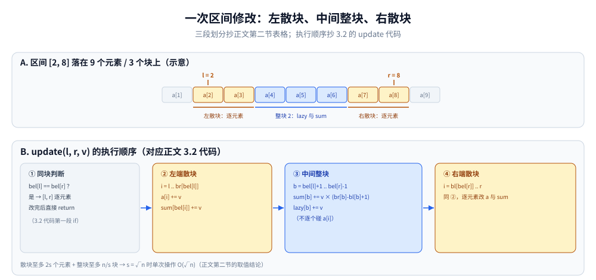
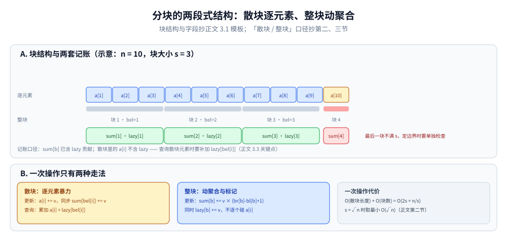

# 分块

> 把序列切成若干「块」，每块维护自己的聚合信息 —— 用 `O(√n)` 的代价
> 在「暴力遍历」和「线段树」之间取一个平衡点，是「区间问题」的第三把刀。
>
> ⭐ 边界先说清：本篇讲**序列分块**（数列分块）。
> 「数论分块 / 整除分块」（利用 `⌊n/i⌋` 只有 O(√n) 种取值压缩求和项数）与本篇只同「分块」二字，
> 是另一码事，本篇不展开；
> 更复杂的「块状链表 / 块状树」属于进阶，本篇不展开。
> 线段树与树状数组见 [区间与索引树.md](../../数据结构/树/区间与索引树.md)。
>
> 内容整理自个人学习笔记，素材见 [素材清单](../../../素材清单.md)。复杂度口径见 [复杂度分析.md](../基础算法/复杂度分析.md)。

---

## 一、什么时候用？

**本节要点**：线段树不好做、莫队又要求离线、暴力超时——三个条件夹出来的中间地带就是分块。

- 区间查询 + 区间修改，但**线段树不好做**（比如区间众数、区间第 K 小、区间出现次数）
- 需要**在线**回答，不能用离线莫队
- 数据规模 n ≤ 1e5，`O(n√n)` 能过

⭐ **判据**：**线段树/树状数组难以维护，但暴力又超时 → 分块。**

---

## 二、核心思想

**本节要点**：任何区间都拆成「左散块 + 中间整块 + 右散块」三段，散块暴力、整块走聚合。

把长度 n 的序列切成 `B` 个块，每块大小约 `√n`：

```text
[1..s] [s+1..2s] ... [ks+1..n]
 块1     块2          块k
```

**区间 [l, r] 的处理分三段**：

| 段 | 处理方式 |
|---|---|
| 左端「散块」 | 逐元素暴力 |
| 中间「整块」 | 用块的聚合信息批量处理 |
| 右端「散块」 | 逐元素暴力 |

⭐ **一次操作代价** = `O(散块长度) + O(块数)` = `O(2s + n/s)`，当 `s = √n` 时取最小值 `O(√n)`。



上图把上面那张三段表画成实物（示意：9 个元素、s = 3，区间 [2, 8]）：两端至多 s−1 个元素留在散块里逐元素暴力（黄），中间整块 2（蓝）只动 lazy 与 sum。下图对应 3.2 代码的执行顺序：先做同块判断，命中就整段逐元素改完直接 return，否则依次走左散块、中间整块、右散块——散块至多 2s 个元素、整块至多 n/s 块，才有 s = √n 时单次 O(√n) 的代价结论。

---

## 三、基础模板

**本节要点**：预处理定块边界，修改和查询都按「散块逐元素 + 整块动 lazy」三段式写。

### 3.1 预处理

```go
const N = 100010
const BlockSize = 316 // ≈ √1e5

var a [N]int      // 原数组
var sum [N]int    // 每块的聚合值
var lazy [N]int   // 每块的懒标记
var bl, br [N]int // 每块的左右端点
var bel [N]int    // 每个元素属于哪一块
var blockCnt int

func build(n int) {
	blockCnt = (n + BlockSize - 1) / BlockSize
	for i := 1; i <= blockCnt; i++ {
		bl[i] = (i - 1) * BlockSize + 1
		br[i] = i * BlockSize
	}
	if br[blockCnt] > n {
		br[blockCnt] = n
	}
	for i := 1; i <= n; i++ {
		bel[i] = (i-1)/BlockSize + 1
		sum[bel[i]] += a[i]
	}
}
```

### 3.2 区间修改（加法）

```go
func update(l, r, v int) {
	if bel[l] == bel[r] { // 同一块内：暴力
		for i := l; i <= r; i++ {
			a[i] += v
			sum[bel[i]] += v
		}
		return
	}
	// 左端散块
	for i := l; i <= br[bel[l]]; i++ {
		a[i] += v
		sum[bel[i]] += v
	}
	// 中间整块
	for b := bel[l] + 1; b <= bel[r]-1; b++ {
		sum[b] += v * (br[b] - bl[b] + 1)
		lazy[b] += v
	}
	// 右端散块
	for i := bl[bel[r]]; i <= r; i++ {
		a[i] += v
		sum[bel[i]] += v
	}
}
```

### 3.3 区间查询（求和）

```go
func query(l, r int) int {
	res := 0
	if bel[l] == bel[r] {
		for i := l; i <= r; i++ {
			res += a[i] + lazy[bel[i]]
		}
		return res
	}
	for i := l; i <= br[bel[l]]; i++ {
		res += a[i] + lazy[bel[i]]
	}
	for b := bel[l] + 1; b <= bel[r]-1; b++ {
		res += sum[b] // sum 已含 lazy 的贡献
	}
	for i := bl[bel[r]]; i <= r; i++ {
		res += a[i] + lazy[bel[i]]
	}
	return res
}
```

⭐ **关键点**：`sum[b]` 已经包含 `lazy[b]` 的影响（更新时同步维护），散块查询时元素要**额外加 `lazy[bel[i]]`**。



上排是逐元素存的 a[i]，下排是每块各存一份的 sum[b] 与 lazy[b]（示意 n = 10、s = 3；正文模板用 BlockSize = 316 ≈ √1e5）。两套账的口径差正是上面关键点的来源：sum[b] 已含 lazy 贡献，而散块里的 a[i] 不含，查询散块元素必须补加 lazy[bel[i]]；第 4 块不满 s，就是第七节「块边界算错 / 检查最后一块长度」这个坑的示意形态。右半再收一句总账：散块逐元素、整块动聚合，一次操作 O(2s + n/s)。

---

## 四、复杂度与参数选择

**本节要点**：块大小没有绝对最优，按操作比例在 √n 附近调，代价是常数比线段树大。

| 操作 | 复杂度 |
|---|---|
| 预处理 | O(n) |
| 区间修改 | O(√n) |
| 区间查询 | O(√n) |

⭐ **块大小 `s` 的选择**：

| 场景 | 推荐 s |
|---|---|
| 通用区间操作 | `√n` |
| 修改多、查询少 | 稍小（摊薄散块代价） |
| 查询多、修改少 | 稍大（摊薄整块代价） |
| 混合操作 + 块内暴力 | 常用 `n / √m` 或 `√n` |

⚠️ **块大小没有绝对最优**，要根据操作比例调；实际常数比线段树大，但代码短、灵活。

---

## 五、典型应用

**本节要点**：分块的不可替代性在于「非线性聚合」——众数、第 K 小、出现次数这类线段树装不进节点的信息。

| 场景 | 说明 |
|---|---|
| 区间加 + 区间和 | 最基础，对应线段树 |
| 区间众数 | 线段树做不到，分块经典应用 |
| 区间第 K 小 | 配合块内排序（块内二分） |
| 区间内某值出现次数 | 配合块内哈希表 |
| 区间内不同数个数 | 离线莫队更优；在线分块 |
| 区间内 mex | 配合块内位图 |
| 动态维护序列 + 插入删除 | 块状链表 |
| 二维分块 | 矩阵上的区间操作 |

⭐ **分块的不可替代性**：**线段树只能维护「满足结合律」的信息**，一旦需要「计数」「众数」「排序」这种非线性聚合，线段树就失效了。此时分块是通用解法。

---

## 六、与线段树 / 莫队的对比

**本节要点**：一张判据表——满足结合律走线段树，不满足再按「能否离线」分流到莫队或分块。

| 维度 | 分块 | 线段树 | 莫队 |
|---|---|---|---|
| 复杂度 | O(√n) 每次 | O(log n) 每次 | O((n+q)√n) 整体 |
| 灵活性 | ⭐ 极高 | 低（只支持结合律） | 中（离线） |
| 在线/离线 | 在线 | 在线 | 只能离线 |
| 实现难度 | 低 | 中 | 中 |
| 常数 | 大 | 小 | 中 |

⭐ **判据**：

- 聚合信息满足结合律 → **线段树 / 树状数组**
- 不满足结合律但能离线 → **莫队**
- 不满足结合律且必须在线 → **分块**

---

## 七、常见坑

**本节要点**：块边界、lazy 与 sum 的双重记账、最后一块长度，三处分量最重。

| 坑 | 说明 |
|---|---|
| **块边界算错** | `bel[i] = (i-1)/s + 1`，从 1 开始 |
| **散块和整块的懒标记** | 整块的 `sum` 含 lazy，散块元素要额外加 |
| **块大小不适配 n** | 手动开方时要检查最后一块长度 |
| **下标从 0 开始** | 建议转成 1-indexed，代码更简洁 |
| **区间修改后忘记更新 sum** | 散块修改要同步 `sum[bel[i]]` |

---

## 延伸追问

- **分块和线段树的本质区别？** → 线段树把区间拆成 O(log n) 个节点，是「自顶向下二分」；分块把区间拆成 O(√n) 个块，是「粗粒度分段」。前者要求聚合操作满足结合律，后者更灵活。
- **块大小为什么是 √n？** → 散块 O(s) + 整块 O(n/s)，当 s = √n 时两项相等，总代价最小。
- **分块能支持区间第 K 小吗？** → 能。每块内部排序（预处理共 O(n log s)），统计「≤ mid 的元素个数」时对每个整块二分（O((n/s) log s)）、散块暴力（O(s)），最外层还要对答案值域做一轮二分（log V），单次查询总复杂度 O(√n × log s × log V)（取 s = √n）。
- **分块能替代莫队吗？** → 在线场景下能，代价是复杂度从 O((n+q)√n) 变成 O(q√n)，大 O 相同，但分块常数更小、支持在线。
- **分块能支持插入删除吗？** → 能，用「块状链表」：把链表按块分组，每块内部用数组，块满了就分裂。这是 STL `deque` 的一种实现思路。

---

## 关联

- [区间与索引树.md](../../数据结构/树/区间与索引树.md) — 线段树与树状数组
- [莫队算法.md](莫队算法.md) — 另一条「区间问题」路线
- [离散化.md](离散化.md) — 值域压缩
- [扫描线.md](扫描线.md) — 二维区间问题的另一种思路
- [README.md](README.md) — 高级技巧目录导读
