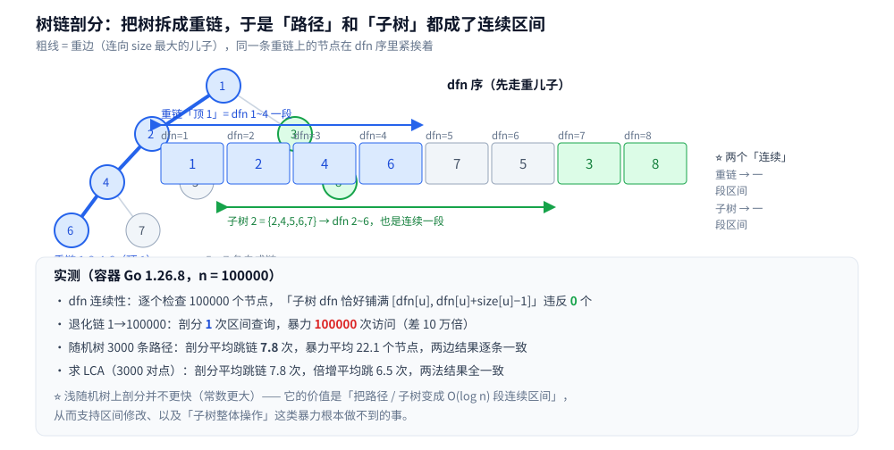

# 树链剖分

> 树上的一条路径，怎么「塞进」只会处理连续区间的线段树？
> —— **树链剖分**回答这个问题：把树拆成若干条**重链**，
> 于是一条路径变成 `O(log n)` 段**连续区间**，一棵子树变成**一段**连续区间。
>
> ⭐ 边界先说清：树的结构与遍历见 [树的遍历.md](../../数据结构/树/树的遍历.md)；
> 线段树 / 树状数组本体见 [区间与索引树.md](../../数据结构/树/区间与索引树.md)；
> 树上的经典算法题（验证 BST、LCA、树形 DP）见 [树与二叉搜索树算法.md](../基础算法/树与二叉搜索树算法.md)；
> DFS 的 `tin`/`tout` 与欧拉序见 [DFS深度优先遍历.md](../图论算法/图的遍历/DFS深度优先遍历.md)。
>
> 内容整理自个人学习笔记，素材见 [素材清单](../../../素材清单.md)。

---

## 一、树上路径为什么不能直接交给线段树？

**本节要点**：因为线段树只能处理**连续区间**，而树上一条路径上的节点，在**任何一种**「按遍历顺序编号」的方案里都不是连续的一段。

先说清楚问题出在哪：

```text
线段树的输入：一个数组 —— 下标必须是连续的
树上的一条路径：一堆「散」在树上的节点，彼此不成段
```

朴素做法只有两种，各有一个绕不过去的坎：

| 做法 | 复杂度 | 卡在哪 |
|---|---|---|
| **逐点往上走**（暴力） | 与**路径长度**成正比 | 树退化成链时就是 `O(n)`；且**不支持区间修改** |
| **按遍历顺序编号**（如普通的先序） | — | 路径上的节点编号**不连续**，线段树用不上 |

⭐ 关键洞察：我们要的编号方案，必须让「**路径**」和「**子树**」这两类集合，
都能表示成**少量连续区间**。树链剖分（HLD）给的正是这样一个编号。

---

## 二、重链剖分是怎么把树「拍平」的？

**本节要点**：两遍 DFS —— 第一遍算出每个节点的**子树大小**与**重儿子**；第二遍**先走重儿子**做编号，于是每条重链在编号上一段接一段。

### 2.1 第一遍：找重儿子

对每个节点 `u`，在它的儿子里挑**子树最大**的那个，记为 `heavy[u]`（**重儿子**），
连向它的边叫**重边**；其余儿子叫轻儿子，连边叫轻边。

```text
dfs1(u, p):
    parent[u] = p;  size[u] = 1
    for v in children(u):
        depth[v] = depth[u] + 1
        dfs1(v, u)
        size[u] += size[v]
        if size[v] > size[heavy[u]]: heavy[u] = v
```

### 2.2 第二遍：先走重儿子，分配 dfn

```text
dfs2(u, t):                 // t = 当前重链的链顶
    top[u] = t
    dfn[u] = ++cur          // dfn 就是「线段树上的下标」
    if heavy[u] != 0: dfs2(heavy[u], t)        // ⭐ 重儿子继承同一条链
    for v in children(u) where v != heavy[u]:
        dfs2(v, v)                             // ⭐ 轻儿子自己开一条新链
```

⭐ **顺序是这里唯一的「魔法」**：先沿重儿子一路走到底，再回头处理轻儿子 ——
于是**同一条重链上的节点，`dfn` 恰好是一段连续的整数**。



---

## 三、路径查询为什么是 O(log n) 段？

**本节要点**：路径 `u → LCA → v` 被拆成「若干条重链上的一段」；
而**从任一节点往上跳，最多经过 `O(log n)` 条轻边**，所以跳链次数是 `O(log n)`。

### 3.1 核心不变量：轻边数量是 O(log n)

```text
每走一条轻边（从 u 到它的父）意味着什么？
→ 那个父至少还有一个「比重儿子更大」的儿子？不 —— 反过来看：
   轻儿子 v 的 size[v] ≤ (size[u] − 1) / 2
   因为重儿子才是 size 最大的那个，轻儿子连「一半」都占不到
```

所以每次往上跨一条轻边，**所在子树的规模至少减半** → 从任一节点到根，**轻边数 ≤ ⌊log₂n⌋**。
而一条重链内部在 dfn 上是连续的，可以用**一次**线段树区间查询覆盖 —— 于是：

```text
跳链次数 = 轻边数 + 1 = O(log n)
每次跳链 = 一次线段树区间查询 = O(log n)
路径查询总复杂度 = O(log² n)
```

### 3.2 查询代码的样子

```text
path(u, v):
    while top[u] != top[v]:
        if depth[top[u]] < depth[top[v]]:  交换 u, v
        // 现在 u 所在链更深，处理 [dfn[top[u]], dfn[u]] 这一段
        区间查询 / 修改( dfn[top[u]], dfn[u] )
        u = parent[top[u]]                  // 跳出这条链
    // 现在 u、v 在同一条链上
    if depth[u] > depth[v]:  交换 u, v
    区间查询 / 修改( dfn[u], dfn[v] )       // 这一段就是路径的最后一截
```

⭐ 注意这段代码与「倍增 LCA」是同一个骨架（**谁深跳谁**）——
区别只在于：LCA 只要一个点，剖分要**沿途每一段区间**。

### 3.3 实测

**✅ 实测口径**：容器 `golang:1.26-alpine`，Go 1.26.8，纯标准库、无第三方依赖；两遍运行逐行相同。
`n = 100000` 的随机树（父节点随机取更小的下标），`m = 3000` 条随机路径。

| 做法 | 读数 |
|---|---|
| 树链剖分 | 平均**跳链 7.8 次**、区间查询 8.8 次 |
| 暴力（逐点往上） | 平均**访问 22.1 个节点** |

**3000 条路径的和逐条一致**（这是必须做的对照：快但算错是这类结构最危险的失败）。

⚠️ ⭐ **一个必须如实说的结论**：这张随机树的**平均深度只有 11.5** ——
在这种浅树上，剖分的常数反而**大于**暴力（每跳一次链要做一次 `O(log n)` 的线段树查询）。
**所以「剖分更快」不是它存在的理由**（下一节与第五节才是）。

---

## 四、子树操作为什么只要一段？

**本节要点**：因为第二遍 DFS 是**深度优先**的 —— 任一节点的整棵子树，在 `dfn` 上是**一段连续的区间** `[dfn[u], dfn[u] + size[u] − 1]`。

这是剖分最容易被忽略、却最实用的一条性质：

```text
子树全部加一个值      →  区间加，一次线段树操作
子树所有点的权值和    →  区间求和，一次线段树操作
```

⭐ **这条性质是「dfs 序」本身带来的**（剖分只是它的一种具体编号），
但它把「子树」这个本来要递归遍历的结构，变成了**一次区间操作** —— 这才是剖分真正值钱的地方。

### 4.1 实测：逐个节点验证

**✅ 实测口径**（同上容器）：对 `n = 100000` 的每一个节点 `u`，
检查「子树里所有节点的 `dfn` 集合」是否**恰好铺满** `[dfn[u], dfn[u] + size[u] − 1]`。

| 检查项 | 结果 |
|---|---|
| 逐个检查的节点数 | 100000 |
| **违反「子树 = 一段连续区间」的节点数** | **0** |

⭐ 这条验证比「跑几个用例看看对不对」强得多 —— 它是**对全部节点**的结构性断言。

---

## 五、求 LCA 为什么能顺带做掉？

**本节要点**：路径查询的骨架本身就是「两边往链顶跳、谁深跳谁」；**当两个节点跳到同一条链上时，较浅的那个就是 LCA**。

```text
lca(u, v):
    while top[u] != top[v]:
        if depth[top[u]] < depth[top[v]]:  交换 u, v
        u = parent[top[u]]
    return 更浅的那个（depth 小的）
```

**✅ 实测**（同上容器，同为 3000 对随机点）：

| 做法 | 读数 |
|---|---|
| 剖分求 LCA | 平均**跳链 7.8 次** |
| 倍增求 LCA | 平均**向上跳 6.5 次**（跳数固定为 `O(log n)` 量级） |

**3000 对点的 LCA 结果全部一致**。

⭐ **判据：什么时候用哪个？**

- **只要 LCA**：倍增更简单、常数更小（实测 6.5 vs 7.8），**没有理由上剖分**；
- **要路径上的区间操作**：剖分**顺手**就能给 LCA，不必再维护一张倍增表 —— 这是「一碗水端平」的收益。

> ⚠️ 三种 LCA 解法（倍增 / 欧拉序 + 稀疏表 / Tarjan 离线）的**原理、代码与代价对照**见
> [树上问题.md](../图论算法/树上问题.md) 第二~四节 —— 本篇只讲「剖分顺手做掉」这条支线，
> 不与那边重复。

---

## 六、剖分适合什么样的题？

**本节要点**：判据是「**路径 / 子树上要不要做区间操作**」——
只查静态信息时，暴力或倍增可能更简单；**一旦涉及「带修改的路径查询」，剖分几乎是标配**。

```text
□ 树上路径要「求和 / 最值 / 加一个值 / 赋值」，且可能反复修改？
│   └─ 树链剖分 + 线段树（本篇）
□ 只问「两点距离 / 祖孙关系 / 一次性路径和」？
│   └─ 别上剖分：倍增 LCA + 前缀和就够，常数更小
□ 只做「子树整体操作」，路径无关？
│   └─ 只要 dfs 序即可，不必剖分（剖分是「路径也照顾」的加强版）
□ 树是静态的、且只做「路径加 + 单点查」？
│   └─ 树上差分更轻（不必线段树）
```

### 6.1 退化树上剖分的抵抗力（实测）

**✅ 实测口径**（同上容器）：把 `n = 100000` 退化成**一条链**，求 `1 → 100000` 的路径和。

| 做法 | 读数 |
|---|---|
| 剖分 | **跳链 0 次、区间查询 1 次**（整条链就是一条重链） |
| 暴力 | 访问 **100000** 个节点 |

**访问次数差 10 万倍**，两种做法的结果一致。

⭐ **这才是剖分「与树形无关」的证明**：无论树长成什么样，
一条路径永远只对应 `O(log n)` 段区间 —— **它把复杂度从「依赖树高」换成了「依赖链数」**，
而链数由「轻边数 ≤ log n」这条不变量兜底。

⚠️ **一个工程上的坑**：两次 DFS 都是**递归**的，链式树会递归 `n` 层。
小数据无碍，`n` 到百万级时要改成**迭代版**（或显式栈），否则可能栈溢出。

---

## 使用：这些实现在哪些系统里

**本节要点**：树链剖分主要活在算法竞赛里，但它背后的两个思想在工程中随处可见。

| 场景 | 用到的是哪个思想 | 说明 |
|---|---|---|
| **版本控制 / 文件系统的树形目录操作** | **子树 = 连续区间** | 目录的「整棵子树移动 / 权限继承」如果要批量操作，dfs 序是常见编号方式 |
| **组织架构 / 权限树的批量授权** | 同上 | 「给某部门及其全部下级授权」= 一段区间操作 |
| **XML / DOM 的子树遍历** | 同上 | 文档序（document order）本身就是 dfs 序 |
| **树的路径聚合（如文件系统的路径权限）** | **路径 = O(log n) 段** | 路径上的从根到叶聚合，可以用「链」的分解加速 |
| **竞赛题：树上路径 + 修改** | 整套剖分 | 「路径加 / 路径最值 / 子树加」这类题的标配 |

⚠️ **本篇的写法说明**：上表是按**结构性质**给出的对应关系；
真实系统里未必真的叫「树链剖分」，**具体实现以各自文档 / 源码为准**。

---

## 延伸追问

- **为什么第二遍 DFS 一定要先走重儿子？** → 只有先沿重儿子走到底，同一条重链上的节点才会落在连续的 `dfn` 上；顺序换掉，「链 = 一段区间」就不成立了。
- **跳链次数为什么是 `O(log n)`？** → 每跨一条轻边，所在子树规模至少减半（重儿子才是最大的那个）；所以到根的轻边数 ≤ `log₂n`，而重链内部一次区间查询就覆盖。
- **子树为什么是一段区间？** → 第二遍 DFS 是深度优先的，一棵子树在遍历序里必然连续；实测逐个检查 100000 个节点，违反 0 个。
- **只要 LCA 要不要上剖分？** → 不用。倍增更简单（实测跳 6.5 次 vs 剖分 7.8 次）；剖分的价值是「顺手把路径拆成区间」。
- **剖分一定比暴力快吗？** → 不一定。浅随机树上暴力可能更快（实测平均 22.1 个节点 vs 剖分的 7.8 跳 + 每次 `O(log n)` 查询）；它的收益在**退化树**（差 10 万倍）和**需要区间修改**时。
- **路径查询的复杂度到底是多少？** → `O(log² n)` = `O(log n)` 段区间 × 每段 `O(log n)` 的线段树操作。若维护量有可减性（如求和）且不带修改，可以用前缀和把每段降到 `O(1)`。
- **为什么它「与树形无关」？** → 无论树长什么样，路径永远只对应 `O(log n)` 段区间 —— 复杂度挂在「链数」上，而链数由轻边不变量兜底。
- **大树上要注意什么？** → 两次 DFS 的递归深度 = 树高，链式树会递归 `n` 层；`n` 到百万级要改迭代版。

---

## 关联

- [树的遍历.md](../../数据结构/树/树的遍历.md) — DFS 序的基础（`dfn` 就是遍历序号）
- [区间与索引树.md](../../数据结构/树/区间与索引树.md) — 线段树本体：剖分把路径 / 子树交给它
- [树与二叉搜索树算法.md](../基础算法/树与二叉搜索树算法.md) — LCA 的另一条路（倍增 / 后序），与本篇第五节互为对照
- [DFS深度优先遍历.md](../图论算法/图的遍历/DFS深度优先遍历.md) — `tin`/`tout` 与「子树是连续区间」的来处
- [树形DP.md](../动态规划/树形DP.md) — 树上自底向上汇总的另一种思路（把「子树」当状态）
- [树的形态与选型.md](../../数据结构/树/树的形态与选型.md) — 选型总纲：什么时候该用树、用哪种树
- [离散化.md](离散化.md) — 另一个「把大值域压进数组」的手法，与剖分同属「换个编号」的思路
- [复杂度分析.md](../基础算法/复杂度分析.md) — `O(log² n)` 与摊还分析的复杂度口径
- [素材清单.md](../../../素材清单.md) — 素材来源登记
> 反向引用（本篇被下列文档引到）：[树上问题.md](../图论算法/树上问题.md)、[CDQ分治与整体二分.md](CDQ分治与整体二分.md)
