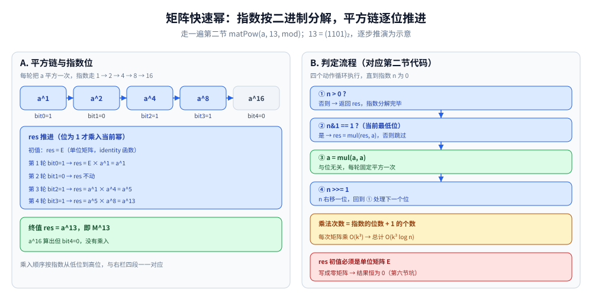

# 矩阵快速幂

> 把「线性递推」用矩阵乘法表示，再用快速幂 O(log n) 求第 n 项 ——
> 是斐波那契、递推计数类问题的标准解法。
>
> ⭐ 边界先说清：本篇讲矩阵快速幂的实现与应用。
> 快速幂的位运算基础见 [数论基础.md](../数学基础/数论基础.md)；
> DP 优化见 [线性DP.md](../动态规划/线性DP.md)。
>
> 内容整理自个人学习笔记，素材见 [素材清单](../../../素材清单.md)。复杂度口径见 [复杂度分析.md](../基础算法/复杂度分析.md)。

---

## 一、核心思想

**本节要点**：线性递推的转移矩阵固定，第 n 项就是一次矩阵幂，用快速幂降到 O(k³ log n)。

- 线性递推 `f(n) = a1*f(n-1) + a2*f(n-2) + ... + ak*f(n-k)` 可写成矩阵形式
- 转移矩阵 M 固定，`[f(n), f(n-1), ...] = M^(n-k) × [f(k), f(k-1), ...]`
- 用快速幂求 `M^(n-k)`，时间 O(k³ log n)

⭐ **判据**：**线性递推 + n 很大（如 1e18）→ 矩阵快速幂。**


读法：左栏是一般 k 阶递推 `f(n) = a1×f(n-1) + a2×f(n-2) + … + ak×f(n-k)` 对应的 M —— k×k 矩阵，第 1 行是系数行 `[a1, a2, …, ak]`，第 2..k 行是移位行（第 i 行只有第 i-1 列是 1）；状态向量 v = [f(k), f(k-1), …, f(1)] 被 `M^(n-k)` 乘一次、整个状态向前推进一格，结果的第 1 个分量就是 f(n)。右栏拆开乘法形状：新状态第 1 个分量 = 第 1 行与旧状态列的点乘，其余分量只是移位行把旧状态整体下移抄走。M 固定、与 n 无关才有幂可求——递推含 max / min 等非线性运算时写不出这个 M。

---

## 二、矩阵乘法模板

**本节要点**：把普通快速幂里的乘法换成矩阵乘法，其余骨架不变。

```go
type Matrix [][]int

func mul(a, b Matrix, mod int) Matrix {
	n, m, p := len(a), len(b), len(b[0])
	c := make(Matrix, n)
	for i := range c {
		c[i] = make([]int, p)
	}
	for i := 0; i < n; i++ {
		for k := 0; k < m; k++ {
			if a[i][k] == 0 {
				continue
			}
			for j := 0; j < p; j++ {
				c[i][j] = (c[i][j] + a[i][k]*b[k][j]) % mod
			}
		}
	}
	return c
}

func matPow(a Matrix, n, mod int) Matrix {
	// 单位矩阵
	res := identity(len(a))
	for n > 0 {
		if n&1 == 1 {
			res = mul(res, a, mod)
		}
		a = mul(a, a, mod)
		n >>= 1
	}
	return res
}
```

⭐ **复杂度来源**：循环约 ⌊log₂n⌋+1 轮，每轮至多 2 次矩阵乘法（固定一次平方 + 该位为 1 时一次乘入 res），每次乘法 O(k³) → 第五节的 O(k³ log n) 就是这么来的。



读法：右栏是上面 `matPow` 循环体的四段流程 —— ① 判 `n > 0`、② 最低位 `n&1 == 1` 才把当前 a 乘入 res、③ 无论该位是什么都把 a 平方一次、④ `n >>= 1` 后回到 ①。左栏以指数 13 = (1101)₂ 走了一遍（示意）：共 4 轮，乘入 a^1、a^4、a^8 三次、平方四次，res 从单位矩阵 E 累计到 a^13；a^16 虽然算了出来，但 bit4 = 0 没有乘入。注意 ① 之前的初值必须是单位矩阵 E —— 写成零矩阵结果恒为 0，这是第六节的坑。

---

## 三、典型应用：斐波那契

**本节要点**：二阶递推对应 2×2 转移矩阵 `[[1,1],[1,0]]`，幂次是 n-1 不是 n。

```text
[f(n)  ]   [1 1]   [f(n-1)]
[f(n-1)] = [1 0] × [f(n-2)]
```

所以：

```text
[f(n)]   [1 1]^(n-1)   [f(1)]
[f(n-1)] = [1 0]      × [f(0)]
```

- 时间 O(log n)
- 空间 O(1)

⭐ 本节幂次写 n-1，配的是起点 `[f(1), f(0)]`；第一、六节的 k 阶写法 M^(n-k) 配起点 `[f(k), …, f(1)]`（斐波那契 k=2 即 M^(n-2) × [f(2), f(1)]）—— 两种写法等价，只差起点取在哪一位。


读法：左栏从 `f(n) = 1 × f(n-1) + 1 × f(n-2)` 逐行读出 M = [[1, 1], [1, 0]] —— 第 1 行抄 f(n) 右边的系数 1、1，第 2 行把上一行整体下移一位；右栏核对幂次与起点的配对：`M^(n-1) × [f(1), f(0)] = [f(n), f(n-1)]`，代入 f(1) = 1、f(0) = 0 验算得 n = 2 时 M^1 × [1, 0] = [1, 1]、n = 3 时 M^2 × [1, 0] = [2, 1]。只改幂次、不改起点会全表错位。

---

## 四、典型题

**本节要点**：凡是「状态有限 + 转移固定」的计数/递推问题都能套这个框架。

| 题 | 转移矩阵 |
|---|---|
| 斐波那契 | `[[1,1],[1,0]]` |
| 爬楼梯 | 同斐波那契 |
| 泰波那契 | `[[1,1,1],[1,0,0],[0,1,0]]` |
| 递推计数 | 根据递推式构造 |
| 路径计数（有向图） | 邻接矩阵的 n 次幂 |
| 字符串染色 | 转移矩阵 + 状态压缩 |
| 矩阵加速 DP | 转移矩阵固定 |

---

## 五、复杂度

**本节要点**：瓶颈在矩阵乘法的 k³，log n 部分反而便宜。

| 维度 | 值 |
|---|---|
| 时间 | O(k³ log n)，k 为矩阵大小 |
| 空间 | O(k²) |

---

## 六、常见坑

**本节要点**：取模、单位矩阵、幂次与初始向量的对应关系，三处最容易算错。

| 坑 | 说明 |
|---|---|
| **模运算** | 每步都要取模，避免溢出 |
| **单位矩阵** | 快速幂的初始值必须是单位矩阵 |
| **初始向量** | 转移矩阵的幂次是 n - k，不是 n |
| **k 太大** | k > 10 时 O(k³ log n) 可能超时 |
| **负数** | 取模时要处理负值 |

---

## 延伸追问

- **矩阵快速幂和快速幂什么关系？** → 结构相同，只是乘法换成矩阵乘法。
- **什么时候不能用矩阵快速幂？** → 递推式非线性（如含 max、min），或 k 太大。
- **矩阵快速幂能处理带常数项的递推吗？** → 能，把常数也作为一个状态（如 `f(n) = a*f(n-1) + b` → 矩阵加一维）。
- **图上的路径计数怎么用？** → 邻接矩阵的 n 次幂，`[i][j]` 表示 i 到 j 长度 n 的路径数。
- **复杂度还能优化吗？** → 有，如 Berlekamp-Massey + 快速幂可以做到 O(k log k log n)，但实现复杂。
- **mul 三重循环为什么是 i、k、j 顺序、且 `a[i][k] == 0` 就跳过？** → j 放最内层让 `c[i][j]` 连续访问、缓存友好；稀疏矩阵里大量元素为 0，`continue` 直接省掉一整层内循环。

---

## 关联

- [数论基础.md](../数学基础/数论基础.md) — 快速幂
- [线性DP.md](../动态规划/线性DP.md) — 线性递推
- [状态压缩DP.md](../动态规划/状态压缩DP.md) — 状态压缩
- [README.md](README.md) — 高级技巧目录导读
