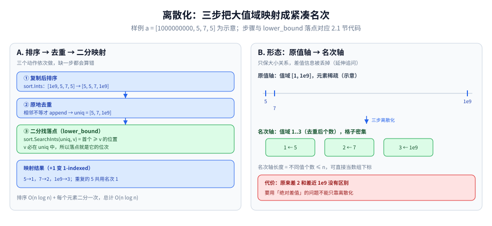

# 离散化

> 把「大值域、稀疏取值」的数据压缩成「小值域、密集取值」——
> 是线段树、树状数组、树套树等结构的前置步骤。
>
> ⭐ 边界先说清：本篇讲离散化的实现与适用场景。
> 线段树与树状数组见 [区间与索引树.md](../../数据结构/树/区间与索引树.md)；
> 二分查找见 [二分查找.md](../基础算法/二分查找.md)。
>
> 内容整理自个人学习笔记，素材见 [素材清单](../../../素材清单.md)。复杂度口径见 [复杂度分析.md](../基础算法/复杂度分析.md)。

---

## 一、什么时候用？

**本节要点**：值域大、元素少、只需要大小关系——三个特征同时出现就该离散化。

- 值域很大（如 `[1, 1e9]`），但实际出现的数据只有 n 个（n ≤ 1e5）
- 需要用数组下标表示值（如线段树、树状数组、桶计数）
- 只需知道「大小关系」，不需要保留原值

⭐ **判据**：**值域巨大但元素稀疏 → 离散化。**

---

## 二、基础离散化

**本节要点**：排序 + 去重 + 二分三步把原值映射成 1-indexed 的紧凑下标。

### 2.1 只需要相对大小

```go
func discretize(a []int) []int {
	sorted := make([]int, len(a))
	copy(sorted, a)
	sort.Ints(sorted)
	// 去重
	uniq := sorted[:1]
	for i := 1; i < len(sorted); i++ {
		if sorted[i] != sorted[i-1] {
			uniq = append(uniq, sorted[i])
		}
	}
	// 二分查找映射
	res := make([]int, len(a))
	for i, v := range a {
		res[i] = sort.SearchInts(uniq, v) + 1 // 1-indexed
	}
	return res
}
```

- 时间 O(n log n)（排序 + 每个元素二分）
- 空间 O(n)

⭐ `sort.SearchInts(uniq, v)` 就是 `lower_bound`：返回 `uniq` 中**首个 ≥ v 的位置**。v 来自原数组、去重后必然还在 `uniq` 里，所以落点正是 v 的名次，`+1` 变 1-indexed。



读法：左栏按 2.1 代码走一遍示意样例 a = [1000000000, 5, 7, 5] —— ① 复制后排序得 [5, 5, 7, 1e9]、② 相邻不等才 append 去重得 uniq = [5, 7, 1e9]、③ 用 lower_bound 二分找落点再 +1，映射结果 5→1、7→2、1e9→3，重复的 5 共用名次 1。右栏看形态变化：原值轴上挤在两端、互相隔着天文数字的三个值，落到名次轴变成 1..3 三个密集格子，长度 = 不同值个数 ≤ n，可直接当数组下标。代价在右下红框：名次轴上「差 2」和「差近 1e9」没有区别，要用绝对差值的问题不能只靠离散化。

### 2.2 需要保留原值

用一个哈希表 / 数组保存「离散化后的值 → 原值」的映射。

---

## 三、带权离散化（区间离散化）

**本节要点**：处理区间而非点时，端点 ± 1 也要进离散化数组，否则差分下标缺失。

当处理的不是「点」而是「区间」时，要同时把**端点**和**端点+1**都加入离散化数组：

- 区间 `[l, r]` 加 v 的差分操作，需要 `l` 和 `r+1`
- 若只离散化 l 和 r，`r+1` 不在映射里会出错

⭐ **判据**：**涉及「区间」而非「点」时，必须把端点 ± 1 也纳入离散化。**

---

## 四、典型应用

**本节要点**：离散化本身不解题，它是各种「用下标表示值」结构的入口步骤。

| 场景 | 说明 |
|---|---|
| 线段树 / 树状数组 | 值域大时用离散化下标 |
| 扫描线求矩形面积 | 把 y 坐标离散化 |
| 逆序对计数 | 把值离散化后用树状数组 |
| 区间更新 + 单点查询 | 差分 + 离散化 |
| 坐标压缩 | 几何问题 |
| 桶计数优化 | 大值域用离散化代替哈希 |

---

## 五、常见坑

**本节要点**：去重、下标起点、区间端点 +1、原值还原、负数边界，五处最容易出错。

| 坑 | 说明 |
|---|---|
| **忘记去重** | 同一个值映射到多个下标，会算错 |
| **下标从 0 还是 1 开始** | 线段树 / 树状数组通常要 1-indexed |
| **区间端点未 +1** | 区间操作时 `r+1` 不在映射里 |
| **原值查询** | 需要保留映射表才能还原原值 |
| **负数** | 排序后能正常处理，但要注意二分查找的边界 |

---

## 延伸追问

- **离散化后值域多大？** → 不超过原数组长度（去重后）。
- **离散化会改变元素之间的关系吗？** → 只保留大小关系，不保留具体差值。
- **什么时候不需要离散化？** → 值域本来就小（如 `[1, 1e5]`），或只用哈希表计数。
- **区间离散化为什么要 +1？** → 差分操作 `diff[r+1] -= v` 需要 `r+1` 这个下标。
- **离散化和哈希表计数有什么区别？** → 离散化保留大小关系，哈希表只做映射。
- **去重后能不能不二分、改成 O(1) 映射？** → 可以：去重时顺手建「值 → 名次」的哈希表，每个元素的查询降到 O(1)；总时间仍由排序主导，是 O(n log n)，二分版本只是省掉这张表。

---

## 关联

- [区间与索引树.md](../../数据结构/树/区间与索引树.md) — 线段树与树状数组
- [二分查找.md](../基础算法/二分查找.md) — 二分查找映射
- [扫描线.md](扫描线.md) — 扫描线的离散化应用
- [README.md](README.md) — 高级技巧目录导读
> 反向引用（本篇被下列文档引到）：[可持久化数据结构.md](../../数据结构/树/可持久化数据结构.md)、[计算几何.md](../数学基础/计算几何.md)、[CDQ分治与整体二分.md](CDQ分治与整体二分.md)、[分块.md](分块.md)、[树链剖分.md](树链剖分.md)、[莫队算法.md](莫队算法.md)
