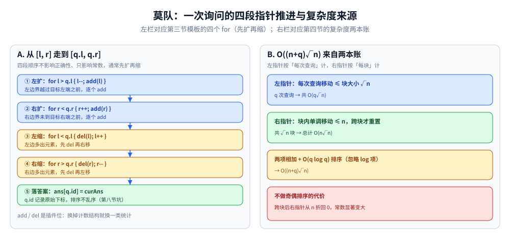
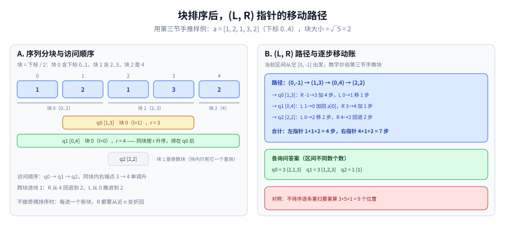

# 莫队算法

> 处理**离线**区间查询的通用框架：把查询按「分块 + 排序」排列，
> 用「移动左右指针」的方式暴力维护区间信息 —— 平均复杂度 `O((n+q)√n)`。
>
> ⭐ 边界先说清：本篇讲**基础莫队**（无修改）。
> 带修改莫队、树上莫队、回滚莫队属于进阶，本篇只给方向。
> 分块见 [分块.md](分块.md)；线段树见 [区间与索引树.md](../../数据结构/树/区间与索引树.md)。
>
> 内容整理自个人学习笔记，素材见 [素材清单](../../../素材清单.md)。复杂度口径见 [复杂度分析.md](../基础算法/复杂度分析.md)。

---

## 一、什么时候用？

**本节要点**：离线 + 指针移一格能 O(1) 更新答案 + 规模到得了 (n+q)√n，三条缺一不写莫队。

- 有一堆**离线**区间查询，形如 `[l, r]` 求某个值
- 已知 `[l, r]` 的答案，能**O(1) 或 O(log n)** 推出 `[l±1, r]` 或 `[l, r±1]` 的答案
- 查询数 q 与序列长度 n 同量级，`O((n+q)√n)` 能过

⭐ **判据**：**离线区间查询 + 移动指针可快速更新答案 → 莫队。**

---

## 二、核心思想

**本节要点**：给查询排序，让相邻查询区间尽量接近，把重复扫描换成指针增量移动。

**暴力做法**：对每个查询从 `[l, r]` 重新扫一遍，O(n) 每次，总共 O(nq)。

**莫队的优化**：把查询**排序**，让相邻查询的 `[l, r]` **尽量接近**，指针移动总代价从 O(nq) 降到 O((n+q)√n)。

**排序规则**：

1. 按**左端点所属的块**排序；
2. 同一块内，按**右端点**排序；
3. 若块编号为奇数，右端点**降序**（优化常数，称为「奇偶排序」）。

⭐ **直观理解**：把 n 个位置切成 √n 块，每块内右端点单调移动（总移动 O(n)），跨块时右端点重置。左右指针移动总代价 O((n+q)√n)。

---

## 三、基础模板

**本节要点**：排序回调 + 四个 for 扩缩指针，add/del 一换整个框架就能换一类统计。

```go
type Query struct {
	l, r, id int
}

var (
	a      []int
	cnt    []int // 每个值出现次数
	curAns int   // 当前区间答案
)

// add：把位置 x 加入区间
func add(x int) {
	cnt[a[x]]++
	if cnt[a[x]] == 1 {
		curAns++
	}
}

// del：把位置 x 移出区间
func del(x int) {
	cnt[a[x]]--
	if cnt[a[x]] == 0 {
		curAns--
	}
}

func mo(queries []Query, n int) []int {
	blockSize := int(math.Sqrt(float64(n)))
	sort.Slice(queries, func(i, j int) bool {
		bi := queries[i].l / blockSize
		bj := queries[j].l / blockSize
		if bi != bj {
			return bi < bj
		}
		if bi%2 == 1 { // ⭐ 奇偶排序
			return queries[i].r > queries[j].r
		}
		return queries[i].r < queries[j].r
	})

	ans := make([]int, len(queries))
	l, r := 0, -1 // 当前空区间 [l, r]
	for _, q := range queries {
		for l > q.l {
			l--
			add(l)
		}
		for r < q.r {
			r++
			add(r)
		}
		for l < q.l {
			del(l)
			l++
		}
		for r > q.r {
			del(r)
			r--
		}
		ans[q.id] = curAns
	}
	return ans
}
```

⭐ **指针移动顺序**：四个 `for` 的先后顺序**不影响正确性**，但影响常数。通常先扩再缩。



读法：左栏把模板里那四个 `for` 排成流水 —— ① 左扩 `l > q.l` 时 `l--; add(l)`、② 右扩 `r < q.r` 时 `r++; add(r)`、③ 左缩 `l < q.l` 时 `del(l); l++`、④ 右缩 `r > q.r` 时 `del(r); r--`，四段走完落 `ans[q.id] = curAns`（q.id 保序，对应第八节的坑）。右栏是复杂度两本账：左指针每次查询移动 ≤ 块大小 √n、按查询计 O(q√n)；右指针块内单调 ≤ n、共 √n 块、按块计 O(n√n)；两项相加才是 O((n+q)√n)，右下红框提醒不做奇偶排序时跨块后右指针要从 n 折回 0。

以 `a = [1, 2, 1, 3, 2]`（下标 0..4）、求「区间不同数个数」为例手推（块大小 = √5 = 2）：

```text
查询（l, r, id）:  q0 = (1,3,0)   q1 = (0,4,1)   q2 = (2,2,2)

排序：先按左端点所在块（l/2），同块按 r 升序
  q0 块0(r=3) → q1 块0(r=4) → q2 块1
  （q2 所在块编号为奇数，但块内只有它一个查询，奇偶排序不改变结果）

指针移动（当前区间初始为空 [0,-1]，答案 = 区间内不同数个数）:
  → q0 [1,3]:  r: -1→3 加 a[0..3]，l: 0→1 删 a[0]     答案 3 = {2,1,3}
  → q1 [0,4]:  l: 1→0 加 a[0]，r: 3→4 加 a[4]         答案 3 = {1,2,3}
  → q2 [2,2]:  l: 0→2 删 a[0..1]，r: 4→2 删 a[4],a[3]  答案 1 = {1}

总移动：左指针 1+1+2 = 4 步，右指针 4+1+2 = 7 步
对照：不排序逐条重扫则要重算 3+5+1 = 9 个位置（查询越多差距越大）
```



读法：左栏把上面手推块画在序列上 —— 下标 0..4 按块大小 2 切成块 0（0..1）、块 1（2..3）、块 2（4），三条询问按「左端点所在块 + 块内 r」排成 q0 [1,3] → q1 [0,4] → q2 [2,2]，同块内右端点 3 → 4 单调升，跨进块 1 时 R 从 4 回退到 2。右栏记移动账：(L,R) 从空区间 (0,-1) 出发，路径 (0,-1) → (1,3) → (0,4) → (2,2)，左指针 1+1+2 = 4 步、右指针 4+1+2 = 7 步；对照不排序逐条重扫要重算 3+5+1 = 9 个位置。

---

## 四、复杂度

**本节要点**：左指针按查询计 O(q√n)，右指针按块计 O(n√n)，两项相加即总账。

| 维度 | 值 | 说明 |
|---|---|---|
| 排序 | O(q log q) | 一次性 |
| 左指针移动 | O(q√n) | 每次查询最多移动 √n |
| 右指针移动 | O(n√n) | 每块内单调，跨块重置 |
| 总复杂度 | **O((n + q)√n)** | 忽略 log 项 |

⭐ **块大小为什么取 √n**：设块大小为 B，左指针每次查询 ≤ B、共 O(qB)；右指针每块 ≤ n、共 n/B 块、合计 O(n²/B)。两项之和 qB + n²/B 在 B = n/√q 时最小，q 与 n 同量级时 B 正好落到 √n —— 这就是上表两行「按查询计 / 按块计」的来源，也是第八节「块大小选错」的判据。

⭐ **奇偶排序的收益**：让右指针在相邻块之间「来回摆动」变成「单方向扫」，常数通常降低 30%~50%。

---

## 五、典型应用

**本节要点**：框架不变，换掉 add/del 里维护的计数结构，就是一类新问题。

| 场景 | add / del 维护什么 |
|---|---|
| 区间不同数个数 | 每个值的出现次数，首次出现 curAns++ |
| 区间众数出现次数 | 每个值的次数 + 当前最大次数 |
| 区间众数本身 | 需要额外结构（较复杂） |
| 区间内出现次数为 K 的数 | 每个值的次数 + 次数桶 |
| 区间内某值的出现次数 | 直接计数 |
| 区间内 mex | 出现次数 + 位图 |
| 区间逆序对（带修改） | 需要树状数组辅助 |

⭐ **莫队的「万能性」**：只要能定义 `add` / `del`（指针移动时更新答案），几乎所有区间统计问题都能用莫队做。

---

## 六、与分块、线段树的对比

**本节要点**：与分块篇同一套判据——结合律归线段树，剩下的按「能否离线」分流。

| 维度 | 莫队 | 分块 | 线段树 |
|---|---|---|---|
| 在线/离线 | ⭐ 只能离线 | 在线 | 在线 |
| 复杂度 | O((n+q)√n) | O(√n) 每次 | O(log n) 每次 |
| 灵活性 | ⭐ 极高 | 高 | 低（只支持结合律） |
| 实现难度 | 中 | 低 | 中 |
| 带修改 | 进阶（三维莫队） | 支持 | 支持 |

⭐ **判据**：

- 聚合满足结合律 → **线段树**
- 不满足但能离线 → **莫队**
- 不满足且必须在线 → **分块**

---

## 七、进阶变体

**本节要点**：加时间维度、只能加不能删、树上路径——各有一个对应变体，方向在此不在展开。

| 变体 | 说明 | 复杂度 |
|---|---|---|
| **带修改莫队** | 加「时间」维度，扩展成 (l, r, t) 三维 | O(n^(5/3)) |
| **回滚莫队** | 只支持 add 或只支持 del 的问题（如区间最值） | O((n+q)√n) |
| **树上莫队** | 把树的欧拉序展开成序列 | O((n+q)√n) |
| **二次离线莫队** | 把 add/del 转化成前缀查询，配合树状数组 | O(n√n) 或更优 |
| **只加莫队** | 类似回滚，只维护 add 操作 | O((n+q)√n) |

⭐ **带修改莫队的排序**：先按 `l` 的块，再按 `r` 的块，最后按 `t` 排序；块大小取 `n^(2/3)` 最优。

---

## 八、常见坑

**本节要点**：常数（奇偶排序、块大小）、正确性（id 保序、清空 cnt）、适用性（add/del 不对称）三类。

| 坑 | 说明 |
|---|---|
| **忘记奇偶排序** | 常数大，可能 TLE |
| **指针移动顺序错** | 只影响常数，不影响正确性 |
| **add / del 不对称** | 有些问题只能 add 不能 del，要用回滚莫队 |
| **块大小选错** | 一般取 √n；带修改取 n^(2/3) |
| **整数溢出** | 区间计数类问题注意 int 溢出 |
| **多测清空** | 每次查询前 cnt 数组要清空（或换用时间戳） |
| **查询排序破坏原顺序** | 用 id 记录原始查询下标 |

---

## 延伸追问

- **莫队为什么是 O((n+q)√n)？** → 左指针每次最多移动 √n（因为按块排序），右指针在每块内单调移动 O(n)，共 √n 块，总计 O((n+q)√n)。
- **奇偶排序为什么能优化？** → 让右指针在相邻块之间「来回摆动」变成「单方向扫」，减少移动距离。
- **带修改莫队为什么是 O(n^(5/3))？** → 三维排序 + 块大小取 n^(2/3)，总移动代价 O(n^(5/3))。
- **回滚莫队是什么？** → 有些问题只支持 add（如「区间最大值」不能 del），回滚莫队通过「只扩不缩」+ 定期回滚处理。
- **树上莫队是什么？** → 把树的欧拉序（进入/离开时间戳）展开成一个序列，树上路径问题变成区间问题。
- **莫队能处理在线查询吗？** → 不能。莫队依赖排序，必须离线。
- **莫队和分块什么关系？** → 莫队的「块」用于排序；分块的「块」用于维护聚合信息。两者都基于分块思想，但用途不同。

---

## 关联

- [分块.md](分块.md) — 分块的基本思想
- [区间与索引树.md](../../数据结构/树/区间与索引树.md) — 线段树与树状数组
- [离散化.md](离散化.md) — 值域压缩（莫队常用）
- [位运算.md](../基础算法/位运算.md) — 位图维护
- [README.md](README.md) — 高级技巧目录导读
> 反向引用（本篇被下列文档引到）：[CDQ分治与整体二分.md](CDQ分治与整体二分.md)
