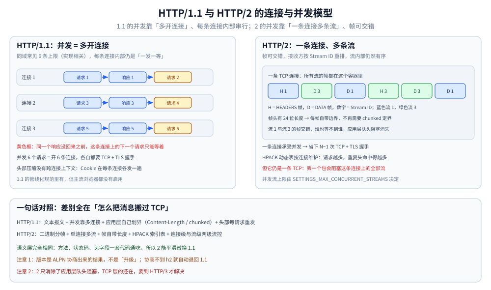

# HTTP/1.1 与 HTTP/2 的区别

> 同一套 HTTP 语义，两种传输绑定：连接与并发模型（持久连接 vs 单连接多流）、消息定界（`Content-Length` / `chunked` vs 帧自带长度）、头部传输（逐请求重发 vs HPACK 索引表）、两级流控、优先级与服务端推送的**现状**，以及队头阻塞到底发生在哪一层。
>
> 内容整理自个人学习笔记，参考资料与原始素材见 [素材清单](../../素材清单.md)。
>
> ⚠️ 本篇是本仓「HTTP/1.1 ↔ HTTP/2 对照」的**唯一详解源**：HTTP/2 的字节级机制（帧头逐字段、HPACK 编码形态、流状态机、两层限额）见 [HTTP2机制.md](../../03-数据与中间件/中间件/RPC框架/gRPC/HTTP2机制.md)；gRPC 与 HTTP 的关系、连接池与 Go/Java 客户端实现见 [HTTP与gRPC.md](HTTP与gRPC.md)。文中引用的多路复用实测数据出自 [HTTP与gRPC.md](HTTP与gRPC.md)「使用一」第 3 节（本机 Go 实测），**本篇未重跑该实验**。

---

## 一、先立框架：同一套语义，两种承载

**本节要点**：两者的差别**全在「怎么把请求与响应搬过 TCP」这一层**——方法、状态码、头字段的语义没有变。抓住这条，就不会把「HTTP/2 的新特性」讲成语义层的差异。

### 1.1 语义层与传输绑定层是两件事

| 层 | 内容 | 1.1 与 2 是否相同 |
|---|---|---|
| **语义层** | 方法（GET/POST）、状态码（200/404）、头字段（`Host`、`Cookie`、`Cache-Control`…）、内容协商、缓存语义 | ✅ **同一套** |
| **传输绑定层** | 报文怎么编码、怎么在连接上复用、怎么定界 | ❌ 完全不同 |

HTTP/2 只在语义层加了几个**伪头字段**（`:method` / `:scheme` / `:authority` / `:path`），用来承载原来「请求行」里的信息——例如 1.1 用 `Host: example.com` 表达目标主机，2 改成 `:authority: example.com`。这不是新语义，只是**换了种写法**。

⭐ 所以最有用的一句话是：**「两者在功能上等价，差别是并发模型与传输效率」**。任何「HTTP/2 才有某功能」的说法，都要先问一句：那是语义层的东西，还是传输层的东西？

### 1.2 版本是「协商」出来的，不是「升级」出来的

浏览器不会因为服务端支持 h2 就自动用 h2。实际路径是：

```text
TLS 握手（ALPN 扩展）→ 客户端提议 h2, http/1.1 → 服务端挑一个 → 之后同一端口只说这个版本的话
```

- **HTTPS 场景一律走 ALPN**：ALPN 里没有 `h2`，就直接退回 1.1；
- **明文场景有两条入口**：`Upgrade: h2c`（先用 1.1 发请求再升级）与 **prior knowledge**（客户端事先知道对面是 h2c，直接按 HTTP/2 说话，curl 的 `--http2-prior-knowledge`）；
- ⚠️ **协商不到不会失败**：握手照样成功，只是版本不同——这正是「HTTP/2 走不通时浏览器能无缝用 1.1」的机制来源（ALPN 的实测见 [QUIC与HTTP3.md](QUIC与HTTP3.md) 3.3）。

### 1.3 全景对照表（先给结论）

| 维度 | HTTP/1.1 | HTTP/2 |
|---|---|---|
| **报文形态** | 文本：请求行 / 状态行 + 头 + 体 | 二进制分帧：9 字节帧头 + 载荷 |
| **连接与并发** | 一条连接一次一个响应；并发靠**多条连接** | 一条连接上**多条流**并发交错 |
| **消息定界** | `Content-Length` / `chunked` / 关闭连接 | 帧头 24 位长度 + `END_STREAM` 标志 |
| **头部传输** | 每次请求**整份重发** | HPACK 索引表（静态表 + 动态表，**按连接**维护） |
| **流控** | 只有 TCP 层（`rwnd`） | **连接级 + 流级**两层窗口 |
| **服务端推送** | ❌ 没有 | 协议里有 `PUSH_PROMISE`，但**主流浏览器已移除支持** |
| **优先级** | ❌ 没有 | 原方案已被弃用，改由 RFC 9218 承接 |
| **队头阻塞** | **应用层 + TCP 层** | **只剩 TCP 层** |
| **加密** | 都可选；TLS 是独立的一层 | 同左（浏览器 HTTPS 靠 ALPN 协商出 `h2`） |

> 后面每一节展开其中一行。⚠️ 建议的读法：**先读第二节（并发模型）与第七节（队头阻塞）**——它们是这张表里最容易被讲错的两行。

---

## 二、连接与并发模型

**本节要点**：1.1 的并发是「**多用几条连接**」，2 的并发是「**一条连接多条流**」。所以 2 省下的主要是**连接数与握手成本**，而不是「服务端变快了」。

### 2.1 HTTP/1.1：持久连接 + 6 条上限 + 管线化的真相

**① 持久连接是默认行为**：HTTP/1.1 起，一条 TCP 连接可以连续发多个请求—响应，不必每次新建。要关才写 `Connection: close`。这本身已经是很大的改进（省掉了每次的 TCP + TLS 握手）。

**② 但同一条连接上，响应必须按请求顺序回**——这是 1.1 并发能力的硬约束：

```text
请求 index.html → 等响应 → 请求样式文件 → 等响应 → 请求脚本 → 等响应
       ↑ 任何一步阻塞（服务端慢、下游慢），后面全部排队
```

**③ 规范里其实有「管线化」（pipelining）**：允许不等前一个响应就连续发多个请求。但它**救不了场**，原因有三：响应必须**按请求顺序**返回（慢的第一个会把后面全部堵住）、中间设备与早期实现的兼容性问题、以及各实现的差异——**主流浏览器实际上都没有启用它**。

⚠️ 表述要准：**「协议有能力，实际行为近似一次一个请求」**。把「浏览器不用」说成「协议不支持」是错的。

**④ 于是浏览器用「多条连接」来补**：对同一域名并发开若干条 TCP 连接（常见实现是 **6 条左右**，具体值属实现细节）。这带来两个副作用：

- 每条连接都要**独立握手**（TCP + TLS），连接一多，握手开销与 `TIME_WAIT` 都上来了；
- 头部压缩在这里**完全无法生效**——每条连接的上下文独立，同一个 `Cookie` 要在 6 条连接上各发一遍。

### 2.2 HTTP/2：一条连接、多条流、帧交错

HTTP/2 引入**二进制分帧层**：把每个请求—响应切成一串**帧**，帧头里带 **Stream ID**。



图怎么读：左边是 1.1 的常态——为了并发只能**多开连接**，每条连接内部仍是「一发一等」；右边是 2 的形态——**一条 TCP 连接上跑多条流**，属于不同流的帧可以交错发送，接收方按 Stream ID 重排。⚠️ 图里的 `HEADERS` / `DATA` 帧名来自 [HTTP2机制.md](../../03-数据与中间件/中间件/RPC框架/gRPC/HTTP2机制.md) 的实测帧表，不是示意。

三条关键性质：

1. **帧不要求连续**：属于同一个流的数据可以被别的流的帧插在中间；
2. **接收方按 Stream ID 重排**：重排发生在**应用层**，每个流内部仍然有序；
3. **`stream=0` 是连接级帧**：`SETTINGS`、连接级 `WINDOW_UPDATE`、`PING`、`GOAWAY` 都属于整条连接，不属于任何一条流。

⭐ 所以「多路复用」的准确含义是：**把并发从「连接」这一层搬到了「流」这一层**。

### 2.3 收益落在哪（实测结论）

同一台本机、同一个「每个请求固定慢 100ms」的服务端，发 60 个请求（数据出自 [HTTP与gRPC.md](HTTP与gRPC.md)「使用一」第 3 节）：

| 协议 | 并发 | 连接数上限 | 总耗时 | TCP 拨号次数 |
|---|---|---|---|---|
| HTTP/1.1 | 60 | 1（强制单连接） | **6.05s** | 1 |
| HTTP/2 | 60 | 1（强制单连接） | **110ms** | 1 |
| HTTP/1.1 | 60 | 不限 | 170ms | **60** |

三行读懂：

1. **单连接上，1.1 加并发毫无用处**：6.05s = 60 × 100ms，就是**串行排队**（应用层队头阻塞）；
2. **单连接上，2 的并发直接生效**：110ms，接近并发数倍的加速（多路复用）；
3. ⭐ **现实里 1.1 靠「多开 60 条连接」也能压到 170ms**——所以 2 的收益不是「能不能并发」，而是**「用 1 条连接达成同样并发」**：少 59 次 TCP + TLS 握手，也才能让 HPACK 的索引表有足够多的复用机会（见第四节）。

⚠️ 这个实验量的是**应用层并发**，没有真实丢包，所以**看不出** TCP 层队头阻塞的差别；丢包链路上的对比见第七节。

---

## 三、消息定界：一条消息到哪儿结束？

**本节要点**：复用一条连接的前提是**每条消息都能被准确定界**。1.1 靠**头部约定的三种方式**，2 换成**帧头自带长度**——但两者都要解决同一个根问题：**TCP 是字节流，本身没有边界**。

### 3.1 HTTP/1.1 的三种定界方式

| 方式 | 怎么定界 | 适用 | ⚠️ 坑 |
|---|---|---|---|
| **`Content-Length`** | 头部直接给出消息体字节数 | 长度已知 | 与实际不符 → **消息错位**（下一个响应被当成本次消息体） |
| **`Transfer-Encoding: chunked`** | 每块前置 16 进制长度，以 **0 长度块**收尾（可选 trailer） | 长度未知、边算边发（流式、SSE） | 与 `Content-Length` **不能同时出现**；中间设备必须懂它才能转发 |
| **靠连接关闭定界** | 一直读到 EOF | HTTP/1.0 时代、`Connection: close` | ⚠️ **无法复用连接**，也分不清「正常结束」与「被断开」 |

补充两条容易漏的规则：

- **有无消息体还取决于语义**：`HEAD` 响应、`1xx` / `204` / `304` 状态码**没有消息体**，即便带了 `Content-Length` 也不读；
- ⚠️ **`Content-Length` 与 `Transfer-Encoding` 不允许同时出现**（规范禁止发送方这么做，接收方遇到应视为错误）——这是历史上**请求走私**（request smuggling）的经典成因：前后两跳对「该信哪个头」判断不一致，就会对同一段字节流切出不同的消息边界。

**关于 keep-alive**：1.1 里持久连接是默认的，但复用的**前提**是上一条消息能被准确定界——这也是「响应体不读完就关连接」会**污染连接池**的原因：剩下的字节被当成了下一条响应的开头。

### 3.2 HTTP/2：帧头自带长度

- HTTP/2 的**帧头里有 24 位长度字段**（只算载荷，不含 9 字节帧头）→ **帧天然自带边界**；
- 消息的结束用 **`END_STREAM` 标志**表达，不再需要 `chunked`；
- 头块（HEADERS）也一样有边界：头块过大时会被拆成 `HEADERS` + N × `CONTINUATION` 帧，靠 `END_HEADERS` 标志收尾。

⚠️ 注意：`Content-Length` 在 HTTP/2 里**仍然可以出现**（作为语义信息与完整性校验线索），但它不再承担定界职责。顺便一个副作用：**`Transfer-Encoding: chunked` 在 HTTP/2 里是禁止的**（连接专用头字段一律禁用，唯一例外是 `TE: trailers`）。

### 3.3 根因：TCP 是字节流

三级对比，一次记住：

| | 谁提供边界 |
|---|---|
| **TCP** | ❌ 不提供——只有「一条有序字节流」 |
| **HTTP/1.1** | 应用层用头部约定**自己划** |
| **HTTP/2** | 分帧层用 **帧长度字段**划 |

这也解释了为什么 [数据序列化.md](数据序列化.md) 要强调：**序列化解决「怎么编码」，不定义「一条消息到哪儿结束」**。两件事经常被混为一谈。

---

## 四、头部传输：从「逐请求重发」到 HPACK 索引表

**本节要点**：1.1 每次请求都要把头部原样重发一遍；2 用 **HPACK** 把重复的头压成「索引」，而索引表是**按连接**维护的——这是「跑更多请求才划算」的机制根因。

### 4.1 HTTP/1.1 的头部冗余

一个普通页面的请求，头部长这样（示意）：

```text
GET /api/user HTTP/1.1
Host: example.com
User-Agent: Mozilla/5.0 (...很长...)
Accept: text/html,application/xhtml+xml,...
Cookie: session=...; theme=dark; ...      ← 往往几百字节
```

问题在于：**这些字段在同一个站点的每个请求里几乎一模一样，却每次都要完整重发**。Cookie 越大，冗余越夸张——而 1.1 的「多连接」策略让这个冗余进一步放大（每条连接都要重新发一遍上下文）。

### 4.2 HTTP/2 的 HPACK

HPACK（HTTP/2 的头压缩，RFC 7541）**不是「不传头了」**，而是：

> **收发双方各自维护一张索引表**。发送时如果这个头（名与值）之前已经发过，就只发**索引号**；只有新内容才发字面量。

| 表 | 内容 | 是否占内存 |
|---|---|---|
| **静态表** | 61 条固定条目（`:method: GET`、`:method: POST`、`content-type` 等） | 不占，实现里是常量 |
| **动态表** | 本次连接中新出现的头，默认 4096 字节，先进先出，索引从 62 起 | 占，**按连接** |

字节级细节（编码形态、实测的 70 → 7 字节）见 [HTTP2机制.md](../../03-数据与中间件/中间件/RPC框架/gRPC/HTTP2机制.md) 第四节。这里只需要记住两条结论：

1. **收益是数量级的**，不是「小一点」；
2. ⭐ **每出现一个「新值」就要付一次字面量**——所以 REST 风格路径多、gRPC 方法多时，头块压不下来。

### 4.3 为什么「减少连接数」是 HPACK 的前提

⚠️ 这是最容易被忽略的一句：**动态表是每条连接独立的**。所以：

- 连接数越多，每张动态表都从小开始重建，**压缩率越差**；
- 反过来，**一条连接上跑更多请求**，重复的头就越多，收益越大。

⭐ 于是 HTTP/2「减少连接数」不只是为了省握手——**它同时是头部压缩生效的前提**。这两条经常被分开讲，其实是一件事。

---

## 五、流控：从「只有 TCP 层」到「连接级 + 流级」

**本节要点**：1.1 只有一个流控（TCP 的 `rwnd`）；2 额外加了**连接级与流级**两层应用层窗口，目的是「别让一条流把整条连接的份额吃光」。⚠️ **它和 TCP 流控、拥塞控制是三件不同的事**。

### 5.1 HTTP/1.1：只有 TCP 流控

1.1 自己没有流控——一条连接上只有一个「消费者」（那次请求的响应），接收方来不及处理时，靠 **TCP 的接收窗口 `rwnd`** 就够了。多连接场景下，每条连接各有一套 TCP 窗口，互不干扰。

### 5.2 HTTP/2 的两级窗口

一条连接上跑多条流，问题就来了：**如果某一条流狂发数据，会挤占同连接里其它流的份额**。所以 HTTP/2 设计了**两级流控**：

| 层级 | 作用范围 | 初始窗口 | 帧里的表现 |
|---|---|---|---|
| **连接级** | 这条连接上**所有流共享** | 65535 字节 | `WINDOW_UPDATE(stream=0, ...)` |
| **流级** | **每条流各自** | 65535 字节（可由 `SETTINGS_INITIAL_WINDOW_SIZE` 改） | `WINDOW_UPDATE(stream=N, ...)` |

两条必须记住的边界：

- **只有 `DATA` 帧受流控**——`HEADERS`、`SETTINGS`、`PING` 这些不受影响（否则一个巨大头块就能把自己锁死）；
- **窗口耗尽的症状是「卡住不报错」**：发送方在等 `WINDOW_UPDATE`，表现为吞吐掉到某个平台、加并发也不涨。所以排查「gRPC 大消息吞吐上不去」时，要专门看窗口是不是被打满了。

### 5.3 三个不能混的东西

| | 管什么 | 谁维护 | 计量单位 |
|---|---|---|---|
| **TCP `rwnd`** | 接收方**内核缓冲**还能收多少 | 内核 | 字节（一条连接） |
| **TCP `cwnd`** | 网络**拥塞程度** | 内核 | 字节（慢启动/AIMD） |
| **HTTP/2 流控窗口** | 同连接内**多条流之间的配额分配** | HTTP/2 层 | 字节（连接级 + 流级） |

⭐ 三句口诀：**`rwnd` 管对端、`cwnd` 管网、HTTP/2 窗口管「流之间」**。三者**叠加**生效，实际能发多少取最紧的那个。⚠️ HTTP/2 的流控**完全不感知网络状况**，所以它**不是**拥塞控制（拥塞控制与 `min(rwnd, cwnd)` 见 [TCP拥塞控制算法.md](TCP拥塞控制算法.md)、[tcp/TCP滑动窗口.md](tcp/TCP滑动窗口.md)）。

---

## 六、优先级与服务端推送：两个「协议有、生态放弃」的机制

**本节要点**：这两个常被当作 HTTP/2 的核心优势来宣传，**都已经不准确了**——推送被浏览器移除，原优先级方案被弃用。讲的时候要说清「哪一套机制、现实部署里是什么状态」。

### 6.1 服务端推送（Server Push）的现状

协议里确实有：服务端可以在客户端请求 `index.html` 时，用 `PUSH_PROMISE` 帧**主动**把 `style.css`、`app.js` 塞过去。

| 现实情况 | 说明 |
|---|---|
| **浏览器支持被移除** | Chrome 从 106 起移除对 HTTP/2 Server Push 的支持（其它主流浏览器也已弱化或移除） |
| **收益难以兑现** | 推的资源可能已在客户端缓存里，白推还占带宽；服务端很难判断客户端到底缺什么 |
| **替代方案更实用** | `103 Early Hints`、`preload` / `prefetch`——**由客户端自己决定要什么**，控制权更清晰 |
| **Go 标准库不支持** | `net/http` 的 HTTP/2 实现不提供推送 API |

⭐ 结论：**把「服务端推送」讲成 HTTP/2 的核心优势已经不成立**。它更像「协议里保留、生态放弃」的机制。

### 6.2 优先级的现状

HTTP/2 最初设计了一套 **依赖树 + 权重**（`PRIORITY` 帧，带 `dependency` 与 `weight`）来表达「哪个流更重要」。它的问题是实现复杂、各家理解不一致、实际效果有限，**已被 RFC 9113 标记为弃用**。

接替它的是 **RFC 9218 的「可扩展优先级」**：改用两个更简单的参数——

- **`u` = 紧急度（urgency）**，0~7，越小越急；
- **`i` = 增量（incremental）**，表示这个响应是否适合「边算边分片发」。

表达方式是 **`Priority` 头字段**，或连接已建立后用 **`PRIORITY_UPDATE` 帧**动态调整。

⭐ 所以「HTTP/2 靠优先级保证了重要资源优先」是**过度简化**：正确说法是「原方案已弃用，新方案是 RFC 9218 的紧急度 + 增量，且是否使用取决于客户端与服务端实现」。

---

## 七、队头阻塞的真实边界

**本节要点**：「HTTP/2 解决了队头阻塞」这句话**只对了一半**——它解决的是**应用层**的，**TCP 层**的还在，而且因为「所有流挤在一条连接上」，丢包时的观感可能**比 1.1 多连接还差**。

### 7.1 应用层队头阻塞：1.1 有，2 消除

| | HTTP/1.1 | HTTP/2 |
|---|---|---|
| 同连接上多个请求 | 响应必须按序返回 → **前面慢，后面全等** | 各流独立 → **互不等待** |
| 1.1 的缓解手段 | **多开连接**（6 条左右），缓解但没根治 | 不需要，一条连接就够 |

### 7.2 传输层队头阻塞：两者都有，2 还可能更集中

⚠️ **HTTP/2 仍然跑在一条 TCP 连接上**，而 TCP 只认「一条有序字节流」。所以：

- 这条连接上**丢了任意一个段**，内核会把后续所有数据**缓住等重传**（TCP 保证有序交付）；
- 于是**所有流一起等**——这就是**传输层队头阻塞**。它的存在**与多路复用无关**，是 TCP 的语义决定的。

一个反直觉但重要的推论：

> **丢包链路上，2 未必比 1.1 快。** 1.1 开了 6 条连接，丢包只影响其中一条；2 把所有流放进一条连接，丢一个包会让**全部流**一起等。这正是 2 在弱网/丢包场景下优势缩水的原因。

还有一条容易忽略的：**头块不能被交错**。一个头块（`HEADERS` + `CONTINUATION`）必须**连续发送**，中间不能插入别的流的帧——所以**超大头部本身也可能造成一次阻塞**。

### 7.3 所以才有 HTTP/3

要真正消除传输层队头阻塞，只能换掉 TCP。HTTP/3 把「流」做进了传输层（QUIC over UDP），每条流有独立序号空间，**丢包只影响出问题的那条流**。代价与取舍见 [QUIC与HTTP3.md](QUIC与HTTP3.md)。

⭐ 一句话收口：**队头阻塞分两层——应用层的被 HTTP/2 解决了，传输层的要到 HTTP/3 才解决。**

---

## 使用：怎么确认与怎么切

**本节要点**：版本是协商结果，所以排查「为什么没走 h2」要从**协议协商**和**观测点**两头看，而不是从业务代码看。

### 1. 三条命令行观测路径

```bash
# ① 看 ALPN 协商结果（最权威）——关键行是 "ALPN, server accepted to use h2"
curl -v --http2 https://example.com/ -o /dev/null 2>&1 | grep -i 'ALPN\|using HTTP'

# ② 强制退回 1.1 做对照：同一接口的连接数与耗时差异
curl -v --http1.1 https://example.com/ -o /dev/null 2>&1 | grep -i '< HTTP\|ALPN'

# ③ 明文 h2c（跳过 TLS，需要先验 prior knowledge）
curl -v --http2-prior-knowledge http://127.0.0.1:8080/
```

> ⚠️ 第二条里 `< HTTP/1.1 200` 说明**这条连接说的是 1.1**；只看到 `HTTP/2 200` 而没有 `ALPN` 行时，说明走的是 h2c 或先验模式。

### 2. 客户端侧：怎么看它到底选了哪个版本

| 语言/工具 | 怎么设 | 怎么读结果 |
|---|---|---|
| **Go** | `Transport.ForceAttemptHTTP2 = true`；强制 1.1 用 `TLSClientConfig.NextProtos = []string{"http/1.1"}` | `httptrace` 的 `GotConn`（看 `Reused`）与 `resp.Proto`；⚠️ 标准库**不支持 h2c**，要 `golang.org/x/net/http2` |
| **Java** | `HttpClient.newBuilder().version(Version.HTTP_2)` | `HttpResponse.version()` |
| **OkHttp** | `.protocols(List.of(Protocol.HTTP_2, Protocol.HTTP_1_1))` | `resp.protocol()` |
| **浏览器** | 无需设置 | DevTools → Network → 右键列头勾选 **Protocol** 列，显示 `h2` / `http/1.1` / `h3` |

⚠️ **Java/OkHttp 的 `HTTP_2` 是「优先」不是「强制」**——对面不支持时仍会退回 1.1。想验证必须先读响应里的真实版本，而不是读配置。

### 3. 看帧：确认「多路复用」真的发生了

```bash
# tshark：走 TLS 的要先有密钥（SSLKEYLOGFILE，方法见 HTTPS与TLS.md）
tshark -r h2.pcapng -Y http2 \
  -T fields -e frame.number -e http2.type -e http2.streamid -e http2.header.name

# 只看 HEADERS：能亲眼看到「第二次请求不再重复发 user-agent」（HPACK 索引）
tshark -r h2.pcapng -Y 'http2.frame.type==1' -T fields -e http2.streamid -e http2.headers
```

判据：**同一个 Stream ID 的 `DATA` 帧中间夹着别的 Stream ID**，就是帧交错；第二个请求的 `HEADERS` 帧长度明显变小，就是索引命中。

### 4. 代理与网关：最容易「看起来是 h2、其实不是」

⚠️ 三个常见现象：

1. **回落**：非 h2-aware 的代理可能把连接**降级成 1.1**——客户端与服务端都「支持 h2」，但中间那一跳不支持；
2. **逐条转发**：把多路复用「拆开」成一个个独立请求转发，帧层面的复用**在网关处就断了**；
3. **两段独立**：客户端 ↔ 网关可能是 h2，网关 ↔ 上游却可能是 1.1。所以「**客户端用的是 h2**」不等于「端到端都是 h2」。

排查原则：**在链路的每一跳分别确认协议版本**（`curl -v` 的 ALPN、网关的 access log、上游侧抓包），不要只看一端。

> 服务端开启方式与配置项属于部署话题，见 [11-HTTP3与QUIC支持.md](../linux/深入理解Nginx/11-HTTP3与QUIC支持.md)（Nginx 侧同时给出 `http2 on;` 与 HTTP/3 的配置骨架）。

---

## 延伸追问

- **HTTP/2 解决了队头阻塞吗？** → **只解决了应用层的**。同连接上多条流可以交错，不再「前面的响应不回、后面全等」；但底层仍是一条 TCP 连接，**丢一个包会阻塞这条连接上所有流**。要根治只能上 HTTP/3。
- **HTTP/1.1 不是有管线化吗？为什么说它「一次一个请求」？** → 规范里确实有，但**响应必须按请求顺序返回**，慢的第一个会把后面全堵住；加上中间设备与实现兼容性问题，**主流浏览器都未启用**。准确表述是「协议有能力，实际行为近似单请求串行」。
- **HTTP/1.1 靠什么知道消息到哪儿结束？** → 三种：`Content-Length`（长度已知）、`chunked`（长度未知，0 长度块收尾）、**连接关闭**（无法复用）。⚠️ 根因是 **TCP 是字节流、没有边界**；两者**不允许同时出现**，否则就是请求走私的来源。
- **HTTP/2 为什么不需要 `chunked`？** → 帧头里有 **24 位长度字段**，帧天然自带边界；消息结束用 `END_STREAM` 标志表达。⚠️ 反过来，**`Transfer-Encoding: chunked` 在 HTTP/2 里是被禁止的**。
- **HTTP/2 的流控和 TCP 流控是一回事吗？** → 不是。TCP 的 `rwnd` 管「接收方内核缓冲还能收多少」，是**一条连接**级；HTTP/2 有**连接级 + 流级**两层窗口，管的是「同一条连接里多条流之间的配额」。两者叠加，且**都不是拥塞控制**。另外，**只有 `DATA` 帧受 HTTP/2 流控**。
- **既然 HPACK 这么好，为什么不早点做多路复用？** → 因为 **HPACK 的动态表是按连接维护的**，收益与「一条连接上跑了多少请求」正相关。1.1 的多连接策略下每条连接各建一张表，重复的头根本命不中——所以「减少连接数」既是多路复用的结果，也是头部压缩生效的前提。
- **HTTP/2 的服务端推送为什么很少提了？** → 协议里有 `PUSH_PROMISE`，但**主流浏览器已移除支持**（Chrome 106 起移除），且服务端难以判断客户端缺什么、推了可能白推。实际替代是 `103 Early Hints` 与 `preload` / `prefetch`——把决定权交回客户端。
- **HTTP/2 的优先级机制现在是什么？** → RFC 7540 原来的**依赖树 + 权重已被弃用**（RFC 9113 标记）；现行方案是 **RFC 9218** 的「紧急度 `u` + 增量 `i`」，用 `Priority` 头或 `PRIORITY_UPDATE` 帧表达。所以说「HTTP/2 靠优先级保证重要资源优先」是过度简化。
- **丢包时 HTTP/2 会比 HTTP/1.1 慢吗？** → **有可能**。1.1 开多条连接，丢包只影响其中一条；2 把所有流放进一条连接，丢一个包会让全部流一起等。这正是 2 在弱网场景下优势缩水的原因，也是 HTTP/3 的动机。
- **怎么确认线上真的走了 h2？** → 三步：① `curl -v` 看 **ALPN 协商结果**；② 浏览器 DevTools 勾 **Protocol** 列；③ `tshark -Y http2` 看帧与 Stream ID。⚠️ 只看客户端配置不够——中间代理可能降级或逐条转发。
- **明文能用 HTTP/2 吗？** → 能。`h2c` 有两条入口：`Upgrade: h2c`（1.1 升级）与 **prior knowledge**（直接按 h2c 说话）。浏览器 HTTPS 一律走 ALPN，**h2c 主要用在服务间/内网**（gRPC 的明文连接就是 h2c，Go 标准库客户端不支持它）。
- **两者在业务上要写两套代码吗？** → 不用。语义层是同一套，差别在传输绑定层——业务代码、方法、状态码、头字段都不变。这也是 HTTP/2 能平滑替换 1.1 的原因。

## 关联

- [HTTP与gRPC.md](HTTP与gRPC.md) — gRPC 与 HTTP 的本质差别、连接池与 `httptrace` 复用观测、多路复用实测（本篇文章的实测数据来源）、WebSocket/SSE 选型
- [HTTP2机制.md](../../03-数据与中间件/中间件/RPC框架/gRPC/HTTP2机制.md) — HTTP/2 的**字节级纵切**：帧头逐字段、一次调用用到哪些帧、HPACK 编码形态实测、流状态机、两层限额
- [QUIC与HTTP3.md](QUIC与HTTP3.md) — 传输层队头阻塞的根治方案、`Alt-Svc` / DNS SVCB 两条发现路径与回退
- [HTTPS与TLS.md](HTTPS与TLS.md) — ALPN 是什么、`h2` 是怎么协商出来的、TLS 与 HTTP 的分层关系
- [tcp/TCP报文结构.md](tcp/TCP报文结构.md) — 「TCP 是字节流、没有消息边界」的根因
- [tcp/TCP滑动窗口.md](tcp/TCP滑动窗口.md) — `rwnd` 与窗口缩放，HTTP/2 流控的对标对象
- [TCP拥塞控制算法.md](TCP拥塞控制算法.md) — `cwnd` 与拥塞控制：与流控、与 HTTP/2 窗口的分工
- [数据序列化.md](数据序列化.md) — 「序列化解决编码，不定义消息边界」；gRPC 默认载荷 Protobuf
- [通信选型.md](通信选型.md) — 应用层协议的横向选型（本篇讲差异机制，那篇讲怎么选）
- [11-HTTP3与QUIC支持.md](../linux/深入理解Nginx/11-HTTP3与QUIC支持.md) — 服务端侧怎么开（`http2 on;` 与 HTTP/3 的配置骨架）
