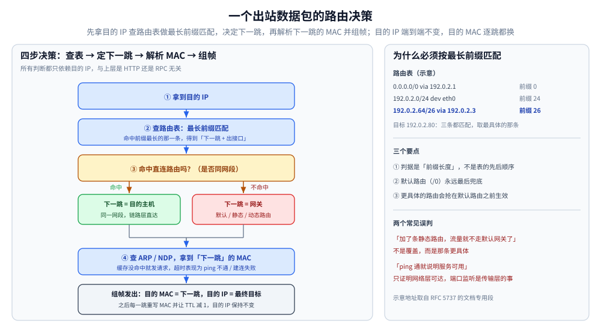
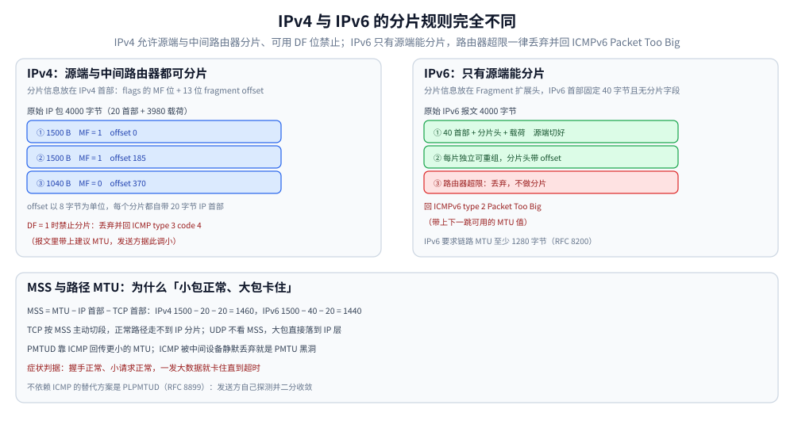

# IP 与路由基础

> 网络层怎么寻址、怎么选下一跳：IP 地址与 CIDR、路由表与最长前缀匹配、ARP/NDP、ICMP、TTL/Hop Limit，以及 MTU 与分片（含排障）。
>
> 内容整理自个人学习笔记；机制口径依据 RFC 791 / RFC 8200 / RFC 1191 / RFC 8201 / RFC 4861，参考标准见文末。
>
> ⭐ **分工**：本篇讲**网络层的机制**——地址怎么分段、同网段怎么判断、包怎么被选到下一跳、地址怎么解析成 MAC、MTU 不够时发生什么。
> 「一个包在本机怎么被逐层造出来」的分层概览见 [网络分层与数据包旅程.md](网络分层与数据包旅程.md)；
> **NAT / conntrack、运营商 AS/BGP、CDN、负载均衡、回程路径**这些端到端链路问题见 [网络通信链路详解.md](网络通信链路详解.md)（本篇不重复）；
> TCP 层的重传与拥塞控制见 [tcp/](tcp/)，UDP 的数据报语义见 [UDP与数据报传输.md](UDP与数据报传输.md)。

---

## 一、IP 层负责什么、不负责什么？

**本节要点**：网络层只做两件事——**给每台主机一个可聚合的地址**、**把包一跳一跳地送过去**。它刻意**不保证**可靠性、顺序与不重复，把这些问题留给了上层。

### 1.1 它提供的服务：无连接、尽力而为

IP 提供的是**无连接、尽力而为**（best-effort）的投递：

| 它做 | 它不做 |
|---|---|
| 全局唯一的寻址（可分层聚合） | ❌ 不保证送达（可能丢） |
| 逐跳转发（按目的地址选下一跳） | ❌ 不保证顺序（可能乱序） |
| 必要时分片与重组（IPv4） | ❌ 不保证不重复（可能重复） |
| 一个 TTL / Hop Limit 存活期机制 | ❌ 没有流控、没有拥塞控制、没有确认 |

⭐ **「尽力而为」不等于「不可靠的传输层」**：可靠性是**上层**的责任——TCP 用序号 + 累计确认 + 重传把它补上；UDP 干脆不补，由应用自己决定要多少。

### 1.2 与上下层的分工

```text
应用层数据
  ↓  TCP 按 MSS 切成段 / UDP 封成数据报
网络层（IP）：加 IP 首部 → 选下一跳 → 交给链路层      ← 本篇范围
  ↓  链路层加 MAC 首部，把帧交给「下一跳」
```

- **它不关心载荷是什么**：IPv4 首部里的「协议号」只告诉接收方交给 TCP(6)、UDP(17) 还是 ICMP(1)，**它自己不解析传输层内容**；
- **它不知道上层有没有收到**：没有任何 ACK 机制，回执靠 ICMP 或上层协议；
- **它的地址是端到端的**：正常转发过程中源/目的 IP 不变（NAT、隧道、LB DNAT 是例外，见 [网络通信链路详解.md](网络通信链路详解.md) 第三节）。

> ⚠️ 一个常见误判：**`ping` 通不等于「服务可用」**。IP 层可达只说明地址能到，端口有没有进程监听是传输层的事（见第七节 `port unreachable`）。

---

## 二、IPv4 地址与 CIDR：怎么判断「在不在同一个网络」？

**本节要点**：IPv4 地址 = **网络前缀 + 主机位**，边界由**前缀长度**（CIDR）决定；判断两台主机是否同网段，就是把地址与前缀掩码做 AND 再比较。

### 2.1 地址的写法与分段

- IPv4 是 **32 位**，写成四段十进制（`192.0.2.10`）；
- 早期按「类」（A/B/C 类）固定前缀长度，**现在一律用 CIDR 表示**：`地址/前缀长度`，如 `192.0.2.0/24`；
- `/24` 表示**前 24 位是网络前缀**，后 8 位是主机位。

| 写法 | 网络地址 | 广播地址 | 可用主机数 | 说明 |
|---|---|---|---|---|
| `192.0.2.0/24` | `192.0.2.0` | `192.0.2.255` | 254 | 主机位 8 位 → 256 个地址，去掉网络地址与广播地址 |
| `192.0.2.0/25` | `192.0.2.0` | `192.0.2.127` | 126 | 掩码 `255.255.255.128` |
| `10.0.0.0/8` | `10.0.0.0` | `10.255.255.255` | 16,777,214 | 私网 A 类段 |
| `192.0.2.16/28` | `192.0.2.16` | `192.0.2.31` | 14 | 前缀不是 8 的倍数时，网络地址要按位对齐 |

> ⚠️ **算例**：`192.0.2.16/28` —— 掩码是 `255.255.255.240`，把 `192.0.2.16` 与掩码 AND 得 `192.0.2.16`（.16 是 16 的整数倍，恰好对齐）；广播地址是 `192.0.2.31`。如果写成 `192.0.2.20/28`，网络地址仍是 `192.0.2.16`，可用范围 `192.0.2.17 ~ .30`——**主机位部分全 0 是全网络地址、全 1 是广播地址，都不能分给主机**。

### 2.2 几类必须认识的地址段

| 段 | 用途 | 典型表现 |
|---|---|---|
| `10.0.0.0/8`、`172.16.0.0/12`、`192.168.0.0/16` | **私有地址**（RFC 1918） | 内网地址，出公网必须 NAT |
| `127.0.0.0/8` | **环回** | `127.0.0.1` 不出网卡 |
| `169.254.0.0/16` | **链路本地**（APIPA） | ⭐ **看到它基本等于「DHCP 没拿到地址」** |
| `192.0.2.0/24`、`198.51.100.0/24`、`203.0.113.0/24` | **文档专用**（RFC 5737） | 只能用于文档与示例，不该出现在真实网络里 |
| `224.0.0.0/4` | **组播** | 路由协议、NDP 用 |
| `0.0.0.0/0` | **默认路由** | 「其余全部」，只出现在路由表里 |
| `255.255.255.255` | **受限广播** | DHCP Discover 的目的地址 |

⭐ **写文档、截图、举例一律用文档专用段**（`192.0.2.x` / `198.51.100.x` / `203.0.113.x`），IPv6 用 `2001:db8::/32`——这样别人一眼就知道是示意值，也不会误连到真实主机。

### 2.3 为什么需要子网与掩码

- **同一个前缀 = 同一个广播域**：同网段内可以直接用链路层送达（ARP/NDP 找 MAC）；跨网段必须交给网关（见第四节）；
- **前缀越长，网络越小**：`/24` 有 254 个可用地址，`/30` 只有 2 个（点对点链路常用）；
- **前缀是「可聚合」的关键**：路由器不需要知道每一台主机，只需要知道「`192.0.2.0/24` 走这个口」。这正是 IP 能扩展到全球的原因，也是 [网络分层与数据包旅程.md](网络分层与数据包旅程.md) 说的「MAC 扁平、IP 可分层」的具体含义。

---

## 三、路由表怎么选下一跳？

**本节要点**：路由表里存的是**前缀 → 下一跳/出接口**的映射；选路规则只有一条主线——**最长前缀匹配**。

### 3.1 路由表的两种条目

| 类型 | 怎么来 | 例子 |
|---|---|---|
| **直连路由** | 接口配了地址与掩码，内核自动生成 | `192.0.2.0/24 dev eth0` |
| **默认路由** | 手工配或由 DHCP / RA 下发 | `default via 192.0.2.1` |
| **静态路由** | 管理员手写 | `198.51.100.0/24 via 192.0.2.2` |
| **动态路由** | 由路由协议（OSPF / IS-IS / BGP）学习 | 运营商与数据中心内部大量使用 |

### 3.2 最长前缀匹配（Longest Prefix Match）

一台主机可能同时匹配多条路由，**选前缀最长（最具体）的那一条**：

```text
目标 IP: 192.0.2.80

候选路由：
  0.0.0.0/0         → 默认网关 192.0.2.1        （前缀长度 0）   ← 也能匹配
  192.0.2.0/24      → 直连，dev eth0            （前缀长度 24）  ← ⭐ 选它
  192.0.2.64/26     → via 192.0.2.3             （前缀长度 26）  ← ⭐ 更具体时选它
```

⭐ **判据是「前缀长度」，不是「顺序」也不是「掩码大小」**：`/26` 比 `/24` 具体，命中就赢。所以同一条路由表里**默认路由永远是最后兜底的**——只在没有任何更具体的前缀匹配时才用它。

> ⚠️ 常见误解：**「路由表是逐行走的，谁先写谁先生效」**。不对，标准行为是按**最长前缀**匹配（同长度时再按度量值/优先级比较，各系统细节不同）。这也解释了为什么「加了一条更具体的静态路由后，流量突然不走默认网关了」——不是覆盖，而是**它更具体**。

### 3.3 下一跳与出接口

一条路由最终要回答两个问题：**交给谁（next hop）**、**从哪个口出去（interface）**。

- 直连路由的「下一跳」就是目标主机自己；
- 其余路由的下一跳是**一个 IP 地址**——但真正发帧时用的是**那个 IP 对应的 MAC**，这就引出第四节与第六节。

---

## 四、一个出站数据包要经过哪几步决策？

**本节要点**：**先拿目的 IP 查路由表 → 决定下一跳 IP → 再解析下一跳的 MAC → 组帧发出**。分清「目的 IP」与「下一跳 MAC」是这一步最容易被绕晕的地方。



这张图的关键是**两个地址走的是两条完全不同的判断链**：左边的蓝色框处理「最终去哪」（目的 IP，端到端不变），中间的黄色判定决定「这一跳交给谁」（直连主机还是网关），最后一步才把「交给谁」翻译成 MAC。右侧面板用一张示意路由表说明为什么**判据是前缀长度而不是表的先后顺序**。

流程只有四步：

1. **查路由表**：用**目的 IP**做最长前缀匹配，得到「下一跳 IP + 出接口」；
2. **判断下一跳类型**：
   - 命中**直连路由** → 下一跳就是目的主机本身（同一网段）；
   - 命中**默认/静态/动态路由** → 下一跳是**网关**（或上一跳路由器）；
3. **解析下一跳的 MAC**：查 ARP/NDP 缓存，没有就发请求（第六节）；
4. **组帧发出**：以太网首部的**目的 MAC 填下一跳的**，IP 首部的**目的 IP 填最终的**。

⭐ 一句话：**IP 决定「最终去哪」，路由表决定「下一跳是谁」，ARP/NDP 把「下一跳是谁」翻译成 MAC。**

> ⚠️ 这就是「接上网关就能访问全网」的全部原理：本机**只负责把帧交给下一跳**，剩下的由网关继续转发。所以同一个包在链路上每一跳的**目的 MAC 都在变**，而**目的 IP 始终不变**（NAT 除外）。

---

## 五、IPv4 与 IPv6 有哪些对应关系？

**本节要点**：IPv6 不是「地址变长了」那么简单——它**改了首部模型、取消了首部校验和与中间路由器分片，并把地址解析换成了 NDP**。

### 5.1 对照表

| 维度 | IPv4 | IPv6 |
|---|---|---|
| 地址长度 | 32 位，点分十进制 | **128 位**，冒号十六进制（`2001:db8::1`，`::` 表示一段连续 0） |
| 首部 | 20 字节（带选项最长 60） | **固定 40 字节**，可选项放进**扩展头** |
| **首部校验和** | 有，**每跳都要重算**（因为 TTL 变） | **没有**（交由上层校验和覆盖；地址也不会被中间设备正常改写） |
| 生存期字段 | **TTL** | **Hop Limit**（语义相同，名字不同） |
| 分片 | 源端与**中间路由器**都可分片（`DF=0` 时） | **只有源端可分片**，路由器只丢包并回 ICMPv6 |
| 地址解析 | **ARP**（广播请求） | **NDP**（走 ICMPv6，用组播） |
| 地址配置 | DHCP / 手工 | **SLAAC**（路由通告自动配）与 DHCPv6 都可能 |
| NAT | 普遍存在 | 设计上不需要（地址足够），但防火墙依旧存在 |

### 5.2 几类 IPv6 地址

| 段 | 用途 |
|---|---|
| `2000::/3` | 全球单播（可路由的公网地址） |
| `fe80::/10` | **链路本地**（每个接口都有，NDP 与路由协议靠它工作） |
| `fc00::/7` | 唯一本地（类似 IPv4 私网） |
| `::1` | 环回 |
| `2001:db8::/32` | **文档专用**（RFC 3849） |
| `ff00::/8` | 组播（旧的广播角色由组播承担） |

### 5.3 双栈与地址选择

双栈主机同时有 A 与 AAAA 记录时，**先按 RFC 6724 的规则给候选地址排序**（优先可达的、避免已废弃地址等），浏览器再用 **Happy Eyeballs** 让两族并行尝试、谁快用谁。

> ⚠️ 于是「IPv6 有问题」的典型表现是**慢一点**而不是**打不开**——因为 v6 试失败后 v4 会补上。排查时用 `ping -6` / `ping -4` 分别确认哪一族通，而不是笼统地说「网络有问题」。抓包侧的实测（IPv6 的 SYN 是 `mss 1440`）见 [抓包实战.md](抓包实战.md) 4.2。

---

## 六、ARP 与 NDP：IP 怎么变成 MAC？

**本节要点**：两者的职责完全相同——**「这个 IP 对应哪个 MAC」**；差别在**广播 vs 组播、RFC 定义的位置、以及有没有内建的安全机制**（都没有）。

### 6.1 ARP 的工作方式（IPv4）

```text
① 查 ARP 缓存没有命中
② 发 ARP 请求：链路层目的 MAC = FF:FF:FF:FF:FF:FF（广播），载荷里写「谁有 192.0.2.1？告诉 192.0.2.10」
③ 目标主机单播回复：「192.0.2.1 的 MAC 是 42:03:…」
④ 双方把结果写进 ARP 缓存（有老化时间，Linux 默认约 30 秒~几分钟，随实现变化）
```

| 要点 | 说明 |
|---|---|
| **作用域只有一条链路** | ARP 请求不会穿过路由器——它就是「同链路内问路」 |
| **请求广播、应答单播** | 只有同广播域的设备会看到请求，但只有匹配的那台会应答 |
| **缓存会老化** | 老化后重新解析；**免费 ARP**（gratuitous ARP）用于宣告自己换了 MAC |
| **无认证** | ⭐ 谁来应答都行 → **ARP 欺骗**可以冒充网关做中间人。防御靠静态绑定、DHCP Snooping、动态 ARP 检测（DAI） |

### 6.2 NDP 的工作方式（IPv6）

NDP 是 ICMPv6 的一组消息，**一对多地替代了 ARP 的职责**：

| 消息 | 作用 | 相当于 IPv4 的 |
|---|---|---|
| **NS**（Neighbor Solicitation） | 「这个地址的 MAC 是谁？」发往**请求节点组播**（`ff02::1:ff00:0/104`）而非广播 | ARP 请求 |
| **NA**（Neighbor Advertisement） | 「是我，我的 MAC 是…」单播回复 | ARP 应答 |
| **RS / RA**（Router Solicitation / Advertisement） | 主机问路、路由器周期性通告前缀与默认路由 | 无直接对应（RA 还承担了 SLAAC） |

⭐ 两个 IPv6 特有的点：① **没有广播，改用组播**（更省电、更少打扰）；② **RA 可以同时告诉主机「用哪个前缀」和「用哪个默认网关」**，所以 IPv6 主机的地址与网关是**一起**拿到的。

### 6.3 常见故障表现

| 现象 | 常见原因 |
|---|---|
| 同网段 ping 不通、跨网段正常 | 掩码配错（本机以为是跨网段，实际同网段）或 ARP 被拦截 |
| **`169.254.x.x`** | DHCP 没拿到地址，回落到链路本地自动配置 |
| 网关 MAC 突然变了一个陌生的 | ⚠️ 可能是 ARP 欺骗，也可能是设备换了/主备切换 |
| IPv6 能解析地址但连不上 | 通常是地址配置或路由通告（RA）的问题，而不是 DNS |

---

## 七、ICMP 与 ICMPv6：ping / traceroute 能证明什么、不能证明什么？

**本节要点**：ICMP 是**网络层的错误与控制消息**；`ping` 与 `traceroute` 都建立在它之上——所以**它被拦，工具就失灵，但网络可能完全正常**。

### 7.1 常用类型对照

| IPv4 类型 | IPv6 类型 | 含义 |
|---|---|---|
| 0 / 8 | 129 / 128 | Echo Reply / Echo Request（`ping` 用的就是这一对） |
| **3（Destination Unreachable）** | 1 | 目的不可达。code 0 网络不可达、1 主机不可达、**3 端口不可达**、**4 需要分片但 DF=1** |
| **11（Time Exceeded）** | 3 | TTL / Hop Limit 耗尽（`traceroute` 靠它画路径） |
| 5（Redirect） | 137 | 告诉主机「下次直接找那个网关」 |
| — | **2（Packet Too Big）** | ⭐ **IPv6 专用**：包超过路径 MTU，报文里带上可用的 MTU 值 |

⭐ **第 3 类 code 3（port unreachable）特别有用**：它是「IP 通了、但那个端口没有进程监听」的证据——`ping` 通而 `nc -z` 不通时，看到它就能断定问题在传输层以上，而不是网络层。

### 7.2 ping / traceroute 能证明与不能证明的

| 它能证明 | 它不能证明 |
|---|---|
| 目的地址**在网络层可达**、往返 RTT 大致多少 | 应用端口有监听（要 `port unreachable` 或真正发请求才知道） |
| 路径上**前 N 跳**的大致拓扑（`traceroute`） | **回程**路径（去回程常常不对称） |
| 链路是否有**明显**丢包与抖动 | 具体哪个中间设备在丢包（中间设备可能不回 ICMP） |

> ⚠️ **`traceroute` 里出现 `*` 不代表丢包**：很多骨干设备被配置为不回或限速回 ICMP。同理 **`ping` 不通也不能立刻判定网络故障**——ICMP 可能被策略丢弃，而 TCP 443 完全正常。

---

## 八、MTU、MSS、分片与 PMTUD：为什么「小包正常、大包卡住」？

**本节要点**：**MTU 是路径上最小的那段**，包超了要么分片、要么被丢回来；而**丢了回来还看不到，就是 PMTU 黑洞**。

### 8.1 三个概念先分清

| 概念 | 属于哪一层 | 含义 |
|---|---|---|
| **MTU** | 链路层 | 一个帧能承载的**载荷上限**（以太网 1500） |
| **MSS** | 传输层（TCP 选项） | 一个 TCP 段能携带的**数据上限**：IPv4 `MTU − 20 − 20 = 1460`；IPv6 `MTU − 40 − 20 = 1440` |
| **IP 分片** | 网络层 | 一个 IP 包被切成多个包，各自带 IP 首部与分片偏移 |

⭐ **TCP 分段 ≠ IP 分片**：TCP 按 MSS 主动切，**正常路径上根本不会走到 IP 分片**；IP 分片只在「应用直接发 UDP 大包」或「发送 `DF=0` 的 IP 报文」时才出现。

### 8.2 分片：IPv4 与 IPv6 的规则完全不同



左、右两个面板的差别就是「**谁有资格分片**」：IPv4 允许中间路由器代劳，代价是要给路由器留状态、也留下了分片重叠攻击面；IPv6 把它收回到源端，路由器只回报一个 `Packet Too Big` 让源端自己切。底部面板把 `MSS = MTU − 40` 的换算与 PMTU 黑洞的症状判据放在一起，方便对照排查。

具体规则对照如下：

| | IPv4 | IPv6 |
|---|---|---|
| 谁能分片 | **源端与中间路由器**（`DF=0` 时） | ⭐ **只有源端** |
| 禁止分片 | `DF=1`，路由器丢弃并回 **ICMP type 3 code 4**（带上建议 MTU） | 不存在 DF 位；路由器**一律**丢弃并回 **ICMPv6 type 2 Packet Too Big**（带上 MTU） |
| 最小 MTU 要求 | 各链路至少 68 字节 | **1280 字节**（RFC 8200），低于此必须做分片与重组 |
| 分片信息位置 | IPv4 首部的 flags + fragment offset | **分片扩展头**（Fragment Header） |

### 8.3 PMTUD 与 PMTU 黑洞

**PMTUD**（Path MTU Discovery）的思路是：发送方**先把 `DF=1` 打开**，撞上小 MTU 的链路时靠 ICMP 得知更小的 MTU，然后调小 MSS / 包长。

```text
发送方（MTU 1500，DF=1）→ 某段链路 MTU 1400 → 路由器丢弃并回 ICMP Fragmentation Needed (MTU=1400)
                                                              ↓
                                        发送方调小 MSS 并设置该路径的 PMTU 缓存
```

⚠️ **前提是 ICMP 能回来**。一旦中间设备（防火墙、安全组、某些云网关）**把类型 3 或 ICMPv6 类型 2 静默丢弃**，就形成 **PMTU 黑洞**：

| 症状 | 说明 |
|---|---|
| 三次握手正常、小请求正常 | 小包没超 MTU |
| **一发大数据就卡住**（直到超时） | 大包被丢、发送方永远收不到「要调小」的通知，一直重试 |
| TLS 握手偶发挂起 | 证书链较大、正好越过 MTU 边界 |

**不依赖 ICMP 的替代方案是 PLPMTUD**（RFC 8899）：发送方自己探测并二分收敛，代价是探测期间的少量丢包。此外还有一条工程手段：**在网关/入口做 MSS clamping**，把协商出去的 MSS 钳到保守值。

> 排查口径：**「小包正常、大包卡住」优先看 MTU**；两端同时抓包，看有没有发出/收到 `ICMP Fragmentation Needed` 或 `ICMPv6 Packet Too Big`。抓包侧的对应线索见 [抓包实战.md](抓包实战.md) 的「三条最常用的抓包套路」。隧道场景（VXLAN / WireGuard）会让可用 MTU 变小，开销表见 [网络通信链路详解.md](网络通信链路详解.md) 4.1。

---

## 使用：网络层排查的固定套路

### 1. 先看本机地址、路由与邻居表

```bash
# ① 地址与掩码：确认「我在哪个网段」
ip -4 addr show
ip -6 addr show

# ② 路由表：确认「默认网关是谁、有没有更具体的路由抢在前面」
ip route show
ip -6 route show

# ③ 邻居表（ARP / NDP）：确认「下一跳的 MAC 解析出来了吗」
ip neigh show                 # IPv4 + IPv6 邻居都在这里
ip -6 neigh show              # 只看 IPv6

# ④ Windows 对应命令（本机实测用的就是这几条）
route print -4
arp -a
netsh interface ipv6 show neighbors
```

⭐ **三张表要连起来读**：先看地址判断同网段/跨网段 → 再看路由表确认下一跳 → 最后看邻居表确认 MAC 有没有解析出来。**邻居表里那条是 `INCOMPLETE`/`FAILED`，就卡在第六节说的地址解析上。**

### 2. 再验证连通性与路径

```bash
# 分层确认：哪一族通
ping -4 -c 3 192.0.2.80
ping -6 -c 3 2001:db8::80

# 路径与在哪一跳开始变慢（连续跑看抖动）
mtr -rwzc 20 --tcp --port 443 192.0.2.80
traceroute -n 192.0.2.80

# 单独验证「是不是 MTU 问题」：逐步增大且不允许分片
ping -M do -s 1472 192.0.2.80     # IPv4：1472 + 20 + 8 = 1500
ping -M do -s 1452 2001:db8::80   # IPv6：1452 + 40 + 8 = 1500

# Windows 侧等价物：-f 置 DF 位，-l 指定载荷长度
ping -f -l 1472 192.0.2.80
```

### 3. 抓包看 ICMP（先定位再抓包）

```bash
# 只看 ICMP / ICMPv6：确认「有没有人告诉我包太大了」
tcpdump -ni any icmp
tcpdump -ni any icmp6

# 只看 IPv4 的分片（MF 标志位置位）
tcpdump -ni any 'ip[6] & 0x20 != 0'
```

### 4. 三条常见故障的判据

| 症状 | 第一步查什么 | 结论 |
|---|---|---|
| **同网段能通、外网不通** | `ip route` 有没有默认路由；`ip neigh` 网关那一条是否 REACHABLE | 缺默认路由 / 网关 MAC 没解析出来 |
| **小请求正常、大响应卡住** | 两端抓 `icmp` / `icmp6`；用 `ping -M do` 二分 MTU | PMTU 黑洞（ICMP 被拦）或路径 MTU 没同步 |
| **IPv6 能解析但连不上** | `ip -6 addr`（有没有拿到全局地址）、`ip -6 route`（有没有默认路由）、`ip -6 neigh` | 地址配置或 RA 问题，通常与 DNS 无关 |

---

## 延伸追问

- **为什么 IP 既有地址又有 MAC，不能只留一个？** → 两者作用域不同：**IP 可分层聚合**，路由器只需记住前缀就能转发到全球；**MAC 扁平不可路由**，只能在一条链路内定位下一跳。丢掉 IP 就得靠广播找遍全球，丢掉 MAC 链路层就无法封装帧。
- **最长前缀匹配为什么这样设计？** → 为了让**路由表可以很小**：默认路由兜底 + 少量具体前缀覆盖例外，路由器不必知道每台主机。`/0` 永远是最不具体的那个，只在没有更具体前缀命中时才用。
- **`169.254.x.x` 说明什么？** → DHCP 没拿到地址，主机回落到链路本地自动配置（APIPA）。同网段内的几台这样的机器可能互通，但**基本没有默认路由，出不了网**。
- **ARP 请求经过路由器吗？** → 不经过。ARP 的作用域只有一条链路，所以跨网段时解析的是**网关**的 MAC，而不是最终主机的——这也是「一个包每一跳 MAC 都变、IP 不变」的原因。
- **为什么 IPv6 取消了首部校验和？** → 一是**链路层与传输层已有校验**（以太网有 FCS、TCP/UDP 校验和覆盖伪首部），二是 IPv6 允许中间设备改写 Hop Limit 却**不重算校验和**（取消它就避免了每跳重算的开销）。
- **IPv6 的路由器为什么不分片？** → 分片交给中间设备会放大开销、且分片本身是攻击面（分片重叠攻击）。改为**源端分片 + ICMPv6 Packet Too Big 回传 MTU**，让发送方自己按路径 MTU 切好再发。
- **MTU 设小了会怎样、设大了会怎样？** → 设小（如隧道场景 1450）会牺牲一点效率但安全；**设大而路径实际更小**则会导致大包被丢或分片，表现为「小包正常、大包卡住」或吞吐骤降。K8s 里常见 1450、WireGuard 常见 1420，都是 `1500 − 封装开销` 算出来的。
- **`ping` 不通但服务正常，怎么解释？** → ICMP 常被安全策略丢弃，或者目标主机禁 ping。判据是**用真正的业务协议验证**（`curl -v` / `nc -z --tcp`），而不是把 `ping` 当唯一标准。
- **NAT 算不算网络层的功能？** → 它工作在网络层（改 IP）也常涉及传输层（改端口），但**不是 IP 规范的一部分**，是中间设备的附加功能。原理与逐跳改写见 [网络通信链路详解.md](网络通信链路详解.md) 第三节。

---

## 关联

- [网络分层与数据包旅程.md](网络分层与数据包旅程.md) — **上游**：分层模型与一次封装的完整示意（本篇负责它收窄掉的网络层细节）
- [UDP与数据报传输.md](UDP与数据报传输.md) — **下游**：UDP 大包与 IP 分片的实际关系
- [网络通信链路详解.md](网络通信链路详解.md) — NAT / conntrack、AS/BGP、CDN / LB 与端到端排查（本篇不重复）
- [tcp/TCP报文结构.md](tcp/TCP报文结构.md) — MSS 是 TCP 选项，与本文的 MTU 直接相关
- [tcp/TCP三次握手.md](tcp/TCP三次握手.md) — 握手建立在对端地址可达的前提上
- [DHCP.md](DHCP.md) — 四个网络参数（IP / 掩码 / 网关 / DNS）从哪来
- [抓包实战.md](抓包实战.md) — ICMP 与分片在抓包里长什么样
- [Docker网络与镜像源.md](../../06-工程实践/部署/docker/Docker网络与镜像源.md) — 容器网络里的 veth / bridge / DNAT 是同一套机制
- [K8s部署流程.md](../../06-工程实践/部署/k8s/K8s部署流程.md) — Service / CNI 与 Pod MTU 的由来

> 参考标准与官方文档：
>
> - IPv4：[RFC 791](https://www.rfc-editor.org/rfc/rfc791.html)；IPv4 分片与 PMTUD：[RFC 1191](https://www.rfc-editor.org/rfc/rfc1191.html)
> - IPv6：[RFC 8200](https://www.rfc-editor.org/rfc/rfc8200.html)；IPv6 PMTUD：[RFC 8201](https://www.rfc-editor.org/rfc/rfc8201.html)；PLPMTUD：[RFC 8899](https://www.rfc-editor.org/rfc/rfc8899.html)
> - NDP / SLAAC：[RFC 4861](https://www.rfc-editor.org/rfc/rfc4861.html)、[RFC 4862](https://www.rfc-editor.org/rfc/rfc4862.html)
> - 文档专用地址：[RFC 5737](https://www.rfc-editor.org/rfc/rfc5737.html)（IPv4）、[RFC 3849](https://www.rfc-editor.org/rfc/rfc3849.html)（IPv6）
> - 地址选择：[RFC 6724](https://www.rfc-editor.org/rfc/rfc6724.html)；Happy Eyeballs：[RFC 8305](https://www.rfc-editor.org/rfc/rfc8305.html)
> 反向引用（本篇被下列文档引到）：[DNS解析.md](DNS解析.md)、[QUIC与HTTP3.md](QUIC与HTTP3.md)、[TCP滑动窗口.md](tcp/TCP滑动窗口.md)
