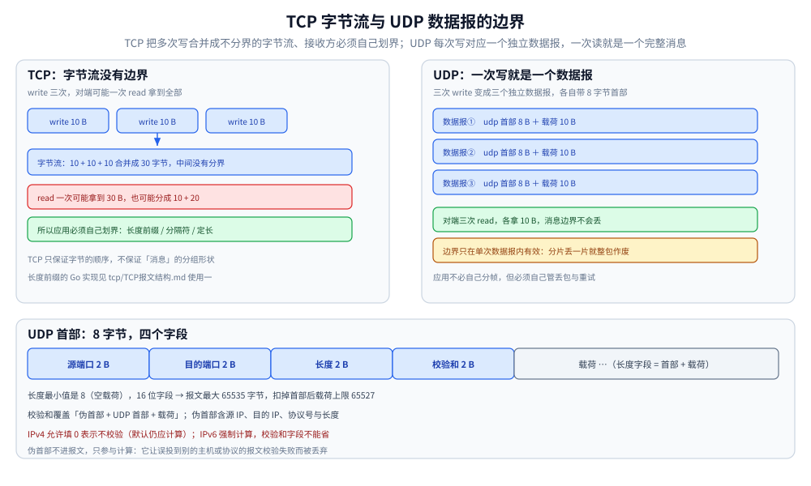

# UDP 与数据报传输

> UDP 的数据报语义、8 字节首部与校验和规则、它**明确不提供**哪些保证、应用层该补什么、MTU 与分片的代价，以及 Go / Java 的最小收发写法与抓包诊断。
>
> 内容整理自个人学习笔记；UDP 基本规范依据 [RFC 768](https://www.rfc-editor.org/rfc/rfc768.html)，校验和与 IPv6 规则另见 [RFC 8200](https://www.rfc-editor.org/rfc/rfc8200.html)。
>
> ⭐ **分工**：本篇专讲 **UDP 这一层**。QUIC 在上层重建的可靠传输与拥塞控制见 [QUIC与HTTP3.md](QUIC与HTTP3.md)；
> DNS 为什么用 UDP、什么时候回落 TCP / DoQ 见 [DNS解析.md](DNS解析.md)；
> UDP 与 TCP、消息队列的横向选型见 [通信选型.md](通信选型.md)；
> IP 分片与 MTU 的机制细节见 [IP与路由基础.md](IP与路由基础.md)。

---

## 一、UDP 是什么？和 TCP 的本质差别在哪？

**本节要点**：一句话——**UDP 保留「消息边界」，TCP 只给你一条字节流**。这一条差别推导出了后面几乎所有不同。

### 1.1 两种交付模型



左侧演示的是 TCP 最容易被忽略的一点：**三次 `write` 在链路上被合并成一条 30 字节的字节流，中间没有任何标记**，所以「一次 `read` 读到多少」完全不确定——这正是应用层必须自己写分帧代码的原因。右侧的 UDP 把每次写的边界都保留下来，但注意黄色那段：**边界只在单次数据报内成立**，一旦超过 MTU 被 IP 分片，整体照样可能全丢。

| | **TCP** | **UDP** |
|---|---|---|
| 交付单位 | **字节流**（无边界） | **数据报**（一次发送 = 一个消息） |
| 三次 `write(10 字节)` | 对端可能一次 `read` 拿到 30 字节，也可能分成三次 | 对端**必须**分三次 `read`，每次恰好 10 字节 |
| 应用要不要自己划界 | ⭐ **要**（长度前缀 / 分隔符 / 定长） | ⭐ **不用**，一次读就是一个完整消息 |
| 收发配对 | 多对多（不保证对应） | **一对一**（一次读对应一次写） |

⭐ 「保留边界」是 UDP 唯一真正的结构性优势：**它让应用少写一层分帧代码**。代价是这条边界**只在单次数据报内有效**——超过 MTU 被 IP 分片后，整体依然可能丢掉。

### 1.2 三句话定位

- **UDP = IP 之上只加了一层「端口」**：它把网络层的「主机到主机」细化成「进程到进程」，此外几乎什么都不做；
- **它是无连接的**：不握手、不协商、不维护连接状态（内核里没有 TCB），所以**也没有「关闭」这一说**；
- **它把选择权交给应用**：延迟与可靠性怎么权衡，由应用自己决定。

---

## 二、UDP 首部只有 8 字节，里面有什么？

**本节要点**：四个字段，每个 2 字节——**源端口、目的端口、长度、校验和**。字段少到没有余量，所以任何「可靠性」都必须由上层自己造。

| 字段 | 长度 | 含义 |
|---|---|---|
| **源端口** | 2 字节 | 发送方端口；**可以为 0**（表示不需要对方回复，如部分单向日志上报） |
| **目的端口** | 2 字节 | 接收方端口 |
| **长度** | 2 字节 | **首部 + 载荷**的总长度，最小值是 8（空载荷） |
| **校验和** | 2 字节 | 覆盖伪首部 + UDP 首部 + 载荷；**IPv4 下可为 0 表示「不校验」，IPv6 下必填** |

### 2.1 伪首部：校验和为什么能发现「送错进程」

校验和计算时要临时拼一个**伪首部**（Pseudo-Header），它**不在报文里传输**，只参与计算：

```text
IPv4 伪首部：源 IP(4) + 目的 IP(4) + 全 0(1) + 协议号=17(1) + UDP 长度(2)
IPv6 伪首部：源 IP(16) + 目的 IP(16) + 上层包长度(4) + 全 0(3) + 下一首部=17(1)
```

⭐ **伪首部的作用**：把「源/目的 IP」纳入校验范围，于是**即使报文被误投到另一台主机或另一个协议，接收方也会校验失败并丢弃**。这是「端到端校验」的典型做法，TCP 也用同一套。

> ⚠️ **IPv4 与 IPv6 的差异要记清**：IPv4 允许发送方把校验和填 0（等于放弃校验，历史上为省 CPU），**IPv6 强制计算**（因为 IPv6 首部没有自己的校验和，传输层必须补上）；IPv6 上唯一允许跳过的例外是隧道封装场景，且需显式约定。另外**校验和是「可选的完整性问题」，不是「可靠性机制」**：它只能发现错误，不能恢复，也完全不解决丢包。

### 2.2 长度的上限

- `长度` 字段是 16 位 → UDP 报文最大 **65535 字节**；
- 扣掉 8 字节首部，载荷上限 **65527**；再扣 IP 首部（IPv4 20 / IPv6 40），**实际能装进一个 IP 包的载荷是 65507 / 65487 字节**；
- ⚠️ 但这个上限**只在理论上有意义**——真实链路上超过路径 MTU 就会被分片，见第五节。

---

## 三、UDP 明确不保证什么？

**本节要点**：把「不提供什么」列全，比记「提供什么」有用得多。⚠️ 但**「没有保证」不等于「必然丢包」**——本机回环与低负载内网通常一个都不丢。

| 它不保证 | 后果 | 谁可能受影响 |
|---|---|---|
| **送达**（不重传、不确认） | 丢包后应用永远不知道 | 所有应用 |
| **顺序** | 后发的数据报可能先到 | 分片传输、多路径 |
| **去重** | 网络或中间设备可能复制报文 | 转发、组播、隧道 |
| **流量控制** | 发得比对方读得快 → **对方 socket 缓冲区溢出丢包** | 接收方处理慢 |
| **拥塞控制** | 应用不限速就可能把链路打满、挤掉别人的流量 | ⭐ 共享链路、公网 |
| **消息完整性** | 校验和只能查错，冲突概率不为 0 | 极低概率 |

⭐ **「不保证送达」的准确含义**：UDP 交付的是「尽力而为的一次尝试」。**它不会因为丢包而报错**（对端没收到，发送方毫无感知），也不会重传。这与「UDP 一定会丢包」是两回事——**要不要补可靠性，是应用的设计选择**。

> 📎 一句话对照：TCP 用序号 + 累计确认 + 超时重传 + 滑动窗口 + 拥塞控制解决了上面 5 条；这些机制见 [tcp/](tcp/) 五篇。UDP 把它们**全部交还给应用**。

---

## 四、应用层要怎么补上这些保证？

**本节要点**：不是每个应用都需要补全 —— 先判断「这个场景到底怕不怕丢」，再决定补什么。补得越多，就越接近「在 UDP 上重造一遍 TCP」。

### 4.1 常见补法清单

| 缺什么 | 应用层补法 | 典型例子 |
|---|---|---|
| 送达 | **超时 + 重试**（必须配上限）；或干脆容忍丢失 | DNS 查询重试、RPC over UDP |
| 请求与响应配对 | 请求 ID（事务 ID） | DNS 的 transaction ID、自研协议的 seq |
| 去重 | 请求 ID 缓存 + 时间窗，缓存期内重复的请求只处理一次 | 幂等的查询类接口 |
| 顺序 | 序号 + 接收侧重排序缓冲 | 自研可靠 UDP（如 KCP） |
| 全量可靠 + 有序 | 完整重造：ACK、重传、窗口、拥塞控制 | **QUIC**（见 [QUIC与HTTP3.md](QUIC与HTTP3.md)） |
| 丢包容忍下的流畅度 | 前向纠错（FEC）、抖动缓冲、隐藏而非重传 | WebRTC / RTP 音视频 |
| 不把链路打满 | 应用层限速 / 自适应码率 | 音视频、游戏状态同步 |

### 4.2 两条最容易忽略的纪律

1. ⚠️ **重试必须幂等**：UDP 的重试是「用户态自己做的重试」，网络里可能同时存在两份请求。**非幂等操作（扣款、下单）用「超时重试」去做，会直接导致重复执行**——要么改成幂等（带幂等键），要么别用 UDP。
2. ⚠️ **重试会放大流量**：下游已经过载时，所有客户端的重试叠加会雪崩。所以重试必须配**指数退避 + 抖动 + 上限**，以及服务端的限流兜底。

> ⭐ 一条判据：**如果这个场景「丢一点没关系、但慢一点很难受」，就适合 UDP + 少量补强；如果「一条都不能丢」，就别在 UDP 上重造 TCP，直接用 TCP 或 QUIC。**

---

## 五、UDP 与 MTU：为什么大包特别危险？

**本节要点**：**UDP 不像 TCP 会自动按 MSS 切段**，一个数据报多大就发多大。超过路径 MTU 就进 IP 分片，而**分片里丢任何一片，整个数据报都作废**。

### 5.1 三种结果

| UDP 载荷大小 | 发生什么 | 风险 |
|---|---|---|
| ≤ MTU − IP 首部（IPv4 1472 / IPv6 1440） | 一个 IP 包装下，不分片 | ⭐ 推荐的工作区间 |
| 大于它、`DF=0` | **IP 分片**（IPv4）；IPv6 只有源端可分片 | ⚠️ 丢片即整包丢弃，重传代价被放大 N 倍 |
| 大于它、`DF=1` | IPv4 丢弃 + `ICMP Fragmentation Needed`；IPv6 丢弃 + `ICMPv6 Packet Too Big` | ⚠️ ICMP 被拦就是 PMTU 黑洞 |

### 5.2 为什么不能依赖分片

```text
一个 4000 字节的 UDP 数据报 → 被切成 3 个 IP 分片
  任一被丢（丢包率 1% 时，整包成功送达率 ≈ 0.99³ ≈ 97%，且随分片数下降更快）
→ 接收方无法重组 → 整个数据报被丢弃 → 应用只能整体重传
```

⭐ **工程口径**：**主动把 UDP 载荷控制在路径 MTU 之内**，不要在协议设计里依赖 IP 分片。选载荷上限时可以按最保守的 **IPv6 最小 MTU 1280** 反推（1280 − 40 − 8 = **1232 字节**），这就是 QUIC 把初始数据报限制在 1200 字节附近的原因；也可以按实际路径探测（DPLPMTUD，见 [IP与路由基础.md](IP与路由基础.md) 第八节）。

> ⚠️ **别混淆两件事**：**「UDP 不保证送达」**是传输层的语义；**「分片后丢片导致整包丢弃」**是 IP 层分片的代价。前者是设计选择，后者是工程上完全可以避免的浪费。

---

## 六、socket 接收队列与丢包：为什么「内核收到了」应用还是没拿到？

**本节要点**：UDP 的接收路径上**有一个队列**，队列满了就直接丢——丢包现场往往在**接收方应用读得太慢**，而不是网络。

### 6.1 队列模型

```text
网卡 → 内核协议栈校验 → 找到绑定该端口的 socket → 放进该 socket 的接收队列 → 应用 recvfrom 取走
                                                     ↑
                                        队列长度受 SO_RCVBUF 限制；满了：直接丢弃，且不通知发送方
```

| 现象 | 原因 | 观测 |
|---|---|---|
| 抓包能看到收到，应用却没读到 | socket 接收队列溢出（应用读得慢） | `netstat -su` 的 `receive buffer errors`；`nstat -az \| grep -i Udp` 的 `UdpRcvbufErrors` |
| 只有高并发时丢 | 单一 socket 的队列被打满 | `ss -u -a` 看 `Recv-Q` 是否贴顶 |
| 发送到没人监听的端口 | 收 ICMP port unreachable | Linux `UdpNoPorts` 计数；**connected socket** 会直接返回 `ECONNREFUSED` |

⚠️ **调大 `SO_RCVBUF` 不是万能药**：在 Linux 上显式 `setsockopt(SO_RCVBUF)` 会**关掉该 socket 的接收缓冲自动调优**，需要自己承担「设多大才合适」的判断。更根本的解法是**提高应用读取速度**（多线程收 + 队列解耦 + 批量读），或者用 **`SO_REUSEPORT`** 让多个进程各持一个 socket 分担内核分流。

> ⚠️ 另一个易踩的坑：**读缓冲太小会把数据报截断**。Go 的 `ReadFromUDP` 在缓冲区不足时会**静默截断**（返回 `n = len(buf)` 而丢掉剩余部分）；Java 的 `DatagramPacket` 也是同样的行为，需要你自己比较 `getLength()` 与缓冲区大小。**协议设计时给最大包长留出明确上界，接收端按上界分配缓冲**。

---

## 七、哪些场景该用 UDP？

**本节要点**：选 UDP 的理由只有两种——**要消息边界**，或者**要绕开 TCP 的机制**（握手开销 / 队头阻塞 / 拥塞控制的保守性）。

| 场景 | 为什么选 UDP | 上层补了什么 |
|---|---|---|
| **DNS** | 单次查询一问一答，省掉握手；查询短小 | 重试、事务 ID、截断后回落 TCP（见 [DNS解析.md](DNS解析.md)） |
| **DHCP** | 客户端此时**还没有 IP**，只能靠广播，无法建 TCP 连接 | 广播 + 超时重试 + 事务 ID |
| **SNMP / syslog / 指标上报** | 单向、量小、丢一条可接受 | 基本不补；靠采样与聚合兜底 |
| **实时音视频（RTP / WebRTC）** | 过期数据没价值，重传比丢包更糟 | 序号 + 抖动缓冲 + FEC + 自适应码率 |
| **游戏 / 遥测状态同步** | 只关心最新状态，旧状态直接丢 | 序号（只取最新）+ 增量同步 |
| **组播 / 服务发现（mDNS）** | 需要一发多收 | 缓存 + 周期重发 |
| **隧道封装（VXLAN / Geneve）** | 只是把二层帧装进 UDP 传输 | 上层的可靠由原始协议负责 |
| **QUIC / HTTP/3** | 用 UDP 穿中间设备，在其上**自己实现**可靠传输 | 完整重造：包号、ACK、重传、流控、拥塞控制 |

⭐ **反过来说**：如果场景是「必须一条不丢、且不想自己实现重传」，那就**别选 UDP**——选 TCP 或 QUIC。把 UDP 当「更快的 TCP」是最常见的误用。

---

## 使用一：Go（最小收发：边界、超时与队列观测）

> ⚠️ 本节代码只用标准库；**未在本机做运行时验证**（Windows 侧可编译，`go vet` / `gofmt` 通过），行为描述以 `net` 包文档为准。

### 1. 服务端：一次读一个数据报

```go
package udpdemo

import (
	"errors"
	"log"
	"net"
	"time"
)

// MaxDatagram 是协议允许的最大载荷：**接收端必须按上界分配缓冲**，
// 否则 ReadFromUDP 会静默截断（返回 n == len(buf)，剩余部分直接丢掉）。
const MaxDatagram = 1232 // IPv6 最小 MTU 1280 − 40(IP) − 8(UDP)

func ServeUDP(addr string) error {
	pc, err := net.ListenUDP("udp", mustResolve(addr))
	if err != nil {
		return err
	}
	defer pc.Close()

	// ⚠️ 显式设置会关掉 Linux 的接收缓冲自动调优，所以生产上要结合实测再定值；
	//    这里给一个保守值，说明「这个旋钮存在且需要被有意识地调」。
	_ = pc.SetReadBuffer(1 << 20)
	_ = pc.SetWriteBuffer(1 << 20)

	buf := make([]byte, MaxDatagram+1) // +1 是为了发现「有没有被截断」
	for {
		// UDP 也要设 deadline：否则一个永不退出且无流量的 goroutine 会一直挂着
		if err := pc.SetReadDeadline(time.Now().Add(30 * time.Second)); err != nil {
			return err
		}
		n, peer, err := pc.ReadFromUDP(buf)
		if err != nil {
			var ne net.Error
			if errors.As(err, &ne) && ne.Timeout() {
				continue // 空闲超时：UDP 服务端正常现象，不是错误
			}
			return err
		}
		if n > MaxDatagram {
			log.Printf("udpdemo: oversize datagram from %s (%d bytes), dropped", peer, n)
			continue
		}
		// ⭐ 一次 ReadFromUDP 就是一个完整数据报 —— 这是 UDP 相对 TCP 唯一的结构性便利
		handleDatagram(pc, peer, buf[:n])
	}
}

// handleDatagram 演示回包：UDP 没有连接，所以必须用 WriteToUDP 明确指定对端。
func handleDatagram(pc *net.UDPConn, peer *net.UDPAddr, req []byte) {
	resp := append([]byte("echo:"), req...)
	if _, err := pc.WriteToUDP(resp, peer); err != nil {
		log.Printf("udpdemo: write to %s: %v", peer, err)
	}
}

func mustResolve(addr string) *net.UDPAddr {
	a, err := net.ResolveUDPAddr("udp", addr)
	if err != nil {
		panic(err)
	}
	return a
}
```

### 2. 客户端：超时重试与幂等键

```go
package udpdemo

import (
	"context"
	"errors"
	"fmt"
	"net"
	"time"
)

// QueryOnce 是「无连接式」调用：一次请求 + 一次等待，超时就交给上层决定重不重试。
// ⚠️ 重试必须幂等：网络里可能同时存在两份请求，服务端要按请求 ID 去重。
func QueryOnce(ctx context.Context, addr string, reqID uint32, payload []byte) ([]byte, error) {
	raddr, err := net.ResolveUDPAddr("udp", addr)
	if err != nil {
		return nil, err
	}
	// DialUDP 只是把对端固定下来（connected socket）：
	// 好处是能收到 ICMP port unreachable 并返回 ECONNREFUSED，坏处是只能收这一个对端。
	conn, err := net.DialUDP("udp", nil, raddr)
	if err != nil {
		return nil, err
	}
	defer conn.Close()

	if _, err := conn.Write(append(payload, byte(reqID))); err != nil {
		return nil, err
	}

	deadline := time.Now().Add(2 * time.Second)
	if d, ok := ctx.Deadline(); ok && d.Before(deadline) {
		deadline = d
	}
	if err := conn.SetReadDeadline(deadline); err != nil {
		return nil, err
	}

	buf := make([]byte, MaxDatagram+1)
	n, err := conn.Read(buf)
	if err != nil {
		return nil, fmt.Errorf("udpdemo: read reply for req %d: %w", reqID, err)
	}
	if n > MaxDatagram {
		return nil, errors.New("udpdemo: reply exceeds MaxDatagram, buffer too small")
	}
	return buf[:n], nil
}

// QueryRetry 演示「指数退避 + 抖动 + 上限」——这是 UDP 侧补齐可靠性的最小形态。
// ⚠️ 只有在**幂等**语义下才能这样重试；扣款 / 下单这类接口必须带幂等键或直接不重试。
func QueryRetry(ctx context.Context, addr string, reqID uint32, payload []byte) ([]byte, error) {
	backoff := 200 * time.Millisecond
	for attempt := 1; attempt <= 3; attempt++ {
		reply, err := QueryOnce(ctx, addr, reqID, payload)
		if err == nil {
			return reply, nil
		}
		select {
		case <-ctx.Done():
			return nil, ctx.Err()
		case <-time.After(backoff):
		}
		backoff *= 2
	}
	return nil, errors.New("udpdemo: giving up after 3 attempts")
}
```

### 3. 观测丢包：先看内核计数，再谈重试

```bash
# ① 本机 UDP 的收包/错误总览（Linux）
netstat -su | grep -i udp
nstat -az | grep -iE 'UdpInDatagrams|UdpInErrors|UdpRcvbufErrors|UdpNoPorts|UdpSndbufErrors'
#   UdpInErrors / UdpRcvbufErrors 增长 → 接收方队列溢出（应用读得慢，不是网络丢）
#   UdpSndbufErrors 增长            → 发送方缓冲溢出（发得比网卡快）
#   UdpNoPorts 增长                 → 有流量打到没人监听的端口（会回 ICMP port unreachable）

# ② 看单个 socket 的排队情况
ss -u -a -n -p | head            # Recv-Q 贴顶 = 该 socket 的接收队列满了

# ③ 抓包核对「到底有没有到本机」
sudo tcpdump -ni any 'udp port <端口>' -c 20
```

⭐ 判据顺序：**抓包证明包到了本机 → 内核计数证明队列溢出 → 才轮到怀疑应用读取速度**。反过来先怀疑网络丢包，通常会白忙一场。

---

## 使用二：Java（DatagramSocket / DatagramChannel）

> ⚠️ 本节 Java 代码按 JDK 17 书写，**未编译校验**；三条结论与 Go 侧一致。

### 1. 阻塞式 `DatagramSocket`

```java
package notes.net;

import java.net.DatagramPacket;
import java.net.DatagramSocket;
import java.net.InetAddress;
import java.nio.charset.StandardCharsets;

public class UdpEchoServer {

    private static final int MAX_DATAGRAM = 1232; // 与 Go 侧同一个上界

    public static void main(String[] args) throws Exception {
        try (DatagramSocket socket = new DatagramSocket(9000)) {
            byte[] buffer = new byte[MAX_DATAGRAM];
            while (true) {
                // ⭐ receive 一次就是一个完整数据报，UDP 不需要应用自己划界
                DatagramPacket request = new DatagramPacket(buffer, buffer.length);
                socket.receive(request);

                // ⚠️ 关键：getData() 返回的是**接收缓冲本身**（长度可能远大于实际数据），
                //    真正收到的字节数在 getLength() 里 —— 用错就会出现「多读了旧数据」的诡异 bug
                int len = request.getLength();
                if (len > MAX_DATAGRAM) {
                    continue; // 缓冲区不足时数据报已被截断，丢弃并记指标
                }
                byte[] payload = new byte[len];
                System.arraycopy(request.getData(), request.getOffset(), payload, 0, len);

                byte[] reply = ("echo:" + new String(payload, StandardCharsets.UTF_8))
                        .getBytes(StandardCharsets.UTF_8);
                // UDP 没有连接：回包必须显式指定地址 + 端口
                socket.send(new DatagramPacket(reply, reply.length,
                        request.getAddress(), request.getPort()));
            }
        }
    }
}
```

需要更高吞吐时用 `DatagramChannel`（非阻塞 + `Selector`，一个线程管多个 socket）；缓冲区同样是 `ByteBuffer`，**注意 `receive` 会把整个数据报写入 buffer，buffer 不够大就丢弃多余字节**。

> ⚠️ 两个 Java 侧的常见坑：① `DatagramSocket` **默认没有超时**——`receive()` 会永久阻塞，必须 `setSoTimeout(ms)`，否则一个线程就卡死了；② 想收广播必须 `setBroadcast(true)`，否则 `send` 到广播地址会抛异常。

---

## 使用三：抓包与诊断

```bash
# ① 看某个 UDP 服务的流量（含端口与长度）
sudo tcpdump -ni any -nn 'udp port 9000' -c 20

# ② 直接看 UDP 首部四个字段：源端口 / 目的端口 / 长度 / 校验和
sudo tcpdump -ni any -nn -vv 'udp port 9000' -c 5

# ③ 看有没有被 IP 分片（UDP 大包的典型线索）
sudo tcpdump -ni any 'udp and (ip[6] & 0x20 != 0)'      # IPv4：MF 位置位
sudo tcpdump -ni any 'ip6 and ip6[6] == 44'             # IPv6：下一个首部 = 44 表示分片头

# ④ 看 ICMP：端口不可达（type 3 code 3）说明「IP 通了但没有进程监听」
sudo tcpdump -ni any 'icmp[icmptype] == icmp-unreach'
```

| 抓包里看到 | 能读出什么 |
|---|---|
| 只有请求、没有响应 | 对端没监听 / 响应被丢 / 响应走了另一条路（**单端抓包的结论只对那一端成立**） |
| `length` 字段与预期不符 | 载荷比协议约定的大或小，接收端可能被截断 |
| 出现分片 | 载荷超过了路径 MTU —— 该调小或做路径 MTU 探测 |
| 收到 ICMP port unreachable | 目标端口没人监听（UDP 侧唯一的「负反馈」） |
| `UDP, bad udp cksum` | 校验和不匹配（网卡卸载假象或真的校验错误，先确认抓包点） |

> 📎 抓包点选择、TSO 卸载假象等通用判读规则见 [抓包实战.md](抓包实战.md)；UDP/443 出现持续流量基本就是 QUIC，见 [QUIC与HTTP3.md](QUIC与HTTP3.md)。

---

## 延伸追问

- **UDP 和 TCP 最本质的区别是什么？** → **交付模型**：UDP 是**数据报**（保留消息边界、一次写对一次读），TCP 是**字节流**（无边界、应用必须自己划界）。可靠性、顺序、流控、拥塞控制这些差异都可以从这个模型差异推导出来。
- **UDP 首部为什么这么小，值不值得？** → 小首部换来了「几乎没有处理成本」，代价是**所有机制都要应用自己做**。所谓「UDP 比 TCP 快」，快的部分主要是**省掉握手、省掉确认与重传的状态机、省掉队头阻塞**，而不是首部那 12 个字节。
- **UDP 的校验和是可选的吗？** → **IPv4 下可以填 0 表示不校验**（RFC 768 允许，但 RFC 1122 要求发送方默认计算），**IPv6 下强制计算**。它不是可靠性机制——只能查错，不能恢复，也不解决丢包。
- **UDP 一定比 TCP 丢包多吗？** → 不一定。**本机回环与低负载内网通常一个都不丢**；它只是**不提供恢复机制**——丢了没人管。所以「UDP 丢包」的现场更多是**接收方 socket 队列溢出**（应用读得慢），而不是链路丢包。
- **为什么 UDP 大包特别危险？** → UDP 不像 TCP 会按 MSS 自动切段，超过路径 MTU 就进 IP 分片；而**任一被丢都会让整个数据报作废**，重传代价被放大。所以要把载荷控制在路径 MTU 之内（保守取 IPv6 最小 MTU 反推的 1232 字节）。
- **在 UDP 上自己实现可靠性，难点在哪？** → 难点不在「加 ACK 和重传」，而在**拥塞控制**：没有它，应用会以固定速率发包，把链路打满并挤掉其他流量（TCP 的 AIMD 是被动退让的，UDP 不会）。QUIC 的全部价值就在这里——**它把 TCP 的可靠性与拥塞控制搬到了用户态**（见 [QUIC与HTTP3.md](QUIC与HTTP3.md)）。
- **`SO_REUSEPORT` 对 UDP 有什么用？** → 让多个进程/线程各自持有同一端口的 socket，由内核按四元组哈希分流。对 UDP 服务端很实用：既能多核扩展，又能避免单一 socket 队列被打满。
- **怎么判断 UDP 丢包发生在哪一段？** → 三步：**抓包证明包到了本机** → **看 `UdpRcvbufErrors` / `UdpInErrors` 是否增长**（队列溢出）→ **再查应用读取速度与处理耗时**。跳过第一步直接怀疑网络，通常会把方向搞反。
- **connected UDP socket 和不 connected 有什么区别？** → 调用 `connect()` 后只能收发那一个对端，好处是**能收到 ICMP port unreachable 并作为错误返回**（更容易定位「对端没监听」），坏处是无法同时服务多个对端，也无法收广播。

---

## 关联

- [IP与路由基础.md](IP与路由基础.md) — **上游**：MTU、IP 分片与 PMTUD 的机制（本篇第五节的前提）
- [网络分层与数据包旅程.md](网络分层与数据包旅程.md) — 传输层在分层模型里的位置与端口概念
- [网络通信链路详解.md](网络通信链路详解.md) — UDP 也会受 NAT 会话超时影响（时效通常比 TCP 更短）
- [tcp/TCP报文结构.md](tcp/TCP报文结构.md) — 对照 TCP 首部与「字节流没有边界」为什么需要长度前缀
- [tcp/TCP的Nagle与延迟确认.md](tcp/TCP的Nagle与延迟确认.md) — TCP 侧的小包合并机制（UDP 没有对应物）
- [QUIC与HTTP3.md](QUIC与HTTP3.md) — 在 UDP 之上重建可靠传输与拥塞控制的完整案例
- [DNS解析.md](DNS解析.md) — 为什么 DNS 默认走 UDP 53、什么时候回落 TCP / DoQ
- [通信选型.md](通信选型.md) — UDP 与 TCP、RPC、消息队列的横向选型
- [抓包实战.md](抓包实战.md) — 抓包点选择与三类假象

> 参考标准与官方文档：
>
> - UDP 基本规范：[RFC 768](https://www.rfc-editor.org/rfc/rfc768.html)
> - IPv4 / IPv6 首部与校验和规则：[RFC 791](https://www.rfc-editor.org/rfc/rfc791.html)、[RFC 8200](https://www.rfc-editor.org/rfc/rfc8200.html)
> - IPv6 PMTUD 与最小 MTU：[RFC 8201](https://www.rfc-editor.org/rfc/rfc8201.html)、[RFC 8899](https://www.rfc-editor.org/rfc/rfc8899.html)
> 反向引用（本篇被下列文档引到）：[HTTP与gRPC.md](HTTP与gRPC.md)、[IO多路复用.md](IO多路复用.md)
