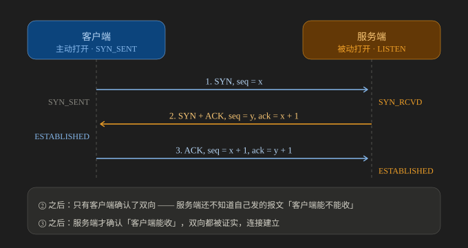

# TCP 三次握手

> 三次握手的逐步拆解、为什么必须三次而不是两次、初始序号为什么必须随机，以及握手在生产上的真正落点——半连接队列与全连接队列、`backlog` 的真实含义、队列溢出后的三种现象与调优清单。
>
> 内容整理自大厂 Go 后端面试真题，参考资料与原始素材见 [素材清单](../../../素材清单.md)。

---

## 一、TCP 三次握手的详细过程是怎样的？为什么必须三次？

**本节要点**：不能只背"SIN/ACK"，要讲清**每一步双方各自"确认了什么"**。

### 角色前提

**服务端启动服务、监听端口 → 进入 `LISTEN` 状态**。

> ⚠️ 一个容易说错的概念：**`LISTEN` 不是"某个连接"的状态，而是服务端服务本身的状态**——
> 表示它**具备了接收连接请求的能力**。
> 而 `CLOSED` 是一个**理论上存在**的状态（连接都还没建立，谈不上 close）。

### 三次握手逐步拆解

**先看时序图**（`SYN_RCVD` / `ESTABLISHED` 是**两端各自**的连接状态）：



图怎么读：左、右两条竖线是**客户端与服务端各自的生命线**，左端标出各自的起始状态
（客户端「主动打开 · `SYN_SENT`」、服务端「被动打开 · `LISTEN`」）；三根横向箭头就是三个报文 ——
`1. SYN, seq = x`、`2. SYN + ACK, seq = y, ack = x + 1`、`3. ACK, seq = x + 1, ack = y + 1`。
箭头落点旁的深色小盒是**收到这个报文之后本端所处的状态**：服务端在第①个报文后进 `SYN_RCVD`，
客户端在第②个报文后进 `ESTABLISHED`，服务端要等到第③个报文才进 `ESTABLISHED`。
底部两行点明为什么必须是三次：② 之后**只有客户端确认了双向**，服务端还不知道自己发的报文客户端能不能收；
③ 之后服务端才确认「客户端能收」，双向都被证实，连接才算建立。

```text
客户端                                服务器
  │                                     │
  │  1. SYN, seq=x                      │
  │ ──────────────────────────────────► │  (服务器进入 SYN_RCVD)
  │                                     │
  │  2. SYN+ACK, seq=y, ack=x+1         │
  │ ◄────────────────────────────────── │
  │  (客户端进入 ESTABLISHED)            │
  │                                     │
  │  3. ACK, seq=x+1, ack=y+1           │
  │ ──────────────────────────────────► │  (服务器进入 ESTABLISHED)
  │                                     │
  │         连接建立，双方可收发数据        │
```

> 读图要点：**每个报文的 `ack` 都是"我期待你下一个字节从哪开始"**——
> `ack = y + 1` 表示"你的 `y` 我收到了，下一个请从 `y + 1` 开始"；`seq` 则是自己这一侧的下一个序号。
> ⚠️ 注意**只有第 2 个报文同时带 SYN 和 ACK**；第 3 个报文**只带 ACK**（原因见下文）。

#### 第一次握手：客户端 → 服务端

```text
客户端：初始化传输控制模块（TCP），生成随机序列号 x
       → 发送 SYN = x
```

**目的**：**把客户端生成的序列号发送给服务端，让服务端记录下来**。
（再次强调：两者之间没有"软件构建的逻辑通道"，只有物理网络通道。）

#### 第二次握手：服务端 → 客户端（一个报文，两种请求）

**为什么服务端也要发同步请求？**
因为 **TCP 是全双工的**——服务端**既收也发**，它有时也是发送方，
所以**它也需要同步自己的序列号**。

因此这个报文同时表达两件事：

| 内容 | 含义 |
|---|---|
| **SYN = y** | 服务端同步自己的随机序列号 y |
| **ACK = x + 1** | 确认"我已成功收到你上一次的请求" |

**客户端收到后**：完成了一次发送 + 一次接收 → **客户端能发也能收**
→ 客户端状态进入 `ESTABLISHED`（从客户端视角，这条连接已经可用了）。

> ⚠️ 但**此刻连接还没真正建立**，因为这一轮只走通了「客户端 → 服务端」一个方向。
> 准确的说法是：**服务端还不知道自己刚发出去的 SYN + ACK，客户端到底收到没有**
> ——也就是**它还无法确认"客户端能不能收"**（服务端 → 客户端这个方向尚未被证实）。
>
> ⚠️ 这里最常见的错误说法是"**服务端不知道自己能不能收**"：其实它**已经知道了**——
> 客户端的 SYN 到了，就证明了**服务端能收、客户端能发**。
> 它不知道的是**反方向**（自己的报文能否到达对方）。这两个方向的已知/未知不能混着说。

#### 第三次握手：客户端 → 服务端（**只做确认，不再同步**）

第 3 个报文**只带 ACK 标志**（不再回 SYN），两个字段各管一件事：

| 字段 | 值 | 含义 |
|---|---|---|
| **`seq`** | `x + 1` | 客户端自己这一侧的下一个序号（`SYN = x` 已用掉序号 `x`） |
| **`ACK`** | `y + 1` | 确认已收到服务端的 `SYN = y`，期待它下一个字节从 `y + 1` 开始 |

> ⚠️ 别写成"第三次握手发 `SYN = y + 1`"：`y + 1` 是**确认号（ACK 字段）**的值，
> 不是 SYN 标志位。`SYN` 只出现在第 1、2 个报文里（"同时打开"这类特殊情况除外）。
> 另外，**纯 ACK 报文不占用序列号空间**（只有 SYN / FIN 占）——
> 所以客户端下一个数据报文的 `seq` 仍然是 `x + 1`。
> RFC 9293 的原话是"if it did, we would wind up ACKing ACKs!"。

**服务端收到后**：它发出的 `SYN + ACK` 被确认了 → **「服务端 → 客户端」这个方向也被证实**
→ 服务端进入 `ESTABLISHED`。

**至此三次握手完成，双方都确认了两件事**：
1. **彼此的收发能力都没问题**（每个方向都至少被 ACK 过一次）；
2. **序号已协商（同步）完毕**。

### 每一步之后，双方各自"知道"了什么

把"三个报文"翻译成"两端各自的已知信息"，比背 SYN / ACK 有用得多：

| 时点 | 客户端已知 | 服务端已知 |
|---|---|---|
| ① 发出 / 收到 SYN 之后 | 还不知道任何事（只知道自己发了） | **客户端能发、自己能收**；不知道自己发的能不能到对方 |
| ② 收到 SYN + ACK 之后 | 客户端能发（自己的 SYN 被 ACK）；客户端能收（收到了服务端的 SYN）；**服务端能发、服务端能收**——**四个方向它全知道了** | 与上一行**完全相同**，没有任何新增信息 |
| ③ 收到 ACK 之后 | 无变化（它在第 2 步就已确认双向） | **客户端能收**（自己发的 SYN + ACK 被 ACK 了）；加上"自己能发、能收"——**双向都被证实** |

> ⭐ 一句话记法：**第二次握手让「客户端」确认双向，第三次握手才让「服务端」确认双向。**
> 所以第 3 个报文的意义**不是"客户端再确认一次"**，而是**把确认带给服务端**。

### 为什么必须三次，不能是一次或两次？

**三次握手的两个目的**（两个都必须达成，而**只有三次才能同时做到**）：

| 目的 | 为什么必须三次 |
|---|---|
| **① 协商（同步）序号** | 双方都要告知对方自己的初始序号，且都要收到对方的确认 |
| **② 确保客户端和服务端都具备收发能力** | 第二次握手结束时，**只有客户端确认了双向可收发**；<br>服务端**还不知道自己发的报文对方能不能收**——<br>**必须靠第三次握手把这个确认带给它** |

> 用一句话概括：**要让双方都确认"我能发、我能收、对方能发、对方能收"，至少需要三个报文。**

> ⚠️ 严格说，**任何有限次握手都无法让双方"同时确知"**（经典的两军问题）：
> 客户端永远不能确知"服务端收到了我的第 3 个 ACK"。
> 工程上够用，是因为 **TCP 会重传**——真丢了，服务端会重传 SYN + ACK、客户端重发 ACK，最终收敛；
> 而且**每一方只需要确知"我发的能到对方"**，不需要知道对方的内部状态。
> 被追问"那第 3 个 ACK 丢了岂不是又回到原点"时，这段就是答案。

### 加分点：序号为什么必须随机？

> **防止网络中延迟的旧报文干扰新连接。**
> 若新连接的初始序号与旧连接重复，网络里残留的旧报文可能被误认为本次连接的数据。

## 二、半连接队列与全连接队列：握手在生产上的真正落点

**来源**：本节为补充内容 —— 按 Linux TCP 协议栈的半连接 / 全连接队列机制与内核参数整理，配套线上排查经验（⚠️ 队列与内核参数均为 Linux 侧；本机为 Windows，未做本机实测）。

**本节要点**：核心是 **「握手在生产上是怎么失败的」**。背得出 SYN / ACK 只算入门；能说出两个队列的分工、`backlog` 会被 `somaxconn` 封顶、队列溢出默认「假装成功」，才算真在生产上排过这类问题。

「三次握手」看着是原理题，在生产里其实是**队列题**——线上「偶发连接超时 / 连接被重置」绝大多数出在这两个队列上。

### 2.1 服务端有两个队列

| 队列 | 什么时候进 | 连接状态 | 谁取走 |
| --- | --- | --- | --- |
| **半连接队列**（SYN queue） | 收到 SYN、回完 SYN+ACK 之后 | `SYN_RCVD` | 收到第三次 ACK 后**移出** |
| **全连接队列**（Accept queue） | 收到第三次 ACK、连接变为 `ESTABLISHED` 后 | `ESTABLISHED` | 应用调用 `accept()` 取走 |

⭐ **只有走到 `accept()`，连接才算真正交付给应用**。握手成功 ≠ 应用能处理——这是理解后面所有现象的前提。

### 2.2 `backlog` 到底指哪个队列（超经典坑）

`listen(fd, backlog)` 这个参数**在不同系统上含义不同**，Linux 上它只约束**全连接队列**，且实际生效值要再打一次折：

```text
全连接队列实际上限 = min(应用传入的 backlog, net.core.somaxconn)
```

⚠️ **这是最常见的配置陷阱**：应用传了 `backlog = 1024`，但 `net.core.somaxconn` 只有 `128` → **实际只有 128**。Nginx 与 Go 的 `net.Listen` 都受 `somaxconn` 封顶（Go 在 `somaxconn` 可读时会用它作为 backlog）。

⚠️ **`somaxconn` 的默认值要按内核版本说，别背一个数**：

| 内核口径 | 默认值 | 说明 |
|---|---|---|
| **Linux 5.4 及以后** | **4096** | 从 5.4 起上游把默认值从 128 提到 4096 |
| 更早的内核（3.x / 4.x 常见发行版） | **128** | 「默认 128」这个流传最广的说法来自这里 |
| 运行时实际值 | — | ⭐ 以 `sysctl net.core.somaxconn` 的读数为准；发行版与容器运行时都可能改写 |

半连接队列的上限则主要由 `net.ipv4.tcp_max_syn_backlog` 决定（并与 `somaxconn`、`tcp_syncookies` 联动）。

### 2.3 队列满了会怎样（三种表现完全不同）

> ⚠️ 先记住一个前提：**下面这些是 Linux 侧的典型行为**，而且**是否触发、触发哪一种，还取决于内核版本、是否已有 SYN 重传、以及队列当时的状态**。把它们当成「Linux 上值得优先怀疑的排查线索」，而不是所有系统、所有状态下的普遍定律。

| 哪个队列满 | 默认行为 | 客户端看到的现象 |
| --- | --- | --- |
| **半连接队列满**（未开 syncookies） | **丢弃新 SYN**，不回应 | 客户端 `connect()` 阻塞后重传 SYN（`tcp_syn_retries` 次）→ **建连变慢**，最终超时 |
| **全连接队列满**（`tcp_abort_on_overflow=0`，默认） | ⭐ **丢弃第三次 ACK**（Linux 侧行为） | 客户端 `connect()` **可能返回成功**（它已经收到 SYN+ACK 并回了 ACK），发数据也可能成功一段；服务端会重传 SYN+ACK，客户端再重发 ACK……最终才超时或 RST → 表现为**「偶发连接超时/重置」** |
| **全连接队列满**（`tcp_abort_on_overflow=1`） | 直接回 **RST** | 客户端立刻拿到 `Connection reset by peer` → 失败得很「干脆」 |

⭐⭐ **默认行为之所以危险，是因为它「假装成功」**：客户端侧看是成功的连接，实际上从未进入应用；等到真正通信时才暴露。所以「客户端说连上了、服务端日志里却没有这条连接」这种排查困境，第一嫌疑就是全连接队列溢出。

> ⚠️ **不要把它当成「必然」**：客户端最终**也可能**收到 RST 或超时（取决于重传次数是否耗尽、期间队列有没有腾出空间让新连接进来）。准确的说法是「**失败被推迟到真正通信时才暴露**」，而不是「客户端一定拿到成功、服务端一定丢掉 ACK」。

### 2.4 怎么观测（三步定位）

```bash
# 1) 看队列现状：Recv-Q = 当前排队数，Send-Q = 该监听套接字的上限
ss -lnt

# 2) 看溢出与丢包计数（数字持续增长就是证据）
netstat -s | grep -i -E "listen|SYN"
#   「listen queue of a socket overflowed」→ 全连接队列溢出
#   「SYNs to LISTEN sockets dropped」      → 半连接队列溢出 / 丢 SYN

# 3) 更细的内核计数器（需要 nstat / netstat -s 的扩展项）
nstat -az | grep -iE "ListenOverflow|ListenDrops|TCPReqQFull|SyncookiesSent"
```

### 2.5 调优清单

| 参数 | 作用 | 建议 |
| --- | --- | --- |
| `net.core.somaxconn` | **全连接队列上限的封顶值** | 高并发服务调到 1024~4096；⚠️ 只改应用 backlog 不改它等于没改；默认值按内核版本（5.4+ 为 4096，更早常见 128），**以 `sysctl` 读数为准** |
| 应用侧 backlog | 声明需求值 | Go 通常用 `somaxconn`；Java `ServerSocket(port, backlog)`、Tomcat `acceptCount` |
| `net.ipv4.tcp_max_syn_backlog` | 半连接队列上限 | 抗握手洪峰时调大（如 4096+） |
| `net.ipv4.tcp_syncookies` | 队列满时用 cookie 建连而非丢弃 | 默认开启；⚠️ 代价是**不能携带窗口缩放等选项**，只在压力下使用 |
| `net.ipv4.tcp_abort_on_overflow` | 溢出时是否回 RST | 默认 `0`（适合突发流量）；**不能容忍「假成功」的服务设 `1`**，让失败快速暴露 |
| `net.ipv4.tcp_syn_retries` / `tcp_synack_retries` | 握手重传次数 | 决定建连超时总时长（默认 6 / 5 次，约 127s / 63s，线上通常调小） |

> ⭐ 一句话总结：**服务端排查「连不上」，第一现场不是抓包，而是 `ss -lnt` 的 `Recv-Q` 与 `netstat -s` 里的 overflow 计数。**

### 2.6 与应用层参数的联动

队列不是孤立的，它会和三层参数互相影响：

- **负载均衡的健康检查**：探测频率低 + 队列浅，会出现「探测通过但真实流量排队溢出」；
- **accept 速度**：应用 `accept()` 慢（单线程 accept + 复杂逻辑）会让全连接队列堆积，即使队列上限很大也会满；
- **accept 前就被丢**：Go 的 `Accept` 出错后若没有立即重试，会漏掉队列中的连接（`net/http` 已在内部处理 `Temporary` 错误的重试）。

---

## 三、TCP Fast Open：握手阶段就能带数据？

**本节要点**：TFO 把「第一份应用数据」提前到握手阶段发送，**收益上限是一个 RTT**；但它是**实验性标准**（RFC 7413），且带应用层重放风险，能不能用必须按两端与中间设备确认。

### 3.1 它解决什么问题

一次冷启动的 HTTPS 请求至少 3 个往返（DNS + TCP + TLS，见 [网络通信链路详解.md](../网络通信链路详解.md) 2.3）。TFO 的思路是让**数据搭上握手的车**：

```text
首次连接（拿 Cookie）：
  客户端 ── SYN + TFO 选项（Cookie 为空） ──► 服务端
  客户端 ◄── SYN+ACK + TFO 选项（签发 Cookie）── 服务端

后续连接（Cookie 命中，数据随 SYN 一起发）：
  客户端 ── SYN + Cookie + 应用数据 ──► 服务端（校验通过后直接交付给应用）
  客户端 ◄── SYN+ACK + 响应 ──────────── 服务端
```

⭐ **收益上限就是「一个 RTT」**：它不能让握手变短，只是把「等握手完成再发数据」变成「握手的同时把数据发出去」。所以它**不会让小请求少一次往返**，只会让**第一个字节更早到达**。

### 3.2 四个必须知道的前提

| 前提 | 说明 |
|---|---|
| **它是实验性标准** | 规范是 [RFC 7413](https://www.rfc-editor.org/rfc/rfc7413.html)，标注 Experimental；各系统默认关闭（Linux 由 `net.ipv4.tcp_fastopen` 的位掩码分别控制客户端与服务端） |
| **依赖 Cookie 缓存** | Cookie 由服务端签发、客户端缓存；**跨机部署、负载均衡换了节点、客户端清缓存**都会退化成普通握手 |
| **中间设备兼容性存疑** | 防火墙 / NAT 可能剥离不认识的 TCP 选项（对照 [网络通信链路详解.md](../网络通信链路详解.md) 第三节「每一跳改写什么」），导致 TFO **静默失效**——这正好是「看起来配了、实际没生效」的典型 |
| ⚠️ **重放风险** | 带数据的 SYN 可以被录制后重发，服务端会**再次**把数据交给应用。所以**只能用于幂等请求**（GET 之类），并配合服务端单次 Cookie 校验 |

> ⭐ 工程结论：**TFO 是优化项，不是基线**。设计时按「最坏情况退化为普通三次握手」来做，不要假设它一定生效；也别把它当成安全机制。

---

## 使用：观测握手与两个队列

服务端「偶发连不上」的第一现场不是抓包，而是下面这三条命令；按顺序跑，先定位是哪个队列在丢。

```bash
# ① 看队列现状：Recv-Q = 当前排在 accept 队列里的连接数，Send-Q = 该监听套接字的上限（正文 2.4）
ss -lnt
# State   Recv-Q  Send-Q  Local Address:Port
# LISTEN  129     128     0.0.0.0:8080    ← Recv-Q 顶着 Send-Q = 全连接队列满（示意，本机为 Windows 无实测）

# ② 看溢出计数（数字持续增长就是证据）：全连接与半连接溢出的报文不一样（正文 2.4）
netstat -s | grep -i -E "listen|SYN"
# listen queue of a socket overflowed  → 全连接队列溢出：第三次 ACK 被丢，客户端却显示「连接成功」
# SYNs to LISTEN sockets dropped       → 半连接队列溢出 / 丢 SYN：客户端建连变慢直到超时

# ③ 更细的内核计数器，用来区分到底哪个队列在丢
nstat -az | grep -iE "ListenOverflow|ListenDrops|TCPReqQFull|SyncookiesSent"

# ④ 复测纪律：全连接队列上限 = min(应用 backlog, net.core.somaxconn)，只改应用参数等于没改（正文 2.2 / 2.5）
#    调完 somaxconn 与 tcp_max_syn_backlog 后重跑 ①~③，Recv-Q 不再顶格、overflow 计数不再增长才算修好
```

## 延伸追问

- **为什么断开连接要四次挥手？** → 因为 TCP 是全双工，**关闭需要两个方向各自关闭**：
  一方发 FIN 只表示"我没数据要发了"，对方可能还有数据要发，
  所以 ACK 和 FIN 通常不能合并（除非对方恰好也没数据了），因此需要四次。
- **SYN 洪泛攻击是什么？** → 攻击者只发第一次握手就不回应，
  服务端维持大量半连接（SYN_RCVD）耗尽资源。防御：**SYN Cookie**、缩短超时、限制半连接数。
- **三次握手的第三个报文丢了会怎样？** → 服务端会超时重传 SYN+ACK；
  客户端若已认为连接建立并发了数据，会因收到重传的 SYN+ACK 而重发 ACK。
- **握手报文能携带数据吗？** → 能。按 RFC 9293，"握手阶段携带数据是**完全合法的**"，
  前提是接收方在连接进入 `ESTABLISHED` 之前**不把数据交付给应用**（先缓冲）——
  因为三次握手的意义正是降低"假连接"的概率。实践中前两个 SYN 报文一般不带数据，
  第 3 个 ACK 通常是一个**空段**。⚠️ 注意区分：**TFO（第三节）走的是另一条路**——它靠 Cookie 授权服务端在握手阶段就把数据交付给应用，所以**收益与风险都和普通握手带数据不同**。
- **全连接队列溢出时，为什么客户端显示「连接成功」？** → Linux 默认 `tcp_abort_on_overflow=0` 时内核**丢弃第三次 ACK**，不主动通知客户端。客户端已经收到 SYN+ACK 并回了 ACK，于是认为连上了，服务端却还把它留在 `SYN_RCVD` 并重传 SYN+ACK——直到超时或 RST 才暴露。要快速失败就得设 `=1`。⚠️ 这是**Linux 侧的典型行为**，且失败形态还取决于重传次数与队列后续状态，不要当成所有系统的定律。
- **`backlog` 设大了为什么没效果？** → 全连接队列的真实上限是 `min(backlog, net.core.somaxconn)`。`somaxconn` 的默认值**要按内核版本说**：Linux 5.4 起是 **4096**，更早的内核常见 **128**；实际以 `sysctl net.core.somaxconn` 为准。**只改应用参数不改内核参数等于没改**，这是最典型的配置被「悄悄打折」。
- **服务端「偶发连接超时」怎么查？** → 三步：①`ss -lnt` 看 `Recv-Q`（当前排队）与 `Send-Q`（队列上限）②`netstat -s | grep -i listen` 看 `listen queue overflowed` 是否在增长③确认应用 `accept()` 是否够快、backlog 与 `somaxconn` 是否匹配。
- **半连接队列和全连接队列分别由谁控制？** → 半连接队列由 `net.ipv4.tcp_max_syn_backlog`（配合 `tcp_syncookies`）控制；全连接队列由 `min(应用 backlog, net.core.somaxconn)` 控制。

---

## 关联

- [TCP报文结构.md](TCP报文结构.md) — 首部字段与序列号语义
- [TCP滑动窗口.md](TCP滑动窗口.md) — 窗口与 SYN 洪泛半连接堆积
- [TCP四次挥手.md](TCP四次挥手.md) — 连接的关闭侧：`FIN_WAIT` / `CLOSE_WAIT` / `TIME_WAIT` 与半关闭
- [HTTPS与TLS.md](../HTTPS与TLS.md) — 握手之上的 TLS 握手
- [Skywalking.md](../../../03-数据与中间件/中间件/可观测性/Skywalking.md) — 线上观测建连耗时的手段

> 反向引用（本篇被下列文档引到）：[net包与TCP-UDP编程.md](../../../01-编程语言/go/网络编程/net包与TCP-UDP编程.md)、[DNS解析.md](../DNS解析.md)、[IP与路由基础.md](../IP与路由基础.md)、[QUIC与HTTP3.md](../QUIC与HTTP3.md)、[TCP拥塞控制算法.md](../TCP拥塞控制算法.md)、[抓包实战.md](../抓包实战.md)、[网络分层与数据包旅程.md](../网络分层与数据包旅程.md)、[网络通信链路详解.md](../网络通信链路详解.md)、[通信选型.md](../通信选型.md)
