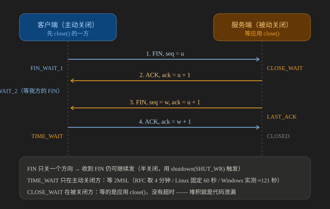

# TCP 四次挥手

> 挥手为什么是四次、`TIME_WAIT` 与 `CLOSE_WAIT` 各是谁的状态、生产上这两个状态堆积时怎么定位。
>
> 内容整理自大厂 Go 后端面试真题；状态机与时长口径参考 **RFC 9293** §3.3.2 / §3.5.2 / §3.6 / §3.6.1（引用处标注节号）。
> **第四节是本机实测**（Windows 11 + Python 3.13.12 / WinSock 的真实输出），内核参数类结论（Linux）取自官方文档并已标注。
> 参考资料与原始素材见 [素材清单](../../../素材清单.md)。

---

## 一、四次挥手是怎么走的？为什么必须是四次？

**本节要点**：四次不是"多了一个 ACK"，而是**两个方向各自独立关闭**——
收到对方的 FIN 只代表"它不发了"，本方**仍然可以继续发**，所以 ACK 和 FIN 通常被拆成两个报文。

### 1.1 时序图（含两端状态迁移）



图怎么读：左、右两条竖线是**主动关闭方（客户端）与被动关闭方（服务端）各自的生命线**，
四根横向箭头依次是 `1. FIN, seq = u` → `2. ACK, ack = u + 1` → `3. FIN, seq = w, ack = u + 1` → `4. ACK, ack = w + 1`。
箭头旁的深色小盒是**该报文处理完本端所处的状态**：客户端依次是 `FIN_WAIT_1`、`FIN_WAIT_2`（等对方的 FIN）、
`TIME_WAIT`，服务端在回第 2 个报文后停在 `CLOSE_WAIT` **等应用调用 close()**，才发出自己的 FIN 进 `LAST_ACK`。
底部三行是本篇后文要展开的三件事：`FIN` 只关一个方向（半关闭由 `shutdown(SHUT_WR)` 触发）、
`TIME_WAIT` **只在主动关闭方**且要等 2MSL、`CLOSE_WAIT` **没有超时**所以堆积就是代码泄漏。

下面这份纯文本版与图逐行对应，便于在没有渲染器时对照：

```text
客户端（主动关闭方）                        服务端（被动关闭方）
  │                                            │
  │  1. FIN, seq = u                           │
  │ ─────────────────────────────────────────► │  （CLOSE_WAIT：收到 FIN 并回 ACK，
  │  （FIN_WAIT_1）                            │    等本端应用调用 close()）
  │                                            │
  │  2. ACK, ack = u + 1                       │
  │ ◄───────────────────────────────────────── │
  │  （FIN_WAIT_2：本端已无数据要发，等对方的 FIN）│
  │                                            │
  │                                            │  （应用终于 close()）
  │  3. FIN, seq = w, ack = u + 1              │
  │ ◄───────────────────────────────────────── │  （LAST_ACK：等最后一个 ACK）
  │                                            │
  │  4. ACK, ack = w + 1                       │
  │ ─────────────────────────────────────────► │  （CLOSED）
  │  （TIME_WAIT：再等 2MSL 才 CLOSED）         │
```

> 这就是 RFC 9293 Figure 12 的"正常关闭序列"（Normal Close Sequence）。
> ⚠️ 两个 `FIN` **各占一个序号**（和 SYN 一样），所以确认号是 `u + 1` / `w + 1`；
> 而第 2、4 个报文是**纯 ACK，不占序号**（这条在 [TCP三次握手.md](TCP三次握手.md) 里已经用过一次）。

### 1.2 为什么不是三次：ACK 与 FIN 通常合并不了

RFC 9293 §3.6 的原文说得很直接：

> "Note that a TCP endpoint receiving a FIN will ACK but not send its own FIN until its user has CLOSED the connection also."

也就是：**内核收到 FIN 只先回 ACK，本端的 FIN 要等应用真的调用 `close()` 才能发**。
应用什么时候 close 是不确定的（可能还在处理请求、可能忘了关），
ACK 与 FIN 在时间上就被拆成两个报文 → 一共四次。

**两种会退化成三次的情况**：

| 情况 | 为什么少一次 |
|---|---|
| 对端收到 FIN 时**恰好也没有数据要发了**（应用马上 close） | ACK 与 FIN 能塞进同一个报文 —— 实践中常见，但**不能依赖**（它取决于对端应用的行为） |
| 双方**同时关闭**（RFC 9293 §3.6 Case 3） | 两个 FIN 交叉发出，各自只回一个 ACK |

### 1.3 "收到 FIN 还能继续发"：半关闭

- TCP 的 `CLOSE` 在协议里是**单工**处理的（RFC 9293 §3.6）：
  **"The user who CLOSEs may continue to RECEIVE until the TCP receiver is told that the remote peer has CLOSED also."**
- 所以连接可以处于**半关闭**状态：一个方向已关，另一个方向照常传数据
  （RFC 9293 §3.6.1 明确支持，并给了两种实现策略：半双工实现若在 CLOSE 后还有数据到达，应当回 `RST`）。
- 应用层的触发方式是 **`shutdown(SHUT_WR)`（只关发送方向），而不是 `close()`**：
  Go 里对应 `(*net.TCPConn).CloseWrite()`，Java 里对应 `Socket.shutdownOutput()`。
- 本机实测（第四节 4.3）：客户端 `shutdown(WR)` 之后，**仍然收到了服务端的响应** —— 这就是"四次挥手存在"的直接证据。

---

## 二、`TIME_WAIT`：为什么必须等、到底是谁在等？

**本节要点**：**只有主动关闭方进 `TIME_WAIT`**。它的两个作用是"保证最后那个 ACK 送达"和"让旧连接的延迟报文彻底过期"；
把它当成故障去"优化掉"，是这类问题里最常见的错。

### 2.1 谁进 `TIME_WAIT`

RFC 9293 §3.6.1（MUST-13）：

> "When a connection is closed actively, it MUST linger in the TIME-WAIT state for a time 2xMSL (Maximum Segment Lifetime)."

→ **谁先 `close()` 谁进 `TIME_WAIT`**。两个推论：

| 推论 | 说明 |
|---|---|
| 服务端如果**主动关闭**（HTTP/1.0 短连接、`Connection: close`、自己设了超时关闭） | `TIME_WAIT` 就堆在**服务端**，这是它最常见的正常来源 |
| 用 **`RST` 关连接**省掉 `TIME_WAIT` | ❌ 想错了：RFC 9293 §3.5.2 说**发 RST 的一方也应该进 `TIME_WAIT`**；而且 RST 会丢掉未发完的数据、对端也看到异常关闭 |

### 2.2 为什么要等 2MSL：两件事各占 1 个 MSL

RFC 9293 §3.3.2 对 `TIME-WAIT` 的定义就是答案：

> "TIME-WAIT - represents waiting for enough time to be sure the remote TCP peer received the acknowledgment of its connection termination request and to avoid new connections being impacted by delayed segments from previous connections."

拆开看：

1. **保证对端收到第 4 个 ACK**：如果这个 ACK 丢了，对端会重传 FIN；
   本端还在 `TIME_WAIT` 里，**就能再回一次 ACK**。否则对端会一直重传到超时，连接处于"一半关着"的悬空状态。
2. **让本次连接的延迟报文在网络中过期**：同一四元组很快被复用成新连接时，
   网络里残留的旧数据段不会被新连接误收。RFC 在序列号空间讨论里也强调
   "一个报文占用的序号**直到 MSL 秒过去才释放**"（§3.4.3）。

> ⚠️ **"2MSL 到底是多久"必须按平台说，别背一个数字走天下**：

| 口径 | 时长 | 说明 |
|---|---|---|
| RFC 9293 §3.4.2 | MSL = **2 分钟** → 2MSL = 4 分钟 | 这是规范建议值，不是实现的默认值 |
| Linux | `TIME_WAIT` **固定 60 秒**（内核常量 `TCP_TIMEWAIT_LEN`） | ⚠️ 常被搞混：`net.ipv4.tcp_fin_timeout`（默认 60）管的是 **`FIN_WAIT_2`**，**不是 `TIME_WAIT`** |
| Windows | 由注册表 `TcpTimedWaitDelay` 控制（默认值随版本不同） | **本机实测约 121 秒**（见第四节 4.2），与"默认 120 秒"吻合 |

### 2.3 生产上的三条推论

| 现象 | 原因 / 做法 |
|---|---|
| 短连接 + 本端主动关闭 → 端口被 `TIME_WAIT` 占满，报 `Cannot assign requested address` | 根治手段是**改成长连接 / 连接池**；缓解：`net.ipv4.tcp_tw_reuse=1`（**只对出向连接**、且需要时间戳；复用 `TIME_WAIT` 的四元组）、`tcp_max_tw_buckets`（超过上限时内核直接清掉 `TIME_WAIT` 并告警）。⚠️ **`tcp_tw_recycle` 已在 Linux 4.12 被移除**，它是 NAT 场景下的"随机丢包"元凶，**不要再把它当方案提** |
| `ss -tan state time-wait` 看到大量 `TIME_WAIT` | 先分清是**正常**（本端是主动关闭方）还是**过量**（短连接风暴）。真正要优化的是"为什么会有这么多连接" |
| 想用 `SO_LINGER = 0` 直接 `RST` 绕开 `TIME_WAIT` | 会丢弃未发送完的数据、对端收到 `RST`；只在"明确知道影响、且数据可以不要"时用（例如快速失败的健康检查） |

---

## 三、`CLOSE_WAIT` 堆积：一定是应用没关连接

**本节要点**：**`TIME_WAIT` 是协议规定的正常状态，`CLOSE_WAIT` 长期存在则是应用代码问题** —— 这两个方向的锅必须分清，
面试里能把这句话说清楚，比背状态机更有用。

### 3.1 它到底意味着什么

`CLOSE_WAIT` 挂在**被动关闭方**：本端已经收到对端的 FIN 并回了 ACK，
但**本端应用还没有调用 `close()`**（RFC 9293 §3.6 Case 1：收到 FIN 只 ACK，直到本地用户 CLOSE 才发 FIN）。

所以它停留多久**完全由应用的代码决定**——不是内核参数能调的。数量随时间**单调上涨**，就是连接泄漏。

### 3.2 最常见的四种成因（按出现频率）

| 成因 | 典型长相 |
|---|---|
| 忘了 `close` | Go：`conn, _ := net.Dial(...)` 之后异常路径 return，没有 `defer conn.Close()`；Java：`finally` 里漏了 `close()` |
| **HTTP 客户端没读/关 body** | `resp, _ := http.Get(url)` 之后没 `defer resp.Body.Close()` → 连接无法归还连接池，对端先关就成了 `CLOSE_WAIT` |
| 连接池借出未归还 | 从池里取到连接后抛异常，`release` 没走到 |
| 长连接表没清理 | 连接存进 `map[string]conn` 之后，对端断了但本地表项与连接都没删 |

排查套路（Linux）：

```bash
# 1) 数一下有多少、对端都是谁（对端地址分布能直接指向"是哪个下游在关"）
ss -tan state close-wait | head -20
ss -tan state close-wait | wc -l

# 2) 拿到 PID / 进程名，定位到服务
ss -tanp state close-wait

# 3) 进程内再看：连接是谁创建的（Go 用 pprof / netstat 对账，Java 用 jstack + lsof -p）
ls -l /proc/<pid>/fd | grep socket | wc -l
```

> ⚠️ 光改内核参数**救不了** `CLOSE_WAIT`（它没有超时机制，RFC 也没规定）——
> 只有应用调了 `close()`，或进程退出，它才会消失。

---

## 四、本机实测：四种状态都抓到、`TIME_WAIT` 时长量到了

**实测环境**：Windows 11 + Python 3.13.12（WinSock），服务端与客户端都在本机、同一个进程里（所以 `netstat` 的 PID 列相同）。
观测工具：`netstat -ano`。

### 4.1 一端 close、另一端不 close → `CLOSE_WAIT` + `FIN_WAIT_2`

客户端发完数据立刻 `close()`；服务端 `accept` 之后**故意什么都不做**（不读不关）：

```text
[14:02:13] --- close() 前的 netstat ---
      TCP    127.0.0.1:34567        127.0.0.1:63224        ESTABLISHED     13664
      TCP    127.0.0.1:63224        127.0.0.1:34567        ESTABLISHED     13664
[14:02:14] --- close() 之后的 netstat（两端各自的连接状态）---
      TCP    127.0.0.1:34567        127.0.0.1:63224        CLOSE_WAIT      13664
      TCP    127.0.0.1:63224        127.0.0.1:34567        FIN_WAIT_2      13664
```

**读法**：客户端已经发了 FIN，服务端回了 ACK（所以客户端进 `FIN_WAIT_2`），
但服务端**应用一直没 close** → 它停在 `CLOSE_WAIT`。**只要服务端不 close，客户端就永远停在 `FIN_WAIT_2`**——
这正是"对端不关连接，我这边关不干净"的形状，也是 `CLOSE_WAIT` 的危害所在。

### 4.2 双方都 close → `TIME_WAIT`，并量出实际时长

这次让服务端 `recv` 到 EOF 之后也 `close()`（走完整的四次挥手）：

```text
[14:03:11] --- close 之后 1 秒：客户端侧 60193 的状态 ---
    TCP    127.0.0.1:60193        127.0.0.1:34568        TIME_WAIT       0
[14:03:11] 轮询 TIME_WAIT 消失时刻（最多 360 秒）
[14:03:32] t+ 21s 仍在 TIME_WAIT：TCP    127.0.0.1:60193        127.0.0.1:34568        TIME_WAIT       0
[14:04:52] t+101s 仍在 TIME_WAIT：TCP    127.0.0.1:60193        127.0.0.1:34568        TIME_WAIT       0
[14:05:12] TIME_WAIT 已消失：自 close() 起约 121 秒
```

**三条读数**：

| 观察到的事实 | 结论 |
|---|---|
| `TIME_WAIT` 只挂在**客户端**那一行（主动关闭方），服务端 1 秒后已查不到这条连接 | **谁先 close 谁 `TIME_WAIT`**，已在 2.1 说过，这里拿到了证据 |
| `TIME_WAIT` 那一行的 **PID 列是 0** | 连接已不属于任何进程，纯粹是内核持有的状态——所以"进程早退出了、端口还被占着"是正常的 |
| 时长 **约 121 秒**（t+101s 还在、t+121s 消失） | 与 Windows `TcpTimedWaitDelay` 默认 **120 秒**吻合；**注意这不是 RFC 的 4 分钟**，平台差异必须说清 |

> 顺带一个诚实说明：**`LAST_ACK` 没抓到**。被动关闭方 `close()` 之后，只要对端的 ACK 立刻到达，
> 它就直达 `CLOSED`，`LAST_ACK` 只存在毫秒级——要稳定抓到它，得让对端**故意不回**最后一个 ACK。

### 4.3 半关闭：`shutdown(WR)` 之后仍能收到数据

客户端 `send` 完就 `shutdown(SHUT_WR)`（只关发送方向，不是 `close`）：

```text
[14:05:13] 客户端 send 后 shutdown(SHUT_WR)（本端端口 65105）
[14:05:13] 客户端在 shutdown(WR) 之后仍收到 b'response-after-half-close' → 证明半关闭成立（FIN 只关一个方向）
[14:05:13] --- 半关闭期间的 netstat（客户端侧） ---
    TCP    127.0.0.1:34569        127.0.0.1:65105        CLOSE_WAIT      6520
    TCP    127.0.0.1:65105        127.0.0.1:34569        FIN_WAIT_2      6520
```

客户端发出 FIN 后仍在 `FIN_WAIT_2`，而**它照样把服务端的响应读出来了** →
证明 `FIN` 只关闭"客户端 → 服务端"这一个方向。这也解释了为什么应用层"优雅关闭"通常先 `shutdown(WR)` 再慢慢读残留数据。

### 4.4 四个状态对照表（谁停在上面）

| 状态 | 停在哪一方 | 含义 / 谁来推动它离开 |
|---|---|---|
| **`FIN_WAIT_1`** | 主动关闭方 | 已发 FIN，等 ACK |
| **`FIN_WAIT_2`** | 主动关闭方 | 已收到 ACK，**等对端的 FIN**；对端不 close 就一直停着（4.1 实测） |
| **`CLOSE_WAIT`** | 被动关闭方 | 收到 FIN 并回了 ACK，**等本端应用 close**（应用不改，谁也救不了） |
| **`LAST_ACK`** | 被动关闭方 | 已发 FIN，等最后那个 ACK（毫秒级，难抓） |
| **`TIME_WAIT`** | 主动关闭方 | 已发最后 ACK，等 2MSL 让旧报文过期（4.2 实测 ~121 秒） |

---

## 使用：定位 `TIME_WAIT` / `CLOSE_WAIT` 的固定套路

先分清是哪一种，再决定查内核还是查代码：

```bash
# ① 先看分布：哪个状态多、对端都是谁（对端地址分布能直接指向"谁在关连接"）
ss -tan state established | wc -l
ss -tan state time-wait   | wc -l
ss -tan state close-wait  | wc -l

# ② TIME_WAIT 多：确认本端是主动关闭方（短连接 / Connection: close / 自己设了超时）
ss -tan state time-wait | awk '{print $4}' | awk -F: '{print $2}' | sort | uniq -c | sort -rn | head
#    出向端口集中 → 本端作为客户端在疯狂短连接；本地端口是服务端口 → 本端主动关客户端

# ③ CLOSE_WAIT 多：直接定位进程与 fd（这一步之后就该看代码，不是看内核）
ss -tanp state close-wait
ls -l /proc/<pid>/fd | grep -c socket

# ④ Windows 侧对应命令（本机实测用的就是它）
netstat -ano | findstr "<端口或对端IP>"
```

排查顺序建议：**先定方向（谁主动关）→ 再看量（是否随时间单调上涨）→ 最后落代码或落配置**。

> ⚠️ 别一上来就调内核参数：`CLOSE_WAIT` 与内核参数无关；`TIME_WAIT` 能调的只有
> "复用 / 上限 / 时长"，而**真正的解法通常是改成连接池、复用长连接**。

---

## 延伸追问

- **为什么挥手是四次、握手只要三次？** → 握手时双方**都要先同步自己的序号**，ACK 与 SYN 能合并成一个报文；
  挥手时**收到 FIN 只回 ACK，本端的 FIN 要等应用 close**（RFC 9293 §3.6），两件事时间上拆开了 → 四次。
- **挥手能不能是三次？** → 能，两种：对端收到 FIN 时恰好也没数据了（ACK 与 FIN 合并）；
  或者双方同时关闭（FIN 交叉，各回一个 ACK）。但都不是可以依赖的常态。
- **`TIME_WAIT` 为什么要等 2MSL？少等一个 MSL 行不行？** → 两个作用各占 1 个 MSL：
  ① 保证最后那个 ACK 送达（丢了还能重发）；② 让旧连接的延迟报文过期，避免串到复用了同一四元组的新连接。
  少一个都可能留下"旧报文被新连接收下"的隐患。
- **`TIME_WAIT` 能不能避免？** → 协议要求主动关闭方必须等（MUST-13），
  正确的"避免"是**别让它成为主动关闭方**（改长连接/连接池）；`tcp_tw_reuse` 只能复用**出向**连接的 `TIME_WAIT`；
  ⚠️ `tcp_tw_recycle` 已在 4.12 删除，NAT 下会误杀，**别再提**。
- **大量 `CLOSE_WAIT` 说明什么？** → 应用没关连接（收到 FIN 却一直不 `close()`）。
  常见是漏 `defer Close()`、HTTP 客户端没关 `resp.Body`、连接池借出不还。**改代码，不是调内核。**
- **`TIME_WAIT` 和 `CLOSE_WAIT` 分别在哪一方？** → **`TIME_WAIT` 在主动关闭方**（先 `close()` 的那端），
  **`CLOSE_WAIT` 在被动关闭方**（收到了 FIN、还没 close 的那端）。这两个位置记住，方向就不会说反。
- **半关闭是什么？应用怎么触发？** → 一个方向关、另一个方向还能传数据（FIN 只关一个方向）；
  `shutdown(SHUT_WR)` 触发（Go 的 `CloseWrite()`、Java 的 `shutdownOutput()`），
  本机实测里客户端 `shutdown(WR)` 之后照样收到了服务端的响应。
- **`CLOSE_WAIT` 有超时吗？** → **没有**。它等的是"应用调用 close()"，不是计时器；
  所以 `ss` 里看到的 `CLOSE_WAIT` 数就是泄漏的进度条。

---

## 关联

- [TCP三次握手.md](TCP三次握手.md) — 建立连接的另一半：seq/ack 的含义、为什么必须三次
- [TCP报文结构.md](TCP报文结构.md) — `FIN` / `ACK` / `RST` 标志位与序号占用规则
- [TCP滑动窗口.md](TCP滑动窗口.md) — 关闭与在途数据：为什么关闭要等对端数据处理完
- [IO多路复用.md](../IO多路复用.md) — 连接被对端关闭时 epoll 侧的表现（可读且读到 EOF）
- [常用命令.md](../../linux/常用命令.md) — `ss` / `netstat` 查端口占用与连接状态
- [K8s部署与生命周期面试题.md](../../../06-工程实践/部署/k8s/K8s部署与生命周期面试题.md) — 停服时的连接排空与 `terminationGracePeriodSeconds`

> 反向引用（本篇被下列文档引到）：[QUIC与HTTP3.md](../QUIC与HTTP3.md)、[抓包实战.md](../抓包实战.md)、[网络通信链路详解.md](../网络通信链路详解.md)
