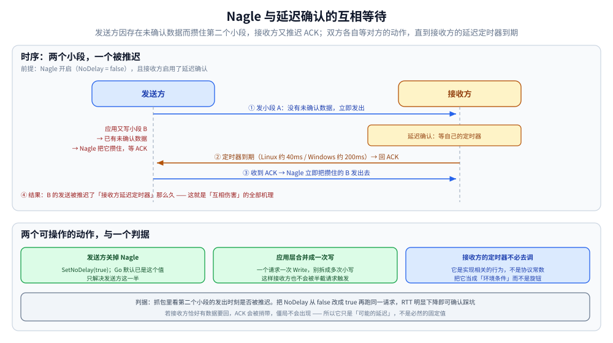

# TCP 的 Nagle 算法与延迟确认

> Nagle 如何合并小包、延迟确认如何合并 ACK，以及两者同时开启时的「互相伤害」与破解办法。
>
> 内容整理自大厂 Go 后端面试真题，参考资料与原始素材见 [素材清单](../../../素材清单.md)。

---

## 一、Nagle 算法、TCP 窗口与延迟确认

**本节要点**：这三个机制各解决一个问题，**但 Nagle 与延迟确认同时开启会互相拖累**——
能讲清这个组合问题才算真的理解。

### 前提假设

客户端序列号 100、服务端序列号 1000；**MSS = 1000 字节**（实际通常 1460）；**窗口 5 个 MSS = 5000 字节**。

### 1.1 Nagle 算法：合并小包

**要解决的问题**：应用层频繁发送**很小的数据包**（如 1 字节），
每个小包都要占 40 字节头部，**网络利用率极低**（"糊涂窗口综合征"的近亲）。

**Nagle 算法的作用**：**在有未确认数据时，不把新的小段单独发出去，而是攒起来合并发送**（默认开启）。

**核心规则（只有这几条，没有「定时器」）**：

| 规则 | 触发条件 | 行为 |
|---|---|---|
| **① 没有未确认数据** | 有新数据要发送，且**之前发出的数据都已确认** | **立即发送，不做合并**。<br>因为本来就没有需要等待的东西，强行缓存只会**增加延迟** |
| **② 累积达到一个 MSS** | 缓存等待期间，**累积数据已达到一个最大报文段** | **立即发送** |
| **③ 收到 ACK** | 缓存等待期间，**对端把之前数据的 ACK 回复过来了** | **立即发送**（不必等别的条件） |
| **④ ⚠️ 没有超时兜底** | —— | **Nagle 本身不带定时器**：如果对端一直不回 ACK，被攒住的段就会一直等下去 |

⭐ **所以「等 200ms 就发」不是 Nagle 的规则**，而是「Nagle 在等 ACK」与「对端的延迟确认在等它自己的定时器」两条机制**叠加**出来的现象——
定时器的具体值由**对端 TCP 实现**决定（见 1.3），既不是协议常数，也不是 Nagle 的一部分。

**核心思想**：**"没有未确认数据就立即发，有就在攒够 MSS 或收到 ACK 时发"**——它是一条**条件触发**的规则，不是一个计时器。

### 1.2 TCP 窗口：解决"发一条等一条"的低吞吐

**没有窗口的世界**：

```text
发送数据 → 等待确认 → 发送数据 → 等待确认 → ...
```

> 每发一条就要停下来等回复，**整个 TCP 的性能非常差，吞吐量上不去**。

**引入窗口后**：

> **窗口 = 允许多少数据处于"未确认"状态。**

有了窗口，**在没收到确认时依然可以继续发送**：

```text
窗口 5 个 MSS：
发第 1 个（100→1100）→ 还剩 4 个额度 → 可以继续发
发第 2、3、4、5 个       → 窗口打满
→ 若接收方仍未给任何确认，则不能再发
```

**发送方一旦收到确认，就能腾出窗口继续发送下一批**——
这就是"**窗口大小决定了在途数据量，从而决定了吞吐上限**"。

### 1.3 延迟确认：合并确认

**做法**：接收方收到数据后**不总是立即回 ACK**，而是等一小段时间（或者等自己也有数据要发时**捎带**），以减少 ACK 的数量。

**为什么值得延迟**（两个收益）：

1. **多个报文段只需回复一次确认**——收到多个段只做一次回复就能确认全部；
2. **可以"捎带"确认**——如果接收方**自己也有数据要发给发送方**，
   那就在发送数据时**顺便把这个确认一起带过去**（piggybacking），
   **省掉一个独立的 ACK 报文**。

⚠️ **延迟多久是「实现相关」，不是协议常数**：

| 实现 | 常见延迟 | 说明 |
|---|---|---|
| Linux | **约 40ms** | 且**并非所有情况都延迟**：例如已经收到两个段、或已有未被确认的数据时，会立即 ACK |
| Windows | **常见约 200ms** | ⭐ 「延迟确认等 200ms」这个流行说法的来源，**不能推广成所有系统** |
| 通用 | 实现相关 | 还会被「每收到 N 个段就 ACK 一次」之类的规则打断 |

⭐ **所以正确的说法是**：延迟确认的**具体定时策略由 TCP 实现与当时的收包节奏共同决定**，只能确定「**它会推迟 ACK**」这件事本身。

### ⚠️ 加分点：Nagle + 延迟确认 同时开启的"互相伤害"



上图就是「互相伤害」的完整机理：**发送方的小段被 Nagle 攒住（在等 ACK），而 ACK 又被接收方的延迟确认推后**，于是**双方都在等对方的动作**——这个僵局只能靠接收方的延迟定时器到期（或接收方恰好有数据要发、把 ACK 捎带出去）来打破。

> **Nagle 算法**：有小数据要发，但**前面还有未确认数据** → 攒着等 ACK。
> **延迟确认**：收到数据先不 ACK，**等一个实现相关的定时器** → ACK 来得晚。
>
> 两者叠加的结果：**发送方等确认才发小包，接收方等定时器才发确认**，
> 形成**额外的往返延迟**，典型表现是**请求-响应型小包交互出现明显卡顿**。

> ⚠️ **它是「可能的交互」，不是「必然的固定延迟」**：如果接收方恰好有数据要回（请求-响应场景很常见），ACK 会被**捎带**出去，这个僵局根本不会出现；
> 很多实现还有「收到两个段立即 ACK」之类的规则。所以「一定会多等 200ms」是过度断言——
> **正确表述是「在特定交互模式下会引入额外延迟」**。

> **这就是为什么对延迟敏感的短连接请求场景需要关闭 Nagle（`TCP_NODELAY`）**，
> Redis、gRPC、游戏服务器等都会显式关闭它。

## 延伸追问

- **Nagle 算法是「攒够 200ms 就发」吗？** → ⚠️ **不是**。Nagle 的规则是**条件触发**的：没有未确认数据就立即发；否则在「攒够一个 MSS」或「收到 ACK」时发。**它本身不带定时器**——「等 200ms」是**对端的延迟确认**在等它自己的定时器造成的观感，而且那个值**实现相关**（Linux 常见约 40ms、Windows 常见约 200ms），不是协议常数。
- **Nagle 与延迟确认叠加一定会卡 200ms 吗？** → ⚠️ 不一定。它是**特定交互模式下可能出现的额外延迟**：如果接收方恰好有数据要回（请求-响应场景很常见），ACK 会被**捎带**出去，僵局根本不出现；很多实现还有「收到两个段立即 ACK」之类的规则。所以正确说法是「会引入额外延迟」，而不是「必然固定多等 200ms」。
- **什么时候该关 Nagle？** → 延迟敏感、**请求-响应型小包交互**（Redis 客户端、实时游戏、RPC 调用）。
  **关闭方式：** `conn.(*net.TCPConn).SetNoDelay(true)`（⚠️ Go 默认就已经是 `NoDelay = true`，即默认关掉了 Nagle）。
- **什么时候该开 Nagle？** → 大量小数据**批量写入**、对延迟不敏感的日志 / 文件传输（让内核攒够再发，换取吞吐）。
- **窗口相关的"零窗口"是什么？** → 接收方缓冲区满时通告窗口 0，
  发送方停止发送并定期发**窗口探测**，直到接收方通告非零窗口。机制与观测见 [TCP滑动窗口.md](TCP滑动窗口.md) 使用一。
- **关了 Nagle 就万事大吉了吗？** → 不。关 Nagle 只是让发送方**不再攒小包**，但**延迟确认仍在接收方那一侧**起作用。真正同时消掉两头影响的做法是：发送方关 Nagle（`TCP_NODELAY`）+ 应用层**把多个小写合并成一次写**（一次 `Write` 一个完整请求），这样接收方的延迟确认也不会被"半截请求"触发。

---

---

## 使用一：Go（`SetNoDelay` 的默认值认知）⭐

### 1. 先纠正一个默认值认知

正文第一节的追问说「`SetNoDelay(true)` 关闭 Nagle，**Go 默认就开启了 NoDelay**」——这句话值得记成表：

| 选项 | 内核默认 | **Go `net` 包的默认** | 结论 |
|---|---|---|---|
| Nagle（`TCP_NODELAY`） | **开启** Nagle | **`NoDelay = true`，即默认关闭 Nagle** | 从 Go 出发不需要"为了低延迟去关 Nagle"；反而要**为了批量小写而显式开启** |
| `SO_KEEPALIVE` | 关闭 | **Go 默认开启，且把 `net.Dialer.KeepAlive` 默认设为 15s（覆盖内核 7200s）** | 不用额外配置，但**别以为它等同于应用层心跳** |
| `TCP_CORK` / `TCP_QUICKACK` | — | **Go 标准库不暴露** | 要用得靠 `golang.org/x/sys/unix`，见 [TCP滑动窗口.md](TCP滑动窗口.md) 使用一的第 2 小节 |

> ⚠️ Go 的 `KeepAlive` 只是**打开 `SO_KEEPALIVE` + 设置空闲时间**，它探测的是"对端 TCP 栈还在不在"，
> **探测不到"进程卡死但内核仍在"**——所以业务心跳（应用层 ping）仍然必须自己写。
> 这也解释了正文「半开连接」为什么难搞（详见 [IO多路复用.md](../IO多路复用.md) 的 `CLOSE_WAIT` 一节）。

---

## 关联

- [TCP滑动窗口.md](TCP滑动窗口.md) — 窗口与吞吐上限，以及 socket 选项的完整实操与实验
- [TCP报文结构.md](TCP报文结构.md) — 首部字段与字节流语义
- [零拷贝.md](../../../01-编程语言/go/运行时/零拷贝.md) — 减少拷贝与减少系统调用的另一条路
- [数据序列化.md](../数据序列化.md) — 应用层如何自己减少小包（批量与长度前缀）
> 反向引用（本篇被下列文档引到）：[net包与TCP-UDP编程.md](../../../01-编程语言/go/网络编程/net包与TCP-UDP编程.md)、[TCP拥塞控制算法.md](../TCP拥塞控制算法.md)、[UDP与数据报传输.md](../UDP与数据报传输.md)
