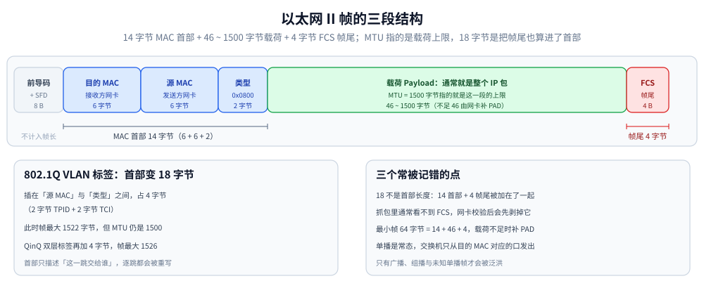

# 网络分层与数据包旅程

> 素材来源：博客 [网络通信简介](https://blog.csdn.net/weixin_43837229/article/details/100534094)（2019-11-10）—— 原文是对阮一峰《互联网协议入门》一文的整理。
>
> 五层模型各层解决什么问题、MAC 与 IP 两套地址为什么必须并存，以及**一个包从 HTTP 报文到以太网帧的完整封装过程**。
>
> ⭐ **本篇只讲「纵向」：分层模型 + 一个包在本机怎么被逐层造出来**。三个方向各有专篇，本篇不重复：
> - **网络层怎么寻址、怎么选下一跳**（IPv4/IPv6 地址与 CIDR、路由表与最长前缀匹配、ARP/NDP、ICMP、MTU/分片与 PMTUD）→ [IP与路由基础.md](IP与路由基础.md)；
> - **UDP 与数据报语义**（首部、校验和、消息边界、应用层要补哪些机制）→ [UDP与数据报传输.md](UDP与数据报传输.md)；
> - **「横向」的端到端链路**（跨过哪些节点、每一跳改了什么、NAT / LB / CDN、在哪儿观测）→ [网络通信链路详解.md](网络通信链路详解.md)。
>
> 各层的细节协议见对应专篇：[tcp/](tcp/)（传输层）、[HTTP与gRPC.md](HTTP与gRPC.md) 与 [HTTPS与TLS.md](HTTPS与TLS.md)（应用层与安全层）、[DNS解析.md](DNS解析.md)、[DHCP.md](DHCP.md)。

---

## 一、为什么要分层？

网络是用物理链路把孤立的工作站或主机连起来，组成数据链路，从而资源共享与通信。通信是信息交流与传递；网络通信则是通过网络连接孤立设备，通过信息交换实现人与人、人与计算机、计算机与计算机之间的通信。

网络通信中最重要的就是**协议**。互联网的实现分成好几层，每一层都有自己的功能，就像建筑物一样，**每一层都靠下一层支持**。用户接触到的只是最上面一层，根本没有感觉到下面的层——要理解互联网，必须从最下层开始自下而上理解。

| 层次 | 名称 | 解决什么 |
| --- | --- | --- |
| 1（最底） | **实体层**（物理层） | 把电脑连起来的物理手段，负责传送 0 和 1 的电信号 |
| 2 | **链接层**（数据链路层） | 确定 0 和 1 的**分组方式**（以太网帧、MAC 地址） |
| 3 | **网络层** | 引入一套**新地址**（IP），区分设备是否在同一子网，并负责逐跳转发 |
| 4 | **传输层** | 建立**端口到端口**的通信（UDP / TCP） |
| 5（最上） | **应用层** | 规定**应用程序的数据格式**（HTTP / DNS / SMTP…） |

⭐ 越下面的层越靠近硬件，越上面的层越靠近用户。**分层最大的好处是「上层的变动完全不涉及下层结构」**——这句话在第七节会看到一个具体的例子。

> 分法有七层（OSI）、五层、四层多种，把互联网分成**五层**最容易解释。
> 
> ⚠️ 分层是**概念模型**，不是实现清单：TLS 就夹在应用层与传输层之间（常被称作「安全层」或「表示层残留」），实际代码里它由应用层库实现。

每一层都会定义很多协议，**这些协议的总称就叫「互联网协议」**（Internet Protocol Suite）。本篇讲的是它们拼在一起的整体结构，单个协议的细节见各专篇。

> **局域网协议的历史**：早期局域网里最常用的三套协议是微软的 **NETBEUI**、Novell 的 **IPX/SPX** 与 **TCP/IP**，最后只有 TCP/IP 活了下来——因为它是**可路由、可扩展**的那一套。所以今天说「学网络」，基本等于「学 TCP/IP 协议栈」。

---

## 二、实体层：只负责传 0 和 1

电脑组网的第一件事是先把电脑连起来：光缆、电缆、双绞线、无线电波等。

**实体层就是把电脑连接起来的物理手段**，它规定了网络的一些电气特性，作用是**负责传送 0 和 1 的电信号**。

单纯的 0 和 1 没有任何意义——必须规定解读方式：多少个电信号算一组？每个信号位有何意义？这就是下一层要解决的问题。

---

## 三、链接层：0 和 1 怎么分组

链接层在实体层之上，**确定 0 和 1 的分组方式**。

### 3.1 以太网帧：首部 + 载荷 + 帧尾

早期每家公司都有自己的分组方式，逐渐地**以太网（Ethernet）**协议占据主导。以太网规定一组电信号构成一个数据包，叫做**帧（Frame）**，每帧分成三段：

| 部分 | 内容 | 长度 |
| --- | --- | --- |
| **MAC 首部** | 目的 MAC(6) + 源 MAC(6) + 类型/长度(2) | **14 字节**（无 VLAN 标签时） |
| **载荷**（Payload） | 上层交下来的数据，通常是整个 IP 包 | **46 ~ 1500 字节** |
| **FCS / 帧尾** | 32 位 CRC 校验（Frame Check Sequence） | **4 字节** |

⭐ **三个最容易记错的点**：

1. **别把 FCS 混进「标头」**：常说的「以太网标头 18 字节」是把 14 字节首部和 4 字节 FCS 加在一起了。首部与帧尾是**帧的两端**，且**抓包时 FCS 通常看不到**——网卡与驱动会在把帧交给协议栈前先校验并剥掉它（Wireshark 只在特定抓包方式下才显示）。
2. **MTU 说的是「载荷上限」**：以太网的 **MTU = 1500 字节**指的是载荷上限，不是帧长上限。所以「帧最大 1518 字节」= 14 + 1500 + 4（不含前导码），「帧最小 64 字节」= 14 + 46 + 4（载荷不足 46 时由网卡补 PAD）。
3. **VLAN 标签会增加首部长度**：插了 802.1Q 标签后，首部变成 18 字节（多了 4 字节 TPID + TCI），此时帧最大 1522 字节；但 **MTU 仍然是 1500**，可传的载荷没变多。QinQ（双层标签）再加 4 字节。



怎么读这张图：**帧的首部和帧尾分居两端**，中间是可变的载荷。绿色那一段就是 **MTU 说的那 1500 字节上限**——上限说的是载荷，不是整帧；红色那段 FCS 只做 CRC 校验，**抓包里通常看不到它**（网卡校验后会先剥掉）。左侧 8 字节前导码与 SFD 属于物理层成帧，**不计入帧长**，所以「帧最小 64 字节」= 14 + 46 + 4。

### 3.2 MAC 地址

首部里的发送者与接收者如何标识？以太网规定连入网络的所有设备都必须有**网卡**接口，数据包必须从一块网卡传到另一块网卡——**网卡的地址就叫 MAC 地址**。

- MAC 地址长 **48 位**，通常写成 **12 个十六进制数**（如 `42:03:d3:78:7c:51`）；
- 高 **24 位**是 **OUI**（厂商编号），低 24 位是该厂商分配的设备流水号。

⚠️ **「全世界独一无二」要加限定条件**：**由 IEEE 按 OUI 规则分配的全球管理地址**通常唯一；但设备完全可以使用**本地管理地址**（首字节的 U/L 位——倒数第二位——置 1，如虚拟机、容器、网桥虚拟接口）或**随机化地址**（手机的 Wi-Fi 隐私功能会按网络生成并轮换 MAC）。所以「靠 MAC 唯一标识一台设备」在今天的终端侧并不成立。

### 3.3 单播、组播与广播

有了地址还不够，还得解决两个问题：

1. **怎么知道对方的 MAC 地址？** → 由 **ARP**（IPv4）/ **NDP**（IPv6）解决，机制见 [IP与路由基础.md](IP与路由基础.md)；
2. **帧怎么送到接收方？** → 以太网有**三种投递方式**。

| 投递方式 | 目的 MAC | 谁收下 | 常见用途 |
| --- | --- | --- | --- |
| **单播**（unicast） | 某个具体网卡 | 只有那块网卡 | ⭐ **常态**：绝大多数数据都是单播 |
| **广播**（broadcast） | `FF:FF:FF:FF:FF:FF` | **本广播域内所有**设备都收 | ARP 请求、DHCP Discover、路由器通告之外的老协议 |
| **组播**（multicast） | `01:00:5e:…`（IPv4）/ `33:33:…`（IPv6） | 加入该组的主机 | IPv6 的 NDP、路由协议、视频分发 |

⭐ **交换机不是「向所有口转发」**：它维护一张 **MAC 地址表**（学习源 MAC ↔ 端口），单播帧只从目的 MAC 对应的那个端口发出去。只有**广播帧、组播帧、以及目的 MAC 未知的单播帧**才会被**泛洪**（flooding）到其余端口。所以「以太网向本网络内所有计算机发送」只描述了广播这一种情形，不能当成本层的一般投递机制。

有了帧结构、MAC 地址与这三种投递方式，「链接层」就能在同一链路范围内传送数据了。

---

## 四、网络层：为什么还要一套 IP 地址

### 4.1 网络层的由来

理论上只靠 MAC 地址，上海的网卡也能找到洛杉矶的网卡。但以太网的**广播局限在发送者所在的广播域**——两台计算机不在同一个子网时广播传不过去（这个设计是合理的，否则互联网上每台机器都会收到所有包，那是灾难）。而 **MAC 地址是扁平的**——它只与厂商有关，与设备所处网络无关，**无法用来聚合出「哪些地址在同一个网络」**。

**这就导致了网络层的诞生**：它引进一套新的地址（IP 地址），用来区分不同计算机是否属于同一个子网络，并让路由器可以按**网络前缀**而不是按单台主机来选路。

### 4.2 两套地址的分工

于是每台计算机有了两种地址，且**两者之间没有任何联系**：

| 地址 | 谁分配 | 作用 | 作用范围 |
| --- | --- | --- | --- |
| MAC | 网卡出厂 / 系统生成 | 把帧送到**同一链路内的下一跳网卡** | 逐跳，每跳都换 |
| IP | 管理员 / DHCP / 自动配置 | 标识设备**在哪个网络**，是端到端的最终目标 | 端到端，正常转发时不改 |

⭐ 因此逻辑上是**先处理网络地址（决定往哪儿送），再处理 MAC 地址（这一跳交给谁）**。

> **IP 地址怎么分段、怎么判断同子网、路由表怎么选下一跳、ARP/NDP 怎么把 IP 映射成 MAC、MTU 与分片怎么发生** —— 全部在 [IP与路由基础.md](IP与路由基础.md)。本节只保留「为什么需要这一层」。

### 4.3 IP 的服务模型：尽力而为

网络层提供的是一套**尽力而为**（best-effort）的服务：它**不保证**送达、不保证顺序、不保证不重复，也没有内建的拥塞与流量控制；报文可能是重复的。可靠性要么由上层（TCP）提供，要么由应用自己承担（这正是 [UDP与数据报传输.md](UDP与数据报传输.md) 要讲的部分）。

---

## 五、传输层：从「主机到主机」到「端口到端口」

有了 MAC 和 IP，已经能在任意两台主机间通信。但同一台主机上有许多程序都要用网络（一边浏览网页一边聊天），**数据包来了怎么知道该给哪个程序？** 这就需要**端口（port）**。

- 端口是 **16 位无符号整数**，范围 **0 ~ 65535**；
- **0 ~ 1023 常称「知名端口」**（well-known ports），约定分配给系统级服务（80、443、53 等）；**用户程序能否绑定低端口取决于操作系统权限与配置**（Linux 上需要 `CAP_NET_BIND_SERVICE` 或 root，且可通过 `net.ipv4.ip_unprivileged_port_start` 放宽），并非协议硬限制；
- 客户端发起连接时用的**临时端口**（ephemeral port）由内核从一个可配置范围里分配（Linux：`net.ipv4.ip_local_port_range`，默认 32768~60999）。

**传输层的功能就是建立「端口到端口」的通信**，相比之下网络层建立的是「主机到主机」的通信。确定主机 + 端口就能实现程序之间的交流，所以 Unix 把「主机 + 端口」叫做**套接字（socket）**。

| 协议 | 服务模型 | 特点 |
| --- | --- | --- |
| **UDP** | **数据报**（保留消息边界） | 首部只有 8 字节；**不保证**送达、顺序、去重、流控、拥塞控制；「没有保证」不等于「必然丢包」。详见 [UDP与数据报传输.md](UDP与数据报传输.md) |
| **TCP** | **字节流**（无边界） | 通过**序号、累计确认、超时重传、窗口**共同提供**有序、可靠**的字节流。⚠️ 不是「每发一个包都要求一对一确认」，也**不能保证**应用一定收到或处理，更不能保证网络不失败 |

两者的数据包都**内嵌在 IP 数据包的「载荷」部分**。TCP 段的大小按 **MSS**（约 MTU − 40）切成一段段，避免在 IP 层被分片。

> TCP 的握手、窗口、拥塞控制等细节见 [tcp/](tcp/) 五篇；TCP 与 UDP 的选择见 [通信选型.md](通信选型.md)。

---

## 六、应用层：规定数据格式

应用程序收到传输层的数据后要进行解读。互联网是开放架构，数据来源五花八门，**必须事先规定好格式**——这就是应用层的作用。

例如 TCP 可以为 Email、WWW、FTP 等各种程序传递数据，那就必须有不同协议规定各自的格式，这些应用协议构成了「应用层」。它是最高一层，**直接面对用户**，数据最终放在 TCP 段的「载荷」部分。

> HTTP / gRPC / WebSocket / SSE 的对比见 [HTTP与gRPC.md](HTTP与gRPC.md) 与 [通信选型.md](通信选型.md)；HTTPS 在 HTTP 与 TCP 之间多插了一层 TLS，见第七节与 [HTTPS与TLS.md](HTTPS与TLS.md)。

---

## 七、把五层串起来：一个包是怎么被造出来的 ⭐

这一节把各层串成一个可追踪的过程，**视角只放在「一个包在本机是怎么被造出来的」**：逐层加首部、算字节、撞上 MTU 就被切分或分片。假定参数已设置好（示例地址取自 RFC 5737 的文档专用段，仅用于演示）：

```text
本机 IP     : 192.0.2.10        （192.0.2.0/24 为文档示例段）
子网掩码    : 255.255.255.0
网关 IP     : 192.0.2.1
DNS 服务器  : 203.0.113.53      （203.0.113.0/24 同为文档示例段）
目标站点    : https://example.com
目标 IP     : 192.0.2.80        （下文统一用这个示意地址；真实解析结果随时变化）
```

下表 1~7 步都是**本机内部的封装动作**（一次网络往返都没有），8 步之后才离开本机——
**那一段怎么走、在哪儿被改写、怎么回来**，见 [网络通信链路详解.md](网络通信链路详解.md) 第二节。

| 步骤 | 层 | 做了什么 |
| --- | --- | --- |
| **1. DNS** | 应用层 | 只知道域名不知道 IP，于是向 DNS 服务器（`203.0.113.53:53`，通常走 UDP）发查询，拿到目标 IP |
| **2. 子网判断** | 网络层 | 本机 IP 与掩码 AND 得 `192.0.2.0`；目标 IP 与掩码 AND 得 `192.0.2.0`——⚠️ 本例演示的是**同网段**情形（若目标在别的网段，则必须经网关转发，**目的 MAC 将是网关的 MAC**） |
| **3. 构造 HTTP 请求** | 应用层 | 组装请求行与请求头：`GET / HTTP/1.1`、`Host: example.com`、`User-Agent: …`，假定共 480 字节 |
| **4. ⭐ TLS 记录层封装** | 安全层（TLS） | **HTTP 报文先交给 TLS**：TLS 把它切成记录、加上记录头、用协商好的密钥**加密并认证**。输出是一段**密文**，长度比入参略大（记录头 + AEAD 认证标签约 20~40 字节）。**HTTPS 的封装顺序是 HTTP → TLS → TCP，不是 HTTP 直接进 TCP** |
| **5. 传输层封装** | 传输层 | 给密文加 TCP 首部（20 字节），填双方端口（目标 **443**，本机随机临时端口）→ 这一段就是 **TCP 段** |
| **6. 网络层封装** | 网络层 | 加 IP 首部（IPv4 20 字节），填双方 IP 与协议号 6(TCP)、TTL → 这一个就是 **IP 包** |
| **7. 链路层封装** | 链路层 | 加以太网首部（14 字节）与 FCS（4 字节），**目的 MAC 是下一跳的网卡**：同网段时是对端主机，跨网段时是**网关** → 这一个就是**帧** |
| **8. 出网卡** | 实体层 | 转成电信号 / 光信号 / 无线电波，以比特流发出去 |
| **9. 之后的旅程** | 全栈 | 经交换机 → 路由器逐跳转发（每跳重写 MAC），到达服务端后**自下而上逐层剥首部**：TCP 段拼回字节流 → TLS 解密验签 → HTTP 报文，然后生成响应按同样过程发回来 |

⭐ **这张表把三个问题一次讲清**（不用记数字，记这三条）：

1. **为什么需要两套地址**：IP 决定「往哪个网络 / 哪台主机送」，MAC 决定「这一跳交给谁」——**跨网段时目的 MAC 填的是网关而不是最终主机**；
2. **为什么会有切分与分片**：TCP 按 **MSS** 主动把字节流切成段；如果 IP 包仍然超过路径 MTU，**IPv4 可以在源端或中间路由器分片**（`DF=1` 时不允许，改为回 `ICMP Fragmentation Needed` 让发送方调小），**IPv6 路由器一律不分片、只源端分片**；
3. **分层怎么生效**：HTTP 只管文本格式，TLS 只管加密与完整性，TCP 只管可靠传输，IP 只管寻址与转发，以太网只管把帧送到下一跳，**谁都不知道对方内部细节**。

> ⚠️ **两个常见错误模型，别写进答案里**：
> - **「超过 1500 字节的 IP 包必须分成 4 个帧」**：TCP 早就按 MSS 把数据切好了，正常情况下**根本走不到 IP 分片**；只有应用直接用了 UDP（或 `DF=0` 的原始 IP 报文）才可能分片，而且 IPv4/IPv6 的条件不同。分片与 TCP 分段**不是一回事**：TCP 按**字节序号**在传输层切，IP 分片按**分片偏移量**在网络层切。
> - **「HTTP 请求直接被塞进 TCP 443」**：漏了 TLS 这一层（见上表第 4 步）。若讨论的是 HTTP/3，顺序则是 **HTTP/3 → QUIC（含 TLS 1.3）→ UDP → IP**。
>
> 机制细节（CIDR 判断、最长前缀匹配、ARP/NDP、ICMP、MTU/MSS/PMTUD 与黑洞排查）见 [IP与路由基础.md](IP与路由基础.md)。

---

## 八、小结：两种地址的分工

发送数据包需要知道两个地址：**对方的 MAC 地址**（或下一跳的 MAC）与**对方的 IP 地址**。

但 MAC 地址有局限：**如果两台电脑不在同一个子网，就无法知道对方的 MAC，必须通过网关转发**。所以**目标地址实际分两种情况**：

| 场景 | 链路层的目标地址 | 网络层的目标地址 |
| --- | --- | --- |
| 同一子网络 | 对方网卡的 MAC | 对方 IP |
| 非同一子网络 | **网关网卡的 MAC** | 对方 IP（端到端不变） |

⭐ 最好记的一句话：**IP 地址永远是最终目标，MAC 地址只描述「下一跳」。** 每经过一个网关，链路层首部（MAC）都被改写一次。

⚠️ **但「IP 首部端到端不变」只是近似说法**，实际每跳都会变的是：

- **TTL / Hop Limit**：每经过一个路由器减 1，减到 0 就丢弃并回 `ICMP Time Exceeded`；
- **IPv4 首部校验和**：因为 TTL 变了，必须逐跳重算；
- **IP 地址**：普通转发不改，但 **NAT、隧道封装、负载均衡 DNAT** 都会改写。

> 逐跳到底改了哪些字段、在哪儿能观测到，见 [网络通信链路详解.md](网络通信链路详解.md) 第三节。

另外，「静态 IP」与「动态 IP」的区别在于**四个参数怎么来**：

```text
* 本机的 IP 地址
* 子网掩码
* 网关的 IP 地址
* DNS 的 IP 地址
```

手动填这四项叫静态 IP；由 **DHCP 协议**自动分配叫动态 IP——新加入的机器既不知道自己的 IP、也不知道 DHCP 服务器地址，只能发**广播**求助（二层目的 MAC 填 `FF:FF:FF:FF:FF:FF`、源 IP `0.0.0.0`、目的 IP `255.255.255.255`、UDP 68→67）。⚠️ **不是「DORA 四个阶段全广播」**：Discover 与选择阶段的 Request 常用广播，Offer/ACK 的单播或广播取决于客户端状态与广播标志，续租 T1 通常单播、T2 才广播——准确口径见 [DHCP.md](DHCP.md)。

**跨子网时到底经过什么**——1 号电脑要把包发给 4 号电脑，判断后**发现不在同一个子网络**，于是把包发给**网关 A**（所以链路层的目标 MAC 填的是网关 A 的）；网关 A 查路由表发现 4 号位于子网络 B，转发给**网关 B**；网关 B 再送到 4 号。

⭐ **每一跳都只改写链路层首部（MAC）与 TTL**，IP 地址端到端不变（除非有 NAT）—— 这就是上面「MAC 只描述下一跳、IP 才是最终目标」那句话的完整过程。

---

## 使用：把封装与路径在本机量出来

上面 9 步在真实环境里都有对应的观测手段。⚠️ **以下命令为 Linux / macOS 侧**（本机为 Windows，未实测；Windows 下对应 `nslookup` / `tracert` / `Get-NetRoute`）。

⭐ **本篇的使用段只做「验证封装与路径」**（掩码判断、ARP 表、帧结构、MTU）；**端到端排查的 Windows 本机实测**
（真实四元组 / `ss` 与 `netstat` / conntrack / 抓包点）见 [网络通信链路详解.md](网络通信链路详解.md) 的「使用」段，
路由与 ICMP 的完整排查见 [IP与路由基础.md](IP与路由基础.md)。

```bash
# 1) 本机四参数：IP / 掩码 / 网关
ip -4 addr show && ip route show          # 等价老命令：ifconfig / route -n

# 2) DNS 解析（对应上表第 1 步）
dig example.com +short                    # 只输出解析结果
dig example.com +trace                    # 从根开始逐级查询，看 DNS 分层

# 3) 判断目标是否同子网（对应第 2 步）
ip route get 192.0.2.80                   # 输出里带「via <网关>」说明走网关而非直连

# 4) 看邻居表：即「下一跳的 MAC 是谁」（对应第 7 步）
ip neigh show                             # 同网段目标直接出现；跨网段出现的是网关的 MAC

# 5) 观察实际的帧与 MTU（对应第 7 步）
sudo tcpdump -i eth0 -nn -e 'host 192.0.2.80' -c 5   # -e 打印以太网首部（源/目的 MAC 与类型）

# 6) 逐跳看路径（对应第 9 步）
traceroute -n 192.0.2.80                  # 每一跳就是一个网关

# 7) 查路径 MTU，确认是否会发生 IP 分片
ping -M do -s 1472 192.0.2.80             # 1472 + 20(IP) + 8(ICMP) = 1500，成功即 MTU 1500 可用
```

⭐ 这套命令的价值在于：**每一条都对应上表里的某一步**，把「分层」从一个抽象概念变成可以验证的对象。例如第 4 步 `ip neigh show` 能看到跨子网时表里是网关的 MAC ——这正是第八节那张分工表的实证。

---

## 延伸追问

- **为什么既需要 IP 又需要 MAC？只用一个不行吗？** → 两者解决的问题不同：**IP 负责「在哪个网络、哪台主机」并可跨网络路由**（可聚合、可分层），**MAC 负责「这一跳交给哪块网卡」**（扁平、不可路由）。只靠 MAC 就得靠广播找遍全球；只靠 IP 则链路层无法封装帧。⚠️ 关键细节：**跨子网时目的 MAC 是网关的 MAC，不是最终主机的**。
- **以太网帧的「18 字节标头」对吗？** → 不准确。完整的以太网 II 帧是 **14 字节首部 + 46~1500 字节载荷 + 4 字节 FCS**；18 = 14 + 4 是把帧尾也算进了首部。且 **FCS 在抓包里通常看不到**（网卡校验后剥掉），插了 802.1Q VLAN 标签时首部还要再加 4 字节。
- **子网掩码有什么用？** → 用来从 IP 地址里区分「网络前缀」和「主机位」，从而判断两台主机是否在同一子网（分别与掩码做 AND 运算比较结果）。它决定了「同一链路直发」还是「交给网关路由」。详见 [IP与路由基础.md](IP与路由基础.md)。
- **一个 IP 包超出 MTU 会怎样？** → 分情况：**TCP 会按 MSS 预先切段**，正常不会走到 IP 分片；真正的 IP 分片只发生在**应用直接使用 UDP、或发送 `DF=0` 的 IP 报文**时。IPv4 允许源端与中间路由器分片（`DF=1` 则回 `ICMP Fragmentation Needed`），**IPv6 路由器一律不分片**。⚠️ 分片会显著降低效率（丢一片要重传整包），所以现代网络用 **PMTUD** 尽量避免。
- **TCP 的分段和 IP 的分片是一回事吗？** → 不是。TCP 分段按**字节序号**在传输层完成，是端到端行为；IP 分片按**分片偏移量**在网络层完成，是逐跳行为。TCP 会尽量按 MSS 分段以避免 IP 分片。
- **ARP（或 NDP）是怎么工作的？有什么安全问题？** → ARP 请求以广播发出（目标 MAC 填 `FF:FF:FF:FF:FF:FF`，内含要查询的 IP），同链路主机比对 IP 后单播回复自己的 MAC；IPv6 用 **NDP** 的邻居请求/通告完成同一件事（走组播而非广播）。⚠️ ARP **无任何认证**，攻击者可伪造应答冒充网关做中间人（ARP 欺骗），防御靠静态绑定、DHCP Snooping 与动态 ARP 检测（DAI）。机制细节见 [IP与路由基础.md](IP与路由基础.md)。
- **分层的好处是什么？举一个例子。** → 每层只依赖下一层提供的接口，**上层的变化不影响下层**。原文的例子很典型：IP 数据包要加 IP 地址，但**完全不用修改以太网规格**，只需把 IP 包放进以太网帧的「载荷」里。今天更贴近的例子是 **HTTPS**：TLS 插在 HTTP 与 TCP 之间，TCP 与 IP 层一行都不用改。
- **为什么说「下层不知道上层在干什么」？** → 以太网帧只认 MAC（不解析 IP 头），IP 只认地址与转发（不解析 TCP 端口），TCP 只管可靠传输（不理解 HTTP 语法）。**每层只处理自己那一段首部和载荷**，这正是协议可以自由演进的基础。
- **DHCP 为什么要广播？** → 新机器加入网络时既不知道自己的 IP、也不知道 DHCP 服务器地址，只能广播求助（MAC 填全 F、源 IP `0.0.0.0`、目的 IP `255.255.255.255`、UDP 68→67）。⚠️ 但「**整个 DORA 全是广播**」是过度简化：**续租（T1）通常是单播**，Offer/ACK 用单播还是广播要看客户端状态与广播标志——完整口径见 [DHCP.md](DHCP.md)。

---

## 关联

- [IP与路由基础.md](IP与路由基础.md) — 网络层细节：地址与 CIDR、路由表与最长前缀匹配、ARP/NDP、ICMP、MTU/分片与 PMTUD
- [UDP与数据报传输.md](UDP与数据报传输.md) — 传输层的另一半：数据报语义、首部与校验和、应用层要补什么
- [网络通信链路详解.md](网络通信链路详解.md) — ⭐ 「横向」总纲：13 步端到端旅程与逐跳改写
- [TCP三次握手.md](tcp/TCP三次握手.md) — 传输层的连接建立与半连接/全连接队列
- [TCP报文结构.md](tcp/TCP报文结构.md) — TCP 首部各字段（与 UDP 的 8 字节首部对照）
- [TCP滑动窗口.md](tcp/TCP滑动窗口.md) — 传输层的流量控制与吞吐上限
- [DNS解析.md](DNS解析.md) — 上表第 1 步：域名到 IP 的解析过程
- [DHCP.md](DHCP.md) — 四个网络参数是怎么自动拿到的
- [HTTPS与TLS.md](HTTPS与TLS.md) — 上表第 4 步那一层 TLS 的握手与证书
- [HTTP与gRPC.md](HTTP与gRPC.md) — 应用层的请求/响应格式与连接复用
- [通信选型.md](通信选型.md) — 协议层次的选型（HTTP/2、HTTP/3、gRPC、WebSocket、SSE）
- [网络与存储.md](../../06-工程实践/部署/docker/网络与存储.md) — 容器网络（veth / bridge / DNAT）是同一套分层的软件实现
- [素材清单.md](../../素材清单.md) — 本篇的博客原文登记

> 反向引用（本篇被下列文档引到）：[06-网络配置与nmcli.md](../linux/鸟哥基础学习篇/06-网络配置与nmcli.md)、[03-网络基础与规划.md](../linux/鸟哥服务器架设篇/03-网络基础与规划.md)、[04-防火墙与NAT.md](../linux/鸟哥服务器架设篇/04-防火墙与NAT.md)、[TCP拥塞控制算法.md](TCP拥塞控制算法.md)
