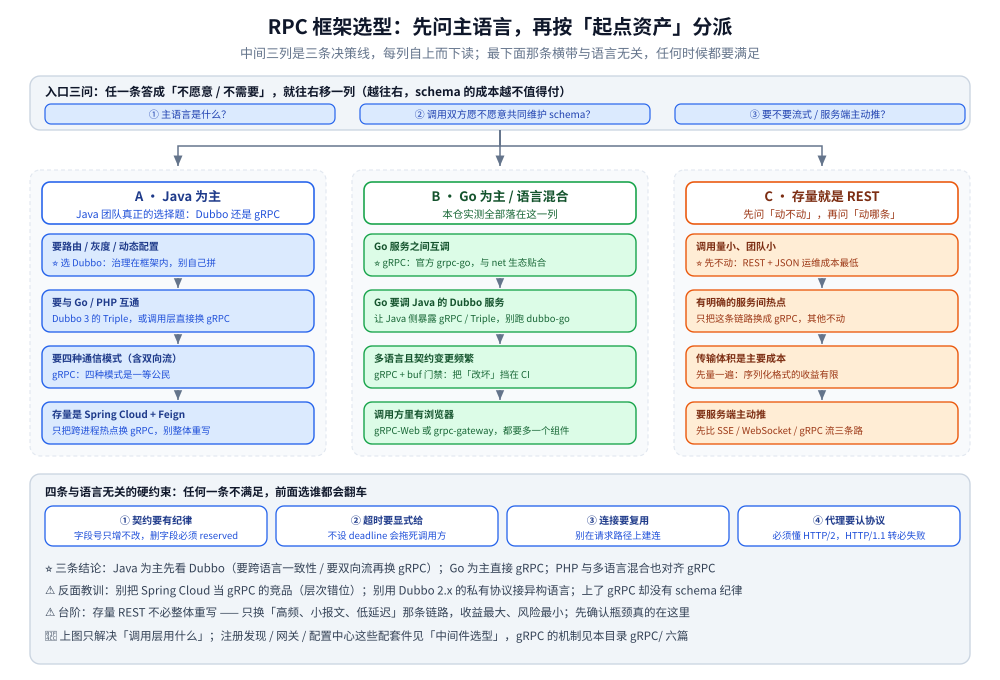

# RPC 框架选型对比

> RPC 与「用 HTTP 调接口」的分工、五类 RPC 框架（gRPC / Dubbo / Thrift / Spring Cloud / 云厂商与自研）的横向对照、「契合语言」维度，以及按主语言与起点资产分派的决策线。本目录其余篇目是各框架的深入篇。
>
> 内容整理自个人学习笔记。**本篇只做横向选型**：框架各占一节对照表，不展开任何单个框架的机制 —— gRPC 的机制见 [gRPC/](gRPC/) 六篇；应用层协议与序列化格式的横向选型见 [通信选型.md](../../../02-计算机基础/网络/通信选型.md) 与 [数据序列化.md](../../../02-计算机基础/网络/数据序列化.md)。素材见 [素材清单.md](../../../素材清单.md)。

---

## 一、RPC 和「用 HTTP 调接口」到底差在哪？

**本节要点**：这不是「谁更快」的问题，而是**调用端要不要持有一份契约**的问题。

「用 HTTP 调接口」通常指：`POST /api/orders` + JSON 体，调用方靠**文档**知道该传什么字段。
它的优点是**零构建**（curl 就能调、浏览器就能看、日志里就有人能读）；
代价是**契约只存在于文档里**——服务端改字段，调用方要等到线上报错才知道。

RPC 框架做的事，本质是把「契约」从文档搬进**编译期**：

| # | 维度 | HTTP + JSON（文档契约） | RPC 框架（IDL 契约） |
|---|---|---|---|
| ① | **契约形态** | 文档 / OpenAPI，人读为主 | `.proto` / `.thrift` / 接口定义，**机器可校验** |
| ② | **调用形态** | 手拼 URL、手解 JSON | **生成存根**，写起来像本地方法调用 |
| ③ | **出错时机** | 运行期（参数错了才报） | **编译期**（字段对不上直接编不过） |
| ④ | **附加能力** | 自己定约定（超时靠客户端库、重试靠手写） | deadline / metadata / 结构化状态码 / 拦截器**是框架的一部分** |
| ⑤ | **调用方向** | 请求-响应；服务端推要另找 WebSocket / SSE | ⭐ **四种通信模式是一等公民**（含双向流） |
| ⑥ | **跨语言成本** | 最低（JSON 到处都有） | 中（要装工具链、生成代码、提交生成物） |

⭐ **一句话判据**：**读端愿不愿意也持有一份 schema**。 
愿意 → RPC 框架的收益（编译期校验、四种模式、统一附加能力）能兑现； 
不愿意（第三方开发者、浏览器直连、结构运行时才知道）→ 老老实实 JSON。

## 二、五类 RPC 框架各自解决什么问题？

**本节要点**：先把「它们不在同一层」这件事说清，再谈谁替代谁。

| 框架 | 出身 / 协议底座 | 最擅长 | 明显短板 |
|---|---|---|---|
| **gRPC** | Google；HTTP/2 传输，IDL 用 Protobuf（**codec 可替换**，本仓实测过 JSON codec） | **跨语言一致性最好**；四种通信模式齐全；反射 / 健康检查 / 拦截器 / 网关转码生态完整 | 只提供**调用层**：注册发现、灰度、治理要靠外挂（K8s / Envoy / 服务网格） |
| **Apache Dubbo** | 阿里；2.x 是私有 TCP 协议 + Hessian2，3.x 引入 **Triple**（基于 HTTP/2、兼容 gRPC） | **服务治理能力最厚**（路由、灰度、动态配置、限流熔断、权重），且**与 Spring 生态原生贴合** | Java 侧最成熟；多语言 SDK 的成熟度与文档量低于 Java 侧 |
| **Apache Thrift** | Facebook；IDL + 可插拔传输与协议（TBinary / TCompact / TJSON） | IDL 设计灵活，**传输与协议可自由组合**（含非 HTTP 传输） | 治理、网关、可观测的周边生态薄弱；新项目采用度低 |
| **Spring Cloud** | 组件集（不是单个框架）；调用底座是 REST + `Feign` 声明式客户端 | 与 Spring Boot 一体化的**微服务全家桶**（发现、配置、网关、熔断、追踪） | ⚠️ **层次错位**：它管的是「微服务要的一整套东西」，不是「一种调用协议」 |
| **云厂商与自研** | 百度 brpc、字节 Kitex、腾讯 tRPC 等 | 与自家基础设施深度绑定，超大规模场景下的定制能力 | 出了自家生态就基本用不上；文档与社区远不如前两类 |

> ⚠️ **比较时的第一条纪律**：**Spring Cloud 不该和 gRPC / Dubbo 放在同一层比**。
> 前面两个是「调用框架」，Spring Cloud 是「组件集」——
> 它可以和 Dubbo 并存（Spring Cloud Alibaba 就是这种组合），也可以和 gRPC 并存。
> 真正该对比的是：**调用层用 gRPC 还是 Dubbo，还是就用 REST**。

## 三、横向对比：七个维度

**本节要点**：把「治理能力」拆成可问的问题，避免「都挺好」式的比较。

| 维度 | gRPC | Dubbo 3.x | Thrift | REST + Feign |
|---|---|---|---|---|
| **序列化** | Protobuf 默认，可换 codec | Hessian2（2.x）/ Protobuf（Triple） | 可插拔（二进制 / 紧凑 / JSON） | JSON 为主 |
| **传输** | HTTP/2（多路复用，一条连接跑多条流） | 私有 TCP（2.x）/ HTTP/2（Triple） | 可插拔（TCP / HTTP / 内存） | HTTP/1.1（Feign 默认）或 HTTP/2 |
| **通信模式** | 一元 + 服务端流 + 客户端流 + 双向流 | 一元为主，Triple 支持流 | 一元 + 部分流式 | 一元（请求-响应） |
| **服务治理** | ⚠️ 框架内只到拦截器 / LB；路由灰度要外挂 | ⭐ 路由、权重、灰度、动态配置、限流熔断都在框架内 | 基本没有 | 靠 Spring Cloud 组件拼 |
| **注册发现** | resolver（`dns:///` 默认；也可接 etcd / Consul / 自建） | 一等公民（Nacos / ZooKeeper / Consul） | 无（自己接） | Spring Cloud 组件提供 |
| **跨语言** | ⭐ 官方实现覆盖最广 | Java 最成熟，多语言 SDK 次之 | IDL 层面可跨语言 | 语言无关（本质是 HTTP+JSON） |
| **上手成本** | 中：要装工具链、提交生成物 | 低（Java 团队）：引依赖 + 注解即可 | 中 | 最低 |

⭐ **这张表怎么读**：**「治理能力」是 Dubbo 与 gRPC 最大的分野**——
gRPC 刻意只做「调用」这一层，把治理交给基础设施（Envoy / 服务网格 / K8s）；
Dubbo 把治理做进框架。所以问题不是「谁强」，而是
**你的团队有没有能力把治理那一层用基础设施补上**：
有 → gRPC 更干净；没有 → Dubbo 省事。

## 四、契合语言与团队栈？

**本节要点**：同一份能力清单落到不同语言上，客户端成熟度与生态工具差别极大 —— ⭐ **这条常常比技术对照表更早决定答案**。

| 语言 | gRPC | Dubbo | Thrift | 说明 |
|---|---|---|---|---|
| **Java** | 官方实现成熟；Netty 底座；与 Spring Boot 集成要走第三方 starter | ⭐ **主场**：Java 是 Dubbo 的第一等公民，治理能力、Spring 集成、资料量都在这一侧 | 有实现，但周边薄 | Java 团队真正的选择是 **Dubbo 还是 gRPC**，不是「要不要上 RPC」 |
| **Go** | ⭐ 官方 `grpc-go`，与 Go 的 `context` / `net` 生态贴合；本仓的实验就是 Go 侧做的 | 有 `dubbo-go`，⚠️ **主要价值是「与 Java 侧 Dubbo 互通」**，不是拿它做首选 | 社区实现可用，采用度低 | Go 团队默认 gRPC；只有「必须调 Java 的 Dubbo 服务」时才考虑 Dubbo-Go |
| **PHP** | 官方支持（`ext-grpc`），但**常驻连接与连接池的习惯要另学**，请求级模型与流式调用不匹配 | ⚠️ 基本不可用 | 有实现，采用度低 | PHP 侧的现实选择：**对外 JSON / 对内由网关转成 gRPC**，PHP 不直接当 RPC 客户端 |
| **多语言混合** | ⭐ **唯一不凑合的答案**：IDL 一份、各语言生成各语言的存根，契约不会漂 | 除非所有语言都退到 Triple / REST，否则互通要靠适配层 | IDL 可跨语言，但治理与工具链都要自己补 | 混合栈下「用 REST + JSON」也永远是合规答案，就看你愿不愿意为性能付 schema 的成本 |

⭐ **三条结论**：

1. **Java 为主的团队** —— 先看 Dubbo：治理能力开箱即用、与 Spring 一体、资料最多；
   只有当「跨语言一致性」或「四种通信模式」是硬需求时，才把调用层换成 gRPC（Triple 时代两者还能共存）。
2. **Go 为主的团队** —— 直接选 gRPC：`grpc-go` 是官方实现，本仓实测的四种模式、
   连接复用、拦截器、metadata、限额全部在 Go 侧跑通；Dubbo-Go 只在**必须与 Java 侧互通**时才有意义。
3. **PHP / 多语言混合团队** —— 也对齐 gRPC：跨语言契约一份就够，
   PHP 侧尽量只做「网关转码后的 JSON 调用方」，不要让它直接承担流式 RPC 客户端。

> ⚠️ **反面教训**：
> 
> ① **把 Spring Cloud 当成 gRPC 的竞品来选型** —— 层次错位，最后会把「组件集」和「调用协议」混成一锅；
> 
> ② **用 Dubbo 的私有协议去接异构语言** —— 2.x 的私有 TCP 协议没有对等的跨语言实现，
>    一旦有非 Java 调用方，就得退到 Triple 或 REST，等于把前面的选择推翻；
> 
> ③ **上了 gRPC 却没有 schema 纪律** —— 字段号被复用会**静默错乱**（不是报错），
>    详见 [Protobuf.md](gRPC/Protobuf.md) 的 `reserved` 一节；
> 
> ④ **把「注册中心」当成 gRPC 的必配件** —— K8s 里用 headless Service + 客户端负载均衡就够了，
>    再引一套注册中心是白多一个要运维、要观测的组件。

## 五、按「起点资产」的三条决策线

**本节要点**：选型不是从空白开始，第一步永远是**先问主语言**，再问「手里已经有什么」。

图怎么读：最上面那一排是**入口问题**（主语言是什么、调用双方愿不愿意共同维护 schema、要不要流式）；
中间三列是三条决策线（Java / Go 与多语言 / 存量 REST），每列里的小盒按顺序读；
最下面那条横带是**四条反复出现的硬约束**——它们和语言无关，任何时候都要满足。

### 5.1 决策线 A：Java 为主

| 状况 | 首选动作 |
|---|---|
| 服务全是 Java、要路由 / 灰度 / 动态配置 | ⭐ **Dubbo**：治理能力在框架内，别自己去拼 |
| 服务全是 Java，但要和 Go / PHP 互通 | **Dubbo 3 的 Triple**，或把调用层直接换成 gRPC |
| 要四种通信模式（尤其双向流） | **gRPC**：四种模式是一等公民，Dubbo 侧只有 Triple 才跟上 |
| 存量是 Spring Cloud + Feign | 先把**跨进程调用里的热点**挑出来单独换 gRPC，别整体重写 |

### 5.2 决策线 B：Go 为主，或语言混合

| 状况 | 首选动作 |
|---|---|
| Go 服务之间互调 | ⭐ **gRPC**：`grpc-go` + Protobuf，本仓实证全在 Go 侧 |
| Go 要调 Java 的 Dubbo 服务 | 优先让 Java 侧**暴露一份 gRPC / Triple 接口**，而不是在 Go 里跑 `dubbo-go` |
| 多语言且契约变更频繁 | gRPC + `buf` 兼容性门禁（见 [Protobuf.md](gRPC/Protobuf.md)），把「改坏 schema」挡在 CI |
| 调用方里有浏览器 | gRPC **不直连浏览器**：上 gRPC-Web 或 `grpc-gateway` 转 JSON，两者都要多一个组件 |

### 5.3 决策线 C：存量就是 REST，要不要动

| 状况 | 首选动作 |
|---|---|
| 调用量小、团队小 | ⭐ **先不动**：REST + JSON 的运维成本最低，性能瓶颈通常不在这里 |
| 有明确的服务间热点（高频、小报文、低延迟） | 只把这条链路换成 gRPC，其他不动 |
| 传输体积是主要成本（弱网 / 移动端 / 大报文） | 先量一遍：序列化格式的收益见 [数据序列化.md](../../../02-计算机基础/网络/数据序列化.md) |
| 要服务端主动推 | 先比 SSE / WebSocket / gRPC 流三条路，别默认上 gRPC（见 [HTTP与gRPC.md](../../../02-计算机基础/网络/HTTP与gRPC.md)） |

### 5.4 四条与语言无关的硬约束

1. **契约要有纪律**：字段号只增不改、删字段必须 `reserved`（[Protobuf.md](gRPC/Protobuf.md)）；
2. **超时要显式给**：不设 deadline 的调用在故障时会把调用方一起拖死（[基础概念.md](gRPC/基础概念.md)）；
3. **连接要复用**：RPC 的连接建立成本远高于一次调用，别在请求路径上建连（[生态与网关.md](gRPC/生态与网关.md)）；
4. **代理要认协议**：gRPC 后端前面必须放**懂 HTTP/2 的代理**，
   拿 HTTP/1.1 的 `proxy_pass` 去转是必然失败的（本仓实测，见 [生态与网关.md](gRPC/生态与网关.md)）。

## 使用：本目录怎么读

**本节要点**：本目录是「RPC 框架」的横向入口 + gRPC 的纵向深入，读法分两步。

**第一步（选型，就是本篇）**：先确定**调用层用什么**。
如果结论不是 gRPC，本篇到此为止，去对应框架的官方文档 —— 本仓暂时只把 gRPC 做深了。

**第二步（gRPC 的六篇，按顺序读）**：

| 顺序 | 篇目 | 读它解决什么 |
|---|---|---|
| ① | [README.md](gRPC/README.md) — gRPC 目录导读 | 六篇的分工与阅读顺序、与仓内其它篇目的边界 |
| ② | [基础概念.md](gRPC/基础概念.md) | gRPC 与 HTTP/2、Protobuf 的关系；一次调用在 wire 上长什么样；三件套与默认限额 |
| ③ | [四种通信模式.md](gRPC/四种通信模式.md) | 一元 / 服务端流 / 客户端流 / 双向流的写法、结束语义与踩坑 |
| ④ | [Protobuf.md](gRPC/Protobuf.md) | 逐字节编码、`reserved` 纪律、schema 演进兼容矩阵、`buf` 门禁 |
| ⑤ | [生态与网关.md](gRPC/生态与网关.md) | 注册发现、负载均衡、过网关、DNS 首连 8 秒的坑、拦截器与超时 |
| ⑥ | [实战示例.md](gRPC/实战示例.md) | 该不该上 gRPC、工程布局、上线前十条清单、Go / Java 分册索引 |

**语言分册**（接入代码不在这六篇里重复）：

- Go：[不使用protoc的gRPC.md](../../../01-编程语言/go/网络编程/不使用protoc的gRPC.md)、[从零实现网关.md](../../../01-编程语言/go/网络编程/从零实现网关.md)
- Java：[接入gRPC.md](../../../01-编程语言/java/接入gRPC.md)

**占位**：[Dubbo/README.md](Dubbo/README.md) — Dubbo 的三篇（协议 / 治理 / 接入）待补。

## 延伸追问

- **RPC 框架能解决「分布式事务」吗？** → 不能。它解决的是**调用**，事务要另找方案，
  见 [分布式事务.md](../../../04-架构与系统/分布式/理论/分布式事务.md)。
- **gRPC 一定比 REST 快吗？** → 不一定。报文大、连接冷、调用次数少时差距会被摊薄；
  它稳定的优势在**高频小报文 + 连接复用**，以及四种通信模式和编译期契约。
- **服务网格能替代 RPC 框架的治理能力吗？** → 网络层能补一部分（重试、熔断、mTLS、可观测），
  但**编译期契约与四种通信模式是进程内的能力**，网格给不了；两者是互补。
- **Dubbo 3 的 Triple 和 gRPC 是什么关系？** → 都跑在 HTTP/2 上、都支持 Protobuf，
  差别主要在**治理能力放在哪一层**（Dubbo 放框架内，gRPC 放基础设施）。
- **为什么本仓的 gRPC 实验用 JSON codec？** → 为了证明
  「**gRPC 不等于 Protobuf**」：换掉 codec 之后传输层、四种模式、metadata、状态码全都不变，
  见 [基础概念.md](gRPC/基础概念.md) 第六节。

## 关联

- [README.md](gRPC/README.md) — gRPC 六篇的目录导读（本目录的纵向深入入口）
- [README.md](Dubbo/README.md) — Dubbo 的占位导读
- [通信选型.md](../../../02-计算机基础/网络/通信选型.md) — 应用层协议与序列化格式的横向选型（同步 / 异步、HTTP/2 / gRPC / MQTT）
- [数据序列化.md](../../../02-计算机基础/网络/数据序列化.md) — JSON 与 Protobuf 的四维对比与选型
- [HTTP与gRPC.md](../../../02-计算机基础/网络/HTTP与gRPC.md) — HTTP/2 相对 HTTP/1.1 的五点改进（gRPC 的底座）
- [中间件选型.md](../中间件选型.md) — 上一层的**族与子类级**选型（要不要引 RPC 子类、与网关 / MQ 怎么分工）
- [Nacos.md](../注册与配置中心/Nacos.md) — 注册与配置中心的具体实现（Dubbo 与 gRPC 都可接）
- [网关选型对比.md](../网关与代理/网关选型对比.md) — gRPC 后端前面那一层代理怎么选
- [分布式与微服务.md](../../../04-架构与系统/分布式/分布式与微服务.md) — 微服务零件清单（RPC 只是其中一件）
- [接入gRPC.md](../../../01-编程语言/java/接入gRPC.md) — Java 侧接入分册
- [不使用protoc的gRPC.md](../../../01-编程语言/go/网络编程/不使用protoc的gRPC.md) — Go 侧实证（codec 与 `ServiceDesc`）
- [素材清单.md](../../../素材清单.md) — 素材来源登记
> 反向引用（本篇被下列文档引到）：[实战示例.md](gRPC/实战示例.md)
