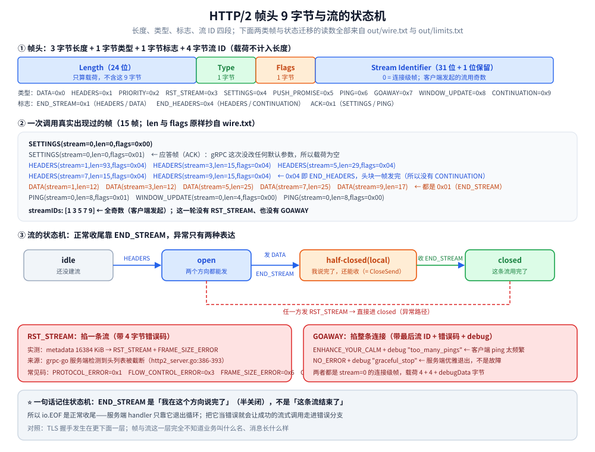
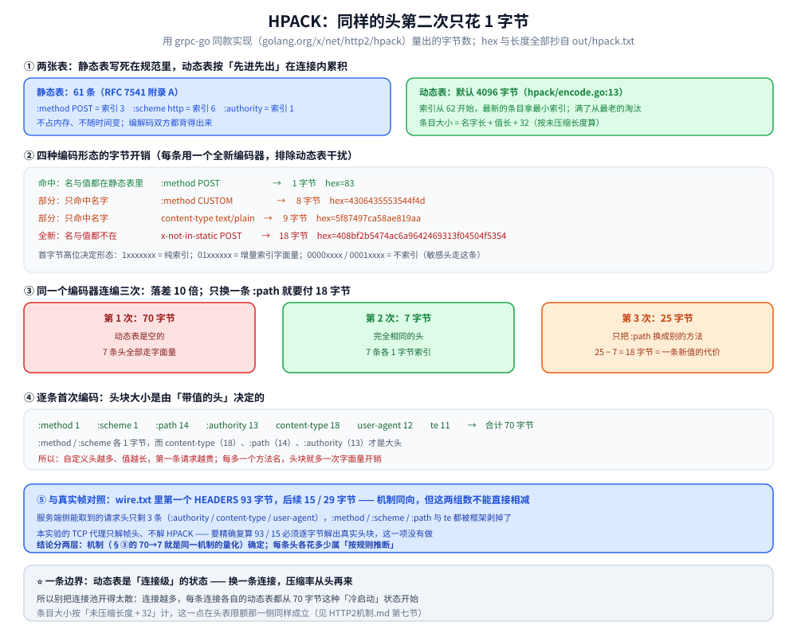

# gRPC HTTP/2 机制

> gRPC 的底座：帧头 9 字节逐字段、一次调用用到哪些帧、流 ID 与并发流、HPACK 静态表与动态表的索引编码、连接级与流级流控、流的五态状态机，以及「限额为什么有两层」。
>
> 内容整理自个人学习笔记，实测基于本机 Docker Desktop（容器 `golang:1.26-alpine` 内 go1.26.8 + grpc-go v1.84.0；HPACK 一节用 grpc-go 同款实现 `golang.org/x/net/http2/hpack`），原始输出见 `.workbuddy/tmp/exp/grpclab/out/` 的 `wire.txt` / `limits.txt` / `hpack.txt`。素材见 [素材清单](../../../../素材清单.md)。
>
> 本篇讲**机制**；「一次调用分几步、连接怎么复用、限额撞线报什么错」这些读数的第一遍交代在 [基础概念.md](基础概念.md)。HTTP/2 相对 HTTP/1.1 的完整差异（连接与并发模型、消息定界、HPACK、两级流控、队头阻塞的边界）在 [HTTP1.1与HTTP2的区别.md](../../../../02-计算机基础/网络/HTTP1.1与HTTP2的区别.md)。

---

## 一、为什么 gRPC 必须建在 HTTP/2 上？

**本节要点**：gRPC 需要的三件事——**一连接多并发**、**双向流**、**可结构化的结束语义**——正好是 HTTP/1.1 给不了、HTTP/2 有的；所以「传输层」是三层里唯一不能换的一层。

| gRPC 需要 | HTTP/1.1 | HTTP/2 |
|---|---|---|
| 一条连接上跑多个并发请求 | 靠开多条连接或复用串行（队头阻塞在应用层） | **流（stream）**：一条连接上多条独立流并行 |
| 服务端/客户端双向连续发 | 只能靠 chunked + 半双工 | 流本身双向，帧可以穿插 |
| 「正常结束」与「异常中断」要能分开表达 | 只有状态码 + 连接关闭 | `END_STREAM` 标志、`RST_STREAM`、`GOAWAY` 三种动作 |
| 结论性信息放在消息体之外 | 没有 trailer 的统一形态 | **trailer**（`grpc-status` / `grpc-message` 就放这里） |

这也是为什么第二节那条 15 帧的表里，业务语义（服务名、消息结构）一点都看不到——
**帧、流、标志位全是协议层的东西，业务是骑在它们上面的**。

---

## 二、帧头 9 字节长什么样？

**本节要点**：所有 HTTP/2 帧都长成「9 字节头 + 载荷」，头里是 **3 字节长度 + 1 字节类型 + 1 字节标志 + 4 字节流 ID**；一次一元调用只用到 5~7 种帧。



图怎么读：上半部分是**帧头 9 字节的逐字段拆解**（3 + 1 + 1 + 4），
下半部分左侧是**一次一元调用真实出现的 6 类帧**（`SETTINGS` / `HEADERS` / `DATA` / `PING` / `WINDOW_UPDATE` 以及收尾时的 `HEADERS` trailer），
右侧是流的状态机。⚠️ 图里帧类型后面的长度数字全部抄自 `out/wire.txt`，不是示意值。

### 2.1 帧头的四个字段

```text
 0                   1                   2                   3
 +-------------------------------+-------------------------------+
 |                       Length (24)                             |
 +---------------+---------------+-------------------------------+
 |   Type (8)    |   Flags (8)   |
 +-+-------------+---------------+-------------------------------+
 |R|                 Stream Identifier (31)                      |
 +=+=============================================================+
 |                          Payload (*)                          |
 +---------------------------------------------------------------+
```

- **长度（3 字节，大端）**：只算载荷，不含这 9 字节头；
- **类型（1 字节）**：`DATA=0x0` / `HEADERS=0x1` / `PRIORITY=0x2` / `RST_STREAM=0x3` / `SETTINGS=0x4` /
  `PUSH_PROMISE=0x5` / `PING=0x6` / `GOAWAY=0x7` / `WINDOW_UPDATE=0x8` / `CONTINUATION=0x9`；
- **标志（1 字节）**：常用的是 `END_STREAM=0x1`（HEADERS / DATA）、`END_HEADERS=0x4`（HEADERS / CONTINUATION）、
  `ACK=0x1`（SETTINGS / PING）；
- **流 ID（4 字节，最高位保留位 R）**：`0` 表示**连接级**帧，非 0 表示属于某条流。

本实验的代理就是按这个格式增量解析的：读满 9 字节算出长度，再读那么多载荷。这不是抓包工具的产物
（本机没有 `tcpdump` / `tshark`），是自写代理解出来的。

### 2.2 一次一元调用真实发过哪些帧

`out/wire.txt`（3 个并发一元 + 2 条并发服务端流，共 15 帧）：

```text
h2: prefaceMatches=true framesSeen=15
h2 frame: SETTINGS(stream=0,len=0,flags=0x00)
h2 frame: SETTINGS(stream=0,len=0,flags=0x01)
h2 frame: HEADERS(stream=1,len=93,flags=0x04)
h2 frame: HEADERS(stream=3,len=15,flags=0x04)
h2 frame: DATA(stream=1,len=12,flags=0x01)
h2 frame: DATA(stream=3,len=12,flags=0x01)
h2 frame: HEADERS(stream=5,len=29,flags=0x04)
h2 frame: DATA(stream=5,len=25,flags=0x01)
h2 frame: HEADERS(stream=7,len=15,flags=0x04)
h2 frame: DATA(stream=7,len=25,flags=0x01)
h2 frame: HEADERS(stream=9,len=15,flags=0x04)
h2 frame: DATA(stream=9,len=17,flags=0x01)
h2 frame: PING(stream=0,len=8,flags=0x01)
h2 frame: WINDOW_UPDATE(stream=0,len=4,flags=0x00)
h2 frame: PING(stream=0,len=8,flags=0x00)
```

逐类读：

| 帧 | 出现次数 | 这次承担什么 | 判据 |
|---|---|---|---|
| `SETTINGS` | 2（`0x00` + ACK `0x01`） | 连接建立后交换参数 | 成对出现，第二个带 `ACK` |
| `HEADERS` | 5（每个 `0x04`） | 建流：`flags=0x04` 是 **END_HEADERS**，表示头块一个帧就发完了 | 5 条流各一个 |
| `DATA` | 5（每个 `0x01`） | 消息体：`flags=0x01` 是 **END_STREAM**，对应客户端发完就 `CloseSend()` 的半关闭 | 5 条流各一个 |
| `PING` | 2 | 连接探测（`0x01` 是 ACK） | 本实验只记类型，未展开触发者 |
| `WINDOW_UPDATE` | 1（`stream=0`） | 连接级流控回补窗口 | `stream=0` → 连接级 |

三点值得盯住：

- **`SETTINGS` 的 `len=0`**：gRPC 这次没有要改任何默认参数，所以载荷为空——参数全走默认值；
- **`HEADERS` 一律带 `END_HEADERS`**：头块没有超过一帧（`MAX_FRAME_SIZE` 默认 16384 字节），
  所以没出现 `CONTINUATION` 帧；头块过大时才会被拆成 HEADERS + N × CONTINUATION；
- **`DATA` 一律带 `END_STREAM`**：客户端发完即半关闭。**没有 `RST_STREAM` 也没有 `GOAWAY`**——
  这一轮全是正常收尾，异常路径见第六节。

### 2.3 `DATA` 里装了什么

`DATA` 不是裸消息体，而是 gRPC 的 Length-Prefixed-Message：**1 字节压缩标志 + 4 字节大端长度 + 消息体**。
这条直接用帧长度就能对上（三个样本都正好多 5 字节），推导过程与表格在 [基础概念.md](基础概念.md) 第二节 2.3。

---

## 三、流、流 ID 与并发

**本节要点**：客户端发起的流用**奇数** ID；并发度涨了连接数不涨；`stream=0` 是连接级帧。

### 3.1 奇偶：谁发起谁定

```text
h2 streamIDs: [1 3 5 7 9]
```

5 条流全是**奇数**——HTTP/2 规定客户端发起的流用奇数 ID、服务端发起的用偶数（`PUSH_PROMISE`）。
本实验里没有服务端发起流，所以看不到偶数 ID。

### 3.2 并发与连接数的关系

```text
unary x200: ok=200 cost=13ms dialCalls=1 serverAcceptedConns=1
stream x3: serverStreams=3 serverAcceptedConns=1(+0) msgsIn=0 msgsOut=60 unaryCalls=200
```

200 个并发一元 + 3 条并发流：**只拨号 1 次、服务端只 accept 1 条 TCP**。
这组计数说明「并发度涨了，连接数不涨」——多路复用把并发从「连接」这一层搬到了「流」这一层。

### 3.3 为什么不用 `PRIORITY`

HTTP/2 有 `PRIORITY` 帧与依赖树，但 gRPC 规范**不使用 HTTP/2 的优先级机制**
（它在 gRPC 里被判定为复杂且各家实现不一致）；要排队就靠应用层自己的限流 / 并发上限。
所以你在 gRPC 的帧表里基本看不到 `PRIORITY`。

---

## 四、HPACK：同样的头第二次只花 15 字节

**本节要点**：HPACK 靠「静态表 61 条 + 动态表（默认 4096 字节）」把重复的头压成**索引**；实测同一份 7 条头连编两次是 **70 → 7 字节**，只换一条 `:path` 是 **25 字节**——每条新值都要重发一次字面量。



图怎么读：上半是**静态表命中**的三种形态（名值都命中 → 1 字节；只命中名 → 索引 + 字面量值；全不命中 → 全新名字面量），
下半是**动态表**的先进先出与索引编号（索引从 62 起、最新的在最前）。图里的字节数与十六进制全部抄自 `out/hpack.txt`。

### 4.1 静态表与动态表

- **静态表**：RFC 7541 附录 A 的 61 条固定条目，实现里是查表常量，**不占内存、不随时间变**；
  `:method: POST`、`:scheme: http`、`:authority`、`content-type` 这些名都在里面；
- **动态表**：默认 **4096 字节**（`golang.org/x/net/http2/hpack` 里 `initialHeaderTableSize = 4096`，
  见 `hpack/encode.go:13`），**先进先出**，最小的索引给最新的条目，索引从 62 开始。

### 4.2 四种编码形态的字节开销（实测）

`out/hpack.txt`（每条用一个全新编码器，排除动态表干扰）：

```text
   :method          POST         →  1 字节  hex=83
   :method          CUSTOM       →  8 字节  hex=4306435553544f4d
   content-type     text/plain   →  9 字节  hex=5f87497ca58ae819aa
   x-not-in-static  POST         → 18 字节  hex=408bf2b5474ac6a9642469313f04504f5354
```

四种形态一眼可辨：

| 形态 | 首字节高位的模式 | 这次的开销 | 说明 |
|---|---|---|---|
| 名与值都在静态表里 | `1xxxxxxx`（索引） | **1 字节** | `83` = 索引 3，即 `:method: POST` |
| 只命中名字 | `01xxxxxx`（增量索引字面量） | 8 / 9 字节 | 先发名字索引，再发一个字面量值 |
| 只命中名字、但不进动态表 | `0000xxxx` / `0001xxxx` | —— | 敏感头（如 `authorization`）用这一路 |
| 名与值全新 | `01xxxxxx` + 新名字 | **18 字节** | 名字也要完整字面量发一遍 |

### 4.3 同一个编码器连编三次（实测）

```text
第 1 次（动态表是空的，全部走字面量）: 70 字节
   hex=8386458c6242d275f01273b1c2a1d9eb418b089d5c0b8170dc6db0361f5f901d75d0620d263d4c4d6564ff7d107abf7a8a9acac8b4c7602bbcd2e040027465864d833505b11f
第 2 次（完全相同的头，应命中索引）  :  7 字节
   hex=8386c2c1c0bfbe
第 3 次（只把 :path 换成另一个方法）  : 25 字节（差额就是那条新值的字面量）
   hex=838645916242d275f01273b1b8b6772d9b9361474fc2c1c0bf
第 3 次 - 第 2 次 = 18 字节，正好是「换一条头值」的代价
```

逐条首次编码（合计 70 字节，就是第 1 次的量级来源）：

```text
   :method        1 字节
   :scheme        1 字节
   :path         14 字节
   :authority    13 字节
   content-type  18 字节
   user-agent    12 字节
   te            11 字节
   合计 70 字节
```

三条结论：

1. **落差是 10 倍**（70 → 7），不是「头变小了一点」。7 条全进动态表后每条只 1 字节；
2. **头块大小由「带值的头」决定**：`:method` / `:scheme` 各 1 字节，而 `content-type`（18）、`:path`（14）、
   `:authority`（13）才是大头——**自定义头越多、值越长，第一条请求越贵**；
3. **每出现一个新 `:path` 就要付一次 18 字节**：这就是「REST 风格路径多、gRPC 方法多」时头块压不下来的原因。

### 4.4 与真实帧的对照（口径要写清）

`wire.txt` 里第一个 `HEADERS` 是 **93 字节**，后续是 **15 / 29 字节**——机制与上面完全同向。
但要**精确复算**这两个数做不到，原因是：

- 服务端侧能取到的请求头只剩 3 条（`:authority` / `content-type` / `user-agent`），
  `:method` / `:scheme` / `:path` 与 `te` 都被框架剥掉了；
- 本实验的代理**只解帧头、不解 HPACK**，没有逐字节解出真实头块里哪一条走了哪种编码形态。

所以「93 → 15」这个落差的**机制**是确定的（§4.3 那份实测就是同一机制的量化），
但「具体哪 7 条头各花了多少」属于**未逐字节解码、按规则推断**——这两件事在正文里分开写。

---

## 五、流控在管什么？

**本节要点**：HTTP/2 有两级窗口——**连接级（`stream=0`）与流级**，初始都是 65535 字节，靠 `WINDOW_UPDATE` 回补；它的目的是「别让一个快的发送方把慢的接收方打爆」。

### 5.1 两级窗口

| 级别 | 谁管 | 初始窗口 | 帧里的表现 |
|---|---|---|---|
| 连接级 | 整条连接上所有流共享 | 65535 字节 | `WINDOW_UPDATE(stream=0, ...)` |
| 流级 | 单条流 | 65535 字节（可被 `SETTINGS_INITIAL_WINDOW_SIZE` 改） | `WINDOW_UPDATE(stream=N, ...)` |

实测里出现的是 `WINDOW_UPDATE(stream=0,len=4,flags=0x00)`：`stream=0` 就是**连接级**窗口回补，
`len=4` 是载荷长度（一个 4 字节的增量值）。

### 5.2 两条边界

- **流控不是限流**：它保护的是「接收方来得及处理」，不是「服务端每秒只收多少」；
  想限流得在应用层做（令牌桶、并发上限）；
- **窗口耗尽的症状是「卡住不报错」**：发送方一直在等 `WINDOW_UPDATE`，
  表现为吞吐掉到某个平台、加并发也不涨——而不是抛异常。

---

## 六、流的五态状态机与两种「掐断」

**本节要点**：一条流只有 5 个状态；正常收尾靠 `END_STREAM` 走完 `half-closed` → `closed`；**异常只有两种表达**——`RST_STREAM` 掐一条流，`GOAWAY` 掐整条连接。

### 6.1 五态

```text
                 +--------+
        send PP  |        | recv PP
       ,--------|  idle  |--------.
      /         |        |         \
     v          +--------+          v
+----------+          |           +----------+
|          |          | send H /  |          |
| reserved |          | recv H    | reserved |
| (local)  |          |           | (remote) |
+----------+          v           +----------+
     |            +--------+           |
     |            |        |           |
     |   recv ES  |  open  |  send ES  |
     |   ,--------|        |--------.  |
     |  /         |        |         \ |
     v v          +--------+          v v
+----------+          |           +----------+
|   half   |          |           |   half   |
|  closed  |          |           |  closed  |
| (local)  |          |           | (remote) |
+----------+          |           +----------+
     |                |  recv RST_STREAM / send RST_STREAM
     `----------------+----------------'
                      v
                 +--------+
                 | closed |
                 +--------+
```

gRPC 实际用到的只有三条路径：

1. **`idle` → `open`**：客户端发 `HEADERS`（不带 `END_STREAM`）就进入 `open`；
2. **`open` → `half-closed(local)` → `closed`**：客户端发完带 `END_STREAM` 的 `DATA`（`CloseSend`）就进
   `half-closed(local)`；服务端再回带 `END_STREAM` 的帧就进 `closed`。
   ⭐ **`END_STREAM` 是「半关闭」而不是「关闭」**——这正是 [四种通信模式.md](四种通信模式.md) 里 `io.EOF` 是正常收尾的协议根因；
3. **任何状态 → `closed`**：任一方发 `RST_STREAM`。

### 6.2 `RST_STREAM`：掐一条流

实测（`out/limits.txt` 最后一行）：

```text
metadata 16384 KiB: code=Internal msg="stream terminated by RST_STREAM with error code: FRAME_SIZE_ERROR"
```

`RST_STREAM` 的载荷里有 4 字节错误码。实测见到的 `FRAME_SIZE_ERROR` 来自 **grpc-go 服务端检测到头列表被截断**
（`internal/transport/http2_server.go:386-393`）：

```go
// frame.Truncated is set to true when framer detects that the current header
// list size hits MaxHeaderListSize limit.
if frame.Truncated {
	t.controlBuf.put(&cleanupStream{
		streamID: streamID,
		rst:      true,
		rstCode:  http2.ErrCodeFrameSize,
		onWrite:  func() {},
	})
	return nil
}
```

常见错误码：`PROTOCOL_ERROR=0x1`、`INTERNAL_ERROR=0x2`、`FLOW_CONTROL_ERROR=0x3`、`FRAME_SIZE_ERROR=0x6`、
`REFUSED_STREAM=0x7`、`CANCEL=0x8`、`ENHANCE_YOUR_CALM=0xb`。

### 6.3 `GOAWAY`：掐整条连接

`GOAWAY` 是**连接级**动作，载荷里带「最后处理的流 ID」+ 错误码 + 调试字符串。两个实测来源：

| 触发 | 错误码 | debug data | 出处 |
|---|---|---|---|
| 客户端 ping 太频繁被服务端判违规 | `ENHANCE_YOUR_CALM` | `too_many_pings` | [连接与生命周期.md](连接与生命周期.md) 第三节 |
| 服务端优雅退出 | `NO_ERROR` | `graceful_stop` | [连接与生命周期.md](连接与生命周期.md) 第四节 |

`GOAWAY` 与 `RST_STREAM` 的分工：前者告诉你「这条连接不要再用了」（在途流可能还能跑完），
后者只掐掉一条流、连接照常。

---

## 七、限额为什么有「两层」，报错为什么不一样？

**本节要点**：gRPC 的消息限额（默认 4 MiB）与 HTTP/2 的头表限额（默认 16 MiB）是**两个不同层面**的东西；后者的计量口径是**解压后的头列表大小**（每条另有 +32 字节开销），不是线头块字节数。

### 7.1 两层限额对照

| 层面 | 限额 | 默认值 | 撞线报什么 | 谁在检查 |
|---|---|---|---|---|
| gRPC 应用层 | 收到的**消息**大小 | 4 MiB（收方向） | `ResourceExhausted`（语义化，含「实际 vs 上限」） | grpc-go 自己 |
| HTTP/2 层 | 头列表大小 | 16 MiB | `RST_STREAM` + `FRAME_SIZE_ERROR` | HTTP/2 framer |

实测（`out/limits.txt`）：

```text
resp 5MiB / default client: code=ResourceExhausted msg="grpc: received message larger than max (5242913 vs. 4194304)"
req 5MiB / default server: code=ResourceExhausted msg="grpc: received message larger than max (5242899 vs. 4194304)"
metadata 1024 KiB: code=OK msg=""
metadata 15360 KiB: code=OK msg=""
metadata 16384 KiB: code=Internal msg="stream terminated by RST_STREAM with error code: FRAME_SIZE_ERROR"
```

**处置完全不同**：前者调限额（`MaxRecvMsgSize` / `MaxCallRecvMsgSize`），
后者要**减头部体积**（metadata 太多太大）；调消息限额对头表撞线一点用都没有。

### 7.2 头表限额的计量口径：**解压后**、每条 +32

HPACK 的条目大小按 RFC 7541 §4.1 算：**名字长度 + 值长度 + 32**，
而且明确要求**按未做 Huffman 压缩的长度算**（`hpack.HeaderField.Size()` 的注释原文）：

```go
// Size returns the size of an entry per RFC 7541 section 4.1.
func (hf HeaderField) Size() uint32 {
	// "The size of an entry is the sum of its name's
	// length in octets ..., its value's length in octets ..., plus 32."
	// "The size of an entry is calculated using the length of the name and
	//  value without any Huffman encoding applied."
```

这就解释了「为什么 16384 KiB 的 metadata 会撞到 16 MiB 的头表限额」：
**每一条 metadata 都要额外背 32 字节**，条数一多，累计开销就把总大小顶过 16 MiB；
而 15360 KiB 那一档连同开销还没到线，所以能过。判定点是可预测的，不是玄学。

⚠️ **本实验只观测到「1024 / 15360 能过、16384 撞线」这三点与源码口径**，
没有去二分找出精确的临界值；`16384 KiB` 恰好等于 16 MiB 默认值这件事**可能是巧合**，
也可能不是——不要把「正好等于」当成结论。

---

## 使用：自己看这些帧

**本节要点**：三条能自己复现的路子——自写 TCP 代理解帧头、Wireshark 直接看、以及 curl 的 `--http2-prior-knowledge` 对照。

### 1. 自写代理解帧头（本实验用的办法）

思路只有两步：把 `Accept` 到的连接转给上游，同时把读到的字节按「9 字节头 + 长度」增量解析：

```go
// 判 HTTP/2 明文前言：连接的前 24 字节
//   "PRI * HTTP/2.0\r\n\r\nSM\r\n\r\n"
preface := make([]byte, 24)

// 之后每个帧：读满 9 字节头，再按长度读载荷
hdr := make([]byte, 9)
n := int(hdr[0])<<16 | int(hdr[1])<<8 | int(hdr[2]) // 24 位大端长度
typ, flags := hdr[3], hdr[4]
streamID := uint32(hdr[5]&0x7f)<<24 | uint32(hdr[6])<<16 | uint32(hdr[7])<<8 | uint32(hdr[8])
payload := make([]byte, n)
```

⚠️ **只解帧头是安全的，不要把载荷当文本打出来**——`DATA` 里是二进制，
`HEADERS` 里是 HPACK 压缩块，直接打印会污染日志。

### 2. Wireshark 直接看

- 抓 `127.0.0.1` 回环要在 `lo` 上抓（Windows 上是 `Adapter for loopback traffic capture`）；
- 过滤器：`http2` 全部、`http2.type == 0x1` 只看 HEADERS、`http2.header.name == "grpc-status"` 只看状态；
- 明文 h2c 能直接解；**走 TLS 就必须先有密钥**（`SSLKEYLOGFILE`），否则只能看到加密字节。

### 3. 用 curl 做对照

`curl --http2-prior-knowledge -v http://127.0.0.1:50051/... ` 能看到 HTTP/2 的请求行与响应头；
但 gRPC 的请求体是 Length-Prefixed-Message，**curl 不做 gRPC 语义**，
所以它适合看「帧层面」而不适合调业务方法——调业务用 `grpcurl`（见 [生态与网关.md](生态与网关.md) 1.3 的反射）。

---

## 延伸追问

- **`END_STREAM` 和 `RST_STREAM` 有什么区别？** → 前者是「我在这个方向说完了」（半关闭，协议内的正常收尾），
  后者是「这条流作废」（异常，带错误码）。把两者混同就会把正常结束当失败（第六节）。
- **一条连接能并发多少条流？** → 上限由 `SETTINGS_MAX_CONCURRENT_STREAMS`（默认在 gRPC 里是很大一个值）决定，
  实测 200 个并发一元只用了 1 条 TCP（第三节）。
- **为什么 `stream=0` 的帧要单独存在？** → 有些参数属于整条连接而不是某条流：
  `SETTINGS`、连接级 `WINDOW_UPDATE`、`PING`、`GOAWAY` 都是 `stream=0`。
- **头块被拆成多帧时怎么认？** → `HEADERS` 不带 `END_HEADERS` 就说明后面跟 `CONTINUATION`，
  直到出现 `END_HEADERS`。实测这一轮头块都不到 16384 字节，所以没出现 `CONTINUATION`。
- **为什么 HPACK 的动态表是「先进先出」而不是 LRU？** → 它是流式的、单向的：索引编号必须两端一致，
  按插入顺序淘汰是最省状态的实现；代价是「很久不用的条目」也会占着位置（第四节的 4096 字节）。
- **头块压缩率会不会随时间下降？** → 会。每出现一个新 `:path` 就要重发一次字面量（实测 18 字节），
  所以「方法特别多」的服务端头块平均成本更高（第四节 4.3）。
- **流控耗尽为什么不容易发现？** → 因为它表现为「卡住」而不是「报错」；要观测得看吞吐平台与
  是否还有 `WINDOW_UPDATE` 在流动（第五节）。
- **`ResourceExhausted` 与 `FRAME_SIZE_ERROR` 是不是一回事？** → 不是。前者是 gRPC 应用层的消息限额，
  只失败这一条 RPC；后者是 HTTP/2 层的头表动作，属于传输层（第七节）。

---

## 关联

- [基础概念.md](基础概念.md) — 本篇的「读数版」：一次调用的四步时序、连接复用、限额撞线第一遍
- [HTTP1.1与HTTP2的区别.md](../../../../02-计算机基础/网络/HTTP1.1与HTTP2的区别.md) — **为什么要建在 HTTP/2 上**的那一层背景：1.1 与 2 的连接模型、定界、流控与队头阻塞差异
- [HTTP与gRPC.md](../../../../02-计算机基础/网络/HTTP与gRPC.md) — gRPC 与 HTTP 的关系、连接池与客户端实现（HTTP/1.1 与 HTTP/2 的机制已收归上面那篇）
- [四种通信模式.md](四种通信模式.md) — `END_STREAM` 在半关闭语义上落成了 `EOF` / `onCompleted`
- [连接与生命周期.md](连接与生命周期.md) — 状态机、`GOAWAY` 的两种实测来源、keepalive 与 ping 违规
- [拦截器与元数据.md](拦截器与元数据.md) — header 与 trailer 在协议上就是 HEADERS 帧的两条路
- [生态与网关.md](生态与网关.md) — 过网关为什么必须 `grpc_pass`：后端只会回 HTTP/2
- [Protobuf.md](Protobuf.md) — `DATA` 帧里那层载荷的编码规则
- [README.md](README.md) — 本目录的目录导读（gRPC 知识库总纲）
- [不使用protoc的gRPC.md](../../../../01-编程语言/go/网络编程/不使用protoc的gRPC.md) — 换 codec 换的只是 `DATA` 里那层，帧与流一层都不动
> 反向引用（本篇被下列文档引到）：[gRPC-Web与Connect.md](gRPC-Web与Connect.md)、[可观测性.md](可观测性.md)、[安全与认证.md](安全与认证.md)、[性能与调优.md](性能与调优.md)、[故障排查与调试.md](故障排查与调试.md)
