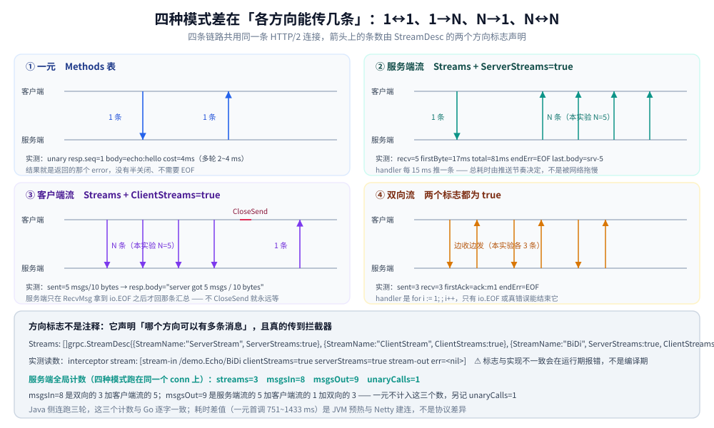
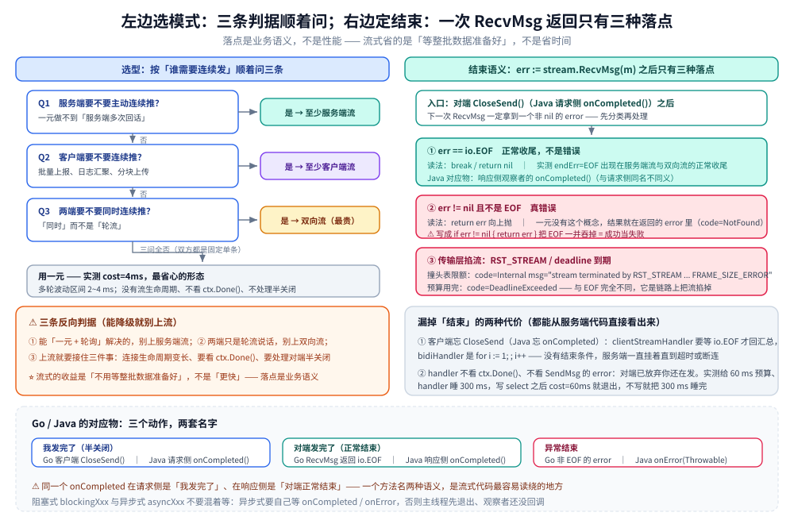

# gRPC 四种通信模式

> 一元、服务端流、客户端流、双向流四种模式的选型、服务端写法差异、结束语义，以及每种模式的首字节与总耗时实测（Go 与 Java 双端对照）。
>
> 内容整理自个人学习笔记，实测基于本机 Docker Desktop（容器 `golang:1.26-alpine` 内 go1.26.8 + grpc-go v1.84.0；容器 `eclipse-temurin:17-jdk` 内 java 17.0.20.1 + grpc-java 1.60.0），原始输出见 `.workbuddy/tmp/exp/grpclab/out/`。素材见 [素材清单](../../../../素材清单.md)。

---

## 一、四种通信模式怎么选？各自适合什么场景？

**本节要点**：四张模式表先说清「一次调用里各方向能传几条」，再用三条判据把它压成「服务端推不推、客户端推不推、要不要同时」。

### 1.1 四条链路长什么样

| 模式 | 客户端发 | 服务端回 | 典型场景 |
|---|---|---|---|
| 一元 | 1 条 | 1 条 | CRUD、鉴权、任何「发一个请求等一个结果」 |
| 服务端流 | 1 条 | N 条 | 结果集分页下发、订阅推送、大文件分块下发 |
| 客户端流 | N 条 | 1 条 | 批量上报、日志汇聚、大文件分块上传 |
| 双向流 | N 条 | N 条 | 实时对话、双向音视频信令、长会话 |

四条模式共用同一套协议机制（一条 HTTP/2 连接上的若干条流），差别只在**方向标志**与**谁可以连续发**（见第二节）。



图怎么读：四格各自的左右两条泳道是**客户端 / 服务端**，格内的箭头数就是上表「客户端发 / 服务端回」那两列的图形化；
每格最下面那行小字是本轮的**实测读数**（一元 `cost=4ms`、服务端流 `firstByte=17ms`、客户端流 `sent=5 msgs`、双向流 `recv=3`），
所以「N 条」不是想象，是能数出来的。底部横带给出的是 `StreamDesc` 的两个方向标志与拦截器那一轮的计数
（`streams=3 msgsIn=8 msgsOut=9 unaryCalls=1`）。

### 1.2 三条选型判据

按「谁需要连续发」顺着问，三条就够：

1. **服务端要不要主动连续推？** 要 → 至少是服务端流。一元做不到「服务端多次回话」；
2. **客户端要不要连续推？** 要 → 至少是客户端流。若两端都要，进入第 3 条；
3. **两端要不要同时连续推（而不是轮流）？** 要 → 双向流。双向流最灵活、也最贵（两端的收发都要做流式状态管理），能降级到「一元加轮询」或「服务端流」就不要上。

反过来也有判据：**只要一方是固定单条、另一方是固定单条，就别用流**——一元调用在实测里 `cost=4ms`（第四节），是最省心的形态。



图怎么读：左栏是那三条判据的**流程图形态**（按「服务端推不推 → 客户端推不推 → 要不要同时」三问依次往下走，每问一个落点），底部还给了三条「别用流」的反向判据；
右栏是第三节要看的东西——`RecvMsg` 返回后分三种落点：`io.EOF` 是正常收尾、非 EOF 才是真错误、
传输层的 `RST_STREAM` 是第三种。中间那条竖线上方写的是「两种最容易混淆的代价」：忘 `CloseSend`（对端一直等）与不看 `ctx.Done()`（自己一直等）。

### 1.3 不要为「看起来先进」而用流

流式带来的是并发与长连接的复杂度：连接生命周期变长、要看 `ctx.Done()`、要处理对端半关闭（第五节的五个坑全在这里）。选型的落点是**业务语义**，不是性能——流式的收益是「不用等整批数据准备好」，不是「更快」。

---

## 二、一元与三种流在服务端写法上差在哪？

**本节要点**：一元登记在 `Methods` 表、handler 是固定四参签名、靠 `dec` 收消息；三种流登记在 `Streams` 表、handler 只有一个 `grpc.ServerStream` 参数、靠 `RecvMsg` / `SendMsg` 干活。方向标志写在 `StreamDesc` 上。

### 2.1 `StreamDesc` 的方向标志

```go
Streams: []grpc.StreamDesc{
	{StreamName: "ServerStream", Handler: serverStreamHandler, ServerStreams: true},
	{StreamName: "ClientStream", Handler: clientStreamHandler, ClientStreams: true},
	{StreamName: "BiDi", Handler: bidiHandler, ServerStreams: true, ClientStreams: true},
}
```

两个标志声明这条流哪个方向可以有多条消息：`ServerStreams` 管服务端到客户端、`ClientStreams` 管客户端到服务端。`svc.go` 里两处注释都点了同一条：方向标志写错会在**运行期**报错，而不是编译期拦下来。

标志也真的传得到拦截器：本实验的流拦截器打印出的方向标志与上面声明一致（`out/base.txt`）：

```text
interceptor stream: [stream-in /demo.Echo/BiDi clientStreams=true serverStreams=true stream-out err=<nil>]
```

### 2.2 服务端四个 handler 的写法

一元用固定的四参签名，三个流式共用一个签名，差异一眼可见：

```go
// 一元：签名固定四参，最后一个参数是拦截器（要自己调用，见基础概念.md 第六节）
func unaryHandler(srv any, ctx context.Context, dec func(any) error, ic grpc.UnaryServerInterceptor) (any, error) {
	in := &Msg{}
	if err := dec(in); err != nil { // dec 内部就是 codec.Unmarshal
		return nil, err
	}
	return srv.(*Impl).Unary(ctx, in)
}

// 服务端流：收一个请求，然后循环 SendMsg 推 N 条
func serverStreamHandler(srv any, stream grpc.ServerStream) error {
	in := &Msg{}
	if err := stream.RecvMsg(in); err != nil {
		return err
	}
	for i := 1; i <= in.N; i++ {
		if err := stream.SendMsg(&Msg{Seq: i, Body: fmt.Sprintf("srv-%d", i)}); err != nil {
			return err
		}
	}
	return nil
}

// 客户端流：循环 RecvMsg 直到 io.EOF（对端 CloseSend），最后回一条汇总
func clientStreamHandler(srv any, stream grpc.ServerStream) error {
	got, bytes := 0, 0
	for {
		m := &Msg{}
		err := stream.RecvMsg(m)
		if err == io.EOF {
			break // 正常结束，不是错误
		}
		if err != nil {
			return err
		}
		got++
		bytes += len(m.Body)
	}
	return stream.SendMsg(&Msg{Seq: got, Body: fmt.Sprintf("server got %d msgs / %d bytes", got, bytes)})
}

// 双向流：边收边发，两个方向各自收口
func bidiHandler(srv any, stream grpc.ServerStream) error {
	for i := 1; ; i++ {
		m := &Msg{}
		err := stream.RecvMsg(m)
		if err == io.EOF {
			return nil
		}
		if err != nil {
			return err
		}
		if err := stream.SendMsg(&Msg{Seq: i, Body: "ack:" + m.Body}); err != nil {
			return err
		}
	}
}
```

### 2.3 一元与流式的五点差异

| 维度 | 一元 | 三种流 |
|---|---|---|
| 登记位置 | `ServiceDesc.Methods` | `ServiceDesc.Streams` |
| handler 签名 | `func(srv any, ctx, dec, ic) (any, error)` | `func(srv any, stream grpc.ServerStream) error` |
| 收消息 | `dec(&in)` 收唯一一条 | `stream.RecvMsg(&m)` 反复收 |
| 发消息 | 靠 `return any` 回一条 | `stream.SendMsg(&m)` 反复发 |
| 结果表达 | 返回的 `error` 就是这条 RPC 的状态 | handler 返回的 `error` 就是流的结束状态 |
| 拦截器 | **要 handler 自己调用** | 由框架包在 `stream` 上（`ChainStreamInterceptor`） |

---

## 三、流的结束语义：EOF / onCompleted / RST_STREAM 分别意味着什么？

**本节要点**：`io.EOF` 是**正常结束**，不是错误；一元用返回的 `error` 表达结果，流式用 `error == io.EOF` 表示对端已经半关闭；真正异常的是 `RST_STREAM` 这类传输层错误。

### 3.1 `io.EOF`：对端 CloseSend 了，这是正常收尾

客户端发完最后一条就 `CloseSend()`（半关闭），服务端的 `RecvMsg` 下一次就会返回 `io.EOF`：

```go
for {
	m := &Msg{}
	err := stream.RecvMsg(m)
	if err == io.EOF {
		break // 正常结束
	}
	if err != nil {
		return err // 这才是真错误
	}
	// 处理 m
}
```

两个方向的收尾都能看到 `EOF`（`out/modes.txt`）：

```text
server-stream: sent(n=5) recv=5 firstByte=17ms total=81ms endErr=EOF last.body=srv-5
bidi: sent=3 recv=3 firstAck=ack:m1 endErr=EOF
```

- 服务端流：客户端发一个请求就 `CloseSend()`，服务端推完 5 条 `return nil` 结束流，客户端侧读到 `EOF`；
- 双向流：客户端发 3 条后 `CloseSend()`，服务端把 3 条 `ack` 回完退出，客户端读到 `EOF`。

`endErr=EOF` 里的 `EOF` 是**收尾信号**，不是失败——所以第五节第 5 个坑就是「把 EOF 当错误」。

### 3.2 Java 侧的对应物是 `onCompleted()`

| 语义 | Go | Java |
|---|---|---|
| 我发完了（半关闭） | 客户端 `CloseSend()` | 请求侧 `StreamObserver.onCompleted()` |
| 对端发完了（正常结束） | `RecvMsg` 返回 `io.EOF` | 响应侧观察者的 `onCompleted()` |
| 异常结束 | `RecvMsg` 返回非 EOF 的 error | 观察者的 `onError(Throwable)` |

Java 侧 `onCompleted()` 在**请求侧**与**响应侧**含义不同：请求侧的它是「我发完了」（等价 Go 的 `CloseSend`），响应侧的它是「对端正常结束」（等价 Go 的 `io.EOF`）。同一个方法名两种语义，是流式代码读起来最容易绕的地方。

### 3.3 一元没有流，结果就在返回的 `error` 里

一元不涉及半关闭，成功与失败都由这一次调用返回的 `error` 表达（`out/base.txt`）：

```text
status: code=NotFound msg="no such key: 42" codeIsNotFound=true
```

`code=OK` 就是成功，`code=NotFound` 就是业务失败，不需要 EOF 这个概念。

### 3.4 异常结束：`RST_STREAM` 与「不关流」

**传输层的异常**长这样（`out/limits.txt` 最后一行）：

```text
metadata 16384 KiB: code=Internal msg="stream terminated by RST_STREAM with error code: FRAME_SIZE_ERROR"
```

`RST_STREAM` 是 HTTP/2 的「强制重置这条流」，撞头表限额时会触发，它和 `EOF` 完全不同：`EOF` 是协议内的正常收尾，`RST_STREAM` 是链路上把流掐掉（限额细节见 [基础概念.md](基础概念.md) 第五节）。另一个常见来源是 deadline 到期，流会被取消，客户端拿到 `DeadlineExceeded`。

**「不关流」的后果是对端一直等**，这一点能从服务端代码直接看出来：`clientStreamHandler` 只有在 `RecvMsg` 拿到 `io.EOF` 之后才会回那条汇总；`bidiHandler` 是 `for i := 1; ; i++`，没有任何条件退出——只有 `io.EOF` 或真错误能结束它。所以客户端忘记 `CloseSend()`（Java 忘记 `onCompleted()`），服务端就会一直挂着，直到超时或连接断开。

---

## 四、四种模式的首字节与总耗时实测

**本节要点**：一元 2~4 ms；服务端流首字节 16~17 ms、总 79~81 ms（服务端每 15 ms 推一条、共 5 条）。Java 侧计数与 Go 完全一致，耗时差值是 JVM 预热与 Netty 建连的一次性成本，不是协议差异。

### 4.1 Go 侧一轮完整输出

```text
unary: resp.seq=1 resp.body=echo:hello err=<nil> cost=4ms
server-stream: sent(n=5) recv=5 firstByte=17ms total=81ms endErr=EOF last.body=srv-5
client-stream: sent=5 msgs/10 bytes resp.seq=5 resp.body="server got 5 msgs / 10 bytes"
bidi: sent=3 recv=3 firstAck=ack:m1 endErr=EOF
server stats: streams=3 msgsIn=8 msgsOut=9 unaryCalls=1
```

逐行读：

- **一元**：`cost=4ms`（多轮波动区间 2~4 ms）。这一轮是进程内的本机回环，所以数字很小；
- **服务端流**：`firstByte=17ms`、`total=81ms`（多轮区间分别是 16~17 ms 与 79~81 ms）。服务端 handler **每 15 ms 推一条、共 5 条**，所以总耗时约等于「5 乘 15 ms 加建流开销」——**总耗时由服务端的推送节奏决定，不是被网络拖慢**；首字节与总耗时之间差的是后面 4 条的间隔；
- **客户端流**：发 5 条共 10 字节，服务端在收到 `EOF` 后回一条汇总 `server got 5 msgs / 10 bytes`，只回一条；
- **双向流**：发 3 条收 3 条，第一个 ack 是 `ack:m1`，正常结束 `endErr=EOF`；
- **全局计数**：`streams=3 / msgsIn=8 / msgsOut=9` 是服务端的**全局**统计（不是单条流的）——3 条流（服务端流、客户端流、双向流各一）；收 8 等于双向的 3 加客户端流的 5；发 9 等于服务端流的 5 加客户端流的 1 加双向的 3。一元不在这三个计数里，另记 `unaryCalls=1`。

时序类数字会波动（同一场景连跑几次，一元在 2~4 ms 之间、服务端流首字节在 16~17 ms 之间），**只能断言趋势**；`streams=3 / msgsIn=8 / msgsOut=9 / unaryCalls=1` 这类计数是确定性的，可以精确比对。

### 4.2 Java 侧对照：计数一模一样，差的是预热

`out/java-modes.txt` 连跑三轮，modes 段的逐轮读数：

| 轮次 | 一元 cost | 服务端流 firstByte | 服务端流 total | server stats |
|---|---|---|---|---|
| 第 1 轮 | 874 ms | 60 ms | 108 ms | streams=3 msgsIn=8 msgsOut=9 unaryCalls=1 |
| 第 2 轮 | 1433 ms | 54 ms | 113 ms | streams=3 msgsIn=8 msgsOut=9 unaryCalls=1 |
| 第 3 轮 | 827 ms | 44 ms | 96 ms | streams=3 msgsIn=8 msgsOut=9 unaryCalls=1 |

第 1 轮的完整输出（`out/java-modes.txt`）：

```text
env: java=17.0.20.1 grpc-java=1.60.0
unary: resp={"seq":1,"body":"echo:{"body":"hello"}"} cost=874ms
server-stream: recv=5 firstByte=60ms total=108ms last={"seq":5,"body":"srv-5"}
client-stream: sent=5 resp={"body":"server got 5 msgs"}
bidi: sent=3 recv=3 firstAck={"seq":1,"body":"ack:{"body":"m1"}"}
server stats: streams=3 msgsIn=8 msgsOut=9 unaryCalls=1
```

两点要重点看：

1. **`server stats` 三个计数与 Go 完全相同**（`streams=3 msgsIn=8 msgsOut=9 unaryCalls=1`）。同一套业务语义在两个语言实现上产生的计数逐字一致，说明差异确实不在协议与业务层。
2. **耗时差值是启动成本，不是协议成本**。Java 一元首调的多轮区间是 751~1433 ms（实验台 README 汇总），而稳态流式的首字节是 44~75 ms、总 96~129 ms；对照 Go 的 4 ms 与 16~17 ms，差的就是 **JVM 预热（JIT 加类加载）与 Netty 建连**的一次性开销。所以「Java 的 gRPC 比 Go 慢」这个读数是**进程冷启动**的读数，不能当成协议效率的对比。

说明：本机没有 `tcpdump` / `tshark`，本节所有读数来自容器内的进程自查（`time.Since` / `System.nanoTime`），不是抓包工具的端到端时延。

---

## 五、流式编程最容易踩的五个坑

**本节要点**：五个坑全部来自本实验的代码与输出——不关流、不看取消、一元 handler 漏调拦截器、流拦截器方向标志、以及把 `EOF` 当错误。

### 5.1 忘 `CloseSend`（Java 忘 `onCompleted`），服务端永远等不到结束

服务端的 `clientStreamHandler` 只在 `RecvMsg` 拿到 `io.EOF` 后回汇总，`bidiHandler` 更是只靠 `io.EOF` 退出循环。客户端不半关闭，服务端就没有结束条件。本实验里两端都写了：Go 侧发完立刻 `CloseSend()`，Java 侧发完立刻 `onCompleted()`（第三节 3.4）。

### 5.2 流 handler 里不看 `ctx.Done()`、不看 `SendMsg` 的 error

对端已经断开或放弃，服务端还在傻发：`stream.SendMsg` 会返回错误，必须 `return err` 向上抛（`serverStreamHandler`、`bidiHandler` 都是这么写的）。服务端 handler 里读 `ctx.Done()` 也有实测支撑——一元那条 handler 用 `select` 同时等业务耗时与 `ctx.Done()`，客户端 60 ms 放弃时 `cost=60ms`（`out/base.txt`），服务端因此能提前退出而不是睡满 300 ms：

```text
deadline: client 60ms vs handler 300ms -> code=DeadlineExceeded cost=60ms
```

### 5.3 一元 handler 不自己调拦截器，拦截器静默失效

这是本实验最先踩到的坑，详见 [基础概念.md](基础概念.md) 第六节：`grpc@v1.84.0/server.go:1284` 把 `s.opts.unaryInt` 传进 `md.Handler`，但不会替你调用；不写 `interceptor(ctx, in, info, handler)` 就是不生效。症状是**没有任何报错**，只是服务端拦截器收到空数组（`interceptor srv: []`）。

### 5.4 流拦截器的方向标志要看清楚

流拦截器拿到的 `grpc.StreamServerInfo` 带 `IsClientStream` / `IsServerStream` 两个标志，它们直接来自 `StreamDesc` 的声明。本实验打印出来确认过（`out/base.txt`）：

```text
interceptor stream: [stream-in /demo.Echo/BiDi clientStreams=true serverStreams=true stream-out err=<nil>]
```

方向写错不只是「拦截器里判断错」——`svc.go` 的注释点了同一条：运行期会直接报错。所以改 handler 时方向标志要和实现一起改。

### 5.5 把 `EOF` 当错误，正常结束也进错误分支

`endErr=EOF` 出现在**服务端流与双向流的正常收尾**上（第四节）。写成 `if err != nil { return err }` 而把 `EOF` 一并吞进去，就会把一次成功的流式调用当成失败。Go 侧的两处都必须先判 `err == io.EOF` 再判 `err != nil`；Java 侧对应的是「`onError` 与 `onCompleted` 必须分开处理」——本实验两个观察者都是分开写的。

---

## 使用：Go 与 Java 的四种模式写法对照

下面四段是 `cmd/modes/main.go`（Go）与 `GrpcLab.java` 的 `modes()`（Java）的精简版。四段按顺序拼进同一个函数就能跑（所以第一段用 `:=`、后面几段复用同一个 `cs`）；它们在原文件里本来是各自独立的函数。

### Go 侧

```go
// 一元：一次 Invoke 收一个响应
out := &svc.Msg{}
if err := conn.Invoke(ctx, svc.Path("Unary"), &svc.Msg{Seq: 1, Body: "hello"}, out); err != nil {
	log.Fatal(err)
}
fmt.Printf("unary: resp.seq=%d resp.body=%s\n", out.Seq, out.Body)

// 服务端流：发一个请求，循环 RecvMsg 直到 io.EOF
cs, _ := conn.NewStream(ctx, svc.Stream("ServerStream"), svc.Path("ServerStream"))
if err := cs.SendMsg(&svc.Msg{N: 5}); err != nil {
	log.Fatal(err)
}
if err := cs.CloseSend(); err != nil {
	log.Fatal(err)
}
for {
	m := &svc.Msg{}
	err := cs.RecvMsg(m)
	if err == io.EOF {
		break // 正常结束
	}
	if err != nil {
		log.Fatal(err)
	}
}

// 客户端流：循环 SendMsg，再 CloseSend 告诉服务端「发完了」，最后收一条汇总
cs, _ = conn.NewStream(ctx, svc.Stream("ClientStream"), svc.Path("ClientStream"))
for i := 1; i <= 5; i++ {
	if err := cs.SendMsg(&svc.Msg{Seq: i, Body: fmt.Sprintf("c%d", i)}); err != nil {
		log.Fatal(err)
	}
}
if err := cs.CloseSend(); err != nil {
	log.Fatal(err)
}
resp := &svc.Msg{}
if err := cs.RecvMsg(resp); err != nil {
	log.Fatal(err)
}

// 双向流：先发 3 条，CloseSend 后循环收，两个方向都以 CloseSend / EOF 收口
cs, _ = conn.NewStream(ctx, svc.Stream("BiDi"), svc.Path("BiDi"))
for i := 1; i <= 3; i++ {
	if err := cs.SendMsg(&svc.Msg{Seq: i, Body: fmt.Sprintf("m%d", i)}); err != nil {
		log.Fatal(err)
	}
}
if err := cs.CloseSend(); err != nil {
	log.Fatal(err)
}
for {
	m := &svc.Msg{}
	err := cs.RecvMsg(m)
	if err == io.EOF {
		break
	}
	if err != nil {
		log.Fatal(err)
	}
}
```

### Java 侧

```java
// 一元：阻塞一元调用，直接拿返回值
String unary = ClientCalls.blockingUnaryCall(channel, UNARY, CallOptions.DEFAULT, "{\"body\":\"hello\"}");

// 服务端流：拿到 Iterator，hasNext / next 直到耗尽（耗尽即正常结束）
Iterator<String> it = ClientCalls.blockingServerStreamingCall(
    channel, SERVER_STREAM, CallOptions.DEFAULT, "{\"n\":5}");
while (it.hasNext()) {
  String m = it.next();
}

// 客户端流：拿请求侧 StreamObserver；发完调 onCompleted 做半关闭
final String[] sum = new String[1];
final CountDownLatch done1 = new CountDownLatch(1);
StreamObserver<String> reqObs =
    ClientCalls.asyncClientStreamingCall(
        channel.newCall(CLIENT_STREAM, CallOptions.DEFAULT), // 传 ClientCall，不是 (channel, method, options, observer)
        new StreamObserver<String>() {
          @Override public void onNext(String value) { sum[0] = value; }
          @Override public void onError(Throwable t) { done1.countDown(); }
          @Override public void onCompleted() { done1.countDown(); }
        });
for (int i = 1; i <= 5; i++) {
  reqObs.onNext("{\"seq\":" + i + ",\"body\":\"c" + i + "\"}");
}
reqObs.onCompleted();
done1.await(10, TimeUnit.SECONDS);

// 双向流：同样拿请求侧 StreamObserver，响应在观察者里累积
final List<String> acks = new ArrayList<>();
final CountDownLatch done2 = new CountDownLatch(1);
StreamObserver<String> bidiReq =
    ClientCalls.asyncBidiStreamingCall(
        channel.newCall(BIDI, CallOptions.DEFAULT),
        new StreamObserver<String>() {
          @Override public void onNext(String value) { acks.add(value); }
          @Override public void onError(Throwable t) { done2.countDown(); }
          @Override public void onCompleted() { done2.countDown(); }
        });
for (int i = 1; i <= 3; i++) {
  bidiReq.onNext("{\"body\":\"m" + i + "\"}");
}
bidiReq.onCompleted();
done2.await(10, TimeUnit.SECONDS);
```

### 逐项对照

| 动作 | Go | Java |
|---|---|---|
| 一元调用 | `conn.Invoke(ctx, path, in, out)` | `ClientCalls.blockingUnaryCall(channel, md, opts, req)` |
| 服务端流（客户端收） | `NewStream` + 循环 `RecvMsg` 到 `io.EOF` | `ClientCalls.blockingServerStreamingCall(...)` 拿 `Iterator` |
| 客户端流（客户端发） | `NewStream` + `SendMsg` 循环 + `CloseSend` + 一次 `RecvMsg` | `ClientCalls.asyncClientStreamingCall(clientCall, observer)` + `onNext` 循环 + `onCompleted` |
| 双向流（客户端收发） | `NewStream` + `SendMsg` 循环 + `CloseSend` + `RecvMsg` 循环 | `ClientCalls.asyncBidiStreamingCall(clientCall, observer)` |
| 半关闭 | `CloseSend()` | 请求侧 `StreamObserver.onCompleted()` |
| 收一条 / 发一条 | `stream.RecvMsg` / `stream.SendMsg` | 观察者的 `onNext` / `StreamObserver.onNext` |
| 流描述 | `grpc.StreamDesc{StreamName, Handler, ServerStreams, ClientStreams}` | `MethodDescriptor.MethodType` 的四个枚举值 |
| 服务端实现 | `Methods` / `Streams` 两张表 + 手写 handler | `ServerCalls.asyncUnaryCall` / `asyncServerStreamingCall` / `asyncClientStreamingCall` / `asyncBidiStreamingCall` |

三个 Java 侧的实测坑，写代码时直接避开：

1. `ClientCalls.asyncClientStreamingCall` / `asyncBidiStreamingCall` 收的第一个参数是 **`ClientCall`**（即 `channel.newCall(BIDI, CallOptions.DEFAULT)`），**不是** `(channel, method, options, observer)` 那一串——按后者的签名写会**编译报错**（本实验实测踩过）；
2. `ClientCalls.blockingUnaryCall` / `blockingServerStreamingCall` 才是收 `(channel, method, options, request)` 那一串的；
3. 阻塞式（`blockingXxx`）与异步式（`asyncXxx`）不要混着等：异步式要自己用 `CountDownLatch` 之类的机制等 `onCompleted` / `onError`，否则主线程先退出、观察者还没回调。

Java 侧的完整实现与依赖版本见 [接入gRPC.md](../../../../01-编程语言/java/接入gRPC.md)。

---

## 延伸追问

- **什么时候该用双向流，什么时候一元就够？** → 只有「两端都要连续发、且不是简单轮流」才值得上双向流；一方固定单条时用一元或单侧流（第一节的三条判据）。
- **流的「结束」在协议层面是什么？** → 半关闭加流关闭：一方 `CloseSend`（Java `onCompleted`），对端 `RecvMsg` 读到 `io.EOF`（Java 响应侧 `onCompleted`）；异常路径是 `RST_STREAM`（第三节）。
- **服务端流的总耗时是被网络拖的吗？** → 不是。本实验服务端每 15 ms 推一条共 5 条，`total=81ms` 由这个节奏决定，首字节只有 17 ms（第四节）。
- **为什么 Java 的一元调用比 Go 慢几百倍？** → 那是 JVM 预热与 Netty 建连的一次性成本（首调 751~1433 ms），稳态流式的首字节区间是 44~75 ms，`server stats` 三个计数与 Go 完全相同（第四节）。
- **流式最常漏的一步是什么？** → 客户端的半关闭（Go `CloseSend` / Java `onCompleted`）；漏了服务端就没有结束条件（第五节的坑 1 与第 3.4 节）。
- **`endErr=EOF` 是不是说明调用失败了？** → 不是，它是正常收尾。把它当错误会让成功的流式调用走进错误分支（第五节的坑 5）。
- **不写服务端 handler 里的 `ctx.Done()` 会怎样？** → 对端已经放弃你还在跑：一元那条实测里客户端 60 ms 就放弃，服务端 handler 若不看 `ctx.Done()` 就会把 300 ms 睡完（第五节的坑 2）。
- **四种模式能共用一条连接吗？** → 能。本实验四种模式全跑在同一个 `conn` 上，服务端的全局计数（`streams=3`）证明它们就是同一条连接上的三条流（[基础概念.md](基础概念.md) 第三节的连接复用读数）。
- **Java 侧为什么没有 `Iterator` 版的双向流？** → 双向流两个方向都是异步的，答不了「下一条在哪」这个问题，所以只有 `asyncBidiStreamingCall` 这种回调形态；服务端流是「一问多答」，才适合 `Iterator`。

---

## 关联

- [基础概念.md](基础概念.md) — 同一个实验台的基础篇：三层构成、wire 上的帧、连接复用、metadata / deadline / 状态码、默认限额
- [Protobuf.md](Protobuf.md) — 四种模式共用同一套消息定义与序列化规则，字段演进与兼容性在那篇
- [生态与实战.md](生态与实战.md) — 拦截器、解析与负载均衡、超时重试、过网关这些工程化话题
- [实战示例.md](实战示例.md) — 完整可跑的服务端加客户端示例
- [README.md](README.md) — gRPC 目录导读，按主题给出阅读顺序
- [不使用protoc的gRPC.md](../../../../01-编程语言/go/网络编程/不使用protoc的gRPC.md) — 同主题的 Go 侧实证：`ServiceDesc` 的 `Streams` 字段、codec 与连接复用；本篇的四个 handler 就是从它那套写法长出来的
- [HTTP与gRPC.md](../../../../02-计算机基础/网络/HTTP与gRPC.md) — 四种模式在 HTTP/2 上都是「一条连接上的若干条流」，多路复用与队头阻塞的原理在那篇
- [接入gRPC.md](../../../../01-编程语言/java/接入gRPC.md) — Java 侧接入：grpc-java 依赖、`MethodDescriptor`、拦截器与 trailer 的写法
