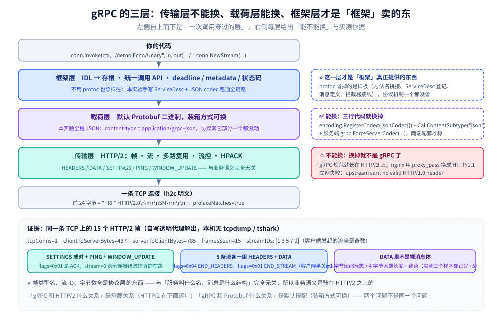
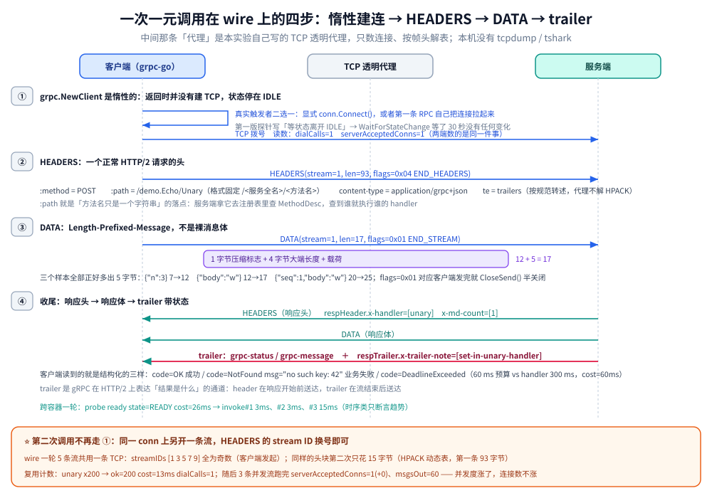
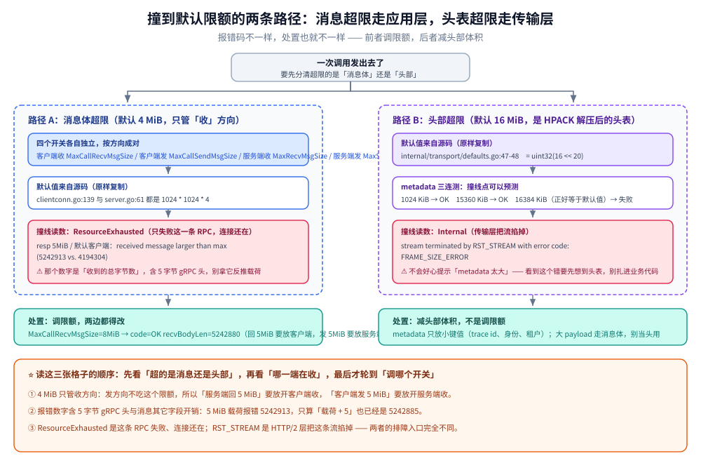

# gRPC 基础概念

> gRPC 的三层构成（HTTP/2 传输 + Protobuf 载荷 + 框架能力）、一次一元调用在 wire 上的全过程、连接复用与多路复用、metadata / deadline / 状态码三件套、默认限额，以及不用 protoc 时机制落在了哪一层。
>
> 内容整理自个人学习笔记，实测基于本机 Docker Desktop（容器 `golang:1.26-alpine` 内 go1.26.8 + grpc-go v1.84.0；容器 `eclipse-temurin:17-jdk` 内 java 17.0.20.1 + grpc-java 1.60.0），原始输出见 `.workbuddy/tmp/exp/grpclab/out/`。素材见 [素材清单](../../../../素材清单.md)。

---

## 一、gRPC 到底是什么？它和 HTTP/2、Protobuf 分别是什么关系？

**本节要点**：先把三层拆清楚——传输层是 HTTP/2（不是「另一种 TCP」）、默认载荷是 Protobuf（**可以换**）、框架真正卖的是「IDL 到存根 + 统一 API + deadline / metadata / 状态码」；再用 wire 上的帧表把第一层钉死。

### 1.1 三层，各自是什么、能不能换

| 层 | gRPC 默认用什么 | 能不能换 |
|---|---|---|
| 传输层 | HTTP/2（帧、流、多路复用） | 不能。gRPC 规范就长在 HTTP/2 上，换掉就不是 gRPC 了 |
| 载荷层 | Protobuf 二进制 | **能**。本实验全程用 JSON codec 跑，协议其它部分一个都没动 |
| 框架层 | IDL 到存根的代码生成、统一的调用 API、deadline / metadata / 状态码 | 这一层才是「框架」真正提供的东西 |

把这三层分开看，「gRPC 和 HTTP/2 是什么关系」「gRPC 和 Protobuf 是什么关系」就不再是同一个问题：前者是**承载关系**（HTTP/2 在下面运），后者是**默认搭配**（Protobuf 是默认装的东西，装箱方式可换）。



图怎么读：从下往上看是**承载关系**（一条 TCP 上跑 HTTP/2 帧，帧上骑 Protobuf 载荷，载荷之上才是框架），
从上往下看是**成本递减**——换框架层要改整个调用方式，换载荷层只有三行 codec，
而传输层那格标了 ⚠️「不能换」，反证就是第四节里 `proxy_pass` 那条必失败的路径。
底部横带里的读数全是本实验的原始输出（`tcpConns=1`、`framesSeen=15`、`streamIDs [1 3 5 7 9]`、DATA 长度比载荷多 5）。

### 1.2 证据：链路上跑的就是 HTTP/2 明文

实验在客户端与服务端之间夹了一个自己写的 TCP 透明代理，只做两件事：数「开了几条 TCP、各方向多少字节」，并把客户端发来的前 24 字节与随后的 HTTP/2 帧头按 9 字节一格增量解析成表。

注意这张表的来源：本机没有 `tcpdump` / `tshark`，它不是抓包工具的产物，而是代理自己按帧头格式（3 字节长度 + 1 字节类型 + 1 字节标志 + 4 字节流 ID）解出来的。

```text
proxy: tcpConns=1 clientToServerBytes=437 serverToClientBytes=785 cost=106ms
h2: prefaceMatches=true framesSeen=15
h2 frame: SETTINGS(stream=0,len=0,flags=0x00)
h2 frame: SETTINGS(stream=0,len=0,flags=0x01)
h2 frame: HEADERS(stream=1,len=93,flags=0x04)
h2 frame: HEADERS(stream=3,len=15,flags=0x04)
h2 frame: DATA(stream=1,len=12,flags=0x01)
h2 frame: DATA(stream=3,len=12,flags=0x01)
h2 frame: HEADERS(stream=5,len=29,flags=0x04)
h2 frame: DATA(stream=5,len=25,flags=0x01)
h2 frame: HEADERS(stream=7,len=15,flags=0x04)
h2 frame: DATA(stream=7,len=25,flags=0x01)
h2 frame: HEADERS(stream=9,len=15,flags=0x04)
h2 frame: DATA(stream=9,len=17,flags=0x01)
h2 frame: PING(stream=0,len=8,flags=0x01)
h2 frame: WINDOW_UPDATE(stream=0,len=4,flags=0x00)
h2 frame: PING(stream=0,len=8,flags=0x00)
h2 streamIDs: [1 3 5 7 9]
h2 prefaceBytes: "PRI * HTTP/2.0\r\n\r\nSM\r\n\r\n"
```

- 连接的前 24 个字节是 `PRI * HTTP/2.0\r\n\r\nSM\r\n\r\n`，这正是 HTTP/2 的明文（h2c）连接前言，`prefaceMatches=true`；
- `SETTINGS` 成对出现，`flags=0x01` 的那个是应答帧（ACK 标志）；
- 5 条流各一个 `HEADERS`（`flags=0x04` 即 END_HEADERS）加一个 `DATA`（`flags=0x01` 即 END_STREAM）；
- `WINDOW_UPDATE` 说明连接级流控真的在跑；另有 2 个 `PING` 帧，本实验只做帧类型记录，未展开分析触发者；
- 帧类型名、流 ID、字节数全是协议层的东西，**与「服务叫什么名、消息是什么结构」完全无关**——这就说明业务语义是骑在 HTTP/2 之上的。

### 1.3 两个「另篇」的分工

- HTTP/2 相对 HTTP/1.1 的五点改进、队头阻塞的成因、HPACK 的原理，都在 [HTTP与gRPC.md](../../../../02-计算机基础/网络/HTTP与gRPC.md)，本篇只把它落到帧级别；
- Protobuf 与 JSON 的体积、耗时对比与选型，都在 [数据序列化.md](../../../../02-计算机基础/网络/数据序列化.md)，本篇的结论只需要一句：**换 codec 只换载荷层的装箱方式，不换协议**。

---

## 二、一次一元调用在 wire 上发生了什么？

**本节要点**：把一次 `Invoke` 拆成四步——建连、HEADERS、DATA、收尾，每一步都指到实测读数；其中最关键的一条是 `grpc.NewClient` **是惰性的**，不主动触发就永远停在 `IDLE`。



图怎么读：三条泳道是**客户端 / 中间那个 TCP 透明代理 / 服务端**，中间那条的存在只为了数帧和数字节，
它不改报文——所以图上每一行读数都能同时出现在两侧。
四个编号就是本节四小节的顺序，①那格标了「不调 `Connect()` 就停在 `IDLE`」这个第一版探针踩过的坑；
③的 `DATA(len=17)` 拆成 `1 + 4 + 12`，多出来的 5 字节是 Length-Prefixed-Message 的压缩标志 + 4 字节长度。

### 2.1 第一步：建连（`NewClient` 是惰性的）

`grpc.NewClient` 返回时并没有建立 TCP 连接，它只是解析 target 并拉起后台的连接 goroutine：不调 `conn.Connect()`、也不发任何 RPC，连接状态会一直停在 `IDLE`。

这个坑在探针第一版上踩实了：探针写的是「等状态离开 `IDLE`」，结果 `WaitForStateChange(ctx, connectivity.IDLE)` **等了 30 秒没有任何状态变化**。改成先 `conn.Connect()` 再等之后，读数就正常了（跨容器那一轮）：

```text
probe ready: state=READY cost=26ms
probe invoke#1: err=<nil> cost=3ms
probe invoke#2: err=<nil> cost=3ms
probe invoke#3: err=<nil> cost=15ms
```

所以「建连」这一步的真实触发者有两个：显式 `Connect()`，或者第一条 RPC 自己把连接拉起来。这也是连接池可以「非阻塞建连」的前提（见 [不使用protoc的gRPC.md](../../../../01-编程语言/go/网络编程/不使用protoc的gRPC.md) 第五节）。

### 2.2 第二步：HEADERS——一个正常 HTTP/2 请求的头

调用一旦发出去，第一个帧就是 HEADERS。它带的是标准的 HTTP/2 伪头与 gRPC 约定头：

| 头 | 值 | 证据来源 |
|---|---|---|
| `:method` | `POST` | nginx 错误日志把伪头还原成请求行：`request: "POST /demo.Echo/Unary HTTP/2.0"`（`out/nginx-lab.txt`） |
| `:path` | `/demo.Echo/Unary` | 同上；格式固定为 `/<服务全名>/<方法名>` |
| `content-type` | `application/grpc+json` | 服务端自己看到的头（[不使用protoc的gRPC.md](../../../../01-编程语言/go/网络编程/不使用protoc的gRPC.md) 第二节实测） |
| `te` | `trailers` | gRPC 规范要求客户端声明；本实验的代理只解帧头、不解 HPACK，**这一条未复核**，按规范转述 |

`:path` 就是「方法名只是一个字符串」这句话在协议层的落点：服务端拿它去注册表里查方法，查到哪个 `MethodDesc` 就执行哪个 handler。

### 2.3 第三步：DATA——Length-Prefixed-Message

`DATA` 帧里装的不是裸的消息体，而是 gRPC 的 Length-Prefixed-Message：**1 字节压缩标志 + 4 字节大端长度 + 消息体**。

这一条可以直接用帧长度对上：wire 那一轮的请求体是 JSON，而 `svc.Msg` 里有 `omitempty`，所以 `Seq=0` 会被省掉。把三个 `DATA` 长度和它们对应的 JSON 文本放在一起看：

| 客户端发的内容 | JSON 字节数 | DATA 帧长度 | 差 |
|---|---|---|---|
| `{"n":3}`（服务端流的请求） | 7 | 12 | +5 |
| `{"body":"w"}`（一元，`Seq=0` 被省略） | 12 | 17 | +5 |
| `{"seq":1,"body":"w"}` | 20 | 25 | +5 |

三个样本全部正好多出 5 字节，就是那个压缩标志加 4 字节长度头。另外 5 个 `DATA` 的 `flags` 都是 `0x01`（END_STREAM），对应客户端代码里发完就 `CloseSend()` 做了半关闭。

### 2.4 第四步：收尾——状态与 trailer

响应侧先回 HEADERS（响应头），再回 DATA（响应体），最后用 **HTTP/2 的 trailer** 收尾，里面放 `grpc-status` / `grpc-message` 这类结果信息。trailer 是 gRPC 在 HTTP/2 上表达「结果是什么」的通道，也是它和普通 REST 的一个明显差别。

客户端从 API 上读到的就是这三样（`out/base.txt`）：

```text
metadata: err=<nil> respHeader.x-handler=[unary] respHeader.x-md-count=[1] respTrailer.x-trailer-note=[set-in-unary-handler]
```

响应 header 与 trailer 在客户端是两个不同的容器（`grpc.Header(&header)` / `grpc.Trailer(&trailer)`），服务端侧对应 `grpc.SetHeader` 与 `grpc.SetTrailer`。本实验只按帧类型统计到了 trailer 的存在，**没有解出 trailer 帧里 `grpc-status` 的具体字节**；能证明状态确实走协议传的是下一步：客户端解出了结构化的 `NotFound`（见第四节）。

---

## 三、连接为什么只建一次？多路复用与 stream ID 从哪看出来？

**本节要点**：`reuse.txt` 给出「200 次一元加 3 条并发流只拨号 1 次」的计数证据，`wire.txt` 给出 stream ID 全为奇数、HPACK 复用后头块从 93 字节降到 15 字节的字节证据。

### 3.1 计数证据：拨号 1 次、accept 1 条

```text
unary x200: ok=200 cost=13ms dialCalls=1 serverAcceptedConns=1
stream x3: serverStreams=3 serverAcceptedConns=1(+0) msgsIn=0 msgsOut=60 unaryCalls=200
```

- `dialCalls` 来自客户端自定义的 `WithContextDialer` 计数器，`serverAcceptedConns` 来自包了一层的 `countingListener`（`cmd/reuse/main.go`），两者数的是同一件事的两端；
- 200 个并发一元调用全部成功，客户端只拨号 1 次，服务端只 accept 1 条 TCP；
- 随后 3 条并发服务端流（每条 20 条消息，共 60 条出站）跑完，accept 计数是 `1(+0)` —— **流式调用没有新增连接**；
- 顺带一个确定性的全局计数：`msgsOut=60` 正是 3 条流各 20 条的和。

这就是「gRPC 连接长期复用 + HTTP/2 多路复用」的直接证据：**并发度涨了，连接数不涨**。

### 3.2 stream ID：5 条流，全是奇数

wire 那一轮是 3 个并发一元加 2 条并发服务端流，全部走同一条连接：

```text
h2 streamIDs: [1 3 5 7 9]
```

- `1 3 5 7 9` **全是奇数**。HTTP/2 规定客户端发起的流用奇数 ID、服务端发起的用偶数，本实验里没有服务端发起流（PUSH_PROMISE 未出现）；
- 每条流都是「一个 HEADERS 建流 + 一个 DATA 带消息体」，5 条流在同一条 TCP 上并发在途、互不等待，这就是多路复用；
- 对照 [HTTP与gRPC.md](../../../../02-计算机基础/网络/HTTP与gRPC.md) 第一节的机制说明：HTTP/1.1 的队头阻塞在应用层，HTTP/2 用「一条连接跑多条独立流」把它解掉了。

### 3.3 HPACK：同样的头第二次只花 15 字节

把 5 个 HEADERS 帧按出现顺序排开：

```text
h2 frame: HEADERS(stream=1,len=93,flags=0x04)
h2 frame: HEADERS(stream=3,len=15,flags=0x04)
h2 frame: HEADERS(stream=5,len=29,flags=0x04)
h2 frame: HEADERS(stream=7,len=15,flags=0x04)
h2 frame: HEADERS(stream=9,len=15,flags=0x04)
```

第一条 HEADERS 要送完整的头块（93 字节），后面几条**同样的头**因为进了 HPACK 动态表，只发索引就够了（15 / 29 字节）。这就是 [HTTP与gRPC.md](../../../../02-计算机基础/网络/HTTP与gRPC.md) 里「头部压缩」那一点落到的具体数字——不是「头变小了」这种形容词，而是 93 到 15 的落差。

### 3.4 流控与连接探测也在跑

wire 表里还有 `WINDOW_UPDATE(stream=0,len=4,flags=0x00)`：`stream=0` 表示这是连接级窗口更新，HTTP/2 的流量控制在真实运行。这解释了为什么大消息能在同一条连接上安全传输（限额见第五节）。

---

## 四、metadata / deadline / 状态码这三件套各自解决什么？

**本节要点**：三件套解决三个不同层面的事——deadline 管「时间预算与放弃」、metadata 管「跨进程的附加信息」、状态码管「结果的结构化表达」。三样都有实测读数。

### 4.1 deadline：客户端到点就放弃

```text
deadline: client 60ms vs handler 300ms -> code=DeadlineExceeded cost=60ms
deadline: 同请求 2s deadline -> code=OK body=echo:slow
```

- 客户端给 60 ms、服务端 handler 睡 300 ms，客户端拿到 `DeadlineExceeded`，而且 `cost=60ms` —— 说明它是**自己在到点时放弃**，不是等服务端睡醒了再告诉它失败；
- 同一个请求、把 deadline 放到 2 s，就能正常拿到 `echo:slow`。这一对读数把「差的是 deadline、不是别的东西」钉死了；
- 服务端侧对应的是 `ctx.Done()`：handler 里用 `select` 同时等业务耗时与 `ctx.Done()`，就能在客户端放弃后尽早退出，不做无用功。

### 4.2 metadata：跨进程的附加信息通道

```text
metadata: err=<nil> respHeader.x-handler=[unary] respHeader.x-md-count=[1] respTrailer.x-trailer-note=[set-in-unary-handler]
```

- 请求侧：客户端在 `metadata.NewOutgoingContext` 里塞了 `x-trace-id`，服务端读到的 `x-md-count=[1]` 证明它确实到了对端——链路 trace id、用户身份这类信息就走这条路；
- 响应侧：服务端用 `grpc.SetHeader` 设的 `x-handler=[unary]`、用 `grpc.SetTrailer` 设的 `x-trailer-note=[set-in-unary-handler]`，客户端分别在 header 与 trailer 两个容器里读到；
- **metadata 与 `context.WithValue` 的分水岭是「跨不跨进程」**：`WithValue` 只在单进程内可见，出了进程就没了；metadata 是随这次 RPC 发给对端的键值集合；
- metadata 的 key 会被**规范成小写**，客户端可以用大写声明、服务端必须按小写查，否则取到空（[不使用protoc的gRPC.md](../../../../01-编程语言/go/网络编程/不使用protoc的gRPC.md) 第 7.2 节的实测）。

### 4.3 状态码：错误是结构化的

```text
status: code=NotFound msg="no such key: 42" codeIsNotFound=true
```

服务端返回 `status.Error(codes.NotFound, "no such key: 42")`，客户端用 `status.FromError` 还原出 `code=NotFound`、`msg="no such key: 42"`，直接按 code 判定即可，不需要解析字符串。

这正是 gRPC 与「自己拼 HTTP」的一个实质差别：HTTP 只有状态码，错误语义要靠响应体的约定；gRPC 有 13 个规范 code，`NotFound` / `DeadlineExceeded` / `ResourceExhausted` 这类语义是协议自带的。第四节的三个读数（`DeadlineExceeded` / `NotFound` / `ResourceExhausted`）就是同一个机制在不同场景下的三次现身。

---

## 五、gRPC 的默认限额有哪些，撞到会看到什么错？

**本节要点**：消息大小默认 ≤4 MiB 的**收**方向限额、**收发各自独立、两端各自独立**；头表默认 16 MiB。撞线时的报错数字包含 5 字节 gRPC 头，不是纯载荷。



图怎么读：左右两条是**两个完全不同的失败面**——左边那条是 gRPC 层自己检查出来的
（所以错误码是语义化的 `ResourceExhausted`，消息里直接给你「实际 vs 上限」两个数）；
右边那条是 HTTP/2 层在组帧时就失败了（所以只能拿到 `RST_STREAM ... FRAME_SIZE_ERROR`，不会告诉你「metadata 太大」）。
左边的分支要点是「四个开关按方向成对放开」，右边给的是实测的三档输入（1024 / 15360 / 16384 KiB）。

先看实测（`out/limits.txt`）——同一个 5 MiB 报文，四种打法：

```text
resp 5MiB / default client: code=ResourceExhausted msg="grpc: received message larger than max (5242913 vs. 4194304)"
resp 5MiB / client MaxCallRecvMsgSize=8MiB: code=OK recvBodyLen=5242880
req 5MiB / default server: code=ResourceExhausted msg="grpc: received message larger than max (5242899 vs. 4194304)"
req 5MiB / server MaxRecvMsgSize=8MiB: code=OK echoPrefix=echo:
metadata 1024 KiB: code=OK msg=""
metadata 15360 KiB: code=OK msg=""
metadata 16384 KiB: code=Internal msg="stream terminated by RST_STREAM with error code: FRAME_SIZE_ERROR"
```

默认值来自源码，下面三处**原样复制**（标了文件与行号）：

```go
// clientconn.go:139
defaultClientMaxReceiveMessageSize = 1024 * 1024 * 4
// server.go:61
defaultServerMaxReceiveMessageSize = 1024 * 1024 * 4
// internal/transport/defaults.go:47-48
defaultClientMaxHeaderListSize = uint32(16 << 20)
defaultServerMaxHeaderListSize = uint32(16 << 20)
```

三条结论：

1. **4 MiB 收限额有四个开关，各自独立**：客户端收（`MaxCallRecvMsgSize`）只管客户端能收多大、服务端收（`MaxRecvMsgSize`）只管服务端能收多大；发方向不吃这个限额。所以「服务端回 5 MiB」要放客户端，「客户端发 5 MiB」要放服务端，两边都得改（上表第 2、4 行是分别放开的）。
2. **报错里的数字不是载荷**：第一行报的是 `5242913`，而载荷是 `5242880`（5 MiB），差值 33 是消息里除正文以外的字段与 JSON 开销；即使只算「载荷加 5 字节 gRPC 头」也已经是 `5242885`。总之它是**收到的总字节数对默认值**，不要拿这个数当「消息体大小」去反推。
3. **头表限额在 16384 KiB 正好撞线**：1024 KiB、15360 KiB 都能过，到 16384 KiB（正好等于 16 MiB 默认值）直接 `RST_STREAM` 加 `FRAME_SIZE_ERROR`。头表的默认值是 16 MiB，而 `16384 KiB` 恰好等于它，所以「撞线」的发生点是可以预测的。

补一句边界：`ResourceExhausted` 是**这条 RPC 失败**，连接本身还在；而超头表限额走的是 HTTP/2 层的 `RST_STREAM`，错误码是 `FRAME_SIZE_ERROR`。两者的处置完全不同——前者调限额，后者要减头部体积。

---

## 六、不用 protoc 也能调 gRPC，那 protoc 到底省了什么？

**本节要点**：服务端手写一个 `grpc.ServiceDesc`、客户端注册一个 codec 就能跑通全链路；protoc 省掉的是「生成这些代码」的手工活。但要记住一个大坑：**老式一元 handler 必须自己调用拦截器**，不写就是静默失效。

### 6.1 手写 `ServiceDesc` 的三个部分

```go
var Desc = grpc.ServiceDesc{
	ServiceName: ServiceName,                    // 方法名前缀，"demo.Echo"
	HandlerType: (*Service)(nil),                // 只用于校验 impl 有没有实现该接口
	Methods: []grpc.MethodDesc{
		{MethodName: "Unary", Handler: unaryHandler}, // 拼出 "/demo.Echo/Unary"
	},
	Streams: []grpc.StreamDesc{ /* 三条流的描述，见四种通信模式.md */ },
	Metadata: "grpclab/svc",                     // 仅作说明用
}
```

- `ServiceName` + `MethodName` 一拼，就是客户端要用的 `:path`，也就是字符串 `"/demo.Echo/Unary"`；
- `HandlerType` **必须是指向接口类型的指针**，它只做「实现校验」，不参与调用；
- `Methods` 与 `Streams` 是两个不同的表：一元走 `Methods`，三种流走 `Streams`。

### 6.2 换 codec 只要三行

```go
func init() { encoding.RegisterCodec(jsonCodec{}) } // 注册一个名叫 "json" 的 codec

// 客户端：声明本次调用用 json，content-type 会拼成 application/grpc+json
conn, _ := grpc.NewClient(addr, grpc.WithDefaultCallOptions(grpc.CallContentSubtype("json")))

// 服务端：不管对端声明什么子类型，一律用指定 codec 解码
srv := grpc.NewServer(grpc.ForceServerCodec(jsonCodec{}))
```

只注册不声明没用（默认仍是 protobuf）；只声明不注册也没用（客户端查不到）。两端配套才稳。

### 6.3 大坑：老式一元 handler 必须自己调用拦截器

`grpc@v1.84.0/server.go:1284` 把 `s.opts.unaryInt` 当作参数**传进** `md.Handler`，但**不会**替你调它。所以手写 handler 里如果只写业务逻辑：

```go
func unaryHandler(srv any, ctx context.Context, dec func(any) error, interceptor grpc.UnaryServerInterceptor) (any, error) {
	// 不写下面这段，ChainUnaryInterceptor 就是静默失效的
	if interceptor == nil {
		return p.Unary(ctx, in)
	}
	info := &grpc.UnaryServerInfo{Server: srv, FullMethod: "/" + ServiceName + "/Unary"}
	handler := func(ctx context.Context, req any) (any, error) { return p.Unary(ctx, req.(*Msg)) }
	return interceptor(ctx, in, info, handler)
}
```

本实验第一版就是漏了这段，服务端拦截器收集到的是**空数组**（`interceptor srv: []`），排查后才发现问题。protoc 生成的代码里那段 `if interceptor == nil { ... } else { ... }` 就是干这件事的——手写时忘了，protoc 帮你做的事就少了一件。

### 6.4 所以 protoc 省了什么

省的是**重复的样板**：方法名字符串的拼接、`ServiceDesc` 的登记、消息类型的定义与 `Marshal` / `Unmarshal`、以及 6.3 里那段拦截器接线。协议机制一层都没省——`Invoke`、流、deadline、metadata、状态码、限额全都在，和用不用 protoc 无关。

这一节的机制细节（为什么能不用、`dec` 怎么用、什么时候必须上真 protobuf）在 [不使用protoc的gRPC.md](../../../../01-编程语言/go/网络编程/不使用protoc的gRPC.md)，那边讲「为什么可以不用」；本篇只补「不用之后这些机制落在代码的哪一层」。两篇互补，不重复。

---

## 延伸追问

- **换 codec 是不是等于换了协议？** → 不是。换的只是载荷层的装箱方式：HTTP/2 帧、流、多路复用、deadline、metadata、状态码、限额一个都没变（第一节的帧表与第六节的 codec 代码是同一份实验）。
- **`grpc.NewClient` 之后为什么一直没连上？** → 它是惰性的，不 `Connect()`、不发 RPC 就停在 `IDLE`（第二节的探针第一版等了 30 秒没动）。这也是连接池能非阻塞建连的基础。
- **一次并发调用会不会「互相等」？** → 不会，但前提是它们共用一条 HTTP/2 连接：`streamIDs: [1 3 5 7 9]` 是 5 条独立的流，各自建流、各自带 END_STREAM（第三节）。
- **为什么报错里的数字比我发的消息大？** → 那个数字是「收到的总字节数」对默认值，含 gRPC 的 5 字节头与消息的其它字段开销，不等于载荷大小（第五节）。
- **头表撞限额和消息超限，报错为什么不一样？** → 消息超限是应用层的 `ResourceExhausted`，只失败这一条 RPC；头表超限触发 HTTP/2 的 `RST_STREAM`（`FRAME_SIZE_ERROR`），是传输层动作（第五节）。
- **trailer 里到底放了什么？** → 结果状态与结果 metadata。本篇只从客户端 API 侧读到 trailer 内容，未解出 trailer 帧里的 `grpc-status` 字节，这一点按规范转述（第二节）。
- **不用 protoc 之后最容易漏的是什么？** → 服务端一元 handler 里对拦截器的显式调用；漏了不会报错，只会静默不生效（第六节）。
- **多端点 / 跨容器场景下首次调用为什么要等好几秒？** → 那是名字解析阶段的事（TXT 查询），与协议无关，不在本篇展开。

---

## 关联

- [四种通信模式.md](四种通信模式.md) — 同一套实验台的另一半：一元与三种流的服务端写法、结束语义与五个坑
- [Protobuf.md](Protobuf.md) — 载荷层默认搭配的详解：`.proto`、字段号、向后兼容规则
- [生态与网关.md](生态与网关.md) — 解析、负载均衡、重试、过网关这些「跑起来才会遇到」的事
- [实战示例.md](实战示例.md) — 完整可跑的端到端示例
- [README.md](README.md) — gRPC 目录导读，按主题给出阅读顺序
- [不使用protoc的gRPC.md](../../../../01-编程语言/go/网络编程/不使用protoc的gRPC.md) — 同主题的 Go 侧实证：为什么可以没有 protoc、连接池设计、metadata 小写；本篇只链接不重复
- [HTTP与gRPC.md](../../../../02-计算机基础/网络/HTTP与gRPC.md) — HTTP/2 相对 HTTP/1.1 的五点改进、队头阻塞与 HPACK 的原理都在那篇
- [数据序列化.md](../../../../02-计算机基础/网络/数据序列化.md) — JSON 与 Protobuf 的体积、耗时对比与选型
- [接入gRPC.md](../../../../01-编程语言/java/接入gRPC.md) — Java 侧接入：grpc-java 的依赖、拦截器与 metadata 写法
