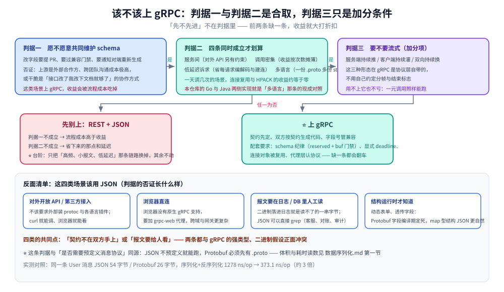
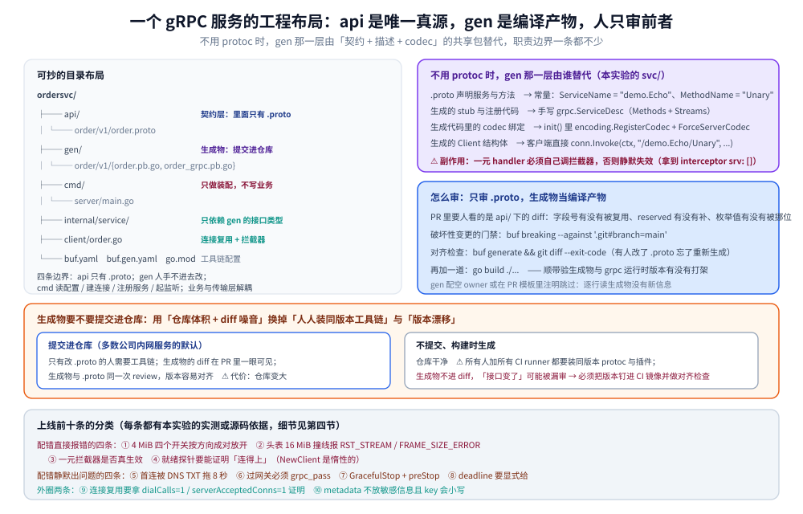

# gRPC 实战示例

> 上 gRPC 的三个决策问题（该不该上 / 工程怎么摆 / 上线查什么），以及 Go 与 Java 两侧分册的索引。
>
> 内容整理自个人学习笔记，实测基于本机 Docker Desktop（容器 `golang:1.26-alpine` 内 go1.26.8 + grpc-go v1.84.0；容器 `eclipse-temurin:17-jdk` 内 java 17.0.20.1 + grpc-java 1.60.0），原始输出见 `.workbuddy/tmp/exp/grpclab/out/`。素材见 [素材清单](../../../../素材清单.md)。

---

## 一、什么场景该上 gRPC，什么场景不该？

**本节要点**：上不上 gRPC 不是「先不先进」的问题，而是三条判据的合取：**调用双方愿不愿意共同维护一份 schema**、**是不是服务间、调用密集、低延迟、多语言**、**要不要流式**。前两条更重要，第三条是加分条件。

### 1.1 判据一：调用双方愿不愿意共同维护一份 schema

gRPC 的收益有一大半来自 `.proto`：契约先定、双方按契约生成代码、字段号管兼容。这一条的前提是**双方都愿意把这份文件当共同资产**——改字段要提 PR、要过兼容门禁、要通知对端重新生成。

不愿意的场景就是判据一的否证：上游是外部合作方、是别的团队且沟通成本极高，或者干脆是「接口改了我改下文档就够了」的协作方式。这类场景上 gRPC，收益会被流程成本吃掉。

这条判据与 [数据序列化.md](../../../../02-计算机基础/网络/数据序列化.md) 第一节的格式选型同源：**「是否需要预定义消息协议」就是 Protobuf 与 JSON 的分水岭**——JSON 不预定义就能跑，Protobuf 必须先有 `.proto`。要上 gRPC，先确认双方接受这份前置成本；两者的体积与耗时读数见那篇，本篇不重复。

### 1.2 判据二：是不是服务间、调用密集、低延迟、多语言

四条同时成立才划算：

- **服务间**：gRPC 的强类型契约与双向流在内部调用上收益最大；对外 API 另有约束（见 1.3 的反面清单）。
- **调用密集**：连接长期复用、头部压缩（HPACK）这些收益是**按调用次数摊薄**的。一天调几次的场景，收益约等于零。
- **低延迟诉求**：二进制编码与 HTTP/2 多路复用省掉的是每请求的编解码与建连开销，这在延迟敏感的链路上才算收益。
- **多语言**：两端不是同一门语言时，一份 `.proto` 生成多份 stub 的价值最高（本仓库的 Go 与 Java 两侧实现就是现成对照）。

### 1.3 判据三：要不要流式

需要「服务端持续推」「客户端持续灌」「双向持续换」这三类形态时，gRPC 的四种通信模式是**协议层自带**的，不用自己约定分帧与结束标志。这是让 gRPC 更占优势的一条，不是必需项——一元调用用不上它。

### 1.4 反面清单：这四类场景该用 JSON

| 场景 | 为什么 JSON 更合适 |
|---|---|
| 对外开放 API / 第三方接入 | 外部调用方不该被要求装 protoc 与各语言插件；`curl` 就能调、浏览器就能看 |
| 浏览器直连 | 浏览器没有原生 gRPC 支持，要额外加 grpc-web 代理，跨域与网关配置都更复杂 |
| 报文要人工在日志与 DB 里读 | Protobuf 是二进制，落在日志与表里就是人读不了的一串字节；JSON 可以直接 `grep` |
| 结构运行时才知道（动态表单、透传字段） | Protobuf 的字段在编译期定死；`map` 型的动态结构用 JSON 更自然 |

四类的共同点是**「契约不在双方手上」或「报文要给人看」**——两条都与 gRPC 的强类型、二进制假设正面冲突。



图怎么读：左列自上而下是本节三条判据，**前两问之间是「与」的关系**（任何一问回答「不愿意 / 不是」就往下掉），
第三问只标了「加分」——一元调用用不上流式，不影响前两问的结论；
右侧四个小盒是 1.4 那张反面清单，它们共同的出口是「REST + JSON」；
底部那条带子把判据一与 [数据序列化.md](../../../../02-计算机基础/网络/数据序列化.md) 第一节的格式选型连起来：
**「是否需要预定义消息协议」就是同一条分水岭**。

---

## 二、一个 gRPC 服务的工程布局长什么样？

**本节要点**：`api/` 放 `.proto`（唯一真源）、`gen/` 放生成物、`cmd/` 与 `internal/` 分入口与业务、`client/` 放客户端封装；生成物**提交进仓库**。不用 protoc 时，`gen/` 那一层由「共享 codec + 手写 `ServiceDesc`」的独立包替代。

### 2.1 可抄的目录布局

```text
ordersvc/
├── api/                        # 契约层：全仓唯一真源，里面只有 .proto
│   └── order/v1/order.proto
├── gen/                        # 生成物：buf generate 的产物，提交进仓库
│   └── order/v1/
│       ├── order.pb.go
│       └── order_grpc.pb.go
├── cmd/
│   └── server/main.go          # 进程入口：只做装配，不写业务
├── internal/
│   ├── service/                # 业务实现：只依赖 gen/ 暴露出来的接口
│   └── repo/
├── client/                     # 客户端封装：连接复用 + 拦截器，供别的服务引
│   └── order.go
├── buf.yaml                    # buf 模块定义
├── buf.gen.yaml                # 生成器与输出路径
└── go.mod
```

四条职责边界：`api/` 里**只有** `.proto`，谁改它都要走第三节的门禁；`gen/` 里**只有**生成物，人手不进去改；`cmd/` 只做装配（读配置、建连接、注册服务、起监听）；`internal/service/` 只依赖 `gen/` 生成出来的接口类型，业务逻辑与传输层解耦。



图怎么读：左半是那棵目录树的图形版，**粗细表示依赖方向**——`cmd/` 与 `internal/service/` 都只朝 `gen/` 指，
`gen/` 只朝 `api/` 生成，反过来都不成立；右半标出的是**评审边界**：
竖线左边（`api/`）要人逐行看，竖线右边（`gen/`）当编译产物跳过。
底下那条带子是不用 protoc 时的替代落点（2.3 的 `svc/` 包），它承担的是 `api/` + `gen/` 两层的职责。

### 2.2 生成物为什么提交进仓库？

| | 提交进仓库 | 不提交、构建时生成 |
|---|---|---|
| 团队与 CI 是否都要装工具链 | 否，只有改 `.proto` 的人需要 | 是，所有人加所有 CI runner 都要装同版本 protoc 与插件 |
| 接口变更的可见性 | 生成物的 diff 在 PR 里一眼可见 | 生成物不进 diff，「接口变了」这件事可能被漏审 |
| 仓库体积 | 变大，改一次 `.proto` 的 diff 很大 | 干净 |
| 版本漂移风险 | 生成物与 `.proto` 同一次 review，容易对齐 | 工具链版本不同就会生成出不同结果 |

取舍是**用仓库体积与 diff 噪音，换掉「人人装工具链」和「版本漂移」两个风险**——这是多数公司内网服务的默认选择。真选择不提交时，必须把工具链版本钉在 CI 镜像里，并加 3.3 那个「生成物与 `.proto` 是否对齐」的检查，而不是只做前半截。

### 2.3 不用 protoc 时，`gen/` 那一层由谁替代？

不用 protoc 就没有生成物，但**「契约 + 服务端装配」这件事仍要有落点**。本实验台把它独立成一个共享包 `svc`：

| 有 protoc | 不用 protoc（本实验的 `svc/`） |
|---|---|
| `.proto` 里声明服务与方法 | 服务名与方法名是常量：`ServiceName = "demo.Echo"`、`Methods[].MethodName = "Unary"` |
| 生成 `gen/` 里的 stub 与服务端注册代码 | 手写 `grpc.ServiceDesc`（`Methods` + `Streams`），注册那一步自己写 |
| 生成代码里带 codec 的绑定 | `init()` 里 `encoding.RegisterCodec(jsonCodec{})`，服务端 `grpc.ForceServerCodec` |
| 客户端用生成的 `Client` 结构体 | 客户端直接 `conn.Invoke(ctx, "/demo.Echo/Unary", …)` |

所以 `cmd/net/server` 与 `svc` 的分工是：**`svc` 是「契约 + 描述 + codec」的共享包，`cmd/*` 是入口**。两个入口都 import `svc`——服务端 `s.RegisterService(&svc.Desc, svc.NewImpl(...))`，客户端用 `svc.Path("Unary")` 拼方法名，**方法与流的清单只有 `svc` 一处**，等价于有 protoc 时的 `gen/`。Go 侧的完整写法（codec 注册、`ServiceDesc` 三个字段、`dec` 的用法）见 [不使用protoc的gRPC.md](../../../../01-编程语言/go/网络编程/不使用protoc的gRPC.md)。

⚠️ 手写 `ServiceDesc` 有一个容易漏的副作用：一元 handler 必须**自己**调用拦截器，否则拦截器静默失效——见第四节第 ③ 条。

---

## 三、`.proto` 与生成物在仓库里怎么放、怎么审？

**本节要点**：**只审 `.proto`，生成物当编译产物**；`.proto` 的破坏性变更走 `buf breaking` 门禁；生成物要与 `.proto` 版本对齐，靠 `buf generate && git diff --exit-code` 兜住「忘了重新生成」。

### 3.1 只审 `.proto`，生成物当编译产物

PR 里要人看的是 `api/` 下 `.proto` 的 diff：字段号有没有被复用、`reserved` 有没有补、枚举值有没有被挪位。`gen/` 下的 `.pb.go` / `*_grpc.pb.go` 是**编译产物**，评审时跳过（给 `gen/` 配空 owner，或在 PR 模板里注明）。

理由很简单：生成物的 diff 由 `.proto` 唯一决定，逐行读它没有新信息，还会把 `api/` 的真实变更淹没在几千行噪音里。**把评审注意力集中在唯一真源上**，是这套布局能持续运转的前提。

### 3.2 `.proto` 变更的门禁

`.proto` 一旦被别的服务引用，它就成了跨仓库的公共接口；删字段、改字段类型、改字段号这类变更会**静默打穿对端**。门禁就是一条命令：

```bash
buf breaking --against '.git#branch=main'
```

它把当前 `.proto` 与主干对比，破坏性变更直接失败、进不了 CI。字段号复用与 `reserved` 的必要性、「新旧版本混跑会出什么事」，在 [Protobuf.md](Protobuf.md) 的工程化一节，本篇不重复。

### 3.3 生成物与 `.proto` 版本怎么对齐？

最常见的事故是「有人改了 `.proto`，忘了重新生成」：仓库里的 `gen/` 是旧的，本地跑得通、别人拉下来重新生成就变了。两条检查：

```bash
# 1. 生成物是否与 .proto 对齐：有 diff 就说明忘了提交生成物
buf generate && git diff --exit-code

# 2. 生成出来的 stub 能不能编译：编译产物与 grpc 运行时版本是否打架
go build ./...
```

⚠️ 检查 2 还兼任另一件事：`gen/` 下的 `.pb.go` 单文件可能是 MB 级，编译慢、IDE 索引慢都是正常代价，别把它当成「代码有问题」。

---

## 四、上线前必须确认的十条

**本节要点**：十条里每一条都有本实验的实测或源码依据。前四条是「配错了直接报错」的硬限额，中四条是「配错了静默出问题」的行为项，后两条是外圈设施与数据卫生。

1. **收发方向的四 MiB 限额，四个开关是不是都放开了？** 消息大小上限**分方向各自独立**：客户端收 `grpc.MaxCallRecvMsgSize`、客户端发 `grpc.MaxCallSendMsgSize`、服务端收 `grpc.MaxRecvMsgSize`、服务端发 `grpc.MaxSendMsgSize`。本实验撞的是两个**收方向**开关，默认值来自源码（原样复制）：

   ```go
   // clientconn.go:139
   defaultClientMaxReceiveMessageSize = 1024 * 1024 * 4
   // server.go:61
   defaultServerMaxReceiveMessageSize = 1024 * 1024 * 4
   ```

   撞线时报的是**含 5 字节 gRPC 头的总长**，不是载荷长度：

   ```text
   resp 5MiB / default client: code=ResourceExhausted msg="grpc: received message larger than max (5242913 vs. 4194304)"
   ```

   ⚠️ 四个开关要**按方向成对**放开：只放开客户端收、不放开服务端发，请求方向照样失败（`req 5MiB / default server` 那条报的 `5242899` 同理）。

2. **头表十六 MiB 撞线报什么错？** 默认 `defaultServerMaxHeaderListSize = uint32(16 << 20)`（`internal/transport/defaults.go:47-48`），metadata 逼近它在 **16384 KiB 时正好撞线**：

   ```text
   metadata 15360 KiB: code=OK msg=""
   metadata 16384 KiB: code=Internal msg="stream terminated by RST_STREAM with error code: FRAME_SIZE_ERROR"
   ```

   ⚠️ 报错是 `RST_STREAM ... FRAME_SIZE_ERROR`，不会好心告诉你「metadata 太大」——看到这个错要先想到头表，别一头扎进业务代码。**metadata 只该放小体积的键值**（trace id、身份），大 payload 走消息体。

3. **一元拦截器是不是真的生效了？** 用生成代码时它自带调用；**手写 `ServiceDesc` 时必须自己在 handler 里调**——`grpc@v1.84.0/server.go:1284` 把 `s.opts.unaryInt` 当参数传给 `md.Handler`，只有 handler 里显式 `interceptor(ctx, in, info, handler)` 才生效，不写就是**静默失效**（本实验踩过，拿到的是空数组 `interceptor srv: []`）。生成代码里那段 `if interceptor == nil { … } else { … }` 就是干这个的。

4. **`grpc.NewClient` 是惰性的，健康检查不能只看「没报错」**：它只解析 target、拉起后台连接 goroutine；不调 `conn.Connect()`、也不发起 RPC 的话，连接永远停在 `IDLE`——第一版探针 `WaitForStateChange(ctx, IDLE)` 等了 30 秒没动，就是这个原因。所以**就绪探针必须能证明「连得上」**（发一次真实 RPC，或显式 `Connect()` 后再等状态变化），不能只判断构造函数没返回 error。

5. **跨主机名首连是不是被 DNS TXT 查询拖了 8 秒？** grpc-go 的 dns resolver **默认**会对 `_grpc_config.<host>` 做一次 TXT 查询（源码里 `txtPrefix = "_grpc_config."`、开关 `EnableTXTServiceConfig = boolFromEnv("GRPC_ENABLE_TXT_SERVICE_CONFIG", true)`、`ResolvingTimeout = 30 * time.Second`）。Docker 内嵌 DNS 对同一个名字可能一会儿 `no such host`、一会儿 `server misbehaving`，后者要等满 8 秒：

   ```text
   grpclab-server:50051                        TXT no such host 650ms   READY 26ms  首次 invoke 3ms
   同上 + GRPC_ENABLE_TXT_SERVICE_CONFIG=false  TXT 8ms                  READY 3ms   首次 invoke 3ms
   passthrough:///grpclab-server:50051          TXT 8.005s server misbehaving  READY 6ms  首次 invoke 1ms
   ```

   ⚠️ **`passthrough` 那轮里，探针自己的 TXT 查询仍然花了 8.005 s，而 grpc 建连只花 6 ms**——把「8 秒来自 DNS TXT」这个结论钉死了。两种修法实测都有效：`GRPC_ENABLE_TXT_SERVICE_CONFIG=false`，或 `passthrough:///host:port` 直连（跳过 resolver）。

6. **过网关必须 `grpc_pass`，不能 `proxy_pass`**：gRPC 后端只会回 HTTP/2，`proxy_pass` 拿到一坨二进制会当成非法 HTTP/1.0 响应头，nginx 错误日志原文：

   ```text
   [error] upstream sent no valid HTTP/1.0 header while reading response header from upstream,
           request: "POST /demo.Echo/Unary HTTP/2.0", upstream: "http://192.168.16.2:50051/demo.Echo/Unary"
   [error] readv() failed (104: Connection reset by peer) while reading upstream
   ```

   后果是 header/trailer 全空、服务端流 `recv=0`——报文看起来「发出去又没回」。改成 `grpc_pass grpc://<backend>:50051` 后，一元（含 header/trailer）、服务端流、双向流三组全部恢复。⚠️ 还要确认反向代理层没在中间做 HTTP/1.1 降级。

7. **优雅退出用 `GracefulStop` + `preStop` 宽限**：`GracefulStop` 会等已有 RPC 跑完再关监听；但 K8s 删 Pod 时「摘 Endpoint」与「发 SIGTERM」是并发的，正在排空的连接可能还没从负载均衡里摘掉。所以 `preStop` 要加一段休眠（等摘除生效），`terminationGracePeriodSeconds` 要大于「最长 RPC + 排空时间」的总和。

8. **deadline 要显式给**：客户端不给 deadline，服务端一挂起这个请求就长期占着资源。本实验的对照是同一请求两种预算：

   ```text
   deadline: client 60ms vs handler 300ms -> code=DeadlineExceeded cost=60ms
   deadline: 同请求 2s deadline -> code=OK body=echo:slow
   ```

   差的是 deadline 而不是别的东西：同一个 `delay_ms=300` 的请求给足 2 秒就正常返回。⚠️ 配套要求是服务端**尊重 ctx 取消**（`select` 上 `ctx.Done()`），否则客户端已经放弃、服务端还在算。

9. **连接复用是不是真的成立？** 「长期复用 + HTTP/2 多路复用」要拿数字证明，本实验数的是「建了几条 TCP、拨号几次」：

   ```text
   unary x200: ok=200 cost=13ms dialCalls=1 serverAcceptedConns=1
   stream x3: serverStreams=3 serverAcceptedConns=1(+0) msgsIn=0 msgsOut=60 unaryCalls=200
   ```

   200 次一元加 3 条并发流**只拨号 1 次、服务端只 accept 1 条 TCP**，流式调用之后 accept 计数**没涨**（`1(+0)`）。⚠️ 这条读数的直接推论是：**连接对象必须被复用**——每次调用都 `grpc.NewClient`（或随手 `conn.Close()`）就把这份收益抹掉了。

10. **metadata 里不放敏感信息，且 key 会小写**：metadata 是随 RPC 发给对端的明文键值（链路不加密时就是明文），token、密码、身份证号一律不放。另外 key 会被统一规范成小写：客户端可以大写声明，服务端**必须按小写查**，否则取到空。Go 侧的白名单透传与实测见 [不使用protoc的gRPC.md](../../../../01-编程语言/go/网络编程/不使用protoc的gRPC.md) 第七节。

---

## 使用：按语言分册的落地索引

**本节要点**：本目录（`gRPC/`）的 13 篇是**本体篇**——概念、协议、通信模式、连接、拦截器、安全、生态、可观测、性能、排障；**具体语言的接入代码不在本体篇里重复**，一律拆到语言目录下，两边双向关联。

| 语言 | 从哪进 |
|---|---|
| Go | [不使用protoc的gRPC.md](../../../../01-编程语言/go/网络编程/不使用protoc的gRPC.md) —— codec 替换、手写 `ServiceDesc`、metadata 通道、连接复用；[从零实现网关.md](../../../../01-编程语言/go/网络编程/从零实现网关.md) —— HTTP 请求转成 gRPC 调用；[net包与TCP-UDP编程.md](../../../../01-编程语言/go/网络编程/net包与TCP-UDP编程.md) —— gRPC 底下的 TCP framing 与 UDS |
| Java | [接入gRPC.md](../../../../01-编程语言/java/接入gRPC.md) —— 不用 protoc 的 `MethodDescriptor` + `Marshaller`、四种模式、拦截器与 metadata 的 Java 写法，以及与 Go 侧的逐行对照 |

三件事写清楚：

- **本体篇在哪**：[基础概念.md](基础概念.md)（是什么、跑在什么之上）、[HTTP2机制.md](HTTP2机制.md)（HTTP/2 底座：帧 / 流 / HPACK / 流控 / 流状态机）、[四种通信模式.md](四种通信模式.md)（四种模式的定义与适用）、[Protobuf.md](Protobuf.md)（`.proto` 语法与字段演进）、[连接与生命周期.md](连接与生命周期.md)（五态状态机、keepalive、优雅退出）、[拦截器与元数据.md](拦截器与元数据.md)（洋葱序、状态码与富错误）、[安全与认证.md](安全与认证.md)（TLS / mTLS 与凭据）、[生态与网关.md](生态与网关.md)（周边工具链）、[可观测性.md](可观测性.md)（trace / metrics / log）、[性能与调优.md](性能与调优.md)（压测口径与调优旋钮）、[故障排查与调试.md](故障排查与调试.md)（症状 → 判据 → 处置）、[gRPC-Web与Connect.md](gRPC-Web与Connect.md)（浏览器侧的两条路）、本目录 [README.md](README.md)（导读）。
- **分册在哪**：Go 侧在 `01-编程语言/go/网络编程/`，Java 侧在 `01-编程语言/java/`；两边的接入代码只写在那边，本体篇只留索引。
- **哪些内容刻意不写在这里**：具体依赖坐标与 classpath 顺序、语言的 API 名字（`blockingUnaryCall` / `asyncBidiStreamingCall` 之类）、各语言的拦截器包装写法——它们随语言与版本变，放本体篇会很快过期。

---

## 延伸追问

- **「该上」的三条判据要同时满足吗？** → 前两条（共同维护 schema、服务间且调用密集低延迟多语言）是**合取**，缺一条收益就大打折扣；第三条（流式）是加分条件，一元调用用不上它。
- **「报文要人工读」为什么能一票否决？** → Protobuf 是二进制，落在日志与表里也读不了。要人来排障的链路（客服工单、对账、审计）就用 JSON——这条与 [数据序列化.md](../../../../02-计算机基础/网络/数据序列化.md) 第一节的选型判据同源。
- **生成物提交进仓库不会把仓库搞大吗？** → 会，这是明确接受的代价，换掉的是「人人装同版本工具链」与「版本漂移」两个风险（2.2 的取舍表）。真在意体积，就用「不提交 + CI 里比对」，而不是「不提交也不检查」。
- **不用 protoc 时还需要 `api/` 这一层吗？** → 需要，只是里面放的不是 `.proto`。本实验把它落在 `svc/` 包：服务名、方法名、四个 handler、codec 都集中在那里，等价于有 protoc 时的 `gen/`（2.3）。
- **拦截器为什么手写 `ServiceDesc` 时会失效？** → `grpc@v1.84.0/server.go:1284` 只把拦截器**当参数传进** handler，调不调用由 handler 决定；生成代码里有 `if interceptor == nil … else …` 那段，手写时得自己补（第四节 ③）。
- **`grpc.NewClient` 没报错就代表服务可达吗？** → 不代表。它是惰性的，连接停在 `IDLE` 直到 `Connect()` 或首个 RPC。就绪探针要用「真实 RPC 或显式连接」来判定（第四节 ④）。
- **metadata 能不能当配置下发通道？** → 不建议。它是随每次 RPC 走的头、参与头部压缩、key 还会被小写规范化，默认头表上限也只有 16 MiB；大块动态配置走配置中心，metadata 只放小的、每次调用都要的上下文（trace id、租户、身份）。
- **为什么要专门数「拨号几次、accept 几条 TCP」？** → 「我们复用了连接」是一句无法证伪的话。`dialCalls=1 serverAcceptedConns=1` 才把它变成可回归的断言：一旦有人把连接对象改成每请求新建，这行读数立刻变（第四节 ⑨）。

---

## 关联

- [README.md](README.md) — gRPC 目录导读（13 篇的阅读顺序与分工）
- [基础概念.md](基础概念.md) — gRPC 是什么、跑在什么之上、与 HTTP/2 的关系
- [四种通信模式.md](四种通信模式.md) — 一元 / 服务端流 / 客户端流 / 双向流的定义与适用
- [Protobuf.md](Protobuf.md) — `.proto` 语法、字段号演进、`buf` 工具链的工程化一节
- [生态与网关.md](生态与网关.md) — 周边生态与工具链
- [RPC框架选型对比.md](../RPC框架选型对比.md) — gRPC 与 Dubbo / Thrift 等框架的横向对比
- [接入gRPC.md](../../../../01-编程语言/java/接入gRPC.md) — Java 侧分册：不用 protoc 的接入与四种模式
- [从零实现网关.md](../../../../01-编程语言/go/网络编程/从零实现网关.md) — HTTP 转 gRPC 的协议转码，与本节第二条判据里的「转码层」是同一条链路
- [分布式与微服务.md](../../../../04-架构与系统/分布式/分布式与微服务.md) — 服务间通信在分布式系统里的位置与选型口径
