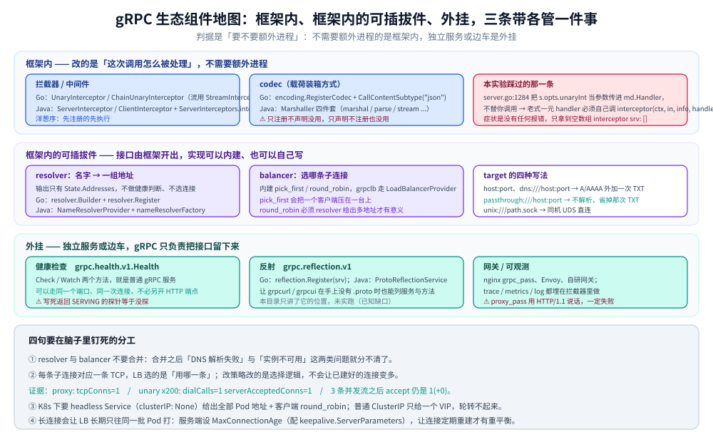
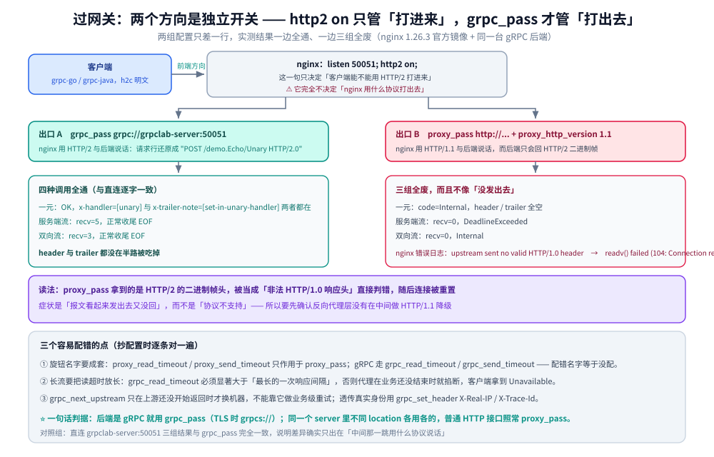
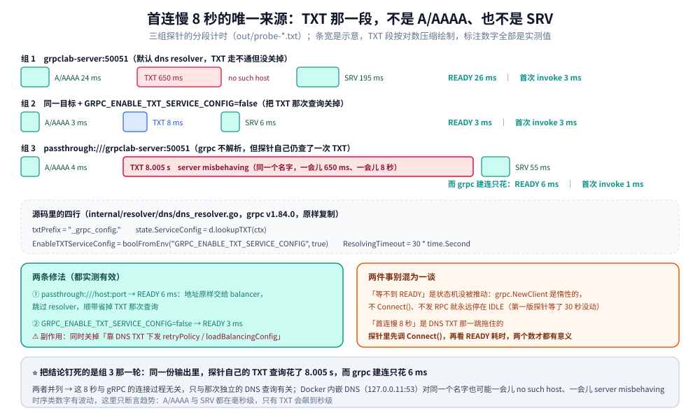

# gRPC 生态与工程实战

> gRPC 用起来之后要接的生态件（注册发现 / 负载均衡 / 网关 / 健康检查 / 可观测），以及四组容器实测：连接复用、nginx `grpc_pass` vs `proxy_pass`、DNS TXT 查询导致的 8 秒首连、拦截器与超时。
>
> 内容整理自个人学习笔记，实测基于本机 Docker Desktop（容器 `golang:1.26-alpine` 内 go1.26.8 + grpc-go v1.84.0；nginx 1.26.3 官方镜像），原始输出见 `.workbuddy/tmp/exp/grpclab/out/`。素材见 [素材清单](../../../../素材清单.md)。

---

## 一、gRPC 生态里有哪些组件？各解决什么问题？

**本节要点**：先把「谁在管什么」摆清楚——拦截器与 codec 在框架内；resolver 与 balancer 是框架内的可插拔件；健康检查、反射、网关、可观测都是外挂。

### 1.1 一张组件地图

| 组件 | 框架内还是外挂 | Go 侧怎么接 | Java 侧怎么接 |
|---|---|---|---|
| 拦截器 / 中间件 | 框架内 | `grpc.UnaryInterceptor` / `grpc.ChainUnaryInterceptor`（流用 `grpc.StreamInterceptor`） | `ServerInterceptor` / `ClientInterceptor`，用 `ServerInterceptors.intercept(...)` 串成链 |
| resolver（名字 → 地址） | 框架内的可插拔件 | 实现 `resolver.Builder` 后 `resolver.Register`，注册自定义 scheme | 实现 `NameResolverProvider`，交给 `ManagedChannelBuilder.nameResolverFactory` |
| balancer（选哪条连接） | 框架内的可插拔件 | 内建 `pick_first` / `round_robin`，自定义走 `balancer.Register` | 内建 `pick_first` / `round_robin`，`grpclb` 走 `LoadBalancerProvider` |
| 健康检查 | 外挂（标准服务 + 客户端配置） | 服务端注册 `grpc.health.v1.Health`（`health` 包），客户端用 service config 的 `healthCheckConfig` | 服务端 `HealthStatusManager`（`grpc-services`），客户端同样是 `healthCheckConfig` |
| 反射 | 外挂（可选注册） | `reflection.Register(srv)`，给 grpcurl / grpcui 用 | `ProtoReflectionService`（`grpc-services`） |
| 网关 / 代理 | 外挂 | nginx `grpc_pass`、Envoy、自研网关 | 与语言无关，同一套配置 |
| 可观测 | 外挂（在拦截器里做） | 拦截器里埋 trace / metrics / log | 同（拦截器里埋） |



图怎么读：三条横带就是上面那张表第二列的三档归属，**带内的位置越靠左越靠近一次调用本身**；
第二层（可插拔件）里 resolver 与 balancer 被画成**先后两个盒子**，因为它们的分工是「名字 → 一组地址」再接「选哪条子连接」，
脑子里把这两个合并是这一节最常见的错误；
第三层（外挂）里那两个标准服务的名字（`grpc.health.v1.Health`、`grpc.reflection.v1`）单独标出，
因为它们**走同一个端口、同一次连接**，探针不需要另开 HTTP 端点。

### 1.2 一句话判据

- **框架内**：拦截器与 codec。它们改的是"这次调用怎么被处理"，不需要额外进程。
- **框架内的可插拔件**：resolver 与 balancer。接口由框架开出，实现可以自己写，也可以直接用内建的。
- **外挂**：健康检查、反射、网关、可观测。它们是**独立服务或边车**，gRPC 只负责把接口留出来。

### 1.3 两个标准服务的名字值得记住

- 健康检查是 `grpc.health.v1.Health`（一个普通的 gRPC 服务，`Check` / `Watch` 两个方法），
  所以它**可以走同一个端口、同一次连接**，探针不需要另开 HTTP 端点；
- 反射是 `grpc.reflection.v1`（新版本是 `grpc.reflection.v1alpha` 的后续），
  它让 `grpcurl` 这类工具在**手上没有 `.proto`** 时也能列出服务与方法。

---

## 二、服务注册与发现怎么接？

**本节要点**：resolver 只做一件事——把名字变成一组地址；选哪一条连接是 balancer 的事，两者不要在脑子里合并。

### 2.1 `NameResolver` 的职责：只产出一组地址

resolver 的输入是一个 target 字符串，输出只有一份 `[]resolver.Address`。
它**不做健康判断、不做负载选择**——那是 balancer 的地盘。

```go
// grpc-go 的 resolver 接口（示意）
type Resolver interface {
	ResolveNow(ResolveNowOptions) // 触发一次重新解析
	Close()                       // 释放资源
}

// 解析结果通过 Watcher 推给框架，核心字段就是地址列表
type Watcher interface {
	UpdateState(State) // State.Addresses []Address
}
```

自定义 scheme 的接法：

```go
// 注册一个 scheme = "mysql" 的 resolver；客户端 target 写 mysql:///host:port
resolver.Register(myBuilder{}) // myBuilder.Build(target, cc, opts) 返回 (Resolver, error)
```

### 2.2 默认的 `dns:///` 与它顺带发的第三个查询

不给 scheme 时，grpc-go 走 dns resolver：对主机名做 **A / AAAA** 查询拿地址。
注意它**默认还会额外做一次 TXT 查询**（`_grpc_config.<host>`，用于 DNS 下发 service config）——
这一条正是第五节 8 秒首连的来源。

从 `probe-*.txt` 的三组读数里可以直接看到：A/AAAA、TXT、SRV 三段查询是**分开计时**的，
TXT 那一段就是默认行为多出来的成本。

### 2.3 容器与服务网格里常改成直连

| 目标写法 | 行为 |
|---|---|
| `host:port` | 走默认 dns resolver：A/AAAA，外加一次 TXT |
| `dns:///host:port` | 同上，只是把默认 scheme 显式写出来 |
| `passthrough:///host:port` | 不解析，地址原样交给 balancer；省掉 TXT 那次查询 |
| `unix:///path/to.sock` | UDS 直连（同机场景） |

在 K8s + 服务网格里，"名字 → 地址"往往已经由 sidecar / iptables 兜住了，
客户端再解析一次不但多余，还可能踩到 DNS 的坑——所以直连与 `passthrough` 很常见。

### 2.4 Java 侧一一对应

Java 的对应物是 `NameResolverProvider`（`NameResolver.Factory` 的实现），
用 `ManagedChannelBuilder.nameResolverFactory(...)` 挂上去；`getDefaultScheme()` 决定默认 scheme，
与 Go 的 `resolver.Builder.Scheme()` 一一对应。负载侧的 `LoadBalancerProvider` 与 Go 的 balancer 也是同一分工。

---

## 三、负载均衡：客户端 LB 还是服务端 LB？

**本节要点**：客户端 LB 作用在**连接列表**上，前提是 resolver 给出了多个地址；`pick_first` 会"把一个客户端压在一台上"；选哪条连接发生在每一条子连接上，wire 层的 `tcpConns=1` 就是这一层的证据。

### 3.1 两种 LB 的分界

| 形态 | 谁在选 | 典型实现 | 适用 |
|---|---|---|---|
| 客户端 LB | 客户端进程自己 | `pick_first` / `round_robin` / `grpclb` | 想省一跳；或服务网格里由 sidecar 代做 |
| 服务端 LB / 代理 LB | 中间那一跳 | Envoy、nginx、K8s Service（kube-proxy） | 客户端不想感知实例拓扑 |

### 3.2 `pick_first` 为什么"把一个客户端压在一台上"

`pick_first` 的语义是"**选中第一条能连上的子连接，然后一直用它**"。
所以只有客户端实例足够多时流量才会散开；一个客户端配 `pick_first`，
它发出的全部请求会压在同一台上。想让它轮转就得换 `round_robin`，
而 `round_robin` **必须有多个地址**才有意义——这就要求 resolver 把那组地址都给出来。

两个条件缺一不可：**resolver 给出多地址** + **balancer 选 `round_robin`**。

### 3.3 LB 选择发生在哪一层：看 `tcpConns`

wire 层实验里，客户端在**同一条 TCP 连接**上跑完了全部调用：

```text
proxy: tcpConns=1 clientToServerBytes=437 serverToClientBytes=785 cost=106ms
h2 streamIDs: [1 3 5 7 9]
```

连接复用的实验更直接：

```text
unary x200: ok=200 cost=13ms dialCalls=1 serverAcceptedConns=1
stream x3: serverStreams=3 serverAcceptedConns=1(+0) msgsIn=0 msgsOut=60 unaryCalls=200
```

200 次一元 + 3 条并发流，**只拨号 1 次、服务端只 accept 1 条 TCP**；流式调用之后 accept 计数没涨（`1(+0)`）。

读法：**每条子连接对应一条 TCP**，LB 选的就是"这些子连接里用哪一条"；
`tcpConns=1` 说明这一轮没有发生跨实例切换。所以"改 LB 策略"改的是**选择逻辑**，
不会让已经建好的连接变多——它只是让下一次选择可能落在另一条上。

### 3.4 K8s 下的常见组合

**headless Service（`clusterIP: None`）给出全部 Pod 地址 + 客户端 `round_robin`**——
客户端才能自己选。用普通 ClusterIP Service 时，选哪台是 kube-proxy 的事，
客户端侧的 `round_robin` 只会看到"一个 VIP"，轮转不起来。

---

## 四、gRPC 过网关：为什么 `proxy_pass` 不行、`grpc_pass` 才行？

**本节要点**：同一台 gRPC 后端，`grpc_pass` 四种调用全通；`proxy_pass` 用 HTTP/1.1 与后端说话，而后端只会回 HTTP/2，于是拿到一坨二进制被当成非法 HTTP/1.0 响应头。



图怎么读：图上的**左右两个箭头是两个独立开关**——左边「客户端 → nginx」由 `http2 on` 管，
右边「nginx → 后端」由 `grpc_pass` / `proxy_pass` 管；把左边配上就以为整条链路是 HTTP/2，是本节这个坑的成因。
出口分两条：上面那条（`grpc_pass`）三组调用全通、header 与 trailer 都在；
下面那条（`proxy_pass`）的报错文案是 nginx 日志原文（`upstream sent no valid HTTP/1.0 header`），
它**不提「协议不匹配」四个字**，所以只看错误码很容易一头扎进业务代码。

### 4.1 两组配置只差一行

```text
# nginx-grpc.conf（正例）
server {
    listen 50051;
    http2 on;
    access_log off;
    location / {
        grpc_pass grpc://grpclab-server:50051;
    }
}
```

```text
# nginx-http1.conf（反例，对照组）
server {
    listen 50052;
    http2 on;
    access_log off;
    location / {
        proxy_pass http://grpclab-server:50051;
        proxy_http_version 1.1;
    }
}
```

### 4.2 三组对照结果

| 路径 | unary（含 header/trailer） | 服务端流 | 双向流 |
|---|---|---|---|
| 直连 `grpclab-server:50051` | OK，`x-handler=[unary]` / `x-trailer-note=[set-in-unary-handler]` | recv=5 EOF | recv=3 EOF |
| `grpc_pass grpc://grpclab-server:50051` | OK，两者都在 | recv=5 EOF | recv=3 EOF |
| `proxy_pass http://...` + `proxy_http_version 1.1` | `Internal`，header/trailer 全空 | recv=0 `DeadlineExceeded` | recv=0 `Internal` |

### 4.3 nginx 错误日志原文

```text
[error] upstream sent no valid HTTP/1.0 header while reading response header from upstream,
        request: "POST /demo.Echo/Unary HTTP/2.0", upstream: "http://192.168.16.2:50051/demo.Echo/Unary"
[error] readv() failed (104: Connection reset by peer) while reading upstream
```

读法：`proxy_pass` 用 HTTP/1.1 与后端说话，而 gRPC 后端**只会回 HTTP/2**——
`proxy_pass` 拿到的是二进制帧头，被当成"非法 HTTP/1.0 响应头"直接判错，随后连接被重置。

关键区分：前端那句 `http2 on` 只解决"**客户端怎么打进来**"，**不解决"怎么打出去"**。
两个方向是独立的开关——这正是"前端 h2c 接到手了、后端还是挂"的原因。

---

## 五、跨主机名首连慢 8 秒：DNS TXT 查询的坑

**本节要点**：8 秒的唯一来源是 `net.LookupTXT("_grpc_config." + host)`；`grpc.NewClient` 是惰性的，所以"等不到 READY"和"首连慢 8 秒"是两码事。

### 5.1 三组探针读数

| 目标写法 | A/AAAA | TXT `_grpc_config.<host>` | SRV | `READY` | 首次 invoke |
|---|---|---|---|---|---|
| `grpclab-server:50051` | 24 ms | `no such host` 650 ms | 195 ms | **26 ms** | 3 ms |
| 同上 + `GRPC_ENABLE_TXT_SERVICE_CONFIG=false` | 3 ms | 8 ms | 6 ms | **3 ms** | 3 ms |
| `passthrough:///grpclab-server:50051` | 4 ms | **8.005 s `server misbehaving`** | 55 ms | **6 ms** | 1 ms |



图怎么读：三组横带就是上面那张表的三行，每带切成 **A/AAAA / TXT / SRV** 三段查询，段末标的是实测耗时；
⚠️ **条宽是按对数压缩绘制的**（否则 8.005 s 会把另两段挤成看不见的一条线），**标注的数字全部是实测值**；
带下方那两个短盒是 `READY` 与首次 invoke 的耗时——三组里它们**始终是个位数毫秒**，
这正是「8 秒与建连无关」的图形证据；最下面那条带子给出源码里的开关与两种改法。

原始输出（`out/probe-passthrough.txt`）：

```text
target=passthrough:///grpclab-server:50051
probe lookup A/AAAA: ips=[192.168.16.2] err=<nil> cost=4ms
probe lookup TXT _grpc_config.grpclab-server: txt=[] err=lookup _grpc_config.grpclab-server on 127.0.0.11:53: server misbehaving cost=8.005s
probe lookup SRV _grpclb._tcp.grpclab-server: srv=[] err=lookup _grpclb._tcp.grpclab-server on 127.0.0.11:53: no such host cost=55ms
probe tcpDial: err=<nil> cost=3ms
probe ready: state=READY cost=6ms
probe invoke#1: err=<nil> cost=1ms
probe invoke#2: err=<nil> cost=1ms
probe invoke#3: err=<nil> cost=2ms
```

三组读数放在一起看，结论很直接：**A/AAAA 与 SRV 都在毫秒级，只有 TXT 那一段会飙到秒级**。

### 5.2 同一个名字也会时好时坏

Docker 内嵌 DNS（`127.0.0.11:53`）对**同一个名字**在同一次运行里也可能一会儿 `no such host`（650 ms），
一会儿 `server misbehaving`（**8.005 s**）——所以这不是"名字写错了"，而是那一跳查询本身不稳。

### 5.3 8 秒的唯一来源

grpc-go 的 dns resolver 默认就会做这次 TXT 查询（源码片段，路径已标注）：

```go
// internal/resolver/dns/dns_resolver.go（grpc v1.84.0）
txtPrefix = "_grpc_config."
// lookup() 里：
state.ServiceConfig = d.lookupTXT(ctx)
// 开关：
EnableTXTServiceConfig = boolFromEnv("GRPC_ENABLE_TXT_SERVICE_CONFIG", true)
ResolvingTimeout = 30 * time.Second
```

这四行连起来读：查询名前缀是 `_grpc_config.`，开关默认**打开**，
而上限超时是 30 秒——所以"多等 8 秒"完全在它的预算之内，不会因为超时而提前放弃。

### 5.4 两条修法（都实测有效）

- `passthrough:///grpclab-server:50051` → `READY` **6 ms**；
- `GRPC_ENABLE_TXT_SERVICE_CONFIG=false` → `READY` **3 ms**。

把结论钉死的是 `probe-passthrough` 那一轮：**探针自己的 TXT 查询仍然花了 8.005 s，而 grpc 建连只花 6 ms**——两者在同一份输出里并列，说明这 8 秒与 grpc 的连接过程无关，只与那次独立的 DNS 查询有关。

### 5.5 别把它和「等不到 READY」混为一谈

`grpc.NewClient` **是惰性的**：不调 `conn.Connect()` 也不发 RPC，连接会永远停在 `IDLE`。
本实验的第一版探针等 `WaitForStateChange(ctx, IDLE)` 等了 30 秒没动，就是这个原因。
所以两件事要分开：

- **"等不到 READY"** 是状态机没被推动（少了 `Connect()` 或第一次调用）；
- **"首连慢 8 秒"** 是 DNS TXT 那一跳拖住的。

探针里先把 `conn.Connect()` 调上，再看 `READY` 耗时，两个数才都有意义。

---

## 六、拦截器链、超时与重试、metadata 透传的工程约定

**本节要点**：拦截器是洋葱序；服务端一元拦截器在老式 handler 里必须由 handler 自己调用；超时靠 deadline 传递；重试只对可重试状态码与幂等方法开；metadata 的键会小写、`-bin` 后缀走 base64、不放敏感信息。

### 6.1 拦截器是洋葱序，先注册的先执行

客户端与服务端都是"**先注册的先执行**"（`ChainUnaryInterceptor` 的顺序语义）：
先在的拦截器包在外层，进入时先跑、返回时后回。实测输出（`out/base.txt`）：

```text
interceptor cli: [unary-in /demo.Echo/Unary unary-out err=<nil>]
interceptor srv: [unary-in /demo.Echo/Unary unary-out err=<nil>]
```

所以日志、鉴权、指标这类"要先于业务逻辑"的事放在注册顺序的最前面；
而统计最终结果（含错误码）的拦截器应该在心里记住：**它拿到的是内层已处理完的结果**。

### 6.2 服务端一元拦截器：老式 handler 必须自己调用

`grpc@v1.84.0` 的 `server.go:1284` 把 `s.opts.unaryInt` **当参数传给 `md.Handler`**。
也就是说：只有老式 handler 里显式写 `interceptor(ctx, in, info, handler)` 才会生效——
不写就是**静默失效**。本实验踩过这一点，表现为 `interceptor srv: []` 这种空数组。

生成代码里那段 `if interceptor == nil { ... } else { ... }` 就是干这个的：
它决定"要不要把请求交给拦截器链"。自己手写 handler 时，这一段必须补上。

### 6.3 流拦截器要看方向标志

流拦截器拿到的 `ServerStream` / `ClientStream` 会带**方向标志**，实测输出：

```text
interceptor stream: [stream-in /demo.Echo/BiDi clientStreams=true serverStreams=true stream-out err=<nil>]
```

`clientStreams=true` 表示这条流还能收消息（客户端流 / 双向流的收侧），
`serverStreams=true` 表示还能发消息（服务端流 / 双向流的发侧）。
一元调用的封装里只有一个消息，所以一元拦截器用起来简单；**流拦截器必须自己处理这两个方向**。

### 6.4 超时：deadline 在调用链上传递

超时不是"客户端单方面不等了"，而是 **deadline 随请求传到对端**。实测：

```text
deadline: client 60ms vs handler 300ms -> code=DeadlineExceeded cost=60ms
deadline: 同请求 2s deadline -> code=OK body=echo:slow
```

客户端给 60 ms、handler 睡 300 ms：客户端在 **60 ms 处**就拿到 `DeadlineExceeded`，
而不是等 handler 睡醒。同一个请求把 deadline 放宽到 2 s，就正常返回。

工程约定：**每一跳都要传 ctx**（Go）/ 用同一个 `Context`（Java），
否则内层的超时预算与最外层脱节，"80 ms 的接口实际打了 3 秒"就是这么来的。

### 6.5 重试：只对可重试状态码 + 幂等方法

gRPC **默认不重试**，要重试必须显式配置（service config 的 `retryPolicy` /
Java 侧同名的 service config，或框架自带的策略）。配的时候守两条：

- **只对可重试的状态码**：典型是 `Unavailable`（对端不可达、正在重启）这类"请求可能压根没被处理"的；
- **只对幂等方法**：读接口、或带幂等键的写接口。

**不应该重试的几类**（重试只会放大问题或造成重复写入）：
`InvalidArgument` / `PermissionDenied` / `Unauthenticated` / `Unimplemented` / `NotFound`
这类"重试一百次结果也一样"的错误，以及 `DeadlineExceeded` / `Canceled`
这类"调用方预算已经用光"的错误。`ResourceExhausted`（限流）要格外谨慎：
重试风暴会把已经吃满的对端再压一遍，通常应该退避或直接放弃。

### 6.6 metadata 透传的约定

metadata 是随请求发给对端的键值集合，也是**跨进程**唯一能带着业务信息走的通道。实测：

```text
metadata: err=<nil> respHeader.x-handler=[unary] respHeader.x-md-count=[1] respTrailer.x-trailer-note=[set-in-unary-handler]
```

四条约定：

- **键会小写**：客户端写 `X-Trace-Id`，服务端必须按 `x-trace-id` 查（大写查不到）；
- **`-bin` 后缀走 base64**：二进制值（如序列化后的 token、原型报文）加 `-bin` 后缀，
  框架自动 base64 编解码；
- **不放敏感信息**：metadata 会进日志、进抓包、进网关的错误页——等同于放进明文头部；
- **跨语言统一前缀**：业务键统一用 `x-` 前缀（`x-trace-id` / `x-user-id` / `x-real-ip`），
  避免与 gRPC 自带的 `:authority` / `content-type` / `user-agent` 撞名。

另外注意 header 与 trailer 是两条路：**header 在响应开始前送达，trailer 在流结束后送达**。
上面那行里 `x-handler` 走的是 header（第一个字节就能看到），
`x-trailer-note` 走的是 trailer（必须等流结束），
两者放什么应该按"读端什么时候需要"来定，而不是随手挑一个。

---

## 使用：nginx 与 K8s 侧的配置清单

**本节要点**：一份可以直接抄的清单——nginx 侧的关键是"用 `grpc_pass`、`http2 on` 只管前端"；K8s 侧的关键是"headless Service + gRPC 健康探针 + 优雅退出 + 连接寿命上限"。

### nginx 侧

最小可用的 h2c 前端 + gRPC 后端：

```text
server {
    listen 8080;
    http2 on;                            # 只表示"客户端可以用 HTTP/2 打进来"
    location / {
        grpc_pass grpc://backend:50051;  # 后端必须用 grpc://（TLS 时用 grpcs://）
    }
}
```

加上上游头与超时（注意与 HTTP 代理的旋钮不是同一组）：

```text
location / {
    grpc_pass grpc://backend:50051;

    grpc_set_header X-Real-IP  $remote_addr;   # 透传真实 IP，与 HTTP 出口取同一个口径
    grpc_set_header X-Trace-Id $request_id;

    grpc_read_timeout   60s;    # 读上游响应：流式要放长（长连接、长流）
    grpc_send_timeout   60s;    # 写请求到上游
    grpc_next_upstream  error timeout http_502 http_503;
}
```

三个容易配错的点：

- `proxy_read_timeout` / `proxy_send_timeout` **只作用于 `proxy_pass`**；
  gRPC 走的是 `grpc_read_timeout` / `grpc_send_timeout` 这一组，**配错名字等于没配**；
- 长流场景下 `grpc_read_timeout` 要显著大于最长的一次响应间隔，
  否则代理会在业务还没结束时就掐断（表现为客户端拿到 `Unavailable`）；
- `grpc_next_upstream` 只在上游**还没开始返回**时才换机器，不能靠它做业务级重试。

### K8s 侧

headless Service：让客户端拿到全部 Pod 地址，客户端 LB 才有得选。

```yaml
apiVersion: v1
kind: Service
metadata:
  name: grpc-backend
spec:
  clusterIP: None          # headless：DNS 直接返回所有 Pod 的 A 记录
  selector:
    app: grpc-backend
  ports:
    - name: grpc
      port: 50051
      targetPort: 50051
```

探针用 gRPC 健康协议，而不是 TCP 探活：

```yaml
livenessProbe:
  exec:
    command: ["/bin/grpc_health_probe", "-addr=:50051"]  # 对应 grpc.health.v1.Health
  initialDelaySeconds: 5
readinessProbe:
  exec:
    command: ["/bin/grpc_health_probe", "-addr=:50051"]
  periodSeconds: 5
```

优雅退出：先停止接收新连接，再给在途请求留出走完的时间。

```yaml
lifecycle:
  preStop:
    exec:
      command: ["/bin/sh", "-c", "sleep 10"]   # 给"从 Endpoint 摘除 + LB 收敛"留时间
```

三条工程约定：

- 滚动更新时服务端要调 `GracefulStop()`（Go）/ `shutdown()`（Java），让在途 RPC 跑完；
  `preStop` 的 sleep 是给"从 Endpoint 摘除"这段时间兜底——**两者不是二选一**，
  少了 `GracefulStop` 会在 sleep 结束后直接切断在途流；
- 长连接会让 LB 长期只往同一批 Pod 打：给服务端设 `MaxConnectionAge`
  （Go 是 `grpc.MaxConnectionAge`，配合 `keepalive.ServerParameters`），
  让连接定期重建，LB 才有机会重平衡；
- 探针用 gRPC 健康协议而不是 TCP 探活：**TCP 能连不等于服务可用**。

---

## 延伸追问

- **resolver 和 balancer 能不能合成一个？** → 分工上是分开的：resolver 只产出地址列表，
  balancer 只决定用哪条子连接。合成一个之后，DNS 解析失败与实例不可用这两类问题就分不清了。
- **为什么 `pick_first` 是默认值？** → 它最保守：只连一条、行为可预期。
  多实例场景要显式换成 `round_robin`，并且确认名字能解析出多个地址。
- **`grpc_pass` 和 `proxy_pass` 能在同一个 server 里并存吗？** → 能，不同 `location` 各用各的：
  普通 HTTP 接口走 `proxy_pass`，gRPC 接口走 `grpc_pass`。同一个 `location` 里混用没有意义。
- **为什么 K8s 里要用 headless Service？** → 普通 ClusterIP 把多个 Pod 折叠成一个 VIP，
  客户端侧的 `round_robin` 只能看到一个地址，轮转不起来。
- **`GRPC_ENABLE_TXT_SERVICE_CONFIG=false` 有副作用吗？** → 有：它同时关掉了
  "通过 DNS 下发 service config（含 `retryPolicy`、`loadBalancingConfig`）"这条路，
  如果你正靠 DNS TXT 下发这些配置，就不能关。内网直连、配置写在代码里的场景关掉最省事。
- **拦截器里能改 metadata 吗？** → 能，但要分清方向：入站拦截器改的是"对端发来的"，
  要影响回包得往 header / trailer 里塞，两者的可见时机不同（见 6.6）。
- **重试和 deadline 冲突怎么办？** → 重试会消耗最外层 deadline 的预算，
  所以"重试次数 × 单次超时"必须小于最外层 deadline，否则重试还没跑完调用就超时了。
- **健康检查服务挂了还能被探针发现吗？** → 只有服务端把它注册在同一个 gRPC Server 上、
  且该状态与会话能力同步（例如依赖的 DB 断了就置 `NOT_SERVING`）时才有效；
  写死返回 `SERVING` 的探针等于没探。

---

## 关联

- [基础概念.md](基础概念.md) — 生态件都建立在 HTTP/2 与 gRPC 机制之上
- [四种通信模式.md](四种通信模式.md) — 网关与 LB 必须照顾到的四种调用形态
- [Protobuf.md](Protobuf.md) — 生态之外的另一半：消息怎么编解码、schema 怎么演进
- [README.md](README.md) — 本目录的目录导读（gRPC 知识库总纲）
- [实战示例.md](实战示例.md) — 可复跑的端到端示例
- [网关选型对比.md](../../网关与代理/网关选型对比.md) — 网关横向选型：谁支持 gRPC 转码与 `grpc_pass`
- [Nacos.md](../../注册与配置中心/Nacos.md) — 注册中心的通用能力，gRPC 客户端可拿它当名字源
- [HTTP与gRPC.md](../../../../02-计算机基础/网络/HTTP与gRPC.md) — HTTP/2 多路复用与连接池，LB 与连接复用就建在这一层
- [不使用protoc的gRPC.md](../../../../01-编程语言/go/网络编程/不使用protoc的gRPC.md) — 手写 `ServiceDesc` 与连接池里"建连不进请求路径"的设计
- [从零实现网关.md](../../../../01-编程语言/go/网络编程/从零实现网关.md) — 网关侧 gRPC 转码怎么落到代码
- [接入gRPC.md](../../../../01-编程语言/java/接入gRPC.md) — Java 侧接入的全流程
