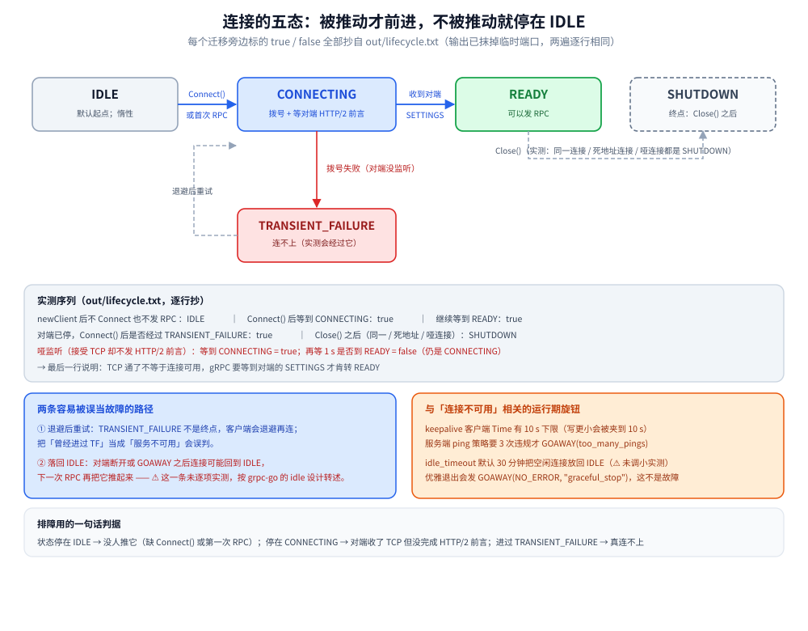

# gRPC 连接与生命周期

> 连接侧的全部内容：五态状态机怎么迁移、`grpc.NewClient` 为什么「连不上」、客户端 keepalive 的 10s 下限、服务端 `EnforcementPolicy` 到底怎么判违规、`GracefulStop` 与 `Stop` 的差别，以及连接寿命的三个旋钮。
>
> 内容整理自个人学习笔记，实测基于本机 Docker Desktop（容器 `golang:1.26-alpine` 内 go1.26.8 + grpc-go v1.84.0），原始输出见 `.workbuddy/tmp/exp/grpclab/out/lifecycle.txt`（可复跑；输出不含耗时，两遍逐行相同）。素材见 [素材清单](../../../../素材清单.md)。

---

## 一、连接的五态怎么迁移？

**本节要点**：`IDLE → CONNECTING → READY` 是「被推动」才发生的——`grpc.NewClient` 之后什么都不做会**永远停在 `IDLE`**；落回 `IDLE` 与落到 `TRANSIENT_FAILURE` 是两种不同的失败面；`Close()` 之后是 `SHUTDOWN`。



图怎么读：五个状态依次是空闲、连接中、就绪、暂时失败与已关闭；
实线是被「推动」才走的路（`Connect()` 或第一次 RPC → `CONNECTING` → `READY`），
虚线是失败与释放的路（拨号失败 → `TRANSIENT_FAILURE`；连接被断 → 可能回 `IDLE`；`Close()` → `SHUTDOWN`）。
⚠️ 图里每条迁移旁边标的 `true / false` 与状态名全部抄自 `out/lifecycle.txt`，不是示意值。

### 1.1 实测的迁移序列

```text
newClient 后不 Connect 也不发 RPC      : IDLE
Connect() 后等到 CONNECTING           : true
继续等到 READY                        : true
READY 后调一次一元                     : <nil>
对端已停，Connect() 后是否经过 TRANSIENT_FAILURE: true
此时发 RPC（不等 READY）           : rpc error: code = Unavailable desc = connection error: desc = "transport: Error while dialing: dial tcp 127.0.0.1:<port>: connect: connection refused"
此时发 RPC（WaitForReady，1s）     : rpc error: code = DeadlineExceeded desc = latest balancer error: connection error: desc = "transport: Error while dialing: dial tcp 127.0.0.1:<port>: connect: connection refused"
哑监听（不回前言）：等到 CONNECTING     : true
再等 1s 看它会不会到 READY             : false（CONNECTING）
Close() 之后同一连接                    : SHUTDOWN
Close() 之后死地址连接                  : SHUTDOWN
Close() 之后哑连接                      : SHUTDOWN
```

（错误文案里的端口已用占位符抹平，`<port>` 处原文是固定端口；这样两次运行才能逐行比对。）

### 1.2 四条判据

1. **`IDLE` 是默认起点，而且是「惰性」的**：`grpc.NewClient` 只解析 target、拉起后台 goroutine，
   不建立 TCP。不调 `conn.Connect()` 也不发 RPC，它就一直是 `IDLE`——所以「连接池非阻塞建连」是成立的，
   而「以为它连上了」是常见的误判。
2. **`CONNECTING` 能被看见，但需要条件**：对端**接受 TCP 却不发 HTTP/2 前言**时，
   客户端会一直停在 `CONNECTING`（实测 `再等 1s 看它会不会到 READY : false（CONNECTING）`）——
   因为 gRPC 要等到对端的 `SETTINGS` 才转 `READY`。这反过来证明**「TCP 通了」不等于「连接可用了」**。
3. **`TRANSIENT_FAILURE` 是「连不上」的状态**：指向一个没人监听的地址再 `Connect()`，
   会经过它；此后马上发 RPC 拿到的是**快速的** `Unavailable`（connection refused），
   而带 `WaitForReady` 的调用会**把 deadline 等满**再返回 `DeadlineExceeded`——
   两者的差别是「要不要等这条连接」。
4. **`SHUTDOWN` 是终点**：`conn.Close()` 之后，不管之前是哪种状态，`GetState()` 都返回 `SHUTDOWN`。

### 1.3 两条容易和它混淆的路径

- **落回 `IDLE` ≠ 失败**：连接被对端断掉（或 GOAWAY）之后，客户端可能回到 `IDLE`，
  下一次 RPC 再把它推起来；把它当成 `TRANSIENT_FAILURE` 会误判成「服务不可用」。
- **idle 超时是另一个旋钮**：service config 的 `idle_timeout`（grpc-go 默认 **30 分钟**）
  会把「长时间没活动的连接」主动放回 `IDLE` 以省资源。⚠️ **本实验没有把它调小去实测**——
  默认值太长，硬等不划算；这一条按官方默认值转述。

---

## 二、客户端 keepalive：`Time` 有 10s 下限

**本节要点**：客户端 `keepalive.ClientParameters.Time` **写小于 10 s 会被夹到 10 s**；实测用一个「看起来会被秒断」的配置证明它没有按 100 ms 发包。

### 2.1 实测设计：让服务端「一秒就出手」

如果客户端真按 100 ms 发 ping，那么服务端只要把 `EnforcementPolicy.MinTime` 压到 1 s，
**一秒内就会判违规并 `GOAWAY`**。所以：

- 服务端：`EnforcementPolicy{MinTime: 1s, PermitWithoutStream: true}`；
- 客户端：`ClientParameters{Time: 100ms, Timeout: 100ms, PermitWithoutStream: true}`；
- 空转 3 秒（不发任何 RPC），再看连接状态与一次调用。

实测结果：

```text
客户端 Time=100ms、服务端 MinTime=1s，空转 3s 后: READY
随后的调用                                    : <nil>
```

**结论**：客户端根本没有按 100 ms 发包——否则 1 s 内就会被断。这条与 `keepalive` 包的文档一致：

```go
// keepalive/keepalive.go:36
// After a duration of this time if the client doesn't see any activity it
// pings the server to see if the transport is still alive.
// If set below 10s, a minimum value of 10s will be used instead.
Time time.Duration
```

### 2.2 三个「默认值」要先知道

| 参数 | 默认 | 出处 |
|---|---|---|
| 客户端 `Time` 下限 | **10 s**（写更小会被夹） | `keepalive/keepalive.go:36` |
| 客户端 `Timeout`（等 ping 回包） | 20 s | `keepalive/keepalive.go` 注释 |
| 服务端 `EnforcementPolicy.MinTime` | **5 分钟** | `keepalive/keepalive.go` 注释 |
| 服务端 `ServerParameters.Time` | 2 小时（写小于 1 s 会被夹到 1 s） | `keepalive/keepalive.go` 注释 |
| 服务端 `ServerParameters.Timeout` | 20 s | 同上 |

⭐ **注意那个「5 分钟」**：服务端默认 `MinTime` 是 5 分钟，而客户端下限是 10 秒——
**默认配置下客户端本来就比服务端的容忍线更频繁**。文档对此给的解释是
「Time 在服务端因策略断开后会自动翻倍」，也就是说这是**刻意留给客户端的自适应空间**，不是 bug。

---

## 三、服务端 `EnforcementPolicy`：什么才算 ping 违规？

**本节要点**：判据在 `internal/transport/http2_server.go:886-932`——**要 3 次违规**才 `GOAWAY`；而当「连接上没有活跃流且服务端没开 `PermitWithoutStream`」时，判定阈值是**写死的 2 小时**，与 `MinTime` 无关。

### 3.1 为什么要用「裸 HTTP/2 客户端」

gRPC 客户端的 `Time` 有 10 s 下限（上一节），所以在真实客户端上要凑齐 3 次违规**至少要 40 秒**。
想在一秒内看清判据，就得自己发 PING 帧：本实验的裸客户端只做三件事——
写明文前言、写一个空 `SETTINGS`、然后按给定间隔发 `PING`，同时按 9 字节帧头读回帧，直到 `GOAWAY`。

### 3.2 三组对照（实测）

```text
   A 裸客户端 PermitWithoutStream=false + MinTime=1ms（看起来很宽松）
     → 发 ping=5 收 ACK=4 GOAWAY=有 code=ENHANCE_YOUR_CALM debug="too_many_pings"
   B 裸客户端 PermitWithoutStream=true  + MinTime=1h
     → 发 ping=5 收 ACK=4 GOAWAY=有 code=ENHANCE_YOUR_CALM debug="too_many_pings"
   C 裸客户端 PermitWithoutStream=true  + MinTime=1s，每 1.2s 才 ping 一次
     → 发 ping=3 收 ACK=3 GOAWAY=无（读窗口内没有 GOAWAY）
```

逐组读：

- **A 组是最有信息量的一组**：`MinTime=1ms` 看上去「宽松到不可能违规」，
  但它照样被断——因为**连接上没有活跃流**、且服务端没开 `PermitWithoutStream`，
  于是走了另一条分支，阈值是 `defaultPingTimeout = 2h`。**`MinTime` 在这里完全没参与判定。**
- **B 组**：换成 `PermitWithoutStream=true` 之后走了 `MinTime` 分支，`1h` 显然被违反；
  与 A 组同样在第 4 个 ping 被断——因为**两组都是「每次 ping 都违规」**，
  凑够 3 次违规需要的时间点相同。
- **C 组是合规客户端**：间隔 1.2 s > `MinTime` 1 s，一次都不违规，读窗口内没有任何 `GOAWAY`。
- **三组都是 `ACK=4` 或 `ACK=3`**：服务端**先回 `PING` ACK、再判策略**，
  所以最后一个 ping 即使触发了 `GOAWAY`，它的 ACK 也已经发出去了（这也是为什么「收到 ACK」不能证明没违规）。

### 3.3 判据原文（源码）

```go
// internal/transport/http2_server.go:882-883
maxPingStrikes     = 2
defaultPingTimeout = 2 * time.Hour

// internal/transport/http2_server.go:906-932（判据段）
t.mu.Lock()
ns := len(t.activeStreams)
t.mu.Unlock()
if ns < 1 && !t.kep.PermitWithoutStream {
	// Keepalive shouldn't be active thus, this new ping should
	// have come after at least defaultPingTimeout.
	if t.lastPingAt.Add(defaultPingTimeout).After(now) {
		t.pingStrikes++
	}
} else {
	// Check if keepalive policy is respected.
	if t.lastPingAt.Add(t.kep.MinTime).After(now) {
		t.pingStrikes++
	}
}

if t.pingStrikes > maxPingStrikes {
	t.controlBuf.put(&goAway{code: http2.ErrCodeEnhanceYourCalm, debugData: []byte("too_many_pings"), closeConn: errors.New("got too many pings from the client")})
}
```

两条不能想当然的细节：

- **`pingStrikes > maxPingStrikes` 且 `maxPingStrikes = 2`** → 要 **3** 次违规，不是 2 次；
- **第一个 ping 不会记违规**：`lastPingAt` 的零值是「公元 1 年」，`零值 + 阈值` 不可能晚于 `now`，
  所以第一次总是通过。实测里「发 5 个 ping、第 4 个被断」正是「第 2~4 个各记一次」的结果。

### 3.4 真实 gRPC 客户端上的用户可见症状

同一个判据在真实客户端上要等更久，但症状更直接（`Time=10s`、服务端 `MinTime=30s`、挂一条 50 s 的在途 RPC）：

```text
     → code=Unavailable 文案含 too_many_pings=true
     → grpc-go 自己打的 ERROR 日志含 too_many_pings=true
```

两点：① 错误**落在在途的那条 RPC 上**（`Unavailable` + `too_many_pings`）；
② grpc-go 默认 logger 会额外打一行 ERROR（`Client received GoAway with error code ENHANCE_YOUR_CALM...`），
**这一行不需要开任何日志开关**。按 3 次违规 × 10 s 下限推算，客户端至少要 **40 秒**才会被断——
所以「偶发、几十秒后才挂」的连接问题，要优先怀疑这一条。

---

## 四、`GracefulStop` 与 `Stop`：一个等在途、一个直接掐

**本节要点**：`GracefulStop` 会**等在途 RPC 跑完**再关；`Stop` 立刻掐断。而 `GracefulStop` 遇到**永不结束的流会一直等**——所以生产上的正确姿势是「先 `GracefulStop`，超时后补 `Stop`」。

### 4.1 有在途流时：一个等、一个掐（实测）

```text
4a GracefulStop（N=5，每条 300ms）：收到首条后触发，最终 recv=5 endErr=EOF
4a 停止后再发一次一元                              : rpc error: code = DeadlineExceeded desc = latest balancer error: connection error: desc = "transport: Error while dialing: dial tcp 127.0.0.1:<port>: connect: connection refused"
4b Stop（N=5，每条 500ms）：收到首条后触发，最终 recv=1 endErr=rpc error: code = Unavailable desc = error reading from server: <EOF|RST>
```

- **4a**：客户端在收到第 1 条消息后触发 `GracefulStop`，最终仍然**收满 5 条**并以 `EOF` 正常收尾——
  说明 `GracefulStop` 确实等在途流跑完才走；
- **4b**：同样在第 1 条后触发 `Stop`，客户端**只收到 1 条**，随后拿到 `Unavailable`——
  在途流被直接掐断（desc 在 `EOF` 与 `connection reset by peer` 之间摆动，取决于 TCP 是 FIN 还是 RST）；
- **4a 那一行「停止后再发一次一元」**说明另一个性质：`GracefulStop` 返回之后**监听已经关掉**，
  新调用拿到的是 `connection refused`，不是「服务还在但拒绝新流」。

### 4.2 永不结束的流：`GracefulStop` 会一直等（实测）

```text
4c 双向流未 CloseSend，GracefulStop 1s 后仍未返回（在等这条永不结束的流）
4c 补一次 Stop() 后，客户端这条流读到           : rpc error: code = Unavailable desc = closing transport due to: connection error: desc = "error reading from server: <EOF|RST>", received prior goaway: code: NO_ERROR, debug data: "graceful_stop"
```

3 段的细节：客户端建了一条双向流、发了 1 条、收到 ack 之后**故意不 `CloseSend`**，
于是服务端 handler 永远退不出循环（`bidiHandler` 只靠 `io.EOF` 退出），
`GracefulStop` 就**一直不返回**（实测 1 秒后仍未返回）；补一次 `Stop()` 之后它才返回，
客户端那条流收到 `Unavailable`，desc 里带着 `received prior goaway: code: NO_ERROR, debug data: "graceful_stop"`。

⭐ 这也给出了 `GOAWAY` 另一种来源的**实测证据**：`graceful_stop` 是服务端优雅退出时打的 debug data，
错误码是 `NO_ERROR`——即「不是错误，是让你换连接」。

### 4.3 生产上的正确姿势

```go
stopped := make(chan struct{})
go func() { srv.GracefulStop(); close(stopped) }()

select {
case <-stopped:
case <-time.After(20 * time.Second): // 兜底：别让部署流水线卡死
	srv.Stop()
	<-stopped
}
```

**为什么必须两段式**：只调 `GracefulStop()`，一条永不结束的流就能把滚动更新**永久挂住**（4.2 的实测）；
只调 `Stop()`，在途请求全被掐断（4b）。K8s 侧的 `preStop` sleep 是给「从 Endpoint 摘除」留时间，
**和 `GracefulStop` 不是二选一**（清单见 [生态与网关.md](生态与网关.md) 的使用节）。

---

## 五、连接的寿命：三个旋钮

**本节要点**：`MaxConnectionAge` / `MaxConnectionAgeGrace` / `MaxConnectionIdle` 三个服务端参数决定「连接活多久」；长连接对 LB 是负担，所以要主动让它重建。

| 参数 | 作用 | 默认 |
|---|---|---|
| `ServerParameters.MaxConnectionIdle` | 连接上**没有在途 RPC** 超过这个时长就发 `GOAWAY` 关掉 | 无穷 |
| `ServerParameters.MaxConnectionAge` | 连接**存在**超过这个时长就发 `GOAWAY`（**会加 ±10% 随机抖动**打散重连风暴） | 无穷 |
| `ServerParameters.MaxConnectionAgeGrace` | `MaxConnectionAge` 之后再等多久就**强制**关闭 | 无穷 |

```go
srv := grpc.NewServer(grpc.KeepaliveParams(keepalive.ServerParameters{
	MaxConnectionAge:      30 * time.Minute,
	MaxConnectionAgeGrace: 5 * time.Minute,
	MaxConnectionIdle:     15 * time.Minute,
	Time:                  2 * time.Hour,
	Timeout:               20 * time.Second,
}))
```

两条判据：

- **为什么要设**：客户端会长期复用一条连接（实测 200 次一元只拨号 1 次），
  于是扩容出来的新 Pod 可能长时间分不到流量、客户端侧也很难触发重解析。
  `MaxConnectionAge` 让连接**定期重建**，LB 才有机会重平衡；
- **`MaxConnectionAgeGrace` 不能省**：它是「发了 `GOAWAY` 之后还给在途 RPC 多久」，
  设小了等于变相 `Stop()`。

---

## 使用：连接侧的配置清单（Go / Java / K8s）

**本节要点**：一份可直接抄的配置——客户端要有 keepalive 与超时，服务端要有 keepalive 策略与连接寿命，退出要走两段式。

### Go 侧

```go
// 客户端：开 keepalive（Time 别小于 10s，会被夹）+ 连接参数
conn, _ := grpc.NewClient(target,
	grpc.WithTransportCredentials(insecure.NewCredentials()),
	grpc.WithKeepaliveParams(keepalive.ClientParameters{
		Time:                30 * time.Second, // <10s 会被夹到 10s
		Timeout:             5 * time.Second,  // 不设默认 20s
		PermitWithoutStream: true,             // 没有在途 RPC 时也保活
	}),
)

// 服务端：保活探测 + 连接寿命 + 违规策略
srv := grpc.NewServer(
	grpc.KeepaliveParams(keepalive.ServerParameters{
		MaxConnectionAge:      30 * time.Minute,
		MaxConnectionAgeGrace: 5 * time.Minute,
		Time:                  2 * time.Hour,
		Timeout:               20 * time.Second,
	}),
	grpc.KeepaliveEnforcementPolicy(keepalive.EnforcementPolicy{
		MinTime:             30 * time.Second, // 与客户端 Time 配套
		PermitWithoutStream: true,             // 不开的话：无流时的阈值是写死的 2h
	}),
)
```

### Java 侧

```java
// 客户端
ManagedChannel ch = ManagedChannelBuilder.forTarget(target)
    .keepAliveTime(30, TimeUnit.SECONDS)
    .keepAliveTimeout(5, TimeUnit.SECONDS)
    .keepAliveWithoutCalls(true)
    .build();

// 服务端
Server server = NettyServerBuilder.forPort(50051)
    .keepAliveTime(2, TimeUnit.HOURS)
    .keepAliveTimeout(20, TimeUnit.SECONDS)
    .permitKeepAliveTime(30, TimeUnit.SECONDS)      // 对应 EnforcementPolicy.MinTime
    .permitKeepAliveWithoutCalls(true)              // 对应 PermitWithoutStream
    .maxConnectionAge(30, TimeUnit.MINUTES)         // 对应 MaxConnectionAge
    .maxConnectionAgeGrace(5, TimeUnit.MINUTES)
    .build();
```

⚠️ Java 的 `permitKeepAliveTime` 默认是 **2 小时**（比 Go 的 5 分钟更严），
所以 Java 服务端 + Go 客户端时**必须显式下调**，否则一个 30 s 的 keepalive 客户端会被判违规断连。
Java 侧完整依赖见 [接入gRPC.md](../../../../01-编程语言/java/接入gRPC.md)。

### K8s 侧

```yaml
lifecycle:
  preStop:
    exec:
      command: ["/bin/sh", "-c", "sleep 10"]   # 给 Endpoint 摘除留时间，不是替代 GracefulStop
```

三条：`preStop` 的 sleep 与 `GracefulStop` **要一起用**；
`terminationGracePeriodSeconds` 必须**大于**「sleep + `GracefulStop` 兜底超时」；
探针用 gRPC 健康协议（原因见 [故障排查与调试.md](故障排查与调试.md) 第七节）。

---

## 延伸追问

- **`grpc.NewClient` 之后为什么一直没连上？** → 它是惰性的，不 `Connect()`、不发 RPC 就停在 `IDLE`（第一节）。
- **怎么判断「TCP 通了但连接不可用」？** → 看状态：对端收了 TCP 却不发 HTTP/2 前言时，
  客户端一直停在 `CONNECTING`，永远到不了 `READY`（第一节 1.2 的哑监听实验）。
- **客户端 `Time` 设 1 秒会怎样？** → 会被夹到 10 秒，实际按 10 秒发包；
  实测里「服务端 `MinTime=1s`、空转 3 秒仍 `READY`」就是这条的证据（第二节）。
- **为什么「没开 `PermitWithoutStream`」反而更严？** → 不是更严，而是**换了阈值**：
  无活跃流时判据从 `MinTime` 变成写死的 2 小时，所以「1 ms 的 `MinTime` 也照样被断」（第三节 A 组）。
- **收到 `PING` ACK 说明没违规吗？** → 不能这么推。服务端**先回 ACK 再判策略**，
  触发 `GOAWAY` 的那个 ping 也已经 ACK 过了（第三节 3.2）。
- **`GracefulStop` 会不会挂住？** → 会，只要有一条永不结束的流（实测 1 秒后仍未返回）；
  正确做法是加超时兜底再 `Stop()`（第四节 4.3）。
- **`GOAWAY(NO_ERROR, graceful_stop)` 是故障吗？** → 不是，是服务端在优雅退出；
  客户端会自动重连，真正的故障才带 `ENHANCE_YOUR_CALM` 这类错误码（第四节 4.2）。
- **为什么长连接反而对 LB 不友好？** → 连接复用得越好，流量越黏在少数 Pod 上；
  靠 `MaxConnectionAge` 定期重建才能重平衡（第五节）。

---

## 关联

- [README.md](README.md) — 本目录的目录导读（gRPC 知识库总纲）
- [基础概念.md](基础概念.md) — `IDLE` 惰性建连与连接复用的第一遍读数
- [HTTP2机制.md](HTTP2机制.md) — `GOAWAY` / `RST_STREAM` / `PING` 在协议层是什么
- [生态与网关.md](生态与网关.md) — 长连接与 LB、K8s 探针与 `preStop` 清单
- [故障排查与调试.md](故障排查与调试.md) — 把本篇这些状态归到「哪一层」的排障顺序
- [安全与认证.md](安全与认证.md) — 握手发生在 `CONNECTING` 这一段的细节
- [拦截器与元数据.md](拦截器与元数据.md) — `DeadlineExceeded` 与 `Unavailable` 的语义差别
- [四种通信模式.md](四种通信模式.md) — 「永不结束的流」为什么存在：`bidiHandler` 只靠 `io.EOF` 退出
