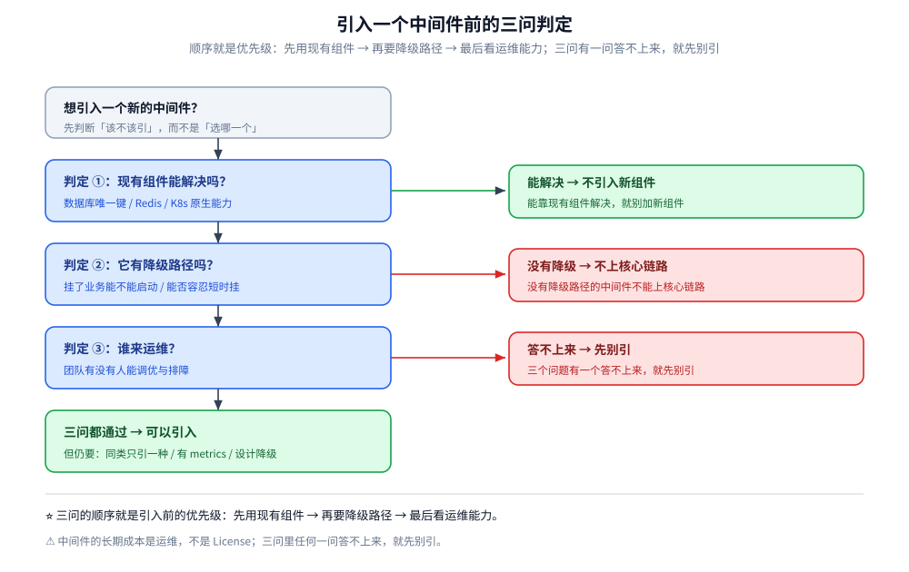
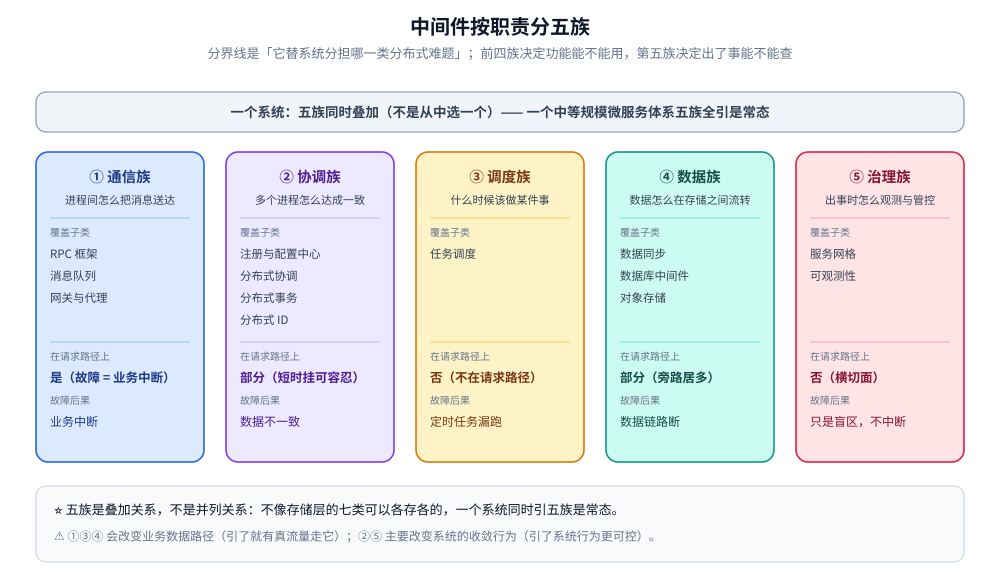
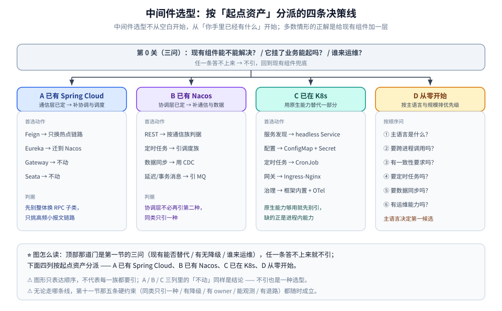

# 中间件选型

> 中间件选型的第一性原理：**不是"选哪一款"，而是"要不要引、引哪一族、引哪一子类、谁来兜底"**。
> 
> 本篇只回答**族与子类层面**的问题 —— **不展开任何具体产品的选型判断**，产品级对比一律交给族内专篇。
>
> ⭐ **和 [数据库选型对比.md](../数据存储/数据库选型对比.md) 的关系**：那篇按「数据形态」把存储分成并列的七类（可以各存各的）；
> 本篇按「系统职责」把中间件分成叠加的五族（一个系统同时用 RPC + MQ + 注册中心 + 网关是常态）。
>
> ⭐ **分层原则**：**本篇只到「子类」粒度**（用哪一类），**族内专篇才到「产品」粒度**（用哪一个）。
> 
> 出现「产品名 + 场景 → 推荐」这组形式，就应该挪进族内专篇。
> 族内专篇：[RPC框架选型对比.md](RPC框架/RPC框架选型对比.md)、[消息队列选型对比.md](消息队列/消息队列选型对比.md)、
> [网关选型对比.md](网关与代理/网关选型对比.md)、[xxl-job.md](任务调度/xxl-job.md)、[Nacos.md](注册与配置中心/Nacos.md)、
> [分布式协调选型对比.md](分布式协调/分布式协调选型对比.md)。
>
> 内容整理自个人学习笔记。素材见 [素材清单.md](../../素材清单.md)。
> 
> ⚠️ 实测口径：本篇**不含跨产品横评实测**，全部为结构与模型的定性对照。

---

## 一、引入一个中间件前，必须先过哪三问？

**本节要点**：中间件选型第一步**不是看产品**，是先过这三关。三关任一答不上来，就先别引。

| # | 问题 | 答"是"的表现 | 答不上来时 |
|---|---|---|---|
| ① | **现有组件能不能解决？** | 用数据库唯一键代替分布式锁、用 K8s headless Service 代替注册中心、用 Redis 代替调度器 —— 都能凑合过 | 硬着头皮引 → 多一套组件、多一套运维、多一个故障域 |
| ② | **它挂了业务能起吗（有没有降级路径）？** | 注册中心挂了走本地缓存、MQ 挂了落本地表、配置中心挂了用上次快照启动 | ⚠️ **没有降级路径的中间件不能上核心链路** |
| ③ | **谁来运维（谁负责升级 / 调优 / 排障）？** | 团队里有人能接住慢查询、堆内存、连接数、磁盘水位 | 没 owner 的中间件迟早变成事故源 |

> ⭐ **这三关比任何功能对照表都硬**。很多团队选错不是选错产品，而是**产品没选错、但根本没想清楚要不要引**。

⭐ **两条铁律**：

- **同类只引一种**：两套注册中心 / 两套 MQ 会让排查成本翻倍。
- **必须有降级路径**：没有降级路径的中间件，不能上核心链路。

---

## 二、中间件按职责分成哪五族？

**本节要点**：分界线是**它替系统分担哪一类分布式难题**。前四族决定功能能不能用，第五族决定出了事能不能查。

| 族 | 一句定位 | 覆盖子类 | 是否在请求路径上 |
|---|---|---|---|
| **① 通信族** | 进程间怎么把消息送达 | RPC 框架 / 消息队列 / 网关与代理 | ✅ 是（故障 = 业务中断） |
| **② 协调族** | 多个进程怎么达成一致 | 注册与配置中心 / 分布式协调 / 分布式事务 / 分布式 ID | ⚠️ 部分（故障 = 数据不一致） |
| **③ 调度族** | 什么时候该做某件事 | 任务调度 | ❌ 否（故障 = 定时任务漏跑） |
| **④ 数据族** | 数据怎么在存储之间流转 | 数据同步 / 数据库中间件 / 对象存储 | ⚠️ 部分（故障 = 数据链路断） |
| **⑤ 治理族** | 出事时怎么观测与管控 | 服务网格 / 可观测性 | ❌ 否（横切面，不参与业务功能） |

⭐ **五族的相互关系**：

- ① **通信族**是业务的主动脉；
- ② **协调族**是神经；
- ③ **调度族**是时钟；
- ④ **数据族**是血管里的搬运工；
- ⑤ **治理族**是体检与保险。
- ①③④ 会**改变业务数据路径**（引了就有真流量走它），②⑤ 主要改变**系统的收敛行为**（引了系统行为更可控）。
- **五族不是互斥的**：一个中等规模微服务体系，五族同时引都是常态。

---

## 三、通信族内部：三个子类怎么分工？

**本节要点**：这一族的故障直接等于业务中断，所以**降级路径和主备切换**比功能表更重要。
**本节只回答「用哪一类子类」，不回答「用哪一个产品」。**

| 场景 | 用哪个子类 | 该子类里有哪些产品（仅示意，不构成选型） | 详见 |
|---|---|---|---|
| 同步调用、需要编译期契约 | **RPC 框架** | gRPC / Dubbo / Thrift / Spring Cloud + Feign | [RPC框架选型对比.md](RPC框架/RPC框架选型对比.md) |
| 异步解耦、削峰、事件驱动 | **消息队列** | Kafka / RabbitMQ / RocketMQ / Pulsar / NATS / ActiveMQ | [消息队列选型对比.md](消息队列/消息队列选型对比.md) |
| 南北向入口、协议转换、鉴权限流 | **网关与代理** | APISIX / Nginx / Kong / Traefik / Envoy | [网关选型对比.md](网关与代理/网关选型对比.md) |
| 东西向服务间流量治理 | **服务网格**（属治理族，不在通信族） | Istio / Linkerd / Consul Connect | [README.md](服务网格/README.md) |

⭐ **四条与子类无关的边界判据**：

1. **同步 vs 异步**：RPC 走同步、MQ 走异步，两者**互补而非替代**，可以并存。
2. **请求路径 vs 旁路**：RPC / 网关在请求路径上；MQ 一半在、一半不在（异步链路才是它的战场）。
3. **协议面向谁**：南北向（外部 → 内部）看网关；东西向（服务 ↔ 服务）看 RPC 或服务网格。
4. ⚠️ **不要用网关做东西向流量**，也不要用 RPC 做异步。

⚠️ **层次错位陷阱**：**Spring Cloud 不是 gRPC / Dubbo 的竞品** —— 前者是「微服务组件集」，后者是「调用协议」。真正的对比是「调用层用 RPC 还是 REST」。

---

## 四、协调族内部：四个子类怎么分工？

**本节要点**：这一族不运业务流量，但**决定系统能不能正确协作**。它短时挂可容忍（有本地缓存），长期挂则新实例上不来、旧实例摘不掉。
**本节只回答「用哪一类子类」。**

| 场景 | 用哪个子类 | 该子类里有哪些产品（仅示意） | 详见 |
|---|---|---|---|
| 服务实例的动态发现 + 配置集中下发 | **注册与配置中心** | Nacos / etcd / Consul / ZooKeeper / Eureka | [Nacos.md](注册与配置中心/Nacos.md) |
| 分布式锁 / 选主 / 变更监听 | **分布式协调** | etcd / Redis / ZooKeeper / 数据库唯一键 | [分布式协调选型对比.md](分布式协调/分布式协调选型对比.md) |
| 跨服务、跨库的数据一致性 | **分布式事务** | 2PC / TCC / Saga / 本地消息表 / 事务消息 | [分布式事务.md](../../04-架构与系统/分布式/理论/分布式事务.md) |
| 全局唯一 ID 生成 | **分布式 ID** | UUID / 雪花 / 号段 / 数据库自增 | [分布式ID.md](../../04-架构与系统/分布式/理论/分布式ID.md) |

⭐ **两条与子类无关的判据**：

1. **注册与配置中心**是「**服务实例的路由信息**」，**分布式协调**是「**进程间的互斥与选举**」—— 两者常被混淆，但职责不同。
2. ⚠️ **别把纯 KV 组件当配置中心**：只有 KV 没有版本管理、灰度、审计、回滚，就缺了配置中心的核心价值。

---

## 五、调度族内部：一个子类，只看要不要引

**本节要点**：这一族最容易被低估 —— 常见的「定时任务重复执行」事故几乎都源于「多副本 + 语言内置的定时注解」。
**本节只回答「要不要用任务调度子类」。**

| 场景 | 用哪个子类 | 该子类里有哪些产品（仅示意） | 详见 |
|---|---|---|---|
| 分布式定时任务、定时对账、报表、清理、补偿 | **任务调度平台** | XXL-JOB / K8s CronJob / Airflow / Quartz / `@Scheduled` | [xxl-job.md](任务调度/xxl-job.md) |

⭐ **三条与产品无关的硬要求**：

1. **多副本不能重复执行** —— 这是引入调度平台的第一动因。
2. **失败要有重试与告警** —— 没有重试的定时任务是定时数据事故。
3. **调度器挂了任务仍可补跑** —— 依赖调度器单点 = 任务全线停摆。

⚠️ **反例**：单机 `@Scheduled` 不是分布式方案，多副本部署时**每个副本都会执行一次**。

---

## 六、数据族内部：三个子类怎么分工？

**本节要点**：这一族是「存储」与「通信」的混血 —— 本身不承载业务逻辑，但连接了两端存储。它的选型更像存储层。
**本节只回答「用哪一类子类」。**

| 场景 | 用哪个子类 | 该子类里有哪些产品（仅示意） | 详见 |
|---|---|---|---|
| 权威库 → 派生存储（ES / CH / 图库）的数据搬运 | **数据同步** | Canal / Debezium / 定时任务 / 应用双写 | [README.md](数据同步/README.md) |
| 单库容量到顶后的分片路由与读写分离 | **数据库中间件** | ShardingSphere / Vitess | [关系型选型对比.md](../数据存储/关系型/关系型选型对比.md) |
| 非结构化数据的旁路持久化 | **对象存储** | S3 / OSS / MinIO | —— |

⭐ **三条与子类无关的判据**：

1. **数据同步的默认答案是 CDC**，不是应用双写 —— 双写不在同一事务里，第二步失败就产生不一致。
2. **数据库中间件是「下一步」，不是「第一步」** —— 单库能扛就先穷尽索引、缓存、读写分离。
3. ⚠️ **对象存储本质是存储，不是协作组件** —— 它和 `../数据存储/` 下的七类并列。挂在中间件下时应标注为「**非结构化数据的旁路存储**」。

---

## 七、治理族内部：两个子类怎么分工？

**本节要点**：这一族**不参与业务功能**，只横向切一刀。它决定「出事时能不能查」「出事后能不能防」。
**本节只回答「用哪一类子类」。**

| 场景 | 用哪个子类 | 该子类里有哪些产品（仅示意） | 详见 |
|---|---|---|---|
| 已有 K8s，想要「零侵入」的服务治理（mTLS、重试、可观测、限流） | **服务网格** | Istio / Linkerd / Consul Connect | [README.md](服务网格/README.md) |
| 只想先有指标、日志、链路 | **可观测性** | Prometheus / Loki / Jaeger / OTel | [可观测性选型对比.md](可观测性/可观测性选型对比.md) |

⭐ **两条与子类无关的判据**：

1. **网格不是必选项** —— 应用数量少、团队没有专职 SRE 时，框架内置能力 + OTel 往往够用。
2. **可观测性是必选项** —— 无论引不引网格，指标、日志、链路三件套都该有。

---

## 八、同一组维度上怎么跨族对照？

**本节要点**：跨族拉平看，找出各族的**核心判据差异**。⚠️ 这张表故意不带"谁快谁慢"。

| 维度 | 通信族 | 协调族 | 调度族 | 数据族 | 治理族 |
|---|---|---|---|---|---|
| **在请求路径上？** | ✅ 是 | ⚠️ 部分 | ❌ 否 | ⚠️ 部分 | ❌ 否 |
| **故障后果** | 业务中断 | 数据不一致 | 定时任务漏跑 | 数据链路断 | 无业务影响，只是盲区 |
| **降级路径** | 必须（重试 / 熔断 / 兜底） | 必须（本地缓存 / 快照） | 可选（任务手工补跑） | 必须（对账 / 重放） | 无（大不了没观测） |
| **一致性要求** | 中（调用幂等即可） | ⭐ 高（锁与选主） | 低 | 中（对账保证） | 无 |
| **典型子类** | RPC / MQ / 网关 | 注册配置 / 协调 / 事务 / ID | 任务调度 | 数据同步 / 数据库中间件 / 对象存储 | 网格 / 可观测性 |
| **契合语言** | 强相关 | 中等 | 弱 | 弱 | 弱 |
| **典型运维面** | 集群 + 磁盘 + 调优 | 小（单二进制） | 小 | 中等 | ⚠️ 大（网格） |

⭐ **读表顺序**：

1. **先看"在不在请求路径上"** → 决定降级路径的严格程度；
2. **再看"故障后果"** → 决定这个组件能不能上核心链路；
3. **最后看"契合语言"** → ⭐ 常常比技术对照表更早决定答案。

---

## 九、契合语言对「族 / 子类」的影响

**本节要点**：**只讲语言主栈对"族与子类选择"的影响**，不展开到具体产品（产品级对比在各族专篇的"契合语言"一节）。
⭐ 客户端滞后不是「少个 API」，而是**运维能力缺失**（出问题时只能进容器手敲）。

| 语言 | 通信族 | 协调族 | 调度族 | 数据族 |
|---|---|---|---|---|
| **Java** | ⭐ 三个子类全覆盖，无短板 | ⭐ 四个子类全覆盖 | ⭐ 全覆盖 | ⭐ 全覆盖 |
| **Go** | RPC 子类与 MQ 子类均有官方或成熟客户端；网关子类照常 | ⭐ 覆盖，etcd 生态最贴 | 有官方 executor | 生态良好 |
| **PHP** | ⚠️ **RPC 子类基本不可用**（流式模型不合）；MQ 子类中**只有 AMQP 系的客户端不凑合** | 消费协议即可 | 走 HTTP 接口 | 走 HTTP / 网关 |
| **多语言混合** | ⭐ **RPC 子类走 IDL 契约 + MQ 子类走语言无关协议**是最优组合 | 协议公开的优先 | 多语言 executor | 走 HTTP / CLI |

⭐ **三条结论**：

> **① Java 团队**：几乎不失分，判据要退回**治理能力**与**运维面**，而不是「驱动有没有」。
> 
> **② Go 团队**：三个通信子类都能用；协调族优先协议公开的子类。
> 
> **③ PHP / 多语言混合团队**：⚠️ **RPC 子类不适合让 PHP 直接当客户端**；消息队列子类应优先选语言无关协议（AMQP 系）的那一支。

> ⚠️ **反面教训**：**把「主语言是什么」放到最后再考虑** —— 功能对照表看着都合适，落地却在客户端上翻车：
> 
> ① **Java 团队**几乎不失分，可以只看治理能力与运维面；
> 
> ② **Go 团队**通信族与协调族都能走通，但**调度族与数据族的「官方客户端」要逐个确认**（「有官方 executor」与「有 HTTP 接口」是两回事）；
> 
> ③ **PHP / 多语言混合团队**——⚠️ **RPC 子类别让 PHP 直接当客户端**（流式模型不合），
>    MQ 子类优先选**语言无关协议**（AMQP 系）的那一支，否则会先撞上「所需 API 在这门语言里还没落地」。
> 
> ⭐ 一句话：客户端滞后不是「少个 API」，而是**运维能力缺失** —— 出问题时只能进容器手敲，排障时间直接翻倍。

---

## 十、按「起点资产」怎么决策？

**本节要点**：中间件选型不从空白开始，从「你手里已经有什么」开始。**多数情形的正解是给现有组件加一层，而不是引新组件。**

图怎么读：顶部那道门是第一节的三问（现有能否替代 / 有无降级 / 谁来运维），**任一条答不上来就不引**；下面四列按起点资产分派 —— A 已有 Spring Cloud（通信层已定，补协调与调度）、B 已有 Nacos（协调层已定，只差通信与数据）、C 已有 K8s（用原生能力替代一部分中间件）、D 从零开始（按主语言与规模排优先级）。

### 10.1 决策线 A：已有 Spring Cloud 全家桶

| 状况 | 首选动作 |
|---|---|
| 通信层已用 Feign + Ribbon | ⚠️ **先别整体换 RPC 子类**：把**高频小报文的热点链路**挑出来单独换 |
| 注册配置已用 Nacos / Eureka | 存量 Eureka 优先迁移到 Nacos（Eureka 已停更） |
| 网关已用 Spring Cloud Gateway | 除非要动态路由与丰富插件，否则不动 |
| 分布式事务已用 Seata | 除非链路延迟成为痛点，否则不动 |

### 10.2 决策线 B：已有 Nacos（协调层已定）

| 状况 | 首选动作 |
|---|---|
| 通信层还是 REST | ⭐ 按第三节「通信族」判据决定要不要引 RPC / MQ 子类 |
| 有定时任务需求 | 引调度族（优先与现有注册中心集成的方案） |
| 有数据同步需求 | 引数据族的 CDC 子类，而不是应用双写 |
| 有延迟消息 / 事务消息需求 | 引消息队列子类里支持这两项能力的方案 |

### 10.3 决策线 C：已在 K8s

| 状况 | 首选动作 |
|---|---|
| 需要服务发现 | ⭐ **优先 K8s headless Service + 客户端负载均衡**，别急着引注册中心 |
| 需要配置管理 | ConfigMap + 外部 Secret；⚠️ 无灰度、无审计是代价 |
| 需要定时任务 | K8s CronJob；有复杂 DAG 依赖再引调度族的独立方案 |
| 需要网关 | Ingress-Nginx / Traefik；要动态路由与插件再升 API 网关 |
| 需要治理 | ⭐ **框架内置 + OTel 先上**，服务网格作为后续升级项 |

### 10.4 决策线 D：从零开始

**按顺序问**：

1. **主语言是什么？** → 决定通信族与协调族的第一候选（见第九节）。
2. **要不要跨进程调用？** → 要 → 通信族（RPC 或 MQ 子类）；不要 → 单体先跑。
3. **有没有一致性要求？** → 跨服务事务 → 协调族（事务子类 + 注册配置子类）。
4. **要不要定时任务？** → 有 → 调度族。
5. **要不要数据同步？** → 有 → 数据族（CDC 优先）。
6. **有没有运维能力？** → 无 → 全部优先托管形态或 K8s 原生。

---

## 十一、五条与语言无关的硬约束

**本节要点**：无论哪一族，这五条**任何时候都要满足**，否则引入即埋雷。

1. **同类只引一种**：两套注册中心 / 两套 MQ 会让排查成本翻倍。
2. **必须有降级路径**：注册中心挂了本地缓存兜、MQ 挂了落本地表、配置中心挂了用上次快照启动。
3. **必须有 owner**：没人接得住调优与排障的中间件不能上核心链路。
4. **必须能观测**：metrics 端点 + 告警 + 日志，接不进可观测性体系的中间件等于黑盒。
5. **必须有退路**：格式能导出、接口有标准协议、业务不绑定专有 API —— 三年后想换时不至于推倒重来。

---

## 使用：本目录怎么读

**本节要点**：本篇是**族级与子类级横评 + 决策线**；**产品级选型在各族专篇**。

| 你在问什么 | 看哪里 |
|---|---|
| 要不要引中间件？引哪一族？引哪一子类？ | ⭐ **本篇** |
| RPC 子类内部：具体用哪个框架？ | [RPC框架选型对比.md](RPC框架/RPC框架选型对比.md) |
| MQ 子类内部：六款怎么对比？ | [消息队列选型对比.md](消息队列/消息队列选型对比.md) |
| 网关子类内部：五种含义与选型？ | [网关选型对比.md](网关与代理/网关选型对比.md) |
| 注册配置子类：AP / CP 与三个高频误区？ | [Nacos.md](注册与配置中心/Nacos.md) |
| 调度子类：分布式定时任务的 9 维对比？ | [xxl-job.md](任务调度/xxl-job.md) 第八节 |
| 协调子类：锁 / 选主 / 事务 / ID 方案对比？ | [分布式协调选型对比.md](分布式协调/分布式协调选型对比.md)、[分布式事务.md](../../04-架构与系统/分布式/理论/分布式事务.md)、[分布式ID.md](../../04-架构与系统/分布式/理论/分布式ID.md) |
| 治理子类：服务网格 vs 框架内置？ | [README.md](服务网格/README.md)、[可观测性选型对比.md](可观测性/可观测性选型对比.md) |

---

## 延伸追问

- **为什么中间件的隐性成本是运维，不是 License？** → 中间件的价值不在功能本身（几乎都能开源拿到），而在**长期稳定的运行**。谁能在凌晨三点定位它的故障，才是真正的成本项。
- **「同类只引一种」是不是太绝对？** → 大多场景成立，但有两个例外：① **通信族**里 MQ 与 RPC 是互补（同步 vs 异步），可以并存；② **协调族**里注册中心与协调底座可能是同一套，也可能分开。**判据是「它们承担的是同一类职责吗」**。
- **K8s 会不会把一半中间件干掉？** → 会替代一部分：**注册中心（headless Service）、配置中心（ConfigMap）、调度（CronJob）、网关（Ingress）** 都有 K8s 原生替代。但**协议契约（RPC）、投递语义（MQ 事务 / 延迟）、强一致协调（etcd / 锁）、数据同步（CDC）** 这些**进程内能力** K8s 给不了。
- **服务网格是不是必选？** → 不是。**应用 < 20 个、团队没有专职 SRE** 时，框架内置拦截器 + OTel 往往够用；引网格是白多一个数据面 + 一套控制面。
- **新项目选型最该先做的一件事？** → ⭐ **先过第一节的三问**：现有组件能不能解决？挂了业务能起吗？谁来运维？三关过了再谈产品。
- **为什么对象存储不该挂在中间件下？** → 它本质是**存储**，和数据库、缓存并列 —— 它不参与"协作"，只承载非结构化数据。挂在中间件下时，至少要在文档里明确标注它的定位为「非结构化数据的旁路存储」，避免分类混乱。
- **本篇和族内专篇的分界线在哪？** → ⭐ **产品名**。本篇只到「子类」粒度（用哪一类），族内专篇才到「产品」粒度（用哪一个）。本篇里出现的产品名**只作示意，不构成选型判断**。

---

**一句话总结**：

> 中间件按「系统职责」分五族：**通信 / 协调 / 调度 / 数据 / 治理**。
> 五族是**叠加**的（一个系统同时用五个是常态），不是**并列**的（不像存储层的七类可以各存各的）。
> **本篇只到「子类」粒度，族内专篇才到「产品」粒度** —— 出现「产品名 + 场景 → 推荐」就应该挪进专篇。
> 中间件选型的第一问不是「选哪个产品」，而是 **「不引它，现有组件能不能解决？」**；
> 最后一条铁律是 **「没有降级路径的中间件，不能上核心链路」**。

---

## 关联

- ⭐ **各族的族内横评（产品级选型在这里）**：
  - [RPC框架选型对比.md](RPC框架/RPC框架选型对比.md) — 五类 RPC 框架横向对照 + 契合语言 + 起点资产决策线
  - [消息队列选型对比.md](消息队列/消息队列选型对比.md) — 六款 MQ 11 维对比 + 事务 / 延迟方案
  - [网关选型对比.md](网关与代理/网关选型对比.md) — 五种「网关」含义澄清 + 四组 Nginx 实测
  - [xxl-job.md](任务调度/xxl-job.md) — 分布式定时任务的 9 维对比（第八节）
  - [Nacos.md](注册与配置中心/Nacos.md) — 注册配置中心的 AP/CP 与三个高频误区
  - [分布式协调选型对比.md](分布式协调/分布式协调选型对比.md) — 锁 / 选主 / 监听的四种底座横评
- [数据库选型对比.md](../数据存储/数据库选型对比.md) — 存储层总纲：**七类存储并列**，与本篇「中间件五族叠加」互为对照；同样是「总纲只到族 / 子类粒度，族内篇才到产品粒度」的体例
- [缓存选型对比.md](../数据存储/缓存/缓存选型对比.md) — 缓存是「存储的一层」，属于数据存储而非协作组件
- [可观测性选型对比.md](可观测性/可观测性选型对比.md) — 治理族的核心展开（三支柱 + 五个层面）
- [分布式与微服务.md](../../04-架构与系统/分布式/分布式与微服务.md) — 微服务零件清单，本篇是它的选型落地
- [一致性与CAP.md](../../04-架构与系统/分布式/理论/一致性与CAP.md) — 协调族 CP / AP 取舍的理论基础
- [分布式事务.md](../../04-架构与系统/分布式/理论/分布式事务.md) — 协调族的方案选型：2PC / TCC / Saga / 事务消息
- [分布式ID.md](../../04-架构与系统/分布式/理论/分布式ID.md) — 协调族另一类选型：UUID / 雪花 / 号段
- [Raft协议.md](../../04-架构与系统/分布式/理论/Raft协议.md) — etcd / Consul 的底座
- [OpenResty.md](网关与代理/OpenResty.md) — 网关族的单技术篇
- [README.md](数据同步/README.md) — 数据族：CDC / 双写 / 定时同步
- [README.md](服务网格/README.md) — 治理族：数据面治理
- [素材清单.md](../../素材清单.md) — 素材来源登记
- [目录.md](../../目录.md) — 全仓知识点索引

> 反向引用（本篇被下列文档引到）：[xxl-job接入.md](../../01-编程语言/go/工程实践/定时任务/xxl-job接入.md)、[通信选型.md](../../02-计算机基础/网络/通信选型.md)、[列式数据库选型对比.md](../数据存储/列式数据库/列式数据库选型对比.md)、[容器与编排选型.md](../../06-工程实践/部署/容器与编排选型.md)
