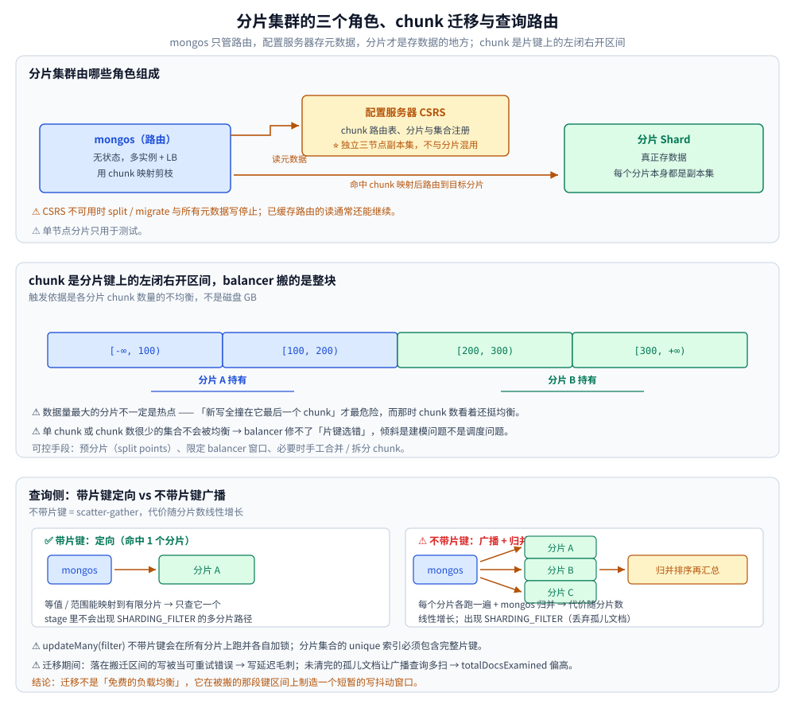
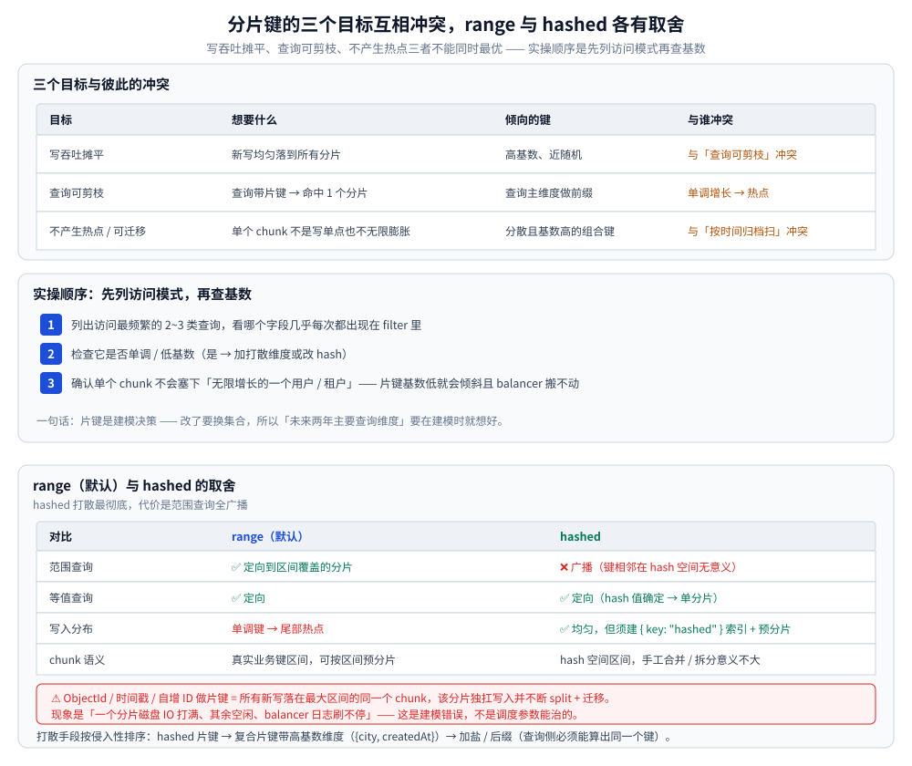

# MongoDB 分片基础

> 分片集群的三个角色（mongos / 配置服务器 / 分片）、chunk 与 balancer 的工作方式、
> 分片键选择的三个互相冲突的目标、range 与 hashed 的取舍与单调键热点，
> 查询侧的三条硬规则、片键定了之后的现实路径，以及迁移期间的读写正确性。
>
> 素材来源：《MongoDB 进阶与实战：微服务整合、性能优化、架构管理》（唐卓章）「分片」相关章节的读后整理，
> **按主题归纳而非逐字摘录**。⚠️ 该书基于 MongoDB 4.0，本篇只讲基础机制；
> **5.0 起的在线重分片与 8.0 的 `moveCollection` 等增强见** [分片增强与在线操作.md](分片增强与在线操作.md)。

---

## 一、分片集群由哪些角色组成？

**本节要点**：`mongos` 只做路由（无状态）、配置服务器存元数据（必须独立三节点副本集）、分片才是存数据的地方。

| 组件 | 职责 | 部署要点 |
| --- | --- | --- |
| `mongos` | 路由：用 chunk 映射剪枝，必要时广播 + 归并 | 无状态，多实例 + LB；它不是数据可靠性的来源 |
| 配置服务器（CSRS） | 集群元数据：chunk 路由表、分片与集合注册 | ⭐ 独立三节点副本集，不与业务分片混用；它不可用时 split/migrate 与所有元数据写停止，已缓存路由的读通常还能继续（以官方文档为准） |
| 分片 | 真正存数据 | 每个分片都必须是副本集（单节点分片只用于测试） |

---

## 二、chunk 与 balancer 怎么工作？

**本节要点**：chunk 是分片键上的**左闭右开区间**不是固定字节块；balancer 搬整个 chunk，触发依据是 **chunk 数量**的不均衡。

- chunk 是分片键上的一段**左闭右开区间**，不是固定字节块；有大小上限，超过就自动 split（阈值随版本变化，以官方文档为准）。balancer 搬的是**整个 chunk**（区间内文档 + 对应索引条目），触发依据是各分片 **chunk 数量的不均衡**，不是磁盘 GB。
- ⚠️ 推论：数据量最大的分片不一定是热点，"新写全撞在它最后一个 chunk"才最危险——而且那时 chunk 数量看着还挺均衡。
- 单 chunk 或 chunk 数很少的集合**不会被均衡**（没东西可搬）→ 别指望 balancer 修复"片键选错"，它只能延缓；倾斜是建模问题，不是调度问题。
- 可控手段：建集合时指定 split points 做预分片、限定 balancer 窗口（只在低峰搬，搬不完只是倾斜继续存在，不影响正确性）、必要时手工合并/拆分 chunk。

---



## 三、分片键选择的目标之间怎么权衡？

**本节要点**：写吞吐摊平、查询可剪枝、不产生热点——三者互相冲突，实操顺序是先列访问模式再查基数。

| 目标 | 想要什么 | 倾向的键 | 与谁冲突 |
| --- | --- | --- | --- |
| 写吞吐摊平 | 新写均匀落到所有分片 | 高基数、近随机（hash、打散后的 ID） | 与"查询可剪枝"冲突：hash 之后范围查询废掉 |
| 查询可剪枝 | 绝大多数查询带片键 → 命中 1 个分片 | 查询主维度做前缀（`tenantId`、`userId`） | 若该维度单调增长 → 热点 |
| 不产生热点/可迁移 | 单个 chunk 既不是写单点也不无限膨胀 | 分散且基数高的组合键 | 与"按时间归档、按时间范围扫"的直觉冲突 |

实操顺序：① 列出访问最频繁的 2~3 类查询，看哪个字段几乎**每次都出现在 filter 里**；② 检查它是否单调/低基数（是 → 加打散维度或改 hash）；③ 确认单个 chunk 不会塞下"无限增长的一个用户/租户"（片键基数低 → 倾斜且 balancer 搬不动）。

---

## 四、range 与 hashed 怎么选、单调键热点怎么办？

**本节要点**：ObjectId / 时间戳 / 自增 ID 做片键 = 所有新写撞同一个 chunk；hashed 打散最彻底但范围查询全广播。

ObjectId、时间戳、自增 ID 做片键时，所有新写落在最大区间的**同一个 chunk**，该分片独扛全部写入并不断 split + 迁移 → 现象是"一个分片磁盘 IO 打满、其余空闲、balancer 日志刷不停"。

| 对比 | range（默认） | hashed |
| --- | --- | --- |
| 范围查询 | ✅ 定向到区间覆盖的分片 | ❌ 广播（"键相邻"在 hash 空间无意义） |
| 等值查询 | ✅ 定向 | ✅ 定向（hash 值确定 → 单分片） |
| 写入分布 | 单调键 → 尾部热点 | ✅ 均匀，但**必须建 `{ key: "hashed" }` 索引**且要预分片 |
| chunk 语义 | 真实业务键区间，可按区间预分片 | hash 空间区间，手工合并/拆分意义不大 |

打散手段按侵入性排序：hashed 片键（打散最彻底、代价是范围查询全广播）→ 复合片键带高基数维度（`{city, createdAt}`，维度不均时会倾斜，要预分片补齐）→ 加盐/后缀（把 ID 末两位前置，查询侧必须能算出同一个键）。

---



## 五、查询侧有哪些硬规则？

**本节要点**：不带片键 = scatter-gather（代价随分片数**线性**增长）；批量更新删除同样受路由约束；分片集合的 unique 索引必须含完整片键。

- 不带片键 = **scatter-gather**：广播到所有分片各自执行、mongos 归并排序再汇总，stage 链里出现 `SHARDING_FILTER`（丢弃迁移期间读到的、不属于本分片的文档）。⚠️ 代价随分片数**线性增长**，不是"慢一点"；大集合上的深分页/聚合会把 mongos 打爆。
- 更新与删除同样受路由约束：`updateMany(filter)` 不带片键会在**所有**分片上跑并各自加锁 → 批量作业按片键区间分片提交。
- 唯一性：分片集合上的 unique 索引必须包含**完整片键**（见「唯一索引」小节），因为跨分片唯一无法本地判断。要全局唯一：① 直接把业务唯一键当片键；② 用一个不分片（或片键即该唯一键）的"注册表"集合做 CAS；③ 用 hash 后的业务键做片键 + 等值查唯一。需要跨分片一致快照（集群备份、对账）则依赖 snapshot 读关注/事务，支持范围以官方文档为准。

---

## 六、片键定了之后现实怎么做？

**本节要点**：换集合而不是改片键；这条链路最贵的是**对账**，不是搬数据。

片键在集合分片后基本**视为不可改**（较新版本提供了 resharding 能力，但限制多、代价高、要看版本支持，以官方文档为准），生产上的真正路径是**换集合**：建新分片集合 → 双写（老集合权威）→ 按片键区间分批回填并对账 → 灰度切读 → 反转权威 → 老集合转冷下线。⚠️ 这条链路最贵的是**对账**而不是搬数据：没有可重放的比对（按片键区间 count + 抽样字段 hash 比对），双写产生的差异永远查不清。更省力的做法是建模时就把"未来两年主要查询维度"放进片键前缀。

---

## 七、迁移期间的读写正确性怎么保证？

**本节要点**：迁移在键区间上制造一个短暂的写抖动窗口（写被当可重试错误、孤儿文档让广播查询多扫），**迁移不是免费的负载均衡**。

chunk 从源分片搬到目标分片期间，这段区间的**所有权（ownership）在转移**：
- 落在迁移中区间的写会遭遇冲突/被拒（源已不再 owner，或目标尚未拿到所有权），服务端与驱动把它当**可重试错误**处理 → 现象是这段键区间上写延迟毛刺与重试计数上升，而不是丢数据。
- 目标分片可能暂时读到一个"归属未定"的文档，客户端结果仍正确（靠 `SHARDING_FILTER` 过滤）；迁移完成后源分片要清理**孤儿文档（orphan）**，没清完之前不带片键的广播查询会多扫一批文档——`totalDocsExamined` 莫名偏高就是这个信号。
- 结论：⚠️ 迁移不是"免费的负载均衡"，它在被搬的那段键区间上制造一个短暂的写抖动窗口。热点集合宁可手工预分片 + 限定 balancer 窗口，也不要让 balancer 在业务高峰自行决定搬哪块。

---

## 使用：预分片与片键现场的检查命令

⚠️ **本机未实测**：分片集群要起「配置服务器副本集 + 至少两个分片副本集 + `mongos`」，
本仓库的容器实测口径（见 [README.md](README.md)）只覆盖了单实例，下列命令按官方文档整理、**没有跑过**，
仅作为现场排查的清单使用。

```javascript
// ① 开分片并给集合定片键（集合不存在时会先建）
sh.enableSharding("shop")
sh.shardCollection("shop.orders", { tenantId: 1, createdAt: 1 })   // 复合片键：租户定向 + 时间摊平

// ② 看分片与 chunk 分布（判「倾斜」而不是判「磁盘大小」）
db.adminCommand({ listShards: 1 })
db.orders.getShardDistribution()        // 每个分片的 chunk 数、文档数、数据量

// ③ 看某次查询是定向还是广播：explain 里出现 SHARDING_FILTER / 多分片阶段
db.orders.find({ tenantId: "t1", status: "PAID" }).explain("executionStats")

// ④ balancer 现在在搬什么、搬到哪一步
sh.getBalancerState()
sh.isBalancerRunning()
db.adminCommand({ balancerStatus: 1 })

// ⑤ 预分片：先按片键区间拆好再灌数据，避免初始阶段全靠 balancer 追
sh.splitAt("shop.orders", { tenantId: "t500", createdAt: ISODate("2026-01-01") })
```

看结果的三条判据：**① 倾斜看 chunk 数**（各分片 chunk 数差一个量级才是真倾斜，磁盘 GB 差得多不一定是）；
**② 定向看 explain**（带片键的等值/范围查询应只命中一个分片，出现广播说明片键没进 filter 前缀）；
**③ 迁移窗口看日志**（balancer 在业务高峰搬 chunk = 抖动源，宁可限定窗口）。

---

## 延伸追问

- **hashed 片键为什么让范围查询变贵？**
  → 它按键的 hash 值区间分片，「键值相邻」在 hash 空间里没有任何意义，范围条件无法映射到有限分片 → 只能广播。只有对该键的等值查询能算出 hash 值、定向到单分片。
- **单调片键为什么引发「迁移风暴」？**
  → 所有新写落在最大区间的同一个 chunk，它反复超阈值 → 反复 split；balancer 又反复搬最新 chunk 去补空分片，而热点仍跟着最新键走。表现为一个分片 IO 打满 + 迁移日志不断，属于建模错误，不是调度参数能治的。

---

## 关联

- [README.md](README.md) — 本目录导读：MongoDB 是什么、与 MySQL 怎么选、版本速查与阅读顺序
- [分片增强与在线操作.md](分片增强与在线操作.md) — 5.0 在线重分片与 8.0 `moveCollection` 等后续能力
- [副本集与选举.md](副本集与选举.md) — 每个分片本身都是副本集，选主与写关注同源
- [聚合管道.md](聚合管道.md) — 不带片键的聚合会广播到所有分片，代价随分片数线性增长
- [事务与一致性.md](事务与一致性.md) — 跨分片事务要多一轮协调，延迟与冲突率都更高
- [分表与路由.md](../../关系型/MySQL/分表与路由.md) — 关系型一侧的分片与路由对照（中间件分片 vs 原生分片）
- [海量数据存储设计.md](../../../../04-架构与系统/系统设计/海量数据存储设计.md) — 分片键与冷热分层在系统设计题里的落点
