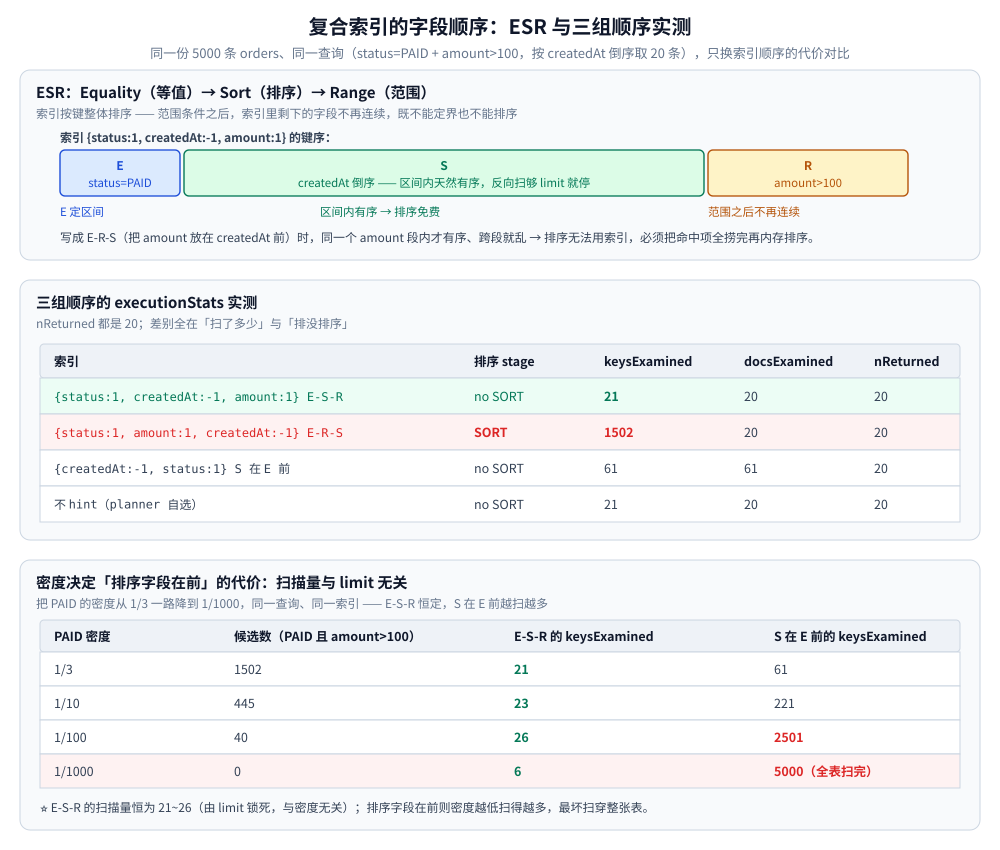
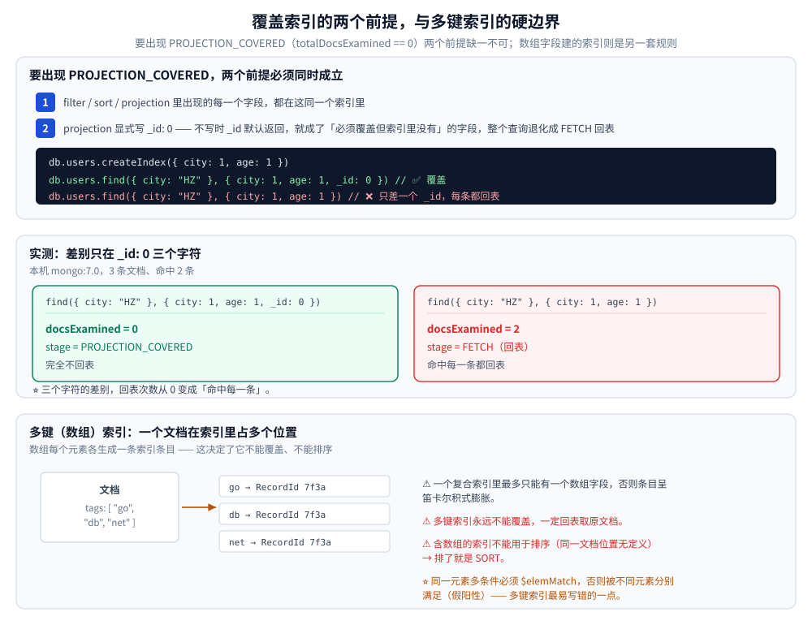
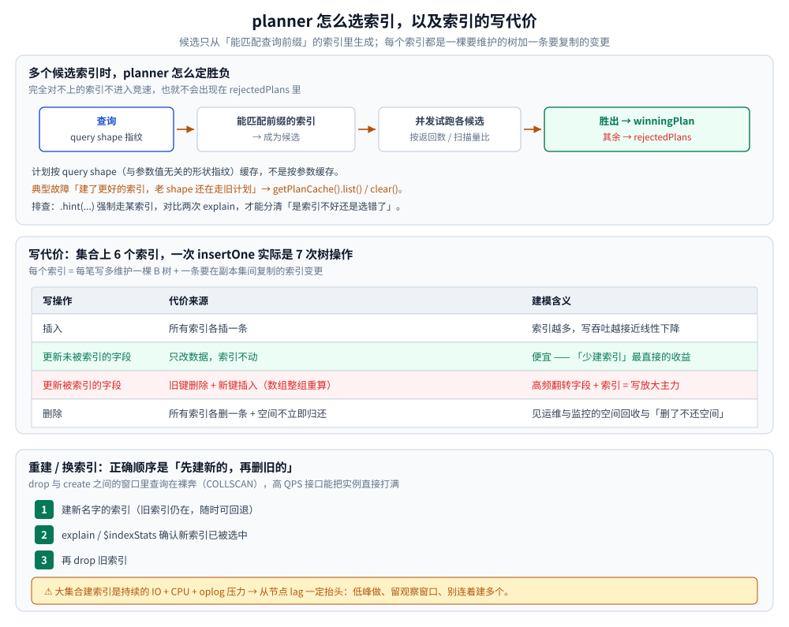

# MongoDB 索引原理

> MongoDB 的索引体系：B 树结构、复合索引的字段顺序（ESR）、覆盖索引、多键索引与特殊索引，
> 以及 planner 的选择机制与索引的写代价。含本机实例的 `explain` 实测读数。
>
> 素材来源：《MongoDB 进阶与实战：微服务整合、性能优化、架构管理》（唐卓章）「索引」相关章节的读后整理，
> **按主题归纳而非逐字摘录**。ESR 规则与覆盖索引两节配本机实测（Docker `mongo:7.0`，**7.0.40**，端口 27018，
> 5000 条 `orders`）的真实运行结果。

---

## 一、索引的本质是什么？

**本节要点**：一句话——用空间与写入开销换查询速度。

索引的本质是维护一份「字段值 → 记录位置」的**有序映射**，让查询从全表扫描（`COLLSCAN`）变成定点定位（`IXSCAN`）。

- 底层结构：**B 树**（WiredTiger 下的变体，不同于 InnoDB 的聚簇 B+ 树）。
- 每个索引条目 = 索引键值 + 指向文档的 `RecordId`；复合索引的键按**声明顺序**拼接，顺序决定可用性。
- ⚠️ 每个索引都占内存与磁盘，并让写入多维护一棵树——只建真正被查询用到的索引。

```javascript
db.users.createIndex({ age: 1 })   // 1 升序，-1 降序
db.users.getIndexes()              // 查看索引
db.users.dropIndex({ age: 1 })     // 删除索引
```

⚠️ B 树 / B+ 树本身的形态（节点分裂、磁盘页、为什么数据库选它）见
[B树与B+树.md](../../../../02-计算机基础/数据结构/树/B树与B+树.md)，本篇只讲它在 MongoDB 里的用法与判据。

---


## 二、复合索引的字段顺序为什么这么重要？

**本节要点**：顺序决定了「能用哪一段」——最左前缀定可用范围，ESR 定性能。

### 2.1 单键与复合索引、最左前缀

**单键索引**是对单个字段建的索引；**复合索引**对多个字段按顺序建一棵索引，形如 `{ a: 1, b: 1, c: 1 }`。

⭐ **最左前缀原则**：复合索引可用于查询**从最左字段开始的任意前缀**。

| 索引 `{a:1, b:1, c:1}` | 能否命中 |
| --- | --- |
| `{a}` / `{a,b}` / `{a,b,c}` | ✅ 命中 |
| `{b}` / `{c}` / `{b,c}` | ❌ 无法命中 |
| `{a,c}` | ⚠️ 只用到 `a`，`c` 无法用于定位 |

与 MySQL 的对照：

| 比较项 | MySQL | MongoDB |
| --- | --- | --- |
| 最左前缀原则 | 有 | ✅ 完全一致 |
| 排序利用 | 索引有序可消除 filesort | 一致；⚠️ 支持混合方向，`{a:1,b:-1}` 可同时满足 `a ASC, b DESC` |
| 覆盖索引 | Using index | 覆盖查询：`totalDocsExamined == 0` |
| 选择率 | 重要 | 同样重要；数组索引的基数计算方式不同 |

### 2.2 ESR 原则

⭐ **ESR**：复合索引的字段顺序应当 **Equality（等值）→ Sort（排序）→ Range（范围）**。

**为什么是这个顺序**：索引是一棵**按键整体排序**的 B 树。理解 ESR 只需要一句话——**范围条件之后，索引里剩下的字段就不再连续了**，因此既不能用来定界，也不能用来排序。

```javascript
// 第一节：状态等值 + 时间倒序取前 20 条 → ✅ { status: 1, createdAt: -1 }
//    E 定区间，S 就是区间内的自然顺序：反向扫到够 20 条就停，keysExamined ≈ 20，无 SORT
db.orders.find({ status: "PAID", createdAt: { $lt: ISODate("2026-09-01") } })
         .sort({ createdAt: -1 }).limit(20);
// 第二节：范围条件换到 amount 上 → ✅ { status, createdAt, amount }（E-S-R）
//                       ⚠️ { status, amount, createdAt }（E-R-S）会退化成内存排序
db.orders.find({ status: "PAID", amount: { $gt: 100 } }).sort({ createdAt: -1 }).limit(20);
```

### 2.3 本机实测：三组顺序的代价

同样 5000 条 `orders`、同一查询（`status=PAID` + `amount>100`，按 `createdAt` 倒序取 20 条），只换索引顺序：

| 索引 | stage | `keysExamined` | `docsExamined` | `nReturned` |
| --- | --- | --- | --- | --- |
| `{status:1, createdAt:-1, amount:1}`（**E-S-R**） | no SORT | **21** | 20 | 20 |
| `{status:1, amount:1, createdAt:-1}`（**E-R-S**） | ⚠️ **SORT** | **1502** | 20 | 20 |
| `{createdAt:-1, status:1}`（**S 在 E 前**） | no SORT | 61 | 61 | 20 |
| 不 hint（planner 自选） | no SORT | 21 | 20 | 20 |

⭐ 三条推论全部被实测坐实：

- **E-S-R**：扫描量 = `limit` + 1，**排序免费**（索引序就是需要的序），扫够就停。
- **E-R-S**：`amount` 是范围 → 同一个 `amount` 段内 `createdAt` 才有序、跨段就乱，**排序无法用索引** → 必须把 `status+amount` 命中的**全部 1502 个键**取完再内存排序；`limit` 省不掉扫描。
- 该情形下 `totalKeysExamined`（1502）与候选总数完全相等，而 `nReturned` 只有 20——**扫描量由候选数决定，与 limit 无关**。

### 2.4 边界条件：密度决定「排序字段在前」的代价

上表第三行的 61 是个**会骗人的数字**——它取决于 `PAID` 在数据里的密度（该组为 1/3）。把密度从 1/3 一路降到 1/1000，同一查询、同一索引：

| PAID 密度 | 候选数（`PAID` 且 `amount>100`） | E-S-R 的 `keysExamined` | S 在 E 前的 `keysExamined` |
| --- | --- | --- | --- |
| 1/3 | 1502 | **21** | 61 |
| 1/10 | 445 | **23** | 221 |
| 1/100 | 40 | **26** | ⚠️ **2501** |
| 1/1000 | 0 | 6 | ⚠️ **5000（全表扫完）** |

⭐ **规律**：E-S-R 的扫描量**与密度无关**（恒为 21~26，由 `limit` 锁死）；而排序字段在前时，**密度越低扫得越多，最坏情况扫穿整张表**——两组数字最多差两个数量级。

⚠️ 最后一行还揭示一个不对称：候选数为 0 时，E-S-R 只扫 **6** 个键就断定区间为空；S 在 E 前则**扫完 5000 条**才发现没有命中。**空结果的代价同样不对称**。

### 2.5 由 ESR 推出的几条操作口径

- 多个等值字段之间**谁前谁后不重要**（都能定界），但必须**整体排在 sort 字段之前**（`{city, status, createdAt}` 服务 `city=eq + status=eq + sort createdAt`）。
- 单方向取反可以**反向扫描**同一索引（`{a:1,b:1}` 满足 `a DESC, b DESC`）；**混合方向**（`a ASC, b DESC`）必须建 `{a: 1, b: -1}`，否则一定内存排序。
- range 字段放末尾只是「顺手过滤」，选择性差时多一个键只是让索引更大。

---



## 三、覆盖索引怎么才能不回表？

**本节要点**：两个前提同时成立，缺一个就退化回表。

要出现 `PROJECTION_COVERED`（`totalDocsExamined == 0`，完全不回表），必须同时满足：

1. filter、sort、projection 里出现的**每一个字段**都在这同一个索引里；
2. projection 显式写 `_id: 0`——不写 projection 时 `_id` 默认返回，它就成了「必须覆盖但索引里没有」的字段，整个查询退化成 `FETCH` 回表。

```javascript
db.users.createIndex({ city: 1, age: 1 })
db.users.find({ city: "HZ" }, { city: 1, age: 1, _id: 0 })  // ✅ 覆盖
db.users.find({ city: "HZ" }, { city: 1, age: 1 })          // ❌ 只差一个 _id，每条都回表
```

本机实测（3 条文档，命中 2 条）：

```text
projection 显式 _id:0  → docsExamined=0  stage=PROJECTION_COVERED
projection 不写 _id:0 → docsExamined=2  stage=其它(FETCH)
```

⭐ 差别只在 `_id: 0` 三个字符，回表次数就从 0 变成「命中每一条」。

⚠️ 多键（数组）索引**永远不能覆盖**，一定要回表取原文档；含数组元素的索引也**不能用于满足排序**（同一文档会因不同数组元素出现在多个位置，顺序无定义），排了就是 `SORT`。

---

## 四、除了单键复合，还有哪些索引？

**本节要点**：四种特殊索引各自解决一个问题，也各自有一个失效条件。

### 4.1 部分索引 vs 稀疏索引

| | `sparse: true` | `partialFilterExpression` |
| --- | --- | --- |
| 收录哪些文档 | 索引字段**存在**的文档（含显式写成 `null` 的） | 满足给定表达式的文档（可小到「活跃子集」，体积能小一个数量级） |
| 表达能力 | 只有「字段存在与否」一种 | `$eq`/`$gt`/`$lt`/`$exists`/`$type` + 顶层 `$and`（可用操作符以官方文档为准） |
| 典型用法 | 老代码里给缺失字段开唯一约束 | 只对 `deleted: false` 建唯一；只对 `status: "OPEN"` 建索引（绝大多数文档已是 CLOSED） |
| ⚠️ 失效条件 | 无 | 查询 filter **推不出**部分条件时优化器根本不考虑它 → 意外 `COLLSCAN`，索引白建 |

最后一行是最贵的坑：建了 `partial on {deleted:false}` 的 `{status:1}`，但查询只写 `{status:"PAID"}` 不带 `deleted:false`，就吃不到索引。要么查询固定带上该条件，要么退回全量索引。

### 4.2 唯一索引

```javascript
db.users.createIndex({ email: 1 }, { unique: true })
```

⚠️ **坑**：字段缺失会被视为 `null`，多个缺失该字段的文档会互相冲突。解法：

```javascript
db.users.createIndex({ email: 1 },
  { unique: true, partialFilterExpression: { email: { $exists: true } } })
```

唯一索引**无法保证数组字段的「全局唯一」**，只能保证单文档内不重复；分片集合上唯一键必须包含完整分片键。

### 4.3 TTL 索引

让文档**到点自动过期删除**，适合会话、验证码、临时日志、缓存。

```javascript
db.sessions.createIndex({ createdAt: 1 }, { expireAfterSeconds: 3600 })
db.tokens.createIndex({ expireAt: 1 }, { expireAfterSeconds: 0 }) // 字段值即删除时刻
db.runCommand({ collMod: "sessions",                               // 改过期时间只能走 collMod
  index: { keyPattern: { createdAt: 1 }, expireAfterSeconds: 7200 } })
```

- 后台线程**每 60 秒**扫描一次，因此删除**不精确**（可能延迟 1 分钟以上）；TTL 字段必须是 **BSON Date**（或 Date 数组）。
- ⚠️ TTL 索引必须是**单字段索引**，不能是复合索引；删除不可恢复。

### 4.4 地理空间索引

| 类型 | 索引声明 | 用途 |
| --- | --- | --- |
| `2dsphere` | `{ loc: "2dsphere" }` | ⭐ 球面坐标，GeoJSON 格式，支持真实地球距离 |
| `2d` | `{ loc: "2d" }` | 平面坐标，legacy 用法，仅限小范围 |

```javascript
db.places.createIndex({ loc: "2dsphere" })
db.places.find({ loc: { $near: {
  $geometry: { type: "Point", coordinates: [120.15, 30.28] },
  $maxDistance: 1000                       // 米
} } })
```

操作符：`$near`（按距离排序）、`$geoWithin`（范围内）、`$geoIntersects`（相交）、`$geoNear`（聚合阶段，附带距离字段）。

### 4.5 通配符索引（wildcard）

面向**字段名不确定**的文档（attribute pattern：把一堆可选字段塞进一个子文档），用一条索引覆盖「任意子字段」的等值查询，替代给每个可能字段各建一条索引。

```javascript
// 4.2+：单字段通配符，索引 customFields 下的所有子字段
db.products.createIndex({ "customFields.$**": 1 })

// 7.0+：复合通配符，一个通配符项 + 若干普通项
db.salesData.createIndex({ tenantId: 1, "customFields.$**": 1 })

// 只想覆盖部分子字段：wildcardProjection（仅当通配项写成 $** 时才可用）
db.salesData.createIndex({ tenantId: 1, "$**": 1 },
  { wildcardProjection: { "customFields.addr": 1, "customFields.name": 1 } })
```

⭐ `$**` 单字段形式自 **4.2** 起可用，**复合**通配符（一个通配符项 + 普通项）是 **7.0** 新增。官方 Restrictions 页给出的一组限制必须记住：

- **一个复合通配符索引只能有一个通配符项**（`{a:1, "o1.$**":1, "o2.$**":1}` 非法）；非通配项必须是**单键**，**不能是 multikey 数组字段**。
- 通配符索引本质是 **sparse** 的：字段**缺失**的文档不进索引 → `{field: {$exists: false}}` 用不上它；同理**不能**用于 `field != null`，也**不能**匹配**文档 / 数组整体**的等值（它存的是「内容」不是「整体」）。
- 一条通配符索引在**多字段谓词**里只能**支持其中一个**字段（复合形式里非通配项可支持其余谓词），其余谓词落进 `rejectedPlans`。
- **排序**只有在「该字段既非数组、又是查询谓词字段、且 sort 只用它一个」时才可能走这条索引；`-1` 降序是 **7.0** 才支持的，之前只支持升序。
- ⚠️ **不兼容**：`unique` / TTL / text / `2d` / `2dsphere` / hashed 一律不能用；**不能做分片键索引**；`_id` 默认不进索引（要它必须用 `$**` + `wildcardProjection` 显式纳入）。
- ⚠️ 通配符索引**不替代**基于工作负载的索引规划——字段确定时仍应建具名复合索引，它更适合「字段天然不定、且只需等值检索」的 attribute 场景。

### 4.6 时序集合上的索引

时序集合自带**桶元数据剪枝**，索引策略与普通集合不同（桶文档见 [时间序列集合.md](时间序列集合.md)）：

- **时间范围不用你建索引**——`control.min` / `control.max` 负责剪枝；⭐ **6.3 起新建集合自动**在 `{ metaField: 1, timeField: 1 }` 上建复合索引（本机 `mongo:7.0` 实测 `getIndexes()` 返回 `[{"meta":1,"ts":1}]`）。
- 二级索引**按桶建**而不是按测量建，条目数约等于**桶数**，不随测量条数膨胀——这是它索引不膨胀的根本原因。
- 要建的索引是给**常用过滤 / 排序维度**（`metaField` 子字段之类）用的：**6.0** 起支持 `timeField` / `metaField` / 测量字段的任意**复合**二级索引，并支持 **partial** 索引与 `$or` / `$in` / `$geoWithin`。
- 版本边界：**5.0** 只能索引 `timeField` / `metaField`（`metaField` 是文档时可索引其子字段）；**6.0** 放宽到复合与测量字段，并支持 `metaField` 上的 `2dsphere`；**7.0** 起支持带 `partialFilterExpression`（只依赖 `metaField`）的 TTL 索引。
- ⚠️ **禁止**的类型：`text` / `2d` / `unique`，以及 `metaField` 上的 sparse；对**测量字段**乱建索引会重新引入膨胀，且数值型测量天然不是等值检索对象。

---



## 五、数组字段建索引要注意什么？

**本节要点**：一个复合索引里最多只能有一个数组字段，且多条件必须用 `$elemMatch`。

数组字段可建索引，即 **multikey index**：数组每个元素生成一个索引条目。

```javascript
db.articles.createIndex({ tags: 1 })
db.articles.find({ tags: "go" })    // 命中 multikey 索引
```

- ⚠️ 一个复合索引中**最多只能有一个数组字段**，否则索引条目呈笛卡尔积式膨胀。
- 支持嵌套字段索引：`{ "address.city": 1 }`；大数组建索引会显著放大索引体积。
- ⭐ 复合索引里那个唯一的数组字段，要匹配「同一个元素同时满足多个条件」必须用 `$elemMatch`，否则条件会被**不同元素分别满足**（假阳性）——这是多键索引最容易写错的一点。

---



## 六、多个候选索引时 planner 怎么选？

**本节要点**：候选由「能否匹配前缀」生成，胜负由数据分布决定，且**按 shape 缓存**。

1. **生成候选**：只在「能匹配查询前缀」的索引里生成候选（完全对不上的不进入竞速，也不会出现在 `rejectedPlans`）；再并发跑各候选、按「返回多少条 / 扫了多少」择优，胜出进 `winningPlan`。所以「哪个索引更快」是**数据分布决定的经验结果**，不是静态规则。
2. **计划缓存按 query shape**（与参数值无关的形状指纹）缓存，不是按参数缓存 → 典型故障「我明明建了更好的索引，老 shape 还在走旧计划」。用 `db.coll.getPlanCache().list()` 看、`clear()` 清。
3. **排查手段**：`.hint({ status: 1, createdAt: -1 })` 强制走某索引，对比两次 explain 才能确认「是索引不好还是选错了」；`planCacheListFilters`/`indexFilter` 可临时屏蔽坏计划，属应急开关，别当长期方案。

---

## 七、索引的写代价有多大？

**本节要点**：每个索引都是一棵要维护的树 + 一条要复制的变更，数量要有预算。

每个索引 = 每笔写要多维护一棵 B 树 + 一条要在副本集间复制的索引变更。集合上 6 个索引，一次 `insertOne` 实际就是 7 次树操作。

| 写操作 | 代价来源 | 建模含义 |
| --- | --- | --- |
| 插入 | 所有索引各插一条 | 索引越多，写吞吐越接近线性下降 |
| 更新**未被索引**的字段 | 只改数据，索引不动 | 便宜——这是「少建索引」最直接的收益 |
| 更新**被索引**的字段 | 旧键删除 + 新键插入（数组字段是整组重算） | 高频翻转的状态字段 + 索引 = 写放大主力 |
| 删除 | 所有索引各删一条 + 空间不立即归还 | 见 [运维与监控.md](运维与监控.md) 的空间回收与「删了不还空间」一节 |

- 单调追加的字段（时间戳、ObjectId）当索引键，写代价低于「会被反复改的字段」（只追加、不移动），但它把热点问题挪到了分片层。
- 索引数量要有预算，不能「先建着再说」：它同时抬高写延迟、cache 占用、启动与追赶时间。

重建 / 换索引的做法（定性）：

1. ⚠️ 不要 `dropIndex` 之后再 `createIndex`——中间那段窗口查询在裸奔（`COLLSCAN`），高 QPS 接口能直接把实例打满。
2. 正确顺序：**建新名字的索引 → explain / `$indexStats` 确认已被选中 → 再 drop 旧索引**，随时可回退。
3. 大集合上建索引是持续的 IO + CPU + oplog 压力，从节点 lag 一定会抬头：低峰做、做完留观察窗口、别连着建多个。
4. 构建方式与版本强相关（早期区分前台/后台构建、`background` 参数在后续版本被统一处理），**是否还生效以官方文档为准**；别靠「加个 background」来做在线变更的容量规划。

---

## 使用：建索引并用 explain 验证

```javascript
// 前置：docker run -d --name mongo-idx-lab -p 27018:27017 mongo:7.0
//       docker exec mongo-idx-lab mongosh

// ① 建索引：等值 + 排序 + 范围按 ESR 排
db.orders.createIndex({ status: 1, createdAt: -1, amount: 1 })

// ② 验证是否被选中：看 winningPlan 的 stage
db.orders.find({ status: "PAID", amount: { $gt: 100 } })
         .sort({ createdAt: -1 }).limit(20)
         .explain("executionStats")

// ③ 对比强制走另一条索引（确认「是索引不好还是选错了」）
db.orders.find({ status: "PAID", amount: { $gt: 100 } })
         .sort({ createdAt: -1 }).limit(20)
         .hint({ status: 1, amount: 1, createdAt: -1 })
         .explain("executionStats")

// ④ 长期没被用到的索引应当删除
db.orders.aggregate([{ $indexStats: {} }])
```

**怎么看结果**——第一步看 `queryPlanner.winningPlan.stage`：

| stage | 含义 | 判断 |
| --- | --- | --- |
| `COLLSCAN` | 集合全表扫描 | ⚠️ 坏，检查索引与最左前缀 |
| `IXSCAN` | 使用索引扫描 | ✅ 好 |
| `FETCH` | 回表取完整文档 | 正常；`totalDocsExamined` 远大于 `nReturned` 则需优化 |
| `SORT` | 内存排序 | ⚠️ 排序未走索引；超 32MB 直接报错 |
| `PROJECTION_COVERED` | 覆盖查询 | ✅ 最佳，无需回表 |

第二步看 `executionStats` 关键字段：

| 字段 | 含义 | 理想值 |
| --- | --- | --- |
| `executionTimeMillis` | 查询总耗时 | 越低越好 |
| `totalKeysExamined` | 扫描的索引键数 | 接近 `nReturned` |
| `totalDocsExamined` | 扫描的文档数 | ⭐ 尽量等于 `nReturned` |
| `nReturned` | 实际返回文档数 | 业务预期值 |
| `rejectedPlans` | 被淘汰的候选计划 | 越少越好 |

第三步：`db.users.aggregate([{ $indexStats: {} }])` 查看各索引使用次数，**长期为 0 的索引应删除**。

### 进阶读法

三层各有分工，缺层的结论都不成立：`queryPlanner` 给**计划形状**（整条 `winningPlan.inputPipeline` 从叶子往根读：有没有 `SORT`、有没有 `FETCH`、`$or` 是否被拆成多路再 `OR`/`SORT_MERGE` 合并），`executionStats` 才有**真实计数**（默认 `explain()` 不给这一层），而回显的 `query` 才是服务端真正执行的形状（类型转换、正则、`$expr` 都可能改写你的意图）。

两个**比值**比绝对值有用：

- `totalKeysExamined / nReturned` ≫ 1 → 索引区间定得不准（前缀选错、范围字段排在前面），扫了大量用不上的键。
- `totalDocsExamined / nReturned` ≫ 1 → 回表白干了：过滤条件里还有字段没进索引，考虑把过滤前移或做覆盖索引。
- `hasCoveredStage: true` / 出现 `PROJECTION_COVERED` → 真的没回表；出现 `PROJECTION_FETCHED` 就是回了表，别被「用了索引」迷惑。

⭐ 同样是顶层带 `LIMIT`，两条 stage 链的量级完全不同：`LIMIT → FETCH → PROJECTION_COVERED → IXSCAN`（扫一点、够 limit 就停）vs `SORT → LIMIT → FETCH → IXSCAN`（先把命中项全捞完再排序、再截断）。

`executionTimeMillis` 的三点局限：

1. 它只包含这一次服务端执行，**第一次跑要承担把数据读进 cache 的成本**；同一查询连跑两次第二次可能快得多。所以「要不要优化」看扫描量，不看单次耗时。
2. 它是「执行完这批结果」的时间，不是端到端延迟：网络往返、驱动、游标后续批次（`getMore`）都不在里面。
3. 分片集群上不带分片键的查询，耗时由**最慢的那个分片**决定，单机 explain 看不出倾斜。

`rejectedPlans` 为什么值得看：`winningPlan` 只是「竞速赢了的」，不等于最优。如果 `rejectedPlans` 里躺着一个明显更合理的索引计划，通常是三种原因之一：① query shape 命中了**旧缓存计划**（换了索引但没清缓存）；② 新索引只部分可用（前缀对但方向/字段不全），竞速时被老计划赢；③ 数据分布偏斜让试跑阶段估计失真。处置手法见第六节，重点是：别直接下「这个索引没用」的结论。

⚠️ 慢查询的**长期定位**（profiler、`currentOp`、阈值怎么设）不属索引范畴，见 [运维与监控.md](运维与监控.md) 的监控指标一节。

---

## 延伸追问

- **`{a:1, b:1}` 能否服务 `find({b: "x"}).sort({a:1})`？**
  → 不能用于定位（`b` 不是最左字段），也不会走这条索引；即使加了 hint，也只能全索引扫再过滤。
- **为什么「等值在前、范围在后」是对的，而「范围在前」的索引有时也建？**
  → 若一个字段**只在范围条件下出现、从不做排序**，把它放前面可以让区间更早收窄；一旦同一个查询还要按后面的字段排序，就必然退化成内存排序。
- **数组索引为什么不能让同一文档出现在多个位置？**
  → multikey 索引会为每个数组元素生成一条索引条目，同一文档因此在索引里占多个位置；排序时「这个文档该排在哪儿」没有唯一答案，所以含数组的索引不满足排序。
- **`$indexStats` 显示的次数为什么可能骗人？**
  → 它按索引统计访问次数，**缓存命中的查询也会被计入**，且重建索引/重启后计数归零；判断「能不能删」要结合足够长的观察窗口，别用几分钟的数据下结论。
- **TTL 索引能当定时任务的替代品吗？**
  → 不能。它是 **60 秒一轮的兜底清理**、不精确、不可恢复，且只能删不能改；要用它承载业务语义（比如「订单超时未支付则关单」）必须另配状态机与补偿。
- **为什么 ESR 里 Sort 一定要排在 Range 前面？**
  → 范围条件之后，索引里更靠后的字段不再全局有序、也不再连续。`{eq, sort, range}` 能定区间并免排序，配合 `limit` 可以边扫边停；写成 `{eq, range, sort}` 就必须把全部命中项捞完再内存排序，超内存直接报错。
- **覆盖索引为什么常被 `_id` 破坏？**
  → 不写 projection 时 `_id` 默认返回，它就成为「必须覆盖」的字段之一，而二级索引里没有它 → 只能回表。要覆盖必须显式 `_id: 0`，并且 filter / sort / projection 的字段全在同一个索引里。
- **partial index 比 sparse 强在哪，又有什么坑？**
  → sparse 只能表达「字段存在」，partial 能表达任意条件（`deleted:false`、`status:"OPEN"`），因此能给「部分文档」建唯一约束、体积更小。坑是查询 filter 必须能推出满足部分条件，否则优化器完全不考虑它，会意外退化成 `COLLSCAN`。
- **`docsExamined` 高和 `keysExamined` 高分别说明什么？**
  → `keysExamined/nReturned` 高说明索引区间定不准（前缀或顺序选错，扫了一堆用不上的键）；`docsExamined/nReturned` 高说明回表白做了，还有过滤字段没进索引 → 做覆盖或把过滤前移。
- **通配符索引能替代具名复合索引吗？**
  → 不能。它一条只能支持多字段谓词里的一个字段、不能 `unique` / TTL / 分片键，且是 sparse 的（字段缺失查不到）。它解决的是「字段名天然不定」的 attribute 场景，字段确定时具名复合索引永远更优。
- **时序集合为什么不用手工给时间字段建索引？**
  → 时间剪枝靠桶元数据 `control.min/max` 完成，6.3 起还会自动建 `{metaField:1, timeField:1}` 复合索引；二级索引则按桶建、条目数约等于桶数。手工对测量字段建索引反而重新引入膨胀。

## 关联

- [README.md](README.md) — 本目录导读：MongoDB 是什么、与 MySQL 怎么选、版本速查与阅读顺序
- [时间序列集合.md](时间序列集合.md) — 时序集合的桶元数据剪枝与按桶建索引
- [索引原理.md](../../搜索与分析/Elasticsearch/索引原理.md) — 同批整理的另一种索引主线（倒排索引）
- [索引设计与EXPLAIN.md](../../关系型/MySQL/索引设计与EXPLAIN.md) — 关系型一侧的索引设计（B+ 树主线）与完整口径
- [B树与B+树.md](../../../../02-计算机基础/数据结构/树/B树与B+树.md) — B 树的结构、节点分裂与磁盘页局部性
- [底层结构.md](../Redis/底层结构.md) — 另一种数据存储的索引式用法（跳表与有序集合）
- [缓存选型与容量.md](../../缓存/缓存选型与容量.md) — 索引与缓存的分工：一个省扫描、一个省回源
> 反向引用（本篇被下列文档引到）：[可查询加密.md](可查询加密.md)、[客户端使用.md](客户端使用.md)、[应用与场景.md](应用与场景.md)、[数据建模.md](数据建模.md)、[聚合管道.md](聚合管道.md)、[运维与监控.md](运维与监控.md)、[关注粉丝设计.md](../../../../04-架构与系统/系统设计/社交互动系统/关注粉丝设计.md)
