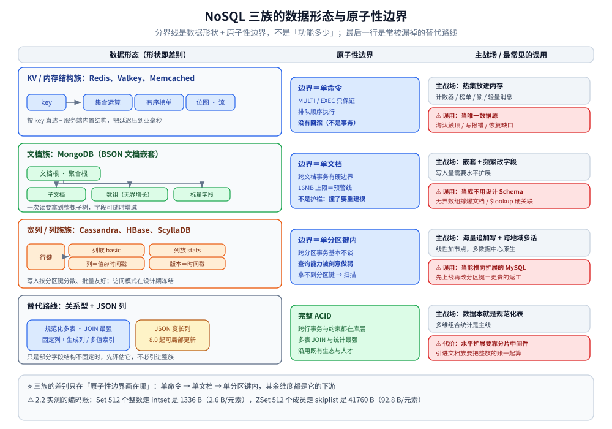
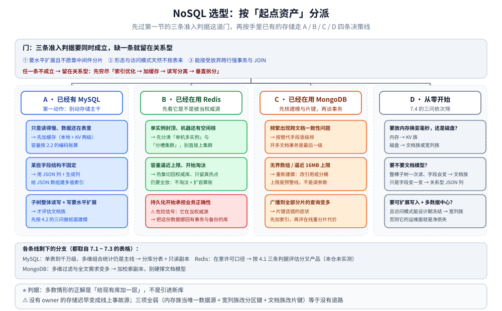

# NoSQL 选型对比

> 跨族、跨产品的横向选型：先立住 NoSQL 三族**共同的三条准入判据**与选型前**必须量化的五个数**，
> 再把 KV / 内存结构、文档、宽列 / 列族三族逐维对照，补上「契合语言与团队栈」这条最容易漏的隐性成本，
> 最后按**起点资产**给四条决策线、退路评估，以及一次可信的自建负载验证怎么做。
>
> ⭐ 边界：全仓存储总纲 [存储选型.md](../存储选型.md) 已在第一节给七类存储分类、第二节给「同一条数据在七种存储里的形态」、
> 第四节给 MySQL 与 MongoDB 的对照、第六节给 Redis 与 Memcached 的对照 —— 那四处**本篇只链接、不照抄**。
> 本篇往下多覆盖四件事：**族内多产品**（Valkey、Memcached、Dragonfly 一类多线程新玩家、Cassandra、HBase、ScyllaDB、云上兼容托管）、
> **宽列 / 列族这一整族**（总纲里没有它的位置）、**契合语言这一维度**、**上了之后怎么退**；单产品深度见 Redis 的 [README.md](Redis/README.md) 与 MongoDB 的 [README.md](MongoDB/README.md)。
>
> 内容整理自个人学习笔记，并参考各家官方文档与 Release Notes；素材见 [素材清单.md](../../../素材清单.md)。
>
> ⚠️ 实测口径：本仓**只有 Redis 与 MongoDB 有容器实测**（Redis 7.4.11 / 8.10.2，MongoDB `mongo:7.0` 即 7.0.40）。
> Memcached、Valkey、Dragonfly 一类、Cassandra、HBase、ScyllaDB 与云上托管**全部未实测**，只作**定性陈述**，许可与功能边界一律标「以官方文档为准」；⭐ 本篇**不引用任何第三方跑分充当结论**。

---

## 一、NoSQL 三族共同的三条准入判据是什么？

**本节要点**：NoSQL 的本质不是「不用 SQL」，而是**拿一致性与关联能力换水平扩展**；三条判据要同时成立，缺一条就留在关系型。

### 1.1 三条判据

| # | 判据 | 成立时的表现 | 不成立时该怎么办 |
|---|---|---|---|
| ① | **要水平扩展，且不愿靠中间件分片** | 容量或写入量已顶到单机；再走分库分表要长期维护路由、全局 ID、跨片聚合 | 先穷尽「索引优化 → 加缓存 → 读写分离 → 垂直拆分」，见 [存储选型.md](../存储选型.md) 第十节的两条通用经验 |
| ② | **数据形态与访问模式天然不按表来** | 整体读写的聚合根（文档族）、按 key 直达的对象（KV 族）、按行键宽列追加（宽列族） | 数据本就是规范化多表、主查询是多维组合统计 → 留在关系型 |
| ③ | **能接受放弃跨行强事务与 JOIN 换来的代价** | 不变量能收进单个文档 / 单行；跨行一致性可走最终一致 + 定时对账 | 跨表转账、库存扣减这类强一致是主线 → 别引进 |

三族的差别只在**原子性边界画在哪**：KV 族是单命令（`MULTI`/`EXEC` 只保证排队顺序执行、**没有回滚**，见 [缓存选型对比.md](../缓存/缓存选型对比.md) 第一节），文档族是单文档（跨文档事务能开但有硬边界，见 [事务与一致性.md](MongoDB/事务与一致性.md)），宽列族通常只在单分区键内给轻量原子边界。

> 一致性侧的原理（强一致 / 最终一致、CAP 与 BASE 的取舍）见 [一致性与CAP.md](../../../04-架构与系统/分布式/理论/一致性与CAP.md)；七类存储各自的读写形态见 [存储选型.md](../存储选型.md) 的第一节与第二节，本篇不重复那两张表。

---

## 二、选型前必须先量化的五个数是什么？

**本节要点**：五个数先定下来，三族会自动缩到一族。⚠️ 其中「规模与增速」对内存型产品必须按**成本模型**算，而不是按业务字段大小算。

### 2.1 五个输入

| # | 量什么 | 怎么量 | 它决定什么 |
|---|---|---|---|
| ① | **数据形态** | 取最典型的 3 个业务对象，看它是「一行」「一棵树」还是「一条按 key 追加的宽行」 | 决定落在哪一族；形态判断错了，后面每一维都在将就 |
| ② | **访问模式** | 点查 / 集合运算（成员、交并差、按分排序）/ 范围扫描 / 聚合，各占多少 | 决定需要哪种结构与索引，也决定「能不能只用主键直达」 |
| ③ | **一致性要求** | 能否容忍读到旧值、要不要单文档原子、跨行要不要同时可见 | ⭐ 最容易筛掉候选的一项：它决定架构里能不能有异步复制 |
| ④ | **规模与增速** | 日增量、总量、访问热集大小；再明确**放内存还是放磁盘** | 内存型按 2.2 的成本模型折算；磁盘型看能否水平加节点 |
| ⑤ | **运维人力** | 有没有人接得住备份恢复、故障演练、版本升级、容量规划 | ⚠️ 宽列族与分片集群的运维面远大于「多一个进程」 |

### 2.2 ⚠️ 内存那一栏：按「对象开销 + 编码」算

**本节要点**：内存型实例的账单由**编码**决定，业务字段大小只是分子里最小的一项。

```text
【本仓实测 · Redis 7.4.11 容器】fork 与写时复制的峰值
  20 万 key ≈ 29 MB 的实例，一次 BGSAVE 采样：latest_fork_usec = 1627 µs（fork 本身约 1.6 ms）
  快照期间持续写入 9 万 key（写入耗时 497 ms）：
      rdb_last_cow_size = 2.95 MB
      used_memory  29.01M → 44.68M    ← 快照期间峰值比稳态高 54%
【本仓实测 · 同一容器】同一批数据换一种编码，每元素字节数
  Set 512 个整数      intset      1336 B    （  2.6 B/元素）
  Set 512 个短字符串  hashtable  24688 B    （ 48.2 B/元素）
  ZSet 128 个成员     listpack    1080 B    （  8.4 B/元素）
  ZSet 512 个成员     skiplist   41760 B    （ 92.8 B/元素）
```

两点直接进容量模型（编码侧出处见 [底层结构.md](Redis/底层结构.md)，fork 侧见 [持久化.md](Redis/持久化.md) 第一节）：

1. **同一份业务数据，每元素 2.6 B 与 92.8 B 都合法** —— 差别在编码不在数据；元素数跨过阈值还会一次性翻十几倍（实测 128 → 129 个成员时内存 ×12.6）。⚠️ 且转换是**单向**的：删回阈值以下也不退回紧凑编码，「曾经超阈值」会永久留在内存账上。
2. **要按峰值算而不是按稳态算**：`BGSAVE` 与 AOF 重写都要 `fork`，写压力下 COW 能把内存推高一半，大实例足以触发 swap 甚至 OOM。

> 这五个数各自会砍掉哪些候选，⚠️ 只有用**自己的负载**跑出来的砍法才算数（验证做法见本篇 `## 使用`，按起点资产的决策线见第八节）。

---

## 三、三族怎么划分？各自的主战场在哪？

**本节要点**：分界线是**数据形状**加**原子性边界**，不是「功能多少」。每族记四件事：解决什么、放弃什么、什么团队会选、最常见的误用。



图怎么读：一行一族，左栏把数据形状**直接画出来** —— 一个 key 指向服务端结构（集合运算 / 有序榜单 / 位图）、一棵嵌套文档树（文档根 + 子文档 + 数组）、行键 + 列族 + 带时间戳的列值宽行；中栏是原子性边界，三族依次是**单命令 → 单文档 → 单分区键内**，其中 `MULTI` / `EXEC` 只保证排队顺序执行、**没有回滚**，16MB 上限是预警线不是护栏；右栏上半是主战场、下半红框是最常见的误用。最后一行的「关系型 + JSON 列」不属于三族，但它完整 ACID、JOIN 最强，扩展要靠分片中间件。底部两个数字取自 2.2 的实测块：同一量级下 `intset` 1336 B（2.6 B/元素）对 `skiplist` 41760 B（92.8 B/元素）。

### 3.1 KV / 内存结构族：Redis、Valkey、Memcached 与多线程新玩家

- **解决什么**：把热集放进内存，用「按 key 直达 + 服务端内置结构」把延迟压到亚毫秒；顺带提供计数器、集合运算、有序榜单、轻量消息这些**用一张表做不好**的活。
- **放弃了什么**：磁盘级的容量上限、跨命令的事务语义、以及（纯缓存形态下）**可依赖的持久化**。
- ⭐ **什么团队会选**：已经有一套权威库、只是「读得太慢」的团队；需要跨进程共享计数 / 榜单 / 锁的团队。
- ⚠️ **最常见的误用**：把它当**唯一数据源** —— `maxmemory` 触顶后的淘汰（算法见 [缓存淘汰算法.md](../缓存/缓存淘汰算法.md)）、`noeviction` 下写命令直接报错、持久化恢复的数据缺口，三件事会一起找上来。
- ⚠️ 族内的 Memcached 与 Dragonfly 一类多线程实现本仓**未实测**，本篇只描述模型差异，不写任何性能结论。

### 3.2 文档族：MongoDB，以及「关系型里放 JSON 列」这条替代路线

- **解决什么 / 放弃什么**：把「一次读要拿到整棵子树」的聚合根装进一个文档，字段可随时增减，并原生提供分片水平扩展；换来的是放弃数据库层的跨文档约束与成熟的 JOIN 优化器，多文档事务能开但代价高。
- ⭐ **什么团队会选**：数据天然嵌套、Schema 随业务频繁变动、写入量需要水平扩展的团队。
- ⚠️ **最常见的误用**：当成「不用设计 Schema 的 MySQL」—— 无界数组撑爆文档、用 `$lookup` 硬做关联、把事务当默认手段。
- **替代路线**：只想让「某些字段结构不固定」、而不是整个业务对象按文档组织时，**先评估关系型的 JSON 列**：8.0 起可局部更新、可给 JSON 数组建多值索引（见 [架构与执行链路.md](../关系型/MySQL/架构与执行链路.md) 的 JSON 支持与 [数据建模.md](../关系型/MySQL/数据建模.md) 的类型取舍）。引进文档族要把整族的账一起算，不是「字段变一变」那么轻。

### 3.3 宽列 / 列族族：Cassandra、HBase、ScyllaDB 与云上兼容托管

⚠️ 这一族在 [存储选型.md](../存储选型.md) 的七类存储里**没有独立位置**，是本篇补上的整族；整族**未实测**，机制差异见 4.3，版本与功能边界以官方文档为准。

- **解决什么**：以「行键 + 列族」为模型的海量追加写，写入按分区键分散，天生适合多数据中心与线性扩容。
- **放弃了什么**：查询能力被**刻意做弱** —— 没有即席多维过滤，拿不到分区键就退化成大范围扫描；跨分区事务基本不谈。
- ⭐ **什么团队会选**：写入速率极高、访问模式**在设计期就能冻结**、且需要跨地域多活的团队。
- ⚠️ **最常见的误用**：当「能横向扩展的 MySQL」用，指望它做任意条件查询与报表；或先上线再改分区键 —— 那一层的返工比文档族更贵。

---

## 四、族内怎么细比？

**本节要点**：族内要按**维度**比，不按「功能勾选表」比 —— 每张表后面都跟一条判据。

### 4.1 KV / 内存结构族

| 维度 | 要看的具体选项 | 选型含义 |
|---|---|---|
| **数据结构覆盖面** | 只有字节串 → 集合运算 / 有序榜单 / 位图 / 概率结构 / 流，一路往上加 | 结构越少，越多逻辑要搬回应用层做二次传输与拼装；本仓 Redis 侧清单见 [数据类型.md](Redis/数据类型.md) |
| **持久化能力** | 无持久化 / 只有快照 / 快照 + 追加日志，追加日志又分**三种 fsync 档位** | 三档是「延迟 ↔ 丢失窗口」的直接交换：实测 `always` 比 `everysec` 慢约一个数量级、只开快照在 SIGKILL 下整段丢失（[持久化.md](Redis/持久化.md) 第三、四节） |
| **线程与 IO 模型** | 命令处理单线程 + 网络 IO 多线程；或整族多线程实现 | ⭐ 单线程意味着**一个慢命令阻塞全部请求**；多线程实现要问「命令执行是否也并行、原子性语义是否变」 |
| **扩展形态** | 主从（读扩展）→ 哨兵（自动切换）→ 分槽集群（容量与写）；或**客户端分片、服务端无集群** | 形态决定切换时间与运维面；本仓的槽、重定向与故障转移时间线见 [高可用.md](Redis/高可用.md) |
| **许可与分叉背景** | 同一份代码存在多个许可分支与社区分叉项目 | ⭐ 只按**判据**评：许可是否覆盖你的部署形态、分叉后 API 与运维工具是否兼容、上游谁还在演进。条款**以官方文档为准** |

> **判据**：先问「能不能丢」。**能丢** → 纯缓存形态，可只留快照甚至全关；**不能丢** → 追加日志的 fsync 档位、副本数、不淘汰策略与扩容都要配齐，且要接受它仍不是权威库。

### 4.2 文档族

| 维度 | 要看的具体选项 | 选型含义 |
|---|---|---|
| **建模约束** | 单文档大小硬上限（本仓记录口径 16MB，见 [数据建模.md](MongoDB/数据建模.md)）、嵌套深度上限、数组无界增长 | ⚠️ 上限是**预警线**不是护栏：撞到它的修法是重新建模，不是调大参数 |
| **事务边界** | 单文档天然原子；跨文档事务要副本集 / 分片集群，且有时长、oplog 体量、冲突重试的硬边界 | 判据在边界里，不在「支持事务」四个字里：替代手段优先级见 [事务与一致性.md](MongoDB/事务与一致性.md) |
| **索引能力** | 复合索引字段顺序（等值-排序-范围）、覆盖索引、多键 / 部分 / TTL / 地理空间 | ⭐ 顺序写反的代价本仓量过：同一查询 `keysExamined` 从 21 涨到 1502（出处 [索引原理.md](MongoDB/索引原理.md)） |
| **分片键的可逆性** | 片键决定「定向查询 vs 广播到全部分片」；选定后极难改 | ⚠️ 改片键要在线重分片与数据搬迁，是族内**最贵的一次返工**，见 [分片基础.md](MongoDB/分片基础.md) |
| **与 JSON 列的取舍** | 同一份「变长字段」放关系型 JSON 列还是独立文档库 | ⭐ 只有**整棵子树都以单文档为中心读写**、或水平扩展成硬需求、或要靠 TTL 清海量事件时，引进文档族才算划算 |

> **判据**：拿三个业务对象做纸面建模 —— 每个对象的**读入口是不是一个**、**无界数组有几个**、**必须同时生效的字段是否在同一棵树里**。三问都顺才划算；有一问别扭，多半该留在关系型。

### 4.3 宽列 / 列族族

| 维度 | 要看的具体选项 | 选型含义 |
|---|---|---|
| **写入模型** | 按行键 + 列时间戳组织，写入天然分散、批量友好 | ⭐ **分区键决定一切**：读写路径、热点分布、扩容方式在建模那一刻就定死了 |
| **查询能力** | 拿得到分区键 → 快；拿不到 → 扫描；二级索引在分布式写路径上有额外代价 | 查询模型必须在设计期固定，事后加条件等于重排一张大表 |
| **一致性与多数据中心** | 每次读写可指定协调的副本数；族内多数形态原生跨地域复制 | 灵活度是优点也是负担：默认值、超时、修复策略都要显式定。⭐ 跨地域多活是这一族的主战场优势，只用单机房时复杂度换不回本 |
| **依赖与运维面** | 是否需要外部协调服务、分布式文件系统、JVM 调优 | 组件越多排障链路越长；⚠️ 没有专职人接不住 |

> **判据**：**访问模式能不能在设计期冻结**，以及**要不要多活**。两个都是「是」才值得进这一族；访问模式还在变时，它再能写也撑不住。

---

## 五、同一组维度上各族怎么对照？

**本节要点**：七个维度拉平看定性差异。⚠️ 表里**故意没有性能列** —— 理由见 5.3。

### 5.1 定性对照表

| 产品 / 形态 | 数据模型 | 一致性能力 | 扩展方式 | 查询能力 | 持久化与恢复 | 运维复杂度 | 许可与成本 |
|---|---|---|---|---|---|---|---|
| Redis（含 Valkey 分叉） | key + 多种服务端结构 | 单命令原子；异步复制 | 主从 / 哨兵 / 分槽集群 | 主键直达 + 服务端结构运算 | 快照 + 追加日志，档位可选 | 低~中（集群形态才升） | 存在许可分支，以官方文档为准 |
| Memcached | 纯 key → 字节串 | 无持久语义 | 客户端分片，服务端无集群 | 只有取值 | ❌ 无 | 最低 | 开源，成本在「多一层自己拼装」 |
| Dragonfly 一类多线程实现 | 兼容 KV 族协议 | 依实现而定，逐项核 | 多核单机为主 | 兼容面视版本 | 依实现而定 | 中（生态较新） | ⚠️ 本仓**未实测**，不作结论 |
| MongoDB | BSON 文档 | 单文档原子；跨文档事务有硬边界 | 副本集 + 原生分片 | 索引驱动的过滤与聚合管道 | WAL 式日志 + 副本集 | 中~高（分片集群） | 社区版与商业 / 托管分层，以官方文档为准 |
| 关系型 + JSON 列（替代路线） | 表 + 变长列 | 完整 ACID | 靠中间件分片 | ⭐ JOIN 与统计最强 | 最强 | 沿用既有 | 已付成本 |
| Cassandra / ScyllaDB（含云上兼容托管） | 行键 + 列族，按分区键分布 | 每读写可调一致性 | 去中心节点，线性加节点 | ⚠️ 刻意弱，按分区键取 | 落盘 + 副本修复 | 高；云上托管把它换成账单 | 开源，人力成本主导 |
| HBase | 稀疏宽表，按行键有序 | 单行原子 | 依赖协调服务与分布式文件系统 | 行键 + 前缀扫描 | 日志 + 快照 | 高（组件最多） | 开源，人力成本主导 |

### 5.2 怎么读这张表

1. **先看「一致性能力」与「持久化与恢复」两列**：它们决定能不能当权威源，也决定第二节第 ③ 个数怎么答。
2. **再看「扩展方式」**：⚠️ 要分清**读扩展**、**容量扩展**、**自动故障转移**是三件事，主从只给第一件，集群形态才给后两件（时间线见 [高可用.md](Redis/高可用.md)）。
3. **最后看运维与成本**：⭐ 成本是**许可 + 硬件 + 人力 + 迁移**四项之和，内存型还要把 2.2 的编码账算进硬件栏；托管形态不是没成本，是把人力换成账单。

### 5.3 ⚠️ 性能这一列不能横向比

- 各家跑分都有明确前置条件（硬件、版本、数据分布、并发与 pipeline 组合），⭐ **当口径读，不要当结论用**。
- **同一族、同一产品都能反转**：本仓实测单实例稳态 CPU 封顶约 1 核（0.66~0.96 核区间），而把 IO 线程开到 4 反而多烧约 0.9~1.7 个核、吞吐下降 40%~44%（口径见 [多核利用与部署方案.md](Redis/多核利用与部署方案.md)）—— 跨产品横向比更不可信。
- 三族之间更不可比：内存型与磁盘型的延迟本来就差一个量级，写成「Redis 比 MongoDB 快」是**用错维度**而不是用错数字。正确做法只有一个：**用自己的数据与访问组合做验证**（见本篇 `## 使用`）。

---

## 六、同类产品怎么选？

**本节要点**：第三、四节按**族**比，这一节把每族里的**具体产品**排开 —— 同一族内部选错产品同样要重来，而且这一步的判据比跨族更细（协议兼容性、许可分叉、单机多核能力）。

### 6.1 KV / 内存结构族

| 产品 | 一句话定位 | 优先选它 | 慎选 / 别选 |
|---|---|---|---|
| **Redis** | 事实标准：服务端结构最全，客户端与托管最齐 | 需要集合运算 / 有序榜单 / 位图 / 流 / 概率结构；要生态与托管选项最多 | 部署与分发形态必须完全避开许可条款争议时（先看 4.1 的三条判据） |
| **Valkey** | Redis 的基金会分叉，**协议与命令兼容** | 想在宽松开源许可下继续沿用既有协议与运维习惯 | ⚠️ 依赖的托管服务与部分客户端尚未跟随时；本仓**未实测**，兼容面要自己验 |
| **Memcached** | 纯 KV、**多线程**、无持久化 | 需求收敛成「纯大 value 缓存、只要取值、单机榨满多核」 | 需要持久化 / 服务端结构运算 / 集群与一致视图 |
| **Dragonfly / KeyDB 一类多线程实现** | 兼容 KV 族协议、**单机吃多核** | 单机要多核吞吐、又不想上集群 | ⚠️ 生产成熟度与生态较新；本仓**未实测**，不写性能结论 |

> **族内判据**：先问「要不要服务端结构」—— 只有取值 → Memcached 这类已经够用；要结构运算与持久化 → 回到 Redis / 分叉的取舍（许可与兼容面）。

### 6.2 文档族

| 产品 | 一句话定位 | 优先选它 | 慎选 / 别选 |
|---|---|---|---|
| **MongoDB** | 通用文档库：嵌套模型 + 原生分片 | 聚合根整体读写、Schema 频繁演化、写入要水平扩展 | 主线是跨文档强一致或多表组合统计（那仍归关系型） |
| **云上兼容托管（同引擎）** | 同模型、免运维 | 没有自建运维人力、数据合规允许托管 | ⚠️ 账单模型与参数面没人盯时 |
| **关系型 + JSON 列**（对照系，不是文档库） | 让关系库容纳变长字段 | 只有少数字段不固定、主查询仍是 SQL | 整棵子树以单文档为中心读写、或写入要水平扩展 |

> **族内判据**：能被「单文档一次读」解决的，才在文档库里比产品；否则先回到 4.2 的三问（读入口是不是一个 / 无界数组有几个 / 必须同时生效的字段是否在同一棵树里）。

### 6.3 宽列 / 列族族

| 产品 | 一句话定位 | 优先选它 | 慎选 / 别选 |
|---|---|---|---|
| **Cassandra** | 去中心、**跨地域多活** | 写入速率极高、多数据中心多活、访问模式设计期能冻结 | 要任意条件查询 / 报表 / 自由的二级索引 |
| **ScyllaDB** | C++ 重写、**兼容 CQL** | 想沿用 CQL 模型但要更低延迟与更好单机密度 | ⚠️ 生态与运维资料比 Cassandra 薄；本仓**未实测** |
| **HBase** | 稀疏宽表 + HDFS | 已有 Hadoop / HDFS 生态、要行键前缀扫描 | 没有既有大数据栈、或没有专职运维 |

> **族内判据**：先看「多活是不是硬需求」—— 是 → Cassandra / ScyllaDB 这一支；只是想在大数据栈里加一张可随机写的宽表 → HBase 更顺。

> ⭐ 三族的**跨产品读数**在本篇 `## 使用` 只覆盖 Redis 与 MongoDB（容器实测）；其余产品一律**未实测**，本节判据来自各自**协议与运维模型**的差异，落地前逐条核官方文档。

---

## 七、契合语言与团队栈会怎么改变结论？

**本节要点**：驱动、序列化、连接池、集群路由这四项是**隐性成本最高的一栏** —— 功能表上打了勾的能力，在你的主语言里可能根本没有对应 API。

| 语言 | KV / 内存结构族 | 文档族 | 宽列 / 列族族 |
|---|---|---|---|
| **Java** | 最厚：Jedis / Lettuce / RedisTemplate 三条路都有成熟连接池与哨兵 / 集群支持（对照见 [客户端使用.md](Redis/客户端使用.md)） | ⭐ 官方驱动历史最久，Spring Data MongoDB 提供注解式等价写法（见 [客户端使用.md](MongoDB/客户端使用.md)） | ⭐ 主场：服务端与生态长期在 JVM 侧，驱动、调优工具、运维脚本默认 Java 系 |
| **Go** | ⭐ 官方托管的 `go-redis v9`（纯 Go，不需编译扩展），Pipeline / Lua / 哨兵 / Cluster 全覆盖，连接池与 ctx 超时见 [客户端使用.md](Redis/客户端使用.md) | 官方驱动有 v1 / v2 两条线（模块路径带 `/v2`），⚠️ 建连惰性要补 `Ping`、游标必须 `Close` 并查 `Err`，见 [客户端使用.md](MongoDB/客户端使用.md) | ⚠️ 以社区驱动为主，纯 Go 但是**特性子集**：批量写与集群路由要逐项验证；依赖 Thrift / REST 网关的实现连语义都不完整 |
| **PHP** | ⭐ 两条路：`redis` 扩展（**要装编译期扩展**、与 PHP 大版本绑定）或纯 PHP 客户端（易部署、功能子集） | ⚠️ 官方扩展依赖底层 C 库，同样要编译期安装；纯 PHP 路线不成熟 | ❌ 基本没有可维护的官方驱动，实践要么走网关，要么把这一层收进独立服务 |

> ⭐ 三条结论：
> **① Go 团队**：KV 与文档族都是「官方 + 纯语言」，可以直接进候选、不用为客户端打折；**宽列族要先验证驱动覆盖度** —— 缺管理接口、缺批量语义时，把运维面交给云上托管或独立网关，而不是让每个业务服务各接一遍。
> **② Java 团队**：只有 Java 团队能把宽列族当「全家桶」评估 —— 驱动、调优工具与排障脚本都在 JVM 侧；KV 与文档族同样是主场。三族对你都不构成客户端门槛，判据要退回一致性与运维面。
> **③ PHP / 多语言混合团队**：KV 与文档族可用（扩展与纯语言客户端二选一，先确认所需命令在子集里），**宽列族基本不在候选**；混合栈时把该族的读写收进一个 Java / Go 服务，别让三种语言各维护一份序列化约定。
>
> ⚠️ 反面教训：客户端滞后不是「少个 API」，而是**运维能力缺失** —— 没有对应语言的管理与诊断入口，故障时只能靠 HTTP 接口或临时借一个运行时，排障时间直接翻倍。

---

## 八、按「起点资产」怎么决策？

**本节要点**：选型不从空白开始，而从「你手里已经有什么」开始。多数情形的正解是**给现有库加一层**，不是引进新库。



图怎么读：顶部那道门就是第一节的三条准入判据，**任一条不成立就留在关系型**，先把「索引优化 → 加缓存 → 读写分离 → 垂直拆分」穷尽；下面四列按起点资产分派 —— A / B / C 三列取自 7.1 ~ 7.3 的表格（已有 MySQL、已用 Redis、已用 MongoDB），D 列是 7.4 的从零三问。整张图里唯一一格红框是 7.2 的「持久化开始承担业务正确性」：它不是容量问题，而是**它在被当权威源用**的危险信号，动作是把这份数据挪回有完整事务与备份的存储。底部注脚一条来自本节要点，一条来自 8.1 第 3 项与 8.2 末尾那句「三项全弱等于没有退路」。

### 8.1 决策线 A：已经有 MySQL

| 状况 | 首选动作 |
|---|---|
| 只是读得慢、数据本身还在表里 | ⭐ 先加缓存（本地 + KV 族两级），别动存储主干；容量按 2.2 算 |
| 某些字段结构不固定、偶尔按数组元素过滤 | 用 JSON 列 + 生成列 / 多值索引，见 [数据建模.md](../关系型/MySQL/数据建模.md) |
| 整棵子树都以单文档为中心读写，且写入要水平扩展 | 才评估文档族，按 4.2 的三问做纸面建模 |
| 单表已到千万级、多维组合统计仍是主线 | 分库分表 + 只读副本（[分表与路由.md](../关系型/MySQL/分表与路由.md)），族内对照见 [关系型选型对比.md](../关系型/关系型选型对比.md) |

### 8.2 决策线 B：已经在用 Redis

| 状况 | 首选动作 |
|---|---|
| 单实例吞吐封顶、机器还有空闲核 | ⭐ 先按 [多核利用与部署方案.md](Redis/多核利用与部署方案.md) 分清「单机多实例」与「分槽集群」，别直接上集群 |
| 容量逼近内存上限、开始出现淘汰 | 把热集切回权威库、只留真热点；仍要全放就按「不淘汰 + 扩容」算账 |
| 持久化开始承担业务正确性 | ⭐ **危险信号**：说明它在被当权威源用，应把这份数据挪回有完整事务与备份的存储 |
| 在意许可口径或想换更活跃的社区分支 | 按 4.1 的三条判据评估分叉产品；⚠️ 兼容性与运维工具链要自己验，本仓**未实测** |

### 8.3 决策线 C：已经在用 MongoDB

| 状况 | 首选动作 |
|---|---|
| 频繁出现跨文档一致性问题 | 先按 [事务与一致性.md](MongoDB/事务与一致性.md) 的替代手段逐级排，开事务是最后一级 |
| 无界数组 / 文档逼近大小上限 | 重新建模（改引用或分桶），见 [数据建模.md](MongoDB/数据建模.md) |
| 广播到全部分片的查询变多 | 片键选错的症状；先加索引缓解，再评估在线重分片代价（[分片基础.md](MongoDB/分片基础.md)） |
| 出现大量多维过滤 / 全文需求 | 加检索副本，而不是硬撑文档模型，见 [存储选型.md](../存储选型.md) 第五节 |

### 8.4 决策线 D：从零开始（按三问筛）

- **数据要放内存换亚毫秒，还是可以放磁盘？** → 内存 → KV 族；磁盘 → 文档族或宽列族。
- **要不要文档模型**（整棵子树一次读、字段会变）？ → 要 → 文档族；只是字段变一变 → 关系型 JSON 列。
- **要不要宽列族的可扩展写入 + 多数据中心，且访问模式能设计期冻结？** → 要 → 宽列族；不要 → 它带来的运维面就是净损失。

### 8.5 判据速查

| 场景 | 首选 | 备选 | 通常不该选 |
|---|---|---|---|
| 已有权威库、只是热点读慢 | KV 族做缓存层 | 本地缓存 + KV 两级 | 引进文档 / 宽列族「顺便重构」 |
| 计数器、榜单、分布式锁、会话 | KV 族 | —— | 用关系表轮询模拟（延迟与竞争都难看） |
| 内容 / 订单聚合根整体读写，字段频繁演化 | 文档族 | 关系型 + JSON 列 | 宽列族 |
| 海量事件流追加写、按行键与时间范围取 | 宽列族 | 文档族（分桶 + TTL） | KV 族当唯一存储 |
| 跨地域多活、每读写可调一致性 | 宽列族 | 云上兼容托管 | 只有单机形态的族 |
| 强事务、多表组合统计、报表 | 关系型 | 关系型 + 派生副本 | 三族全部 |

---

## 九、哪些情况不该上 NoSQL？上了之后退路在哪？

**本节要点**：多一套存储就多一套备份、监控、权限、升级与故障面。先忍住，再按三项评退路。

### 9.1 四种「先别上」的情形

1. **量没到**：单机 + 索引优化 + 缓存仍有余量，引进新族只是把复杂度提前付掉。
2. **一致性不肯让步，或访问模式还在变**：跨行不变量、资金与库存扣减类业务，族的边界就是它的短板；而宽列族的分区键与文档族的片键一旦定下，返工成本高于收益。
3. **没有 owner**：没人接得住故障演练与容量规划的存储，迟早变成线上事故源。
4. **只想躲开建模**：⭐ 三族只是把建模压力从表结构挪到「键与形状」，**不会取消建模**（见 [数据建模.md](MongoDB/数据建模.md)）。

### 9.2 退路按三项评

| 退路维度 | 好的表现 | 落地动作 |
|---|---|---|
| **格式开放性** | 数据能导出成通用格式（JSON / CSV / Parquet），不是只被自家引擎读 | 选型期就写一次「导出到对象存储」的脚本并跑通 |
| **导出工具** | 官方给批量导出 / 迁移工具，而不是只能逐条查询拼装 | 全量 + 增量各演练一次，记录耗时 |
| **能否从权威源重建** | 该实例是**派生存储**：权威源在，随时可清空重灌 | ⭐ 最强的一条退路，见 [存储选型.md](../存储选型.md) 第九节的角色分工与同步方式 |

> ⚠️ 三项全弱的情形（内存族当唯一数据源 + 宽列族改分区键 + 文档族改片键）**等于没有退路**：这类决定要在验证阶段就把「三年后想换怎么走」写成方案，而不是等真要换时才发现。

---

## 使用：拿自己的负载做一次可信的 NoSQL 选型验证

**本节要点**：目标不是「证明某个产品快」，而是**得到一份只对你这套口径有效的结论**。

### 步骤

1. **定口径**（半天）：把第二节的五个数写成一张表，内存型另附「按编码折算的每对象字节」估算。
2. **造真实负载**（1~2 天）：从生产采样键与访问顺序，⚠️ 别用均匀随机数据（基数、热点与编码分布会全部失真）。
3. **对齐条件并带上口径**：同一台机器、同一版本、同一批数据、同一组读写命令，逐项只改一个变量；结论必须与「数据形状、键分布、一致性档位」绑定，脱离口径不可复用。
4. **按族跑针对性场景**：KV 族跑「快照与重写期间的写压力」；文档族跑「片键命中 vs 广播」；宽列族跑「拿得到分区键 vs 拿不到」。
5. **补齐运维面演练**：备份与恢复、故障切换、慢命令阻塞三类场景各跑一次，它们不在功能表上但决定能不能上线。

### 要看的读数

| 看什么 | 为什么看它 | 通过标准怎么写 |
|---|---|---|
| **延迟分位数（P95 / P99）** | ⭐ 平均值会掩盖长尾，事故都在长尾里 | 按你最关键的 3~5 类命令逐条定阈值 |
| **内存水位与增长曲线** | 决定 `maxmemory`、淘汰策略与扩容节奏 | 按「稳态 + 快照期峰值」两栏写，别只记稳态 |
| **持久化崩溃恢复** | 验证 fsync 档位是否名副其实 | 记「杀进程前 N 条 / 重启后 M 条」的差值 |
| **故障切换期间的写失败与重复** | 复制是异步的，切换窗口决定业务可感知的中断 | 写「切换窗口 X~Y 秒内写入失败率」，带区间 |
| **容量增长曲线** | 判断它会不会被当成权威源 | 按月看增速，增速接近业务主表就是危险信号 |

### 隔离实例的本仓口径

```bash
# 起自建实例：独立容器名 + 独立宿主端口，不复用用户既有容器
docker run -d --name nosql-poc-redis -p 16379:6379 redis:7-alpine
docker run -d --name nosql-poc-mongo  -p 27018:27017 mongo:7.0

# 容器内命令走 docker exec；本机程序直接连映射在 127.0.0.1 的端口
docker exec nosql-poc-redis redis-cli INFO memory

# 挂宿主目录进容器时，Git Bash 下必须加 MSYS_NO_PATHCONV=1（否则 D:/... 被改写成 /d/...，容器里挂载点是空的）
MSYS_NO_PATHCONV=1 docker run --rm -v D:/www/dev-notes:/w -w /w redis:7-alpine ls /w

# 收尾只 stop 自己创建的容器（保留便于复跑），不要 rm；下次直接 docker start
docker stop nosql-poc-redis nosql-poc-mongo
```

### 可复用的本仓读数（其余一律标注未实测）

```text
【本仓实测 · Redis 7.4.11 容器】appendfsync 三档（2000 条 SET，逐条等响应，连跑 3 轮取区间）
      always    5.017s ~ 5.524s / 2000 条  →  2508 ~ 2762 µs/条
      everysec   430ms ~  489ms / 2000 条  →   215 ~  245 µs/条
      no         597ms ~ 1.069s / 2000 条  →   299 ~  534 µs/条
  SIGKILL 崩溃恢复（写入 10 万 key 后立即 docker kill）
      只开 RDB        → 重启后      0    丢失 100000
      AOF + everysec  → 重启后 100000    丢失      0
      AOF + always    → 重启后 100000    丢失      0
【本仓实测 · mongo:7.0（7.0.40）、5000 条 orders】索引顺序的代价
      E-S-R 索引 → keysExamined 21，无内存排序
      E-R-S 索引 → keysExamined 1502，且必须内存排序
【未实测】Memcached / Valkey / Dragonfly 一类 / Cassandra / HBase / ScyllaDB / 云上兼容托管
```

> 出处：fsync 与崩溃恢复见 [持久化.md](Redis/持久化.md)，索引顺序见 [索引原理.md](MongoDB/索引原理.md)。⚠️ 这些是**本仓这台机器上的口径**，换环境、版本与数据分布都可能变，只能用来校准量级关系，不能当验收标准。

### ⚠️ 三个最容易犯的错

1. **用均匀随机数据**：键分布、热点比例、元素数量阈值全部失真，编码与内存结论跟着错。
2. **只看吞吐不看分位数与阻塞**：单线程形态下一个慢命令就能把整条链路的 P99 拖平。
3. **忽略持久化时机对写路径的冲击**：`fork`、日志重写、副本全量同步三件事都发生在运行中，不在功能表上。

---

## 延伸追问

- **Redis 这类内存型能不能当唯一数据源？** → 技术上能跑，工程上不建议：要同时满足「不淘汰 + 追加日志开到能接受的档位 + 多副本 + 定期备份 + 扩容按峰值算」，每一项都在把成本推向另一个族，而它仍没有跨行事务与完整约束。正解是权威源放有事务与备份的存储，内存型只做**可重建的派生层**。
- **Memcached 什么时候仍然更优？** → 需求收敛成「纯大 value 缓存、只要取值、要多线程榨满 CPU」时：没有持久化与集群语义要运维，模型更简单。一旦要服务端结构运算、持久化或全局一致视图，它的「简单」就变成把逻辑搬回应用层。
- **宽列族为什么刻意把查询能力做弱、对二级索引很克制？** → 它的性能前提是「写入按分区键分散、读取按分区键定位」。二级索引意味着在分布式写路径上维护一份跨节点的额外结构，代价与热点都难控，所以设计上宁可让你**换一种建模**而不是补一个索引。
- **MongoDB 有了多文档事务，能不能替代关系型？** → 不能。事务有硬边界（拓扑、时长、单事务体量、冲突要业务层整体重试），持锁到提交还会放大长尾；本仓给出的替代顺序是**单文档原子 → 条件更新 CAS → 聚合根内子任务 → 最终一致 → 多文档事务**，见 [事务与一致性.md](MongoDB/事务与一致性.md)。跨表统计与多维组合过滤仍是关系型更强。
- **内存型实例为什么要按编码算内存，而不是按字段大小？** → 账单大头是每元素的指针与分配开销，不是数据本身：本仓实测同一批元素 2.6 B/元素 与 92.8 B/元素 都可能出现，跨过阈值还能一次翻十几倍；快照期间的写时复制又会推高约一半峰值。按业务字段大小估容量必然低估（数据见 2.2 节）。
- **Valkey 这类分叉对产品选型意味着什么？** → 只讲判据、不判对错：① 许可条款是否覆盖你的部署与分发形态；② 协议与命令是否真正兼容、回滚是否可行；③ 客户端、运维工具与社区问答是否跟着分叉走；④ 上游与分叉两侧谁还在演进。⚠️ 具体条款**以官方文档为准**，落地前逐条核。

---

## 关联

- [存储选型.md](../存储选型.md) — 全仓存储总纲：七类存储分类、同一条数据的七种形态、组合范式与决策清单
- [README.md](Redis/README.md) — Redis 目录导读：为什么快、持久化 / 高可用 / 淘汰三件大事的速览与实测口径
- [持久化.md](Redis/持久化.md) — fork + COW 的量化、三种 fsync 档位的延迟与崩溃恢复实测
- [高可用.md](Redis/高可用.md) — 主从 / 哨兵 / 分槽集群三种形态、故障切换时间线与重定向机制
- [客户端使用.md](Redis/客户端使用.md) — KV 族的 Go / Java 接入：连接池、超时、Pipeline、Lua 与序列化坑
- [README.md](MongoDB/README.md) — MongoDB 目录导读：文档模型五特性、与 MySQL 怎么选、各版本能力主线
- [数据建模.md](MongoDB/数据建模.md) — 内嵌还是引用、文档上限当预警线用、三种扩展模式与灰度改模型
- [客户端使用.md](MongoDB/客户端使用.md) — 文档族的 Go v1/v2 与 Java 驱动：惰性建连、游标释放、连接池上限
- [README.md](../关系型/MySQL/README.md) — 关系型一侧的完整展开：事务、索引、分片与备份恢复（「先别上」的对照面）
- [缓存选型对比.md](../缓存/缓存选型对比.md) — KV 族与权威库的分工、事务语义差别与容量规划口径
- [一致性与CAP.md](../../../04-架构与系统/分布式/理论/一致性与CAP.md) — 「拿一致性换扩展」这句话的原理层
- [关系型选型对比.md](../关系型/关系型选型对比.md) — 同批的另一篇族内对照：关系型内部的候选与扩展路径
- [时序数据库选型对比.md](../时序数据库/时序数据库选型对比.md) — 本篇体例的模板篇（先立五个数 → 分族 → 按起点资产决策 → POC 四段结构照它写）；「按时间追加 + 降采样」那一族不在本篇三族之内，别拿宽列族硬套
- [搜索与分析选型对比.md](../搜索与分析/搜索与分析选型对比.md) — 第三、四节把「加检索副本」落到哪条路线上讲清了：检索族四路 + 分析族四路的域内横评
- [图数据库选型对比.md](../图数据库/图数据库选型对比.md) — KV 族「按 key 直达 + 集合运算」的边界之外：主查询一旦变成任意起点变长多跳，准入判据与替代路线在它那边
> 反向引用（本篇被下列文档引到）：[列式数据库选型对比.md](../列式数据库/列式数据库选型对比.md)
