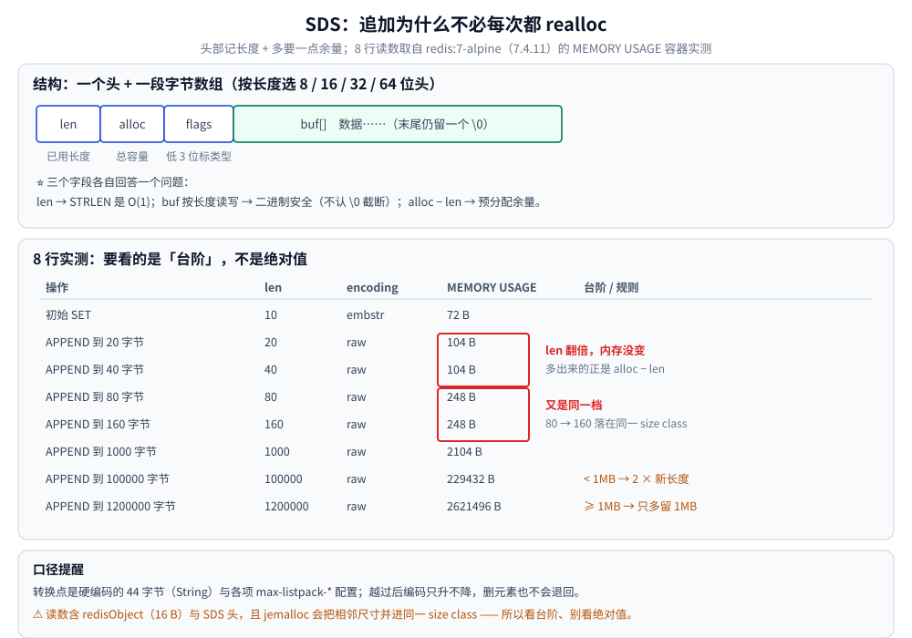
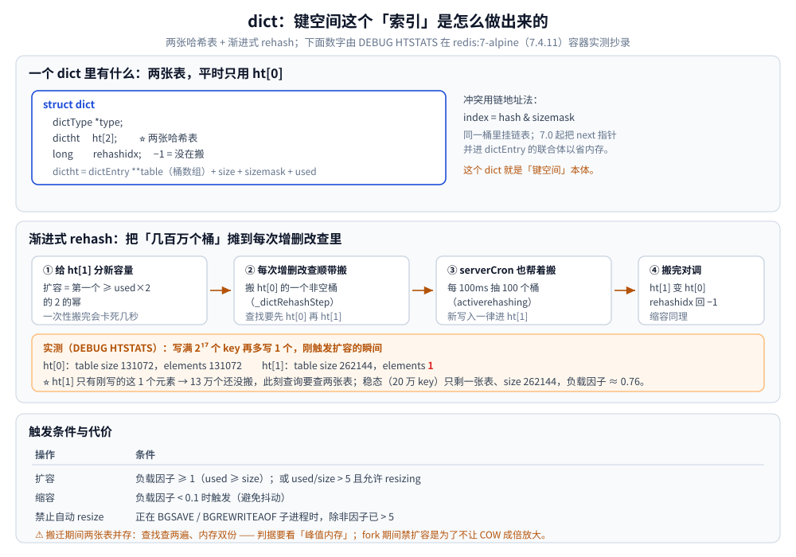
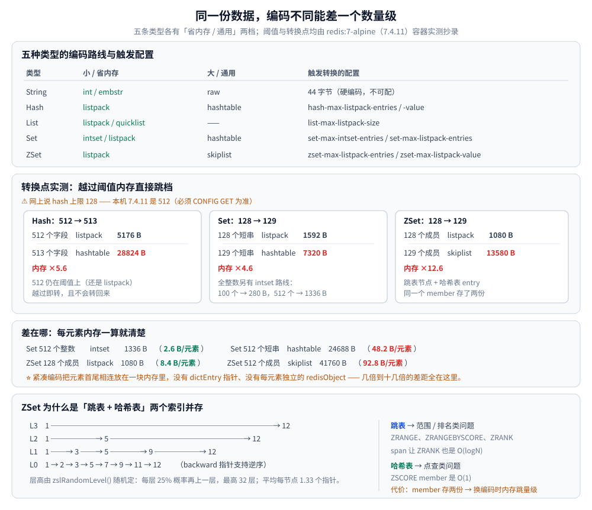

# Redis 底层数据结构

> 五种数据类型底下到底躺着什么结构、**「键空间」这个索引是怎么做出来的**，以及 Redis 7.0 / 8.x 相对《Redis 设计与实现》成书时代发生的变化（含本机容器实测）。
>
> 内容整理自个人学习笔记，并参考《Redis 设计与实现》（黄健宏）的第 2~8 章；原书以 Redis 3.0 为准，文中标 ⚠️ 处都是 3.0 之后的变化，一律以本机实测为准。文字层面的用法见 [数据类型.md](数据类型.md)，本文只讲「底下是什么、为什么这么选」。

---

## 一、为什么 Redis 要自己实现一整套底层结构？

C 语言标准库什么都有（字符串、哈希、数组），但 Redis 要的东西标准库给不了：

| 需求 | 标准库的问题 | Redis 的答案 |
|---|---|---|
| **长度 O(1)** | `strlen` 要遍历到 `\0` | SDS 自带 `len` 字段 |
| **二进制安全** | 字符串里不能出现 `\0` | SDS 按长度读写，不认终止符 |
| **追加不每次都 realloc** | `realloc` 每次都可能搬整块内存 | SDS 预分配 + 惰性释放 |
| **哈希表要能渐进扩容** | 没有现成实现 | dict：两张表 + 渐进式 rehash |
| **有序集合要能范围查询** | 没有现成实现 | skiplist：随机层高的链表 |
| **小对象别浪费内存** | 每个元素一个 malloc 开销太大 | intset / listpack：连续内存紧凑编码 |

⭐ **一句话**：这些结构的共同目标是「**把内存和 CPU 都抠到位**」——单线程模型下，一次 O(N) 就是一次全站卡顿，一字节浪费乘以几亿 key 就是几十 GB。

## 二、SDS：为什么不用 C 字符串？

**SDS（Simple Dynamic String）** = 头部 + 字节数组：

```text
struct sdshdr8 {          // 按长度选 8/16/32/64 位头，省空间
    uint8_t  len;         // 已用长度
    uint8_t  alloc;       // 分配的总容量（不含头和终止符）
    unsigned char flags;  // 低 3 位标记类型
    char buf[];           // 数据，仍保留结尾 \0，兼容 C 函数
};
```

**三个「为什么」**：

| 问题 | SDS 的做法 |
|---|---|
| 取长度为什么要 O(1)？ | `STRLEN` 是高频命令，遍历的代价在高 QPS 下不可接受 |
| 为什么二进制安全？ | 图片、序列化数据里必然有 `\0`，C 字符串会截断 |
| 为什么要有 `alloc`？ | **追加时不必每次 realloc** —— 这是本节的重点 |

**空间预分配策略**（`sdsMakeRoomFor`）：

- 追加后长度 **< 1MB** → 分配 `2 × 新长度`，即留一半余量；
- 追加后长度 **≥ 1MB** → 只多留 **1MB**（否则大 value 会平白多占一倍内存）。

这种「多要一点」的行为，在 `MEMORY USAGE` 里看得一清二楚（Redis 7.4.11 容器实测）：

```text
  初始 SET 10 字节          len=10       embstr           72 B
  APPEND 到 20 字节         len=20       raw             104 B
  APPEND 到 40 字节         len=40       raw             104 B     ← len 翻倍，内存没变
  APPEND 到 80 字节         len=80       raw             248 B
  APPEND 到 160 字节        len=160      raw             248 B     ← 又是同一档
  APPEND 到 1000 字节       len=1000     raw            2104 B
  APPEND 到 100000 字节     len=100000   raw          229432 B     ← 约 2 倍，<1MB 翻倍预分配
  APPEND 到 1200000 字节    len=1200000  raw         2621496 B     ← 只多留 1MB，不是 2 倍
```

⭐ **判据在「20→40」和「80→160」这两组**：`len` 翻了一倍，占用却一模一样 —— 多出来的就是预分配的 `alloc - len`。这就是 SDS 用空间换「追加不用每次 realloc」的直接证据。

> ⚠️ 内存读数含 `redisObject`（16 字节）与 SDS 头，不是纯 payload；容器内 jemalloc 的分配粒度会让相邻尺寸落进同一个 size class。所以要看的是**台阶**，不是绝对值。



## 三、字典 dict：键空间这个「索引」是怎么做出来的？

这是全文最该读透的一节：**Redis 的所有「查找」都靠它**。

### 3.1 一个 dict 里有什么

```c
typedef struct dict {
    dictType *type;
    dictht ht[2];        // ⭐ 两张哈希表，正常时只用 ht[0]
    long rehashidx;      // rehash 进度，-1 表示没在搬
} dict;
```

`dictht` 里是 `dictEntry **table`（桶数组）+ `size` + `sizemask` + `used`。

**冲突用链地址法**：`index = hash & sizemask`，同一个桶里挂链表。Redis 7.0 起为了省内存，把链表的 `next` 指针并进了 `dictEntry` 的联合体。

**哪些地方用 dict**：

| 用途 | 说明 |
|---|---|
| **db 的键空间** | `redisDb.dict`：key → 值对象，**这就是「索引」本体** |
| **带过期时间的 key** | `redisDb.expires`：key → 过期时间戳 |
| **Hash / Set 的大对象** | 字段数超阈值后底层换成哈希表 |
| **ZSet 的 member → score** | 跳表负责排序，哈希表负责「按 member 取 score 是 O(1)」 |

### 3.2 为什么是两张表：渐进式 rehash

扩容/缩容时如果一次性把几百万个桶全搬完，单线程会**卡死几秒**。Redis 的做法是**分摊**：

1. 给 `ht[1]` 分配新容量（扩容为第一个 ≥ `used×2` 的 2 的幂）；
2. 此后**每次增删改查**，顺带把 `ht[0]` 的一个非空桶搬到 `ht[1]`（`_dictRehashStep`）；
3. 同时 `serverCron` 每 100ms 抽 100 个桶搬（`activerehashing` 控制）；
4. 全部搬完 → `ht[1]` 变成 `ht[0]`，反向同理。

**代价**：搬迁期间**两张表同时存在**，查找要查两遍，内存也是双份。所以判据是「峰值内存」而非平均。

**本机实测（`DEBUG HTSTATS`，Redis 7.4.11）**：写满 2¹⁷ 个 key 再多写 1 个触发扩容，立即观察：

```text
 [Dictionary HT]
 Hash table 0 stats (main hash table):
  table size: 131072
  number of elements: 131072
 Hash table 1 stats (rehashing target):
  table size: 262144
  number of elements: 1            ← 只有刚写入的这一个进了新表
 [Expires HT]
```

⭐ **两张表并存、且 `ht[1]` 里只有 1 个元素** —— 这就是「渐进式 rehash 刚开始」的直接证据：旧表的 13 万个元素还没搬，查询此刻要查两张表。稳态下（20 万 key）则只有一张表、`table size = 262144`，说明容量总是 2 的幂且**负载因子小于 1**（20 万 / 26.2 万 ≈ 0.76）。

⚠️ **`DEBUG HTSTATS` 需要 `--enable-debug-command yes` 启动**；生产不建议开启（它能读取任意内存统计）。



### 3.3 扩容与缩容的触发条件

| 操作 | 条件 |
|---|---|
| **扩容** | 负载因子 ≥ 1（`used ≥ size`）；或 `used / size > 5` 且允许 resizing |
| **缩容** | 负载因子 < 0.1 时触发（避免抖动） |
| **禁止自动 resize** | 正在 `BGSAVE` / `BGREWRITEAOF` 子进程时，除非因子已 > 5 |

⭐ **最后一条是刻意的**：fork 之后父进程改内存会触发 COW，此时扩容/缩容会成倍放大内存复制，所以宁可让哈希表暂时「撑大一点」。（COW 的量化见 [持久化.md](持久化.md) 第一节。）

## 四、跳跃表：ZSet 为什么不用红黑树？

ZSet 需要「按 score 排序 + 按 score 范围查询 + 按排名取第 N 个」，能选的只有平衡树或跳表。Redis 选了**跳表**。

### 4.1 结构

```c
typedef struct zskiplistNode {
    sds ele;                       // 成员
    double score;                  // 分值
    struct zskiplistNode *backward;// 后退指针（支持逆序）
    struct zskiplistLevel {
        struct zskiplistNode *forward;
        unsigned long span;        // ⭐ 到下一个节点的跨度，用来算排名
    } level[];
} zskiplistNode;
```

层高由 `zslRandomLevel()` 随机决定：每层有 25% 概率再上一层，最高 32 层。

### 4.2 选它的三个理由

| 理由 | 说明 |
|---|---|
| **范围查询简单** | 先在高层定位起点，再在最底层顺序走 —— 不需要平衡树的中序遍历 |
| **实现与调试成本低** | 没有旋转/变色，`span` 让 `ZRANK` 也是 O(logN) |
| **写操作局部性好** | 插入只需改前后指针，不像树要旋转一大片 |

⚠️ **代价**：跳表平均每个节点 **1.33 个指针**（`1/(1-0.25)`），比红黑树多花内存。但配上 span 之后，`ZRANGE start stop` **不需要真的走中间元素** —— 这也是 `ZRANGE 0 9` 在百万成员榜上仍然很快的原因（实测见 [排行榜设计.md](../../../../04-架构与系统/系统设计/社交互动系统/排行榜设计.md)）。

### 4.3 为什么 ZSet 里还配了一个哈希表

`ZSet` 的对象结构是 `dict + zskiplist` **两个索引并存**：

- **跳表** → 解决「范围 / 排名」这类**有序**问题（`ZRANGE`、`ZRANGEBYSCORE`、`ZRANK`）；
- **哈希表** → 解决「`ZSCORE member` 是 O(1)」这类**点查**问题。

代价是同一个 member 存了两份（跳表节点 + 哈希表 entry），所以 ZSet 从 listpack 换成跳表时内存会**跳一个量级**（下一节有实测）。

## 五、intset 与 listpack：小对象的省内存路线

大结构用哈希表/跳表没问题，但「一个 Hash 只有 3 个字段」这种场景，哈希表的固定开销（桶数组 + `dictEntry` × N）比数据本身还大。所以 Redis 给**小对象**准备了连续内存的紧凑编码。

### 5.1 intset：只存整数的有序数组

```c
typedef struct intset {
    uint32_t encoding;   // INTSET_ENC_INT16 / 32 / 64
    uint32_t length;
    int32_t  contents[]; // 从小到大有序，查找用二分
};
```

- **只装得下整数**，插入非整数（或超容量）就整体转成别的编码；
- **升级不可逆**：一旦有元素需要 32 位，整个数组都升到 32 位 —— 且**不会降回来**。

### 5.2 listpack：替代 ziplist 的紧凑列表

**⚠️ 这是《Redis 设计与实现》时代之后最大的变化之一**：书里讲的是 **ziplist**，Redis 7.0 已全面换成 **listpack**。

ziplist 为了支持从后往前遍历，每个节点存了 `prevlen`；而 `prevlen` 长度会随前一个节点变长而改变（1 字节 ↔ 5 字节），一旦改变就要**级联更新后面所有节点**（连锁更新，最坏 O(N²)）。listpack 的做法是：

- 每个节点只存自己的长度（从前往后解析）；
- 想要倒序遍历时，用**逆序变长编码**从尾部往前解 —— 代价从「改一整条链」变成「一次局部解析」。

```text
listpack 元素：| encoding+数据 | ... | 终止符 0xFF |
```

⭐ **一句话记**：listpack 用「放弃 prevlen、改从尾部逆序解析」换掉了 ziplist 的连锁更新风险。

## 六、quicklist：List 是「链表 of listpack」

7.2 之前的 List 只有 quicklist：**双向链表，每个节点挂一个 ziplist（后为 listpack）**。

- **为什么不直接用链表**：每个元素一个 `listNode` + 一个 SDS，指针开销远大于数据；
- **为什么不直接用一个大 listpack**：一整块连续内存上做 `LPUSH` 要移动整个数组，且大块内存不好分配；
- **quicklist 的折中**：每个节点是一小段连续内存（默认约 8KB，由 `list-max-listpack-size -2` 控制），既有局部性又能 O(1) 头尾插。

**⚠️ 7.2 起小 List 有第三种状态**：元素很少时直接用一个 listpack（本机实测 3 个元素 → 编码 `listpack`，10000 个元素 → `quicklist`）：

```text
  3 个元素                              listpack         72 B
  10000 个元素                          quicklist     36640 B
```

## 七、对象的编码转换：什么时候会「变胖」

Redis 的每个值都是 `redisObject`，`encoding` 字段决定底层用哪种结构。**同一份数据，编码不同，内存能差一个数量级。**

### 7.1 五种类型的编码路线

| 类型 | 小 / 省内存 | 大 / 通用 | 触发转换的配置 |
|---|---|---|---|
| **String** | `int` / `embstr` | `raw` | 44 字节（硬编码，不可配） |
| **Hash** | `listpack` | `hashtable` | `hash-max-listpack-entries`、`hash-max-listpack-value` |
| **List** | `listpack` / `quicklist` | —— | `list-max-listpack-size` |
| **Set** | `intset` / `listpack` | `hashtable` | `set-max-intset-entries`、`set-max-listpack-entries` |
| **ZSet** | `listpack` | `skiplist` | `zset-max-listpack-entries`、`zset-max-listpack-value` |

### 7.2 ⚠️ 阈值必须以 `CONFIG GET` 为准，别背「128」

网上大量资料（包括很多面试八股）说 hash 的 listpack 上限是 128。**本机 7.4.11 实测不是**：

```text
  hash-max-listpack-entries      = 512        ← ⚠️ 不是 128
  hash-max-listpack-value        = 64
  zset-max-listpack-entries      = 128
  set-max-listpack-entries       = 128
  set-max-intset-entries         = 512
  list-max-listpack-size         = -2
```

**Hash 的真实转换点（实测）**：

```text
  510 个字段                            listpack       5176 B
  511 个字段                            listpack       5176 B
  512 个字段                            listpack       5176 B     ← 正好在阈值上，仍是 listpack
  513 个字段                            hashtable     28824 B     ← 越过即转换，内存 ×5.6
```

**Set 的三条路（实测）**：

```text
  100 个整数                            intset          280 B     ← 全整数 → intset
  混入 1 个非整数字符串                       listpack        280 B     ← 少量元素 → 转 listpack
  128 个短字符串                          listpack       1592 B
  129 个短字符串                          hashtable      7320 B     ← 越过 128 → hashtable
  512 个整数（intset 上限）                 intset         1336 B
  513 个整数（越过 intset 上限）              hashtable     24720 B     ← 元素数也超 128，直接跳 hashtable
```

**ZSet 的转换点（实测）**：

```text
  128 个成员                            listpack       1080 B
  129 个成员                            skiplist      13580 B     ← 内存 ×12.6
```

### 7.3 转换的真实代价：每元素内存

```text
  Set 512 个整数                    intset         1336 B   （  2.6 B/元素）
  Set 512 个短字符串                  hashtable     24688 B   （ 48.2 B/元素）
  ZSet 128 个成员                   listpack       1080 B   （  8.4 B/元素）
  ZSet 512 个成员                   skiplist      41760 B   （ 92.8 B/元素）
```

⭐ **差在哪**：紧凑编码把元素**首尾相连放在一块内存**里，没有 `dictEntry` 指针、没有每个元素独立的 `redisObject`；哈希表/跳表则每个元素都要一份指针与分配开销。**几倍到十几倍的差距，全在这里。**

⚠️ **转换是单向且不可逆的**：元素删回阈值以下，编码**不会自动退回去**（要退只能新建 key 或重启加载）。所以「一批 key 曾经超过阈值」这件事，会永久留在内存账上。

> ⚠️ String 的 `int` 编码只认「能装进 `long` 的整数」：`SET k 12345` 是 `int`，但 `SET k 3.14` **不是**，而是 `embstr` —— 浮点要业务自己算。



## 八、Redis 7.0+ / 8.x：书里没有的部分

《Redis 设计与实现》停在 Redis 3.0。以下是后续版本里值得知道的演进（本机用 `redis:7-alpine`（7.4.11）与 `redis:8-alpine`（8.10.2）两个容器实测）。

### 8.1 ziplist → listpack（7.0）

ziplist 已从 Hash / ZSet / List 的编码里退出，全部由 listpack 承担。所以看老文章里的 `ziplist` 编码名，在 7.0+ 实例上已经 `OBJECT ENCODING` 不出来了。

### 8.2 Array：第一个「按下标寻址」的核心类型（8.8）⭐

List 按位置访问是 O(N)（链表），Hash 的字段名是字符串不是下标。**Array 补的正是这个空**：整数下标 → 字符串值，下标范围 0 ~ 2⁶⁴−1，**稀疏不分配中间槽位**。

```bash
ARSET arr:ev 0 login click purchase   # 从下标 0 起连写多个值 → 返回新填充的槽位数
ARGET arr:ev 0                        # 读单个下标
ARLEN arr:ev                          # 长度 = 最大下标 + 1
ARCOUNT arr:ev                        # ⭐ 实际有值的槽位数（不是同一个东西！）
ARRING ring:px 3 v0                   # 定长环形缓冲，写满自动覆盖最旧的
ARLASTITEMS ring:px 3                 # 取最近 3 条
AROP arr:qps 0 99 SUM                 # 服务端聚合（SUM/MIN/MAX/AND/OR/XOR）
ARGREP arr:log 0 3 EXACT err:500      # 服务端文本检索
ARINFO arr:qps                        # 看内部结构
```

**实测**（Redis 8.10.2）：

```text
  ARSET arr:ev 0 login click purchase → 3
  ARGET arr:ev 0   → login
  ARGET arr:ev 999 → (nil)               ← 未设置的槽位返回 nil，不报错
  ARLEN arr:ev     → 3
  ARCOUNT arr:ev   → 3
  OBJECT ENCODING  → sliced-array        ← 底层编码名：切片数组
  MEMORY USAGE     → 209 B

  -- 稀疏对比 --
  ARSET arr:sparse 0 a ; ARSET arr:sparse 1000000 b
  ARLEN   = 1000001                      ← 最大下标 + 1
  ARCOUNT = 2                            ← 真的只有 2 个槽位有值
  MEMORY  = 2317 B                       ← 没有为中间 100 万个空位分配任何内存

  -- 环形缓冲 --
  ARRING ring:px 3 v0..v4 → 写入下标 0,1,2,0,1     ← 绕回了
  ARGET ring:px 0 = v3                             ← v0 已被覆盖
  ARLASTITEMS ring:px 3 = [v2 v3 v4]
```

⚠️ **`ARLEN` 与 `ARCOUNT` 是两个不同的东西**，这是踩坑第一名：稀疏数组的 `ARLEN` 可以极大，而真实占用要靠 `ARCOUNT`。

`ARINFO` 还把内部结构暴露出来了：

```text
 count                100
 len                  100
 next-insert-index    0
 slices               1
 directory-size       1
 super-dir-entries    0
 slice-size           4096
```

⭐ 不是「一个大数组」，而是**目录 + 分片**：`slice-size 4096` 说明一片装 4096 个槽位；元素数极大或下标极稀疏时会再加一层 super-directory，让 `ARSCAN` 的耗时与**实际存在的元素数**成正比，而不是与范围宽度成正比。

**适用 / 不适用**：

| 适合 | 不适合 |
|---|---|
| 按下标或下标区间快速读写 | 两头 push/pop → 用 List |
| 「最近 N 条」滑动窗口（`ARRING`） | 按字段名访问 → 用 Hash |
| 服务端聚合、服务端检索 | 需要中间插入元素 → 用 List |
| 稀疏、高下标（事件日志、时序采样） | |

### 8.3 Compact Hash：同构 hash 的字段名只存一份（8.10）⭐

「100 万个用户资料，字段都是 `name/email/country/last_login`」—— 老版本每个 key 都存一份字段名。8.10 引入**哈希模板**：字段名集合只存一份，各 key 共享。

```bash
HIMPORT PREPARE user-profile name email country last_login   # 声明字段集
HIMPORT SET user:1 user-profile "Alice" "a@example.com" "UK" "2026-07-14"
HIMPORT SET user:2 user-profile "Bob"   "b@example.com" "US" "2026-07-14"
```

**实测对比**（两台干净的 8.10.2 实例，各写 1000 个同构 hash）：

```text
[普通 HSET]   OBJECT ENCODING u:0 = listpack
              MEMORY USAGE u:0   = 101 B
              1000 个 key 总和   = 102890 B（102.9 B/key）
[HIMPORT ]    OBJECT ENCODING u:0 = template-listpack      ← 新编码
              MEMORY USAGE u:0   =  69 B
              1000 个 key 总和   =  70890 B（ 70.9 B/key）
              → 省 31%
```

⭐ **省下来的正是那 4 个字段名（33 字节）**。官方口径是「4 字段约 20~30%，字段名相对值越长省得越多，8 字段长名可达 68%」。

⚠️⚠️ **两个坑，实测各踩一次**：

1. **`HIMPORT` 的字段集是「连接级」的** —— 换一条连接就报 `ERR no such fieldset`。连接池环境下每条连接都要自己 `PREPARE`（或用客户端库的自动模式）。
2. **别用 `used_memory` 的整批差值来算节省比例** —— 它会把 db 字典扩容、分配器碎片、模板结构一起算进去。实测用差值法甚至得出「compact hash 反而更占内存」的**假结论**；换成**逐个 `MEMORY USAGE` 求和**（精确口径）才得到正确的 31%。

监控指标：`INFO STATS` 的 `hash_templates` / `hash_template_keys`，`INFO MEMORY` 的 `used_memory_hash_templates`（模板本身只占 1KB 级）。存量数据要转换需在 RDB 加载时用 `hash-rdb-load-*` 系列参数触发。

### 8.4 其它相关变化

| 变化 | 版本 | 说明 |
|---|---|---|
| **`INCREX`** | 8.8 | 一条原子命令做窗口计数限流（底层 GCRA），详见 [限流算法.md](../../../../04-架构与系统/分布式/服务治理/限流算法.md) |
| **kvobj 统一结构** | 8.2 | 短字符串 key 把 key 名、短值、TTL 打包进一次分配，内存降 25~37% |
| **`OBJECT REFCOUNT` 移除** | 7.4 | 想看「共享整数池 0~9999」已经没有命令入口了，只能靠文档 |
| **`OBJECT ENCODING` 新增编码名** | 7.2 / 8.8 / 8.10 | `listpack`（List）、`sliced-array`（Array）、`template-listpack`（Compact Hash） |

## 使用：现场观测编码与内存

```bash
# 1) 看一个 key 用的是哪种底层结构
OBJECT ENCODING user:1            # 例：listpack / hashtable / skiplist / quicklist / sliced-array
OBJECT ENCODING rank:day

# 2) 看单个 key 占多少内存（比 used_memory 差值精确得多）
MEMORY USAGE user:1
MEMORY USAGE big:hash

# 3) 阈值以实例为准，不要背数字
CONFIG GET hash-max-listpack-entries hash-max-listpack-value \
           zset-max-listpack-entries set-max-listpack-entries set-max-intset-entries

# 4) 键空间这个 dict 长什么样（需要 --enable-debug-command yes）
DEBUG HTSTATS 0                   # 正常一张表；扩容期间会同时出现 ht[0] 与 ht[1]

# 5) 在线调整阈值（只影响后续写入，不会把已转换的 key 变回去）
CONFIG SET hash-max-listpack-entries 128

# 6) 8.x 新结构
ARINFO arr:qps                    # Array 的内部结构（slices / slice-size / directory-size）
INFO STATS | grep hash_template   # Compact Hash 的模板与共享 key 数
```

⚠️ **`DEBUG` 系列命令在 7.x 起默认禁用**，需启动时加 `--enable-debug-command yes`，生产不要开。

## 延伸追问

- **跳表 vs 红黑树，ZSet 为什么选跳表？** → 跳表实现简单、天然支持有序范围查询（`ZRANGEBYSCORE` 定位起点后顺序遍历即可）；红黑树范围查询要中序遍历、实现与调试成本高，而 Redis 单线程也用不上红黑树的并发局部修改优势。额外收益是 `span` 让 `ZRANK` 也是 O(logN)。
- **渐进式 rehash 期间，读写怎么处理？** → 新增的 key 一律写进 `ht[1]`；查找要**先查 `ht[0]` 再查 `ht[1]`**；删除在两张表都试一遍。所以 rehash 期间命令略微变慢，但不会阻塞。
- **为什么扩容还要挑时机（fork 期间不扩）？** → 父进程一改内存就触发 COW，此时扩/缩容会把「复制几页」放大成「复制整张表」。宁可让负载因子暂时超标。
- **listpack 为什么不会连锁更新？** → 它不存 `prevlen`。倒序遍历时从尾部按逆序变长编码反解一个元素，代价是局部的一次解析，而不是「改一个头、后面全跟着改」。
- **`intset` 升级到 32 位后还能变回 16 位吗？** → 不能。编码只升不降，删元素也不会回退。
- **为什么 `MEMORY USAGE` 和 `INFO memory` 的差值对不上？** → `MEMORY USAGE` 只算这个 key（含 `dictEntry`、key 的 SDS、值对象）；`used_memory` 还含 db 字典、expires 字典、复制/客户端缓冲、分配器碎片。算「一批 key 省了多少」要用前者求和。
- **8.8 的 Array 能替代 List 吗？** → 不能。Array 强在「按下标访问、稀疏、服务端聚合」，List 强在「两头 push/pop、中间插入」。选型看访问模式是「位置」还是「顺序」。

## 关联

- [数据类型.md](数据类型.md) — 五大数据类型的命令与业务场景；本文是它们的「底下是什么」
- [持久化.md](持久化.md) — RDB 的 `fork + COW`、dict 扩容为何要避开 fork
- [高可用.md](高可用.md) — 主从全量同步传的就是 RDB
- [淘汰策略.md](淘汰策略.md) — 内存触顶后淘汰谁；近似 LRU 的采样池与 dict 的取样有关
- [分布式锁.md](分布式锁.md) — `SETNX` 与 Lua 原子释放
- [缓存问题与方案.md](../../缓存/缓存问题与方案.md) — 大 key / 热 key 都源于结构选型
- [散列表.md](../../../../02-计算机基础/数据结构/哈希表/散列表.md) — 通用哈希表原理；本文是它在 Redis 里的工程实现（渐进式 rehash）
- [位图与布隆过滤器.md](../../../../02-计算机基础/数据结构/高级数据结构/位图与布隆过滤器.md) — Redis 位图命令与 Bloom 模块
- [排行榜设计.md](../../../../04-架构与系统/系统设计/社交互动系统/排行榜设计.md) — ZSet 的跳表在实战中的表现（深分页为什么不慢）
- [跳跃表.md](../../../../02-计算机基础/数据结构/高级数据结构/跳跃表.md) — 本篇第四节只讲 ZSet 的跳表**用法与 Redis 取舍**；跳表本身的结构 / 查找插入 / 期望复杂度论证在这一篇（p=1/2 与 p=1/4 的对照表也在它 2.3 节）
> 反向引用（本篇被下列文档引到）：[集合容器.md](../../../../01-编程语言/java/集合容器.md)、[空间索引与R树.md](../../../../02-计算机基础/数据结构/树/空间索引与R树.md)、[索引原理.md](../MongoDB/索引原理.md)、[多核利用与部署方案.md](多核利用与部署方案.md)、[客户端使用.md](客户端使用.md)、[缓存选型对比.md](../../缓存/缓存选型对比.md)
