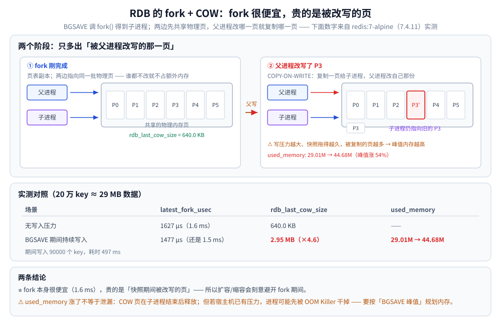
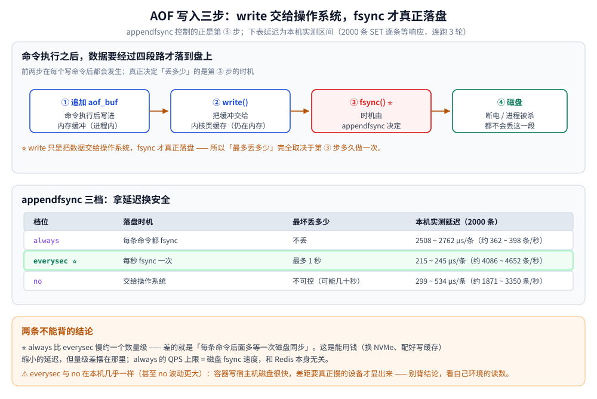
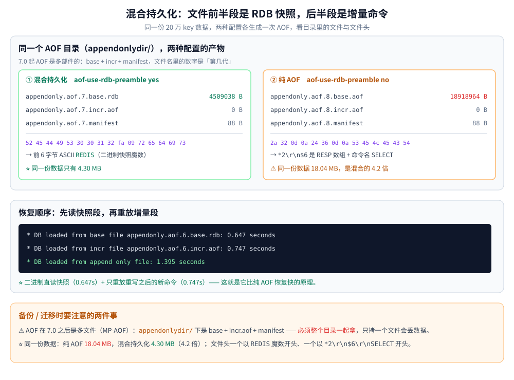

# Redis 持久化

> RDB 与 AOF 各自在做什么、`appendfsync` 三档的延迟差多少、`fork + COW` 会吃掉多少内存、混合持久化的文件到底长什么样（全部本机容器实测）。
>
> 内容整理自个人学习笔记，并参考《Redis 设计与实现》（黄健宏）的第 10、11 章；原书以 Redis 3.0 为准，文中标 ⚠️ 处为 3.0 之后的变化。参考资料见 [素材清单](../../../../素材清单.md)。

---

## 一、RDB：把某一刻的内存拍成二进制

RDB 是**快照**：某一时刻把整个数据集序列化成紧凑二进制文件。

```bash
SAVE          # ⚠️ 主线程执行，期间阻塞所有命令，生产禁用
BGSAVE        # fork 子进程执行，主线程继续服务  ⭐
```

### 1.1 fork + COW：快照为什么「不阻塞」

`BGSAVE` 调用 `fork()` 得到子进程。操作系统给子进程一份**页表副本**，父子进程指向同一批物理内存页 —— 所以 `fork` 本身很快。之后：

- 谁都不改 → 两边共享，不占额外内存；
- **父进程改某一页** → 该页被复制一份给子进程（**Copy-On-Write**）。

**实测（Redis 7.4.11，20 万 key ≈ 29 MB 数据）**：

```text
  无写入压力下的 BGSAVE：
    latest_fork_usec = 1627 µs          ← fork 本身只要 1.6 毫秒
    rdb_last_cow_size = 640.0 KB

  -- 加上写压力：BGSAVE 进行期间持续写入 --
    BGSAVE 期间写入了 90000 个 key，耗时 497ms
    latest_fork_usec  = 1477 µs         ← fork 还是 1.5 毫秒
    rdb_last_cow_size = 2.95 MB         ← COW 放大到 4.6 倍
    used_memory: 29.01M → 44.68M        ← 内存峰值涨了 54%
```

⭐ **结论：fork 很便宜，贵的是「快照期间被改写的页」。** 写压力越大、快照拖得越久，峰值内存越高。大实例上这足以触发 swap 甚至 OOM —— 所以扩容策略会**刻意避开 fork 期间**（见 [底层结构.md](底层结构.md) 第三节）。

⚠️ **`used_memory` 涨了不等于内存泄漏**：COW 页在子进程结束后释放，但如果宿主机那时已经有内存压力，进程可能先被 OOM Killer 干掉。规划内存时要按「BGSAVE 峰值」算，而不是按稳态数据量。



### 1.2 触发方式

```conf
save 900 1          # 900 秒内至少 1 次写 → 触发
save 300 10         # 300 秒内至少 10 次写
save 60 10000       # 60 秒内至少 10000 次写
dbfilename dump.rdb
dir /data
```

⚠️ **三个条件是「或」的关系**，任一满足即触发。`save ""` 则彻底关闭自动快照（纯缓存的常见配置）。

**手动触发**：`BGSAVE`；**关闭时自动触发**：收到 `SIGTERM` 会执行一次 `SAVE`。

**`stop-writes-on-bgsave-error yes`**（默认）：如果上次快照失败（比如磁盘满），Redis **拒绝所有写命令**。这是个双刃剑 —— 好处是「不会静默丢持久化能力」，代价是持久化故障会变成**业务不可写**。纯缓存场景可以关掉。

## 二、AOF：记录「重建数据的命令」

AOF 是**写命令日志**：把每条会改变数据的命令追加到文件末尾。

写入流程分三步（理解这三步才能理解后面的三档策略）：

1. 命令执行后，把内容**追加到 `aof_buf`（内存缓冲）**；
2. `serverCron` / `beforeSleep` 把 `aof_buf` **`write` 到磁盘**（进内核页缓存）；
3. 按 `appendfsync` 策略决定**什么时候 `fsync`**（真正落盘）。

⭐ **关键区分**：`write` 只是把数据交给操作系统，**`fsync` 才是真正落盘**。`appendfsync` 控制的正是第 3 步。

## 三、appendfsync 三档：拿延迟换安全

| 档位 | 落盘时机 | 最坏丢多少 | 延迟量级 |
|---|---|---|---|
| `always` | **每条命令都 fsync** | 不丢 | 每条一次磁盘同步 |
| **`everysec`** ⭐ | 每秒 fsync 一次 | **最多 1 秒** | 接近不落盘 |
| `no` | 交给操作系统 | 不可控（可能几十秒） | 最快 |

**本机实测（同一份负载：2000 条 SET，逐条等响应；连跑 3 轮取区间）**：

```text
  appendfsync always   :   5.017s ~   5.524s / 2000 条  →   2508 ~  2762 µs/条（ 362 ~  398 条/秒）
  appendfsync everysec :    430ms ~    489ms / 2000 条  →    215 ~   245 µs/条（4086 ~ 4652 条/秒）
  appendfsync no       :    597ms ~   1.069s / 2000 条  →    299 ~   534 µs/条（1871 ~ 3350 条/秒）
```

⭐ **`always` 比 `everysec` 慢约一个数量级** —— 差的就是「每条命令后面多等一次磁盘同步」。这是**能用钱解决的延迟**（换 NVMe、配好写缓存），但量级差摆在那里。

⚠️ **`everysec` 与 `no` 在本机几乎一样**（甚至 `no` 波动更大）：容器把数据写到宿主机磁盘很快，差距要真正慢的设备才显出来。所以「`no` 比 `everysec` 快很多」这个结论在你的机器上未必成立 —— **别背结论，看自己环境的读数**。

⚠️ **判据**：`always` 的 QPS 上限就是「磁盘 fsync 速度」，和 Redis 本身无关。要对账级数据用它，要吞吐就别碰。

**三种 fsync 策略下的数据安全性（`docker kill` = SIGKILL 实测，写入 10 万 key 后立即杀掉）**：

```text
  只开 RDB（save 900/300/60，两次快照之间全丢）：崩溃前 100000 → 重启后      0    丢失 100000
  AOF + appendfsync everysec（最多丢 1 秒）      ：崩溃前 100000 → 重启后 100000    丢失      0
  AOF + appendfsync always（每条都落盘）          ：崩溃前 100000 → 重启后 100000    丢失      0
```

⭐ **RDB 全丢、AOF 一个不差**。RDB 那 10 万 key 全在「上次快照之后」，SIGKILL 不给优雅退出机会，所以一条都没落盘。

⚠️ `everysec` 这次也丢了 0：因为杀进程发生在最后一次 fsync 之后。**它的理论最坏值是 1 秒的量**，不是「永远不丢」。



## 四、AOF 重写：把「过程」换成「结果」

AOF 是追加式的，同一个 key 被改 10 万次就有 10 万条记录：

```text
  10 万次 INCR counter →
    aof_current_size = 2700112 B（2.57 MB，约 27 B/条命令）

  BGREWRITEAOF 后 →
    aof_current_size = 108 B
    压缩比 25001 : 1
    而 counter 的真实值只有一个：100000
```

⭐ **重写的本质**：不再回放「过程」，而是直接写「结果」。10 万次 `INCR` 的等价表述就是 `SET counter 100000` 一行。

**重写期间的新写入怎么办**：子进程按 fork 时的内存状态生成新文件，同时主进程把新命令写进 `aof_rewrite_buf`；子进程写完后，父进程把缓冲追加到新文件，最后原子替换 —— 所以重写期间**不丢数据**。

```conf
auto-aof-rewrite-percentage 100     # 比上次重写后增长 100% 就自动重写
auto-aof-rewrite-min-size 67108864  # 且文件至少 64MB 才考虑（避免小文件频繁重写）
```

⚠️ **重写会 fork**，所以大实例上它有和 `BGSAVE` 一样的 COW 问题。

## 五、混合持久化：7.0 起的默认答案

RDB 恢复快但丢得多，AOF 丢得少但文件大、恢复慢。`aof-use-rdb-preamble yes`（**4.0 引入、7.0 起默认开启**）把两者拼起来：

- AOF 重写时，前半段写成 **RDB 格式快照**；
- 后半段继续**追加增量命令**。

**文件长什么样（实测，同一份 20 万 key 数据）**：

```text
--- ① 混合持久化（aof-use-rdb-preamble yes）---
-rw-------  4509038 B  appendonly.aof.7.base.rdb      ← 扩展名就是 .rdb
-rw-------        0 B  appendonly.aof.7.incr.aof
-rw-------       88 B  appendonly.aof.manifest
  base 文件前 16 字节： 52 45 44 49 53 30 30 31 32 fa 09 72 65 64 69 73
                        └─────── 52 45 44 49 53 = ASCII "REDIS" ──────┘

--- ② 纯 AOF（aof-use-rdb-preamble no）---
-rw------- 18918964 B  appendonly.aof.8.base.aof      ← 18.04 MB，4.2 倍
-rw-------        0 B  appendonly.aof.8.incr.aof
-rw-------       88 B  appendonly.aof.manifest
  base 文件前 16 字节： 2a 32 0d 0a 24 36 0d 0a 53 45 4c 45 43 54
                        └ 2a 32 = "*2"（RESP 数组）  后面是命令名 SELECT
```

⭐ **两组数字说话**：同一份数据，**纯 AOF 18.04 MB，混合持久化 4.30 MB（4.2 倍）**。而文件头一个以 `REDIS` 魔数开头、一个以 `*2\r\n$6\r\nSELECT` 开头 —— 前者是二进制快照，后者是命令文本。

**恢复顺序（容器重启日志，一手证据）**：

```text
  * DB loaded from base file appendonly.aof.6.base.rdb: 0.647 seconds
  * DB loaded from incr file appendonly.aof.6.incr.aof: 0.747 seconds
  * DB loaded from append only file: 1.395 seconds
```

⭐ 先读快照段（快，二进制直读）、再重放增量段（少，只有重写之后的新命令）—— **这就是它比纯 AOF 恢复快的原理**。

⚠️ **注意 AOF 目录在 7.0 之后变成多文件**：`appendonlydir/` 下是 `*.base.*` + `*.incr.aof` + `*.manifest`（这就是 **MP-AOF，多部件 AOF**）。备份/迁移时**要整个目录一起拿**，只拷一个文件会丢数据。



## 六、RDB 与 AOF 怎么选

| 维度 | RDB | AOF |
|---|---|---|
| 文件体积 | **小**（二进制） | 大（纯文本 4 倍+，混合后与 RDB 相当） |
| 恢复速度 | **快** | 慢（要重放命令） |
| 数据安全性 | 差（两次快照之间全丢） | 好（`everysec` 丢 ≤1s） |
| 对性能影响 | fork 瞬间抖动 + COW 内存 | 每次写都有追加开销 |
| 适合 | 备份、主从全量同步、允许丢数据 | 数据不能丢、可接受文件大 |

**结论**：

- **生产默认两个都开**：RDB 负责定时备份与[主从全量同步](高可用.md)，AOF（`everysec` + 混合持久化）把丢失窗口压到 1 秒内；
- **纯缓存**（丢了能回源）：只留 RDB 或干脆全关；
- **对账级数据**：AOF `always`，并接受吞吐下降一个数量级。

## 七、Redis 7.0+ / 8.x 的演进

| 变化 | 版本 | 说明 |
|---|---|---|
| **MP-AOF（多部件 AOF）** | 7.0 | AOF 拆成 `base` + `incr` + `manifest` 放在 `appendonlydir/`。重写时不再需要「父进程把缓冲追加到新文件」，减少了一次大拷贝与内存峰值 |
| **`BACKUP` 命令** | 8.10 | **节点级**备份恢复，基于 MP-AOF 实现增量备份。子命令：`START`（开始）/ `SEAL`（封存 BASE+INCR+manifest）/ `ABORT` / `CLEANUP` / `STATUS` / `LIST`；需先配置 `backupdirname`。本机未配置该项，只验证了命令存在与 `BACKUP STATUS` 返回 `state:idle` |
| **`rdb-compression` → `rdbcompression`** | 7.x | 配置名回归无连字符；本机 `CONFIG GET rdb-compression` 返回空即是此因 |
| **RDB 格式版本** | 持续 | 文件头 `REDIS0012`（7.4）—— 高版本 RDB 文件**不能被低版本加载**，降级要慎重 |

## 使用：配置与现场排查

```bash
# 1) 看持久化现状
INFO persistence
#   关键字段：rdb_last_bgsave_status / rdb_last_cow_size / rdb_changes_since_last_save
#             aof_last_bgrewrite_status / aof_current_size / aof_base_size
#   ⚠️ fork 耗时 latest_fork_usec 在 INFO stats 里，不在 persistence

# 2) 手动触发
BGSAVE                  # 拍快照
BGREWRITEAOF            # 重写 AOF
CONFIG REWRITE          # 把 CONFIG SET 的改动写回配置文件

# 3) 检查 AOF 文件完整性（出事时先跑它）
redis-check-aof --fix appendonly.aof.1.incr.aof

# 4) 大实例上别在业务高峰做这些
BGSAVE                  # fork + COW 会推高峰值内存
BGREWRITEAOF            # 同样要 fork
```

⚠️ **`CONFIG SET appendfsync always` 是救命也是自伤**：线上临时切过去能让「最后一段写入」不丢，但吞吐会掉一个数量级，务必确认下游扛得住。

## 延伸追问

- **RDB 和 AOF 怎么选？** → 生产**都开**：RDB 负责快照备份与主从全量同步，AOF（`everysec` + 混合持久化）把丢失窗口压到 1 秒内；纯缓存可只留 RDB 或全关。
- **`fork` 会不会阻塞主线程？** → 会，但很短（实测 20 万 key 的实例 1.6 毫秒）。真正的影响是 fork 之后的 COW 与内存峰值，不是 fork 这一下。
- **为什么 Redis 不做增量快照（像 MySQL 的 redo）？** → RDB 的定位是「全量快照 + 主从同步载体」，全量文件最省事也最快；增量的角色由 AOF 承担。8.10 的 `BACKUP` 则是给运维侧的节点级增量备份，不是给主从同步用的。
- **AOF 会不会无限膨胀？** → 会，靠 `auto-aof-rewrite-*` 或手动 `BGREWRITEAOF` 控制。重写是「用结果替换过程」，实测压缩比 25001:1（10 万次 INCR → 一行 SET）。
- **`everysec` 丢的「1 秒」具体是什么？** → `fsync` 是在 `beforeSleep` 里每秒做一次，所以丢的是「上一个 fsync 周期之后还没落盘的命令」。最坏情况就是 1 秒的写入量。
- **持久化文件能直接跨版本搬吗？** → RDB 文件头带格式版本（如 `REDIS0012`），**高版本写的低版本读不了**；AOF 是命令流，兼容性反而更好（除非用到新命令）。降级迁移前先备份并在测试环境验证。

## 关联

- [README.md](README.md) — Redis 目录导读、定位与「为什么快」
- [客户端使用.md](客户端使用.md) — Go（go-redis）与 Java（Jedis / Lettuce / RedisTemplate）的客户端落地
- [底层结构.md](底层结构.md) — `fork + COW` 与 dict 扩容为何要错开
- [高可用.md](高可用.md) — 主从全量同步传的就是 RDB，`repl-diskless-sync` 决定是走磁盘还是走网络
- [排行榜设计.md](../../../../04-架构与系统/系统设计/社交互动系统/排行榜设计.md) — RDB 与 AOF 崩溃恢复的对照实测（同一口径）
- [网络与存储.md](../../../../06-工程实践/部署/docker/网络与存储.md) — 容器化部署时数据卷怎么挂，持久化文件才不会随容器一起消失
> 反向引用（本篇被下列文档引到）：[NoSQL选型对比.md](../NoSQL选型对比.md)、[多核利用与部署方案.md](多核利用与部署方案.md)、[部署与运维.md](部署与运维.md)、[缓存一致性.md](../../缓存/缓存一致性.md)、[缓存容量与治理.md](../../缓存/缓存容量与治理.md)、[缓存选型对比.md](../../缓存/缓存选型对比.md)
