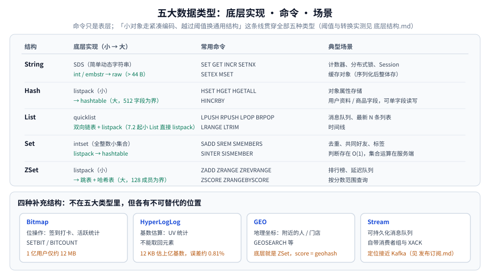

# Redis 数据类型与命令

> 五种基本类型（String / Hash / List / Set / ZSet）与四种补充结构（Bitmap / HyperLogLog / GEO / Stream）
> 各自**底层用什么实现、常用命令有哪些、适合什么场景**。编码转换的阈值与原理（listpack、intset、
> 跳表、渐进式 rehash）见 [底层结构.md](底层结构.md)，这些命令在 Go / Java 里的调用形态见 [客户端使用.md](客户端使用.md)。
>
> 内容整理自个人学习笔记，并参考《Redis 设计与实现》（黄健宏）；完整命令手册以官方文档为准。

---

## 一、五大数据类型与应用场景 ⭐

| 结构 | 底层实现 | 常用命令 | 典型场景 |
|---|---|---|---|
| **String** | SDS（简单动态字符串） | `SET` `GET` `INCR` `SETNX` `SETEX` `MSET` | 计数器、分布式锁、Session、缓存对象（序列化后存） |
| **Hash** | listpack（小）/ 哈希表（大） | `HSET` `HGET` `HGETALL` `HINCRBY` | 对象属性存储（用户资料、商品字段，可单字段读写） |
| **List** | quicklist（双向链表 + listpack） | `LPUSH` `RPUSH` `LPOP` `BRPOP` `LRANGE` `LTRIM` | 消息队列、最新 N 条列表、时间线 |
| **Set** | intset（全整数小集合）/ 哈希表 | `SADD` `SREM` `SMEMBERS` `SINTER` `SISMEMBER` | 去重、共同好友、标签 |
| **ZSet** | listpack（小）/ 跳表 + 哈希表（大） | `ZADD` `ZRANGE` `ZREVRANGE` `ZSCORE` `ZRANGEBYSCORE` | 排行榜、延迟队列、按分数范围查询 |

```bash
# String：value 最大 512MB；存对象建议 JSON/Protobuf 整体存取，要字段级更新则用 Hash
SET user:1:name "tom" EX 600
INCR article:1:views                # 原子自增，天然适合计数
SETNX lock:order:1001 uuid-abc      # 不存在才写入 → 分布式锁基础
HSET user:1 name tom age 18         # Hash：字段少时底层是 listpack（连续内存、省空间）
HGET user:1 name                    # 只取单字段；HGETALL 字段多时慎用，会阻塞
LPUSH queue:mail "m1" "m2"          # List：RPOPLPUSH/LMOVE 可做可靠队列
BRPOP queue:mail 5                  # 阻塞式出队，FIFO；高可靠场景改用 Stream
SADD user:1:tags go redis docker    # Set：判断存在 O(1)，集合运算在服务端完成
SINTER user:1:friends user:2:friends   # 共同好友
ZADD rank:day 95 tom 88 jerry       # ZSet：跳表让插入与范围查询都是 O(logN)
ZREVRANGE rank:day 0 9 WITHSCORES   # 取 Top 10
ZRANGEBYSCORE delay:queue 0 1700000000   # 延迟队列：score = 执行时间戳
```



## 二、补充结构：Bitmap / HyperLogLog / GEO / Stream

| 结构 | 用途                                                                                                                 |
|---|--------------------------------------------------------------------------------------------------------------------|
| **Bitmap** | 位操作，签到打卡、活跃用户统计（`SETBIT` / `BITCOUNT`），1 亿用户仅约 12MB，详见 [位图与布隆过滤器.md](../../../../02-计算机基础/数据结构/高级数据结构/位图与布隆过滤器.md) |
| **HyperLogLog** | 基数估算，UV 统计，**12KB 估算上亿基数、误差约 0.81%**，不能取回元素                                                                        |
| **GEO** | 地理坐标，附近的人 / 门店（底层是 ZSet，score 为 geohash）                                                                           |
| **Stream** | 可持久化消息队列，自带消费者组与 ACK，定位接近 Kafka（详见 [发布订阅.md](发布订阅.md) 的第一节）                                                        |

## 延伸追问

- **`String` 和 `Hash` 都能存对象，怎么选？** → 整体读写（JSON / Protobuf 一次存取）用 `String`；需要**单字段读写**或高频部分更新用 `Hash`。用 `String` 改单个字段要「读整串 - 改 - 写回」，既浪费带宽，又和其他写者互相覆盖。
- **`List` 能当消息队列吗？** → 轻量场景可以（`LPUSH` + `BRPOP`，`RPOPLPUSH` / `LMOVE` 还能做可靠出队），但它没有 ACK 与消费组，消费者崩溃会丢消息；要投递保证就换 Stream 或专业 MQ，对比见 [发布订阅.md](发布订阅.md) 的第一节。

## 关联

- [底层结构.md](底层结构.md) — 这些类型的编码路线与转换阈值（同一份内容「底下是什么」的那一半）
- [客户端使用.md](客户端使用.md) — 本文命令在 Go（go-redis）与 Java（Jedis / Lettuce）里的调用形态
- [发布订阅.md](发布订阅.md) — Stream 作为「能持久化的队列」与 Pub/Sub 的完整对比
- [位图与布隆过滤器.md](../../../../02-计算机基础/数据结构/高级数据结构/位图与布隆过滤器.md) — Bitmap 的原理与 Bloom 的工程用法
- [基数与频率估计.md](../../../../02-计算机基础/数据结构/高级数据结构/基数与频率估计.md) — HyperLogLog 的误差与空间代价
- [缓存问题与方案.md](../../缓存/缓存问题与方案.md) — 大 key / 热 key 的根因常常就是这里的结构选型
- [排行榜设计.md](../../../../04-架构与系统/系统设计/社交互动系统/排行榜设计.md) — ZSet 做实时榜的落地与实测
- [评论点赞设计.md](../../../../04-架构与系统/系统设计/社交互动系统/评论点赞设计.md) — `SADD` 去重与 `INCR` 计数
- [密码与敏感信息存储.md](../../../../06-工程实践/安全/密码与敏感信息存储.md) — 登录失败计数（`INCR` + `EXPIRE`）的键设计
- [存储选型.md](../../存储选型.md) — Redis 在整体存储选型中的位置
> 反向引用（本篇被下列文档引到）：[应用与场景.md](../MongoDB/应用与场景.md)、[缓存应用场景.md](../../缓存/缓存应用场景.md)、[优惠券系统设计.md](../../../../04-架构与系统/系统设计/秒杀系统/优惠券系统设计.md)、[库存系统设计.md](../../../../04-架构与系统/系统设计/秒杀系统/库存系统设计.md)
