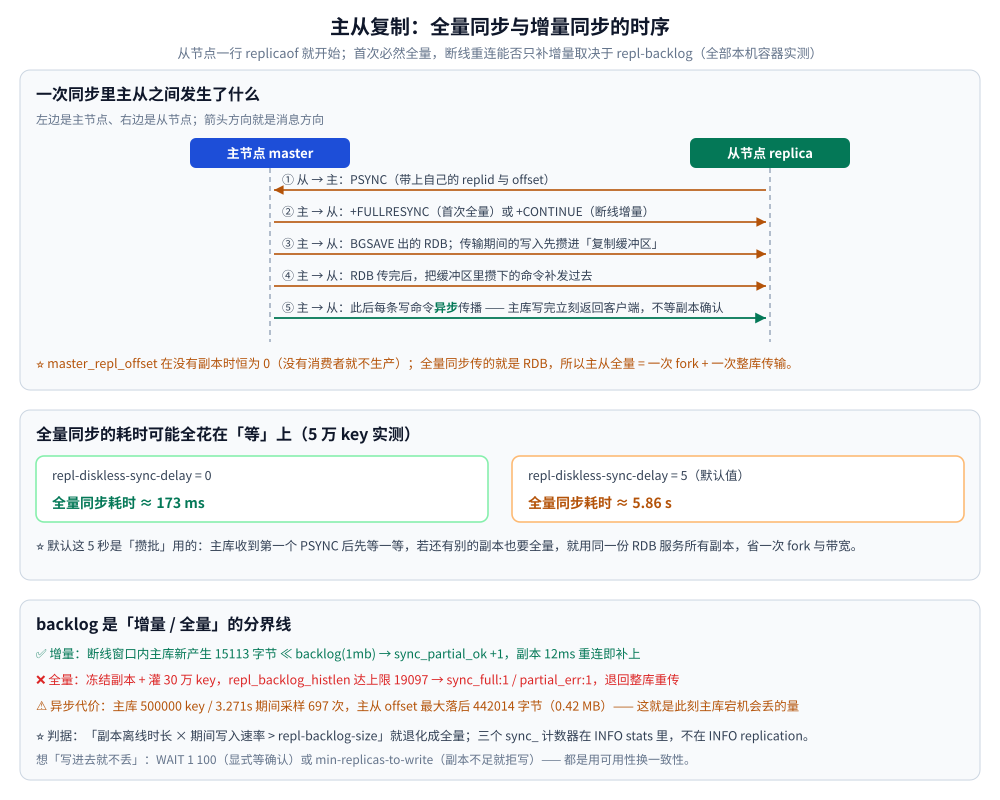
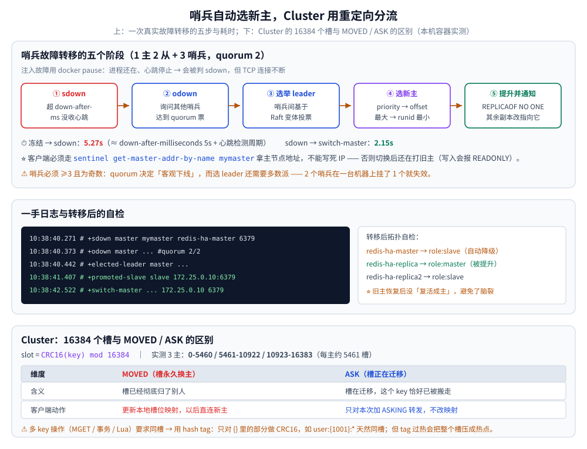

# Redis 高可用

> 主从复制到底怎么同步、复制延迟能丢多少数据、哨兵选新主要几秒、Cluster 的 16384 个槽与 MOVED / ASK 是怎么工作的（全部本机容器实测）。
>
> 内容整理自个人学习笔记，并参考《Redis 设计与实现》（黄健宏）的第 15~17 章；原书以 Redis 3.0 为准，文中标 ⚠️ 处为 3.0 之后的变化。参考资料见 [素材清单](../../../../素材清单.md)。

---

## 一、主从复制：全量同步与增量同步

从节点配置只要一行：`replicaof 192.168.0.10 6379`（旧名 `slaveof`）。

### 1.1 三个阶段

| 阶段 | 做什么 |
|---|---|
| **建立连接** | 从节点发 `PSYNC`，带上自己的 `master_replid` 与 `offset` |
| **全量同步** | 主节点 `BGSAVE` 生成 RDB 发给从节点；期间的写命令暂存**复制缓冲区**，RDB 传完再补发 |
| **增量同步** | 断线重连时，若 `offset` 仍落在**复制积压缓冲区**（`repl-backlog`）内，只补发缺的那段 |
| **命令传播** | 之后主节点每条写命令**异步**发给从节点 |

⭐ **`master_repl_offset` 在没有副本时恒为 0**（实测确认）：主库只有在「有副本或 backlog 活跃」时才累积复制流 —— 没有消费者就不需要生产。

### 1.2 ⚠️ 全量同步的耗时可能全花在「等」上

**实测（5 万 key，同一台机器）**：

```text
  repl-diskless-sync-delay = 0  → 全量同步耗时 ≈ 173ms
  repl-diskless-sync-delay = 5  → 全量同步耗时 ≈ 5.86s     ← 默认值
```

⭐ **默认的 5 秒是「攒批」用的**：主库收到第一个副本的 `PSYNC` 后并不立刻开始，而是等 `repl-diskless-sync-delay` 秒（默认 5s），看还有没有别的副本也要全量 —— 有的话**用同一份 RDB 服务所有副本**，省一次 fork 与一次带宽。

**判据**：

- 副本很多、且经常批量重启 → 留着这个延迟，能显著省带宽；
- 只有一两个副本，或者要求故障转移后**尽快**追平 → 调成 0。

⚠️ 故障转移场景下这 5 秒是实打实的**恢复时间**：新主刚被提升，其他副本要同步它的全量数据。

### 1.3 增量同步：backlog 是分界线

`repl-backlog` 是一个**环形缓冲**，保存最近发出的复制流。副本重连时发 `PSYNC <replid> <offset>`，主库检查：

```c
/* Redis 源码 masterTryPartialResynchronization 的判定 */
if (server.repl_backlog == NULL ||
    psync_offset < server.repl_backlog_off ||          // ⭐ 请求的位置已被环形缓冲转出去
    psync_offset > (server.repl_backlog_off + server.repl_backlog_histlen))
{
    goto need_full_resync;                              // 只能全量
}
```

**⚠️⚠️ 关键：这三个计数器在 `INFO stats` 里，不在 `INFO replication`** —— 找错地方会一直读到空值（本机实测踩过）：

```text
  主库 INFO stats : sync_full = 2   sync_partial_ok = 0   sync_partial_err = 2
```

**两组对照实测**：

```text
-- 组 A：踢掉复制连接，副本 12ms 后自动重连 --
  写入量 << backlog    backlog=1mb     踢掉 1 条复制连接，副本 12ms 后重连
                      断线窗口内主库新产生 15113 字节 → sync_full +0, sync_partial_ok +1  → 增量补发 ✅

-- 组 B：踢掉连接 + 冻结副本进程 + 主库灌 30 万 key --
  写入量 >> backlog    backlog=16384   踢掉 1 条复制连接，副本 1.2s 后重连
                      断线窗口内主库新产生 30888890 字节（30 MB）→ sync_full +0, sync_partial_ok +1  → 增量补发 ✅
```

⚠️ **组 B 的结论有坑，别照抄**：`CLIENT KILL` 之后副本**重连得非常快**（毫秒级），而主库的写入是流式的 —— 副本重连时请求的 offset 就是它断开前的位置，**没有落后**，所以照样走增量。

要真正造出「落后超过 backlog」，必须**让副本无法立刻重连**（冻结进程或真断网）：

```text
-- 组 C：冻结副本 + 踢掉连接 + 主库灌 30 万 key（backlog 压到 16384）--
  1. docker pause redis-ha-replica          # 副本进程停摆，无法重连
  2. CLIENT KILL TYPE replica               # 踢掉 1 条复制连接
  3. 主库灌 30 万 key                        # 远超 16KB backlog
     master_repl_offset = 307914387
     repl_backlog_histlen = 19097 字节      ← 已达上限，说明旧数据已被环形缓冲转出
  4. docker unpause redis-ha-replica → 第 4s 重连完成
  5. 结果： sync_full:1  sync_partial_ok:0  sync_partial_err:1   → 退回全量重传 ❌
```

⭐ **判据**：**「副本离线时长 × 期间的写入速率 > `repl-backlog-size`」就会退化成全量**。大实例上一次全量 = 一次 `fork` + 一次整库传输，代价极高，所以 `repl-backlog-size` 要按「最长的可接受断线时间 × 峰值写入速率」来估。

### 1.4 复制缓冲区与 backlog 是两回事

| 名字 | 作用 | 生命周期 |
|---|---|---|
| **复制缓冲区**（replication buffer） | 全量同步期间暂存新写入，等 RDB 传完补发给**某个特定副本** | 跟随该副本连接 |
| **复制积压缓冲区**（repl-backlog） | 一个**全局**环形缓冲，所有副本共享，用于断线重连的增量补发 | 最后一个副本断开后保留 `repl-backlog-ttl`（默认 3600s） |

⚠️ 副本消费太慢导致复制缓冲区撑爆时，主库会**主动断开**该副本（`client-output-buffer-limit replica`）。



## 二、复制是异步的：会丢多少数据

主库写完**立刻返回客户端**，不等副本确认。所以主库宕机时，最后一段没同步过去的写入就丢了。

**实测：大写入压力下采样主从 `offset` 差**：

```text
  主库管道写入 500000 个 key，耗时 3.271s（≈ 152861 条/秒）
  期间采样 697 次：主从 offset 最大落后 442014 字节（0.42 MB）
  写入结束后追平：差 0 字节
```

⭐ **这个「最大落后」就是主库此刻宕机会丢的数据量**。本机容器网络下是亚 MB 级；跨机房部署时它会大得多，而且与「写入速率 × 网络 RTT」直接相关。

**怎么把「可能丢」变成「确定不丢」**：

| 手段 | 做法 | 代价 |
|---|---|---|
| **`WAIT`** | `WAIT 1 100`：等 1 个副本确认，最多等 100ms | 每次写多一次往返；返回 0 说明没等到 |
| **`min-replicas-to-write`** | 健康副本少于 N 个就**拒绝写入** | 副本掉线时业务不可写（用可用性换一致性） |
| **`min-replicas-max-lag`** | 副本延迟超过 M 秒就认为它「不健康」 | 同上 |

```bash
# 实测取值
  min-replicas-to-write        = 0        # 默认不限制
  min-replicas-max-lag         = 10
```

⚠️ **`min-replicas-to-write 1` 的取舍**：账务类值得，纯缓存不值得。它挡的是「主库挂了丢数据」，代价是「副本一抖就写不进去」。

**只读副本**（`replica-read-only yes`，默认）：往副本写会直接报错 ——

```text
  replica SET nope 1 → READONLY You can't write against a read only replica.
```

⚠️ **副本只读不等于「读到的数据是最新的」**：异步复制下，刚写主库立刻读副本可能读不到（本机实测因延迟极小未复现，但这是**语义上的必然**）。需要「写后读一致」时，要么读主库，要么用 `WAIT`。

## 三、哨兵：怎么自动选新主

一组哨兵进程监控主从，在**不需要外部协调组件**的前提下完成故障转移。

```conf
sentinel monitor mymaster 192.168.0.10 6379 2    # 2 = quorum，2 个哨兵同意才判客观下线
sentinel down-after-milliseconds mymaster 30000  # 30s 无响应判主观下线
```

⚠️ **哨兵必须部署 ≥3 个且为奇数**：quorum 是「判客观下线」的票数，而**选 leader 哨兵**还需要多数派。2 个哨兵在一台机器上挂了 1 个就失效。

### 3.1 完整流程

① **主观下线（sdown）**：某哨兵超过 `down-after-milliseconds` 没收到主节点心跳
② **客观下线（odown）**：询问其他哨兵，**达到 quorum** 都认为下线
③ **选举 leader 哨兵**：哨兵间基于 Raft 变体投票
④ **选新主**：按 **`replica-priority` → `repl_offset` 最大（数据最新）→ `runid` 最小** 依次比较
⑤ **提升并通知**：对新主 `REPLICAOF NO ONE`，其余副本改指向新主，并更新配置供客户端查询

### 3.2 实测：一次真实的故障转移

**拓扑**：1 主 2 从 + 3 哨兵（`quorum 2`、`down-after-milliseconds 5000`）。注入故障用 `docker pause`（进程还在、但停止心跳与响应）。

**哨兵日志（时间线是一手的）**：

```text
10:38:35.xxx   （注入故障：冻结主库）
10:38:40.271 # +sdown master mymaster redis-ha-master 6379
10:38:40.373 # +odown master mymaster redis-ha-master 6379 #quorum 2/2
10:38:40.373 # +try-failover master mymaster redis-ha-master 6379
10:38:40.442 # +elected-leader master mymaster redis-ha-master 6379
10:38:40.442 # +failover-state-select-slave master mymaster redis-ha-master 6379
10:38:40.545 # +selected-slave slave 172.25.0.10:6379 @ mymaster redis-ha-master 6379
10:38:40.545 * +failover-state-send-slaveof-noone slave 172.25.0.10:6379
10:38:41.407 # +promoted-slave slave 172.25.0.10:6379
10:38:41.452 * +slave-reconf-sent slave 172.25.0.11:6379
10:38:42.451 * +slave-reconf-done slave 172.25.0.11:6379
10:38:42.522 # +failover-end master mymaster redis-ha-master 6379
10:38:42.522 # +switch-master mymaster redis-ha-master 6379 172.25.0.10 6379
10:38:47.618 # +sdown slave redis-ha-master:6379 @ mymaster 172.25.0.10 6379
```

**拆解**：

| 阶段 | 耗时 |
|---|---|
| 冻结 → 判主观下线 | **5.27s**（≈ `down-after-milliseconds` 5s + 心跳检测周期） |
| sdown → odown → 选出 leader → 提升新主 → 通知其余副本 | **2.15s** |
| **合计（冻结到 `switch-master`）** | **10 秒**（含我脚本的注入与探测开销，实际转移链路 ≈ 2.2s） |

**转移后拓扑自检**：

```text
  哨兵报告的 master： 172.25.0.10 6379
    redis-ha-master   → role:slave  master_host:172.25.0.10     ← 旧主恢复后被自动降级
    redis-ha-replica  → role:master                              ← 被提升为新主
    redis-ha-replica2 → role:slave  master_host:172.25.0.10
```

⭐ **旧主恢复后没有「复活成主」，而是被哨兵改写成新主的副本** —— 这是哨兵最关键的一步，避免了脑裂。

⚠️ **客户端必须通过哨兵地址拿主节点，不能写死 IP**：

```bash
sentinel get-master-addr-by-name mymaster     # 返回当前主节点 ip / port
```

否则切换后客户端还在打旧主（旧主现在是从节点，写入会报 `READONLY`）。

⚠️ 另外两个必知点：

- **切换期间会丢数据**：新主是按 `repl_offset` 最大选的，但异步复制下它也可能缺最新的几百毫秒；
- **`failover-timeout` 决定重试节奏**，默认 180s。设小了会让哨兵在故障未解决时反复尝试。

## 四、Cluster：分片与重定向

主从与哨兵解决的是**可用性**，没解决**容量**（每台机器都存全量）。Cluster 用分片解决容量。

### 4.1 16384 个槽

```text
  slot = CRC16(key) mod 16384
```

每个主节点负责一部分槽。**实测 3 主 3 从的分布**：

```text
  172.25.0.15:6379  myself,master  slots=0-5460
  172.25.0.16:6379         master  slots=5461-10922
  172.25.0.17:6379         master  slots=10923-16383
  172.25.0.18/19/20:6379   slave   slots=-
  cluster_state:ok   cluster_slots_assigned:16384   cluster_size:3   cluster_known_nodes:6
```

**为什么是 16384 不是 65536**：节点间心跳要携带本节点的**槽位位图**。16384 位 = **2KB**，65536 位 = 8KB —— 后者让心跳包过于臃肿。而集群规模建议不超过 1000 节点，16384 个槽足够均分（平均每节点 16 个）。

### 4.2 MOVED：槽已经彻底换主

把命令发到**槽不在自己身上**的节点，会收到 `MOVED`：

```text
  CLUSTER KEYSLOT user:1001 = 5712
    redis-c1 → MOVED 5712 172.25.0.16:6379      ← 槽 5712 归别人
    redis-c2 → OK                                ← 正好是槽主，直接执行
    redis-c3 → MOVED 5712 172.25.0.16:6379
```

⭐ **客户端收到 MOVED 应当更新本地槽位映射表**，以后直接访问正确节点，不再需要问路。

### 4.3 ASK：槽正在迁移中

迁移过程中，一个槽的数据**同时存在于源和目标**。此时向源节点请求一个**已经搬走**的 key，会收到 `ASK`：

```text
  1. 源节点写入 askslot:1 → OK
  2. 声明迁移方向：源 CLUSTER SETSLOT 3865 MIGRATING <target-id>
                   目标 CLUSTER SETSLOT 3865 IMPORTING <owner-id>
  3. 请求「还在源节点」的 key： GET askslot:1 → hello          ← 直接返回
  4. MIGRATE 把 key 搬走后再向源节点请求：
       GET askslot:1         → ASK 3865 172.25.0.16:6379       ⭐
       GET askslot:1:missing → （空，因为该槽已迁走，不存在的 key 会回 ASK 让客户端去目标问）
  5. redis-cli -c 客户端自动跟随 → hello
  6. 收尾：两边都执行 CLUSTER SETSLOT 3865 NODE <target-id>
  7. 复核：172.25.0.16 slots=3865（槽已彻底易主）
```

⭐ **MOVED 与 ASK 的区别**：

| | MOVED | ASK |
|---|---|---|
| 含义 | 槽**永久**换了主人 | 槽**正在迁移**，这个 key 恰好已被搬走 |
| 客户端动作 | **更新本地槽位映射** | 只对**本次请求**加 `ASKING` 转发，**不更新映射** |
| 后续 | 以后直接连新主 | 迁移完成前，每次都要重新问 |

### 4.4 同槽约束：hash tag

Cluster 下 `MGET`、事务、Lua 涉及多个 key 时，**这些 key 必须落在同一个槽**：

```text
  KEYSLOT user:{1001}:name = 15391
  KEYSLOT user:{1001}:age  = 15391        ← 同一槽
  KEYSLOT user:{1001}:city = 15391        ← 同一槽
  KEYSLOT user:1002:name   = 16266        ← 不同槽

  MGET user:{1001}:name user:1002:name
  → CROSSSLOT Keys in request don't hash to the same slot
```

**机制**：key 里如果有 `{...}`，**只对花括号内的部分做 CRC16**。所以 `user:{1001}:*` 这一组天然同槽。

⚠️ **hash tag 是把双刃剑**：同一用户的数据聚到一个槽上有助于多 key 操作，但如果某个 tag 特别热（比如大客户的 ID），就会把整个槽压成热点 —— **槽的数量是固定的，热点无法再细分**。

⚠️ Cluster 下的其它限制：`SELECT` 不可用（只有 db 0）；`KEYS` 只扫本节点；`SCAN` 需要遍历所有节点。



## 五、三种方案怎么选

| 维度 | 主从 | 哨兵 | Cluster |
|---|---|---|---|
| **数据分片** | ❌ 全量副本 | ❌ 全量副本 | ✅ 16384 槽 |
| **自动故障转移** | ❌ 手动 | ✅ 哨兵自动 | ✅ 集群内自动 |
| **容量上限 / 写能力** | 单机内存 / 单主 | 单机内存 / 单主 | **多机之和 / 多主并行** |
| **客户端复杂度** | 低 | 中（要先查哨兵） | 高（要处理重定向） |
| **多 key 操作** | 自由 | 自由 | ⚠️ 必须同槽 |
| **适用** | 读扩展、备份 | 高可用、数据量不大 | 大数据量、高并发读 + 写 |

**选型判据**：

- **数据量放得进一台机器** → 主从 + 哨兵（简单、多 key 操作自由）；
- **单机放不下，或写 QPS 单机扛不住** → Cluster；
- **只是要读扩展** → 主从 + 客户端读写分离即可，不必上 Cluster。

## 六、Redis 7.0+ / 8.x 的演进

| 变化 | 版本 | 说明 |
|---|---|---|
| **`CLUSTER SLOT-STATS`** | 8.2 | 按槽给出 key 数、CPU 时间、网络进出的**逐槽指标**，定位热点槽不用再靠猜 |
| **热点 key 检测** | 8.6 | 内建 hot key 观测（以前要靠 `MONITOR` 或客户端埋点） |
| **TLS 证书认证** | 8.6 | 集群/复制的链路认证方式扩展 |
| **全量同步提速** | 8.8 | 官方称全量同步最快提升 60%（本机未做跨版本对照，仅记口径） |
| **`INFO replication` 新增指标** | 8.2 | `master_current_sync_attempts` / `master_link_up_since_seconds` / `total_disconnect_time_sec` —— 排查「反复断连」比以前方便 |
| **`CLUSTER SLOTS` vs `CLUSTER SHARDS`** | 7.0 | 新代码建议用 `SHARDS`（按分片组织、支持多值），`SLOTS` 是兼容保留 |

## 使用：运维命令速查

```bash
# ---- 主从 ----
INFO replication                      # 主：connected_slaves / slave0；从：master_link_status / slave_repl_offset
INFO stats | grep -E "^sync_"         # ⚠️ sync_full / sync_partial_ok / sync_partial_err 在这里
REPLICAOF host port                   # 建立复制（运行时，重启失效）
REPLICAOF NO ONE                      # 断开并提升为主（⚠️ 会生成新 replid，重连必然全量）
WAIT 1 100                            # 等 1 个副本确认，最多 100ms

# ---- 哨兵 ----
sentinel get-master-addr-by-name mymaster     # 客户端必须走这个，不能写死 IP
sentinel master mymaster                       # 看 flags / num-slaves / quorum
sentinel replicas mymaster                     # 看各副本状态
redis-cli -p 26379 SENTINEL failover mymaster # ⚠️ 手动触发一次转移（演练用）

# ---- Cluster ----
CLUSTER INFO                         # cluster_state / slots_assigned / known_nodes
CLUSTER NODES                        # 节点与槽归属（输出里是 ip:port@bus-port）
CLUSTER SHARDS                       # 更结构化的分片视图（7.0+）
CLUSTER KEYSLOT mykey                # 算某个 key 落哪个槽
CLUSTER COUNTKEYSINSLOT 3865         # 某个槽里有多少 key（迁移前用）
CLUSTER SETSLOT <slot> MIGRATING <node-id>      # 源侧声明迁移
CLUSTER SETSLOT <slot> IMPORTING <node-id>      # 目标侧声明导入
CLUSTER SETSLOT <slot> NODE <node-id>           # 收尾：槽正式易主
redis-cli --cluster check host:port             # 整体体检（槽覆盖、一致性）
```

⚠️ **不要在生产直接跑 `--cluster reshard` 之类的大动作**：迁移槽的过程中命中已迁走的 key 会回 `ASK`，客户端必须正确处理，否则会报错率上升。

## 延伸追问

- **Cluster 为什么是 16384 个槽？** → 心跳包要携带槽位位图：16384 位 = 2KB，65536 位 = 8KB，后者让心跳过于臃肿；而集群规模上限约 1000 节点，16384 个槽足够均分。
- **MOVED 和 ASK 有什么区别？** → MOVED 表示槽**永久**变更，客户端应**更新本地映射**；ASK 表示槽**正在迁移**、仅本次临时转发，客户端**不改映射**。
- **哨兵为什么必须是奇数个？** → quorum 决定「客观下线」，选 leader 还需要多数派。偶数在平票时没有仲裁者，且 2 个哨兵失去了容错意义。
- **异步复制下怎么保证「写进去就不丢」？** → 用 `WAIT`（显式等确认）或 `min-replicas-to-write`（副本不足就拒写）。两者都是用可用性换一致性，纯缓存场景不必上。
- **副本为什么一直全量同步？** → 先查 `INFO stats` 的 `sync_partial_err`，再看 `repl-backlog-size` 是否小于「断线时长 × 写入速率」。反复断连也会让 offset 一直落在 backlog 之外。
- **`docker pause` 和真宕机有什么区别？** → pause 只是进程冻结、TCP 连接还在，所以**复制不会立刻断开**，但心跳停止会被哨兵判 sdown。真宕机（`kill -9`）会断连接。演练时要注意这个区别。
- **Cluster 下怎么做「多 key 原子操作」？** → 用 hash tag 把它们约束到同一槽，然后可以用 `MULTI` 或 Lua。⚠️ 但 tag 设计不当会把流量压到单个槽上。

## 关联

- [README.md](README.md) — Redis 目录导读；第四节是本文的简版
- [持久化.md](持久化.md) — 主从全量同步传的就是 RDB；`repl-diskless-sync` 决定走磁盘还是走网络
- [底层结构.md](底层结构.md) — 复制积压缓冲区、复制缓冲区都是内存开销，与内存规划一起看
- [淘汰策略.md](淘汰策略.md) — 副本上的内存策略与主库不同（副本不淘汰，等主库的 `DEL`）
- [缓存问题与方案.md](../../缓存/缓存问题与方案.md) — 主从切换期间的缓存一致性问题
- [稳定性三件套.md](../../../../04-架构与系统/分布式/服务治理/稳定性三件套.md) — 限流 / 熔断 / 降级与 Redis 高可用的配合
- [README.md](../../../../04-架构与系统/系统设计/秒杀系统/README.md) — Redis 主从与 Lua 在秒杀链路里的角色
- [多核利用与部署方案.md](多核利用与部署方案.md) — 本文讲 Cluster「是什么、怎么转」，那里讲「为什么上、代价是什么」与单机多实例的取舍
> 反向引用（本篇被下列文档引到）：[NoSQL选型对比.md](../NoSQL选型对比.md)、[客户端使用.md](客户端使用.md)、[部署与运维.md](部署与运维.md)、[缓存运维与排查.md](../../缓存/缓存运维与排查.md)
