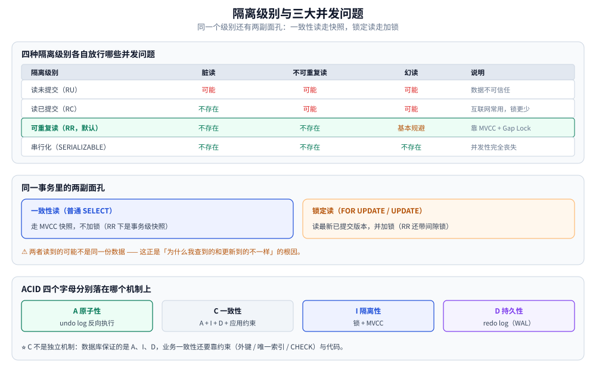

# 事务与隔离级别

> ACID 各自由什么机制保证、隔离级别与三大并发问题、隔离级别"实际加了什么锁"、
> 事务的代价与大事务拆分、死锁与隐式提交，以及本地事务的边界在哪。
>
> 内容整理自个人学习笔记，素材来源：《高性能 MySQL》（第 4 版）「事务」相关章节的读后整理，
> **按主题归纳而非逐字摘录**；参考资料与原始素材见 [素材清单](../../../../素材清单.md)。
> 涉及具体参数与行为均以 InnoDB（MySQL 5.7 / 8.0）为准。
>
> ⚠️ **本篇的边界**：事务的**实现与代价**（redo/undo/binlog 落盘、两阶段提交）见
> [日志与持久化.md](日志与持久化.md)；锁的粒度与 MVCC 落地见 [MVCC与锁.md](MVCC与锁.md)。

---

## 一、ACID 与各自的实现机制

**本节要点**：常见"什么是 ACID"，但真正要答的是**这四个字母分别落到哪个机制上** ——
说不清机制，就等于只记住了四个词。

常见"什么是 ACID"，但书的视角是 **"这四个字母分别落到哪个机制上"** —— 说不清机制，就等于只记住了四个词：

| 特性 | 含义 | 落在哪个机制 | 详见 |
| --- | --- | --- | --- |
| **A** 原子性 | 要么全做，要么全不做 | **undo log**：把修改前的值记下来，回滚时反向执行 | [日志与持久化.md](日志与持久化.md) |
| **C** 一致性 | 约束不被破坏（余额不能为负、唯一键不能重复） | **不是单一机制**：靠 A + I + D 保证，再加应用层约束（外键、唯一索引、CHECK、业务校验） | — |
| **I** 隔离性 | 并发事务互不干扰 | **锁 + MVCC**：写写用锁，读写用快照 | [MVCC与锁.md](MVCC与锁.md) |
| **D** 持久性 | 提交后即使断电也不丢 | **redo log**：先写日志再刷数据页（WAL） | [日志与持久化.md](日志与持久化.md) |

两个容易答错的点：

- **C 不是独立机制**。它是"前三者生效的结果 + 应用约束"。所以"数据库保证一致性"这句话是错的 —— 数据库保证的是 A、I、D，业务一致性要靠约束和代码；
- **undo 不只是回滚**。它同时承担 MVCC 的"读旧版本"，这一点 [日志与持久化.md](日志与持久化.md) 里展开过。

⭐ **C 不是独立机制，但它靠什么守住**：一致性 = 前三者生效的结果 + 应用层约束。
InnoDB 这一侧真正在守的是「落盘过程中不出半成品」：

| 机制 | 在这一环做什么 |
|---|---|
| **双写缓冲区** | 数据页刷盘前先写到一块连续区域，避免"页只写了一半"造成的页损坏 |
| **Redo Log** | 提交成功后若数据页还没落盘，崩溃时据此**前滚**（重放） |
| **Undo Log** | 失败时据此**回滚**（反向执行），同时供 MVCC 读旧版本 |

> 流程：开启事务 → 记 Undo（回滚素材）→ 记 Redo → **提交成功走 Redo 前滚，失败走 Undo 回滚**。

## 二、隔离级别与三大并发问题

**本节要点**：四种隔离级别的语义、各自放行的并发问题，以及**同一个级别在"读"和"锁"上的两副面孔**。

### 2.1 四种隔离级别与各自的并发问题

| 隔离级别 | 说明 | 可能出现的并发问题 |
|---|---|---|
| **读未提交**（READ UNCOMMITTED） | 事务提交前，所有数据都是"未提交数据"，**允许读到未提交数据** | **脏读** |
| **读已提交**（READ COMMITTED） | 只有事务 **commit 之后**，数据才能被其他事务读到 | **不可重复读、幻读** |
| **可重复读**（REPEATABLE READ） | 同一事务中**多次读取同一数据，结果一致** ✅ **MySQL 默认** | 幻读（MySQL 通过 MVCC/Gap Lock 基本规避） |
| **串行化**（SERIALIZABLE） | 隔离级别最高：**事务串行执行**，执行完第一个再执行第二个 | 无（但**并发性完全丧失，性能最低**） |

上表的"并发问题"是**语义层**的代价。下面这张表是**同一个隔离级别在代码层的两副面孔**：
普通 `SELECT`（一致性读）走快照，`FOR UPDATE` / `UPDATE`（锁定读）走加锁 —— 两者读到的可能不是同一份数据。

| 问题 | 定义 |
|---|---|
| **脏读** | 一个事务读到了**另一个事务未提交**的数据 |
| **不可重复读** | 同一事务中**多次读取同一行数据，结果不一致**（因为别人改并提交了） |
| **幻读** | 同一事务中**多次按条件查询结果集，条数发生变化**——<br>其他事务对**结果集**做了新增/删除并已提交，导致结果集**多出或少了数据** |
| （**丢失更新**） | 两个事务同时读-改-写，后者覆盖前者的修改 |

### 2.2 隔离级别决定「实际加了什么锁」

定义层面见本文 2.1，这里补书里更强调的**落地对应关系**：

| 隔离级别 | 一致性读（普通 `SELECT`） | 锁定读（`FOR UPDATE` / `UPDATE`） |
| --- | --- | --- |
| READ UNCOMMITTED | 直接读最新数据（脏读） | 加锁 |
| READ COMMITTED | 每次读都取最新快照（**语句级快照**） | 加锁，**只锁匹配到的行** |
| REPEATABLE READ（默认） | 事务开始时一份快照（**事务级快照**） | 加锁 + **间隙锁**防幻读 |
| SERIALIZABLE | 自动把普通 `SELECT` 也变成 `SELECT ... LOCK IN SHARE MODE` | 加锁 |

三条实战结论：

1. **RC vs RR 的差别不只是"幻读"**，还有**间隙锁的有无** —— 这直接影响锁范围、并发度和死锁概率。很多互联网业务选 RC 正是为了少锁；
2. **RR 的"可重复读"是靠快照实现的，不是靠锁** —— 所以普通 `SELECT` 不加锁却能保证重复读（MVCC）；
3. **同一事务里"快照读"和"锁定读"读到的可能不一致**：快照读看旧版本，`FOR UPDATE` 看最新已提交版本。这个差异是"为什么我查到的和更新到的不一样"的根因，[MVCC与锁.md](MVCC与锁.md) 里有对照实验。

### 2.3 「读未提交」适用于哪些场景？

**本节要点**：重点不在定义，而在**你能不能判断"这个数据可以信任到什么程度"**。

### 一句话答案

**"能看，不能用，也不能拿来做依据"的场景。**

也就是说：这份数据我只用来**展示给人看**，既**不作为业务判断依据**，也**不参与任何计算**。

### 先把前置概念理顺

事务隔离级别的作用，是**控制并发问题被解决到什么程度**。并发会带来三个问题：

| 问题 | 定义 | 危害 |
|---|---|---|
| **脏读** | A 事务读到了 B 事务**未提交**的修改 | 未提交就可能回滚，这条数据随时失去意义 |
| **不可重复读** | 同一事务内多次读**同一行**，结果不同 | 例：库存第一次读到 100、第二次读到 50。若订单按 100 下单，事务逻辑直接崩掉 |
| **幻读** | 同一事务内按条件查**结果集**，条数/内容变了 | 事务前后"多出/少了行"，破坏一致性判断 |

**读未提交（READ UNCOMMITTED）**：允许脏读、不可重复读、幻读。
→ 换句话说，**查出来的数据你根本没法信任**。

### 适用的具体场景

| 场景 | 为什么可以接受 |
|---|---|
| **监控系统、实时大屏** | 看在线人数、访问量等动态指标，**"100 万"还是"10 万出头"无所谓**，只看量级 |
| **非关键的展示型指标** | 数据只做展示，不影响任何业务动作 |

**不适用的场景（务必给出反例）**：

> 商品页显示"库存 2 件"，用户据此下单——但这是脏数据，**真实库存可能已经被其他事务消耗掉了**，
> 下单必然失败。这类数据**不能作为下单依据，也不能参与任何计算**。

### 补充：不一定要用"读未提交"来解决

即使业务对一致性要求很低，**也未必需要专门去开 `READ UNCOMMITTED`**：

- 用**缓存**承担这类展示数据（在线人数、访问量），更新节奏放宽到 5 秒 / 10 秒一次即可；
- 收益更大：**这部分读流量根本不会打到 MySQL**，直接减少了数据库的并发压力。

> 与其为了展示类数据降低隔离级别，不如把这部分流量挪到缓存层——
> 既拿到了松一致性，又保护了数据库。

**易错点**：把"读未提交"理解成"性能最高的隔离级别所以适用于高并发场景"。方向反了——
它的适用性取决于**数据能否被信任**，而不是性能。



## 三、事务的代价

**本节要点**：事务不是免费的 —— 每次提交贵在哪、什么算大事务、长事务的六宗罪怎么查。

这一节是书里最有价值、平时最容易被忽略、却最影响线上稳定性的部分：**事务不是免费的**。

### 3.1 每一次提交都比你以为的贵

| 开销 | 说明 |
| --- | --- |
| **日志刷盘** | 提交时 redo log 必须落盘（`innodb_flush_log_at_trx_commit=1`）；binlog 同理由 `sync_binlog` 控制 |
| **锁的持有时间** | 事务越长，锁持有越久，锁等待与死锁概率越高 |
| **undo 版本链** | 旧版本在事务结束后才可能被清理，回滚段持续增长 |
| **主从延迟** | 一个事务在备库上是**串行重放**的，大事务直接放大延迟 |
| **内存与临时表** | 大事务可能撑爆 undo 表空间或临时表 |

最直接的对照：**同一批 1 万行写入，放在一个事务里提交 vs 每条自动提交**，后者会做 1 万次日志刷盘与 `fsync`，吞吐差一到两个数量级。**"批量写要合并事务"是性能常识，而不是风格偏好。**

### 3.2 什么算"大事务"

不是按行数，而是按下面四条任意一条：

| 判据 | 参考阈值 |
| --- | --- |
| 执行时长 | 超过 **1 秒**就该警惕；超过 10 秒基本是事故源 |
| 涉及行数 | 单事务超过 **几千行**就要考虑拆分 |
| 持有锁的范围 | 事务里做了全表更新 / 大批量 `UPDATE` |
| 是否含 IO | 事务里调了外部接口、发了消息、写了文件 |

⚠️ **"事务里不做 IO"是硬规矩**：网络抖动会让事务从毫秒级变成秒级，锁被长时间持有，连带影响所有相关行。

### 3.3 长事务的六宗罪

1. **undo 无法清理** —— MVCC 要靠 undo 里的旧版本，只要有一个老事务还在读，整个回滚段都收不了（`History list length` 只涨不降）；
2. **版本链越拉越长** —— 后续每个快照读都要沿链找可见版本，查询越来越慢；
3. **锁长时间不释放** —— 直接表现为别的会话锁等待；
4. **主从延迟** —— 备库单线程（或并行度不足时）重放这个大事务；
5. **回滚代价极高** —— 一个跑了 10 分钟的事务失败回滚，可能要再花 10 分钟（甚至更久）；
6. **复制/备份受阻** —— 备份工具等待长事务结束。

**排查长事务**：

```sql
-- 当前活跃事务（按开始时间排序）
SELECT trx_id, trx_state, trx_started,
       TIMESTAMPDIFF(SECOND, trx_started, NOW()) AS seconds,
       trx_mysql_thread_id, trx_rows_locked, trx_rows_modified,
       LEFT(trx_query, 60) AS query
FROM information_schema.innodb_trx
ORDER BY trx_started;

-- 只看超过 10 秒的
SELECT trx_mysql_thread_id, TIMESTAMPDIFF(SECOND, trx_started, NOW()) AS seconds, trx_query
FROM information_schema.innodb_trx
HAVING seconds > 10;
```

| 字段 | 看什么 |
| --- | --- |
| `trx_started` | 事务开始时间 —— **判断长事务靠它，不是靠 `Time`** |
| `trx_state` | `RUNNING` / `LOCK WAIT`（锁等待中） |
| `trx_rows_locked` | 已经锁了多少行（大得不正常就是没走索引） |
| `trx_mysql_thread_id` | 需要 `KILL` 时用这个 id |

**治理**：应用侧加事务超时、`SET SESSION max_execution_time`、把大事务拆成小批次、把 IO 移出事务；数据库侧配监控告警（长事务数、`History list length`）。

## 四、死锁：为什么它防不住，只能减少

**本节要点**：死锁是并发系统的固有现象，要能说清**它怎么产生、InnoDB 怎么处理、应用层怎么配合**。

死锁不是 bug，是**并发系统的固有现象**。InnoDB 能做的只有：**尽早发现、回滚代价最小的一方、让另一方继续**。

### 4.1 发生的两个必要条件（在数据库语境下）

- **相反顺序加锁**：事务 A 锁行 1 再锁行 2，事务 B 锁行 2 再锁行 1；
- **锁的范围超出预期**：本该只锁一行，因为没有合适索引变成了锁一批行（甚至全表），"撞车"概率剧增。

⚠️ **间隙锁（gap lock）是 RR 隔离级别下的额外死锁来源**：`SELECT ... FOR UPDATE` 在没有精确索引时，锁的不是一行而是一段区间，两个事务很容易各持有一段并互相等待。这也是很多团队把线上隔离级别降到 RC 的原因之一。

### 4.2 检测与回滚

| 机制 | 说明 |
| --- | --- |
| **等待图（wait-for graph）** | InnoDB 默认开启（`innodb_deadlock_detect=ON`），发现环就立即回滚其中一个事务 |
| **死锁超时** | `innodb_lock_wait_timeout`（默认 50 秒），超时后报 `Lock wait timeout exceeded` |
| **回滚谁** | **回滚"代价最小"的那个** —— 通常是持有/修改行数少的事务。所以**死锁报错不是"谁先谁后"决定的，别指望它可预测** |

```text
ERROR 1213 (40001): Deadlock found when trying to get lock; try restarting transaction
```

**应用层必须按可重试错误处理**：捕获 1213（死锁）/ 1205（锁等待超时），在**事务外层**重试 1~3 次（一定要重新开启事务，不能在原事务里重试）。

### 4.3 五种减少死锁的手段

| 手段 | 原理 |
| --- | --- |
| **固定加锁顺序** | 把"锁行 1、再锁行 2"变成全局约定（如按主键升序），循环等待就不成立 |
| **小事务 + 尽快提交** | 持有时间越短，重叠窗口越小 |
| **让锁命中索引** | 走唯一索引的等值更新，锁的是那一行；否则可能锁一大片 |
| **降低隔离级别到 RC** | 消除大部分间隙锁（但要接受幻读风险与 binlog 格式约束） |
| **`SELECT ... FOR UPDATE` 前先短路判断** | 用普通读判断"要不要更新"，只有真要更新时才加锁 |

### 4.4 死锁怎么查

```sql
-- 最近一次死锁的完整信息（含两个事务的 SQL 与持锁/等锁情况）
SHOW ENGINE INNODB STATUS\G
-- 看 LATEST DETECTED DEADLOCK 段

-- MySQL 8.0：正在等锁的信息（比 innodb_trx 精确）
SELECT * FROM performance_schema.data_locks;
SELECT * FROM performance_schema.data_lock_waits;

-- 8.0 之前的等锁表
SELECT * FROM information_schema.innodb_locks;
SELECT * FROM information_schema.innodb_lock_waits;
```

⚠️ **`LATEST DETECTED DEADLOCK` 只保留最近一次**，而且一次死锁高发时会互相覆盖 —— 生产环境更该看 `data_lock_waits` 的**实时**等待关系，以及应用日志里的 1213 计数。排查"谁在等谁"的更细做法见 [MVCC与锁.md](MVCC与锁.md) 的实操小节。

## 五、隐式提交：事务边界比你想的更容易破

**本节要点**：哪些语句会在你不知情的情况下提交当前事务，以及 `autocommit` 与显式事务的边界。

### 5.1 会隐式提交的语句

| 类别 | 例子 |
| --- | --- |
| **DDL**（数据定义） | `CREATE` / `ALTER` / `DROP` / `TRUNCATE` / `RENAME` |
| **权限与账户** | `GRANT` / `REVOKE` / `SET PASSWORD` |
| **锁表** | `LOCK TABLES` / `UNLOCK TABLES` |
| **事务控制本身** | `BEGIN` / `START TRANSACTION`（在事务中再开一个，会把前一个提交） |
| **管理语句** | `ANALYZE TABLE` / `OPTIMIZE TABLE` / `FLUSH` / `RESET` |
| **复制相关** | `CHANGE MASTER TO` / `RESET SLAVE` |

**后果**：一个"回滚"以为能撤销的操作，因为中途夹了 `ALTER TABLE` 而被**半途提交**，回滚只回滚了后半段。

**规避**：迁移脚本（DDL）与业务事务彻底分开执行；绝不把 DDL 放进事务里"顺便执行"。

| 操作 | 说明 |
|---|---|
| **开始事务** | `BEGIN` / `START TRANSACTION` |
| **提交事务** | `COMMIT` |
| **回滚事务** | `ROLLBACK` |

**关键认知**：

> MySQL 中**一条 `UPDATE` 或 `INSERT` 语句本身也是一个事务**——
> 只是它是**隐式**的：**自动开启、自动提交**，我们没有显式操作它。
>
> 而一旦**显式调用"开始事务"，就必须显式调用"提交事务"**。

**精细化回滚：保存点（Savepoint）**

> 可以在事务中设置保存点，出错时**回滚到某个保存点后继续执行**，让回滚控制更精细。
>
> ⚠️ 但注意：**如果整个事务最终没有成功提交，事务仍会整体回滚——不管有没有保存点。**

| 模式 | 行为 |
| --- | --- |
| `autocommit=1`（默认） | **每条语句各自是一个事务**，执行完立即提交 |
| `autocommit=0` | 所有语句都在一个隐式事务里，直到你显式 `COMMIT`/`ROLLBACK` —— **极易产生长事务，不推荐** |
| `START TRANSACTION` | 显式开启事务，此时 `autocommit` 的取值不再影响这条链路 |

两个实践点：

- **`START TRANSACTION` 后建议紧跟一次快照读**（如 `SELECT ... FROM t WHERE id=? FOR UPDATE` 或普通 `SELECT`），让事务真正"起表"并确定快照时间点，避免"开启后隔了很久才执行第一条语句"导致的意外；
- **只读事务**（`START TRANSACTION READ ONLY`）能让 InnoDB 跳过部分事务管理工作，对报表类查询有收益。PHP/Go/Java 里的写法见 本文「使用一」「使用二」。

## 六、事务的边界：本地事务到此为止

**本节要点**：一个 InnoDB 事务只覆盖一个实例 —— 先问清边界，再谈"原子性"。

一个 InnoDB 事务**只覆盖一个 MySQL 实例**。跨库、跨服务、跨中间件（MySQL + Redis）的操作，本地事务无能为力：

| 场景 | 本地事务能保证吗 |
| --- | --- |
| 单库多表 | ✅ 能 |
| 单库多表 + 更新 Redis | ❌ 不能（Redis 不参与该事务） |
| 跨多个库 / 实例 | ❌ 不能（需 XA 或分布式事务方案） |
| 发消息 + 写库 | ❌ 不能（需本地消息表 / 事务消息） |

这一点在 [分布式事务.md](../../../../04-架构与系统/分布式/理论/分布式事务.md) 里展开。**"数据库事务保证了这个业务操作的原子性"这类说法，先问清它的边界在哪。**

---

## 使用一：Go（`database/sql` 事务：小事务、保存点、隔离级别）⭐

### 1. `RunInTx`：把「回滚、超时、死锁重试」收敛到一处

正文第一节的规避原则是「能不用事务就不用；能用小事务就用小事务」。
落到代码上就是**一个统一包装**：业务函数只拿到 `*sql.Tx` 写 SQL，
`defer Rollback`、死锁重试、panic 不回滚这类容易写漏的细节只出现一次。

```go
package txdemo

import (
	"context"
	"database/sql"
	"errors"
	"fmt"
	"math/rand"
	"time"

	"github.com/go-sql-driver/mysql"
)

var ErrNotEnough = errors.New("txdemo: balance not enough")

// 死锁与锁等待超时属于"重放一次就好"的错误：
//
//	1213 Deadlock found when trying to get lock; try restart transaction
//	1205 Lock wait timeout exceeded; try restarting transaction
//
// ⚠️ InnoDB 判死锁时只回滚"占 undo 较少"的那一方，但被回滚的是**整笔事务**，
// 所以重试必须从 fn 的第一条语句重放，不能只重跑失败的那一条 SQL。
func isRetryable(err error) bool {
	var me *mysql.MySQLError
	if !errors.As(err, &me) {
		return false
	}
	return me.Number == 1213 || me.Number == 1205
}

// RunInTx 开始事务 → 执行 fn → fn 无错则提交，有错则回滚；可重试错误按指数退避重放。
// opts 传 nil 即用全局默认隔离级别（MySQL 是 RR），大多数场景就该传 nil。
func RunInTx(ctx context.Context, db *sql.DB, opts *sql.TxOptions, fn func(*sql.Tx) error) error {
	const attempts = 3
	var lastErr error

	for i := range attempts {
		if i > 0 {
			// 抖动很重要：死锁意味着有热点行，多个实例同时"立刻重试"会再撞一次
			backoff := time.Duration(10<<i)*time.Millisecond + time.Duration(rand.Int63n(10))*time.Millisecond
			select {
			case <-ctx.Done():
				return ctx.Err()
			case <-time.After(backoff):
			}
		}
		lastErr = runOnce(ctx, db, opts, fn)
		if lastErr == nil || !isRetryable(lastErr) {
			return lastErr
		}
	}
	return fmt.Errorf("txdemo: giving up after %d attempts: %w", attempts, lastErr)
}

func runOnce(ctx context.Context, db *sql.DB, opts *sql.TxOptions, fn func(*sql.Tx) error) (err error) {
	tx, err := db.BeginTx(ctx, opts)
	if err != nil {
		return err
	}

	committed := false
	// 用标志位而不是无条件 defer tx.Rollback()：fn 里 panic 时这里同样会回滚，
	// 已提交时又不会白白报错（Rollback 在 Commit 之后返回 ErrTxDone）。
	defer func() {
		if !committed {
			_ = tx.Rollback()
		}
	}()

	if err = fn(tx); err != nil {
		return err
	}
	if err = tx.Commit(); err != nil {
		return err
	}
	committed = true
	return nil
}

// Transfer 是"小事务"的正例：事务里只有两条 UPDATE，
// 任何 RPC / 发消息 / 写 Redis 都必须放在返回之后。
//
// ⚠️ 死锁预防（正文第一节 ⑤）在这里的具体体现：**按主键大小固定顺序加锁**。
// A→B 与 B→A 并发转账时，如果各自先锁 from 再锁 to，就会形成环路等待；
// 统一成"先锁小 id"后，两笔事务抢锁顺序一致，只会排队不会死锁。
func Transfer(ctx context.Context, db *sql.DB, from, to, amount int64) error {
	first, second := from, to
	if second < first {
		first, second = second, first
	}

	return RunInTx(ctx, db, nil, func(tx *sql.Tx) error {
		for _, id := range []int64{first, second} {
			delta := amount
			if id == from {
				delta = -amount // 扣款方是负数
			}
			var err error
			if delta < 0 {
				// balance >= ? 是"条件更新"：把校验和更新压进一条 SQL，避免读-改-写竞态
				var r sql.Result
				r, err = tx.ExecContext(ctx,
					`UPDATE account SET balance = balance + ? WHERE id = ? AND balance >= ?`,
					delta, id, -delta)
				if err != nil {
					return err
				}
				if n, _ := r.RowsAffected(); n == 0 {
					return ErrNotEnough // 余额不足，整笔事务回滚
				}
				continue
			}
			if _, err = tx.ExecContext(ctx,
				`UPDATE account SET balance = balance + ? WHERE id = ?`, delta, id); err != nil {
				return err
			}
		}
		return nil
	})
}
```

> ⚠️ `*sql.Tx` **绑定单条连接**，所以：① 事务期间这个连接被池占用，长事务等于长期占池；
> ② `Tx` 不能并发使用（内部有状态机保护，会返回 `ErrConnDone` 之类错误而不是竞态）；
> ③ `ctx` 取消会**立即**中断事务并把连接丢弃，重试要重新 `BeginTx`。

### 2. 保存点：只回滚事务里的一段

正文说「保存点让回滚更精细，但最终没提交仍然整体回滚」。Go 里 `database/sql` 不暴露保存点，
只能自己发语句——注意它是**服务端特性**，别指望驱动帮你回滚：

```go
package txdemo

import (
	"context"
	"database/sql"
	"fmt"
)

// AdjustWithFallback：先尝试精确调整，失败就退回粗粒度调整，但事务继续。
func AdjustWithFallback(ctx context.Context, tx *sql.Tx, accountID, fine, coarse int64) error {
	const sp = "sp_adjust"
	const coarseSQL = `UPDATE account SET balance = balance - ? WHERE id = ?`

	if _, err := tx.ExecContext(ctx, "SAVEPOINT "+sp); err != nil {
		return err
	}

	err := execExact(ctx, tx, accountID, fine)
	if err == nil {
		_, err = tx.ExecContext(ctx, "RELEASE SAVEPOINT "+sp) // 释放保存点，改动保留
		return err
	}

	// 只把这一段撤掉，事务本身不回滚——ROLLBACK TO SAVEPOINT 不会结束事务
	if _, rbErr := tx.ExecContext(ctx, "ROLLBACK TO SAVEPOINT "+sp); rbErr != nil {
		return fmt.Errorf("rollback to savepoint: %w (原错误: %v)", rbErr, err)
	}
	if _, err := tx.ExecContext(ctx, "RELEASE SAVEPOINT "+sp); err != nil {
		return err
	}
	_, err = tx.ExecContext(ctx, coarseSQL, coarse, accountID)
	return err
}

func execExact(ctx context.Context, tx *sql.Tx, id, amount int64) error {
	res, err := tx.ExecContext(ctx,
		`UPDATE account SET balance = balance - ? WHERE id = ? AND balance >= ?`, amount, id, amount)
	if err != nil {
		return err
	}
	if n, _ := res.RowsAffected(); n == 0 {
		return fmt.Errorf("exact adjust rejected: account %d", id)
	}
	return nil
}
```

> ⚠️ 保存点的真实代价：它只是**undo 链上的一个标记**，段内已经拿到的行锁**不会因为回滚到保存点而释放**。
> 所以「用保存点来缩短持锁时间」是错的——要缩短持锁只能把操作挪出事务。

### 3. 隔离级别与只读事务：怎么在代码里设，以及一个易踩的坑

```go
package txdemo

import (
	"context"
	"database/sql"
	"time"
)

// SnapshotReport 演示"显式声明级别 + 只读"的一致性读。
// 只读事务的收益：InnoDB 不必为它分配回滚段，且优化器知道不会有写，
// 可以在真正只读的链路上把 RR 快照维持得更久。
func SnapshotReport(ctx context.Context, db *sql.DB) (int, error) {
	ctx, cancel := context.WithTimeout(ctx, 30*time.Second)
	defer cancel()

	tx, err := db.BeginTx(ctx, &sql.TxOptions{
		Isolation: sql.LevelReadCommitted, // 0 = LevelDefault，表示"不改，用服务端默认(RR)"
		ReadOnly:  true,
	})
	if err != nil {
		return 0, err
	}
	defer tx.Rollback() // 只读事务也必须结束，否则这条连接一直被占用

	var n int
	// 同一个事务内两次读结果一致——这就是正文"RR 只生成一次 Read View"的可观测形式
	if err := tx.QueryRowContext(ctx, `SELECT COUNT(*) FROM orders WHERE created_at >= ?`, time.Now().AddDate(0, -1, 0)).Scan(&n); err != nil {
		return 0, err
	}
	if err := tx.QueryRowContext(ctx, `SELECT COUNT(*) FROM orders WHERE created_at >= ?`, time.Now().AddDate(0, -1, 0)).Scan(&n); err != nil {
		return 0, err
	}
	return n, tx.Commit()
}
```

**三个必须知道的点**：

| 点 | 说明 |
|---|---|
| **驱动做了什么** | `Isolation != LevelDefault` 时，驱动在 `START TRANSACTION` **之前**发一条 `SET TRANSACTION ISOLATION LEVEL ...`；`ReadOnly` 走 `START TRANSACTION READ ONLY` |
| **⚠️ 池化连接的隐患** | 上面那条 `SET` 是**会话级**生效的，而连接会被池复用。是否随事务结束自动还原**取决于驱动实现，不要靠猜**：稳妥做法是事务结束后显式 `SET TRANSACTION ISOLATION LEVEL REPEATABLE READ` 还原，或全局统一配置后代码里一律传 `LevelDefault` |
| **改全局要落盘** | `SET GLOBAL transaction_isolation` 只影响**新建**连接；重启失效，必须同步写进 `my.cnf`（和正文 [日志与持久化.md](日志与持久化.md) 的 `gtid_mode` 同理） |

```sql
-- 验证当前到底生效了什么（正文"延伸追问"的最后一条）
SELECT @@global.transaction_isolation, @@session.transaction_isolation, @@transaction_read_only;

-- 手工复现一次"会话级设置会跟着连接走"：改完立刻结束会话再进来，看是否还原
SET SESSION TRANSACTION ISOLATION LEVEL READ COMMITTED;
```

### 4. 大事务拆分：批量写入的正确姿势

正文的「大事务」危害在这里最具体的表现形式是：**一次插入 100 万行** → 持锁久、undo 暴涨、
binlog 单事件巨大 → 从库单线程重放直接被打爆（对应 [日志与持久化.md](日志与持久化.md) 的第一节第五节）。

```go
package txdemo

import (
	"context"
	"database/sql"
	"fmt"
	"strings"
	"time"
)

type Row struct {
	ID   int64
	Name string
}

// ImportRows 分批提交：每批一个独立事务。
// 收益：① 每批持锁时间是毫秒级；② 失败只重放这一批；③ binlog 单事件不超 max_allowed_packet。
func ImportRows(ctx context.Context, db *sql.DB, rows []Row, batch int) error {
	if batch <= 0 {
		return fmt.Errorf("txdemo: bad batch size %d", batch)
	}
	started := time.Now()

	for i := 0; i < len(rows); i += batch {
		if err := ctx.Err(); err != nil { // 长任务必须可取消：否则进程退出时它还在写
			return err
		}
		end := min(i+batch, len(rows))
		chunk := rows[i:end]

		err := RunInTx(ctx, db, nil, func(tx *sql.Tx) error {
			// 多值 INSERT：一次解析、一次网络往返、一次刷页，比循环单条快一个量级
			var sb strings.Builder
			sb.WriteString(`INSERT INTO t_row (id, name) VALUES `)
			args := make([]any, 0, len(chunk)*2)
			for j, r := range chunk {
				if j > 0 {
					sb.WriteString(",")
				}
				sb.WriteString("(?,?)")
				args = append(args, r.ID, r.Name)
			}
			_, err := tx.ExecContext(ctx, sb.String(), args...)
			return err
		})
		if err != nil {
			return fmt.Errorf("import rows [%d,%d): %w", i, end, err) // 定位到批，便于断点续跑
		}
	}

	_ = started // 生产上这里打点：每批耗时 + 总进度
	return nil
}

// ✗ 反例（写出来是为了对照）：把 RPC 放进事务里
//
//	RunInTx(ctx, db, nil, func(tx *sql.Tx) error {
//	    tx.ExecContext(ctx, `UPDATE account SET ...`)
//	    resp, err := http.Post(payURL, ...)   // ← 下游抖动 3s，这 3s 里行锁一直被持有
//	    if err != nil { return err }
//	    tx.ExecContext(ctx, `INSERT INTO pay_log ...`)
//	    return nil
//	})
//
// 正确结构：先算/先调外部接口 → 只做一次短事务落库 → 事务外再发消息（发消息失败用本地消息表兜底）。
```

**批大小怎么定**：受 `max_allowed_packet`（默认 64M）限制的是**单条语句的字节数**，
经验值 **500～2000 行/批**；再配合每批耗时打点回调，直到单事务 p99 落在 50ms 以内。

## 使用二：Java（Spring 事务与事务内不做 IO）

### 1. `@Transactional`：先搞清它为什么"看起来没生效"

| 失效场景 | 原因 | 正确写法 |
|---|---|---|
| 方法内 `try { ... } catch (Exception e) { log }` | 异常没抛到代理层，Spring 以为一切正常 → **提交** | catch 后 `throw new RuntimeException(e)`，或 `TransactionTemplate` 手动控制 |
| 自调用（同类里 `a()` 调 `b()`） | 绕过了代理对象，注解形同不存在 | 拆到两个 Bean，或注入自身代理 |
| 方法非 `public` / 类非 Spring Bean | 代理不覆盖 | 改可见性 / 交给容器 |
| 只抛了**受检异常**（`IOException`） | **默认只回滚 `RuntimeException` 和 `Error`** | `@Transactional(rollbackFor = Exception.class)` |
| 用了 `REQUIRES_NEW` 但外层也捕获了 | 内层已独立提交，外层回滚不会撤掉它 | 明确边界，别指望"一起回滚" |
| 事务方法里做 RPC / HTTP | 与 Go 侧同一个坑：下游超时 = 持锁时长 | 事务只包 DB 操作 |

```java
package notes.mysql.tx;

import java.util.List;
import org.springframework.transaction.annotation.Isolation;
import org.springframework.transaction.annotation.Propagation;
import org.springframework.transaction.annotation.Transactional;
import org.springframework.jdbc.core.JdbcTemplate;
import org.springframework.stereotype.Service;

@Service
public class AccountTxService {

    private final JdbcTemplate jdbc;

    public AccountTxService(JdbcTemplate jdbc) {
        this.jdbc = jdbc;
    }

    // 对应 Go 侧的 Transfer：固定加锁顺序 + 条件更新，事务只包含两条 UPDATE
    @Transactional(rollbackFor = Exception.class, isolation = Isolation.DEFAULT, timeout = 5)
    public void transfer(long from, long to, long amount) {
        long first = Math.min(from, to), second = Math.max(from, to);
        for (long id : new long[] {first, second}) {
            long delta = id == from ? -amount : amount;
            int n;
            if (delta < 0) {
                n = jdbc.update("UPDATE account SET balance = balance + ? WHERE id = ? AND balance >= ?",
                        delta, id, -delta);
                if (n == 0) {
                    throw new IllegalStateException("余额不足: " + id); // 抛出去才会回滚
                }
            } else {
                jdbc.update("UPDATE account SET balance = balance + ? WHERE id = ?", delta, id);
            }
        }
    }

    // 对应 Go 侧的 SnapshotReport：只读 + 明确级别，报表链路
    @Transactional(readOnly = true, timeout = 60)
    public List<Long> staleOrderIds(int days) {
        return jdbc.queryForList(
                "SELECT id FROM orders WHERE status = 'NEW' AND created_at < NOW() - INTERVAL ? DAY",
                Long.class, days);
    }

    // 对应 Go 侧的保存点：NESTED 在无 JTA 时正是用 SAVEPOINT 实现
    @Transactional(propagation = Propagation.NESTED, rollbackFor = Exception.class)
    public void adjustFine(long id, long delta) {
        int n = jdbc.update("UPDATE account SET balance = balance - ? WHERE id = ? AND balance >= ?", delta, id);
        if (n == 0) {
            throw new IllegalStateException("精确调整失败"); // 只回滚到调用方设的保存点，外层事务继续
        }
    }
}
```

**死锁重试 Spring 不管**——要么用 `spring-retry`：

```java
@Transactional
@Retryable(for = DeadlockLoserDataAccessException.class, maxAttempts = 3,
        backoff = @Backoff(delay = 10, multiplier = 2, random = true))
public void transferWithRetry(long from, long to, long amount) {
    transfer(from, to, amount);
}
```

要么用 `TransactionTemplate` 手写，和 Go 侧 `RunInTx` 一模一样（推荐：重试次数、退避、
"哪些异常可重试"完全可控，且不依赖注解生效条件）：

```java
package notes.mysql.tx;

import org.springframework.transaction.support.TransactionTemplate;
import org.springframework.dao.ConcurrencyFailureException;

public class TxRunner {

    private final TransactionTemplate tx;

    public TxRunner(TransactionTemplate tx) {
        this.tx = tx; // tx.setIsolationLevel(..) / setReadOnly(true) / setTimeout(5) 在这里统一配
    }

    public void run(TxBody body) {
        for (int attempt = 1;; attempt++) {
            try {
                tx.executeWithoutResult(status -> body.doInTx(tx));
                return;
            } catch (ConcurrencyFailureException e) { // 死锁 / 乐观锁冲突都归到这里
                if (attempt >= 3) {
                    throw e;
                }
                sleepWithJitter(attempt);
            }
        }
    }

    interface TxBody {
        void doInTx(TransactionTemplate ignored);
    }

    private static void sleepWithJitter(int attempt) {
        long base = 10L << attempt;
        try {
            Thread.sleep(base + (long) (Math.random() * 10));
        } catch (InterruptedException ie) {
            Thread.currentThread().interrupt();
            throw new IllegalStateException(ie);
        }
    }
}
```

### 2. 大事务拆分与"事务内不做 IO"

```java
// ✗ MyBatis 里循环单条 insert：N 次网络往返 + N 次 binlog event
for (Row r : rows) {
    mapper.insertOne(r);
}

// ✓ 分批 + 多值插入；每批一个独立事务，失败只重放这批
int batch = 500;
for (int i = 0; i < rows.size(); i += batch) {
    List<Row> chunk = rows.subList(i, Math.min(i + batch, rows.size()));
    txRunner.run(tx -> mapper.insertBatch(chunk));   // <foreach> 生成 (?,?,),(?,?)
}
```

> MySQL 侧的 `max_allowed_packet`、binlog 单事件过大、undo 暴涨这三条约束对 Java 完全一样成立，
> 批大小同样建议 **500～2000 行**。

## 延伸追问

- **MySQL 默认隔离级别是什么？为什么选它？** → 可重复读。基于 MVCC 实现，
  读写不互相阻塞，在保证较好一致性的同时兼顾并发性能。
- **RR 下幻读被解决了吗？** → MVCC 的快照读基本规避了幻读；
  但**当前读（`SELECT ... FOR UPDATE`）仍可能幻读**，需要 **Next-Key Lock（间隙锁）** 配合。
- **怎么查看当前隔离级别？** → `SELECT @@transaction_isolation;`

- **ACID 分别靠什么机制实现？** → A 靠 undo log 回滚、D 靠 redo log（WAL）、I 靠锁 + MVCC、**C 不是独立机制**（是前三者的结果 + 应用层约束）。**能把 C 说清楚的人很少**。
- **事务的代价是什么？** → 日志刷盘、锁持有、undo 版本链、主从延迟。**最直观的对照是"1 万行一次提交" vs "1 万次自动提交"**，性能差一到两个数量级。
- **什么算大事务？** → 不看行数看四条：执行时长（>1s 警惕）、涉及行数（>几千）、锁范围（是否全表）、**是否含 IO**。事务里做远程调用是最常见的"人为制造长事务"。
- **长事务有什么危害？** → undo 收不掉、版本链变长、锁不释放、主从延迟、回滚代价高。**排查靠 `information_schema.innodb_trx` 的 `trx_started`，不是靠 `SHOW PROCESSLIST` 的 `Time`**。
- **死锁怎么产生的？怎么减少？** → 相反顺序加锁、或没有索引导致锁范围过大（RR 下还有间隙锁）。减少手段：固定顺序、小事务、让锁命中索引、降级到 RC、先短路判断再加锁。**死锁只能减少，不能消除**。
- **死锁了怎么办？谁被回滚？** → InnoDB 用等待图检测，**回滚代价最小的事务**。应用层要把 1213/1205 当可重试错误，**在事务外层重试**（不能原地重试）。
- **哪些语句会隐式提交？** → DDL、`LOCK TABLES`、`GRANT`、`BEGIN`、`ANALYZE TABLE` 等。**最危险的是"事务里夹了一句 DDL"，回滚只回滚了一半**。
- **RC 和 RR 到底该选哪个？** → 除了幻读语义，关键是**间隙锁的有无**：RR 有间隙锁（更安全但锁范围大、死锁多），RC 基本没有（并发好，但要接受幻读与 binlog 格式约束）。互联网业务常用 RC。
- **`FOR UPDATE` 查到的数据和普通 `SELECT` 不一致？** → 正常现象：普通 `SELECT` 是快照读（读事务开始时的版本），`FOR UPDATE` 是当前读（读最新已提交版本）。
- **本地事务能保证什么？** → **只覆盖单个 MySQL 实例**。涉及 Redis、MQ、其它服务时，本地事务的原子性不成立，要上本地消息表、事务消息或分布式事务方案。

## 关联

- [MVCC与锁.md](MVCC与锁.md) — 锁的粒度、MVCC 落地、快照读与当前读的对照实验
- [日志与持久化.md](日志与持久化.md) — redo / undo / binlog 的分工、一次写入的 8 步落盘与两阶段提交
- [参数调优.md](参数调优.md) — redo 与刷盘参数：事务代价的另一半
- [观测与诊断.md](观测与诊断.md) — 长事务与锁等待的排查表
- [索引设计与EXPLAIN.md](索引设计与EXPLAIN.md) — 锁的范围取决于索引：没有合适索引时行锁会退化成大范围锁
- [查询优化.md](查询优化.md) — 大事务的另一个解法是把它拆成小批量语句
- [复制与高可用.md](复制与高可用.md) — 大事务的另一重代价：从库重放导致的延迟
- [数据迁移与备份恢复.md](数据迁移与备份恢复.md) — GTID 模式与切换时的写入一致性
- [分布式事务.md](../../../../04-架构与系统/分布式/理论/分布式事务.md) — 本地事务管不到的地方：XA、TCC、可靠消息
> 反向引用（本篇被下列文档引到）：[事务与一致性.md](../../NoSQL/MongoDB/事务与一致性.md)、[数据建模.md](数据建模.md)
