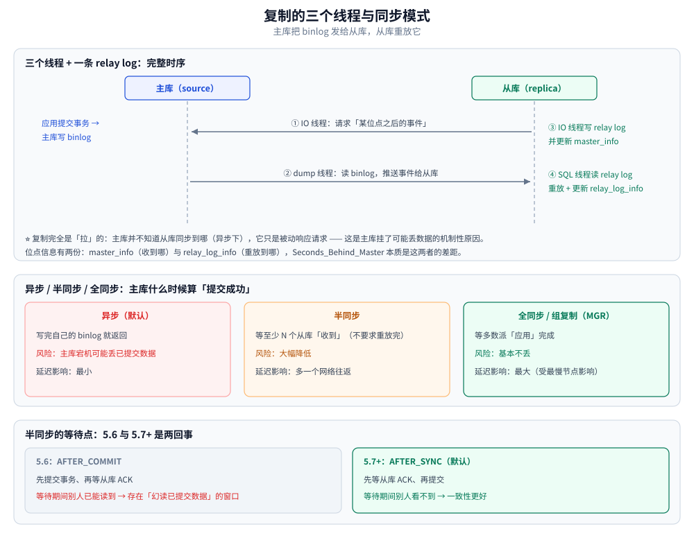

# 复制与高可用

> 内容整理自个人学习笔记，素材来源：《高性能 MySQL》（第 4 版）第 9 章「复制」的读后整理，**按主题归纳而非逐字摘录**，
> 参数与行为以 MySQL 5.7 / 8.0 为准（涉及版本差异的地方都标了版本）。
>
> 本篇讲复制的**机制全貌**：三个线程怎么协作、binlog 三种格式的取舍、拓扑怎么选、
> 半同步与 GTID、延迟的根因与并行复制、切换时到底会丢多少数据。
> 主从延迟在**应用层**怎么兜（读己之写）见 [日志与持久化.md](日志与持久化.md)；
> 用 binlog 做不停服迁移见 [数据迁移与备份恢复.md](数据迁移与备份恢复.md)；读写分离的架构位置见 [架构与执行链路.md](架构与执行链路.md)。
>
> ✅ 实测口径：第八节与 1.1 里的参数默认值、语句是否可用、报错原文与 `CLONE LOCAL` 的执行结果，
> 来自本机 Docker Desktop 起的 `mysql:8.0` 隔离实例（容器 `docs-verify-mysql`、端口 13306、库 `docverify`、
> **8.0.46**）；SQL 与原始输出逐组留档（`N_repl`、`N2_repl`、`N3_clone`、
> `N4_clone_vars`、`Z9_repl`、`Z10_delay_clone` 几组），可整批重跑。
> ⚠️ 仍未实测：**本机只有一个实例，没有真正的主从两台**。所以凡涉及"副本是否在追、延迟多少秒、
> 切换会丢多少数据"的数字都来自书与官方文档；半同步插件（`rpl_semi_sync_*`）与 `pt-table-checksum`
> 也未安装，相关参数默认值**未在本机验证**。下面的实测只覆盖"单实例侧能验的那一半"。

## 一、复制的三个线程与一条日志

MySQL 复制（官方术语已在 8.0.22 把 `master/slave` 改为 `source/replica`，本篇两套都标）的机制只有一句话：
**主库把 binlog 发给从库，从库重放它。**

拆开看是三个线程加一条中转日志：

| 角色 | 线程 | 干什么 |
| --- | --- | --- |
| 主库 | **dump 线程**（binlog dump thread） | 一个从库一个；从 binlog 里读事件发给从库 |
| 从库 | **IO 线程**（replica I/O thread） | 连主库、收事件、写进 relay log |
| 从库 | **SQL 线程**（replica SQL thread / applier） | 读 relay log、在从库上重放 |
| 从库 | — | **relay log**（中转日志，落盘在从库） |

**完整时序**：

```text
① 应用在主库提交事务
② 主库把变更写进 binlog（两阶段提交的 commit 阶段，见 [日志与持久化.md](日志与持久化.md)）
③ 从库 IO 线程 → 向主库 dump 线程请求「从某个位点之后的事件」
④ dump 线程读 binlog → 通过连接推给从库
⑤ 从库 IO 线程把收到的事件写进 relay log，并更新 master_info（记录已同步到哪个位点）
⑥ 从库 SQL 线程读 relay log → 在从库执行，并更新 relay_log_info
```

⭐ **两个关键结论**（后面几节的取舍都建立在这两条机制上）：

1. **复制完全是"拉"的**：主库并不知道从库同步到哪了（异步模式下），它只是被动响应请求 ——
   这是"主库挂了可能丢数据"的机制性原因；
2. **位点信息有两份**：`master_info`（同步到主库的哪个位置）与 `relay_log_info`（重放到哪个位置）。
   **`Seconds_Behind_Master` 本质就是这两个位置的差距**，而"收到"与"重放完"是两件事 —— 这决定了它的不可靠（见第五节）。

### 1.1 复制相关的线程数参数

| 参数 | 说明 |
| --- | --- |
| `slave_parallel_workers`（8.0 也可写 `replica_parallel_workers`） | SQL 线程的并行度；**0 表示单线程** |
| `slave_parallel_type` | `DATABASE`（5.6 库级）或 `LOGICAL_CLOCK`（5.7+ 组提交级） |
| `slave_preserve_commit_order` | 并行重放时是否保持提交顺序（**开启后 `Seconds_Behind_Master` 才有意义**） |

## 二、binlog 的三种格式

| 格式 | 记什么 | 优点 | 缺点 |
| --- | --- | --- | --- |
| **STATEMENT** | SQL 语句原文 | 日志小 | **非确定性语句会在从库产生不同结果** |
| **ROW**（5.7+ 默认） | 每行改前/改后的值 | 最安全、可精确重放 | 日志大（批量更新会爆炸） |
| **MIXED** | 让 MySQL 自己挑 | 折中 | 判断逻辑不透明，排障难 |

### 2.1 为什么 STATEMENT 不可靠

| 语句 | 问题 |
| --- | --- |
| `UPDATE ... LIMIT 10`（无 `ORDER BY`） | 主从选的 10 行可能不同 |
| `INSERT ... SELECT` | 读取顺序不确定 |
| `NOW()` / `CURRENT_TIMESTAMP` / `RAND()` / `UUID()` | 主从执行时刻不同 → 值不同 |
| 依赖 `@@session` 变量的语句 | 会话变量在主从可能不同 |
| 用 `MD5()` 之类函数做条件 | 依赖行的读取顺序 |

⚠️ **最重要的一条**：**在 `READ COMMITTED` 隔离级别下，`STATEMENT` 格式的 binlog 在复制上是不可靠的**
（间隙锁行为差异会导致主从加锁与更新结果不一致）。所以：

> **若用 RC 隔离级别（互联网业务常见），binlog 必须是 `ROW`**。
> 这是"把隔离级别降到 RC"时必须一并检查的配置，很多团队踩过这个坑。

### 2.2 ROW 格式下的两个实用参数

| 参数 | 作用 |
| --- | --- |
| `binlog_row_image = FULL`（默认） | 记录所有列的前后值 → **有完整的前后镜像，能审计、能回滚** |
| `binlog_row_image = MINIMAL` | 只记主键 + 被改的列 → 日志小很多，但**丢信息**（无法还原完整行） |
| `binlog_rows_query_log_events = ON` | ROW 格式下**额外记一条原始 SQL** —— 排障时能知道"是哪条语句改的" |

⭐ **`binlog_rows_query_log_events` 是 ROW 格式下最值得开的参数**：
ROW 格式只告诉你"第 100 行从 A 变成了 B"，开了它才能看到原始 SQL。否则排查"谁改的"只能靠猜。

### 2.3 binlog 的保留与清理

| 参数 | 含义 |
| --- | --- |
| `expire_logs_days`（8.0.2 前，已废弃） / **`binlog_expire_logs_seconds`**（8.0.2+） | 自动清理过期 binlog |
| `max_binlog_size` | 单个 binlog 文件上限（默认 1GB），**到达后轮转** |
| `sync_binlog` | 每次提交是否 `fsync` binlog（=1 最安全，=0 性能好但崩溃会丢） |

⚠️ **别把 `max_binlog_size` 当硬限制**：一个**大事务**即使超过这个值也不会被拆分（事务以 `COMMIT` 为边界），
所以"binlog 文件比 1GB 大"是正常的，也是大事务的另一个危害（见 [事务与隔离级别.md](事务与隔离级别.md)）。

## 三、复制拓扑：四种常见结构

| 拓扑 | 结构 | 适用 | 注意 |
| --- | --- | --- | --- |
| **一主多从** | 1 主 → N 从 | 读写分离、备份、报表 | 主库的 dump 线程数与带宽随从库数增长 |
| **级联复制**（一主 → 中继 → 多从） | 从库再当别人的主库 | 从库很多时减轻主库压力 | **中继从库一旦延迟，后面全延迟** |
| **双主 / 主主** | A ↔ B 互为主从 | 主库切换、双写分区 | 自增主键会冲突；需 `auto_increment_increment` + `offset` 错开 |
| **环形 / 多主** | 多节点首尾相连 | 几乎不用 | 冲突检测复杂、延迟叠加、故障恢复困难 |

**双主的自增冲突怎么解决**：

```sql
-- 节点 A
SET GLOBAL auto_increment_increment = 2;
SET GLOBAL auto_increment_offset    = 1;   -- A 生成 1, 3, 5, 7 ...
-- 节点 B
SET GLOBAL auto_increment_increment = 2;
SET GLOBAL auto_increment_offset    = 2;   -- B 生成 2, 4, 6, 8 ...
```

⚠️ **双主不是"双写"的默认方案**：两台都接受写会带来冲突（同一行两边都改，谁也覆盖不了谁）。
真实项目里双主多用于**主库快速切换**（B 平时只读，A 挂了才顶上），而不是两边同时承担写入。

**8.0 的多源复制**（一个从库接多个主库）：

```sql
CHANGE REPLICATION SOURCE TO
  SOURCE_HOST = '10.0.0.2', SOURCE_USER = 'repl',
  SOURCE_AUTO_POSITION = 1
  FOR CHANNEL 'channel_1';      -- 每个主库一个 channel
```

适用场景：**汇总多个业务库到一台分析库**。代价是这台从库成了"所有人的下游"，任一主库的大事务都会影响它。

## 四、异步 / 半同步 / 全同步

| 模式 | 主库什么时候算"提交成功" | 数据丢失风险 | 延迟影响 |
| --- | --- | --- | --- |
| **异步**（默认） | 写完自己的 binlog 就返回 | **主库宕机可能丢已提交数据** | 最小 |
| **半同步** | 等至少 N 个从库**收到**（不要求重放完） | 大幅降低 | 增加一个网络往返 |
| **全同步 / 组复制（MGR）** | 等多数派**应用**完成 | 基本不丢 | 最大（受最慢节点影响） |

### 4.1 半同步的两个实现（⚠️ 版本差异很关键）

| 版本 | 等待点 | 差异 |
| --- | --- | --- |
| 5.6 | **`AFTER_COMMIT`** | 主库先提交事务、再等从库 ACK。**等待期间其它会话已能读到这个事务** → 主库挂了可能出现"从库没收到，但别人已经读到过" |
| **5.7+** | **`AFTER_SYNC`**（默认） | 主库先等从库 ACK、**再提交**。等待期间其它会话看不到 → 一致性更好 |

⭐ **`AFTER_SYNC` 是 5.7 之后的默认行为**，说"半同步是等从库确认后提交"时必须加版本限定。
早期 5.6 的 `AFTER_COMMIT` 存在"幻读已提交数据"的窗口，这也是它被改掉的原因。

### 4.2 半同步的三个参数

| 参数 | 含义 |
| --- | --- |
| `rpl_semi_sync_master_enabled` / `rpl_semi_sync_slave_enabled` | 主/从两侧都要开（插件形式） |
| `rpl_semi_sync_master_wait_for_slave_count` | 至少等几个从库确认（默认 1） |
| **`rpl_semi_sync_master_timeout`** | 等超时（毫秒）后**自动降级为异步**，避免主库被卡死 |

⚠️ **超时降级是双刃剑**：它保证了可用性（主库不会因为从库挂了而写不进去），
但也意味着 **"半同步"在故障时可能悄悄变成异步** —— 如果应用假设"半同步 = 不丢数据"，就可能被误导。
监控上要盯 `Rpl_semi_sync_master_status`（1 = 还处于半同步）。

### 4.3 组复制（MGR）的定位

MySQL 8.0 的 **Group Replication** 是 Paxos 派生的多数派协议（原理与 [Raft协议.md](../../../../04-架构与系统/分布式/理论/Raft协议.md) 同源），
提供"多数派确认 + 自动选主"，是官方高可用方案（MGR + MySQL Router）的基础。

| 维度 | 半同步 | MGR |
| --- | --- | --- |
| 一致性 | 至少一个从库收到 | **多数派应用完成** |
| 自动选主 | ❌ 需要外部工具 | ✅ 内置 |
| 写节点数 | 1 主 | **单主模式**（默认）或多主模式 |
| 代价 | 一个网络往返 | 受最慢节点拖累；网络分区时可能不可写 |



## 五、GTID：把"位点"换成"事务编号"

### 5.1 为什么需要 GTID

传统复制（binlog + position）的痛点是**位点是一串"坐标"**：
`log_file = mysql-bin.000123, log_pos = 456789`。

**问题**：主库一旦切换，新主的 binlog 文件名与位点完全不同，所有从库都要手动重新找位点 —— 人肉算位点、写错一位就错位。

**GTID（Global Transaction Identifier）** 给**每个事务**全局唯一编号：

```text
3E11FA47-71CA-11E1-9E33-C80AA9429562:23
└────────── 源服务器 UUID ──────────┘ └─ 该服务器上第几个事务 ─┘
```

从库只需记住"**我已经执行过哪些 GTID**"，不需要知道位点。

### 5.2 GTID 的配置与使用

```sql
-- 主从都要开（且必须重启生效）
gtid_mode = ON
enforce_gtid_consistency = ON

-- 从库连主：不再指定位点，只声明"自动定位"
CHANGE MASTER TO
  MASTER_HOST = '10.0.0.2', MASTER_USER = 'repl',
  MASTER_AUTO_POSITION = 1;     -- 8.0.22+ 写作 SOURCE_AUTO_POSITION
```

| 维度 | binlog + position | GTID |
| --- | --- | --- |
| 定位方式 | 文件名 + 偏移量 | **事务编号集合** |
| 主库切换 | 所有从库要人工重算位点 | 改指向即可，**自动找差集** |
| 重复执行 | 可能重复应用同一事务 | `gtid_executed` 去重，天然幂等 |
| 排障 | 只知道"位点对不上" | **能精确说出"缺哪个事务"** |
| 限制 | 少 | 部分语句不允许（如事务内混用 `CREATE TEMPORARY TABLE` 与普通表更新） |

⭐ **GTID 的最大价值在故障切换**：新主提升后，其它从库只需要
`CHANGE MASTER TO ... MASTER_AUTO_POSITION = 1`，**它会自己算出"我缺哪些事务"并向新主补**。
这也是官方推荐新项目直接用 GTID 的原因。

⚠️ **`enforce_gtid_consistency = ON` 会拒绝某些语句**，最常见的两类：
**`CREATE TABLE ... SELECT`**（用 `CREATE TABLE` + `INSERT ... SELECT` 两步替代，或 `GTID_NEXT` 里单独处理）、
**事务内同时更新事务表与临时表**。上线前要在测试环境跑一遍所有 DDL/DML 才能发现。

## 六、复制延迟：根因与并行复制

### 6.1 延迟的六个来源

| 来源 | 说明 |
| --- | --- |
| **大事务** | 从库上一个事务要重放很久，期间后继事务全等 |
| **单线程重放**（SQL 线程） | 主库能并发写，从库只能串行重放 —— **这是根本矛盾** |
| **无主键/唯一键的表** | ROW 格式下要**全表扫描**定位行 → 每个事件都慢 |
| **DDL** | 从库执行 `ALTER TABLE` 期间阻塞后续重放（8.0 有 `ALGORITHM=INSTANT` 缓减） |
| **从库还承担读流量** | 重放抢不到资源 |
| **网络带宽 / 跨机房** | 大事务的 binlog 传输本身要时间 |

⚠️ **"无主键表"这条最容易被忽略**：ROW 格式的事件里，定位一行靠主键；
**没有主键时从库只能全表扫描**（`binlog_row_image=MINIMAL` 下更甚）。
所以"表必须有主键"不只是规范，还是复制性能的前提。

### 6.2 并行复制的三代演进

| 版本 | 并行粒度 | 局限 |
| --- | --- | --- |
| 5.6 | **库级**（`DATABASE`） | 单库多表的热点业务完全没有并行度 |
| **5.7** | **组提交级**（`LOGICAL_CLOCK`） | 按主库上"能同时提交"的事务分组 → 并行度高得多 |
| **8.0** | **WRITESET**（8.0.20+ 支持 `WRITESET_SESSION`） | 按"事务改动的行"判断冲突 → 不再依赖组提交，**主库低并发时也能并行** |

```sql
slave_parallel_workers = 8
slave_parallel_type    = LOGICAL_CLOCK
slave_preserve_commit_order = ON      -- 建议开：保证从库提交顺序与主库一致
```

⭐ **`slave_preserve_commit_order = ON` 的实际含义**：
开启后从库的提交顺序与主库一致（避免"从库上先看到后发生的事务"），
**并且 `Seconds_Behind_Master` 才有参考价值**（不保持顺序时它是混乱的）。代价是并行度略降。

### 6.3 延迟怎么监控（`Seconds_Behind_Master` 不可靠）

```sql
SHOW SLAVE STATUS\G
```

| 字段 | 含义 | 陷阱 |
| --- | --- | --- |
| `Slave_IO_Running` / `Slave_SQL_Running` | 两个线程是否活着 | **两个都是 `Yes` 才正常** |
| `Seconds_Behind_Master` | 延迟秒数 | ⚠️ **不可靠**：见下 |
| `Relay_Log_Space` | relay log 堆积量 | 持续增长 = SQL 线程跟不上 |
| `Retrieved_Gtid_Set` / `Executed_Gtid_Set` | 收到 / 执行过的 GTID | **两者差集就是"还没重放的事务"** |
| `Last_IO_Error` / `Last_SQL_Error` | 最后一次错误 | 排查断链必看 |

**`Seconds_Behind_Master` 为什么不可靠**：

| 情形 | 它显示什么 | 实际 |
| --- | --- | --- |
| IO 线程卡住（网络断） | **逐渐变小甚至 0** | 实际延迟在变大（它按"最后收到的那个事件的时间戳"算） |
| 大事务重放中 | **不变（停住）** | 实际在推进，只是没提交 |
| 从库空闲、主库也空闲 | 0 | ✅ 可信 |
| 并行重放未保序 | 跳变 | 无参考意义 |

**可靠做法**：用 **`pt-heartbeat`**（在心跳表里持续写时间戳，从库读它算真实延迟），
或用 GTID 差集（`Retrieved_Gtid_Set - Executed_Gtid_Set`）。

⚠️ **默认（未开 `slave_preserve_commit_order`）时不要用 `Seconds_Behind_Master` 做告警阈值** ——
它会在网络故障时给出"延迟为 0"的假象，这是最坑的一类监控。

### 6.4 延迟的治理手段

| 手段 | 说明 |
| --- | --- |
| **拆大事务** | 批量操作分批提交（同时降低主库锁时间） |
| **表必须有主键** | 让 ROW 事件能直接定位行 |
| **提高并行度** | `slave_parallel_workers` + `LOGICAL_CLOCK` / `WRITESET` |
| **从库减负** | 别把报表/备份压在同一台从库；必要时用级联或专用从库 |
| **应用容忍** | 读己之写、关键读走主库（见 [日志与持久化.md](日志与持久化.md)） |
| **IO 侧** | 从库用更好的磁盘（`innodb_flush_log_at_trx_commit` 可适当放宽） |

## 七、一致性与故障切换

### 7.1 主从不一致的四个来源

| 来源 | 说明 |
| --- | --- |
| **非确定性语句**（STATEMENT 格式） | 见第二节 |
| **直接写从库** | 有人从库上手工改数据（**必须开 `super_read_only`** 挡住） |
| **跳过复制错误** | `sql_slave_skip_counter` / `SET GLOBAL SQL_SLAVE_SKIP_COUNTER` |
| **主库无 binlog 的操作** | 早期版本关闭 binlog 时做的操作 |

⚠️ **`sql_slave_skip_counter` 是应急手段，不是修复手段**：它只是"跳过这个事件"，被跳过的行在主从两边永久不一致。
**生产环境应该禁止随手跳过**，改为定位根因（常见根因：唯一键冲突 1062 往往是主库重复写入导致）。

**从库只读的三层**：

```sql
SET GLOBAL read_only = ON;          -- 普通用户不能写（但 SUPER 权限可以）
SET GLOBAL super_read_only = ON;    -- 连 SUPER 也不能写（8.0 推荐）
-- 注意：这两个开关都挡不住 SQL 线程重放（那是它该做的）
```

### 7.2 校验主从是否一致

| 工具 | 作用 |
| --- | --- |
| **`pt-table-checksum`**（Percona Toolkit） | 在主库上分块算校验和，从库执行同样查询并比对，**输出不一致的表与行块** |
| `pt-table-sync` | 修复差异（`--print` 先看，`--execute` 再改） |
| `CHECKSUM TABLE` | 单表快速比对（会锁表 / 大表极慢，慎用） |

**思路**：`pt-table-checksum` 是**在主库上跑**的，它把计算出来的校验和同步到从库（借用复制链路），
所以**只能在复制正常时用**。

### 7.3 主库故障：切换流程与丢失窗口

标准流程（异步复制前提下）：

```text
① 确认主库真的挂了（避免脑裂：先切断旧主对外访问，或确认其已不可达）
② 选出延迟最小的从库（比较 Retrieved_Gtid_Set / Executed_Gtid_Set）
③ 把它提升为可写：SET GLOBAL read_only = OFF;  （并停掉它的复制线程）
④ 其它从库改指向新主：CHANGE MASTER TO ... MASTER_AUTO_POSITION = 1;
⑤ 应用侧切换连接（VIP / 中间件 / 客户端重连）
```

⭐ **异步复制下"必然丢一段数据"**：丢的量 = 主库崩溃时"已提交但还没来得及传给任何从库"的那些事务。
**半同步能把窗口缩到"未收到 ACK 的那些"**，MGR 则要求多数派，基本不丢。

**切换时最容易出事的不是数据，是脑裂**：旧主其实还活着（比如只是网络分区），
两边都接受写入 → 之后无法合并。**这就是为什么切换必须"先隔离旧主，再提升新主"。**

### 7.4 用 orchestror / MHA 还是自研

| 方案 | 说明 |
| --- | --- |
| **Orchestrator**（主流） | 拓扑感知、自动选主、支持 GTID、有 Web UI |
| MHA（较早） | 老牌方案，维护活跃度下降 |
| **MGR + MySQL Router**（官方） | 需要 MGR 集群，Router 负责路由与故障屏蔽 |
| 云托管（RDS / Aurora 等） | 切换由厂商负责，但要理解它的**复制模式**（很多云默认异步或半同步） |

⚠️ **用云数据库不等于自动高可用**：一定要问清"**故障切换时会不会丢数据**"（即复制模式），
以及"**切换需要多久**"（RTO）。这两点决定了应用层要不要额外做兜底。

## 八、8.0 的复制运维改了什么？

**来源**：《高性能 MySQL》（第 4 版）第 9 章「复制」中的「复制的实现」「复制进阶」相关小节，加上 8.0 的语句与工具变化。

**本节要点**：前七节的机制在 5.7 和 8.0 上是同一套，但**语句名、默认认证、崩溃自愈开关**
这三处是升级到 8.0 之后最容易"脚本突然失灵"的地方。

### 8.1 术语与语句换代：`SLAVE` → `REPLICA`

8.0.22 / 8.0.23 这一轮把主从术语统一成 source / replica，旧写法进入废弃期：

| 5.7 写法 | 8.0.23+ 写法 |
| --- | --- |
| `CHANGE MASTER TO` | `CHANGE REPLICATION SOURCE TO` |
| `START SLAVE` / `STOP SLAVE` | `START REPLICA` / `STOP REPLICA` |
| `SHOW SLAVE STATUS` | `SHOW REPLICA STATUS` |
| `MASTER_HOST` / `MASTER_DELAY` | `SOURCE_HOST` / `SOURCE_DELAY` |
| `slave_parallel_workers`（8.0 也可写 `replica_parallel_workers`） | SQL 线程的并行度；**0 表示单线程**。实测 8.0.46 默认 **4**，且两个名字查出来是同一个值（别名，不是两份配置） |

⚠️ **`SHOW REPLICA STATUS` 的输出字段名也一起改了**（`Slave_SQL_Running` → `Replica_SQL_Running`）。
自研的复制巡检脚本、监控采集器如果按字段名解析，升级当天就会读成空值 ——
这是本节唯一"必须提前改代码"的点。参数值的默认与动态性见 [参数调优.md](参数调优.md)。

实测证据（8.0.46）：

```text
CHANGE MASTER TO ...;      → Warning 1287 ×2：'CHANGE MASTER' 与 'MASTER_HOST' 都已废弃
START SLAVE / START REPLICA → 同一份配置，两者都能解析（本机报的是 1872 applier 元数据问题，不是语法问题）
SHOW REPLICA STATUS\G     → 字段名已是 Replica_/Source_ 家族：
     Replica_IO_Running / Replica_SQL_Running / Source_Host / Source_Port / Seconds_Behind_Source
     Source_Info_File: mysql.slave_master_info      ← 内部字典表【没改名】，列也还是 Master_log_name / Host
     SQL_Delay / SQL_Remaining_Delay                ← 这两列【没跟着改】，仍是旧名
SHOW SLAVE STATUS          → 仍能用（旧语句没删，只是废弃告警）
```

所以"改字段名"这件事要精确到列：**主链路字段（IO/SQL/Seconds_Behind_*）改了**，
**延迟相关和内部表名却没改**。照着一份新旧对照表全局替换 `Slave_` → `Replica_`，
反而会把 `SQL_Delay` 这类没改名的列替换错。

另外 `slave_parallel_workers` 与 `replica_parallel_workers` 是**别名**：实测两个名字查出来都是 4，
所以 `SET GLOBAL` 用哪边都行，但**读监控时最好固定一边**，避免同一参数在采集器里被当成两项。

### 8.2 默认认证插件会让副本连不上源库

8.0 的默认认证插件是 `caching_sha2_password`，它要求密码在握手时被加密传输。

实测默认值：`default_authentication_plugin = caching_sha2_password`，
`authentication_policy = *,,`（三个位置都用默认插件）。⚠️ "副本因此连不上源库"这个现象需要两个实例，
本机**未实测**，报错形态以官方文档为准。
副本用明文 TCP 连源库时会**认证失败**（报的是认证错误，不是网络错误，很容易排错跑偏）。
两条出路，二选一：

```sql
CHANGE REPLICATION SOURCE TO
  SOURCE_HOST = '10.0.0.1', SOURCE_USER = 'repl', SOURCE_PASSWORD = '...',
  SOURCE_SSL = 1;                    -- ① 走 TLS（推荐）
  -- GET_SOURCE_PUBLIC_KEY = 1;      -- ② 不部署 TLS 时：允许用 RSA 公钥加密密码后在明文连接上交换
```

反向兼容同样常见：5.7 的客户端 / 老驱动连 8.0 时，要么升级驱动，
要么把那个账号显式建成 `mysql_native_password`。

### 8.3 副本崩溃后的自愈开关：`relay_log_recovery`

默认 **OFF**，而且**不是动态参数**（改了要重启）。设为 ON 后，副本启动时

实测：`SELECT @@relay_log_recovery` → **0**；`SET @@relay_log_recovery = ON` →
`ERROR 1238 (HY000): Variable 'relay_log_recovery' is a read only variable`（连会话级都不允许）。
**丢弃本地 relay log 及其索引**，按已记录的位点重新向源库拉取 ——
专门治"崩溃后 relay log 损坏 / 位点错乱导致复制起不来"。

代价要说清楚：它依赖"源库还留着那段 binlog"。
源库的 binlog 已经过期清理（见 2.3）时，ON 也不会把数据找回来，反而会把"本地还剩一点日志"
这个救命的残留一起丢掉 —— 所以这个参数**要和 binlog 保留时长一起决策**，不能单独调。

### 8.4 延迟复制：给误操作留一个后悔窗口

```sql
STOP REPLICA;
CHANGE REPLICATION SOURCE TO SOURCE_DELAY = 3600;   -- 故意晚 1 小时重放
START REPLICA;
```

用法是一主多从中**留一个延迟从库**：误 `DROP` / 误 `UPDATE` 之后，
立刻停掉这个从库，从它上面把数据捞回来，其它从库照常服务。
它防的是**人为误操作**，不防网络延迟，也**不能替代备份**（备份见 [数据迁移与备份恢复.md](数据迁移与备份恢复.md)）。

实测（本机 `gtid_mode = OFF`，仍然可以设置）：

```text
CHANGE REPLICATION SOURCE TO SOURCE_DELAY = 3600;   → 无报错、无告警（GTID 关着也能设）
SHOW REPLICA STATUS\G                              → SQL_Delay: 3600   SQL_Remaining_Delay: NULL
CHANGE MASTER TO MASTER_DELAY = 3600;               → Warning 1287 ×2（语句名 + 选项名各一条）
```

两点值得记：`SOURCE_DELAY` **不受 GTID 约束**（和 `SOURCE_AUTO_POSITION` 不同，后者在 `gtid_mode=OFF`
时直接 `ERROR 1777`）；状态里这一列**仍叫 `SQL_Delay`**，没有跟着改成 `Source_Delay` —— 巡检脚本按新名取会拿不到值。
⚠️ 延迟是否真的生效需要真主从才能验，本机**未实测**。

### 8.5 用 Clone 插件秒级搭副本（8.0.17 起）

```sql
-- 在"接收方"执行：从 donor 拉一份物理快照（表结构、表空间、数据字典一起带走）
CLONE INSTANCE FROM 'clone_user'@'10.0.0.1:3306' IDENTIFIED BY '...';
```

它会**清空接收方已有的用户数据与 binlog**，并自动带上复制坐标，
比 `mysqldump` + 重放 binlog 快得多，适合"补一个从库 / 替换坏掉的从库"。
权限要求（`CLONE_ADMIN` 等）与备份口径见 [数据迁移与备份恢复.md](数据迁移与备份恢复.md) 的备份一节。

Clone 插件本身可以在**单实例**上验（`CLONE LOCAL DATA DIRECTORY` 就是它的本地用法）。实测：

```sql
-- ① 装上它（8.0.17 起随包分发，不必外部安装）
INSTALL PLUGIN clone SONAME 'mysql_clone.so';
SELECT PLUGIN_NAME, PLUGIN_STATUS, PLUGIN_VERSION FROM information_schema.PLUGINS WHERE PLUGIN_NAME = 'clone';

-- ② 本地快照：目标目录必须【事先不存在】
CLONE LOCAL DATA DIRECTORY '/tmp/clone_ok';
SELECT STATE, ERROR_NO, BEGIN_TIME, END_TIME FROM performance_schema.clone_status;
SELECT STAGE, STATE, ESTIMATE, DATA FROM performance_schema.clone_progress;

-- ③ 远端写法的两种括号位置
CLONE INSTANCE FROM 'u'@'127.0.0.1:3306' IDENTIFIED BY 'x';   -- 端口写在引号里
CLONE INSTANCE FROM 'u'@'127.0.0.1':3306 IDENTIFIED BY 'x';   -- 端口写在引号外
```

```text
clone   ACTIVE   1.0                      ← 安装成功
ERROR 1125 (HY000): Function 'clone' already exists          ← 重复安装

ERROR 1007 (HY000): Can't create database '/tmp/clone_ok'; database exists   ← 目录已存在时

STATE      ERROR_NO  BEGIN_TIME                 END_TIME
Completed          0  2026-10-04 03:26:16.856    2026-10-04 03:26:17.440
Completed          0  2026-10-04 03:26:48.429    2026-10-04 03:26:48.804

STAGE       STATE        ESTIMATE    DATA
DROP DATA   Completed             0       0
FILE COPY   Completed    81874910  81874910
PAGE COPY   Completed             0       0
REDO COPY   Completed          2560    2560
FILE SYNC   Completed             0       0
RESTART     Not Started        NULL    NULL
RECOVERY    Not Started        NULL    NULL

# ls -1 /tmp/clone_ok | wc -l   →  10 个条目，du -sh 82M
  （#clone  #innodb_redo  docverify  ib_buffer_pool  ibdata1  mysql  mysql.ibd  sys  undo_001  undo_002）

ERROR 1064 (42000): You have an error in your SQL syntax ...    ← 写法①（端口在引号内）
ERROR 3869 (HY000): Clone system configuration: 127.0.0.1:3306 is not found in clone_valid_donor_list  ← 写法②
ERROR 3862 (HY000): Clone Donor Error: 3634 : Too many concurrent clone operations. Maximum allowed - 1
```

五点实测结论：

- **本地克隆 0.4~0.6 秒**（两次分别 0.584 / 0.375 秒，datadir 205M 里的 81,874,910 字节有效数据）——
  "秒级搭副本"在小数据量上确实成立；⚠️ 这个时间**不能外推到生产数据量**，它量的是本机这份小夹具。
- `RESTART` / `RECOVERY` 两个阶段是 `Not Started`：本地克隆不需要重启实例做 crash recovery，
  而**跨实例克隆一定要走这两步**（那正是它比 mysqldump 快的地方：拿到的是物理快照 + redo，不用重放 SQL）。
- **目标目录必须不存在**，而且报错文案很误导 —— 它把目录当数据库名去创建，回 `ERROR 1007 Can't create database '/tmp/clone_ok'`。
  脚本里先 `rm -rf` 再克隆，或者带时间戳新建目录。
- **`CLONE INSTANCE FROM` 的端口写在引号里是语法错误**（`ERROR 1064`），写在引号外才解析得开；
  紧接着报 `3869`，说明 donor 白名单 `clone_valid_donor_list` 是**第一道门**（默认空，`SHOW VARIABLES` 实测为空）。
- 并发只允许 1 个克隆任务（`3862 Too many concurrent clone operations. Maximum allowed - 1`）——
  批量补从库时要串行，不能并发拉。

上面 8.1~8.5 的**语句层面**都在这台单实例上跑过（实测块见 8.5 末尾）；
**跨实例的行为层面**（副本真的在拉取/重放、延迟多少秒、切换丢多少事务）本机只有一个实例，**未实测**。

---

## 使用：搭一主一从并验证复制状态

用 GTID 起一主一从只需要「指个方向」加一次状态核对，不用再手算 binlog 位点。
下面这份是 8.0.23+ 的写法（5.7 的旧写法在注释里对照）。

```sql
-- 前置：主从都要 gtid_mode = ON 且 enforce_gtid_consistency = ON，按正文 5.2 的在线四步改

-- ① 从库指向主库：GTID 下不再写文件名 + 位点，只声明「自动找差集」
CHANGE REPLICATION SOURCE TO
  SOURCE_HOST = '10.0.0.2', SOURCE_USER = 'repl',
  SOURCE_AUTO_POSITION = 1;                 -- 5.7：CHANGE MASTER TO MASTER_AUTO_POSITION = 1
START REPLICA;                              -- 5.7：START SLAVE

-- ② 从库并行重放：不保序的话延迟指标本身就没有参考价值（正文 6.2）
SET GLOBAL replica_parallel_workers = 8;             -- 与 slave_parallel_workers 是同一个变量
SET GLOBAL replica_parallel_type = LOGICAL_CLOCK;
SET GLOBAL replica_preserve_commit_order = ON;

-- ③ 验证复制状态：两个线程都为 Yes 才算正常（正文 6.3 字段表）
SHOW REPLICA STATUS\G
-- Replica_IO_Running: Yes / Replica_SQL_Running: Yes  ← 任一为 No 就是断链，看 Last_IO_Error / Last_SQL_Error
-- Retrieved_Gtid_Set 减 Executed_Gtid_Set = 还没重放的事务（差集为空 = 已追平）
-- Relay_Log_Space 持续增长 = SQL 线程跟不上；⚠️ 别只盯 Seconds_Behind_Source，网络断了它也会显示 0

-- ④ 从库设只读防误写：read_only 挡普通用户，super_read_only 连 SUPER 也挡（正文 7.1）
SET GLOBAL super_read_only = ON;            -- 注意它挡不住复制线程重放，那是它该做的事
```

这四步的**语句形态**在单实例上逐条验过（`Z9_repl.sql`、`Z11_dyn.sql`），结论分两类：

```text
CHANGE REPLICATION SOURCE TO SOURCE_AUTO_POSITION = 1;
  ERROR 1777 (HY000): ... cannot be executed because @@GLOBAL.GTID_MODE = OFF
                                            ← 前置条件没做时，报错直接点名缺哪个变量
SET GLOBAL replica_parallel_workers = 8;    → 通过；随后 @@slave_parallel_workers 也变成 8（别名，实测同一份）
SET GLOBAL super_read_only = ON;            → 通过，@@read_only 同时变 1
INSERT INTO users(city) VALUES ('BJ');     → ERROR 1290 The MySQL server is running with the
                                            --super-read-only option so it cannot execute this statement
START REPLICA;                              → 语法被接受，本机报 ERROR 1872（单实例没有副本元数据仓库）
```

两点口径要说清楚：`SOURCE_AUTO_POSITION` 与 `SOURCE_DELAY` 的 GTID 依赖**不一样**（前者要 `gtid_mode=ON`，
后者不要，见 8.4），排错时别把两个报错混成一类；`super_read_only` 拦的是**普通连接与 SUPER 连接的写入**，
复制线程不受它影响 —— 这也是从库既能追数据又不会被误写的机制。

⚠️ 一主一从**两台实例**的完整流程（建复制账号、拉取、追平、切读流量）本机只有一台实例，**未实测**；
这段代码的正确性口径到"语句能被解析、前置条件会明确报错"为止。

## 九、延伸追问

- **升级到 8.0，复制相关的脚本要改哪里？** → 三处：语句名（`CHANGE MASTER TO` → `CHANGE REPLICATION SOURCE TO`、`START SLAVE` → `START REPLICA`）、`SHOW REPLICA STATUS` 的字段名（`Slave_*` → `Replica_*`）、以及副本连接源库时的认证插件（默认 `caching_sha2_password` 要求 TLS 或 `GET_SOURCE_PUBLIC_KEY=1`）。
- **`relay_log_recovery` 要不要开 ON？** → 它治的是 relay log 崩溃后损坏，但代价是丢弃本地日志重拉，前提是源库那段 binlog 还在。必须和 binlog 保留时长一起定，而且是**非动态**参数。
- **怎么快速搭一个从库？** → 8.0.17 起用 Clone 插件（物理快照 + 自动带复制坐标）；低版本或需要逻辑一致时用 `mysqldump --master-data` 一类方式，见 [数据迁移与备份恢复.md](数据迁移与备份恢复.md)。
- **MySQL 复制是怎么工作的？** → 主库 **dump 线程**推 binlog → 从库 **IO 线程**写 **relay log** → 从库 **SQL 线程**重放。**记住"拉不是推"**：异步模式下主库不知道从库进度。
- **binlog 三种格式怎么选？** → 默认 `ROW`（最安全、可精确重放）；`STATEMENT` 省空间但**非确定性语句会主从不一致**；`MIXED` 是折中。**关键结论：用 RC 隔离级别时必须是 ROW**。ROW 格式下建议开 `binlog_rows_query_log_events` 以便排障。
- **为什么 RC 要用 ROW 格式？** → RC 下的间隙锁行为与 RR 不同，`STATEMENT` 格式重放时加锁范围不一致 → 主从结果可能不同。所以"降隔离级别"必须与"binlog 用 ROW"配套检查。
- **半同步是什么？和异步、全同步的区别？** → 异步：写完自己 binlog 就返回（可能丢）；半同步：等至少 N 个从库**收到**（不要求重放完）；全同步（MGR）：等多数派**应用**完成。**5.6 是 `AFTER_COMMIT`、5.7+ 是 `AFTER_SYNC`** —— 后者等待期间其它会话读不到，一致性更好。
- **半同步会降级吗？** → 会。`rpl_semi_sync_master_timeout` 超时后**自动降级为异步**，保证主库不被卡死。所以"半同步"在故障时会悄悄变成异步 —— 监控要盯 `Rpl_semi_sync_master_status`。
- **GTID 解决了什么问题？** → 把"位点"（文件名 + 偏移量）换成**全局唯一的事务编号**。收益：主库切换后从库只需 `MASTER_AUTO_POSITION=1` 自动找差集；重复事务天然幂等；排障能精确说出"缺哪个事务"。代价：部分语句被 `enforce_gtid_consistency` 拒绝。
- **复制延迟是怎么产生的？** → 根因是"**主库能并发写、从库单线程重放**"。加剧因素：大事务、**无主键表**（ROW 事件要全表扫描定位）、DDL、从库还承担读流量、跨机房带宽。
- **并行复制有哪几代？** → 5.6 **库级**、5.7 **组提交级**（`LOGICAL_CLOCK`）、8.0 **WRITESET**（按改动行判断冲突）。建议加 `slave_preserve_commit_order=ON` 保证提交顺序。
- **`Seconds_Behind_Master` 准吗？** → **不可靠**。IO 线程卡住时它会变小甚至归零（按最后收到事件的时间戳算），大事务重放时会停住不动。可靠做法是 **`pt-heartbeat`** 或 GTID 差集（`Retrieved_Gtid_Set` 减 `Executed_Gtid_Set`）。
- **主从数据不一致怎么排查？** → `pt-table-checksum` 分块算校验和比对（**只能在复制正常时用**），`pt-table-sync` 修复。**要禁止随手 `sql_slave_skip_counter`** —— 那只是跳过，差异会永久留下。
- **主库挂了会丢数据吗？** → 异步复制下**必然丢一段**（已提交但没传出去的事务）；半同步把窗口缩到"未收到 ACK"；MGR 基本不丢。所以"用不用半同步"本质是选"**丢数据的窗口大小**"。
- **主从切换最怕什么？** → **脑裂**：旧主其实还活着却已经被隔离，两边都在写。所以流程必须是"**先隔离旧主，再提升新主**"。工具上主流是 Orchestrator，官方方案是 MGR + Router。
- **双主（主主）能双写吗？** → 不建议。双写的同一行冲突无法自动合并；双主真正的用途是**快速切换**。要用就得配 `auto_increment_increment` + `auto_increment_offset` 错开自增。
- **从库怎么防误写？** → `read_only = ON` 挡普通用户，**`super_read_only = ON` 连 SUPER 也挡**（8.0 推荐）。注意它们不会阻止复制线程重放。

## 关联

- [日志与持久化.md](日志与持久化.md) — binlog 的写入与两阶段提交、主从延迟在应用层怎么兜（读己之写）
- [数据迁移与备份恢复.md](数据迁移与备份恢复.md) — 用 binlog + position / GTID 做不停服迁移与切换
- [架构与执行链路.md](架构与执行链路.md) — 读写分离在架构里的位置、主库与从库的职责划分
- [参数调优.md](参数调优.md) — 复制相关参数的默认值、动态性与副作用
- [观测与诊断.md](观测与诊断.md) — 复制中断、延迟告警怎么落到指标与 SLO 上
- [事务与隔离级别.md](事务与隔离级别.md) — 大事务为什么同时伤害主库（锁）与从库（延迟）
- [索引设计与EXPLAIN.md](索引设计与EXPLAIN.md) — 无主键 / 无索引的表为什么让 ROW 事件重放变慢
- [分表与路由.md](分表与路由.md) — 复制之上的下一步：分片
- [Raft协议.md](../../../../04-架构与系统/分布式/理论/Raft协议.md) — MGR 的多数派协议与 Raft 同源，可对照理解
- [一致性与CAP.md](../../../../04-架构与系统/分布式/理论/一致性与CAP.md) — 复制模式本质是在一致性、可用性、延迟之间取舍
- [目录.md](../../../../目录.md) — 全仓知识点索引

> 反向引用（本篇被下列文档引到）：[存储选型.md](../../存储选型.md)、[集群与运维.md](../../搜索与分析/Elasticsearch/集群与运维.md)、[缓存一致性.md](../../缓存/缓存一致性.md)
