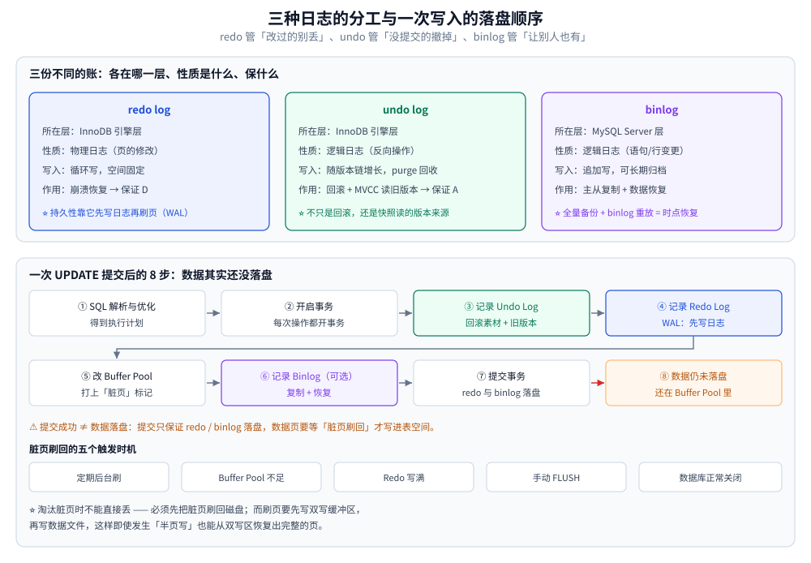
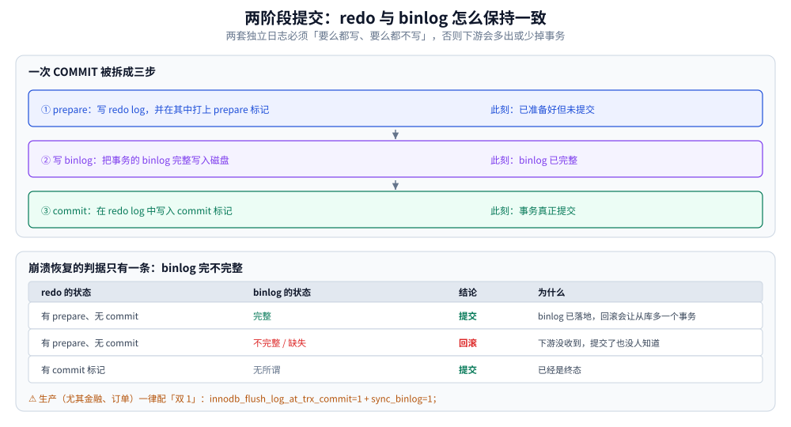

# 日志与持久化

> redo / undo / binlog 三种日志各自的分工、一次写入的 8 步落盘流程与两阶段提交、
> binlog 的三种格式、崩溃恢复到底恢复什么、主从延迟与读己之写，
> 以及 `fsync` 与 `O_DIRECT` 所在的文件系统 IO 层。
>
> 内容整理自个人学习笔记，参考资料与原始素材见 [素材清单](../../../../素材清单.md)。
>
> ⚠️ **本篇的边界**：binlog 的**下游**（复制线程、拓扑、半同步、GTID、并行复制）见
> [复制与高可用.md](复制与高可用.md)；redo 容量与刷盘**参数取值**见 [参数调优.md](参数调优.md)；
> 事务的语义与代价见 [事务与隔离级别.md](事务与隔离级别.md)。

---

## 一、三种日志的分工

**本节要点**：redo / undo / binlog 是**三份不同的账**，分别保 D、A、复制与恢复 ——
说不清"谁在哪一层、保什么"，两阶段提交就无从谈起。

---

先记住三者的定位，后面每一节都建立在这张表上：

| | **redo log** | **undo log** | **binlog** |
|---|---|---|---|
| **所在层** | InnoDB **引擎层** | InnoDB **引擎层** | MySQL **Server 层** |
| **日志性质** | **物理日志**（页的修改） | **逻辑日志**（反向操作） | **逻辑日志**（语句 / 行变更） |
| **写入方式** | **循环写**，空间固定 | 随版本链增长，由 purge 线程回收 | **追加写**，可长期归档 |
| **主要作用** | 崩溃恢复 → **保证 D 持久性** | 回滚 + MVCC 读旧版本 → **保证 A 原子性** | 主从复制 + 数据恢复 |
| **能不能关** | InnoDB 必需 | InnoDB 必需 | 可选（但主从架构必需） |

⭐ 一句话记住分工：**redo 管"改过的别丢"，undo 管"没提交的撤掉"，binlog 管"让别人也有"。**

### 1.1 undo log 不能只答「回滚」

1. **支持事务回滚**——回滚需要一个"原来的样子"；
2. **配合 MVCC 构造可见的数据版本**——当前版本已提交但对本事务不可见时，
   需要**沿着 Undo Log 往上回滚，找到那个"对本事务可见"的版本**。

### 1.2 redo / undo / binlog 的分工

| | **Redo Log** | **Binlog** |
|---|---|---|
| **所属层次** | InnoDB **存储引擎层** | MySQL **Server 层** |
| **日志类型** | **物理日志**（记录页的修改） | **逻辑日志**（记录语句/行的变更） |
| **主要作用** | **崩溃恢复**，保证**持久性**（WAL） | **主从复制** + **数据恢复** |
| **写入方式** | **循环写**，空间固定 | **追加写**，可长期归档 |
| **是否必需** | InnoDB 必需 | 可选（但主从架构必需） |

**Binlog 的两个用途（要分开讲）**：

1. **主从复制**：**增量**记录每次变更，从库读取并**重放**，实现主从同步与高可用
   （主节点故障时，从节点提升为新主）；
2. **数据恢复**：**全量备份 + Binlog 重放**。
   例如一小时前发生故障，可以找到一小时前的全量备份，
   再把**从一小时前到崩溃点之间的所有 Binlog 重放**，恢复出完整数据。

### 1.3 没有这两个日志会怎样

| 缺失 | 后果 |
|---|---|
| **没有 Redo Log** | 事务**提交成功但刷盘失败**——因为修改只在 Buffer Pool 里，**持久性无法保证**，一旦崩溃数据就丢了 |
| **没有 Binlog** | **主从复制无法做增量同步**，主从同步会变得非常困难（只能靠双写等更重的方式） |



## 二、一次写入的完整落盘流程

**本节要点**：一条 `UPDATE` 提交后，数据**其实还没落盘** ——
它先在 redo 里、在 Buffer Pool 里，落盘是后面"脏页刷回"的事。

### 2.1 写入流程（8 步）

| 步骤 | 说明 |
|---|---|
| **① SQL 解析与优化** | 得到执行计划，选择最优访问路径 |
| **② 开启事务** | **InnoDB 每次操作都会开启事务**——即使是单条查询，也会启动一个**只读事务** |
| **③ 记录 Undo Log** | 见下方"Undo Log 的双重作用" |
| **④ 记录 Redo Log** | 预写式日志（WAL），在修改数据**之前**先写日志 |
| **⑤ 修改 Buffer Pool** | 数据页若不在 Buffer Pool 中，**先从磁盘加载**；修改后内存数据与磁盘**不一致** → 打上**"脏页"标记** |
| **⑥ 记录 Binlog**（可选） | 用于**主从复制**和**数据恢复** |
| **⑦ 提交事务** | 确保 **Redo Log 与 Binlog 已持久化到磁盘** |
| **⑧ 数据仍未落盘** | 提交后数据**依然在 Buffer Pool 中**，没有立即写入磁盘文件 |

### 2.2 脏页刷回的五个触发时机

数据不会自己落盘，需要**触发**：

| 触发条件 | 说明 |
|---|---|
| **定期触发** | 后台线程**定时**把脏页写回磁盘 |
| **Buffer Pool 空间不足** | 需要淘汰页；**如果淘汰的是脏页，不能直接丢，必须先刷回磁盘** |
| **Redo Log 写满** | Redo Log 空间有限（循环写），满了就**强制刷回** |
| **手动触发** | 如 `FLUSH` 命令 |
| **数据库正常关闭** | 关闭时把数据写回磁盘 |

### 2.3 双写缓冲区：刷脏页为什么不会写出半个页

> 刷脏页时，**先把数据写入双写缓冲区，再写入真正的数据文件**。

**为什么需要**：写数据文件时**可能发生故障**，导致数据**只写了一部分**（部分写 / 半页写），
这个页就彻底损坏了。有了双写缓冲区，**故障后可以从双写缓冲区恢复出完整的页**，再写回数据文件。

## 三、两阶段提交：redo 与 binlog 怎么保持一致

**本节要点**：redo 与 binlog 是**两套独立日志**，必须"要么都写、要么都不写" ——
否则下游会多出（或少掉）事务。这就是两阶段提交存在的全部理由。

一次 `COMMIT` 被拆成 prepare 与 commit 两步：

| 阶段 | 做什么 | 此刻状态 |
|---|---|---|
| **① prepare** | 写 redo log，并在其中打上 **prepare 标记** | 事务**已准备好但未提交** |
| **② 写 binlog** | 把事务的 binlog **完整**写入磁盘（`sync_binlog=1` 时 fsync） | binlog 已完整 |
| **③ commit** | 在 redo log 中写入 **commit 标记** | 事务真正提交 |

**崩溃恢复时怎么判断该提交还是回滚**（判据只有一条：**binlog 完不完整**）：

| redo 的状态 | binlog 的状态 | 结论 | 为什么 |
|---|---|---|---|
| 有 prepare、无 commit | **完整** | **提交** | binlog 已经写下去，下游会重放它；此时若回滚，从库就会多出一个主库没有的事务 |
| 有 prepare、无 commit | **不完整 / 缺失** | **回滚** | 下游没收到，提交了也没人知道 |
| 有 commit 标记 | 无所谓 | 提交 | 已经是终态 |

⚠️ 这也解释了 `sync_binlog=0` 的真正风险：binlog 可能**只写了一半**就掉电。
所以生产（尤其金融、订单）一律配**双 1** —— `innodb_flush_log_at_trx_commit=1` + `sync_binlog=1`。



## 四、binlog 的三种格式

**本节要点**：`STATEMENT` 省空间但可能不确定、`ROW` 精确但体积大、`MIXED` 自动切换。

完整口径（含非确定性语句清单、RC 必须用 ROW、`binlog_rows_query_log_events`）
见 [复制与高可用.md](复制与高可用.md) 的对应小节，此处只给速查表：

| 格式 | 记什么 | 优点 | 缺点 |
|---|---|---|---|
| **STATEMENT** | SQL 语句原文 | 体积最小 | ⚠️ `now()` / `uuid()` / `LIMIT` 无 `ORDER BY` 等**不确定语句**会导致主从不一致 |
| **ROW** | 每一行的前后镜像 | 精确、可审计、行级恢复 | 体积大（批量 `UPDATE` 尤其） |
| **MIXED** | 默认用 STATEMENT，遇到不确定语句自动切 ROW | 折中 | 仍然依赖"哪些算不确定"的判断 |

⭐ 两条实践结论：**① RC 隔离级别下必须用 ROW**；**② 对一致性要求高的场景直接用 ROW**，别省那点空间。

## 五、崩溃恢复：重启后 MySQL 做了什么

**本节要点**：崩溃恢复只有两件事 —— **redo 前滚**（救回已提交但没落盘的）+ **undo 回滚**（撤掉未提交的）。

**恢复流程**（实例重启时自动执行，不用人工干预）：

| 阶段 | 做什么 |
|---|---|
| **① 读 redo，前滚** | 把 redo 里**已提交**的修改重放到数据页上 —— 这些改动原来只在 Buffer Pool 里，不重放就丢了 |
| **② 读 undo，回滚** | 把崩溃时**未提交**的事务按 undo 反向撤销 |
| **③ 双写缓冲区兜底** | 前滚时遇到"半页写"损坏的页，从双写缓冲区取完整副本恢复（见本文 2.3） |

⚠️ **两组最容易搞混的东西**：

| | redo log | undo log |
|---|---|---|
| 恢复方向 | **前滚**（重做已提交） | **回滚**（撤销未提交） |
| 保的是 | 持久性 **D** | 原子性 **A** + MVCC 读旧版本 |
| 能不能丢 | 双 1 时**不能丢** | 可被 purge 线程回收 |

**两个决定"崩溃时丢多少"的参数**：

```sql
SHOW VARIABLES LIKE 'innodb_flush_log_at_trx_commit';  -- 1=每次提交都 fsync（唯一不丢事务的取值）
SHOW VARIABLES LIKE 'sync_binlog';                     -- 1=每次提交都刷 binlog
```

| 参数组合 | 崩溃时最多丢 | 适用 |
|---|---|---|
| **双 1** | 不丢事务 | 金融、订单 |
| `1` + `0` | ⚠️ **binlog 可能丢** → 主从链与恢复链同时断 | 不建议 |
| `2` + `1000` | 最多丢 1 秒 / 1000 个事务 | 日志、埋点类 |

> 取舍口径与容量规划见 [参数调优.md](参数调优.md) 的"持久化档位是一对"。

## 六、主从延迟与读己之写

**本节要点**：延迟的根因是"**主库写完不等从库确认**"，只能缩小不能消除；
业务侧的处理见 `## 使用一`。

**根本原因（先答这个）**：

> 主从是通过 **Binlog 异步同步**的——**主库写完不等待从库确认**。
> 只要不是"双写"（同步等待写入），**主库产生 Binlog 和从库应用 Binlog 之间就必然存在时间差**。

**加剧延迟的三类因素**：

| 因素 | 说明 |
|---|---|
| **网络因素** | 带宽不够、网络不稳定 |
| **主库负载过高 / 复制配置不合理** | **从库同步默认只有一个线程**。主库写入量大 → 产生大量 Binlog → **一个线程同步不过来**。<br>解法：**增加同步线程数**（并行复制） |
| **架构设计** | **多层主从复制**（主 → 从 → 再从），每多一层就**叠加一次延迟**，必然存在 |

## 七、文件系统与 IO 层：redo 到底怎么落盘

**本节要点**：所谓"刷盘"，实际穿过了**用户态缓冲 → OS page cache → 磁盘介质**三层 ——
理解这三层才知道 `fsync` 与 `O_DIRECT` 到底在省什么。

一次 redo 的写盘路径：

```text
redo log buffer（用户态内存）
  → write()  把数据拷进 OS page cache
  → fsync()  让 OS 把该文件的脏页真正写到介质
```

| 动作 | 含义 | 不做的后果 |
|---|---|---|
| `write()` | 从应用缓冲拷进 **OS page cache** | — |
| `fsync()` | 把 page cache 里该文件的脏页**真正刷到介质** | ⚠️ 掉电就丢 —— 事务"提交了却没了" |

⭐ **`innodb_flush_log_at_trx_commit` 的三个取值，本质就是"提交流程里要不要 fsync"**：

| 取值 | 提交时做什么 | 掉电丢什么 |
|---|---|---|
| **`1`（默认）** | **每次提交都 fsync** | 不丢事务 |
| `2` | 只 `write()` 到 page cache，每秒 fsync 一次 | OS 崩溃会丢；MySQL 进程崩溃不丢 |
| `0` | 每秒 write + fsync，提交时什么都不做 | 丢最近约 1 秒 |

**`O_DIRECT`：绕开 page cache，避免"双缓冲"**

| 模式 | 数据页怎么落盘 | 代价 |
|---|---|---|
| 缓冲 IO（`innodb_flush_method=fsync`） | 先写 OS page cache，由 OS 决定何时落盘 | 同一份数据在 **Buffer Pool 与 page cache 里各存一份**（双缓冲），内存浪费且刷盘时机不可控 |
| **`O_DIRECT`** | **绕过 page cache 直接写盘** | 要求地址/长度**对齐**，且失去 page cache 的预读收益 |

⭐ InnoDB 自己已经有 Buffer Pool 做缓存，再让 OS 缓存一遍既浪费内存、又让刷盘时机不可控 ——
所以 Linux 上通常配 `innodb_flush_method=O_DIRECT`。

> 本篇只讲**为什么**；具体参数取值与容量规划见 [参数调优.md](参数调优.md) 的"I/O 账"一节。

---

## 使用一：Go（读己之写：主从延迟在应用层的三种处理）⭐

### 1. 读己之写：主从延迟在应用层的三种处理

第一节第五节说「主库写完不等从库确认，所以必然有时间差」。
这个差值打到业务上就是经典事故：**下单成功 → 立刻跳订单列表 → 空的**。
三种处理按成本从低到高：

| 方案 | 做法 | 代价 |
|---|---|---|
| **① 强制走主库** | 写后的那条读路由到主库（[架构与执行链路.md](架构与执行链路.md) 的 `ForceMaster`） | 主库读压力上升；最简单，**默认选它** |
| **② 等位点再读** | 提交后拿 GTID，让从库 `WAIT_FOR_EXECUTED_GTID_SET` 追上再查 | 多一次往返 + 等待，超时必须有兜底 |
| **③ 写缓存回填** | 写成功后把结果写进 Redis（或直接返回计算结果），短 TTL 内读缓存 | 只适合"自己的数据"，共享数据会不一致 |

```go
package txdemo

import (
	"context"
	"database/sql"
	"errors"
	"time"
)

var ErrReplicaLag = errors.New("txdemo: replica did not catch up in time")

// ExecutedGtidSet 取主库当前已提交的 GTID 集合。
// ⚠️ 必须在**提交之后**调用，取到的集合才包含本次写入（可能顺带包含别人的事务——
// 方向是"多等一会儿"，是安全的；反过来"少等"就会读到旧数据）。
func ExecutedGtidSet(ctx context.Context, master *sql.DB) (string, error) {
	var set string
	if err := master.QueryRowContext(ctx, `SELECT @@GLOBAL.gtid_executed`).Scan(&set); err != nil {
		return "", err
	}
	return set, nil
}

// waitApplied 让从库等到指定位点。WAIT_FOR_EXECUTED_GTID_SET 在副本上会等待
// 复制应用线程把该 GTID 事务执行完，返回 0 表示追上、1 表示超时、非 0 出错。
func waitApplied(ctx context.Context, replica *sql.DB, set string, timeout time.Duration) error {
	var rc int
	err := replica.QueryRowContext(ctx,
		`SELECT WAIT_FOR_EXECUTED_GTID_SET(?, ?)`, set, int(timeout.Seconds())).Scan(&rc)
	if err != nil {
		return err
	}
	if rc != 0 {
		return ErrReplicaLag
	}
	return nil
}

// WriteThenRead 是"② 等位点"的完整骨架：主库写 → 取位点 → 等从库 → 从从库读。
// 追不上时降级读主库：宁可给主库加一次读，也不能给用户返回旧数据。
func WriteThenRead(ctx context.Context, master, replica *sql.DB,
	write func(*sql.Tx) error, readSQL string, args ...any) (string, int64, error) {

	if err := RunInTx(ctx, master, nil, write); err != nil {
		return "", 0, err
	}

	set, err := ExecutedGtidSet(ctx, master)
	if err != nil {
		return "", 0, err
	}

	ctx, cancel := context.WithTimeout(ctx, 3*time.Second)
	defer cancel()

	db := replica
	if err := waitApplied(ctx, replica, set, 2*time.Second); err != nil {
		if !errors.Is(err, ErrReplicaLag) && !errors.Is(err, context.DeadlineExceeded) {
			return "", 0, err // 语法/权限类错误不该被降级掩盖
		}
		db = master // ← 兜底路径，生产要在这里打点告警：延迟已经打到用户脸上了
	}

	var (
		name string
		id   int64
	)
	if err := db.QueryRowContext(ctx, readSQL, args...).Scan(&id, &name); err != nil {
		return "", 0, err
	}
	return name, id, nil
}
```

> ⚠️ 方案 ② 有两个前提：**必须是 GTID 模式**（切换步骤见 [数据迁移与备份恢复.md](数据迁移与备份恢复.md) 的第二节），
> 且这条 `SELECT` 本身会占用从库一个连接去等待——延迟大时会把等待请求堆成雪崩，
> 所以超时时间要给得**短**（秒级），并把"降级读主库 + 告警"当成必选项。

---

## 使用二：日志与主从延迟的实操命令

### 1. 看延迟到底多少秒

```bash
# MySQL 8.0.22+ 用 REPLICA 子命令（SHOW SLAVE STATUS 已废弃但仍可用）
docker exec -i mysql8 mysql -uroot -p --execute "SHOW REPLICA STATUS\G" | egrep 'Seconds_Behind|Retrieved_Gtid|Executed_Gtid|Replica_IO|Replica_SQL|Last_*Error'
```

| 字段 | 怎么读 |
|---|---|
| `Seconds_Behind_Source` | ⚠️ 它是"**IO 线程视角**"的延迟，SQL 线程卡住时可能显示 0；不能当唯一依据 |
| `Executed_Gtid_Set` | 与主库 `@@GLOBAL.gtid_executed` 对比，才是**真实**的落后集合 |
| `Replica_SQL_Running_State` | 出现 `Waiting for ... ` 类状态说明在等人/等锁，不一定是网络 |
| `Last_*_Error` | 一旦有错，复制可能已经中断（`Seconds_Behind` 会一直涨） |

更可信的做法是**心跳表**（`pt-heartbeat`）：主库每秒写一行时间戳，从库读本地表里最新值与当前时间做差，
量的是"这条数据真的同步过来了"的端到端延迟。

### 2. 并行复制：正文「增加同步线程数」的具体参数

```sql
-- 8.0 默认 already_exists；LOGICAL_CLOCK 让"同一时刻提交的"事务并行重放
SHOW VARIABLES LIKE 'replica_parallel%';   -- 旧名 slave_parallel_workers / -type
-- 常用组合：worker=8 + replica_preserve_commit_order=ON（保证从库提交顺序与主库一致）
-- binlog_transaction_dependency_tracking=WRITESET 可进一步放大并行度（需开启 writeset）
```

### 3. binlog 的两个用途怎么实操（对应第一节第三节）

```bash
# 库表结构 / 语句级查看：--start-position 与 --stop-position 对应"恢复到某个崩溃点"
docker exec -i mysql8 mysqlbinlog --base64-output=DECODE-ROWS -vv \
  /var/lib/mysql/binlog.000123 --start-datetime="2026-09-24 03:00:00" | less

# 误删数据后按位点回滚式恢复：反向生成补偿 SQL（社区工具 binlog2sql / my2sql）
# 全量备份 + 增量重放 = 正文说的"数据恢复"完整链路
docker exec -i mysql8 mysql -uroot -p -e "SOURCE /backup/full_2026-09-23.sql"
docker exec -i mysql8 sh -c "mysqlbinlog --stop-datetime='2026-09-24 03:12:00' /var/lib/mysql/binlog.000123 | mysql -uroot -p"
```

```sql
-- 崩溃恢复（Redo Log）不用手动干预，但有两个参数必须知道：
SHOW VARIABLES LIKE 'innodb_flush_log_at_trx_commit';  -- 1=每次提交都 fsync(唯一不丢事务的取值)
SHOW VARIABLES LIKE 'sync_binlog';                     -- 1=每次提交都刷 binlog
-- 两者都为 1 = "双 1 配置"，正文第一节的"两阶段提交"才是真的持久化；
-- 设为 2 / 1000 换来的是数倍写入吞吐，代价是崩溃时最多丢 N 个事务。
```

> ⚠️ 上面这条是**性能与不丢数据的取舍**，不是"配错就要改回来"：金融/订单类必须双 1，
> 日志/埋点类库可以放开。改之前先确认业务能不能丢那几秒。

## 延伸追问

- **两阶段提交期间崩溃会怎样恢复？** → 靠 redo（prepare 标记）与 binlog 的**完整性判据**：binlog 完整就提交、不完整就回滚。这就是「两阶段」存在的全部理由。
- **binlog 三种格式怎么选？** → statement 省空间但可能不确定（`now()`、`limit` 无 order by）、row 精确但体积大、mixed 自动切换；对主从一致性要求高的场景用 **row**。
- **主从延迟能彻底消除吗？** → 不能，只能缩小：并行复制、避免大事务、以及读写分离时把「写后立即读」强制路由到主库。
- **读己之写有哪几种解法？** → 强制走主库、等待位点（`MASTER_POS_WAIT`）、会话粘性、业务上规避（把刚写的值直接回传）。按对延迟的敏感度选，见本文「使用一」。
- **redo log 能保证持久化，binlog 为什么不能？** → redo 是**物理页**级重做日志、循环写，`innodb_flush_log_at_trx_commit=1` 时提交即刷盘；binlog 是逻辑日志、由 `sync_binlog` 独立控制。
- **`sync_binlog=0` 有什么风险？** → 主机掉电可能丢 binlog，主从链与恢复链同时断；生产和 `innodb_flush_log_at_trx_commit=1` 一起配成「双 1」才安全。

## 关联

- [复制与高可用.md](复制与高可用.md) — binlog 的下游：三个线程、格式取舍、半同步与 GTID
- [数据迁移与备份恢复.md](数据迁移与备份恢复.md) — 用 binlog 做不停服迁移、全量备份 + 增量重放的 PITR
- [参数调优.md](参数调优.md) — 双 1、redo 容量与刷脏参数：落盘代价的参数侧口径
- [观测与诊断.md](观测与诊断.md) — 文件级 IO 统计表：判断是数据文件还是 redo 在消耗时间
- [事务与隔离级别.md](事务与隔离级别.md) — ACID 各靠什么机制、事务的代价与长事务
- [MVCC与锁.md](MVCC与锁.md) — undo 版本链与 Read View
- [架构与执行链路.md](架构与执行链路.md) — 读写分离架构下的延迟问题
- [RocketMQ.md](../../../中间件/消息队列/RocketMQ.md) — 事务消息（另一种两阶段提交）
> 反向引用（本篇被下列文档引到）：[霍夫曼编码.md](../../../../02-计算机基础/算法/贪心/霍夫曼编码.md)、[Kafka.md](../../../中间件/消息队列/Kafka.md)、[索引设计与EXPLAIN.md](索引设计与EXPLAIN.md)
