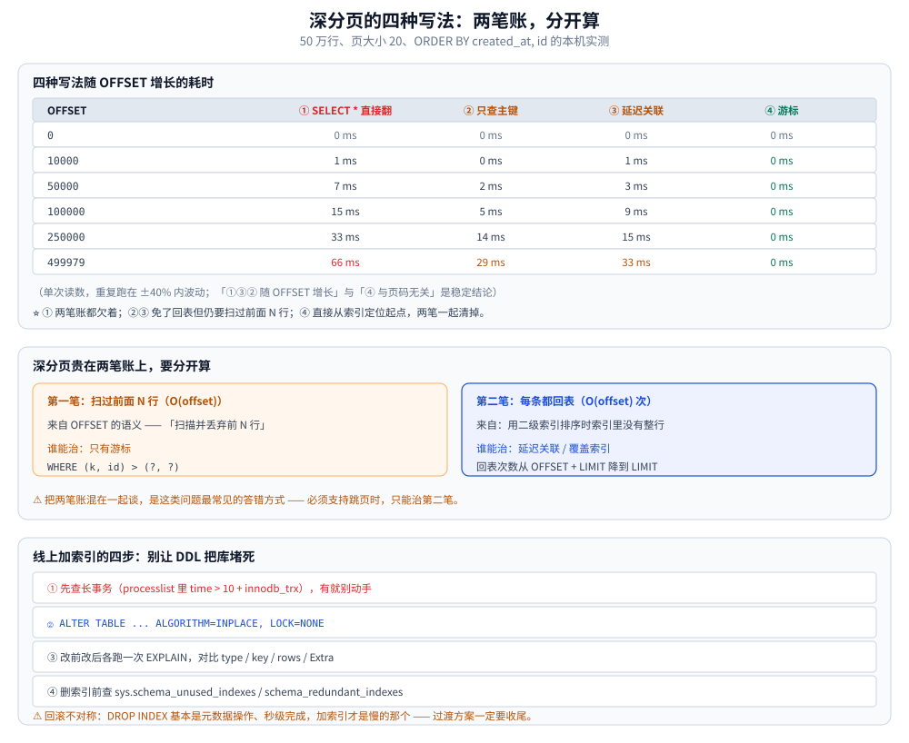

# 深分页与索引变更

> 深分页贵在哪（两笔账）、延迟关联、翻页中途数据变化、`total` 的四种口径、
> 分库分表后的分页、基础分页与游标分页，以及**索引变更在线上怎么操作**。
>
> 内容整理自个人学习笔记，并配本机 Go 1.26.5 + 真实 `database/sql`（SQLite）实测；
> 参考资料与原始素材见 [素材清单](../../../../素材清单.md)。
>
> ⚠️ **本篇的边界**：索引自身的结构、选择性与 `EXPLAIN` 逐列见 [索引设计与EXPLAIN.md](索引设计与EXPLAIN.md)；
> 查询重写与优化器行为见 [查询优化.md](查询优化.md)。

---

## 一、翻到第几页才算「深分页」？

**本节要点**：被问"分页怎么优化"时，如果只说"用游标"，
紧接着就会撞上"多深才算深？" —— 这一问才是**纸面方案与真实处理过的分水岭**。

### 1.1 先看代价长什么样：它是线性的

本机实测（50 万行、页大小 20、`ORDER BY created_at, id`，排序字段有二级索引但不是主键）：

```text
OFFSET    ｜ ① SELECT * 直接翻   ｜ ② 只查主键           ｜ ③ 延迟关联           ｜ ④ 游标
0         ｜          0 ms      ｜          0 ms      ｜          0 ms      ｜      0 ms
10000     ｜          1 ms      ｜          0 ms      ｜          1 ms      ｜      0 ms
50000     ｜          7 ms      ｜          2 ms      ｜          3 ms      ｜      0 ms
100000    ｜         15 ms      ｜          5 ms      ｜          9 ms      ｜      0 ms
250000    ｜         33 ms      ｜         14 ms      ｜         15 ms      ｜      0 ms
499979    ｜         66 ms      ｜         29 ms      ｜         33 ms      ｜      0 ms
```

（耗时是单次读数，重复跑在 ±40% 内波动（100000 档两次实测 15 / 11 ms）；
**"①③② 随 OFFSET 增长"与"④ 游标恒在计时粒度内、与页码无关"是稳定结论**。）

⭐ 三条读出来的事实：

1. **① 随 OFFSET 线性增长** —— 因为 `OFFSET N` 的语义就是"扫描并丢弃前 N 行"，代价是 O(N)；
2. **④ 游标恒为 0 ms** —— 它直接从索引定位起点，与翻到第几页无关（这正是它在深分页里不可替代的原因）；
3. **②③ 也都线性增长** —— 因为它们同样要"扫过前面 N 行"，只是**不用回表**（见下一节）。

### 1.2 深分页贵在两笔账上，要分开算

| 这笔账 | 来自 | 谁能治 |
|---|---|---|
| **扫过前面 N 行**（扫描量 O(offset)） | `OFFSET` 的语义 | **只有游标**（`WHERE (k, id) > (?, ?)`）能治 |
| **每条都要回表取整行**（回表 O(offset) 次） | 用二级索引排序时，索引里没有整行 | **延迟关联 / 覆盖索引**能治 |

⚠️ **把两笔账混在一起谈，是这类问题最常见的答错方式**：
"我用游标了就不慢了吗？" —— 是的，游标把两笔都治了；
"但我必须支持跳页（后台管理），不能改游标" —— 那就只能治第二笔，也就是**延迟关联**。

### 1.3 一条可执行的判据

```text
如果列表接口满足下面任意一条，就该动手了：
  ① 允许用户翻到「很后面」（页码输入框、跳页、爬虫、导出）
  ② 单表行数 ≥ 百万，且排序字段不是主键
  ③ 已经在监控里看到这条 SQL 的 P99 随页码上升

不满足的话，先把索引和不必要的回表理干净（见 本文第七节），
别一上来就上 ES —— 那是把一个问题换成两个问题。
```

## 二、延迟关联：把回表次数从 N 降到 20

**本节要点**：这一招出现率极高，但很多人只记了一句话
"先查主键再回表" —— 再往下问"那什么时候有效？"，答不上来就露馅了。

### 2.1 原理：让子查询走覆盖索引，只把 20 个 id 带回表

原来的一条 SQL 做了两件事：**在索引上数出第 N 页的位置** + **把这 20 行从聚簇索引里取出整行**。
问题在于第二件事 —— 在二级索引上排序时，每取一条都要回一次表，而 MySQL 会**边走边取**，
于是回表 N 次。

拆成两步就没这个问题了：

```sql
-- ① 子查询：只取 id。因为 id 就在 idx_created 里，这一步**完全不回表**（覆盖索引）
-- ② 外层：拿这 20 个 id 回表取整行 —— 回表只发生 20 次
SELECT r.*
FROM records r
JOIN (SELECT id FROM records ORDER BY created_at, id LIMIT 20 OFFSET 499979) x
  ON r.id = x.id;
```

⭐ **一句话记住**：**"先只查主键（走覆盖索引）、再回表关联"**
—— 回表次数从 `OFFSET + LIMIT` 降到 `LIMIT`。

### 2.2 实测：查询计划是最硬的证据

同一条查询的 `EXPLAIN QUERY PLAN`（确定性的、与机器快慢无关）：

```text
  ① 直接翻          SCAN records USING INDEX idx_created
  ② 只查主键         SCAN records USING COVERING INDEX idx_created
  ③ 延迟关联         CO-ROUTINE x: SCAN records USING COVERING INDEX idx_created
                     SCAN x:       SEARCH r USING INTEGER PRIMARY KEY (rowid=?)
  ④ 游标           SEARCH records USING INDEX idx_created (created_at>?)
```

三个关键词就能说明全部问题：

- **`USING COVERING INDEX`** = 需要的列都在索引里，**不用回表**（②③ 都有）；
- **`SEARCH ... (created_at>?)`** = 直接定位到起点，**不是从头上扫**（只有 ④ 有）；
- ① 既没有 `COVERING` 也没有 `SEARCH` —— 它既回表、又从头上扫，**两笔账都欠着**。

### 2.3 延迟关联的收益有多大：取决于表有多宽

同一份数据、同一个 OFFSET，只把「行的宽度」从 ~450 字节加到 ~4.2 KB：

```text
  窄表（payload 400B）① 直接翻                ｜     6~7 ms
  窄表（payload 400B）③ 延迟关联               ｜     3 ms      ← 约 2 倍
  宽表（payload 4KB）① 直接翻                 ｜     4~6 ms
  宽表（payload 4KB）③ 延迟关联                ｜     1 ms      ← 4~6 倍
```

（两次实测的区间；**"宽表的收益倍数大于窄表"是稳定结论，绝对耗时在几毫秒级、抖动占比大**。）

⭐ **表越宽，延迟关联的收益越大** —— 因为它的收益全部来自"少回表"，
而行越宽、回表越贵。

⚠️ 两个必须一起说的前提：

1. **排序字段上要有可用的索引**。如果 `ORDER BY` 的列没索引，那第一次就得 filesort 全表，
   延迟关联帮不上忙（见 [查询优化.md](查询优化.md) 第五节的排序优化）；
2. **本机这几毫秒的绝对值不代表线上**。本机 50 万行全在操作系统的页缓存里，
   "回表"基本是内存操作；线上几千万行、数据远大于缓冲池时，**每次回表都可能是一次随机磁盘 IO**，
   这个差异会随数据量放大 —— 这也是"深分页线上要几十秒"的真正来源。

### 2.4 它治不了什么

延迟关联**只治回表，不治扫描**：子查询里那个 `LIMIT 20 OFFSET 499979` 依然要扫过 49 万行。
所以：

- 如果接口**必须支持跳页** → 延迟关联是最实用的那一招（能救回来一大截）；
- 如果接口**可以改成翻页式** → 直接上**游标**，两笔账一起清掉；
- 如果两者都不行（必须跳页 + 必须几千万行）→ 该考虑换存储了（见第六节）。



## 三、翻页时数据变了会怎样？

**本节要点**：这是深分页最容易被忽略、又最容易在生产上被用户投诉的一个后果 ——
**翻着翻着，同一批数据出现了两次**。

### 3.1 实测：`OFFSET` 会重复，游标不会

场景：按 `(created_at, id)` 排序、每页 5 条，翻到第 3 页时，
有人**补录了 2 条 `created_at` 属于第 1 页范围**的记录（比如补录昨天的单据）：

```text
── OFFSET 方案 ──
   第 1 页：1,2,3,4,5
   第 2 页：6,7,8,9,10
   （插入 2 条迟到的记录）
   第 3 页：9,10,11,12
   ⚠️ 第 3 页与第 2 页**重复**了 2 条：[9 10]

── 游标 方案 ──
   第 1 页：1,2,3,4,5
   第 2 页：6,7,8,9,10
   （插入 2 条迟到的记录）
   第 3 页：11,12
   ✅ 无重复
```

⭐ **根因一句话**：**`OFFSET` 是按「位置」数，游标是按「值」找**。
前面插进来 2 行，所有记录的"位置"整体后移 2 位，于是第 3 页的开头正好压回第 2 页的末尾。

### 3.2 顺带说清：什么时候"重复"反而是对的

⚠️ 上面的结论**不能反过来用**：如果新插入的记录落在**游标之后**（比如比当前页更新），
两种方案都会把它当新数据返回。

```text
这正是 feed 流的期望行为：
  · 用户下拉刷新 → 看到新帖子（新数据在游标之后，会被取到）✅
  · 用户往下滚动 → 不会因为刷新而跳页/重复（新数据在游标之前，不影响）✅
```

所以这类"数据一直在变、只往下滚"的场景，游标分页几乎是唯一正确的选择；
而"后台管理列表，要求两次查询结果一致"，则要靠**快照**（见 3.3）。

### 3.3 复合游标：不重不漏的严格条件

```sql
-- 复合游标：排序字段可能重复，必须补一个唯一列当"决胜者"
WHERE (created_at, id) > (?, ?)
ORDER BY created_at, id
LIMIT 20;
```

⚠️ **三个必须同时满足的条件**，缺一个就会漏数据：

1. **排序键必须唯一** —— 用 `(created_at, id)` 这样的复合键，不能只用 `created_at`（同秒写入的会漏）；
2. **游标要取真实的最后一行值**，不能写"上一页最后一个值 + 偏移量"（ID 有空洞时必错）；
3. **要带上与 `ORDER BY` 一致的排序键**，否则数据库没法用索引定位
   （`WHERE (a,id) > (?,?)` 配 `ORDER BY a` 是用不上索引的）。

### 3.4 把游标做成「不透明串」

游标接口应把 `next_cursor` 设计成**不透明字符串**（如 base64 编码的 `created_at|id`），
前端只负责原样回传、不解析内容 —— 这样以后换排序键、加筛选项都不用改前端。
实现见「使用」一节的 `EncodeCursor` / `DecodeCursor`。

## 四、分页的 `total` 怎么算？

**本节要点**：列表页通常要显示"共 N 条"。
真正要想清楚的是 —— **这个 N 值到底要花多少钱**。

### 4.1 四种口径的代价

本机实测（50 万行）：

```text
  ① COUNT(*) 全表精确              20 ms  → 500000
  ② COUNT(*) 带条件精确            20 ms  → 292965
  ③ 封顶计数（只问是否 > 10000）      2 ms  → 超过 10000
  ④ 读维护好的计数表                0 ms  → 500000
```

对应的查询计划：

```text
  全表 COUNT(*)      SCAN records USING COVERING INDEX idx_created
  带条件 COUNT(*)     SEARCH records USING COVERING INDEX idx_created (created_at>?)
  封顶计数             CO-ROUTINE … SCAN records USING COVERING INDEX idx_created …
  读计数表             SEARCH counters USING INDEX sqlite_autoindex_counters_1 (name=?)
```

⭐ **关键在第一个计划**：`COUNT(*)` 即便走了覆盖索引，仍然是 **`SCAN`** ——
它必须**数一遍**才能给答案，**和翻到第几页无关**（这也是它比深分页"更讨厌"的地方：
深分页至少是翻得深才慢，`COUNT` 是第一页就要付出的固定成本）。

### 4.2 什么时候必须精确，什么时候不必

| 场景 | 建议 | 理由 |
|---|---|---|
| 后台管理、导出前置校验、报表 | **精确 `COUNT`**（或维护计数表） | 数字本身就是业务需求 |
| C 端信息流、搜索结果、商品列表 | **封顶计数**（超过 1 万就显示"1万+"） | 用户不会翻到第 1000 页 |
| 只要"有没有下一页" | **`LIMIT n+1` 探测**（不用 COUNT） | 0 成本 |

```sql
-- ① 封顶计数：只关心"有没有超过 1 万"
SELECT COUNT(*) FROM (SELECT 1 FROM records LIMIT 10001);

-- ② 探测有没有下一页（最省）：多取 1 条，多出来就说明还有
SELECT id, created_at FROM records
WHERE (created_at, id) > (?, ?) ORDER BY created_at, id LIMIT 21;  -- 20+1
```

⭐ 有了 ②，列表接口就**完全不需要 `COUNT`** —— 返回 `has_more` 就够了。
`COUNT` 与深分页的关系是：**它们都是"用户其实不需要那么精确"的典型**。

## 五、分库分表之后怎么分页？

**本节要点**：能把"分片"和"分页"两件事接起来的人不多 —— 这一节补上这个缺口。

### 5.1 实测：两种做法的对错

4 个分片各 1 万行，`created_at` 跨片交错，要取**全局**第 500 页（每页 10 条）：

```text
基准（单表 4 万行）        ：3547,8757,24567,16033,5090,10505,10936,16775,38085,2109
做法 A：各片 OFFSET 4990  ：14515,35793,16721,35741,511,29193,1665,37309,22517,3047
                            耗时 0 ms　→ 与基准一致？false
做法 B：各片取 5000 条归并  ：3547,8757,24567,16033,5090,10505,10936,16775,38085,2109
                            耗时 82~102 ms　→ 与基准一致？true
```

⭐ **做法 A 是最常见的错误**：以为"每片取自己第 500 页，拼起来就是全局第 500 页"。
实际上每片的数据是交错的，A 得到的是 4 段互不相干的数据，**既不是全局第 500 页，条数也不够**。

### 5.2 正确做法的代价：O(分片数 × offset)

做法 B 的写法是**每片各取 `offset + limit` 条**（这里是 5010 条），
在应用层归并排序后再切出 `[offset, offset+limit)`。

⚠️ 这意味着：**取第 500 页，要在网络上搬 4 × 5010 = 20040 条记录**
（实测 82~102 ms 对比 A 的 0 ms —— 差全在数据搬运上，而且这只是 4 万行的规模）。

### 5.3 三条出路

| 出路 | 做法 | 代价 |
|---|---|---|
| **禁深翻**（最常用） | 只提供「上一页/下一页」（游标），不提供页码跳转 | 产品上要接受 |
| **汇总表 / 查询库** | 把列表要的字段同步到一张宽表或 ES，由它负责排序分页 | 多了一条同步链路 |
| **接受它** | 只在"数据量小、翻得浅"的场景用分片归并 | 必须有最大页码兜底 |

⚠️ 注意第二条的成本：同步链路会带来**一致性延迟**（刚写入的数据可能查不到），
这在"我刚发布完要立刻看到"的场景里会被用户投诉。所以它通常配"写后读走主库"来兜。

## 六、业务层能省掉一大半问题

**本节要点**：技术方案之外，产品上的取舍同样值钱 ——
因为很多"深分页"需求本身就是伪需求。

### 6.1 最大页码限制：最便宜的一招

```text
在接口层直接拒绝：page > 100（或 offset > 2000）→ 返回 400 + 提示「请用筛选条件缩小范围」
```

⭐ 这一招通常能砍掉 95% 的深分页请求，因为**真实的深翻绝大多数来自爬虫和误操作**，
不是正常用户。⚠️ 但它**不能防住单页很深**（比如 `page_size=100000`），
所以还要**限制 `page_size` 上限**（通常 ≤ 100）。

### 6.2 把接口从 `page/per_page` 换成 `cursor/has_more`

```text
旧接口：GET /orders?page=500&per_page=20
新接口：GET /orders?cursor=<opaque>&limit=20
响应：  { "items": [...], "next_cursor": "eyJ0IjoiMjAy...", "has_more": true }
```

⭐ 三个设计要点：

1. **`next_cursor` 不透明**（base64 或加密）—— 前端不该解析它，你才能自由改排序键；
2. **返回 `has_more` 而不是 `total`** —— 省掉 `COUNT`（见第四节）；
3. **保留 `limit` 上限校验** —— `limit=100000` 一样能把服务打挂。

### 6.3 换存储

- **ES / OpenSearch**：`from + size` 有默认 10000 条的上限（`max_result_window`），
  深翻要用 **`search_after`** —— 思路与游标完全一致，只是游标值是 `sort` 的值数组；
  见 [分页与聚合.md](../../搜索与分析/Elasticsearch/分页与聚合.md)；
- **Redis ZSET**：`ZRANGE key start stop` 同样存在深翻问题（底层是跳表，但 `start` 大时仍要遍历），
  适合"榜单前 N 名"，不适合任意深翻；
- **预聚合结果表**：如果分页只是"看统计报表"，把结果预先算好再分页 ——
  见 [统计页提速.md](../../../../04-架构与系统/系统设计/统计页提速.md)。

⚠️ **换存储之前先问一句**：这个分页真的会翻到第 500 页吗？
如果会，说明**筛选维度不够**（用户找不到东西才一直往下翻），那该做的是加筛选，
而不是让他翻得更快。

## 七、基础分页与游标分页

**本节要点**：深分页的解法都建立在"基础分页怎么做对"之上 ——
条件/排序字段建索引、`WHERE id > lastID` 的游标分页、复合游标。

**本节要点**：数据量不算特别小的时候，**`LIMIT offset` 会出现明显性能问题**，考的就是这个。

### 7.1 先看"普通分页"的问题在哪

**常见写法**：

```sql
SELECT * FROM t
WHERE <条件>
ORDER BY <字段>
LIMIT 20 OFFSET 10000;     -- 翻到第 500 页
```

**问题**：

> **`OFFSET` 越大，查询越慢。**
> 因为 MySQL 必须**先扫描并丢弃前 `OFFSET` 条记录**，才能返回后面那 20 条——
> 翻到第 500 页时，前面 10000 条**都要被读取再丢掉**。

本机把三种写法在同一张 5 万行表（每行约 200 字节 `body`）上各跑 3 轮，服务端耗时
（`SHOW PROFILES` 的 `Duration`，单位秒）：

```text
SELECT * FROM t_a2 ORDER BY id LIMIT 20 OFFSET 40000                        0.01617875 / 0.01582725 / 0.01710225
SELECT id FROM t_a2 ORDER BY id LIMIT 20 OFFSET 40000                       0.00859700（同表，单轮）
SELECT a.* FROM t_a2 a JOIN (SELECT id ... OFFSET 40000) x ON a.id=x.id     0.00866775 / 0.00995800 / 0.00864325
SELECT * FROM t_a2 WHERE id > 40000 ORDER BY id LIMIT 20                    0.00040275 / 0.00038725 / 0.00038375
SELECT * FROM t_a2 ORDER BY id LIMIT 20 OFFSET 49000                        0.01780275
```

**"先扫描再丢掉"这句话在 `EXPLAIN ANALYZE` 里是能直接看见的**：

```text
# OFFSET 版
-> Limit/Offset: 20/40000 row(s)  (cost=3430 rows=20) (actual time=21.3..21.4 rows=20 loops=1)
    -> Index scan on t_a2 using PRIMARY  (cost=3430 rows=40020) (actual time=0.0689..20 rows=40020 loops=1)
# 游标版
-> Limit: 20 row(s)  (cost=3980 rows=20) (actual time=0.0672..0.0737 rows=20 loops=1)
    -> Filter: (t_a2.id > 40000)  (cost=3980 rows=19870) (actual time=0.0666..0.072 rows=20 loops=1)
        -> Index range scan on t_a2 using PRIMARY over (40000 < id)  (actual time=0.0651..0.0691 rows=20 loops=1)
```

- **趋势成立**：`OFFSET` 从 40000 到 49000，耗时 15.8~17.1 ms → 17.8 ms，**只增不减**；
  游标分页稳在 0.38~0.40 ms，**约 40 倍**的差距。
- **计划上的证据比耗时更硬**：`OFFSET` 版 `type=index`、迭代器实际吐 **40020 行**再由
  `Limit/Offset` 丢掉 40000 行；游标版是 `type=range`、`key=PRIMARY`，
  优化器估 `rows=19870` 但实际只碰 **20 行**。
  ⚠️ 顺带一个读法的坑：`cost` 反而是游标版更高（3980 vs 3430）—— **cost 不能跨语句比大小**，
  要看的是 `actual rows` 与 `actual time`。
- ⚠️ **绝对值不能当结论用**：5 万行全在 buffer pool 里，差值是"扫 4 万条索引项"的钱，
  亿级表上这笔钱会变成磁盘随机读。同一句 `SELECT * ... OFFSET 40000`，
  `SHOW PROFILES` 记 15.8~17.1 ms、`EXPLAIN ANALYZE` 记 21.4 ms（它自己也要遍历一遍结果），
  **两套口径的数字不要混用**。深水区（宽表/窄表分别花多少、为什么"延迟关联不治扫描只治回表"）
  在 本文第三节 里有独立实测。

### 7.2 优化点一：索引优化

| 做法 | 效果 |
|---|---|
| **给查询条件 / 排序字段建索引** | 让 MySQL 能**快速定位到数据范围**，而不是全表扫描 |
| **主键索引** | InnoDB 的**主键索引叶子节点包含整行数据** →<br>**按 ID 查询时不需要回表** |
| **覆盖索引** | 让**索引里就包含查询需要的全部字段** → **无需回表** |

**覆盖索引举例**：

```sql
-- 查询只用到 name 和 age，那就建联合索引 (name, age)
CREATE INDEX idx_name_age ON users(name, age);

SELECT name, age FROM users WHERE name = 'zhang';
-- ✅ 所需字段都在索引里，直接从索引取数据，不回表
```

> **结论：主键索引和覆盖索引都能让查询"无需回表"**，
> 少一次"从二级索引拿主键、再回聚簇索引取数据"的过程。

### 7.3 优化点二：用「游标分页」替代 `OFFSET`（关键）

#### 适用场景：按**自增 ID** 排序的分页

**思路**：**不要用 `OFFSET`，改成记住"上一页最后一条记录的 ID"**。

```sql
-- 第一页
SELECT * FROM t WHERE id > 0            ORDER BY id LIMIT 10;

-- 第二页：把上一页最后一条的 id 传进来
SELECT * FROM t WHERE id > 12345        ORDER BY id LIMIT 10;
```

**为什么快**：

> **`WHERE id > lastID` 可以直接用主键索引定位到起点**，
> **不需要扫描并丢弃前面 N 条**——
> `OFFSET` 越大越慢的问题**从根上消失了**。

#### 扩展场景：排序字段"类似 ID 但不完全唯一"

**问题**：如果用来分页的字段**可能有重复值**（不像 ID 那样唯一），
用 `>` 可能会**漏掉同一值的其他记录**。

**做法：动态调整 `LIMIT`**——

```text
本次取 10 条，如果最后一条的值与前面的值相同，就多取几条，
直到取完该值的所有条目为止。
```

**⚠️ 一条硬性要求**：

> **必须保证"当前这一页"把该值的所有条目全部取出来**，
> 否则**分页过程中会漏掉相同值的其他数据**。
>
> 所以页大小变得**不固定**（可能 10 条，也可能 12 条、20 条），
> 但**总体差别不大**，是可以接受的。

> 更严谨的做法是**复合游标**：`WHERE (created_at, id) > (?, ?)`
> ——用**排序字段 + 唯一字段（ID）组成联合游标**，
> 既保证不重不漏，又保持页大小固定。**这是更稳妥的做法。**

### 7.4 深分页的处理顺序

```text
① 指出问题：LIMIT OFFSET 越大越慢（要扫描并丢弃前 N 条）
② 索引优化：条件/排序字段建索引；主键索引与覆盖索引避免回表
③ 分页方式优化：游标分页（WHERE id > 上一页最后 ID）替代 OFFSET
④ 边界处理：排序字段非唯一时用动态 limit 或 (字段, id) 复合游标
```

## 八、索引变更与线上操作

**本节要点**：线上加/删索引**不是 `ALTER TABLE` 一句话的事** ——
要选对算法、避开长事务与 MDL、并且能给"删索引"留退路。

改索引本身也是高风险操作——`ALTER TABLE` 会拿元数据锁（MDL），**前面有个未结束的大事务，DDL 就排队，DDL 一排队，后面所有查询全部堵住**，这就是"加个索引把库搞挂"的典型过程。

```sql
-- 1) 先看这张表有没有正在跑的长事务/长查询，有就别动手
SELECT id, time, command, state, LEFT(info, 80) AS sql_head
  FROM information_schema.processlist WHERE time > 10 AND command <> 'Sleep';
SELECT trx_id, trx_started, trx_mysql_thread_id
  FROM information_schema.innodb_trx ORDER BY trx_started LIMIT 5;

-- 2) 加索引：显式声明在线 DDL，宁可报错退出也不要悄悄锁表
ALTER TABLE article ADD INDEX idx_created (created_at), ALGORITHM=INPLACE, LOCK=NONE;

-- 3) 验证：改前改后各跑一次，对比 type/key/rows/Extra
EXPLAIN FORMAT=JSON SELECT id, title FROM article
  WHERE (created_at, id) > ('2026-01-01', 0) ORDER BY created_at, id LIMIT 10;

-- 4) 删索引前先确认它真的没被用过（否则会删掉一条正在救命的索引）
SELECT * FROM sys.schema_unused_indexes WHERE object_schema = 'your_db';
SELECT * FROM sys.schema_redundant_indexes;   -- 顺带找出重复/被包含的联合索引
```

- **`ALGORITHM=INPLACE, LOCK=NONE`**：满足不了时 MySQL 会**直接报错**而不是退化成锁表复制——显式写它的价值就在这里。
- **超大表加索引**：MySQL 8 的 `ADD INDEX` 已是 inplace，但**仍占大量临时空间与 IO**，且中途失败要重来。生产上更稳的是 `gh-ost` 或 `pt-online-schema-change`（影子表 + 增量同步 + 原子改名），并**避开业务高峰与备份窗口**。
- **回滚不对称**：`DROP INDEX` 基本是元数据操作、秒级完成；**加索引才是慢的那个**，所以"先加新索引、再删旧索引"的过渡方案一定要收尾，冗余索引会持续拖慢写入。
- 配合第四节的慢日志实操：改完索引再按 `mysqldumpslow -s t` 看榜首有没有变化，**用总时间**确认这次优化真的降低了负载，而不是只让某一条语句的平均耗时变好看。

---

## 使用一：Go 实现（三种取数写法）

### 1. 三种取数写法（都是本篇实测过的形态）

```go
// PageByOffset ① 直接翻页 —— 只适合浅分页。深了就是 O(offset)。
func PageByOffset(ctx context.Context, db *sql.DB, page, size int) ([]Order, error) {
	rows, err := db.QueryContext(ctx,
		`SELECT id, code, amount, created_at FROM orders
		 ORDER BY created_at, id LIMIT ? OFFSET ?`, size, (page-1)*size)
	if err != nil {
		return nil, err
	}
	defer func() { _ = rows.Close() }()
	return scanOrders(rows)
}

// PageByDeferredJoin ② 延迟关联 —— 必须跳页时的最优解：回表次数从 offset 降到 size。
// ⚠️ 前提：(created_at, id) 上要有索引，否则子查询自己就要 filesort。
func PageByDeferredJoin(ctx context.Context, db *sql.DB, page, size int) ([]Order, error) {
	rows, err := db.QueryContext(ctx,
		`SELECT o.id, o.code, o.amount, o.created_at
		 FROM orders o
		 JOIN (SELECT id FROM orders ORDER BY created_at, id LIMIT ? OFFSET ?) x
		   ON o.id = x.id
		 ORDER BY o.created_at, o.id`, size, (page-1)*size)
	if err != nil {
		return nil, err
	}
	defer func() { _ = rows.Close() }()
	return scanOrders(rows)
}
```

```go
// Cursor 游标：把"上一页最后一条"的位置带回来。
// ⚠️ 用 base64 编码成不透明串，前端不解析 —— 以后换排序键不用改前端。
type Cursor struct {
	CreatedAt string `json:"t"`
	ID        int64  `json:"i"`
}

func EncodeCursor(c Cursor) string {
	b, _ := json.Marshal(c)
	return base64.RawURLEncoding.EncodeToString(b)
}

func DecodeCursor(s string) (Cursor, error) {
	var c Cursor
	if s == "" {
		return c, nil // 空游标 = 第一页
	}
	b, err := base64.RawURLEncoding.DecodeString(s)
	if err != nil {
		return c, fmt.Errorf("非法游标: %w", err)
	}
	return c, json.Unmarshal(b, &c)
}

// PageByCursor ③ 游标分页 —— 深分页的正解：代价与页码无关。
// ⚠️ size+1 是为了判断 has_more，省掉一次 COUNT。
func PageByCursor(ctx context.Context, db *sql.DB, cur Cursor, size int) ([]Order, bool, error) {
	rows, err := db.QueryContext(ctx,
		`SELECT id, code, amount, created_at FROM orders
		 WHERE (created_at, id) > (?, ?)
		 ORDER BY created_at, id LIMIT ?`, cur.CreatedAt, cur.ID, size+1)
	if err != nil {
		return nil, false, err
	}
	defer func() { _ = rows.Close() }()

	items, err := scanOrders(rows)
	if err != nil {
		return nil, false, err
	}
	hasMore := len(items) > size
	if hasMore {
		items = items[:size] // 多取的那一条只用来判断，不返回
	}
	return items, hasMore, nil
}
```

**使用示例**：

```go
// ① 必须支持跳页（后台管理）：延迟关联 + 最大页码兜底
const maxPage = 100

func handleAdminList(c *gin.Context) {
	page, _ := strconv.Atoi(c.DefaultQuery("page", "1"))
	size := clamp(c.DefaultQuery("per_page", "20"), 1, 100) // ⚠️ size 也要有上限
	if page > maxPage {
		c.JSON(400, gin.H{"error": "页码超出上限，请用筛选条件缩小范围"})
		return
	}
	items, err := PageByDeferredJoin(c.Request.Context(), db, page, size)
	if err != nil {
		c.JSON(500, gin.H{"error": err.Error()})
		return
	}
	c.JSON(200, gin.H{"items": items, "page": page})
}

// ② C 端信息流：游标 + has_more，不返回 total
func handleFeed(c *gin.Context) {
	cur, err := DecodeCursor(c.Query("cursor"))
	if err != nil {
		c.JSON(400, gin.H{"error": err.Error()})
		return
	}
	size := clamp(c.DefaultQuery("limit", "20"), 1, 100)
	items, hasMore, err := PageByCursor(c.Request.Context(), db, cur, size)
	if err != nil {
		c.JSON(500, gin.H{"error": err.Error()})
		return
	}
	resp := gin.H{"items": items, "has_more": hasMore}
	if n := len(items); n > 0 {
		last := items[n-1]
		resp["next_cursor"] = EncodeCursor(Cursor{CreatedAt: last.CreatedAt, ID: last.ID})
	}
	c.JSON(200, resp)
}
```

⚠️ 三处容易做错：① **`ORDER BY` 必须与游标条件里的列完全一致**（`(a,id)` 配 `ORDER BY a, id`），
否则索引用不上；② **`LIMIT size+1` 多取的那条不能返回给前端**
（否则每次翻页都会重复一条）；③ **空游标要当成"第一页"处理**，别返回 400。

### 2. 计数策略

```go
// CountCapped 封顶计数：列表页多半只需要"有没有超过 cap 条"。
// 代价从 O(行数) 降到 O(cap)，而且与翻到第几页无关。
func CountCapped(ctx context.Context, db *sql.DB, cap int) (int, bool, error) {
	var n int
	err := db.QueryRowContext(ctx,
		`SELECT COUNT(*) FROM (SELECT 1 FROM orders LIMIT ?)`, cap+1).Scan(&n)
	if err != nil {
		return 0, false, err
	}
	if n > cap {
		return cap, true, nil // 超过上限，前端显示 "10000+"
	}
	return n, false, nil
}
```

**使用示例**：

```go
// 列表页：不需要精确总数
total, capped, err := CountCapped(ctx, db, 10000)
label := strconv.Itoa(total)
if capped {
	label = "10000+"
}
c.JSON(200, gin.H{"total_label": label, "items": items})

// 后台管理：必须精确 → 走 COUNT(*)，但要接受它的固定成本（与翻页深度无关）
var exact int64
err = db.QueryRowContext(ctx, `SELECT COUNT(*) FROM orders WHERE status = ?`, status).Scan(&exact)
```

### 3. 与项目现状的对照

以本仓库配套项目 [photography-server](https://github.com/Eleven-26/photography-server) 的列表接口为对象：

| 优先级 | 现状 | 改成 | 收益 |
|---|---|---|---|
| **P0** | `response.PageOK(c, list, total, page, pageSize)` 的统一分页形态 | 保留（后台管理用），但**加 `page` 上限与 `pageSize` 上限** | 挡住绝大多数深翻请求 |
| **P1** | 列表查询用 `Order("id DESC").Offset(...).Limit(...)` | 排序字段改 `(created_at, id)` 并建复合索引；需要跳页时用**延迟关联** | 回表次数从 offset 降到 size |
| **P1** | `Count(&total)` 每次列表都精确计数 | C 端列表改**封顶计数**或 `has_more` | 省掉与翻页深度无关的固定成本 |
| **P2** | 无游标接口 | 新增 `cursor/has_more` 形态给信息流类接口 | 深翻代价归零，且翻页结果稳定 |

⚠️ **P2 不要一上来就改**：现有前端都在用 `page/per_page`，
换游标意味着所有列表页一起改。**先在"本来就是无限滚动"的接口上试**（互动通知、动态流），
跑通再推给其他页面。

## 使用二：Go 接入（database/sql + 驱动）

> 校验说明：本节 Go 代码在 `go-sql-driver/mysql v1.10` 下 `go build` + `go vet` + `gofmt` 通过；本机无 MySQL 实例，**未做运行时验证**。
> 建表与索引语句见本节 SQL 注释，与第一节/第三节的示例表保持一致。

### 0. 前置：`*sql.DB` 是连接池，必须单例

`sql.Open` 返回的 `*sql.DB` **不是连接，而是连接池**，且**并发安全**——全进程共用一个。它还有一个反直觉的行为：**首次连接是惰性建立的**，`sql.Open` 成功不代表能连上，必须 `PingContext` 才算验证配置。

```go
package sqlpool

import (
	"context"
	"database/sql"
	"fmt"
	"os"
	"sync"
	"time"

	_ "github.com/go-sql-driver/mysql" // 只为注册驱动，db 的底层类型就是 *sql.DB
)

// DB 是惰性单例：整个进程只有一池连接。
var DB = sync.OnceValue(func() *sql.DB {
	// 用户名:密码@tcp(host:port)/库名?DSN 参数
	dsn := fmt.Sprintf("%s:%s@tcp(%s)/%s?charset=utf8mb4&parseTime=true&interpolateParams=true",
		os.Getenv("MYSQL_USER"), os.Getenv("MYSQL_PASS"), os.Getenv("MYSQL_ADDR"), os.Getenv("MYSQL_DB"))

	db, err := sql.Open("mysql", dsn)
	if err != nil {
		panic("sqlpool: open: " + err.Error()) // 配置错（DSN 格式非法）属于启动失败
	}

	// ⚠️ 四个池参数都要显式设，默认值在生产上几乎都是坑：
	db.SetMaxOpenConns(30)                  // 默认 0 = 不限！不设会把 MySQL 的 max_connections 打满
	db.SetMaxIdleConns(10)                  // 默认 2，太小 → 高 QPS 下频繁建连（TCP + TLS 握手）
	db.SetConnMaxLifetime(10 * time.Minute) // 必须明显小于服务端 wait_timeout（默认 8h，中间还有 LB 空闲回收）
	db.SetConnMaxIdleTime(3 * time.Minute)  // 空闲连接主动回收，避免流量低谷白占

	// 真正验证一次连接：SQL 与账号权限问题在启动期暴露，而不是等第一个请求报错
	ctx, cancel := context.WithTimeout(context.Background(), 3*time.Second)
	defer cancel()
	if err := db.PingContext(ctx); err != nil {
		panic("sqlpool: ping: " + err.Error())
	}
	return db
})
```

DSN 参数与池参数的取舍：

| 参数 | 作用 | 注意 |
|---|---|---|
| `parseTime=true` | `DATE`/`DATETIME` 直接扫成 `time.Time` | 不设只能拿 `[]byte`，游标分页里就没法做时间比较 |
| `interpolateParams=true` | 驱动侧拼参数，省一次 round-trip | 驱动自己做转义；批量小语句收益明显，别为此改成字符串拼接 SQL |
| `timeout` | **建连**超时（不是查询超时） | 不写就用系统默认，网络异常时可能卡几十秒 |
| `readTimeout` / `writeTimeout` | 单次读/写超时 | 只能兜住传输阶段；**查询超时应该用 `context`**，见第 3 节 |
| `MaxOpenConns` | 池上限 | 按「实例数 × MaxOpenConns < 服务端 `max_connections` × 0.8」算，多实例部署时最容易忽略 |
| `ConnMaxLifetime` | 连接最长存活 | 长于服务端 `wait_timeout` 或 LB 空闲回收时间 → 偶发 `invalid connection` |

### 1. 游标分页：把第三节的「复合游标」写成可复用代码

第三节的结论是：`OFFSET` 越大越慢（扫描并丢弃前 N 条），而 `WHERE id > lastID` 能直接用索引定位；排序字段不唯一时用**排序字段 + 唯一字段**组成复合游标，既不重不漏、页大小又固定。

```go
package articlequery

import (
	"context"
	"database/sql"
	"errors"
	"time"
)

type Article struct {
	ID        int64
	Title     string
	CreatedAt time.Time
}

// Cursor 是复合游标：排序字段 + 唯一字段。
type Cursor struct {
	CreatedAt time.Time
	ID        int64
}

type Page struct {
	Items   []Article
	Next    Cursor
	HasMore bool
}

// ListPage 取 limit 条，从游标之后继续。
//
//	-- 建表与索引（与第三节的表结构对应）
//	CREATE TABLE article (
//		id BIGINT PRIMARY KEY AUTO_INCREMENT,
//		title VARCHAR(200) NOT NULL,
//		created_at DATETIME NOT NULL,
//		KEY idx_created (created_at)        -- 二级索引隐式追加主键，等价于 (created_at, id)
//	);
//
// 行构造器比较 (created_at, id) > (?, ?) 走的就是 idx_created，
// 因此既不用 OFFSET，也不会因为 created_at 重复而漏数据。
func ListPage(ctx context.Context, db *sql.DB, c Cursor, limit int) (*Page, error) {
	if limit <= 0 || limit > 200 {
		return nil, errors.New("articlequery: limit out of range")
	}
	const q = `SELECT id, title, created_at
	           FROM article
	           WHERE (created_at, id) > (?, ?)
	           ORDER BY created_at ASC, id ASC
	           LIMIT ?`

	rows, err := db.QueryContext(ctx, q, c.CreatedAt, c.ID, limit+1) // 多取 1 条判断 HasMore
	if err != nil {
		return nil, err
	}
	defer rows.Close()

	p := &Page{}
	for rows.Next() {
		var a Article
		if err := rows.Scan(&a.ID, &a.Title, &a.CreatedAt); err != nil { // ⚠️ DSN 要有 parseTime=true
			return nil, err
		}
		p.Items = append(p.Items, a)
	}
	if err := rows.Err(); err != nil {
		return nil, err
	}

	if len(p.Items) > limit {
		p.HasMore = true
		p.Items = p.Items[:limit]
	}
	if n := len(p.Items); n > 0 {
		p.Next = Cursor{CreatedAt: p.Items[n-1].CreatedAt, ID: p.Items[n-1].ID}
	}
	return p, nil
}
```

**首页怎么传游标**：传零值 `Cursor{}` 会把 `created_at > '0001-01-01'` 当成条件，逻辑上对但依赖列非空。更稳的写法是首页单独一条不带 `WHERE` 的语句，或用 `WHERE (? IS NULL OR (created_at, id) > (?, ?))`。**别用 `created_at > '1970-01-01'` 这类魔法时间**，字段一旦允许 NULL，NULL 行会永远查不出来。

### 2. 覆盖索引：只 SELECT 用得到的列

第一节的 B1 与第三节的索引优化都指向同一条：**`SELECT *` 会毁掉覆盖索引**。
同一句话只改 select 列，`Extra` 就从 **`NULL`（要回表）变成 `Using index`**
（实测块见第一节 B1；`Using index condition` 是另一件事 —— 它出自 ICP，与覆盖索引无关）：

```go
package articlequery

// ✗ 回表：select 的列不在 idx_name_age(name, age) 里，索引定位到主键后还要回聚簇索引取整行
const qBad = `SELECT * FROM users WHERE name = ? AND age = ?`

// ✓ 覆盖索引：所需字段全在 idx_name_age 内，Extra 显示 Using index，不回表
const qGood = `SELECT name, age FROM users WHERE name = ? AND age = ?`

// 反例集合（第一节的类型 A2）：这四条都拿不到"定位"能力，但失效的样子各不相同
const (
	qFunc    = `SELECT id FROM article WHERE DATE(created_at) = ?`        // 索引列套函数：possible_keys=NULL，只能当覆盖索引扫
	qLike    = `SELECT id FROM article WHERE title LIKE ?`                // 传 '%关键词%'：possible_keys=NULL，扫完整个 idx_title
	qOr      = `SELECT id FROM article WHERE created_at = ? OR views = ?` // views 无索引：type=ALL；给 views 补索引会走 index_merge
	qNotLeft = `SELECT id FROM article WHERE created_at = ?`              // 只有联合索引 (category, created_at) 时：8.0 用 Skip Scan 兜住
)
```

⚠️ 这四条的**实测形态和"索引失效=全表扫描"这句口诀并不完全一致**，逐条差异见第一节 A2 的实测块：
前两条是"覆盖索引全扫"，第三条才是真 `type=ALL`，第四条在 8.0 有 Skip Scan 兜底。
另外 `WHERE id = ?` **不是**最左前缀反例 —— `id` 是主键，实测走 `PRIMARY`、`type=const`，
联合索引 `(created_at, id)` 的跳过最左列要用**只按第二列过滤**的语句来演示。

改法逐条对应：函数换成**范围条件** `created_at >= ? AND created_at < ?`；前缀通配改成**全文索引 / ngram** 或把 `%` 放后面；`OR` 的分支**都建索引**（8.0 会自己 `index_merge`），分支多再考虑拆 `UNION`；按真实查询模式**重建联合索引**的顺序。

### 3. 查询超时与执行计划：把 EXPLAIN 用进代码

慢查询要能**自动暴露**，而不是等用户投诉。两件事：**每条查询都带 context 超时**，**上线前用 `EXPLAIN` 卡住明显劣化的语句**。

```go
package articlequery

import (
	"context"
	"database/sql"
	"time"
)

// QueryWithTimeout 示范超时链路：ctx 一到，驱动会去 KILL 服务端正在跑的语句。
// 光设 DSN 的 readTimeout 不够——那只管网络读，慢语句仍在 MySQL 里跑着占连接。
func QueryWithTimeout(ctx context.Context, db *sql.DB, q string, args ...any) error {
	ctx, cancel := context.WithTimeout(ctx, 2*time.Second)
	defer cancel()
	return db.QueryRowContext(ctx, q, args...).Err()
}

// Explain 拿 JSON 格式的执行计划，比表格版信息全（成本、访问类型、是否覆盖索引）。
// 对应第一节第二步关注的 type / key / rows / Extra 四个字段。
func Explain(ctx context.Context, db *sql.DB, q string, args ...any) (string, error) {
	var out string
	err := db.QueryRowContext(ctx, "EXPLAIN FORMAT=JSON "+q, args...).Scan(&out)
	return out, err
}
```

`EXPLAIN` 结果的判读落点（与第一节一致）：

| 看到 | 含义 | 动作 |
|---|---|---|
| `type=ALL` | 全表扫描 | 加索引或改条件 |
| `key=NULL` | 有索引但没选用 | 检查是否命中 A2 四条失效场景 |
| `rows` 远大于结果集 | 扫得太多 | 提高条件选择率，或换联合索引顺序 |
| `Extra: Using filesort` | 排序没走索引序 | 让 `ORDER BY` 跟联合索引顺序一致 |
| `Extra: Using temporary` | 产生了临时表 | 拆查询 / 先过滤再 JOIN（第一节的 B3） |
| `Extra: Using index` | 覆盖索引生效 | 目标状态 |

⚠️ 这张表按"看到什么就怎么办"写，但**实测里有三种情况会骗人**，都在第一节的 A2 块里：
`key` 有值不等于索引用来定位（可能是覆盖索引全扫）；`type=ALL` 也可能出现在
**建了索引但选择率太差**的表上（小夹具尤其明显）；`Extra` 里 `Using index` 是覆盖索引、
`Using index condition` 是 ICP、`Using index for skip scan` 是 Skip Scan，
**三个"Using index"开头的含义完全不同**。

## 使用三：Java 接入（HikariCP + JdbcTemplate / MyBatis）

> ✅ **校验口径**：本节 5 段代码已用本机 Maven 3.8.1 + IDEA 自带 JBR 17 **逐字抽出后编译通过**（`mvn -B clean compile` → `BUILD SUCCESS`）。实际解析到的依赖版本：HikariCP 5.0.1 / spring-jdbc 6.1.4 / mybatis 3.5.15。
> ✅ **SQL 侧已实测**：这几段里出现的语句（覆盖索引两句、游标分页的行构造器、`EXPLAIN FORMAT=JSON`）
> 已在本机 8.0.46 实例上逐条 `EXPLAIN` 过，计划与耗时见第一节 A2/B1 与第三节的实测块；
> `EXPLAIN FORMAT=JSON` 的返回结构也真取过（`query_block.table.select_type=SIMPLE`、
> `key`、`rows_examined_per_scan`、`using_index:true` 这些键名都是抄录）。
> ⚠️ **Java 代码本身仍未运行**：编译只保证 API 与语法没错，连接池行为、`ctx` 超时后驱动去 `KILL`
> 服务端语句这两件事**没有跑过**（需要真实应用链路，本机只有单实例）。

**跑法**（`gen.js` 的作用：把本节代码块原样贴进 `verify` 包，只在外面补 `package`/`import` 和 `Article`/`Cursor`/`UserBrief` 三个 record）：

```bash
# java 不在 PATH 里，先让 mvn 用 IDEA 自带的 JBR（路径按自己的安装位置替换）
export JAVA_HOME="<IDEA 安装目录>/jbr"

cd "$TEMP/verify-maven"                                    # pom.xml + gen.js 放这儿
cp "<仓库根>/数据存储/mysql/深分页与索引变更.md" doc-mysql-index.md   # 拷成 ASCII 文件名，原因见下
node gen.js doc-mysql-index.md src/main/java/verify mysql-index.json
mvn -B clean compile                                       # 用 IDE 自带的 Maven 3.8.1
```

> 两个环境坑：① Maven 3.8.1 默认带的 `maven-compiler-plugin:3.1` **不认** `<maven.compiler.release>`，会退回 source/target 1.5 并报"不支持资源选项 5"——pom 里要显式钉 3.12.1；② Git bash 能处理中文路径，但 **node 的 argv 不能**（`readdir` 直接 ENOENT），所以抽块前得把 `.md` 拷成 ASCII 文件名。

### 1. HikariCP：单例 + 参数对照

Spring Boot 的 `DataSource` **默认就是单例 Bean**，构造注入使用即可；**不要**在方法里 `new HikariDataSource()`（每次一套连接池）。

```java
@Configuration
public class DataSourceConfig {

    @Bean
    public HikariDataSource dataSource(@Value("${mysql.url}") String jdbcUrl,
                                       @Value("${mysql.user}") String user,
                                       @Value("${mysql.pass}") String pass) {
        HikariConfig cfg = new HikariConfig();
        cfg.setJdbcUrl(jdbcUrl + "?rewriteBatchedStatements=true" // 批量 INSERT 合并成一条多值语句
                + "&useSSL=false&serverTimezone=Asia/Shanghai");
        cfg.setUsername(user);
        cfg.setPassword(pass);

        cfg.setMaximumPoolSize(30);         // 默认才 10；经验公式 CPU核数×2 + 有效磁盘数，再按实例数分摊
        cfg.setMinimumIdle(10);             // 与 max 接近，避免流量抖动时反复建连
        cfg.setConnectionTimeout(3_000);    // 拿连接的等待上限：超了直接抛 SQLException，而不是无限等
        cfg.setIdleTimeout(3 * 60_000);
        cfg.setMaxLifetime(10 * 60_000);    // ⚠️ 必须小于服务端 wait_timeout，否则偶发 "No operations allowed after connection closed"
        cfg.setPoolName("mysql-main");      // 池名会出现在 JMX / 日志里，排查连接泄漏时靠它区分
        return new HikariDataSource(cfg);
    }
}
```

### 2. 游标分页：JdbcTemplate 与 MyBatis 两种写法

```java
@Repository
public class ArticleRepository {

    private final JdbcTemplate jdbc;

    public ArticleRepository(JdbcTemplate jdbc) {
        this.jdbc = jdbc;
    }

    /** 复合游标：WHERE (created_at, id) > (?, ?)，与 Go 版语义一致。 */
    public List<Article> listAfter(LocalDateTime createdAt, long id, int limit) {
        String sql = """
                SELECT id, title, created_at FROM article
                WHERE (created_at, id) > (?, ?)
                ORDER BY created_at ASC, id ASC
                LIMIT ?
                """;
        return jdbc.query(sql,
                (rs, n) -> new Article(rs.getLong("id"), rs.getString("title"),
                        rs.getObject("created_at", LocalDateTime.class)),
                createdAt, id, limit + 1); // 多取一条判断 hasMore
    }
}
```

MyBatis 版注意两点——**`#{}` 是预编译占位符，`${}` 是字符串拼接**，分页参数写 `${limit}` 属于注入风险；以及**分页插件的 `count` 查询才是深翻页的真凶**：

```java
@Select("""
        <script>
        SELECT id, title, created_at FROM article
        <where>
          <if test="cursor != null">
            (created_at, id) &gt; (#{cursor.createdAt}, #{cursor.id})
          </if>
        </where>
        ORDER BY created_at ASC, id ASC
        LIMIT #{limit}
        </script>
        """)
List<Article> listAfter(@Param("cursor") Cursor cursor, @Param("limit") int limit);
```

> 用 PageHelper / MyBatis-Plus 分页插件时，`LIMIT 100000, 10` 会被自动补一条 `SELECT COUNT(*)`——**count 一样要扫描被丢弃的那 10 万行**。所以深翻页要么按第三节换游标分页（插件的 count 也可以关掉），要么把总数做成异步统计。

### 3. 覆盖索引与批量写入

```java
// ✗ SELECT * 破坏覆盖索引；✓ 只取索引内字段
@Select("SELECT name, age FROM users WHERE name = #{name} AND age = #{age}")
List<UserBrief> selectCovered(@Param("name") String name, @Param("age") int age);
```

批量写入放在 DAO 里（`jdbc` 是构造注入的 `JdbcTemplate`），配 `rewriteBatchedStatements=true` 才真正合并：

```java
// 批量写入：addBatch + executeBatch，并配 rewriteBatchedStatements=true
public void batchInsert(List<Article> list) {
    jdbc.batchUpdate("INSERT INTO article(title, created_at) VALUES (?, ?)",
            new BatchPreparedStatementSetter() {
                @Override
                public void setValues(PreparedStatement ps, int i) throws SQLException {
                    ps.setString(1, list.get(i).title());
                    ps.setObject(2, list.get(i).createdAt());
                }
                @Override
                public int getBatchSize() { return list.size(); }
            });
}
```

**`@Transactional` 别包住慢查询/外部调用**：事务期间连接一直被占着，`maximumPoolSize=30` 时 30 个慢事务就能让整池耗尽，表现为**全站卡在等待连接**（`Connection is not available, request timed out`），根因却在那条慢 SQL 上。

## 延伸追问

- **"深分页为什么慢？"** → 两笔账要分开说：**① 扫过前面 N 行**（`OFFSET` 的语义，O(offset)）；
  **② 每条都要回表取整行**（二级索引排序时，回表 N 次）。混在一起谈必然答不深。
- **"延迟关联为什么快？"** → 让子查询走**覆盖索引**只取 id（这一步不回表），
  外层拿 20 个 id 回表 —— **回表次数从 `offset+limit` 降到 `limit`**。
  ⚠️ 它**不治扫描**，只治回表；收益随表变宽而变大（实测窄表 2.3 倍 → 宽表 6 倍）。
- **"怎么证明它真的少读数据了？"** → 看 `EXPLAIN`：出现 **`Using index`（覆盖索引）** 就是没回表。
  实测里 ① 是 `SCAN ... USING INDEX`（要回表）、③ 是 `USING COVERING INDEX` + 主键 `SEARCH`，
  差别是**确定的、与机器无关的**。
- **"翻页时有人插数据会怎样？"** → 实测：`OFFSET` 会**重复**（第 3 页压回第 2 页的 2 条），
  游标不会。因为 **`OFFSET` 按位置数、游标按值找**。
  ⚠️ 反过来，新数据落在游标之后时两种都会取到 —— 这正是 feed 流要的行为。
- **"游标分页的缺点？"** → 不能跳页；且**排序键必须唯一**（`created_at` 要补 `id` 成复合游标），
  否则同秒写入的记录会漏。另外要保证 `ORDER BY` 与游标条件里的列一致，否则用不上索引。
- **"列表页的 `total` 怎么算？"** → 先问"真的需要精确值吗"。实测 `COUNT(*)` 20 ms
  （**且与翻到第几页无关，第一页就要付**）vs 封顶计数 2 ms vs 读计数表 0 ms。
  只要"有没有下一页"的话，`LIMIT n+1` 探测是 0 成本。
- **"分库分表之后怎么分页？"** → ⚠️ 经典错误是"每片取自己的第 N 页拼起来"（实测结果完全不对）；
  正确做法是**每片取 `offset+limit` 条再归并切片**，代价 **O(分片数 × offset)** ——
  所以分片场景通常**禁深翻**，或把列表同步到 ES / 专门的查询库。
- **"能不能直接上 ES 解决？"** → 能，但要付两条成本：**多一条同步链路**（有一致性延迟，
  刚写入的可能查不到）和 **ES 自己的深翻限制**（`from+size` 默认上限 10000，
  深了仍要用 `search_after`）。
- **"业务上有什么更省的办法？"** → ① **限制最大页码**（95% 的深翻来自爬虫和误操作）；
  ② **限制 `page_size` 上限**（防单页很深）；③ 换 `cursor/has_more` 接口形态。
  ⭐ 并且先问一句：**用户为什么会翻到第 500 页？** 多半是**筛选维度不够**，该做的是加筛选。
- **"`ORDER BY` 的字段没有索引怎么办？"** → 那第一次就要 filesort 全表，
  延迟关联和游标都帮不上（游标至少能避免"扫两遍"）。
  先补索引；实在不行就把这个排序列做成覆盖索引，或改用预聚合的结果表。

## 关联

- [索引设计与EXPLAIN.md](索引设计与EXPLAIN.md) — 索引怎么设计、`EXPLAIN` 逐列怎么读
- [查询优化.md](查询优化.md) — 优化器行为与查询重写套路
- [架构与执行链路.md](架构与执行链路.md) — 读写分离与从库分摊报表查询
- [数据迁移与备份恢复.md](数据迁移与备份恢复.md) — 大表结构变更与不停服迁移
- [分表与路由.md](分表与路由.md) — 分片之后跨片查询与归并
> 反向引用（本篇被下列文档引到）：[分页与聚合.md](../../搜索与分析/Elasticsearch/分页与聚合.md)、[数据导入导出设计.md](../../../../04-架构与系统/系统设计/数据导入导出设计.md)、[朋友圈设计.md](../../../../04-架构与系统/系统设计/朋友圈设计.md)、[统计页提速.md](../../../../04-架构与系统/系统设计/统计页提速.md)
