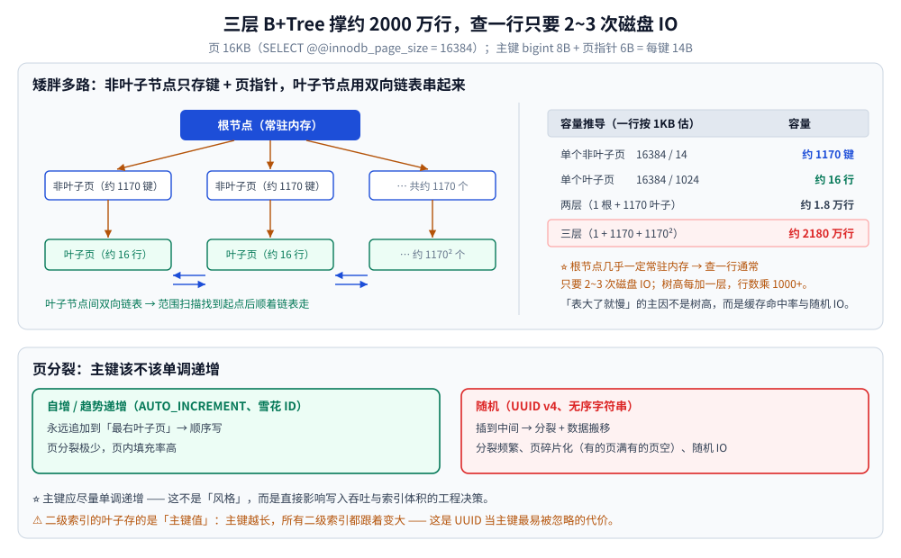
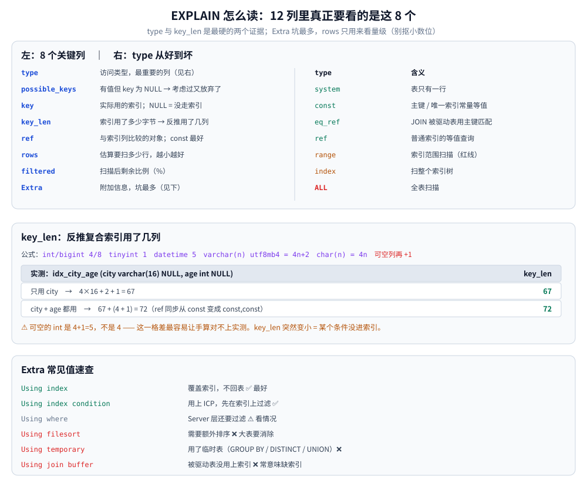
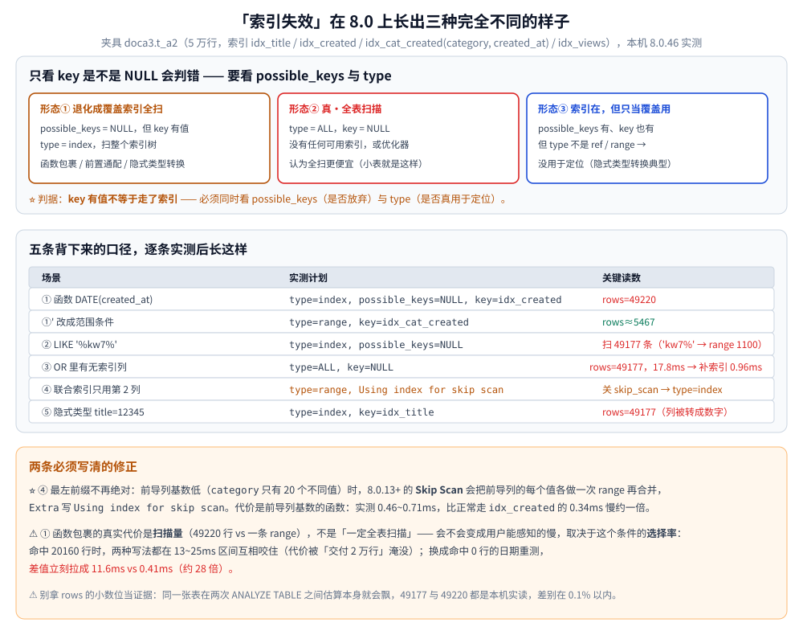

# 索引设计与 EXPLAIN

> B+Tree 为什么被选中、索引有哪些分类、选择性与三星索引、覆盖索引与 ICP、前缀索引、
> `EXPLAIN` 每一列怎么读、哪些写法会让索引失效，以及 8.0 给索引带来的新能力。
>
> 内容整理自个人学习笔记，素材来源：《高性能 MySQL》（第 4 版）第 7 章「创建高性能的索引」、
> 第 8 章「查询性能优化」相关小节的读后整理，**按主题归纳而非逐字摘录**，
> 参数与行为以 InnoDB（MySQL 5.7 / 8.0）为准；参考资料与原始素材见 [素材清单](../../../../素材清单.md)。
>
> ✅ **实测口径**：索引失效场景、`EXPLAIN` 计划与耗时对照，来自本机 Docker Desktop 的 `mysql:8.0`
> 隔离实例（容器 `docs-verify-mysql`、端口 13306、**8.0.46**）；夹具 `doca3.t_a2`（5 万行，
> `idx_title` / `idx_created` / `idx_cat_created(category, created_at)` / `idx_views`）。
>
> ⚠️ **本篇的边界**：「在索引已建好的前提下把一条 SQL 改快」见 [查询优化.md](查询优化.md)；
> 深分页见 [深分页与索引变更.md](深分页与索引变更.md)。

---

## 一、B+Tree：为什么是它

### 1.1 四个候选结构的淘汰过程

| 结构 | 等值查询 | 范围查询 | 排序 | 淘汰原因 |
| --- | --- | --- | --- | --- |
| 哈希表 | O(1) | ❌ 不支持 | ❌ | 范围查询要全扫 |
| 有序数组 | O(log n) | ✅ | ✅ | **插入要移动元素**，写代价不可接受 |
| 跳表 / 平衡树 | O(log n) | ✅ | ✅ | 二叉树**树太高**，每层一次磁盘 IO |
| **B+Tree** | O(log n) | ✅ | ✅ | ✅ 多路 + 矮胖 → IO 次数少 |

**核心矛盾**：磁盘 IO 以「页」为单位（实测 `SELECT @@innodb_page_size` → `16384`，
所以"一次 IO 能带出多少有效数据"决定了树高，树高决定了查询要几次 IO。

B+Tree 的两个关键设计正好对着这一点：

1. **非叶子节点只存键 + 页指针**（不存数据行）→ 一页能装下上千个键 → 树更矮；
2. **叶子节点用双向链表串起来** → 范围扫描只要找到起点再顺着链表走。

### 1.2 三层 B+Tree 能放多少行

按主键 `bigint`（8 字节）+ 页指针（6 字节）= 每键 14 字节粗算：

| 层 | 计算 | 容量 |
| --- | --- | --- |
| 单个非叶子页 | `16384 / 14` | 约 **1170** 个键 |
| 单个叶子页（假设一行 1KB） | `16384 / 1024` | 约 **16** 行 |
| 两层（1 个根 + 1170 个叶子） | `1170 × 16` | 约 **1.8 万**行 |
| **三层**（1 + 1170 + 1170²） | `1170² × 16` | 约 **2180 万**行 |

⭐ 这就是"**三层 B+Tree 能撑约 2000 万行**"这个常见数字的来源。
而且**根节点几乎一定常驻内存**（第一次查询后就缓存住），所以：

> 查一行数据通常只需要 **2~3 次磁盘 IO** —— 而树高每加一层，行数会乘 1000 以上。
> 换句话说：**千万级和亿级表的查询深度差别不大**，"表大了就慢"的主因不是树高，而是缓存命中率与随机 IO。

### 1.3 页分裂：自增主键 vs UUID

叶子页装满后插入新键，会触发**页分裂**（把一页拆成两页，并移动部分数据）：

| 插入模式 | 行为 | 代价 |
| --- | --- | --- |
| **自增 / 趋势递增**（`AUTO_INCREMENT`、雪花 ID） | 永远追加到**最右叶子页**，顺序写 | 页分裂极少，页内填充率高 |
| **随机**（UUID v4、无序字符串） | 插到中间，触发分裂 + 数据搬移 | 分裂频繁、**页碎片化**（有的页满、有的页空）、随机 IO |

**结论**：主键应尽量单调递增。这不是"风格"，而是**直接影响写入吞吐与索引体积**的工程决策。

⚠️ 顺带一条：**二级索引的叶子节点存的是主键值**（不是行地址）。所以主键越长，**所有二级索引都跟着变大** ——
这是"用 UUID 当主键"最容易被忽略的代价：不仅主键索引大，每个二级索引也都更大。



## 二、索引是什么？有哪些分类？什么时候该用 / 不该用索引？

**本节要点**：索引的**系统化认知** —— 本质是空间换时间，分类有六个维度，
"该不该建"取决于读写比例而不取决于表大不大。

**本节要点**：索引的**系统化认知**。信息量大，能完整说清"六种分类"的人不多。

### 2.1 索引的本质：空间换时间

**生活类比**（用类比比用定义更好懂）：
- **查字典**：按拼音查、按偏旁部首查——这就是字典的两种索引。
  **如果把索引部分撕掉，就只能一页页翻**，这就是**全表扫描**；
- **收货地址**：省 → 市 → 县 → 街道 → 门牌，逐级缩小范围，这就是索引的过程。

**目的**：**快速定位到需要的数据，加快查询效率。**

**代价（必须主动讲）**：

> 索引**本身也是数据**，需要单独维护。创建索引要**消耗存储空间**，
> 数据的增删改也会**触发索引维护、消耗性能**。
> **索引是用写入性能换查询性能**——写多读少的表要慎重建索引。

### 2.2 六种分类

#### ① 按数据结构分

| 类型 | 说明 |
|---|---|
| **B+ 树索引** | **最常用**。主键索引、唯一索引、普通索引都基于 B+ 树。<br>支持**等值、范围、前缀匹配**（`LIKE 'abc%'`），也能用于排序分组 |
| **哈希索引** | key → value 结构。**Memory 引擎**支持显式创建；<br>**InnoDB 有"自适应哈希索引"**：自动为**热点数据**维护哈希结构，加速等值查询。<br>⚠️ **局限：只支持等值比较（`=`），不支持范围查询** |
| **全文索引** | 类 ES 的思路：**把文本切分成单词**，建立"单词 → 文档 ID 列表"的倒排映射。<br>查询时按单词找文档 ID，再按业务需求**取交集或并集**；还能算相关性排序 |
| **空间索引** | 处理**地理坐标/几何数据**。典型场景：电子围栏、**判断共享单车是否停在指定区域内**、计算两点距离 |

#### ② 按字段数量分

- **单列索引**；
- **复合索引（联合索引）** —— ⚠️ 必须遵循**最左匹配原则**：
  只有当**最左列出现在查询条件中**（且位于条件最左侧）时，索引才能被用上。

#### ③ 按约束条件分

| 类型 | 约束 | 每表数量 |
|---|---|---|
| **普通索引** | 无任何约束 | 多个 |
| **唯一索引** | 值必须唯一，**但允许为 NULL** | 多个 |
| **主键索引** | **非空 + 唯一**，用于标识一行数据 | **只能有一个** |
| **外键索引** | 保证表间**引用完整性** | — |

> **实战经验**：工作中**经常不实际创建外键索引**，只在**约定层面**保证关联关系。
> 因为外键对写入操作的要求更高（额外的校验开销、级联操作限制），
> 在互联网高并发场景下通常由**应用层保证一致性**。

#### ④ 按存储方式分（**回表概念就出自这里**）

| 类型 | 特点 | 是否回表 |
|---|---|---|
| **聚簇索引（主键索引）** | **叶子节点直接存放完整的行数据** | 通过主键查询**不需要回表** |
| **非聚簇索引（二级索引）** | 叶子节点只存**索引列 + 主键值**，不含完整行数据 | **需要二次查询**（回表）才能拿到完整数据 |

**什么是回表**：

> 通过二级索引查找数据时，**索引的叶子节点不包含查询需要的字段**，
> 只能先拿到主键，**再回到聚簇索引（表）里取一次数据**——这一步就叫**回表**。
>
> 这也是二级索引"要做两次查找才能拿到完整数据"的原因。

#### ⑤ 按功能分

- **前缀索引**：对长字段只取前 N 个字符建索引；
- **覆盖索引（避免回表的核心手段）**：

  ```sql
  -- 已有 email 单列索引
  SELECT email FROM users WHERE email = 'a@b.com';        -- ✅ 不回表（email 就在索引里）

  -- 现在还要查 department
  SELECT email, department FROM users WHERE email = 'a@b.com';  -- ❌ 需回表取 department

  -- 解法：建联合索引 (email, department) → 变成覆盖索引
  CREATE INDEX idx_email_dept ON users(email, department);
  SELECT email, department FROM users WHERE email = 'a@b.com';  -- ✅ 不回表
  ```

  **覆盖索引 = 索引本身包含了查询需要的所有字段** → 不需要回表 → **显著提升查询性能**。

- **函数索引**：把**函数计算后的值**作为索引。
  例：字段本身区分大小写，但业务上希望**统一按小写查找** →
  对 `LOWER(name)` 建索引，查询 `WHERE LOWER(name) = 'abc'` 就能用上索引。

#### ⑥ 按可见性分

- **可见索引**（默认）：会被优化器选中；
- **不可见索引**：**索引仍然维护**，但优化器**不选择它**，可随时切换为可见。

**应用场景**：
1. **测试某个索引对性能的实际影响**——想评估"维护这个索引的写入代价有多少"，
   就先建为不可见，观察一段时间；
2. **临时禁用**某个索引（不改代码即可回退）；
3. 索引重建、灰度验证等。

### 2.3 什么时候该用 / 不该用索引

**适合建索引的列**：

| 条件 | 原因 |
|---|---|
| ① **经常用于查询条件** | 最核心的收益来源。不常查的列建索引基本没意义 |
| ② **经常用于表连接** | JOIN 的关联列是索引的高价值场景 |
| ③ **经常用于排序、分组** | 可避免 `Using filesort` / `Using temporary` |
| ④ **有约束需求的列** | 唯一性、主键约束 |

**不适合建索引的情况**：

| 情况 | 原因 |
|---|---|
| ① **数据量很小的表** | **全表扫描可能比走索引更快**（索引本身也要读一次） |
| ② **列基数低**（大量重复值） | 最典型的反例是**性别**。如果男女各占一半，走索引相当于**把"全表扫描"变成"半表扫描"**，付出索引维护成本却几乎没收益 |
| ③ **频繁更新的列** | 每次更新都要**维护索引**，写入开销被放大 |
| ④ **查询中经常被函数/表达式包裹的列** | 索引会失效（可考虑建**函数索引**补救） |

**一个极端的反例**：

> 10 万行数据**内容完全一样**、且没有主键，查询性能极慢。
> 因为索引的意义建立在"**不同行的字段值有区分度**"之上——
> **如果所有值都一样，索引有和没有完全没区别**。
>
> **结论：索引列的基数（区分度）必须足够高。**

---

## 三、索引的选择性（Cardinality）

### 3.1 怎么算

**选择性 = 不重复值的数量 / 总行数**，越接近 `1` 越好（越接近 `0` 越像布尔列，索引收益越低）。

```sql
-- 从高到低看哪些列值得建索引（列名以本机 orders 夹具为准）
SELECT
    COUNT(DISTINCT customer_id) / COUNT(*) AS sel_customer_id,
    COUNT(DISTINCT status)      / COUNT(*) AS sel_status,
    COUNT(DISTINCT created_at)  / COUNT(*) AS sel_created_at,
    COUNT(*)                              AS total
FROM orders;
```

实测（`orders` 2500 行）：

```text
+-----------------+------------+----------------+-------+
| sel_customer_id | sel_status | sel_created_at | total |
+-----------------+------------+----------------+-------+
|          0.0012 |     0.0016 |         1.0000 |  2500 |
+-----------------+------------+----------------+-------+
```

`customer_id` 只有 3 个不同值（2500 行订单里挑 3 个客户）、`status` 只有 4 个 —— 这两列**单建索引都没意义**；
`created_at` 选择性 1.0，但真正决定它值不值得建索引的是查询里有没有它的**范围条件**。

| 结果 | 判断 |
| --- | --- |
| 接近 1（如 0.98） | 适合做索引（甚至唯一索引） |
| 中间（0.1 ~ 0.5） | 看查询模式，常作为复合索引的一列 |
| 接近 0（如 0.002，如"性别"） | 单列索引基本没用，优化器会直接忽略 → 应放进复合索引的**后续位置**或干脆不建 |

### 3.2 `Cardinality` 是估算值，不是精确值

`SHOW INDEX FROM t` 里的 `Cardinality` 列**不是实时精确统计**，而是采样估算：

| 参数 | 含义 |
| --- | --- |
| `innodb_stats_persistent` | 是否把统计信息持久化到磁盘（默认 ON，避免重启后重新采样） |
| `innodb_stats_persistent_sample_pages` | 每次采样多少页（默认 **20**） |
| `innodb_stats_auto_recalc` | 数据变化超过 10% 时是否自动重新统计 |

实测（`SELECT @@...`，同一会话）：

```text
innodb_page_size                      16384
innodb_stats_persistent               ON
innodb_stats_persistent_sample_pages  20
innodb_stats_transient_sample_pages   8
innodb_stats_auto_recalc              ON
```

再拿同一批数据对一遍：`SHOW INDEX FROM orders` 给出的 `Cardinality` 与真实值恰好一致 —— 
`idx_customer` 是 3、`idx_desc` 的第 1 列是 4、第 2 列是 2500，
而 `SELECT COUNT(DISTINCT ...) ` 实测也是 `d_status=4 / d_customer=3 / c=2500`。

⚠️ **这不能当成"估算很准"的证据**：2500 行只有几页，采样 20 页等于全采。
真正会失真的是千万级 + 分布倾斜的表，本机量不出来（口径与 [查询优化.md](查询优化.md) 第 2.2 节一致）。

**后果**：统计信息可能明显偏离真实分布 → 优化器**选错索引**。表现为"SQL 昨天还好好的，今天突然走错索引了"。

**对策**：数据分布变化大时手动 `ANALYZE TABLE t;`（注意它会**隐式提交事务**，见 [事务与隔离级别.md](事务与隔离级别.md)），
或者用 `FORCE INDEX` 兜底（但那是止痛药，不是治本）。

### 3.3 复合索引的列顺序：三种判据，不是"选择性高的放前面"

书里的经典建议是"选择性最高的列放最左"，但**实际工程里这条建议经常是错的**。正确的判据按优先级排：

| 优先级 | 判据 | 例子 |
| --- | --- | --- |
| **① 最左列必须是高频等值条件** | 最左列没用上，整个索引就不可用（最左前缀） | `WHERE city = ? AND age > ?` → `(city, age)` |
| **② 等值条件在前，范围条件在后** | **范围列之后的列无法用于查找和排序** | `(city, age)` 好过 `(age, city)` |
| **③ 排序 / 分组列紧跟等值列** | 让 `ORDER BY` 也能用上索引（少一次 filesort） | `WHERE city = ? ORDER BY age` → `(city, age)` |
| ④ 最后才看选择性 | 上面三条相同时，选择性高的放前面 | 两列都是等值条件时的微调 |

⭐ **②③ 两条比选择性重要得多**，因为它们决定"这个索引能不能用"，而选择性只影响"用得好不好"。

⚠️ **一个反直觉的结论**：`WHERE a = ? AND b = ?` 这种"全是等值条件"的查询，
**列顺序对性能影响很小**（两个方向都能用上），但把**更常被单独查询**的那一列放前面，
能让这个索引顺带服务其它 SQL（复用）。这才是列顺序的真实取舍。

## 四、三星索引：一把衡量索引质量的尺子

来自 Lahdenmäki 与 Petrunia 的"三星索引"理论，**用一个查询能拿几颗星，快速判断索引还能不能更好**：

| 星 | 条件 | 收益 |
| --- | --- | --- |
| ⭐ **一星** | `WHERE` 的**等值条件**列都在索引里，且构成索引前缀 | 定位是"找一段"，不是"扫一片" |
| ⭐⭐ **二星** | `ORDER BY` 的列顺序与索引一致（方向也一致） | **消除 filesort** |
| ⭐⭐⭐ **三星** | `SELECT` 的列都在索引里（覆盖索引） | **消除回表** |

**例子**：

```sql
SELECT name, age FROM users WHERE city = 'BJ' ORDER BY age;
```

| 索引 | 得星 | 说明 |
| --- | --- | --- |
| `(city)` | ⭐ | 只能定位，还排序还回表 |
| `(city, age)` | ⭐⭐ | 排序用上索引了，但 `name` 还要回表 |
| **`(city, age, name)`** | ⭐⭐⭐ | 等值 + 排序 + 覆盖，全中 |

### 4.1 三星之间的冲突

三星**经常不可兼得**，这是设计的现实：

| 冲突 | 说明 |
| --- | --- |
| **范围条件会"截断"后续列** | `WHERE city = ? AND age > ? ORDER BY name` —— `age` 是范围，`name` 就既不能用于查找也不能用于排序。要二星得用 `(city, name, age)`（把排序列提前），要一星得用 `(city, age, name)`。**只能选一个** |
| **排序方向不一致** | `ORDER BY a ASC, b DESC` 在 8.0 之前无法用普通索引满足（8.0 支持降序索引 `INDEX (a ASC, b DESC)`） |
| **多个查询共用索引** | 索引数量要控制，三星索引往往只对**最重要的那条查询**成立 |
| **写放大** | 索引列越多、越宽，写入维护成本越高（每多一个索引，写入就要多维护一棵 B+Tree） |

**实践判据**：**先保一星（能用），再争取二星（不排序），三星看查询频次决定值不值得**。
低频的报表查询为了三星牺牲写入性能，通常不划算。

### 4.2 索引数量的上限

| 参考 | 说明 |
| --- | --- |
| 单表索引一般不超过 **5~6 个** | 每个索引都会拖慢写；`ALTER TABLE` 时间也随索引数增长 |
| 用不到的索引要删 | 先看 `sys.schema_unused_indexes`（8.0）或 `performance_schema` 的索引使用统计 |
| 重复索引要合并 | `(a)` 与 `(a, b)` 同时存在时，**前者是后者的前缀，可以删** |

## 五、覆盖索引与索引条件下推（ICP）

### 5.1 覆盖索引：不回表

**如果查询需要的列全在索引里，就不必回表**（"回表"= 拿主键再去聚簇索引取整行，一次随机 IO）。

```sql
-- 索引 idx_city_age_name (city, age, name)
SELECT age, name FROM users WHERE city = 'BJ';   -- 需要的列都在索引里 → Using index
SELECT id, city FROM users WHERE city = 'BJ';    -- 缺 name → 必须回表
```

实测（`users` 4 行，`city = 'BJ'` 命中 3 行）：

```text
EXPLAIN SELECT age, name FROM users WHERE city = 'BJ';
  type: ref   key: idx_city_age_name   key_len: 67   rows: 3   Extra: Using index
EXPLAIN SELECT * FROM users WHERE city = 'BJ';
  type: ref   key: idx_city_age_name   key_len: 67   rows: 3   Extra: Using index    ← 仍是 Using index
```

⚠️ 第二条是**反直觉的实测结果**：这里 `SELECT *` 也用不上回表，因为 `users` 只有 `id / city / age / name` 四列，
`idx_city_age_name` 的三个列 **加上叶子节点里的主键 `id`** 正好把整行包完了。
所以判据不是"有没有写 `*`"，而是"**`*` 展开后的列是否都在这棵索引里**"。

⚠️ 但结论仍然成立：**`SELECT *` 是覆盖索引的天敌** —— 表一加列（`orders` 就有 `note`、`amount` 这类不在索引里的列），
`*` 立刻让覆盖失效。**少写几个列名，可能直接把一次随机 IO 省掉**。

### 5.2 ICP：把过滤下推到引擎层（5.6+）

没有 ICP 时，流程是"**引擎按索引取出行 → 回表 → Server 层再用 WHERE 过滤**"，
被过滤掉的那些行**白回表了**。

有了 ICP（`index_condition_pushdown`），**能用索引列判断的条件会被下推到存储引擎**，
在索引上先过滤，只对通过的行回表。

```sql
-- 索引 (city, age, name)（注意 name 在索引里，但没有用于查找）
SELECT * FROM users WHERE city = 'BJ' AND name LIKE '张%';
```

| Extra | 含义 |
| --- | --- |
| `Using index` | 完全覆盖，不回表（最好） |
| **`Using index condition`** | 用上了 ICP：先在索引上过滤，再对通过的行回表 |
| `Using where` | Server 层过滤（可能是回表后才发现不满足） |
| `Using index; Using where` | 覆盖索引 + 还有条件在 Server 层判断 |

实测三行对比（`orders` 的 `idx_desc (status, created_at)`，`note` 不在索引里）：

```sql
EXPLAIN SELECT note FROM orders WHERE status = 1 AND created_at > '2026-01-01 00:00:00';
EXPLAIN SELECT id   FROM orders WHERE status > 1 AND created_at = '2026-01-01 00:00:00';
EXPLAIN SELECT *    FROM orders WHERE status > 1 AND created_at = '2026-01-01 00:00:00';
```

```text
行  SELECT 列   条件形态              type    key       key_len  rows    Extra
1   note       status=1 + 范围        range   idx_desc        6    625  Using index condition
2   id         status>1 + 等值        range   idx_desc        1   1250  Using where; Using index
3   *          status>1 + 等值        ALL     NULL         NULL  2500  Using where
```

三条要分开读：

- **第 1 行 `key_len = 6`**（`tinyint` 1 + `datetime` 5）→ 两列都进了范围查找，`created_at` 的判断在引擎侧完成，这就是 `Using index condition`；
- **第 2 行 `key_len = 1`** → 只有 `status` 参与查找，`created_at` 要等取到行再判，所以显示的是 `Using where`（这条本身是覆盖索引，代价不大）；
- 第 3 行要回表取 `note`，而 `status > 1` 又命中大半表 → 优化器直接放弃索引走 `ALL`。这正是 [查询优化.md](查询优化.md) 第 2.3 节说的"全表扫描不一定是错的"。

⚠️ 上面那句 `SELECT * FROM users WHERE city = 'BJ' AND name LIKE '张%'` **实测不显示 ICP**（本机夹具没有中文姓名，用同形态的 `name LIKE 'B%'` 测得 `Extra: Using where; Using index`、`filtered: 25.00`）：`users` 四列全被索引覆盖，**根本没有回表可省**，下推自然没有收益。
**ICP 只在"要回表"的查询上才体现价值** —— 想验证它，得换一张有非索引列的表。

⚠️ 还有一条**与直觉不符的实测**要记下：`FORCE INDEX (idx_customer)` + `WHERE customer_id > 100 AND status = 1` 得到的是 `Using index condition; Using where`，而 `status` **根本不在 `idx_customer` 里**。我没找到能严格解释这一现象的官方口径，所以只作事实登记：**判断"第几列进了查找"仍以 `key_len` 与 `rows` 为准，不要只看 `Extra`**。

⚠️ **ICP 不生效的常见情形**：条件里用了**函数或表达式**（`WHERE YEAR(created_at) = 2026`）、
条件列不在索引里、或者优化器判断下推不划算。

## 六、前缀索引：长字符串列的折中

对 `varchar(255)`、URL、邮箱这类列，整列做索引太宽（**索引越大，一页装得越少，树越高**）。
做法是只索引前 n 个字符：

```sql
-- 1) 找一个够用的长度：让前缀的选择性接近整列
SELECT
    COUNT(DISTINCT LEFT(email, 6))  / COUNT(*) AS sel_6,
    COUNT(DISTINCT LEFT(email, 8))  / COUNT(*) AS sel_8,
    COUNT(DISTINCT LEFT(email, 10)) / COUNT(*) AS sel_10,
    COUNT(DISTINCT email)           / COUNT(*) AS sel_full
FROM users;

-- 2) 取"选择性已足够接近全列"的最小长度
ALTER TABLE users ADD INDEX idx_email_prefix (email(10));
```

实测（`url_t` 5 行、`url varchar(255) NOT NULL`、`KEY idx_url10 (url(10))`）：

```text
+--------+--------+----------+-------+
| sel_3  | sel_10 | sel_full | total |
+--------+--------+----------+-------+
| 0.2000 | 0.6000 |   1.0000 |     5 |
+--------+--------+----------+-------+

SHOW INDEX FROM url_t  →  idx_url10:  Sub_part = 10   Cardinality = 3
```

`Sub_part` 这一列就是前缀长度 —— `SHOW INDEX` 里能直接确认索引建成了多长（不填就是 `NULL`，代表整列）。
5 行小表只能说明"公式怎么用"，不能用来选长度：真实表上要拉到几万行再比 `sel_10` 与 `sel_full`。

```sql
EXPLAIN SELECT url FROM url_t WHERE url LIKE 'https://a%';
EXPLAIN SELECT id  FROM url_t WHERE url LIKE 'https://a%';
EXPLAIN SELECT id  FROM url_t ORDER BY url;
```

```text
SELECT url ... LIKE   range / idx_url10 / key_len 42 / Extra: Using where
SELECT id  ... LIKE   range / idx_url10 / key_len 42 / Extra: Using where; Using index
SELECT id  ORDER BY   ALL   / NULL      / key_len NULL / possible_keys: NULL / Extra: Using filesort
```

三行正好对上下面表里的三条限制：

- 取 `url` 原列 → 前缀不够长，**必须回表核对完整值**，所以只有 `Using where`；
- 取 `id` → 主键就在索引叶子上，**仍然算覆盖**（多出 `Using index`）；
- `ORDER BY url` → 前缀顺序 ≠ 完整值顺序，索引**连考虑都不被考虑**（`possible_keys: NULL`），退化成全扫 + filesort。

**前缀索引的四条限制**（这也是它只能算折中的原因）：

| 限制 | 说明 |
| --- | --- |
| **不能覆盖"完整列值"** | 索引里只有前 n 个字符，要返回原列就必须回表；但索引里已有的列（含主键）仍然算覆盖 |
| **不能用于 `ORDER BY` / `GROUP BY`** | 前缀顺序 ≠ 完整值顺序（实测退化成 `ALL` + `Using filesort`） |
| **无法做精确等值匹配的"索引内判断"** | 引擎还得回表核对完整值 |
| 长度选择要随数据分布变化重新评估 | 邮箱长度分布变了，原来选的 10 可能不够 |

## 七、EXPLAIN 每一列都看什么

这是"索引设计"的验收工具。`EXPLAIN` 输出 12 列，**真正要逐列读的是这 8 个**：

| 列 | 看什么 | 好 / 坏 |
| --- | --- | --- |
| **`type`** | 访问类型，**最重要的列** | 见下方排序 |
| `possible_keys` | 优化器考虑过哪些索引 | 有值但 `key` 为 NULL → **考虑过但放弃了**（通常是成本估算） |
| `key` | 实际用了哪个索引 | `NULL` = 没走索引 |
| **`key_len`** | 索引用了**多少字节** → 反推用了几列 | 复合索引只看长度，能判断"用没用到第 2 列" |
| `ref` | 与索引列比较的对象（常量 / 列 / 函数） | `const` 最好 |
| **`rows`** | 估算**要扫多少行** | 越小越好 |
| **`filtered`** | 扫描后剩余比例（百分比） | `rows × filtered%` ≈ 实际参与后续处理的行数 |
| **`Extra`** | 附加信息，**坑最多** | 见下方表 |

### 7.1 `type` 从好到坏

```text
system > const > eq_ref > ref > range > index > ALL
```

| type | 含义 | 出现场景 |
| --- | --- | --- |
| `system` | 表只有一行 | 系统表 |
| `const` | 主键/唯一索引的**常量等值**查询 | `WHERE id = 1` |
| `eq_ref` | JOIN 时被驱动表用主键/唯一索引匹配 | 多表 JOIN |
| **`ref`** | 普通索引的等值查询 | `WHERE city = 'BJ'` |
| **`range`** | 索引范围扫描 | `WHERE id > 100`、`BETWEEN`、`IN` |
| `index` | **扫整个索引树**（不是查表，但也不是定位） | 覆盖索引全扫，比 ALL 好一点 |
| **`ALL`** | 全表扫描 | 没有可用索引，或优化器认为全扫更便宜 |

**实践红线**：**至少要 `range`**。看到 `ALL`（大表）或 `index`（非覆盖场合）就要停下来查原因。
⚠️ 但要注意：**小表全扫往往比走索引更快**（随机 IO 的开销 > 顺序扫描）——
优化器选 `ALL` 不一定是错，要看 `rows`（如果 `rows` 只有几十行，就是对的）。

### 7.2 `key_len`：反推复合索引用了几列

`key_len` 是"实际用于查找的索引字节数"，**能看出复合索引有没有被完整利用**：

| 类型 | 字节数 |
| --- | --- |
| `int` / `bigint` | 4 / 8 字节 |
| `tinyint` | 1 字节 |
| `datetime` | 5 字节（小数秒位数为 0 时） |
| `varchar(n)`（utf8mb4） | `4n + 2`（变长需额外 2 字节存长度） |
| `char(n)`（utf8mb4） | `4n`（定长） |
| **可空列** | **额外 +1 字节**（存 NULL 标记） |

**例子**：本机 `users` 的 `idx_city_age (city varchar(16) NULL, age int NULL)` —— 两列都可空，各要再 +1

| 实际用到 | key_len | 推导 / 状态 |
| --- | --- | --- |
| 只用 `city` | **67** | `4×16 + 2 + 1 = 67`，实测 ✅ |
| `city` + `age` 都用 | **72** | `67 + (4 + 1) = 72`，实测 ✅（`ref` 同步从 `const` 变成 `const,const`） |

⚠️ **可空的 `int` 是 4+1=5，不是 4** —— 这一格差最容易让手算对不上实测。

另外三条实测，用来交叉验证公式：

| 索引 | 列定义 | key_len | 拆解 |
| --- | --- | --- | --- |
| `conv.idx_phone` | `varchar(20)` 可空 | **83** | `4×20 + 2 + 1` |
| `url_t.idx_url10` | `url(10)` 前缀、NOT NULL | **42** | `4×10 + 2`（前缀索引按 `Sub_part` 算，不按列定义长度） |
| `orders.idx_desc` | `tinyint` + `datetime`、都 NOT NULL | **6** | `1 + 5` |
| `customers.idx_tags` | JSON 数组的多值索引 | **83** | 见下面 8.2 节的多值索引实测 |

⭐ **高频**：`key_len` 突然变小，说明**某个条件没进索引**（常见原因是类型不匹配、或条件是范围条件导致后续列失效）。上面 4.2 节的第 2 行就是活例子：`key_len` 从 6 掉到 1，等于直接告诉你"`created_at` 没参与查找"。

### 7.3 `Extra` 常见值速查

| Extra | 含义 | 好 / 坏 |
| --- | --- | --- |
| `Using index` | 覆盖索引，不回表 | ✅ 最好 |
| `Using index condition` | 用上 ICP，先在索引上过滤 | ✅ 好 |
| `Using where` | Server 层还要过滤 | ⚠️ 看情况 |
| **`Using filesort`** | **需要额外排序**（没用上索引顺序） | ❌ 大表上要消除（见 [查询优化.md](查询优化.md)） |
| **`Using temporary`** | **用了临时表**（常见于 `GROUP BY`、`DISTINCT`、`UNION`） | ❌ 大表上要消除 |
| `Using join buffer (Block Nested Loop)` | JOIN 用了块嵌套循环，被驱动表**没用上索引** | ❌ 常意味缺索引 |
| `Using MRR` | 多范围读，把随机 IO 变顺序 IO | ✅ 好 |
| `Impossible WHERE` | 条件恒假，直接返回空 | ℹ️ 无害 |
| `Select tables optimized away` | 只从索引就得到结果（如 `MIN/MAX` 用索引） | ✅ 最好 |

本机能真跑出来的 `Extra` 原文（逐个实测，可直接对照）：

```text
Using index                          覆盖索引（4.1）
Using index; Using filesort          覆盖但排序用不上索引顺序（使用节 ④）
Using where; Using index             覆盖 + Server 层还要过滤（4.2 第 2 行）
Using index condition                用上了 ICP（4.2 第 1 行）
Using index condition; Using where   ICP 与 Server 层过滤同时存在
Backward index scan; Using index     降序索引反向扫（8.3）
Using index for skip scan            非最左列的范围被 Skip Scan 救回
```

⚠️ `Using MRR` 这一行**本机没测出来**：MRR 要 `optimizer_switch=mrr_enabled=on` 且命中特定访问路径，上面这套小表夹具触发不了，所以它仍只是"速查表里的一项"。



## 八、哪些写法会让索引失效？

**本节要点**：**背下来的四条口径，在本机 5 万行表上跑 `EXPLAIN` 后要修正** ——
8.0 的优化器会让"失效"长成三种完全不同的样子，看 `possible_keys` 与 `type` 才能分辨。

### 8.1 没建索引，和建了却用不上

**A1. 根本没有索引 / 没有对应的索引字段**
→ 按实际查询条件建索引：条件固定的多字段查询建**联合索引**，否则建**单列索引**。

**A2. 有索引但"索引失效"**（逐条都要能举例）

| 失效场景 | 说明 | 正确写法 |
|---|---|---|
| **索引列上使用函数** | `WHERE DATE(created_at) = '2026-01-01'` | 改成范围条件 `created_at >= '2026-01-01' AND created_at < '2026-01-02'` |
| **`OR` 连接了无索引的字段** | 只要有一个条件没索引，整个查询可能放弃索引 | 给所有 `OR` 分支字段建索引，或拆成两次查询 `UNION` |
| **`LIKE` 以 `%` 开头** | `LIKE '%abc'` 无法利用 B+ 树有序性 | 把 `%` 放到后面：`LIKE 'abc%'` |
| **联合索引未遵循最左前缀** | 索引 `(a,b,c)`，查询只用 `b` / `c` | 补齐最左列，或按查询模式重建索引 |

这四条是背下来的口径，本机在 5 万行的 `doca3.t_a2` 上逐条跑了 `EXPLAIN`，
**方向都对，但 8.0 的优化器会让"失效"长成三种不同样子**：

| 场景 | 实测计划 | 关键读数 |
|---|---|---|
| 索引列上套函数 `DATE(created_at)='2026-01-02'` | `type=index`，`possible_keys=NULL`，`key=idx_created` | 函数让索引**不能用于定位**，但因为只 `SELECT id`（二级索引隐式含主键）而退化成**覆盖索引全扫**，`rows=49220` |
| 同上改成范围条件 | `type=range`，`key=idx_cat_created` | `rows` 估到 5467，`Extra` 是 `Using index for skip scan` |
| `LIKE '%kw7%'`（`title` 上**有**索引） | `type=index`，`possible_keys=NULL` | 扫 `idx_title` 全部 49177 条；`LIKE 'kw7%'` 则是 `type=range`、`rows=1100` |
| `OR` 里有无索引列（`views` 无索引） | `type=ALL`，`key=NULL`，`rows=49177` | 给 `views` 补索引后变 `type=index_merge`、`rows=52` |
| 联合索引 `(category, created_at)` 只用 `created_at` | `type=range` + **`Using index for skip scan`** | 见下面的第 ④ 条，**这条口径在 8.0 要改** |

实测原文（节选，函数版与范围版在同一时刻各测两轮）：

```text
# ① 函数包裹：possible_keys 直接是 NULL，但 key 仍被当覆盖索引用
| type: index | possible_keys: NULL | key: idx_created | rows: 49220 | Extra: Using where; Using index
# 同一句改成 SELECT *（要回表）就退成真正的全文档扫描
| type: ALL   | possible_keys: NULL | key: NULL        | rows: 49220 | Extra: Using where

# 服务端耗时（SHOW PROFILES，命中 20160 行）
|        1 | 0.01806175 | SELECT id FROM t_a2 WHERE DATE(created_at)='2026-01-02'
|        2 | 0.01653175 | SELECT id FROM t_a2 WHERE created_at>='2026-01-02 00:00:00' AND ...
|        3 | 0.02533750 | SELECT id FROM t_a2 WHERE DATE(created_at)='2026-01-02'
|        4 | 0.01327050 | SELECT id FROM t_a2 WHERE created_at>='2026-01-02 00:00:00' AND ...
```

⚠️ **这一组的结论要写得比"函数导致全表扫描"更准**：两种写法**命中同样的 20160 行**，
耗时都在 13~25 ms 区间、互相咬住 —— 因为代价被"交付 2 万行"淹没了。
换成命中 0 行的日期重测，差值立刻拉成 **11.6 ms vs 0.41 ms（约 28 倍）**。
所以函数包裹的真实代价是**扫描量**（49220 行 vs 一条 range），
它会不会变成用户能感知的慢，取决于**这个条件的选择率**。

```text
# ② 前置通配（title 上有索引）：命中行相同，扫描量差 45 倍
LIKE '%kw7%'  → type=index, rows=49177   0.02093625 / 0.02103975 秒
LIKE 'kw7%'   → type=range, rows=1100    0.00089275 / 0.00090125 秒   ← 约 23 倍，两轮几乎不抖

# ③ OR：无索引分支拖垮整条语句
| type: ALL | possible_keys: idx_created | key: NULL | rows: 49177 | Extra: Using where      0.01782025 秒
# 给 views 补上索引之后（不必改写成 UNION）
| type: index_merge | key: idx_created,idx_views | rows: 52 | Extra: Using union(idx_created,idx_views); Using where
                                                                                              0.00096050 秒
# 改写成 UNION 也很快，但多一个去重的临时表
UNION     → 第一支 ref rows=1 + 第二支 ref rows=51 + UNION RESULT「Using temporary」   0.00055150 秒
UNION ALL → 同上但无 UNION RESULT 那一行                                              0.00037725 秒
```

**第 ③ 条口径要补一句**：只要**每个 `OR` 分支都有自己的索引**，8.0 会自己走
`index_merge`（`Using union(...)`），**不改成 `UNION` 也能拿到索引**；
实测三种形态的耗时是"不补索引 17.8 ms → 补索引 0.96 ms → `UNION` 0.55 ms → `UNION ALL` 0.38 ms"，
拆 `UNION` 只在**分支很多、想让每支都贴自己的最优路径**时才值得，
而且默认 `UNION` 还带一次临时表去重。

```text
# ④ 最左前缀：只留联合索引 idx_cat_created 可看（其余用 IGNORE INDEX 排除）
| type: range | key: idx_cat_created | rows: 3219 | Extra: Using where; Using index for skip scan
                                                                            0.00071275 / 0.00046450 秒
# 关掉 skip scan 之后同一条语句
| type: index | key: idx_cat_created | rows: 49177 | Extra: Using where; Using index
# 连联合索引也排除 → 这才是真的全表扫描
| type: ALL | possible_keys: NULL | key: NULL | rows: 49177 | Extra: Using where
# 同一句 created_at 查询不排除单列 idx_created 时，优化器直接走它（这才是 0.34 ms 那条）
                                                                            0.00034150 秒
# 补齐最左列（category、created_at 都给值）
| type: ref | key: idx_cat_created | key_len: 87 | ref: const,const | rows: 1 | Extra: Using index
```

**第 ④ 条是这四条里唯一在 8.0 被实测推翻的**："跳过最左列就用不上索引"不再是绝对结论 ——
`category` 只有 20 个不同值，优化器用 **Skip Scan**（8.0.13+，`optimizer_switch` 里的 `skip_scan` 默认 ON）
把前导列的每个不同值各做一次 range 再合并，`Extra` 写 `Using index for skip scan`。
它的代价是**前导列基数的函数**：实测 0.46~0.71 ms，比正常走 `idx_created` 的 0.34 ms 慢约一倍，
但远好于全表扫描；`SET optimizer_switch='skip_scan=off'` 之后同一条语句立刻退化成 `type=index` 扫 49177 行。
所以准确的说法是：**前导列基数低时 Skip Scan 能救，基数高时它自己会放弃**（本机只在 20 个不同值这一档验过，
更高基数**未实测**）。开关本身在这台 8.0.46 上是默认开的：`@@optimizer_switch` 里读到
`skip_scan=on`，`index_condition_pushdown=on` 同样是默认值。

```text
# ⑤ 顺手补一条 A2 表里没有、但线上更常见的失效：隐式类型转换
WHERE title = 12345          → type=index, key=idx_title, rows=49177（把列转成数字逐行比）
WHERE title = 'kw7-title-7'  → type=ref,   key=idx_title, rows=1
```

**⑤ 值得单独记**：`possible_keys` 里**有**索引、`key` 里也**用**了索引，但只当覆盖索引来扫 ——
判据是 `type` 不是 `ref`/`range`。字符串列接数字参数（驱动侧拼 `?` 时最容易犯）就是这么个失效法。

**读这几块原文时还要防一个噪音**：同一张表在两次 `ANALYZE TABLE` 之间，`rows` 估算值本身就会飘 ——
上面出现的 `49177` 与 `49220` 都是本机实读，不是抄错，差别在 0.1% 以内。
**所以别拿 `rows` 的小数位当证据**，它只能用来判断量级：第 ④ 条里 Skip Scan 估的是 3219 行，
而那个精确时间戳真实命中 0 行（`AR_a3` 的 `④ 命中行数`）。



## 九、设计一个索引的检查清单

按顺序过一遍，能覆盖绝大多数场景：

| # | 检查项 | 不合格的表现 |
| --- | --- | --- |
| 1 | `EXPLAIN` 的 `type` 至少 `range` | `ALL`（大表）、`index`（非覆盖） |
| 2 | `key` 不为 NULL，且 `possible_keys` 里没有更优的索引被放弃 | `key = NULL` |
| 3 | **最左列**是最高频的等值条件列 | 索引被"跳过" |
| 4 | **等值条件列都在范围条件列之前** | 范围列后面的列白写 |
| 5 | `ORDER BY` / `GROUP BY` 列紧跟等值列（争取二星） | `Using filesort` |
| 6 | `SELECT` 的列尽量落在索引里（三星，看查询频次决定） | 不必要的回表 |
| 7 | `rows` 足够小；`filtered` 不至于低得离谱 | 扫了很多行又丢掉 |
| 8 | 没有重复索引（`(a)` 与 `(a,b)` 并存）、没有无用索引 | 写放大 |
| 9 | 主键单调递增（避免随机插入的页分裂） | 页碎片、随机 IO |
| 10 | 统计信息是新的（必要时 `ANALYZE TABLE`） | 优化器选错索引 |

## 十、8.0 给索引加了什么新东西？

**来源**：《高性能 MySQL》（第 4 版）第 7 章「创建高性能的索引」中的「索引类型」「聚簇索引」「前缀索引和索引选择性」「优化 Order By」「索引与锁」相关小节，加上 8.0 的索引能力清单。

**本节要点**：前七节的判子在 5.7 和 8.0 上都成立，8.0 额外给了四件工具：
表达式索引、多值索引、降序索引、**不可见索引**。最后一件是"安全地删索引"的正规做法。

### 10.1 索引类型全家福

| 类型 | 能干什么 | 谁能用 |
| --- | --- | --- |
| `BTREE` | 等值、范围、排序、前缀匹配，默认就是它 | InnoDB / MyISAM / Memory |
| `HASH` | 只做等值（`=`、`<=>`），不能排序、不能范围 | 只有 Memory 引擎能真建成 HASH；**在 InnoDB 上写 `USING HASH` 不报错**，只是被静默换成 BTREE（实测见下）；自适应哈希索引是引擎内部结构，**不可指定**（参数见 [参数调优.md](参数调优.md)） |
| `FULLTEXT` | 全文检索，倒排索引 | InnoDB / MyISAM |
| `SPATIAL` | GIS 地理类型 | InnoDB / MyISAM；8.0.12 起不允许对它写 `ASC`/`DESC` |
| 多值索引 | 给 JSON 数组的**每个元素**建索引 | 8.0.17 起，仅 InnoDB |

`SHOW INDEX FROM t` 的 `Index_type` 列可以确认实际建成了哪一类。

实测两条"看起来会报错、其实不会"的行为：

```sql
-- ① InnoDB 上显式要求 HASH
CREATE TABLE hash_t (id int NOT NULL, k int NOT NULL, KEY h (k) USING HASH) ENGINE=InnoDB;
SHOW WARNINGS;
SHOW INDEX FROM hash_t;

-- ② 给 SPATIAL 索引列写排序方向
CREATE TABLE geo_t (id int NOT NULL, g GEOMETRY NOT NULL, SPATIAL KEY gg (g DESC));
```

```text
① SHOW WARNINGS:
  Level	Code	Message
  Note	3502	This storage engine does not support the HASH index algorithm, storage engine default was used instead.
① SHOW INDEX → hash_t / h / k / Index_type = BTREE   ← 建成功了，但不是 HASH
② ERROR 1221 (HY000) at line 5: Incorrect usage of spatial/fulltext/hash index and explicit index order
```

（② 原文里的 `at line 5` 是这条语句在整批脚本中的行号，逐条执行时会变成 `at line 1`。）

- ① 只有 **`Note` 级告警**（`SHOW WARNINGS` 才看得到，语句本身执行成功）→ **想靠报错发现写错引擎是不可能的，只能用 `Index_type` 列复核**；
- ② SPATIAL / FULLTEXT / HASH 上写 `ASC`/`DESC` 是**直接报错**（1221），这也是 8.1 表里那条"8.0.12 起不允许"的具体报错原文。

### 10.2 表达式索引与多值索引：把「函数让索引失效」变成可控项

```sql
-- 8.0.13 起：对表达式建索引（双括号是语法要求），本质是隐藏的虚拟生成列
CREATE INDEX idx_abs ON t ((ABS(col1)));

-- 8.0.17 起：JSON 数组的多值索引
CREATE INDEX idx_zip ON customers ((CAST(custinfo->'$.zipcode' AS UNSIGNED ARRAY)));
-- 优化器在 MEMBER OF() / JSON_CONTAINS() / JSON_OVERLAPS() 上会自动用它
```

实测：`amounts (id int, v decimal(10,2))` 上 `KEY idx_abs ((abs(v)))`，`v` 的四行值是 `-5.50 / 3.25 / -1.00 / 3.25`：

```text
WHERE ABS(v) = 3.25            ref / idx_abs / key_len 5 / ref: const / rows 2   ✅ 命中
WHERE ABS(v) = 5.50            ref / idx_abs / key_len 5 / ref: const / rows 1   ✅ 命中
WHERE ABS(v) = 1.0             ref / idx_abs / key_len 5 / ref: const / rows 1   ✅ 命中
WHERE ABS(v) = 1               ALL / key NULL             / rows 4 / Using where  ❌ 不走
WHERE ABS(v) = 5               ALL / key NULL             / rows 4 / Using where  ❌ 不走
WHERE ABS(v) = 5 + FORCE INDEX (idx_abs)                  ALL / key NULL          ❌ 仍不走
```

⚠️ **一个只有实测才会发现的坑**：同一列、同一函数，把右值从 `3.25` 换成整数 `1`，执行计划就从 `ref` 掉到 `ALL`。整数面常量与 `decimal` 列不同型时，**表达式索引不参与匹配，连 `FORCE INDEX` 都救不回来**。所以"建了表达式索引就一定能用上"是不成立的，**字面量类型也要对齐**。

多值索引实测（`customers.custinfo` 里的 JSON 数组列 `idx_tags`，`key_len` 都是 83）：

```text
MEMBER OF(...)     type: ref     ref: const  Extra: Using where   ✅
JSON_CONTAINS(...) type: range   ref: NULL   Extra: Using where   ✅
JSON_OVERLAPS(...) type: range   ref: NULL   Extra: Using where   ✅
```

三种函数都命中了，但**只有等值语义的那一种（`MEMBER OF`）能拿到 `ref`**，另外两种是 `range`。其余 JSON 函数是否命中，本机未测。

三条边界：

- 表达式里**不能用子查询、用户变量、存储函数（UDF）**，且函数必须在允许列表内；
- 旧写法「先加一个 `GENERATED` 列再建索引」仍然有效，而且是 5.7 上唯一的路；
  两种写法的取舍（可读性、能否被 `SELECT *` 带出来）见 [数据建模.md](数据建模.md) 第 3.4 节；
- 多值索引解决的是「JSON 数组里查一个值」，不是「JSON 当主查询模型」——
  核心查询字段仍然应该提炼成独立列（JSON 的存储与局部更新见 [架构与执行链路.md](架构与执行链路.md) 第 6.4 节）。

### 10.3 降序索引：混合排序方向终于能用一个索引

5.7 会**解析但忽略** `DESC`，索引实际都是升序建的；要满足 `ORDER BY a ASC, b DESC`
只能 filesort。8.0 支持真正的降序索引：

```sql
CREATE INDEX idx_ab ON t (a ASC, b DESC);
```

这直接对应 [查询优化.md](查询优化.md) 第 5.2 节那条「排序方向必须一致」的限制 ——
8.0 上可以用一个复合索引同时覆盖混合方向。

实测（`orders` 上同时存在 `idx_status_created (status, created_at)` 与 `idx_desc (status, created_at DESC)`，`SHOW CREATE TABLE` 里的原文）：

```text
KEY `idx_status_created` (`status`,`created_at`) /*!80000 INVISIBLE */,
KEY `idx_desc` (`status`,`created_at` DESC)
```

`SHOW INDEX FROM orders` 的 `Collation` 列能看出降序是真记在元数据里的：`idx_desc` 第 1 列是 `A`、第 2 列是 `D`（而 `idx_status_created` 两列都是 `A`）。

```text
WHERE status = 1 ORDER BY created_at DESC   ref / idx_desc / key_len 1 / Extra: Using index
WHERE status = 1 ORDER BY created_at ASC    ref / idx_desc / key_len 1 / Extra: Backward index scan; Using index
ORDER BY customer_id DESC（升序索引 idx_customer）  index / key_len 4 / Extra: Backward index scan; Using index
```

⭐ 三条实测把两个误区都推翻了：

1. **降序索引也能反向扫** —— 第 2 行就是相反方向的排序，`Extra` 里出现 `Backward index scan`，依然没有 `Using filesort`（旧笔记里"降序索引不能反向满足相反排序"的说法作废）；
2. **升序索引本来就能反向扫**（第 3 行）—— 所以 `ORDER BY x DESC` 在 5.7 上也不是必须建降序索引；
   降序索引真正解决的是**混合方向**（`ASC, DESC`）这种单列反向扫覆盖不了的情形。

⚠️ `SHOW CREATE TABLE` 里的 `/*!80000 INVISIBLE */` 是**版本注释**：5.7 拿到这段 DDL 会忽略注释、把索引建成可见的升序索引。跨版本导入 schema 时，**不可见性和降序都会静默丢失**，不要指望导出文件保真。

### 10.4 不可见索引：先"藏起来"验证，再删

```sql
ALTER TABLE t ALTER INDEX idx_x INVISIBLE;   -- 优化器不再使用它，但索引仍被维护、仍占空间
ALTER TABLE t ALTER INDEX idx_x VISIBLE;     -- 后悔了立刻恢复

SELECT @@optimizer_switch;                   -- 默认 use_invisible_indexes=off
```

实测（`orders.idx_status_created` 已被设为不可见）：

```text
SHOW INDEX FROM orders  →  idx_status_created 的两行 Visible 都是 NO
                            （Collation / Index_type 都还在，索引仍被正常维护）
SELECT @@optimizer_switch LIKE '%use_invisible_indexes=off%'  →  1
EXPLAIN SELECT ... FROM orders FORCE INDEX (idx_status_created) WHERE status = 1;
  ERROR 1176 (42000) at line 1: Key 'idx_status_created' doesn't exist in table 'orders'
ALTER TABLE orders ALTER INDEX PRIMARY INVISIBLE;
  ERROR 1064 (42000) at line 1: You have an error in your SQL syntax; ...
                       ... near 'PRIMARY INVISIBLE' at line 1
```

三条只有实测才说得清的细节：

- 索引**仍然出现在 `SHOW INDEX` 里**，只是 `Visible = NO`，写入照常维护（这正是"可回滚"的前提）；
- `FORCE INDEX` 指名一个不可见索引时，报的是 **1176「这个 key 不存在」**，不是"索引不可见" → 排查时很容易误判成"索引被人删了"；
- **主键不是"不允许设为不可见"，而是语法层直接拒绝（1064）**，连语义检查都进不去。旧笔记里"8.0 禁止把主键设为不可见"的说法要按这个报错口径来讲。

推荐的删索引流程，比"直接 `DROP INDEX` 再看有没有出事"稳一个量级：

```text
① sys.schema_unused_indexes 找出长期没被走的索引
② ALTER INDEX ... INVISIBLE，观察一个完整业务周期（含月末/大促这类低频任务）
③ 执行计划无变化、慢日志无新增 → DROP INDEX
```

两个提醒：

- **主键不能被设为不可见**（实测是 1064 语法错误，见上面）；
- `sys.schema_unused_indexes` 是视图、统计范围有限（实例启动以来），
  **周期性任务用的索引会被它误判成"没人用"**——所以第 ② 步不能省。
  视图口径与 `table_io_waits_summary_by_index_usage` 的用法见 [观测与诊断.md](观测与诊断.md) 第 5.2 节。

实测本机这一视图返回的 4 行：

```text
object_schema  object_name  index_name
docverify      customers    zips
docverify      customers    idx_tags
docverify      orders       idx_status_created
docverify      orders       idx_desc
```

⚠️ 里面既有**已经设为不可见的** `idx_status_created`，也有 **JSON 多值索引**（`zips`、`idx_tags`），
还有一个当时没被查询命中的 `idx_desc` —— 视图只说"计数为 0"，**不说原因**。
所以第 ① 步只能当"候选名单"，不能当"删除名单"。

---

## 使用：给一张表建索引并用 EXPLAIN 验证命中

按「等值列在前、范围列在后、排序列紧跟等值列」定好列序后，用 `EXPLAIN` 的四列（`type` / `key` / `key_len` / `Extra`）验收。

```sql
-- ① 建索引：city 是最高频等值条件 → 最左；age 是等值/范围列 → 中间；name 让 SELECT 列被覆盖
ALTER TABLE users ADD INDEX idx_city_age_name (city, age, name);

-- ② 验收：EXPLAIN 只需逐列读 type / key / key_len / Extra（正文第六节）
EXPLAIN SELECT name, age FROM users WHERE city = 'BJ' ORDER BY age;
-- type: ref                       ← 普通索引等值查询；红线是至少要有 range
-- key:  idx_city_age_name         ← 实际用上的索引，NULL 就是没走索引
-- key_len: 67                     ← city 是 varchar(16) 且可空：4×16+2+1 = 67，只用第 1 列
-- ref: const    rows: 3    filtered: 100.00
-- Extra: Using index            ← 三星到手：name/age 都在索引里，不回表且无 filesort

-- ③ key_len 会变大：条件是 city + age 两个等值列时，第 2 列也被用上
EXPLAIN SELECT name, age FROM users WHERE city = 'BJ' AND age = 30;
-- key_len: 72                     ← 67 + (4+1)（int 也可空，要 +1）→ 反推出「两列都用上了」
-- ref: const,const                ← 与 key_len 互相印证：两个等值常量

-- ④ 反例：把排序键换成 name（跳过索引里的 age），二星立刻丢掉
EXPLAIN SELECT name, age FROM users WHERE city = 'BJ' ORDER BY name;
-- key: idx_city_age_name  key_len: 67  rows: 3
-- Extra: Using index; Using filesort   ← 过滤仍是三星，排序用不上索引顺序（正文「三星之间的冲突」）

-- ⑤ 冗余索引：idx_city_age 是 idx_city_age_name 的前缀，两棵都会留在 SHOW INDEX 里
SHOW INDEX FROM users;
-- idx_city_age       (city)(age)         Cardinality 2 / 3
-- idx_city_age_name  (city)(age)(name)   Cardinality 2 / 3 / 4
--   → 优化器两条查询都只选宽的那棵（上面 ②③④ 的 key 全是 idx_city_age_name）
DROP INDEX idx_city_age ON users;          -- 前缀那棵可以删
```

## 延伸追问

- **5.7 迁移到 8.0，索引行为会有什么变化？** → 三类：降序索引开始真正生效（`DESC` 不再被忽略，实测 `SHOW INDEX` 的 `Collation` 会出现 `D`）；表达式索引和多值索引可用（分别是 8.0.13、8.0.17）；不可见索引可用，删索引有了可回滚的验证手段。⚠️ 反向迁移有坑：`SHOW CREATE TABLE` 把这两类能力写成 `/*!80000 ... */` 版本注释，**5.7 拿到会直接忽略**，降序和不可见都会静默丢失。
- **怎么安全地删掉一个"看起来没人用"的索引？** → 先 `ALTER INDEX ... INVISIBLE` 观察一个完整业务周期，确认执行计划与慢日志都没变化再 `DROP`。不可见期间索引仍被维护，所以随时可以 `VISIBLE` 回来。
- **为什么 MySQL 用 B+Tree 而不用 B 树 / 哈希 / 跳表？** → 哈希不支持范围；跳表/二叉树树太高，每层一次 IO；**B 树的非叶子节点也存数据，一页装的键更少、树更高**，且范围扫描要中序遍历（来回跳）。B+Tree 非叶子只存键 + 叶子有链表，一次定位后顺序扫。
- **为什么推荐自增主键？** → 单调递增是**顺序写**，几乎不触发页分裂；随机主键（UUID v4）会分裂 + 搬移数据 + 产生页碎片。另外**二级索引叶子存的是主键值**，主键越大所有二级索引都越大。
- **三层 B+Tree 能存多少行？** → 粗算约 **2000 万行**（非叶子页约 1170 个键，叶子页约 16 行，`1170² × 16`）。**关键结论是"根节点常驻内存，所以一次查询只要 2~3 次 IO"**。
- **复合索引的列顺序怎么定？** → **不是"选择性高的放前面"**。优先级是：① 最左列必须是高频等值条件；② **等值列在范围列之前**（范围列之后的列会失效）；③ 排序/分组列紧跟等值列；④ 前三者相同时才看选择性。
- **什么是三星索引？** → ⭐ 等值条件列构成索引前缀、⭐⭐ 索引顺序与 `ORDER BY` 一致、⭐⭐⭐ `SELECT` 列被索引覆盖。**三星常不可兼得**，因为范围条件会截断后续列；要"先保一星，再争二星，三星看频次"。
- **覆盖索引能带来什么？** → 省掉回表（一次随机 IO）。所以 **`SELECT *` 是覆盖索引的天敌** —— 少写几个列名可能直接省掉一次 IO。但判据不是"有没有写 `*`"，而是"`*` 展开后的列是否都在这棵索引里"：本机 `users` 四列全被 `idx_city_age_name` + 主键包住时，实测 `SELECT *` 也是 `Using index`。
- **ICP 是什么？解决了什么问题？** → **索引条件下推**（5.6+）：把"能用索引列判断"的过滤从 Server 层下推到存储引擎，**减少回表次数**。`Extra` 显示 `Using index condition`。条件里套函数时失效。⚠️ 实测补充两点：**覆盖索引上根本不会出现它**（没有回表可省，只会是 `Using where; Using index`）；而且 `FORCE INDEX` 到一个不含该列的索引上时也可能显示 `Using index condition; Using where` —— 所以定位"第几列进了查找"要看 `key_len`，不能只看 `Extra`。
- **`key_len` 有什么用？** → 反推**复合索引实际用了几列**。`varchar(n)` utf8mb4 是 `4n+2`，可空列再 +1（**可空的 `int` 是 4+1=5，不是 4**），`datetime` 是 5 字节，前缀索引按 `Sub_part` 算。实测锚点：`varchar(16)` 可空 = 67、加一个可空 `int` = 72、`varchar(20)` 可空 = 83、`url(10)` NOT NULL = 42、`tinyint + datetime` = 6。key_len 变小说明某个条件没进索引。
- **`Using filesort` 和 `Using temporary` 严重吗？** → 是"没用上索引顺序/需要临时表"的信号，大表上要消除。但也别看到就改 —— **小结果集排序代价很低**，`filesort` 在几十行时比多建一个索引划算。
- **前缀索引的代价是什么？** → 省空间，但**不能覆盖"完整列值"**（索引里有的列如主键仍算覆盖）、**不能用于 `ORDER BY`/`GROUP BY`**（实测 `ORDER BY url` 直接 `possible_keys: NULL` + `Using filesort`），且长度要靠选择性实验选。长字符串列在"空间"与"能力"之间的折中。
- **`Cardinality` 准吗？** → **是采样估算**（实测默认：`innodb_stats_persistent=ON`、`persistent_sample_pages=20`、`transient_sample_pages=8`、`auto_recalc=ON`），可能失真，导致优化器选错索引。数据分布变化大时手动 `ANALYZE TABLE`。⚠️ 本机 2500 行的表上采样恰好等于真实值（`d_status=4` 对上 `Cardinality=4`），**这不能当成"估算很准"的证据** —— 小表全采，失真只在千万级 + 分布倾斜时暴露。
- **索引越多越好吗？** → 不是。每个索引都要在写入时维护（写放大），单表一般控制在 5~6 个以内；`(a)` 与 `(a,b)` 并存时删掉前者。

- **`EXPLAIN` 你最关注哪几个字段？** → `type`、`key`、`rows`、`Extra`（看有没有 `Using filesort`、`Using temporary`）。
- **联合索引的最左前缀原则是什么？** → 索引 `(a,b,c)` 从最左列开始匹配；跳过 `a` 直接用 `b` 时
  **不能用它定位**（`type` 退成 `index`/`ALL`）。8.0 在这种情况下可能启用 **Skip Scan**
  （前导列基数低才行，`Extra` 写 `Using index for skip scan`），但它是"能救"不是"等价"
  —— 实测比正常走最左列慢约一倍，详见本节实测校准的第 ④ 条。
- **回表一定会发生吗？** → 不一定。如果查询字段被索引覆盖，或者走的是主键/聚簇索引，就不需要额外回表。

**易漏点**：一上来就罗列"加索引、少用 `SELECT *`、分库分表"这类泛泛之谈。
真正要的是**从定位 → 分析 → 优化的完整闭环**。

## 关联

- [查询优化.md](查询优化.md) — 索引建好之后：优化器怎么选计划、SQL 怎么改写
- [深分页与索引变更.md](深分页与索引变更.md) — 分页场景下的索引优化，以及在线上怎么改索引
- [架构与执行链路.md](架构与执行链路.md) — 一条 SQL 从连接到返回的完整链路（优化器在其中的位置）
- [事务与隔离级别.md](事务与隔离级别.md) — 锁的范围取决于索引：没走索引时行锁会退化成大范围锁
- [日志与持久化.md](日志与持久化.md) — 索引页的落盘与崩溃恢复
- [B树与B+树.md](../../../../02-计算机基础/数据结构/树/B树与B+树.md) — 数据结构层面的 B+Tree
> 反向引用（本篇被下列文档引到）：[散列表.md](../../../../02-计算机基础/数据结构/哈希表/散列表.md)、[堆与优先队列.md](../../../../02-计算机基础/数据结构/堆/堆与优先队列.md)、[平衡树.md](../../../../02-计算机基础/数据结构/树/平衡树.md)、[树的形态与选型.md](../../../../02-计算机基础/数据结构/树/树的形态与选型.md)、[DFS与BFS遍历.md](../../../../02-计算机基础/算法/图论算法/图的遍历/DFS与BFS遍历.md)、[DFS深度优先遍历.md](../../../../02-计算机基础/算法/图论算法/图的遍历/DFS深度优先遍历.md)、[索引原理.md](../../NoSQL/MongoDB/索引原理.md)、[MVCC与锁.md](MVCC与锁.md)、[分表与路由.md](分表与路由.md)、[参数调优.md](参数调优.md)、[复制与高可用.md](复制与高可用.md)、[数据建模.md](数据建模.md)、[观测与诊断.md](观测与诊断.md)、[存储选型.md](../../存储选型.md)、[搜索流程与DSL.md](../../搜索与分析/Elasticsearch/搜索流程与DSL.md)、[索引原理.md](../../搜索与分析/Elasticsearch/索引原理.md)、[过滤器模式.md](../../../../05-设计模式/结构型/过滤器模式.md)
