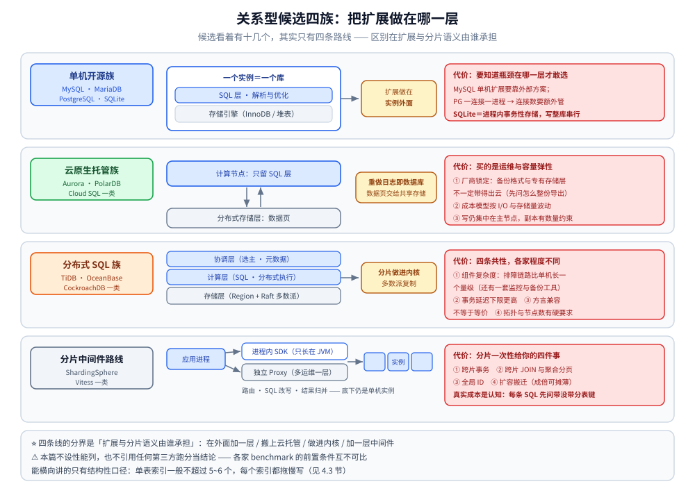
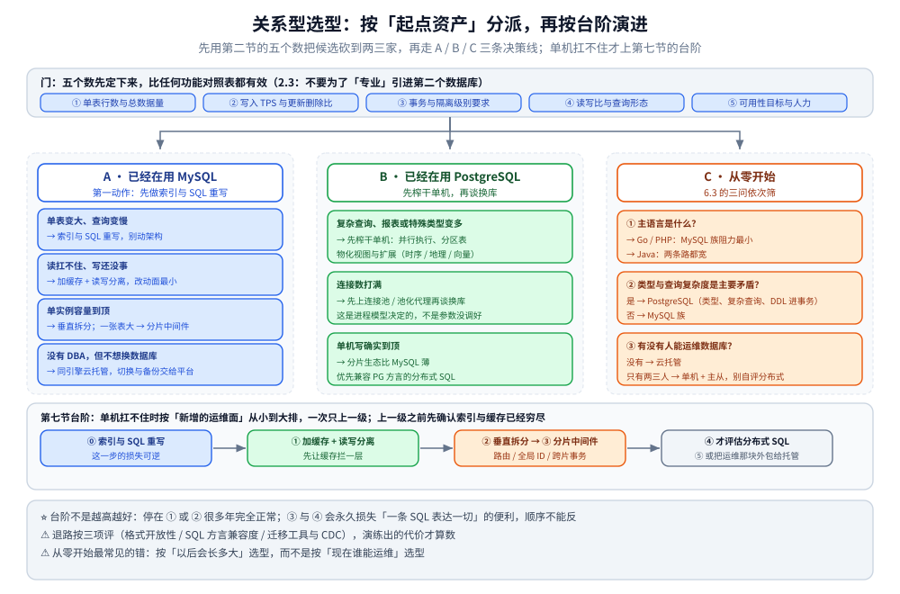

# 关系型选型对比

> 跨产品的横向选型：先立住「关系型」成立的四个前提与选型前**必须量化的五个数字**，
> 再把候选分成四族（单机开源 / 云原生托管 / 分布式 SQL / 分片中间件）逐维对照，
> 最后按**起点资产**给出四条决策线、单机扛不住时的演进台阶，以及一次可信 POC 的做法。
>
> ⭐ 边界先说清：本篇是**中立视角的跨产品选型**，不偏向任何一家，也不重讲单产品的内部机制。
> 「MySQL vs PostgreSQL 的六维对照」已在 [存储选型.md](../存储选型.md) 第三节给过，本篇只往下展开一层：
> 候选不止两家（MariaDB、云托管、分布式 SQL、分片中间件都在场内），并补上总纲没讲的三件事 ——
> **语言侧驱动成本**、**单机扛不住之后的路线顺序**、**退路怎么评**；
> MySQL 族的深度内容与目录边界见 [README.md](MySQL/README.md) 第四节；KV / 文档 / 宽列那一侧的对照见 [NoSQL选型对比.md](../NoSQL/NoSQL选型对比.md)，图库之间怎么选见 [图数据库选型对比.md](../图数据库/图数据库选型对比.md)。
>
> 内容整理自个人学习笔记，并参考各家官方文档与 Release Notes；素材见 [素材清单.md](../../../素材清单.md)。
>
> ⚠️ 实测口径：本篇**不含跨产品横评实测** —— 各家 benchmark 的前置条件互不可比，所以这里只给**定性对照与判据**；
> 版本号、许可条款、集群是否开源、参数默认值一律写定性措辞并**以官方文档为准**。本仓**已实测**的是 MySQL 8.0.46
> **单实例侧**的行为（加锁清单、参数默认值、语句可用性与报错原文），出处逐条标注；⚠️ 跨产品对比、主从切换与跨片事务的延迟**均未实测**。

---

## 一、怎么确认这是关系型负载？

**本节要点**：关系型不是不用想的默认项，它成立要靠四个前提；⭐ 四条都成立才谈得上「最省事」，有一条明显不成立就先看第八节的退路。

### 1.1 四个前提

| 前提 | 具体表现 | 缺了会怎样 |
|---|---|---|
| **① 稳定 Schema 与约束** | 字段与类型长期不变，业务规则（唯一、非空、外键、检查约束）写得进库层 | 改字段就要 DDL 与变更窗口；库层表达不了的约束得在应用层重复实现 |
| **② 行级事务** | 一次业务操作跨多行多表，「要么全成、要么全不成」 | 没事务就得自己做补偿、幂等与对账，成本立刻升到分布式事务那一档 |
| **③ 关系用 JOIN 表达** | 实体之间是引用关系，查询天然要连表，且连表深度可控 | 主查询若是「整棵子树一次读出」或「多跳遍历」，SQL 会天天堆 LEFT JOIN |
| **④ SQL 生态与人才** | 建模、索引、慢查询、备份、权限这套知识跨公司通用，人能招、资料能搜 | 换成小众查询语言，等于给每个新功能再加一次学习成本 |

### 1.2 三条「先别用关系型」的情形

| 情形 | 判据 | 该去哪 |
|---|---|---|
| **模型极不稳定的整棵子树** | 字段天天增删，读写单位是「一个聚合根整体」而不是「一行」 | 文档型：建模见 [README.md](../NoSQL/MongoDB/README.md)，对照见 [NoSQL选型对比.md](../NoSQL/NoSQL选型对比.md) |
| **主查询是全文检索** | 「分词 + 相关度排序 + 任意条件组合筛选」占主要流量 | 搜索引擎：定位与误用见 [README.md](../搜索与分析/Elasticsearch/README.md)；库里 `LIKE '%…%'` 用不上 B+ 树的有序性 |
| **大宽表聚合分析** | 主要查询是「扫很多行、算少数列」的报表，不是行级读写 | 列式：判据只在 [存储选型.md](../存储选型.md) 第七节写一次，本篇不复述 |

> ⚠️ 第四种更具体的：**多跳遍历是主查询** —— 本仓实测 MySQL 递归 CTE 到 6 跳已经 **16.9 ms**（1~3 跳仍是亚毫秒），这条线与读数**主要写在** [存储选型.md](../存储选型.md) 第八节（第一节表格与 `Neo4j/` 目录里也各出现一次），本篇只负责指过去。

---

## 二、选型前必须先量化的五个数？

**本节要点**：五个数字先定下来，候选会自己从十几个缩到两三家 —— 比任何功能对照表都有效。

### 2.1 五个输入

| # | 量什么 | 怎么量 | 为什么它决定选型 |
|---|---|---|---|
| ① | **单表行数与总数据量** | 现有行数 + 日增 × 保留期，再换算成「工作集大小」 | 工作集能否放进缓冲池，决定瓶颈在内存还是磁盘，也决定要不要拆 |
| ② | **写入 TPS 与更新 / 删除比例** | 分别统计 INSERT / UPDATE / DELETE 的占比与峰值 | 行存 + 事务 + 二级索引的写代价全在这项里；纯追加负载不该按这个框架选 |
| ③ | **事务与隔离级别要求** | 几个「必须跨表原子」的操作？能接受 RC 吗？要不要防写偏斜 | 决定候选只剩「有真事务的那几家」，并连带决定日志格式、加锁范围与死锁率 |
| ④ | **读写比与查询形态** | 点查 / 范围 / JOIN 深度 / 报表各占多少，QPS 与 P99 是多少 | 读多写少先想复制与缓存；分析占比高就得给报表另开路，别让它拖垮主库 |
| ⑤ | **可用性目标与人力** | RPO（能丢多少）、RTO（能停多久）、有没有人接得住线上故障 | ⭐ 最容易翻车的一项：多数团队高估自己的运维能力，它是**排除法里最硬的一条** |

### 2.2 每个数会砍掉哪些候选

| 量化结果 | 直接排除 | 保留下来 |
|---|---|---|
| 工作集远超单机内存且仍在涨 | 只做单机 + 主从的方案 | 分片中间件、分布式 SQL，或更大规格的托管实例 |
| 必须跨表强一致事务 | 无事务、或跨对象事务代价高的存储 | 关系型内部各族（跨片时另算，见 3.4） |
| 要求更严的隔离语义、防写偏斜 | 只有 RC / RR 两档、没有写偏斜检测机制的方案 | 有真快照隔离或可串行化检查的那一支；要继续跨地域做强一致多活，能选的只剩带共识 / 多数派复制的那两族（3.2、3.3） |
| 只有两三人运维、没有专职 DBA | 组件最多的自建分布式方案 | 云托管，或「单机 + 成熟复制」这条老路 |
| 报表与分析占主要查询 | 指望一个 OLTP 实例同时扛分析 | OLTP 库 + 旁路分析副本（同步方式见 [存储选型.md](../存储选型.md) 第九节） |

### 2.3 ⭐ 不要为了「专业」引进第二个数据库

> 多一个存储就多一套备份、监控、权限、升级与故障面。上面五个工作里**有四个靠「把现有关系库用好」就能解决**：索引与 SQL 重写（[索引设计与EXPLAIN.md](MySQL/索引设计与EXPLAIN.md)、[查询优化.md](MySQL/查询优化.md)）、加缓存、读写分离、垂直拆分。
> ⭐ 本仓给过量级口径：MySQL 单连接简单查询约 **500 ~ 2000 QPS**，缓存层约 **1 万 ~ 10 万 QPS**（区间出自 [缓存选型与容量.md](../缓存/缓存选型与容量.md) 第二节，不是精确值）。**「读扛不住」先让缓存拦一层，比换数据库便宜一个数量级**；这一步没做过就没资格谈选型。

---

## 三、候选可以分成哪四族？

**本节要点**：候选看着有十几个，其实只有四条路线 —— 先分族，再把每族**要付出的代价**说清楚。



图怎么读：四条横向泳道，左边是族名与代表产品，中间是这一族的**结构缩略图** —— 单机开源族只有一个实例盒（SQL 层 + 存储引擎），黄色小盒点明「扩展做在实例外面」；云原生托管族是计算节点在上、分布式存储层在下，中间那条双向箭头就是「重做日志即数据库」；分布式 SQL 族是协调 / 计算 / 存储三层，分片与多数派复制**做进内核**；分片中间件路线是应用进程 → 进程内 SDK 或独立 Proxy → 底下若干单机实例。右边红框是代价：SQLite 那一行别漏 —— 它是**进程内的事务性存储**，写是整库级串行。底部三行是本篇口径：分界在「扩展与分片语义由谁承担」，本篇**不设性能列也不引用第三方跑分**，只给「单表索引一般不超过 5~6 个，每个索引都拖慢写」这类由结构决定的量级。

### 3.1 单机开源族：MySQL / MariaDB / PostgreSQL（外加 SQLite）

**一句话定位**：一个实例就是一个库，「扩展」是在它**外面**做的事。

| 产品 | 一句话定位 | 强在哪 | 弱在哪 |
|---|---|---|---|
| **MySQL** | 互联网业务的主力库（本仓 MySQL 目录就是这一族的展开） | 生态与人才最厚、云托管最齐全、分片中间件路线成熟 | 单机扩展要靠外部方案；方言与数据类型能力弱于 PG（六维对照只在总纲第三节） |
| **MariaDB** | MySQL 的分叉，同源但不同路 | 存储引擎可选（事务 / 列存 / 联邦这类方向）、社区驱动 | ⚠️ **「可直接替换」要逐版本核**：认证插件、系统表、优化器行为与升级路径都分过叉 |
| **PostgreSQL** | 功能几乎都在主仓库里的「重型」关系库 | 类型与扩展生态最厚（JSONB / 数组 / 范围 / 地理 / 向量）、复杂查询与并行执行、DDL 能进事务 | ⭐ 一连接一进程 → **连接数必须额外管**（池化代理是常见配套）；分片生态比 MySQL 薄 |
| **SQLite** | ⚠️ 不是「小号 MySQL」，是**进程内的事务性存储** | 零运维、单文件、拷贝即备份，同样是真事务 + WAL | 写是**整库级串行**（同一时刻只有一个写者），多进程并发写不是它的场景；横向能力靠外部方案 |

> ⭐ **什么团队会选**：数据量在单机舒适区、团队会做索引与复制、不想为架构复杂度付费的绝大多数团队。⚠️ 共同前提是你已经知道瓶颈在哪一层 —— 判瓶颈的顺序与那几本账见 [参数调优.md](MySQL/参数调优.md)、[观测与诊断.md](MySQL/观测与诊断.md)。

### 3.2 云原生托管族：Aurora / PolarDB / Cloud SQL 一类

**一句话定位**：把单机开源族搬上云托管；其中「存算分离」那一支把**重做日志本身当数据库**（日志即数据库），数据页交给分布式存储层，计算节点只留 SQL 层。

| 拿到什么 | 付出什么 |
|---|---|
| 切换、备份、监控、升级窗口由平台负责；存储自动扩展，只读副本一键加 | ⚠️ **厂商锁定**：备份格式、控制台独有能力、专有存储层与参数面不一定带得出云 —— 先问「怎么整份导出去」 |
| 弹性比自建快（存储先扩、算力再扩），起步就有 HA | ⚠️ **成本模型变了**：按 I/O / 存储量 / 备份计费的形态，成本随**访问模式**而非实例规格波动 |
| 兼容原生协议，应用侧改动小 | ⚠️ **扩展上限没变**：写仍集中在主节点，只读副本有数量与延迟约束 —— 买的是运维与容量弹性，不是无限写吞吐 |

> ⭐ **什么团队会选**：没有专职 DBA、能接受用账单换运维、业务能稳定跑在单一云上的团队。⚠️ **别把「托管」当「免运维」**：索引、事务大小、连接数与慢查询这些**应用侧的账还是你的**，上述限制都要按各家当前文档核对。

### 3.3 分布式 SQL 族：TiDB / OceanBase / CockroachDB 一类

**一句话定位**：保留 SQL 语义，把「分片 + 多副本 + 故障切换」做进内核 —— 自动分区，配 Raft / Paxos 一类多数派复制。

- **强在哪**：应用侧「看起来还是一个库、一张表」，扩缩容基本不动业务代码；跨分片的聚合、分页与事务由引擎承担，省掉 3.4 那层手工约束。
- ⚠️ **弱在哪**（四条共性，各家实现程度不同，逐项以官方文档为准）：① **组件复杂度** —— 协调层 + 计算层 + 存储层 + 自己那套监控与备份工具，排障链路比单机长一个量级；② **事务延迟下限更高** —— 多数派写 + 跨分片两阶段提交，「单行小事务高频提交」这类负载会比同机单机难看，热点行更新是共同软肋（机制见 [分布式事务.md](../../../04-架构与系统/分布式/理论/分布式事务.md)）；③ **生态差异** —— 兼容 MySQL / PG 方言**不等于等价**，外键、序列、触发器、存储过程、权限模型与在线 DDL 要逐条核；④ **拓扑有硬要求** —— 多数派要足够的节点数（通常奇数，跨区部署对 RTT 敏感），最小规模就不是一台机器。
- ⭐ **什么团队会选**：数据量与写入增速已明确超出单机，**且有人愿意运维一套分布式系统**；「不想改业务代码，也不想自己维护路由规则」是它最大的价值。⚠️ **最常见的误用**是把它当「MySQL 的自动分片插件」—— 真实瓶颈若是「单连接延迟」或「热点行争用」，换到这一族通常只会让延迟更难看点。

### 3.4 分片中间件路线：ShardingSphere / Vitess 一类

**一句话定位**：**不改数据库，改架构** —— 在应用与单机开源族之间加一层，负责路由、SQL 改写与结果归并。

| 形态 | 优点 | 代价 |
|---|---|---|
| **客户端 SDK**（进程内） | 少一跳网络、随应用发布、不多一个组件 | ⚠️ **语言绑定**：这条生态主要长在 JVM 上，其他语言基本用不到（见第五节） |
| **独立代理**（Proxy） | 语言无关，Go / PHP 都能直连 | 代理本身变成一个要运维、要 HA、要观测的对象 |

要自己承担的损失（本仓已列成「分片一次性给你的四件事」，见 [分表与路由.md](MySQL/分表与路由.md) 第 2.3 节）：**跨片事务** —— 一次操作落多片就不再是本地事务，要么同分片键要么退最终一致；**跨片 JOIN 与聚合分页** —— 没带分表键就广播，分页每片都要取 `offset + limit` 再归并（非分表键定位的三种路由方案见 [分表与路由.md](MySQL/分表与路由.md) 第一节）；**全局 ID** —— 单实例自增失效，改雪花 / 号段（见 [分布式ID.md](../../../04-架构与系统/分布式/理论/分布式ID.md)）；**扩容搬迁** —— 成倍扩容可摊薄（本仓 Go / Java 两份实现实测 `h % (2N) ∈ {h % N, h % N + N}`，20000/20000 条全部命中）。

> ⭐ **什么团队会选**：已有成熟 MySQL 运维体系，数据「一大但拆得开」，宁可在应用层加约束也不想换引擎。⚠️ 这一族真实的成本不是软件，是**认知成本**：从此每条 SQL 都要问一句「带没带分表键」。

---

## 四、同一组维度上怎么对照？

**本节要点**：七个维度拉平看；但⚠️ 有一列刻意不在表里 —— 先看表，再看读表的顺序。

### 4.1 七维对照表

| 候选 | 许可与开源边界 | 事务与隔离语义 | 复制与高可用形态 | 扩展方式 | Schema 与数据类型 | 生态与人才 | 运维复杂度 |
|---|---|---|---|---|---|---|---|
| MySQL | 社区版开源 + 商业版 / 云 | 默认 RR，可降 RC，更严的级别要显式开（防幻读靠什么机制，[存储选型.md](../存储选型.md) 第三节已写过，本篇不复述） | 异步 / 半同步主从、组复制，切换工具生态成熟 | 只读副本 + 分片中间件，或换族 | 够用；JSON、生成列、CHECK 按版本核 | ⭐ 最厚，人会好招 | 中（机制清楚，坑在细节） |
| MariaDB | 以开源为主 | 与 MySQL 同源，但默认值与行为有差异 | 主从 + 多写方向（要单独核） | 同 MySQL，但部分中间件只声明支持 MySQL | 同源 + 各自新增 | 小于 MySQL | 中 |
| PostgreSQL | ⭐ 宽松许可，功能基本不拆企业版 | 默认 RC 但是真快照隔离，DDL 可以进事务（与 MySQL 在隔离语义上的逐维差异见 [存储选型.md](../存储选型.md) 第三节） | 流复制（物理）+ 逻辑复制（可按表订阅），HA 靠外部组件 | 单机垂直能力 + 分区表 + 只读副本；分片靠扩展 | ⭐ 最丰富（复杂类型 / JSONB / 自定义类型） | 比 MySQL 薄但更深 | 中（连接模型与回收机制要单独学） |
| SQLite | 无许可负担 | 完整事务，但写整库串行 | 无内建服务端复制 | 不横向扩展；靠上层分库或外部同步 | 动态类型，约束能力按版本核 | 嵌入式场景不缺人 | ⭐ 最低（没有服务要运维） |
| 云原生托管 | ⚠️ 服务本身不开源，锁定项逐条看 | 多沿用所兼容引擎的语义 | 平台负责切换、备份与副本 | 存储弹性 + 有限数量只读副本 | 跟随所兼容的引擎 | 跟引擎走 | ⭐ 低（但账单与参数面要盯） |
| 分布式 SQL | 开源边界各家不同：集群与工具是否落在开源版要逐条核 | 一般提供快照隔离与跨片事务，代价是延迟与冲突率 | 多数派复制内建，自动选主 | ⭐ 自动分片 + 在线扩缩容 | 方言兼容但是能力子集 | 需要既懂 SQL 又懂分布式的人 | ⚠️ 最高（多组件、多故障域） |
| 分片中间件 + 底层库 | 多为开源许可 | 事务退化为「单片内本地事务」，跨片自己兜 | 继承底层库的复制 | ⭐ 水平扩，容量与写吞吐一起涨 | 完全继承底层库 | 复用底层库生态 | 中高（多一层组件 + 一堆应用约束） |

> ⚠️ **本表只作定性对照**：单元格刻意不带数字与排名；版本号、默认参数、许可条款、集群是否开源**全部以官方文档与 Release Notes 为准**。

### 4.2 怎么读这张表

1. **先看「事务与隔离语义」+「Schema 与数据类型」**：这两列决定业务能不能干净表达，语义不合后面全白搭。
2. **再看「复制与高可用」+「扩展方式」**：拿第二节的 ⑤（RPO / RTO / 人力）去对。⭐ 这一轮筛掉的候选通常比性能筛掉的更多。
3. **最后看「生态与人才」+「运维复杂度」**：⭐ 真实成本是 **许可 + 硬件 + 人力 + 迁移** 四项之和，省下的那一项常被人力的那一项吃掉。

### 4.3 ⚠️ 性能那一列为什么不在表里

- 各家公开 benchmark 的前置条件**互不可比**：硬件、版本、表结构、二级索引数量、事务混合比例、连接池配置，改一个就换一份结论；
- ⭐ 关系型对前置条件尤其敏感：**二级索引一多，写路径的形态就变了**（本仓在 [索引设计与EXPLAIN.md](MySQL/索引设计与EXPLAIN.md) 第四节给过口径：单表索引一般不超过 5~6 个，每个索引都拖慢写）；OLTP 与报表混跑的结论不能拆开复用；
- 所以本篇**不设性能列，也不引用任何第三方跑分当结论**，唯一有效做法是**用自己的数据与查询做 POC**（见本篇 `## 使用`）；可以横向讲的只有**由结构决定的量级差别**（是原理，不是产品快慢）：主键点查与二级索引回表的代价差见 [B树与B+树.md](../../../02-计算机基础/数据结构/树/B树与B+树.md) 与 [索引设计与EXPLAIN.md](MySQL/索引设计与EXPLAIN.md)，跨分片归并的额外代价见 [分表与路由.md](MySQL/分表与路由.md)。

---

## 五、契合语言与团队栈？

**本节要点**：同一份能力清单落到不同语言上，驱动 / ORM / 连接池 / 运维工具差别很大 —— ⭐ **驱动往往是隐性成本最高的一项**。

| 语言 | 单机开源：MySQL / MariaDB | PostgreSQL | 云原生托管 | 分布式 SQL | 分片中间件 |
|---|---|---|---|---|---|
| **Java** | ⭐ 官方驱动 + 主流连接池（HikariCP / Druid）+ ORM（JPA / MyBatis）全套最厚，示例与运维工具默认是 Java；MariaDB 另有自己的官方 Java 客户端，两条线不共用 | 官方 JDBC 成熟，池化与框架齐全；⚠️ 一连接一进程 → **连接池参数格外敏感**，池化代理常是必配 | 同一套 JDBC，协议兼容即接得上；平台 SDK 与运维接口多为 Java 优先 | 用 MySQL / PG 协议即可直连；⚠️ 但各家的**运维 / CDC / 批量导入工具链多在 JVM 生态里**，Java 侧能拿到的工具最多 | ⭐ **唯一能用上进程内 SDK 形态的语言**（本仓的 Go / Java 两份分片实现见 [分表与路由.md](MySQL/分表与路由.md) 的使用两节） |
| **Go** | ⭐ 纯 Go 的 MySQL 驱动是事实标准、不需要 CGO；MariaDB 通常也走这条驱动（协议同源） | 纯 Go 社区驱动可用，⚠️ **要先确认所选那条仍在维护**（另一条老牌驱动已宣布停止维护，具体状态以官方公告为准）；占位符是 `$1` 不是 `?`，`database/sql` 的连接池默认行为与 MySQL 侧不完全一样 | 兼容协议 → 复用现有驱动；平台运维要走 REST / SDK，Go 侧示例少于 Java | 协议兼容即可复用 MySQL 驱动；⚠️ 建库、DDL 变更、备份、CDC 的官方工具**多半不是 Go 写的**，排障常只剩控制台 + REST | ⚠️ **没有对等的 SDK**：只能走**代理**形态，于是白多出一个要运维、要观测的组件（本仓 `数据库中间件` 目前是占位目录，细节待补） |
| **PHP** | ⭐ 官方 mysqlnd + PDO / mysqli，资料最全的一脉；⚠️ 8.0 起的默认认证插件要与服务端对齐 | 有内置 `pgsql` 扩展，但 ⚠️ 文档、生态与迁移工具支持远弱于 MySQL 侧，框架对各库的支持要逐版本核 | 能连协议就能用，坑在**扩展编译与版本对齐**（容器里的扩展名可能与宿主机不同） | 走兼容协议可用；⚠️ 但长事务、连接复用、常驻进程这套运维习惯要另学，请求级模型与它不合 | ⚠️ **SDK 形态用不上**：JVM 里写的分片库进不了 PHP 进程，**只剩代理这一条路** |

> ⭐ 三条结论：**① Go 团队** —— MySQL / MariaDB（纯 Go 驱动 + 工具链最全）≈ PostgreSQL（驱动可用但要自己选并确认维护状态）→ 分布式 SQL（连协议就行，工具链另算一笔账）→ 分片中间件**只考虑代理形态**；
> **② Java 团队** —— 单机两条线都不缺东西，而**分片中间件的 SDK 形态只对这一族完全开放**、分布式 SQL 的配套工具也最多，「量大了但不想换引擎」时路线成本明显更低；
> **③ PHP / 多语言混合团队** —— 「MySQL 族 + 代理形态或云托管」是唯一不凑合的组合：选 PG 要先验证扩展与框架支持，选 SDK 分片方案等于把自己排除在方案之外。
>
> ⚠️ 反面教训：**把「都叫 SQL」当成「可以平移」** —— 方言、占位符（`?` 与 `$1`）、DDL 的事务性、认证插件（MySQL 8.0 起的默认与 PG 的默认不同，名称与默认值以所用版本为准）各不相同；换库后的第一个线上事故通常来自**认证与占位符**，而不是查询写法。

---

## 六、按「起点资产」怎么决策？

**本节要点**：选型不是从空白开始，而是从「你手里已经有什么」开始 —— 四条线的第一动作完全不同。



图怎么读：顶部一排五个小盒就是第二节的五个数（单表行数与总数据量 / 写入 TPS 与更新删除比 / 事务与隔离级别要求 / 读写比与查询形态 / 可用性目标与人力），先把它们量出来再谈候选；下面三列分别是 6.1 的四种状况、6.2 的三种状况、6.3 的三问。最下面那条横带是第七节的台阶顺序：**⓪ 索引与 SQL 重写 → ① 加缓存 + 读写分离 → ② 垂直拆分 → ③ 分片中间件 → ④ 才评估分布式 SQL**（⑤ 把运维那块外包给托管排在同一排台阶上）。台阶 ⓪ 与 ① 的损失可逆，③ 与 ④ 会永久损失「一条 SQL 表达一切」的便利，所以顺序不能反。

### 6.1 决策线 A：已经在用 MySQL

| 状况 | 首选动作 |
|---|---|
| 单表变大、查询变慢 | ⭐ 先做索引与 SQL 重写（[索引设计与EXPLAIN.md](MySQL/索引设计与EXPLAIN.md)、[深分页与索引变更.md](MySQL/深分页与索引变更.md)），**别动架构** |
| 读扛不住、写还没事 | 加缓存 + 读写分离（[缓存选型与容量.md](../缓存/缓存选型与容量.md)、[复制与高可用.md](MySQL/复制与高可用.md)），改动面最小 |
| 单实例容量到顶 | 按业务垂直拆分；仍是「一张表大」→ 分片中间件（3.4）；不想自己维护路由规则且有人接得住多组件 → 评估分布式 SQL（3.3） |
| 没有 DBA，但不想换数据库 | 同引擎的云托管（3.2），把切换与备份交给平台 |

### 6.2 决策线 B：已经在用 PostgreSQL

| 状况 | 首选动作 |
|---|---|
| 复杂查询、报表或特殊类型开始变多 | ⭐ 先榨干单机：并行执行、分区表、物化视图与扩展（时序 / 地理 / 向量这类）—— 这些能力在 PG 侧来得更全，也**不必引进第二个数据库**（时序那一支的例子见 [时序数据库选型对比.md](../时序数据库/时序数据库选型对比.md)） |
| 连接数打满 | 先上连接池 / 池化代理再谈换库；这是进程模型决定的，不是「参数没调好」 |
| 单机写确实到顶 | 分片生态比 MySQL 薄 → 优先考虑兼容 PG 方言的分布式 SQL，或按业务拆库 |

### 6.3 决策线 C：从零开始

| # | 问题 | 回答指向 |
|---|---|---|
| ① | 主语言是什么？ | 见第五节：Go / PHP → MySQL 族阻力最小；Java → 两条都宽 |
| ② | 数据类型与查询复杂度是不是主要矛盾？ | 是 → PostgreSQL（类型、复杂查询、DDL 进事务）；否 → MySQL 族 |
| ③ | 有没有人能运维数据库？ | 没有 → 云托管；只有两三人 → 单机 + 主从，**别自评分布式** |

> ⭐ 从零开始最常见的错：**按「以后会长多大」选型，而不是按「现在谁能运维」选型** —— 前者能靠迁移解决，后者不能。决策线 D（单机已经扛不住）的正文就是第七节的台阶表，这里不重复。

### 6.4 判据速查

| 场景 | 首选 | 备选 | 通常不该选 |
|---|---|---|---|
| 互联网业务主力库、团队有 MySQL 经验 | MySQL 单机 + 主从 + 缓存 | 同族另一支（PG）或云托管 | 一上来就分布式 SQL |
| 复杂查询 / 地理 / 半结构化字段 / 更严的隔离语义 | PostgreSQL | 云托管的 PG 形态 | 明知不合却因「生态大」硬用 MySQL，再自建一堆补丁 |
| 工具类、嵌入式、边缘、单文件分发 | SQLite | 进程内缓存结构 | 多进程并发写或要横向扩的场景用 SQLite |
| 没有 DBA、单一云、能接受账单换运维 | 云原生托管 | 单机开源自建 | 自建组件最多的分布式方案 |
| 数据量超单机：想改代码就选中间件，不想改就选分布式 | 分片中间件（SDK 或代理）/ 分布式 SQL | 更大规格托管实例 | 只加机器却不解决写单点，或拆不开还硬拆的分片 |
| 读多写少、热点集中 | 缓存 + 读写分离 | 更大规格实例 | 分库分表（写没到顶就没必要） |

---

## 七、单机扛不住时，几条路线怎么上？

**本节要点**：按「新增的运维面」从小到大排台阶，一次只上一级；⭐ 上一级之前先确认「索引与缓存已经穷尽」。

| 台阶 | 典型形态 | 解决什么 | 新增的运维面 | 触发信号 |
|---|---|---|---|---|
| ⓪ | **索引与 SQL 重写** | 大多数「慢」其实是「没走索引 / 扫得太多」 | 无（只加慢查询日志与巡检） | 出现慢查询，执行计划里扫行量大 |
| ① | **加缓存（+ 读写分离）** | 读的容量，把重复读拦在库外 | 缓存一致性与失效、副本延迟 | 读写比高、热点集中；主库时间大多花在读上 |
| ② | **垂直拆分（按业务分库）** | 单实例的容量与连接压力，顺便划清服务边界 | 跨库不能 JOIN、权限与备份对象变多 | 多业务挤一个实例、连接数打满 |
| ③ | **水平分片 + 中间件** | **写**吞吐、单表体积 | 路由规则、全局 ID、跨片事务与分页、扩容搬迁 | [分表与路由.md](MySQL/分表与路由.md) 第 2.2 节**三本账里只有容量账算不过来** |
| ④ | **分布式 SQL** | 不想自己维护分片规则，要在线扩缩容 | 组件数、跨片事务延迟、新的备份与 CDC 工具链 | ③ 的分片键选不好、业务改不动、数据增速持续超单机 |
| ⑤ | **换云托管 / 升规格** | 把 ①②③ 里「运维」那块外包出去 | 锁定与成本模型要重算 | 瓶颈是人力不足，不是容量不足 |

> ⭐ 台阶不是越高越好：停在 ① 或 ② 很多年完全正常，判断标准始终是「新增的运维面，团队有没有人接得住」；**顺序也不能反** —— ③ 与 ④ 会**永久损失**「一条 SQL 表达一切」的便利，⓪ 与 ① 的损失可逆。
> ⚠️ 本仓读后整理里最强的那条建议恰恰反直觉：**最好的扩展方式是一开始就别被扩展问题逼到分片**（见 [分表与路由.md](MySQL/分表与路由.md) 第 2.4 节）。

---

## 八、哪些情况不该继续用关系型，退路怎么评？

**本节要点**：先给「该换出去」的四类信号，再给评估退路的三项通用指标。

### 8.1 四类信号

| 信号 | 具体表现 | 该换到哪里 |
|---|---|---|
| **模型天天变、读写单位是整棵子树** | 字段每周增删，对象是聚合根，DDL 变更窗口成为常态 | 文档型（[NoSQL选型对比.md](../NoSQL/NoSQL选型对比.md)、[README.md](../NoSQL/MongoDB/README.md)） |
| **主查询是检索而不是事务** | 分词、相关度、任意条件组合筛选占主要流量 | 搜索引擎（[README.md](../搜索与分析/Elasticsearch/README.md)） |
| **主要负载是「扫全表算少数列」** | 报表与埋点分析把 OLTP 库拖住 | 列式（判据在 [存储选型.md](../存储选型.md) 第七节） |
| **多跳遍历是主查询** | 连表次数随跳数增长，本仓 6 跳已到 **16.9 ms**（读数出自 [存储选型.md](../存储选型.md) 第八节） | 图数据库（[README.md](../图数据库/Neo4j/README.md)） |

### 8.2 退路按三项评，别只按功能评

⭐ 选型时多问一句「三年后想换，怎么把数据带走」，这一句就能过滤掉一批方案：

| 退路维度 | 好的表现 | 怎么验 |
|---|---|---|
| **格式开放性** | 数据能用 SQL / CSV / Parquet 这类通用格式导出，别的引擎读得动 | 做一次**真实导出演练**，而不是只看文档写支持 |
| **SQL 方言兼容度** | 业务 SQL 大部分能原样跑在另一家上，依赖的函数与特性是共性而非独有 | 把线上 Top SQL 拿去目标库逐条试 |
| **迁移工具与 CDC 是否成熟** | 有成熟的同步链路（逻辑复制 / binlog 订阅 / 全量 + 增量），能不停服搬迁并校验 | ⚠️ **演练出的代价才算数**：本仓 8.0.46 容器实测一次 `FLUSH TABLES ... FOR EXPORT` 的导出锁把写入挂住 **11 秒**（单机、小表，见 [数据迁移与备份恢复.md](MySQL/数据迁移与备份恢复.md)），生产大表只会更难看 |

> ⚠️ 反过来：「独有类型 / 独有索引结构 / 只能用自家工具备份」越多，退路越窄。这**不是缺点**（它就是能力的来源），但必须在决策时把它记成一条负债。

---

## 使用：一次可信的关系型选型 POC 该怎么做

**本节要点**：POC 的目标不是「证明某一家快」，而是**得到一份只对你这套口径有效的结论**。

> ⚠️ 如实声明：本篇**不含本机跨产品横评实测**。本仓已实测的是 MySQL 8.0.46 **单实例侧**的行为 —— RC / RR 的锁数差别（[MVCC与锁.md](MySQL/MVCC与锁.md)）、复制参数默认值与语句可用性（[复制与高可用.md](MySQL/复制与高可用.md)）、导出锁的实际阻塞时长（[数据迁移与备份恢复.md](MySQL/数据迁移与备份恢复.md)）；**跨产品对比、主从切换、跨片事务的延迟都没实测过**，所以下面的通过标准只规定「怎么写」，不给期望值。

### 步骤

1. **定口径**（半天）：把第二节的五个数写成一张表，并明确「一年后的量级预估」。
2. **用真实数据与真实查询**（1~2 天）：拿生产采样与 Top SQL，而不是均匀随机数据 —— ⭐ 数据分布（主键是否趋势递增、索引列基数、重复值多不多）直接决定写放大与索引选择。
3. **对齐条件**：同一台机器、同一版本、同一批数据、同一组查询，**逐项只改一个变量**。
4. **四类负载各跑一遍**：写入吞吐、查询分位数、事务冲突与死锁率、故障切换期间的读写行为。
5. **结论绑定口径**：每条结论都写清「在多少 TPS、几个二级索引、什么读写比这个前提下」。⚠️ 脱离口径的结论不可复用。

### 要看的读数与通过标准

| 看什么 | 为什么看它 | 通过标准怎么写 |
|---|---|---|
| 写入吞吐（TPS）与刷盘行为 | 行存 + 事务 + 二级索引的代价全在这里 | 写「在 N 倍余量下仍有余量」，不写某个峰值 |
| 查询 P95 / P99 | ⭐ 平均值掩盖长尾，投诉都在长尾里 | 按你最重要的 3~5 条 SQL 逐条定阈值 |
| 事务冲突与死锁率 | 隔离级别与加锁范围的综合后果，比单机快慢更能决定体验 | 写「可接受的死锁率 + 重试策略」，并附实测加锁范围（对照本仓 8.0.46 的锁清单） |
| 故障切换期间的读写行为 | 决定 RPO / RTO 能不能兑现 | ⚠️ **必须两台实例**：单实例侧只能验参数与语句，验不出切换 |
| 在线 DDL 与备份恢复耗时 | 表越大越暴露元数据锁；恢复决定 RTO | 用**最大的那张表**演练，写清阻塞窗口；恢复按业务可接受中断时间定 |

### 起隔离实例做可行性验证（本仓口径）

```bash
# 只用自己新建的实例：独立容器名 + 独立端口 + 独立 volume；起之前先 docker ps -a 看端口有没有残留
# ⚠️ 本机已有 mysql-arch-lab 占着 13307（见 MVCC与锁.md 的实测口径），这里刻意用 13316 错开
MSYS_NO_PATHCONV=1 docker run -d --name poc-rel-mysql -p 13316:3306 mysql:8.0
# ⚠️ 本机镜像清单里没有 postgres，要先 docker pull postgres:16（本机已配镜像源）
MSYS_NO_PATHCONV=1 docker run -d --name poc-rel-pg  -p 15432:5432 postgres:16
# 先确认版本与认证方式：换库的第一个事故通常出在这一项，而不是查询写法
MSYS_NO_PATHCONV=1 docker exec poc-rel-mysql sh -c 'mysql --version'   # 另一侧同理：psql --version
# 同一批 SQL 分别打到 13316 与 15432（占位符不同：MySQL 用 ?，PG 用 $1），只改「数据库」这一个变量
# 收尾只 stop 自己创建的容器，不要 rm —— 留着复跑与对账
MSYS_NO_PATHCONV=1 docker stop poc-rel-mysql poc-rel-pg
```

> ⚠️ 上面只是「把两个实例隔离起来」的最小命令形态，**不构成横评结论**：镜像 tag、参数与数据集要按你的口径补齐；时序类读数务必标波动范围，**两次运行的数字不能混用**（连跑 3~5 次取区间，本仓口径）。

### ⚠️ 三个最容易犯的错

1. **把厂商 benchmark 当结论**：它是口径，不是你的结论（原因见 4.3）。
2. **POC 用简化表结构**：线上那张挂着多个二级索引、还有唯一约束与生成列的表才是真负载，减掉索引跑出的写吞吐没有参考价值。
3. **只压性能、不验语义**：隔离级别、加锁范围、DDL 事务性、认证插件与字符序这些**语义差异**不会因为机器好就消失 —— 它们才是迁移返工的主因。

---

## 延伸追问

- **MySQL 与 PostgreSQL 在事务语义上差在哪？** → 逐维差别已经写在 [存储选型.md](../存储选型.md) 第三节，本篇只补一条**实测看得见的后果**：本仓 8.0.46 容器里同一句 `SELECT ... WHERE k = 20 FOR UPDATE`，RR 下挂四把锁（含间隙锁），RC 下只剩两把（见 [MVCC与锁.md](MySQL/MVCC与锁.md)、[事务与隔离级别.md](MySQL/事务与隔离级别.md)）。⚠️ 连带一条：降到 RC 时 binlog 就不能用 `STATEMENT` 格式，必须 `ROW`（见 [复制与高可用.md](MySQL/复制与高可用.md)）。
- **为什么说「换了数据库等于换了运维团队」？** → 要重学的不是 SQL，而是**日常动作**：连接模型与池化、空间回收机制、备份与按时间点恢复的工具、参数面、观测视图、权限模型，每一项都不通用。SQL 能平移，「出事时那二十分钟怎么办」不能平移。
- **分片中间件与分布式 SQL 的本质差别是什么？** → **谁承担分片语义**：中间件把路由、改写、归并放在数据库**外面**，继承底层库的一切能力与限制，代价是跨片事务、跨片聚合与分片键约束由业务承担；分布式 SQL 把这些做进**内核**，代价是组件复杂度、跨片事务延迟与一套新工具链。一句话：**前者把复杂度给你，后者把复杂度给它自己**。
- **云托管的锁定成本怎么评估？** → 拆四项来问：① 数据能否用开放格式整份导出；② 备份能否在别处恢复；③ 业务依赖了多少只有该平台才有的能力与参数；④ 迁走的演练成本。⭐ 只算账单差额是最常见的错法。
- **什么时候 SQLite 反而是正解？** → 数据天然属于**一个进程 / 一台机器 / 一个文件**的时候：命令行与桌面工具、移动端与边缘设备、嵌入式与 IoT、单实例小站，以及测试里「要一个真事务引擎但不想起服务」。判据是「写者只有一个」；一旦要多进程并发写或横向扩展，它就不是候选。
- **MariaDB 能当 MySQL 的直接替换吗？** → 「大体同源」不等于「直接替换」：认证插件、系统表、优化器行为、复制拓扑与升级路径都分过叉。要换就按**迁移项目**做（导出演练 + Top SQL 逐条试 + 复制链路重建），不要按「装个同名包」做。
- **单机 MySQL 到底能扛到哪？** → 别把它当绝对上限：本仓给过的量级口径是「单连接简单查询约 500 ~ 2000 QPS，缓存层约 1 万 ~ 10 万 QPS」（区间出自 [缓存选型与容量.md](../缓存/缓存选型与容量.md) 第二节）。真正决定上限的是**工作集能否放进内存、写路径的刷盘代价、索引设计**，不是「MySQL 这个产品」；到顶之后按第七节的台阶走。
- **选型最该先做的一件事是什么？** → ⭐ **量化第二节的五个数**，然后拿真实数据与真实 SQL 做 POC。功能对照表人人都有，能把候选砍到两家的只有你自己的口径。

---

## 关联

- [存储选型.md](../存储选型.md) — 全仓存储总纲：七类存储分类、MySQL vs PG 的六维对照（第三节）与「各存各的」组合范式
- [README.md](MySQL/README.md) — MySQL 目录导读：单机开源族的完整展开，第四节是与其他目录的边界表
- [分表与路由.md](MySQL/分表与路由.md) — 分片路线的细节：三本账、分片一次性给你的四件事、路由方案与成倍扩容
- [复制与高可用.md](MySQL/复制与高可用.md) — 这一族的 HA 机制：三个线程、binlog 三种格式、半同步与 GTID
- [索引设计与EXPLAIN.md](MySQL/索引设计与EXPLAIN.md) — 台阶 ⓪ 的具体做法：B+ 树、选择性与执行计划读法
- [MVCC与锁.md](MySQL/MVCC与锁.md) — 「事务与隔离语义」那一列的实测出处（RR 与 RC 的锁清单）
- [NoSQL选型对比.md](../NoSQL/NoSQL选型对比.md) — 同批新增的兄弟篇：KV / 文档 / 宽列三族的跨产品对照
- [图数据库选型对比.md](../图数据库/图数据库选型对比.md) — 接受「多跳交给图库」之后，图库之间怎么选
- [搜索与分析选型对比.md](../搜索与分析/搜索与分析选型对比.md) — 主查询从「事务」换成「检索 / 聚合」时的域内横评
- [缓存选型与容量.md](../缓存/缓存选型与容量.md) — 台阶 ①：容量估算与「读扛不住先拦一层」的量级口径
- [B树与B+树.md](../../../02-计算机基础/数据结构/树/B树与B+树.md) — 行存 + 二级索引这个结构为什么写有代价、范围读快
- [分布式事务.md](../../../04-架构与系统/分布式/理论/分布式事务.md) — 跨片与跨服务事务的通用机制与一致性档位
