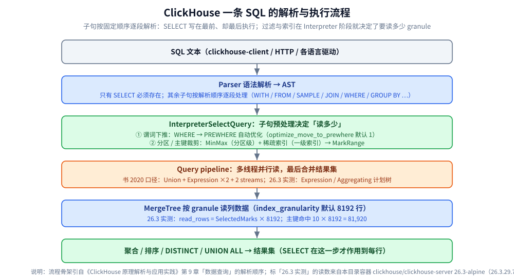
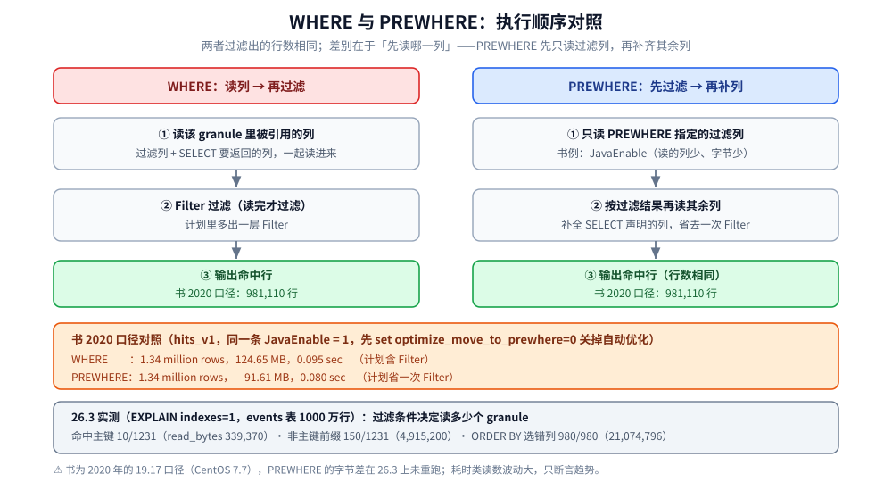

# SQL 查询与优化

> 素材来源：《ClickHouse原理解析与应用实践》（朱凯，机械工业出版社 2020 年）第 9 章「数据查询」的读后整理，**按主题归纳而非逐字摘录**；其余整理自个人学习笔记与官方文档，素材见 [素材清单](../../../../素材清单.md)。
>
> ⚠️ 书基于 **ClickHouse 19.17.4.11 + CentOS 7.7（2020 年）** 编写，本目录的容器实测是 **26.3.29.7（LTS，`clickhouse/clickhouse-server:26.3-alpine`）**。凡书里的默认值、参数名、系统表字段、语法与日志文案与当前不一致处，本篇逐处标注「**书 2020 口径**」与「**26.3 实测**」—— 这层差异本身就是本篇最值得看的部分。

---

## 一、一条 ClickHouse SQL 是按什么顺序解析的？

**本节要点**：子句的执行先后不看它在语句里的位置 —— `SELECT` 写在最前面，却是最后一个执行的。

### 1.1 解析顺序总览

书中给出的子句顺序（原文成块保留）：

```text
[WITH expr |(subquery)]
SELECT [DISTINCT] expr
[FROM [db.]table | (subquery) | table_function] [FINAL]
[SAMPLE expr]
[[LEFT] ARRAY JOIN]
[GLOBAL] [ALL|ANY|ASOF]
[INNER | CROSS | [LEFT|RIGHT|FULL [OUTER]] ] JOIN (subquery)|table ON|USING columns_list
[PREWHERE expr]
[WHERE expr]
[GROUP BY expr] [WITH ROLLUP|CUBE|TOTALS]
[HAVING expr]
[ORDER BY expr]
[LIMIT [n[,m]]
[UNION ALL]
[INTO OUTFILE filename]
[FORMAT format]
```

- **只有 `SELECT` 必须存在**，其余子句都是可选的；ClickHouse 按上面这个顺序逐段解析。
- 书 9.12 节的原话：`SELECT` **虽位于语句起始，却在其余子句之后执行**；`LIMIT BY` 跑在 `ORDER BY` 之后、`LIMIT` 之前（9.10 节），`LIMIT` 排在其后（9.11 节）。

### 1.2 与标准 SQL 的差异和两条容易踩的坑

- **没有 `DUAL`**：`FROM` 可整个省略，此时从虚拟表取数 —— ClickHouse 用 `system.one` 顶替，`SELECT 1` 与 `SELECT 1 FROM system.one` 等价（书 9.2 节）。
- **只支持 `UNION ALL`**：书里写明当时没有 `UNION DISTINCT`，等价效果只能拿嵌套查询变相实现（见 7.3）。
- **表引擎的 `ORDER BY` 不等于查询的 `ORDER BY`**：MergeTree 的只是**分区内局部排序**，跨多分区查询的返回顺序**无法预知、每次可能不同**（书 9.9 节）。
- ⚠️ 书称解析**大小写敏感**（`SELECT a` 与 `SELECT A` 语义不同）—— **书 2020 口径，本篇未在 26.3 上复核**。
- ⭐ **`SELECT *` 在列式存储上是纯劣势**：作者断言数百列的表上两种查法**可能相差 100 倍**（⚠️ 作者断言，非实测）。书里四步优化的第 ② 步给了硬对照：只换成一个字段，**结果集 8.50 GiB → 67.70 MiB、峰值内存 340.03 MiB → 17.56 MiB**（见第八节）。



---

## 二、WITH、FROM 与 FINAL：查询的两端怎么写？

**本节要点**：`WITH` 是写法上的糖（CTE），`FROM` 决定数据来源，`FINAL` 决定要不要在查询期强制合并。

### 2.1 WITH 的四种用法

```sql
-- ① 定义变量
WITH 10 AS start SELECT number FROM system.numbers WHERE number > start LIMIT 5

-- ② 调用函数（可引用 SELECT 中的列）
WITH SUM(data_uncompressed_bytes) AS bytes
SELECT database, formatReadableSize(bytes) AS format
FROM system.columns GROUP BY database ORDER BY bytes DESC

-- ③ 定义子查询
WITH (SELECT SUM(data_uncompressed_bytes) FROM system.columns) AS total_bytes
SELECT database, (SUM(data_uncompressed_bytes) / total_bytes) * 100 AS database_disk_usage
FROM system.columns GROUP BY database ORDER BY database_disk_usage DESC
```

④ **在子查询里嵌套 `WITH`**：外层 CTE 套一个 `FROM ( WITH ... SELECT ... )`，可把上一步算出的列再加工一次（书里是对 `database_disk_usage` 再套一层 `round()`）。

⚠️ **易错点**：`WITH` 中的子查询**只能返回一行数据**，多于一行就抛异常（书 2020 口径；26.3 是否放宽未复核）。

### 2.2 FROM 的三种来源与 FINAL

三种来源：数据表（`SELECT WatchID FROM hits_v1`）、子查询（`FROM (SELECT MAX(WatchID) AS m FROM hits_v1)`）、表函数（`SELECT number FROM numbers(5)`）；`FROM` 可省略 → 走 `system.one`（见 1.2）。`FINAL` 写在 `FROM` 之后，配合 **CollapsingMergeTree / VersionedCollapsingMergeTree** 等表引擎**强制在查询过程中合并**。书的口径很直接：**会降低查询性能，应尽可能避免使用**（书 2020 口径；本篇未实测）。

---

## 三、SAMPLE 与 ARRAY JOIN：采样与数组展开怎么写？

**本节要点**：`SAMPLE` 是**幂等**的近似查询，`ARRAY JOIN` 则把数组 / 嵌套类型**一行展开成多行**。

### 3.1 SAMPLE 的前置条件与三种写法

`SAMPLE` 只能用于 **MergeTree 系列**的表，且建表时必须声明 `SAMPLE BY`（`CREATE TABLE ... ENGINE = MergeTree() PARTITION BY toYYYYMM(EventDate) ORDER BY (CounterID, intHash32(UserID)) SAMPLE BY intHash32(UserID)`）：

- `SAMPLE BY` 声明的表达式**必须同时包含在主键声明内**（书中行内注释原文：Sample Key 声明的表达式必须也包含在主键的声明中）。
- **Sample Key 必须是 Int 类型** —— 否则建表不报错、**查询时才报**：`Invalid sampling column type in storage parameters: Float32. Must be unsigned integer type.`

⭐ 采样是**幂等设计**：数据不变时相同的采样规则**总是返回相同的数据**，所以只适合「能接受近似结果」的场合。

| 写法 | 语义 | 书 2020 口径的注意点 |
| --- | --- | --- |
| `SAMPLE factor` | 按因子采样，`0~1` 小数，支持 `1/10` | **0 或 1 等同于不采样**；统计要乘回采样系数（或改用虚拟字段 `any(_sample_factor)`） |
| `SAMPLE rows` | **至少**采样多少行，须为大于 1 的整数 | **大于总行数时等同 rows=1**；最小粒度由 `index_granularity` 决定 |
| `SAMPLE factor OFFSET n` | 从数据 `n` 比例处开始按 `factor` 采样 | `factor` 与 `n` 均为 `0~1`；**溢出时自动截断** |

⚠️ 书里两条读数（**书 2020 口径，26.3 未复核**）：`SAMPLE 10000` 实测返回 **9576** 行 —— 采样是**近似范围**；`SAMPLE 100000` 的 `_sample_factor` = **13.27104**。rows 值设得小于 `index_granularity` 没有意义。

### 3.2 ARRAY JOIN：数组与嵌套类型怎么展开

- **默认 `INNER`**：**排除空数组**的行；`LEFT ARRAY JOIN` **保留**空数组行（书的示例里 `meat` 行取到 `v=0`）。
- **给原数组字段加别名**能同时访问展开前的数组：`ARRAY JOIN value AS v` → `value` 仍是 `[1,2,3]`，`v` 是单值。
- ⭐ 同时对多个数组 `ARRAY JOIN` 时是**按行合并，不是笛卡儿积**：`ARRAY JOIN value AS v, mapv AS v_1`。
- **嵌套类型**（`Nested` 本质是多维数组）同样可展开：`ARRAY JOIN nest` 等价于 `ARRAY JOIN nest.v1, nest.v2`；也可只展开其中一部分字段，或用别名 `ARRAY JOIN nest AS n` 保留原数组。
- ⚠️ **一条 `SELECT` 里只能有一个 `ARRAY JOIN`**（用子查询除外）；写入嵌套类型时**同一行内各数组的长度必须对齐**（书第 4 章口径）。

---

## 四、JOIN 该怎么写、有哪些坑？

**本节要点**：JOIN 的语法由「连接精度 × 连接类型」两部分组合；真正踩坑的是**内存、空值与分布式放大**。

### 4.1 语法与连接精度

```text
[GLOBAL] [ALL|ANY|ASOF]
[INNER | CROSS | [LEFT|RIGHT|FULL [OUTER]] ] JOIN (subquery)|table ON|USING columns_list
```

- **默认 `ALL`**，可用 `join_default_strictness` 修改；匹配判据是 `JOIN KEY`，书里明确**当时只支持等式（EQUAL JOIN）**；`CROSS JOIN` 不需要 `JOIN KEY`（它产生笛卡儿积）。
- `ALL` 返回右表**全部**匹配行（`id=1` 返回 `100`、`105` 两行）、`ANY` **只返回第一行**匹配、`ASOF` 是模糊连接。
- **ASOF 的语义**：`ON a.id = b.id AND a.time = b.time` **等同于** `a.id = b.id AND a.time >= b.time`，且**仅返回右表第一行匹配**；用 `USING` 简写时**最后一个字段自动转成 `asof_column`**（如 `USING(id, time)` 里的 `time`）。
- ⚠️ `asof_column` 的两条约束：必须是**有序类型**（整型 / 浮点 / 日期），且**不能与 JOIN KEY 是同一个字段**。

### 4.2 连接类型

| 类型 | 返回什么 | 书里的内部逻辑 |
| --- | --- | --- |
| `INNER` | 只返回左右**交集** | 以左表为基础逐行遍历右表 |
| `LEFT` | 左表**全部**返回 | 右表无匹配时用**相应字段数据类型的默认值**填充（`id=4` → `rate=0`） |
| `RIGHT` | 右表全部返回 | 三步：① 类似 INNER 并记录右表未连接行 ② 追加到交集尾部 ③ 左表列用默认值补全 |
| `FULL` | 两侧的数据都保留 | 三步：① 类似 LEFT 并记录右表已连接行 ② 得出右表未连接行 ③ 追加并补全左表列 |
| `CROSS` | 笛卡儿积 | 逐行与右表全集相乘 |

⚠️ **未连接的数据用「类型默认值」填充，而不是 `NULL`**，由 `join_use_nulls` 指定，**默认 0**（0 = 类型默认值 / 1 = `Null`）。所以「字段是不是 0」不能当作「有没有连上」的判据。

### 4.3 多表连接、GLOBAL JOIN 与三条性能经验

- 多表连接会**转为两两连接**：`A INNER JOIN B ON .. LEFT JOIN C ON ..` 先算 A 与 B 的内连接，再与 C 左连接。
- 逗号关联（`FROM a, b, c`）会被自动转换，前提是 `allow_experimental_cross_to_join_conversion`：**无 `WHERE` → 转 `CROSS JOIN`，有 `WHERE` → 转 `INNER JOIN`**。⚠️ 该参数**默认 1，且书中已注明「该参数在新版本中已经取消」（书 2020 口径，26.3 未复核）**；作者的结论是**虽然支持，但并不建议使用**。
- **GLOBAL JOIN 为什么必须存在**（书第 9 章只讲本地 JOIN，这是第 10 章的口径）：子查询用**本地表**时，分布式表会把 SQL 替换成本地表形式发到各分片，`IN` / `JOIN` 子句**也只查本分片** → **结果错误**；用**分布式表**时结果正确，但**请求被放大 N 的平方倍**（N = 分片节点数；10 分片 → 100 次请求，书里说「显然不可接受」）。✅ 解法是 `GLOBAL IN` / `GLOBAL JOIN`：把子句**单独提出来发一次分布式查询** → 结果汇总进**临时内存表** → 内存表**发送到远端分片节点** → 各节点带着内存表执行完整 SQL。⚠️ **数据会在网络间分发，临时表不宜过大**，子句内若有重复数据可先加 `DISTINCT`。（本篇容器实测**未涉及分布式**。）
- 三条性能经验：① **左大右小** —— 无论哪种连接方式，**右表都会被全部加载到内存**；② **JOIN 当时没有缓存**，即便连续执行相同 SQL 也会**每次生成全新执行计划**（书 2020 口径），大量 JOIN 要么应用侧加缓存、要么改用 Join 表引擎；③ **维度补全优先用字典代替 JOIN**（多表连接是「滚雪球」式两两连接）。
- ⭐ 简写：连接字段同名时用 `USING` —— `... INNER JOIN join_tb2 USING id` 与 `ON a.id = b.id` 等价。

---

## 五、WHERE 和 PREWHERE 该把过滤写在哪一层？

**本节要点**：`WHERE` 是「这条查询能不能用索引」的判断依据，`PREWHERE` 是同一件事的优化形态；26.3 实测能看到差值最终落在**读了多少个 granule**上。

### 5.1 分工

- `WHERE` 基于条件表达式过滤；⭐ **过滤条件恰好是主键字段时才能借助索引加速** —— 所以书里把 `WHERE` 称作「一条查询语句**能否启用索引**的判断依据」（前提是表引擎支持索引），日志印证形如 `(SelectExecutor): Key condition: (column 0 in ['A000', 'A000'])`（书 2020 口径文案，新版读法见 8.2）。
- `PREWHERE` **当时只能用于 MergeTree 系列**（书 2020 口径），可看作 `WHERE` 的优化：**先只读 `PREWHERE` 指定的列做过滤，再读 `SELECT` 声明的列补全其余属性** → 某些场合处理的数据量更少、性能更高。

### 5.2 书里的对照实测

先用 `set optimize_move_to_prewhere=0` **强制关掉自动优化**，再对同一条过滤条件分别用 `WHERE` 与 `PREWHERE`（书 2020 口径，`hits_v1`；**单次读数、非区间**）：

```text
WHERE     981110 rows in set. Elapsed: 0.095 sec. Processed 1.34 million rows, 124.65 MB
PREWHERE  981110 rows in set. Elapsed: 0.080 sec. Processed 1.34 million rows,  91.61 MB
```

行数不变（都是 134 万行），**数据量 124.65 MB → 91.61 MB**，耗时 0.095 s → 0.080 s。执行计划：`WHERE` 为 `Union → Expression ×2 → Expression → Filter → MergeTreeThread`，`PREWHERE` 为 `Union → Expression ×2 → Expression → MergeTreeThread` —— **省去了一次 Filter**。⚠️ 这两组数字是 19.17 + CentOS 7.7 的读数，**26.3 未重跑 PREWHERE 对照**。

### 5.3 自动优化与「五类不自动优化」

`optimize_move_to_prewhere` **默认 1（开启）**，条件合适时会自动把 `WHERE` 换成 `PREWHERE`，日志形如 `<Debug> InterpreterSelectQuery: MergeTreeWhereOptimizer: condition "v1 = 10" moved to PREWHERE`。

以下五种情形**不会**自动优化（书 9.6 节）：① **常量表达式**（`WHERE 1=1`）；② 默认值为 **`ALIAS`** 类型的字段；③ 含 **`arrayJoin` / `globalIn` / `globalNotIn` / `indexHint`**；④ **`SELECT` 的列字段与 `WHERE` 谓词相同**（`SELECT v3 FROM query_v3 WHERE v3 = 1`）；⑤ **使用了主键字段**（`SELECT id FROM query_v3 WHERE id = 'A000'`）。

⚠️ 作者对第 ⑤ 类的补充：主键场景**手动**改用 `PREWHERE` 时，会先经**稀疏索引**过滤数据区间（`index_granularity` 粒度）再读条件列，**有可能「截掉数据区间的尾巴」**、返回低于 `index_granularity` 粒度的数据范围；相比其他场合移动谓词带来的提升「比较有限」，所以这条**仍保持不移动**。

### 5.4 26.3 实测：过滤条件决定「读多少字节」

容器 26.3.29.7 的 `events` 表（1000 万行，`ORDER BY (city, user_id)`，`index_granularity=8192`）上，关掉查询条件缓存后读数**完全稳定**（3 次一致）：

| 查询 | read_rows | read_bytes | SelectedMarks | SelectedRanges |
| --- | --- | --- | --- | --- |
| `WHERE city='北京' AND user_id=123456`（命中主键） | **81,920**（= 10×8192） | 339,370 | 10 | 10 |
| `WHERE user_id=123456`（不是主键前缀） | **1,228,800**（= 150×8192） | 4,915,200 | 150 | 140 |
| 同前一条查询跑在对照表 `events_alt`（`ORDER BY (event_time)`）上 | **8,000,000**（全表） | 21,074,796 | 980 | 36 |

- ⭐ **`read_rows = SelectedMarks × 8192`** 在两个非全扫的例子里精确成立 —— 「读了几个 granule」就等于「读了多少行」，稀疏索引省的就是这个。
- 计划形态也跟着变：命中主键时 `WHERE` 被内联进 `Expression ((WHERE + Change column names to column identifiers))`，未命中主键前缀时则多出一层 `Filter ((WHERE + ...))`（原文见 8.2）。
- ⚠️ **必须显式 `SET use_query_condition_cache=0`**，否则第二次跑的读数会「莫名变小」：不关缓存连跑 3 次，第 2 条查询的 `read_rows` 是 `1,228,800 → 655,360 → 655,360`，第 3 条是 `8,000,000 → 524,288 → 524,288`。**两次运行的数字不能混用。**



---

## 六、GROUP BY 与 HAVING：聚合、小计和二次过滤怎么写？

**本节要点**：`GROUP BY` 决定聚合键，三种修饰符决定「小计」长什么样；`HAVING` 是聚合之后的二次过滤。

### 6.1 GROUP BY 的三条语义

- `GROUP BY` 后的表达式称**聚合键（Key）**；**`SELECT` 只声明聚合函数时 `GROUP BY` 可以省略**；但**声明了列字段就只能使用聚合键包含的字段**，否则报错 —— 要访问键外的列就借 `any` / `max` / `min`（`SELECT table, COUNT(), any(rows) FROM system.parts GROUP BY table`）。
- ⭐ **`NULL` 处理遵循 `NULL = NULL`** —— 所有 `NULL` 会被聚到同一个分组里。

### 6.2 三种修饰符：ROLLUP / CUBE / TOTALS

| 修饰符 | 追加什么 | 数量规律 |
| --- | --- | --- |
| `WITH ROLLUP` | 按聚合键**从右向左上卷**，依次生成分组小计与总计 | **n 个键 → n+1 个小计** |
| `WITH CUBE` | 基于各键的**所有组合** | **n 个键 → 2^n 个小计**（书里 3 键实测 8 种组合） |
| `WITH TOTALS` | 对所有数据做总计 | 结果**附加一行 `Totals:`** |

⚠️ 书 2020 口径的读数：`SELECT database, SUM(bytes_on_disk), COUNT(table) FROM system.parts GROUP BY database WITH TOTALS` 的结果分三组（`default` / `datasets` / `system`），附加的 `Totals:` 行是 `2920960908` 与 `52`。**26.3 上该修饰符的行为未复核。**

### 6.3 26.3 实测：同一份数据的两种去重口径

```sql
SELECT city, count(), sum(price), uniq(user_id), count(DISTINCT user_id)
FROM events GROUP BY city ORDER BY city
```

```text
   ┌─city─┬─────cnt─┬───────total─┬─────uv─┬─────cd─┐
1. │ 上海 │ 1250000 │ 62496250000 │ 125492 │ 125000 │
2. │ 北京 │ 1250100 │ 62495012300 │ 125542 │ 125087 │
3. │ 广州 │ 1250000 │ 62497500000 │ 124957 │ 125000 │
4. │ 武汉 │ 1250000 │ 62502500000 │ 124697 │ 125000 │
5. │ 深圳 │ 1250000 │ 62498750000 │ 125282 │ 125000 │
   └──────┴─────────┴─────────────┴────────┴────────┘
```

⭐ **两个去重列给出的数字不一样**：`uniq(user_id)` 落在 **124,697~125,542**，`count(DISTINCT user_id)` 落在 **125,000~125,087** —— 两者都在 12.5 万量级，但 `uniq` 的波动更大，**要精确值就用 `count(DISTINCT ...)`**。

### 6.4 HAVING：聚合之后的过滤器

- **必须与 `GROUP BY` 同时出现，不能单独使用**；本质是**聚合之后增加一个 Filter**：无 `HAVING` 是 `Expression → Aggregating → Concat → Expression → One`，加了 `HAVING` 是 `Expression → Expression → Filter → Aggregating → Concat → Expression → One`（书 2020 口径的计划文本）。
- 同样的需求**用嵌套 `WHERE` 效率更高**（`WHERE` 等同**谓词下推**，聚合前就过滤掉数据）；但**按聚合值过滤必须用 `HAVING`**（`WHERE` 的执行优先级大于 `GROUP BY`）：`... GROUP BY table HAVING avg_bytes > 10000`。

---

## 七、ORDER BY / LIMIT BY / LIMIT / DISTINCT / UNION ALL 各管什么？

**本节要点**：这一族子句管「结果集整形」，最常错的两处是 `LIMIT BY` 的参数顺序与「跨分区顺序不可预知」。

### 7.1 ORDER BY

- 用来指定**全局顺序**；多个排序键用逗号分隔，每键后可跟 `ASC` / `DESC`（**不写默认 `ASC`**）。`NULL` 的位置：`NULLS LAST`（**默认，修饰符可省略**）是「其他值 → `NaN` → `NULL`」、`NULLS FIRST` 是「`NULL` → `NaN` → 其他值」—— ⚠️ 作者的观察是 **`NaN` 总是紧跟在 `NULL` 身边**。

### 7.2 LIMIT BY 与 LIMIT

```sql
LIMIT n BY express                -- 分组 TOP N：常规写法
LIMIT n OFFSET y BY express       -- 带偏移
LIMIT y,n BY express              -- 简写（⚠️ 参数顺序与上一行相反）
LIMIT n / LIMIT n OFFSET m / LIMIT m,n   -- 总行数：三种形态，后两种等价
```

- `LIMIT BY` 是「每组最多取前 n 行」，跑在 `ORDER BY` 之后、`LIMIT` 之前；多表达式用逗号分隔（`LIMIT 5 BY database, table`）。⚠️ 完整写法是 `n OFFSET y`、简写是 `y,n`，**一个在前一个在后正好相反，极易写错**。
- `LIMIT m,n` 表示从第 m 行起返回 n 行（`LIMIT 5,10`）；可与 `LIMIT BY` 同用（`... LIMIT 3 BY database LIMIT 10`）。
- ⚠️ **跨多分区且未用 `ORDER BY` 指定全局顺序时，每次 `LIMIT` 返回的数据有可能不同**（书 9.11 节）。

### 7.3 SELECT、DISTINCT 与 UNION ALL

- `SELECT` **最后执行**（见 1.1）；除 `*` 外还能按正则选列：`SELECT COLUMNS('^n'), COLUMNS('p') FROM system.databases`。
- `DISTINCT` 与 `GROUP BY` **返回结果相同**，但**执行计划更简单**：`DISTINCT` → `Expression → Distinct → Expression → Log`；`GROUP BY` → `Expression → Expression → Aggregating → Concat → Expression → Log`（书 2020 口径）。两者**互补而非互斥**，可同时使用，`NULL` 同样遵循 `NULL = NULL`。
- ⭐ 两个性能点：用了 `LIMIT` 且没有 `ORDER BY` 时，**`DISTINCT` 满足条件能迅速结束查询**；与 `ORDER BY` 同用时**先 `DISTINCT` 后 `ORDER BY`**。

- ⭐ **`UNION ALL`**：可声明多次；⚠️ **不能直接使用其他子句**（`ORDER BY` / `LIMIT` 等只能写在它联合的子查询里）。
- 两侧子查询的三条要求：**列字段数量必须相同**、**类型相同或相兼容**、**列名可不同（结果以左边子查询为准）**。
- 书里明确**当时只支持 `UNION ALL`**；`UNION DISTINCT` 用嵌套查询变相实现：`SELECT DISTINCT name FROM (SELECT name, v1 FROM union_v1 UNION ALL SELECT title, v1 FROM union_v2)`。

---

## 八、怎么看一条 SQL 的执行计划？

**本节要点**：这是本篇「书口径 vs 26.3 实测」差异最大的地方 —— 书里只能借服务日志变相实现，26.3 已经有 `EXPLAIN`。

### 8.1 书 2020 口径：没有 EXPLAIN，只能看日志

书里明说 **ClickHouse 当时并没有直接提供 `EXPLAIN`**，做法是把客户端日志级别打到 `trace`：

```bash
clickhouse-client -h ch7.nauu.com --send_logs_level=trace <<< 'SELECT * FROM hits_v1' > /dev/null
```

书里用四步优化演示怎么读这段日志（`hits_v1`：8873910 行 / 12 个分区 / `index_granularity = 8192`，**书 2020 口径读数，只记趋势**）：

| 步骤 | SQL | 日志关键行（书 2020 口径） |
| --- | --- | --- |
| ① 全字段 vs ② 单字段（都全表扫） | `SELECT * FROM hits_v1` / `SELECT WatchID FROM hits_v1` | ①：`Key condition: unknown`、`Selected 12 parts by date, 12 parts by key, 1098 marks to read from 12 ranges`、`Read 8873910 rows, 8.50 GiB in 28.267 sec.`、`Peak memory usage: 340.03 MiB`；②：仍扫 12 分区 / 8873910 行，但结果集 **8.50 GiB → 67.70 MiB**（0.195 s）、峰值内存 **340.03 MiB → 17.56 MiB** |
| ③ 分区索引 vs ④ 主键索引 | `... WHERE EventDate = '2014-03-17'` / `... AND CounterID = 67141` | ③：谓词自动移到 PREWHERE、`MinMax index condition: (column 0 in [16146, 16146])`、`Selected 9 parts by date, 9 parts by key, 1095 marks to read from 9 ranges`；④：`Key condition: (column 0 in [67141, 67141])`、`Selected 9 parts by date, 8 parts by key, 8 marks to read from 8 ranges`、预读量 **65536 行（8192×8）** |

作者三条总结仍有用：**必须真正执行了查询才会打印计划日志**（表大时最好加 `LIMIT`）；**不要用 `SELECT *`**；**尽可能利用各种索引**。另有一条现在只剩历史价值：`Selected xxx parts by date` 里的 **`by date` 是固定的**，无论分区键是什么字段都不变 —— 原因是**早期版本 MergeTree 的分区键只支持日期字段**。

### 8.2 26.3 实测：`EXPLAIN indexes=1` 直接给出计划树

⚠️ 上面「当时没有 EXPLAIN」在 26.3 上**已经作废**：容器里 `EXPLAIN indexes=1` 直接返回计划树。下面是实测原文（`events` 表，1000 万行）：

```text
$ docker exec devnotes-ch clickhouse-client -q "EXPLAIN indexes=1 SELECT count() FROM events WHERE city='北京' AND user_id=123456"
Expression ((Project names + Projection))
  Aggregating
    Expression (Before GROUP BY)
      Expression ((WHERE + Change column names to column identifiers))
        ReadFromMergeTree (default.events)
        Indexes:
          MinMax { Condition: true, Parts: 11/11, Granules: 1231/1231 }
          Partition { Condition: true, Parts: 11/11, Granules: 1231/1231 }
          PrimaryKey
            Keys: [city, user_id]
            Condition: and((user_id in [123456, 123456]), (city in ['北京', '北京']))
            Parts: 10/11
            Granules: 10/1231
            Search Algorithm: binary search
          Ranges: 10
```

- 计划树**自下而上**看：`ReadFromMergeTree` 是读表算子，往上是 `Expression`（表达式 / 列改名）、`Aggregating`、`Expression`（投影）。
- `Indexes:` 下分三段 —— **`MinMax`（分区 / part 级 minmax）、`Partition`（分区索引）、`PrimaryKey`（主键稀疏索引）**，每段都用 `Parts: 命中/总数`、`Granules: 命中/总数` 表达**裁剪效果**；⭐ 关键看 **`Granules` 的比值**与 `Search Algorithm`，命中主键前缀时是 `binary search`、只扫 **10/1231** 个 granule。

### 8.3 同一个查询的三种命运与两点提醒

同一个查询的三种命运，只看 `PrimaryKey` 段的 `Granules`（与 5.4 同源，26.3 实测）：命中主键前缀 → **10/1231**、`binary search`、`Ranges: 10`；只过滤非前缀列 `user_id` → **150/1231**、`generic exclusion search`、`Ranges: 140`；对照表 `events_alt`（`ORDER BY (event_time)`）→ `Condition: true`、**980/980**、`Ranges: 36`。

- ⚠️ 反直觉的实测：`user_id` **不是主键前缀**（主键是 `(city, user_id)`），但**并没有退化成全表扫描** —— 首列 `city` 只有 8 个不同值，优化器用 **`generic exclusion search`** 仍把范围压到 150/1231 个 granule。所以「非前缀列一定全扫」这句话是错的；而 `ORDER BY` 选错列（`events_alt`）就是实打实的 980/980 全读。

- 提醒一：书里那条 `--send_logs_level=trace` 路径**仍然可用**，但 26.3 的计划树形态、`Selected ... by date` 这类日志行**已不是首要读法**；`EXPLAIN PLAN` / `EXPLAIN PIPELINE` / `EXPLAIN SYNTAX` / `EXPLAIN AST` 这些形态**本篇未实测**（素材里只有 `EXPLAIN indexes=1` 的原文），需要时以官方文档加容器现场验证为准。
- 提醒二：看计划前先想清楚**缓存** —— 26.3 的查询条件缓存会改变第二次的读数（见 5.4），做基准时先 `SET use_query_condition_cache=0`。

---

## 九、查询级配置怎么写、常用哪些项？

**本节要点**：参数落在会话 `SET`、建表 `SETTINGS` 这两处；本篇只写素材里出现过的项。

### 9.1 素材里出现过的两种写法

```sql
SET optimize_move_to_prewhere = 0;   -- 会话级：关掉 WHERE→PREWHERE 自动优化
SET use_query_condition_cache = 0;   -- 会话级：关掉查询条件缓存（做基准必开）

CREATE TABLE events ( ... )
ENGINE = MergeTree PARTITION BY toDate(event_time) ORDER BY (city, user_id)
SETTINGS index_granularity = 8192;   -- 建表级：MergeTree 设置
```

⚠️ 直接把 `SETTINGS` 写进 `SELECT` 的写法在本篇素材里没有出现，**未实测**；要用就先在容器里试一条。

### 9.2 默认值：26.3 实测 + 书 2020 口径的四个开关

`system.settings`（查询级）：

| 参数 | 26.3 实测默认 | 说明 |
| --- | --- | --- |
| `max_threads` | `'auto(4)'` → **4** | 默认值是字符串 `auto(4)`，本机 `nproc=4` 解析为 4 |
| `max_memory_usage` | **0** | 0 = 不施加查询级上限，实际由服务器 / cgroup 约束 |
| `max_block_size` | **65409** | 不是常被误传的 65536 |
| `max_insert_block_size` | **1048449** | ⚠️ 与书第 4 章的 `1048576` 不同 |

`system.merge_tree_settings`（建表级）：`index_granularity = 8192`、`index_granularity_bytes = 10485760`（10 MiB，自适应粒度上限）、`min_index_granularity_bytes = 1024`、`enable_mixed_granularity_parts = 1`、`min_bytes_for_wide_part = 10485760`。⭐ 这组值决定了「一个 granule 默认 8192 行」的推算依据，也是 5.4 节 `read_rows = SelectedMarks × 8192` 成立的前提。

| 参数 | 书 2020 口径 | 影响 |
| --- | --- | --- |
| `join_default_strictness` | 默认 `ALL` | JOIN 的默认连接精度 |
| `join_use_nulls` | 默认 `0` | 未连接处用类型默认值（0）还是 `Null`（1） |
| `optimize_move_to_prewhere` | 默认 `1` | `WHERE` → `PREWHERE` 自动优化 |
| `allow_experimental_cross_to_join_conversion` | 默认 `1`，书中称**新版本已取消** | 逗号关联自动转 `CROSS` / `INNER` |

⚠️ 这四个参数的默认值**是否仍如此，本篇未在 26.3 上逐条复核**；用之前先 `SELECT name, value, default FROM system.settings WHERE name IN (...)` 现场确认。⚠️ 素材里**没有出现 `join_algorithm` 一类的执行策略参数**，本篇不写。

---

## 十、写 ClickHouse SQL 该固化哪十条经验？

**本节要点**：十条都能指回书 9 / 10 章或本目录的 26.3 实测，逐条标注来源，方便回头核对。

1. **别用 `SELECT *`**（书 9.12 / 9.15）：书里第 ② 步只换成一个字段，结果集 8.50 GiB → 67.70 MiB、峰值内存 340.03 MiB → 17.56 MiB。
2. **让过滤条件落在主键前缀上**（26.3 实测）：命中主键 10/1231 个 granule、非前缀列 150/1231、`ORDER BY` 选错列 980/980；`read_rows` 对应 81,920 / 1,228,800 / 8,000,000。
3. **先信自动优化，别手工全改 `PREWHERE`**（书 9.6）：`optimize_move_to_prewhere` 默认 1；书里对照读数是 124.65 MB → 91.61 MB、计划省一次 Filter。
4. **记住那五类不会自动移动的情形**（书 9.6）：常量表达式 / `ALIAS` 字段 / `arrayJoin`·`globalIn`·`globalNotIn`·`indexHint` / `SELECT` 列与 `WHERE` 谓词相同 / 使用主键字段。
5. **JOIN 遵循左大右小、维度补全改用字典**（书 9.5.4）：右表会被**全部加载进内存**，且书里说 JOIN **当时没有缓存**。
6. **别拿「值为 0 / 空串」判断有没有连上**（书 9.5.4）：未连接数据的填充是**数据类型默认值**，由 `join_use_nulls` 控制（默认 0）。
7. **跨分区查询必须自己写 `ORDER BY`**（书 9.9 / 9.11）：返回顺序不可预知、`LIMIT` 不带 `ORDER BY` 时每次结果可能不同；26.3 实测的 `events` 表就有 11 个 part 参与扫描。
8. **`LIMIT BY` 的两种写法参数顺序相反**（书 9.10）：`LIMIT n OFFSET y BY expr` 与简写 `LIMIT y,n BY expr`；它跑在 `ORDER BY` 之后、`LIMIT` 之前。
9. **精确去重与近似去重分开选**（26.3 实测）：`uniq(user_id)` 给 124,697~125,542、`count(DISTINCT user_id)` 给 125,000~125,087，要精确值就用后者。
10. **查计划用 `EXPLAIN indexes=1`，做基准先关查询条件缓存**（26.3 实测）：书里「只能靠 trace 日志」已作废；`SET use_query_condition_cache=0` 不做，第二次的 `read_rows` 会掉下来（1,228,800 → 655,360 → 655,360）。

---

## 使用：把子句组合成一条可复跑的三步诊断

**本节要点**：一条「跑聚合 → 查计划 → 读日志」的流程，表结构与读数都来自本目录 26.3 容器的实测。表结构：1000 万行，分区键 `toDate(event_time)`、主键 `(city, user_id)`、`index_granularity=8192`。

```sql
CREATE TABLE events
(
    event_time DateTime, user_id UInt32,
    city LowCardinality(String), device LowCardinality(String),
    url String, price Decimal(10, 2), tags Array(String)
)
ENGINE = MergeTree
PARTITION BY toDate(event_time) ORDER BY (city, user_id)
SETTINGS index_granularity = 8192;
```

**第一步：跑聚合**，顺带看两种去重口径的差（结果见 6.3）：

```sql
SELECT city, count(), sum(price), uniq(user_id), count(DISTINCT user_id)
FROM events GROUP BY city ORDER BY city;
```

**第二步：确认过滤条件能不能吃到稀疏索引**：

```sql
EXPLAIN indexes=1
SELECT count() FROM events WHERE city = '北京' AND user_id = 123456;
```

期望看到 `PrimaryKey` 段的 `Granules: 10/1231` 与 `Search Algorithm: binary search` —— 如果 `Granules` 是 `980/980`，先回头检查 `ORDER BY` 是不是把过滤列排到了后面。

**第三步：用 `system.query_log` 校对真实读数**（跑之前先关缓存）：

```sql
SET use_query_condition_cache = 0;
SELECT count() /*pk_hit*/ FROM events WHERE city = '北京' AND user_id = 123456;
SYSTEM FLUSH LOGS;
SELECT query_duration_ms, read_rows, read_bytes, result_rows
FROM system.query_log WHERE query LIKE '%pk_hit%' AND type = 'QueryFinish';
```

实测读数是 `read_rows = 81,920`（= 10 × 8192）、`read_bytes = 339,370`，与第二步的 `Granules: 10/1231` 对得上 —— ⭐ **这就是「计划里的 granule 数」与「日志里的读行数」互相印证的方式**。

⚠️ 三点提醒：① 表结构与查询都来自本目录的容器实测，**换成自己的 schema 后读数一定不同**；② 耗时类数字波动大（实测主键命中 14~20 ms、仅 `user_id` 13~18 ms、全扫对照 37~147 ms），**只断言趋势**；③ 书里的 8.50 GiB / 1098 marks 是 **19.17 + CentOS 7.7** 的读数，不要与 26.3 的读数混着引用。

---

## 延伸追问

- **书说「当时没有 EXPLAIN」，现在怎么查计划？** → 26.3 上 `EXPLAIN indexes=1` 直接返回计划树（原文见 8.2）；`EXPLAIN PLAN` / `PIPELINE` / `SYNTAX` / `AST` 这些形态本篇未实测，用前先现场验一条。
- **为什么同一段 `read_rows` 第二次跑会变小？** → 26.3 有查询条件缓存，会把「某个 granule 不满足条件」的结论缓存下来，多跑几次跳过的 granule 变多；做基准必须 `SET use_query_condition_cache=0`，否则拿到的是「第二次更快」的假象。
- **非主键前缀的列为什么没有退化成全表扫描？** → 实测里 `user_id` 单独过滤时 `Granules` 是 150/1231 而不是 980/980，用的是 **`generic exclusion search`**；前提是主键首列 `city` 基数很低（8 个值）。所以「不是前缀就一定全扫」不成立，但代价确实比命中前缀大一个量级（150 vs 10）。
- **`PREWHERE` 能完全替代 `WHERE` 吗？** → 不能。它当时只适用于 MergeTree 系列，而且书里列的**五类情形不会自动把谓词移过去**，最反直觉的是主键那一条 —— 移动反而可能截掉数据区间的尾巴。
- **为什么分布式下的 `IN` / `JOIN` 子查询要用 `GLOBAL`？** → 用本地表会**结果错误**（子句只查本分片），用分布式表会**放大 N 的平方倍**（10 分片 → 100 次请求）；`GLOBAL IN` / `GLOBAL JOIN` 把子句结果放进**临时内存表**再分发到各分片执行，代价是网络分发，所以临时表不宜过大。
- **书里的读数还能直接拿来用吗？** → 不能当常量用。书是 19.17 + CentOS 7.7 的读数（8.50 GiB / 1098 marks / 340.03 MiB 这类），容器实测是 26.3.29.7；同一批实验还发现连 `max_insert_block_size` 的默认值都变了（书 `1048576` vs 实测 `1048449`）。**凡默认值、系统表字段、日志文案，先查现场。**

---

## 关联

- [数据库选型对比.md](../../数据库选型对比.md) — 七类存储的定位矩阵里 ClickHouse 的位置，以及它与 ES 的分工
- [搜索与分析选型对比.md](../../搜索与分析/搜索与分析选型对比.md) — 列式存储与倒排索引为什么擅长的查询正好相反
- [时序数据库选型对比.md](../../时序数据库/时序数据库选型对比.md) — ClickHouse 在时序场景里的定位（通用列存自建那一族）
- [选型对比与落地案例.md](../../时序数据库/GreptimeDB/选型对比与落地案例.md) — GreptimeDB 与 ClickHouse 的对照（指标专精 vs 通用分析）
- [Jaeger.md](../../../../06-工程实践/可观测性/Jaeger.md) — ClickHouse 作为 Trace 后端时的部署形态与查询侧视角

> 本目录 `列式数据库/ClickHouse/` 里同族篇目还有：架构与存储引擎、数据模型与表设计、索引原理与查询优化、写入与数据导入、物化视图与实时聚合、性能调优与基准测试、定位与适用场景、选型对比与落地案例 —— 本篇只负责「SQL 子句 + 执行计划」这一段，索引与存储的底层原理不在这里重复。
> 反向引用（本篇被下列文档引到）：[写入与数据导入.md](写入与数据导入.md)、[性能调优与基准测试.md](性能调优与基准测试.md)、[数据模型与表设计.md](数据模型与表设计.md)、[物化视图与实时聚合.md](物化视图与实时聚合.md)、[索引原理与查询优化.md](索引原理与查询优化.md)、[列式数据库选型对比.md](../列式数据库选型对比.md)
