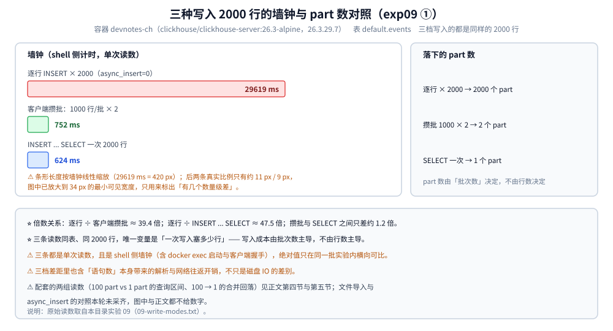
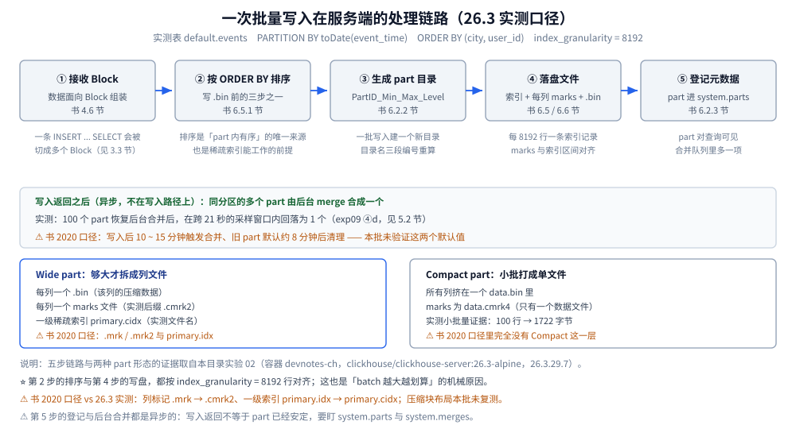
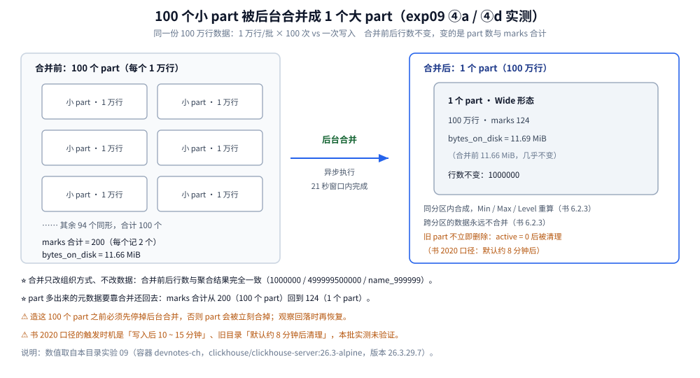

# 写入与数据导入

> 本篇讲一次写入从客户端到磁盘走完的整条链路 —— 为什么「批量」是硬要求（实测逐行写比客户端攒批慢约 39 倍）、
> 一个 batch 怎么就变成一个 part、part 多了会怎样、后台合并怎么消化它们，以及文件导入、`async_insert`、
> 写入幂等与写入侧常见坑；其余整理自个人学习笔记与官方文档。
>
> 素材来源：《ClickHouse原理解析与应用实践》（朱凯，机械工业出版社 2020 年）第 4 章「数据定义」与第 6 章「MergeTree 原理解析」的读后整理，**按主题归纳而非逐字摘录**；实测读数取自本目录容器（实验 02 / 09），素材见 [素材清单](../../../../素材清单.md)。
>
> ⚠️ 书为 **2020 年**（全书基于 **19.17.4.11** 编写，演示环境 CentOS 7.7），本目录的容器实测为 **26.3.29.7**（`clickhouse/clickhouse-server:26.3-alpine`，容器名 `devnotes-ch`，时区 UTC）；凡书与 26.3 不一致处**逐处标注「书 2020 口径 vs 26.3 实测」**。⚠️ 第 4 章的**表 4-1 ~ 表 4-5** 与第 6 章的**表 6-1、全部配图（图 6-1 ~ 图 6-24）在 PDF 抽取时丢失**，本篇只写文字能支撑的部分；**文件导入的读数本轮未采齐**（见第六节）。

---

## 一、ClickHouse 的写入为什么必须「批量」？

**本节要点**：一次写入 = 一次 Block 落盘 + 一个 part 生成 + 一次元数据登记；逐行写就是把同一件事重复 2000 遍 —— 实测差 39 倍以上。

### 1.1 书 4.6 节的写入口径：一切以 Block 为单位

- ClickHouse 内部所有数据操作**面向 Block 数据块**，所以 `INSERT` 最终会把数据转换成 Block；**INSERT 语句在单个数据块的写入过程中具有原子性**（要么全部成功、要么全部失败）。
- 书的默认值：**每个数据块最多写入 `max_insert_block_size = 1048576` 行**；一条 INSERT 写入的数据少于该行数时，这批数据的写入具有原子性。
- ⚠️ 书同时给了两条边界：**只有在 ClickHouse 服务端处理数据的时候才具有这种原子写入的特性**（例如使用 JDBC 或 HTTP 接口时）；**`max_insert_block_size` 参数在使用 CLI 命令行或 `INSERT SELECT` 子句写入时是不生效的**。这两条与 26.3 实测的对应关系见第三节 3.3。

### 1.2 实测：三种写法的墙钟与 part 数（exp09 ①）

同一张 `events` 表（1000 万行宽表，`ORDER BY (city, user_id)`），都是写 **2000 行**，只换取数方式：

| 写法 | 墙钟 | 落下的 part 数 |
|---|---|---|
| 逐行 `INSERT` × 2000（`async_insert=0`，每行一条语句） | **29619 ms** | 2000 |
| 客户端攒批：1000 行/批 × 2 | **752 ms** | 2 |
| `INSERT ... SELECT` 一次 2000 行 | **624 ms** | 1 |

倍数关系：**29619 / 752 ≈ 39.4 倍**（逐行 vs 客户端攒批）；**29619 / 624 ≈ 47.5 倍**（逐行 vs `INSERT ... SELECT`）；而客户端攒批与 `INSERT ... SELECT` 之间只差约 **1.2 倍**（752 / 624）。



上图怎么读：三条读数是**同一次实验、同一张表、同样的 2000 行**，唯一变量是「一次写入塞多少行」；右侧一行是配套的 part 数，它和墙钟同向变化。

⚠️ 三条数字都是**单次读数**，且都是 shell 侧墙钟（含 `docker exec` 启动与客户端握手开销），所以绝对值只在同一批实验内横向可比；另外⚠️ 三档差距里也含「语句数」本身带来的解析与网络往返，不只是磁盘 IO 的差别。

### 1.3 为什么不是「快一点」而是「差一个量级」

每次 `INSERT` 都要把下面四步的**固定成本**走一遍，批量的收益就是把它摊到 N 行上：

1. 服务端解析语句、建立 Block 流（架构侧链路见 [架构与存储引擎.md](架构与存储引擎.md) 第一节）；
2. 按 `ORDER BY` 对 Block 排序（书 6.5.1 节：写 `.bin` 前数据会**依照 `ORDER BY` 的声明排序**）；
3. 生成 part 目录，并写一级索引、每列 marks 与每列 `.bin`（第二节）；
4. 在元数据里登记这个 part，后台合并队列里也多出一个待合并项（第三节、第五节）。

⭐ 一句话：**行数是摊薄的，part 数是累加的** —— 所以「每次写多少行」比「一共写多少行」更决定写入成本。

### 1.4 客户端攒批与 `INSERT ... SELECT` 的差别在哪

两者都只留 1 ~ 2 个 part，墙钟也接近（**752 ms vs 624 ms**）。差别在**数据从哪来**：客户端攒批是「先把行收进应用内存，再一次性发」，`INSERT ... SELECT` 是「让数据不出服务端，直接在库内搬」。前者要对应用侧的内存与重试负责（攒多大、失败了怎么办、要不要按业务键分组），后者多用于库内造数与搬数 —— 本目录实验 02 造 1000 万行走的就是这条（第六节 6.1 范式三）。

## 二、一次写入在服务端经历了什么？

**本节要点**：写入 = **接收 Block → 按 ORDER BY 排序 → 生成 part（Wide / Compact）→ 按 `index_granularity` 粒度写索引、marks 与 `.bin` → 登记元数据并交给后台合并**；最后一步是异步的，写入返回不代表 part 已经「安定」。



上图怎么读：从左到右是**一次批量写入的固定五步**，下面那条横带是「写入返回之后才发生」的异步部分（后台合并）；底部两个框是同一个 part 的两种落盘形态。

### 2.1 五步链路

1. **接收 Block** —— 客户端送来的数据被组装成 Block（书 4.6 节：内部所有数据操作都面向 Block）；一条 `INSERT ... SELECT` 会被切成多个 Block，切块依据见第三节 3.3。
2. **按 `ORDER BY` 排序** —— 书 6.5.1 节把写 `.bin` 前的处理归纳成三步：**数据经过压缩**、**数据事先依照 `ORDER BY` 声明排序**、**数据以压缩数据块的形式组织并写入**。排序是「part 内数据有序」的唯一来源，也是稀疏索引能工作的前提（原理见 [索引原理与查询优化.md](索引原理与查询优化.md)）。
3. **生成 part 目录** —— 粒度是「一批数据的写入」，目录名按 `PartitionID_MinBlockNum_MaxBlockNum_Level` 生成（书 6.2.2 节的公式，逐段含义见 [架构与存储引擎.md](架构与存储引擎.md) 4.3 节）。
4. **按粒度写文件** —— 依 `index_granularity`（默认 **8192** 行）生成一级索引与每列的 marks，并把每列数据写成 `.bin`；书 6.5.2 节的口径是 `.bin` 内部由 **64KB ~ 1MB** 的压缩数据块组成（`min_compress_block_size` 默认 65536、`max_compress_block_size` 默认 1048576），切割规则取决于一个粒度内数据的实际字节大小。⚠️ 26.3 的压缩块二进制布局本批**未复测**。
5. **登记并交给后台合并** —— part 进入 `system.parts` 的可见范围，同一分区的多个 part 由后台 merge 消化（第五节）。

### 2.2 part 的两种形态决定「一次写入落几个文件」

书 2020 口径里只有一种 part 形态：**每列一个 `.bin` + 一个 `.mrk`**。26.3 实测多出一层分叉：小 part 打成 **Compact**（所有列挤在一个 `data.bin`），够大才拆成 **Wide**（每列一组文件），阈值是 `min_bytes_for_wide_part`（实测默认 **10485760**，即 10 MiB，另有 `min_rows_for_wide_part` 实测默认 0）。文件名也换了：实测列标记是 `<列>.cmrk2`、一级索引是 `primary.cidx`（书里写的是 `<列>.mrk` 与 `primary.idx`）。⚠️ 这是一处典型的「**书 2020 口径 vs 26.3 实测**」；完整文件清单与证据见 [架构与存储引擎.md](架构与存储引擎.md) 第三节，本篇不重复。

## 三、Part 是怎么来的？「一个 batch 一个 part」意味着什么？

**本节要点**：`part` 是「一批写入的**不可变**数据片段」，也是磁盘上最小的组织结构；**part 数由写入批次数决定、与行数无关** —— 这是「写入吞吐」与「part 爆炸」之间的总开关。

### 3.1 书里的 part 定义与生命周期

- **数据片段（part）** 是书术语表的原话：**一批写入不可修改的数据，写入磁盘的最小组织单位，后续由后台线程定期合并**。
- 书 6.2.3 节把「一个 batch 一个 part」讲成两条：分区目录**不是建表就存在**，而是**数据写入过程中被创建**（表里没有数据就没有任何分区目录）；**伴随每一批数据的写入（一次 INSERT）都生成一批新的分区目录**，**即便不同批次数据属于相同分区，也生成不同的分区目录**。
- 所以「part 不可变」是理解后面一切的前提：改数据不是改 part，而是**重写分区目录**（Mutation）或**在合并时抵消**（变种引擎）—— 这两条路径见 [数据模型与表设计.md](数据模型与表设计.md) 6.3 节与 [架构与存储引擎.md](架构与存储引擎.md) 第九节。

### 3.2 实测：100 次写入 = 100 个 part，1 次写入 = 1 个 part（exp09 ④a）

同一份 **100 万行**数据，两种写法（造 part 期间先停掉后台合并，否则 part 会被立刻合掉）：

| 表 | part 数 | 行数 | `bytes_on_disk` | marks 合计 |
|---|---|---|---|---|
| `ins_many_parts`（1 万行/批 × 100） | **100** | 1000000 | 11.66 MiB | 200 |
| `ins_one_part`（一次 100 万行） | **1** | 1000000 | 11.69 MiB | 124 |

造 part 的墙钟：100 批共 **2336 ms**，一次写入 **1093 ms**（同样是 shell 侧墙钟、单次读数）。⭐ 两处读数值得记住：**行数完全相同、磁盘体积几乎一样（11.66 MiB vs 11.69 MiB）**，差别只体现在 part 数与 marks 合计上（200 vs 124，约 1.6 倍）—— 也就是说 part 多的代价**不在数据体积上，而在「每个 part 都要维护一份元数据与索引」**。marks 的计数规则（Compact 与 Wide 不同）见 [索引原理与查询优化.md](索引原理与查询优化.md)，本篇只引用合计值。

### 3.3 一个 `INSERT` 也可能不止一个 part

⚠️ 「一个 batch 一个 part」的精确说法是「**一个 Block 一个 part**」。实测证据（实验 02）：一次 `INSERT ... SELECT` 造 10 天数据，`OPTIMIZE` 前留下 **18 个 part**，而不是直觉上的「10 天 = 10 分区 = 10 个 part」。本目录实验把这个原因归为**插入按 `max_insert_block_size`（实测默认 **1048449**）切块、块边界与日期边界不对齐** —— 中间 8 天各被切成 2 个 part（同一分区下确实有两个 part 目录并存）。

⚠️ 这里有一处必须标出来的「**书 2020 口径 vs 26.3 实测**」：书 4.6 节说 `max_insert_block_size` 默认 **1048576**、且**在 CLI 命令行与 `INSERT SELECT` 子句下不生效**；而 26.3 实测里一次 `INSERT ... SELECT` 确实留下了多于分区数的 part。**两侧口径的对应关系需要按你的目标版本逐项验证**，本篇不替任何一方下结论，只把两侧的原话与读数并列（另见第九节 9.4）。

## 四、Part 太多会怎样？

**本节要点**：part 多的**确定代价**是元数据与合并压力（每个 part 一份 marks / 索引，合并时要重读重写）；在 100 万行这种小表上，**墙钟差异落在波动范围内**，不能凭它断言「快多少」。

### 4.1 实测对照：100 part vs 1 part（exp09 ④b / ④c）

同一份 100 万行数据、同一台容器，两种 part 形态各跑 3 次（服务端计时，单位 s）：

| 查询 | `ins_many_parts`（100 part）三次读数 | `ins_one_part`（1 part）三次读数 |
|---|---|---|
| 全表聚合（无 WHERE，用不上 min/max 裁剪） | 0.228 / 0.098 / 0.362 | 0.127 / 0.058 / 0.046 |
| 带范围过滤（可用 min/max 裁剪） | 0.061 / 0.057 / 0.040 | 0.020 / 0.030 / 0.045 |

按区间写（只断言趋势、不断言精确差）：

- 全表聚合：100 part **0.098 ~ 0.362 s**，1 part **0.046 ~ 0.127 s**；
- 带范围过滤：100 part **0.040 ~ 0.061 s**，1 part **0.020 ~ 0.045 s**。

### 4.2 这组读数怎么读

三件事要分开说：

1. **结果值两边完全一致** —— 全表聚合都是 `1000000 / 499999500000 / name_999999`，带过滤都是 `992800 / 499973583600`；说明两边是同一份数据，差异只在读法。
2. **区间是重叠的**（0.098 ~ 0.362 与 0.046 ~ 0.127 交叉），所以**不能断言「100 个 part 一定更慢」**：这一档规模下，同一侧三次读数本身就能差 3 倍以上，波动比 part 数带来的差异更大。⭐ 这正是「**时序类数字必须标波动范围、只断言单调趋势**」的典型案例。
3. **part 多的代价主要在元数据与合并压力**：每个 part 都要维护自己的 marks / 索引（实测合计 200 vs 124），后台合并还要把多个 part **重读重写**成一个。这两项在 100 万行、单机容器上量级太小，被查询本身的波动淹没了 —— 要把它量出来得换更大的表，**本篇不下这个结论**。

### 4.3 顺带一条：part 多了，marks 总数一起涨

`ins_many_parts` 的 marks 合计是 **200**，`ins_one_part` 是 **124**。按实验 03 测出的规则（Compact part 的 marks = `ceil(行数 / 8192)`）推算，1 万行的小 part 各记 **2** 个 marks，100 个正好合计 200 —— 与实测合计一致。**同样的行数，part 多了索引标记总数多约 1.6 倍**，这就是「元数据随 part 数增长」的一个可量化指标。

## 五、后台合并怎么消化 part？

**本节要点**：merge 是**同分区内**把多个 part 合成一个更大 part 的后台过程（跨分区永不合并）；它能不能跟上写入节奏，决定你最多能积压多少 part。

### 5.1 书里的四条口径

书 6.2.3 节：① 合并由后台任务触发（**写入后 10 ~ 15 分钟**，或手动 `optimize`）把**属于相同分区的多个目录合并成一个新目录**；② **已存在的旧分区目录不会立即被删除**，而是在之后的某个时刻被后台任务删除（**默认 8 分钟**）；③ 旧目录**不再是激活状态（`active = 0`），查询时会被自动过滤掉**；④ 合并后目录名的三段编号重算 —— `MinBlockNum` 取同分区内最小、`MaxBlockNum` 取最大、`Level` 取同分区内最大 **+1**（示例 `201905_1_1_0` + `201905_2_2_0` → `201905_1_2_1`）。同时书强调**不同分区的数据永远不会被合并在一起**。

⚠️ 上面的「10 ~ 15 分钟」与「8 分钟」都是**书 2020 口径**；本批实测是手动触发与恢复后台合并后观察，**未能验证这两个默认值**。实测侧能验证的是**合并的方向与结果**（下一小节）。

### 5.2 实测：100 → 1 的回落（exp09 ④d）

造出 100 个 part 之后恢复后台合并，每 3 秒采一次 `system.merges`，连续 8 次采样的输出形态完全一样：

```text
2026-10-07 13:14:39  1  0
2026-10-07 13:14:42  1  0
2026-10-07 13:14:45  1  0
2026-10-07 13:14:48  1  0
2026-10-07 13:14:51  1  0
2026-10-07 13:14:54  1  0
2026-10-07 13:14:57  1  0
2026-10-07 13:15:00  1  0
```

⚠️ 上块是原样抄录的**三列输出**（第一列为采样时间，字段间原本是制表符）；**后两列的列名在本轮素材里没有记录，本篇不对它们的含义下结论**。这个采样窗口跨 **21 秒**，窗口结束后再查 `system.parts`：

```text
ins_many_parts	1	1000000
ins_one_part	1	1000000
```

→ 100 个 part 在**这 21 秒的窗口内**被后台合并回 **1 个 part**，行数仍是 **1000000**（行数不变是必须的：合并只改组织方式、不改数据）。⭐ 与第三节、第四节对照起来看：**合并把 part 数从 100 收回 1，也就是把 marks 合计从 200 收回 124** —— 写入侧多造出来的 part 最终要靠合并还回去，代价就是这段时间里多出来的元数据与额外的一次重读重写。



上图怎么读：左边是 100 个同形小 part（每个 1 万行）的示意，右边是合并后的单个 part；中间标注的是「谁触发、花了多久」，底部是合并前后不变的量与变了的量。

### 5.3 手动合并的代价

实验 02 里手动触发过一次：`OPTIMIZE TABLE events FINAL` 用 **8.259 s**（单次读数）把 **18 个 part** 合并成 **10 个 part**（每个分区恰好 1,000,000 行）。书对此的警告是 **`optimize ... FINAL` 效率极低、生产环境慎用**（详见 [架构与存储引擎.md](架构与存储引擎.md)）—— 它适合验证与补救，不适合当周期任务。

## 六、大批量数据怎么导入？

**本节要点**：生产里几乎不用「一条条 INSERT」，而是「先有文件或先有查询，再一次灌进去」；四条主流路径是 `clickhouse-client` 读文件、HTTP 接口 POST、`INSERT ... SELECT`、`INSERT ... FORMAT`。

⚠️ **本节只写方法，不引用任何文件导入的耗时数字**：本轮采数脚本在「生成导入文件」与随之的两段导入之后就中断了（`09-import-async.txt` 的记录**未采齐**）。为了避免把不完整的读数当结论，**文件导入的读数本轮未采齐**，需要时按同一脚本复跑补齐。

### 6.1 书 4.6 节的三种 INSERT 范式

书把 INSERT 归纳成三种语法，**它们是后面所有导入手段的原型**：

```sql
-- ① VALUES 格式（常规语法）：支持表达式或函数，但书忠告表达式与函数有额外开销
INSERT INTO [db.]table [(c1, c2, ...)] VALUES (v11, v12, ...), (v21, v22, ...);

-- ② 指定格式：FORMAT format_name 后面直接跟数据体
INSERT INTO [db.]table [(c1, c2, ...)] FORMAT CSV
'A0017','www.nauu.com','2019-10-01'
'A0018','www.nauu.com','2019-10-01'

-- ③ SELECT 子句形式：不搬数据文件，直接在库内搬数据
INSERT INTO [db.]table [(c1, c2, ...)] SELECT ...
```

⚠️ 范式③的补充：书 4.6 节提醒 **表达式与函数会带来额外的性能开销、导致写入性能下降**，追求极致写入性能应尽量避免。本目录实验 02 的造数语句里就用了 `concat` / `toDecimal64` 等函数（造 1000 万行连跑 3 次，服务端计时 **9.438 ~ 12.926 s**），但**没有做「带函数 vs 不带函数」的对照**，所以这条忠告**本篇无法量化**。

### 6.2 四条路径怎么选

| 路径 | 形态 | 适合什么场景 |
|---|---|---|
| `clickhouse-client` 读文件 | 客户端把文件当 stdin 送进语句 | 单机运维、一次性导入 |
| HTTP 接口 POST | `query` 参数带语句，body 就是数据 | 跨语言、跨网络；书 4.6 的「原子写入」口径针对的就是这类服务端写入 |
| `INSERT ... SELECT` | 数据不出服务端 | 库内造数、搬数、按分区重刷 |
| `INSERT ... FORMAT` | 语句里直接跟数据体 | 小样本、脚本化插入 |

方法层面的两个注意点（具体格式参数以官方文档为准）：导入前先 `SHOW CREATE TABLE` / `DESC` 确认**列顺序**（CSV 按位置对应，JSONEachRow 按字段名对应）；一次导入的行数直接决定会生成几个 part（第一节、第三节），所以**「导入一个大文件」通常比「导入多个小文件」更划算** —— 这正是拆文件时最容易忽略的写入侧代价。可直接照抄的命令模板见本篇 `## 使用` 一节。

### 6.3 本轮采数到哪一步为止

实验 09 准备过两个导入文件（`import1m.json` 走 JSONEachRow、`import3m.csv` 走 CSV），并把两段导入各跑了一次，随后紧接着做 `async_insert` 的对照 —— 但**本轮记录在这两段之后就中断了**（对照只开了一侧的头，没有收尾读数）。因此本节：**不引用文件导入的任何耗时或行速数字**，也**不给「哪种格式更快」的结论**；两个文件的生成方式与命名可在 `.workbuddy/tmp/ch-exp/` 的实验记录里按同一脚本复跑，补齐读数后再来填这一段。

## 七、异步插入 `async_insert` 是什么、什么时候用？

**本节要点**：`async_insert` 把「客户端攒批」换成「服务端攒批」—— 客户端仍可以一条条发，服务端把若干小写入先在内存里攒成一批再落 part；它救的是**改不动客户端代码**的链路。

### 7.1 机制

1. `async_insert = 0`（默认）时，每条 `INSERT` 都同步走完第二节那条链路 —— 一条一行就是一个小 part（实测：2000 条单行写入留下 **2000 个 part**）。
2. `async_insert = 1` 时，服务端先把到达的小写入放进缓冲，**满足缓冲量或等待时间阈值后再合成一个较大的 Block** 落成 part；客户端侧则由 `wait_for_async_insert` 决定是否等到数据真正落盘（等，能拿到写入错误；不等，立刻返回，失败只能在服务端侧发现）。
3. ⚠️ 缓冲阈值与超时由 `async_insert` 系列参数控制；**本轮素材没有采到可用的对照读数**（对照段在记录中断处），因此本篇**不给任何 `async_insert` 的耗时或行速数字**，也**不写死参数默认值**。

### 7.2 与「客户端攒批」的权衡

| 维度 | 客户端攒批（应用侧缓冲） | 服务端 `async_insert` |
|---|---|---|
| 改动位置 | 应用代码（批量接口、消费攒批） | 连接参数或用户级设置 |
| 批大小可控性 | 应用精确控制 | 服务端按阈值决定，**批次边界不可控** |
| 失败可见性 | 应用知道这一批成败、能重试 | `wait_for_async_insert=0` 时客户端不感知失败 |
| 写入顺序 | 应用可控 | 多并发写入时服务端可能改变落盘顺序 |
| 适用 | 能改代码的新链路 | 改不动客户端的既有链路（逐行写的老客户端） |

⚠️ 上表是**机制层面的取舍归纳**，不是实测结论；两边的耗时对照在本轮素材里没有采齐。

## 八、写入幂等与去重

**本节要点**：`insert_deduplication` 是**Block 级**的「同批数据重复投递只落一次」，它**不是业务去重**；业务去重要靠 `ReplacingMergeTree`（合并时按 `ORDER BY` 分组）或查询侧聚合。

### 8.1 它防的是什么

服务端对每次写入的 Block 内容算一个标识，若在**最近若干次写入**的窗口内出现过相同的标识，就把这批数据当成重复、**不再生成新 part** 并直接返回成功 —— 于是客户端重试「同一批数据」时不会写出两份。

三条边界（⚠️ **本批素材未覆盖 `insert_deduplication`，以下只给机制判据，本篇未实测**）：

1. 只对**完全相同**的一批数据生效：重试时块内容只要有一行不同，就不算同一批；
2. **窗口有限**，窗口之外的重复写入识别不出来（窗口大小是参数化的，具体默认值**本篇不写死**）；
3. 「一批」的边界是 Block（第三节 3.3）：批次切分变了（例如客户端把攒批大小从 1000 行改成 500 行），同一份数据在服务端就是两个不同的 Block，去重失效。

### 8.2 与 `ReplacingMergeTree` 的区别

这是两个不同层次的东西，⚠️ **不能互相替代**：

| 对比项 | `insert_deduplication`（写入侧） | `ReplacingMergeTree`（业务侧） |
|---|---|---|
| 判据 | **整块内容是否重复**（同一批数据被投递两次） | **业务键是否相同**（`ORDER BY` 分组后键相同） |
| 生效时机 | 写入时立即判断 | **只在合并时**抵消，未合并前旧数据仍能查到 |
| 代价 | 几乎为零（只是比对标识） | 需要一次真正的合并 |
| 覆盖范围 | 整张表（窗口内） | **只删同一分区内**的重复 |

⚠️ `ReplacingMergeTree` 一侧的口径来自书第 7 章与 [架构与存储引擎.md](架构与存储引擎.md) 9.2 节（**不是实时生效**）；`insert_deduplication` 一侧是机制骨架、**未实测**。两句不要混着用 —— 「表里没有重复」这句话在两个机制下含义完全不同。

### 8.3 与 Block 级原子性的关系

书 4.6 节的「一批要么全部成功、要么全部失败」管的是**一次写入的完整性**；`insert_deduplication` 管的是**同一批数据的重复投递**。两者叠起来才构成「写入失败后可以原样重发」的完整前提：原子性保证不落半批，去重保证重发不落双份。⚠️ 后一半属本篇的机制推断、**未实测**。

## 九、写入侧的常见坑

**本节要点**：写入侧的事故几乎都能归到两件事 —— 「批太小、次数太多」和「表结构把 part 数放大」；先记判据，再看参数。

### 9.1 坑一：小批量高频写 → 积压与 `Too many parts`

每次 `INSERT` 至少产生一个 part，而合并是**后台异步**的（第五节）；写入节奏比合并快，`system.parts` 里 active 的 part 数就会持续上涨，最终触发服务端的保护性拒绝。实测侧的对照很直白：**2000 次单行写入留下 2000 个 part，2 批 1000 行只留 2 个**（第一节 1.2）。⚠️ 本批素材**没有复现 `Too many parts` 报错**，所以这里只给判据、**不给报错原文**。

### 9.2 坑二：把「攒批」推给 `async_insert` 却不看 part 数

`async_insert` 能减少 part 数（第七节），但批次边界不可控；评估效果的唯一硬指标仍是**同一段时间里 `system.parts` 的 active part 数**与 `system.merges` 的积压情况。⚠️ 未实测。

### 9.3 坑三：分区键粒度过细 → 分区爆炸

书 4.4 节的口径：分区键**不应该使用粒度过细的数据字段** —— 例如按小时分区会导致**分区数量急剧增长，从而性能下降**。它和写入的关系在于：**part 总数 ≈ 分区数 × 每个分区的批次数**，分区一炸，同样的写入次数会摊出多得多的 part。实测对照：`events` 按天分区共 **10 个分区**；一次 `INSERT ... SELECT` 造 10 天数据（第三节 3.3）留下 **18 个 part** —— 正是「分区数」与「Block 切分」两个因素叠出来的结果。

### 9.4 坑四：把 `max_insert_block_size` 与 INSERT 的关系想当然

- 书 2020 口径：默认 **1048576** 行，是**单个数据块最多写入的行数**，也是写入原子性的边界；**该参数在 CLI 命令行与 `INSERT SELECT` 下不生效**。
- 26.3 实测：默认值 **1048449**；且一次 `INSERT ... SELECT` 留下了 18 个 part（多于分区数 10），本目录把原因归为按该参数切块。
- ⚠️ 这是一处明确的「**书 2020 口径 vs 26.3 实测**」：两侧的原话与读数都摆在第三节 3.3，**结论要按你自己的目标版本实测**。另外书 2020 未覆盖 `min_insert_block_size_rows` / `min_insert_block_size_bytes` 这一对参数，**本批也未实测**，默认值不写。

### 9.5 坑五：把 Mutation 当成「写入的补充手段」

`ALTER TABLE ... DELETE / UPDATE`（Mutation）**很重、不支持事务、无法回滚、是异步的后台过程**，物理上还要**把每个分区目录重写成新目录**（书 4.7 节）。它不是「INSERT 的修改版」，而是「用写入换更新」的重操作 —— 真有更新需求，先考虑分区级替换（`DROP PARTITION` + 重写）或变种引擎。细节见 [数据模型与表设计.md](数据模型与表设计.md) 6.3 节。

## 使用：批量导入的几种方式模板

```bash
# 0. 先确认目标表结构：CSV 按位置对应，JSONEachRow 按字段名对应
docker exec -i devnotes-ch clickhouse-client --query "SHOW CREATE TABLE default.events"
docker exec -i devnotes-ch clickhouse-client --query "DESC default.events"
```

```sql
-- 1. 库内造数 / 搬数（实验 02 用的就是这条；此处把 city / url 的生成方式简化成单行，便于阅读）
INSERT INTO default.events
SELECT
    toDateTime('2026-09-01 00:00:00')
        + intDiv(number, 1000000) * 86400
        + (number % 86400)              AS event_time,
    toUInt32(number % 1000000)          AS user_id,
    '北京'                               AS city,
    'iOS'                               AS device,
    '/api/v1/item/' || toString(number) AS url,
    toDecimal64(number % 100000, 2)     AS price,
    ['new', 'app']                      AS tags
FROM numbers(1000000);
```

```bash
# 2. clickhouse-client 读文件：语句里写 FORMAT，数据从 stdin 进
#    格式也可以改由客户端参数指定（--input-format CSV），与语句里的 FORMAT 二选一即可
docker exec -i devnotes-ch clickhouse-client \
  --query "INSERT INTO default.events FORMAT CSV" < import3m.csv

# 3. HTTP 接口：语句放 query 参数，body 就是数据（端口按容器映射改，默认 8123）
curl -sS 'http://127.0.0.1:8123/?query=INSERT%20INTO%20default.events%20FORMAT%20CSV' \
  --data-binary @import3m.csv

# 4. JSONEachRow：按字段名对应，不依赖列顺序，适合外部系统直发
curl -sS 'http://127.0.0.1:8123/?query=INSERT%20INTO%20default.events%20FORMAT%20JSONEachRow' \
  --data-binary @import1m.json
```

```sql
-- 5. 从另一张表 / 另一个分区搬数据（本目录实验 03 建对照表用的就是这一条）
INSERT INTO default.events_alt
SELECT * FROM default.events WHERE event_time < toDateTime('2026-09-09 00:00:00');
```

```text
导入前自查（三条判据都来自本篇前面的实测）：
[ ] 1. 这一次导入 ≈ 一个 Block 量级？part 数由批次数决定，不由行数决定 —— 第一节、第三节
[ ] 2. 导入前后各查一次 system.parts 的 active part 数，确认没有积压 —— 第四节、9.1
[ ] 3. 有积压先看 system.merges，再决定是等合并还是调批量大小 —— 第五节、9.2
```

## 延伸追问

- **为什么「批量」能带来 39 倍以上的差？** → 因为一条 INSERT 的固定成本（解析建流、按 `ORDER BY` 排序、建 part 目录并写索引与 marks、登记元数据）与行数无关；逐行写是把这笔固定成本付了 2000 次，批量写只付 2 次。实测 29619 ms vs 752 ms / 624 ms。
- **一次 `INSERT ... SELECT` 为什么会产生不止一个 part？** → 因为落盘单位是 **Block** 而不是语句：实验 02 里一次造 10 天数据留下 18 个 part（分区数只有 10），本目录把原因归为按 `max_insert_block_size` 切块、块边界与日期边界不对齐。
- **part 多到底伤在哪？** → 伤在元数据与合并压力：每个 part 一份 marks / 索引（实测合计 200 vs 124），合并还要重读重写；在 100 万行的小表上，墙钟区间是重叠的（0.098 ~ 0.362 与 0.046 ~ 0.127），**不能拿来断言「慢多少」**。
- **`insert_deduplication` 能当业务去重吗？** → 不能。它只识别「完全相同的一批 Block」在窗口内的重复投递；业务去重是 `ReplacingMergeTree` 的活（合并时按 `ORDER BY` 分组、只删同分区内重复、不是实时生效）。⚠️ 前者未实测。
- **为什么说手动 `OPTIMIZE ... FINAL` 不该进日常运维？** → 书明确警告「效率极低，实际生产环境中慎用」；实测里 `OPTIMIZE TABLE events FINAL` 花了 8.259 s（18 → 10 个 part），适合验证与补救，不适合周期执行。
- **100 个 part 大概多久会被合掉？** → 实测恢复后台合并后，100 → 1 的回落发生在跨 21 秒的采样窗口内（每 3 秒采一次 `system.merges`，8 次形态一致）；但这是 100 万行、单机容器的读数，**不能外推**到生产规模。
- **文件导入和 `async_insert` 到底快多少？** → ⚠️ 本轮素材**未采齐**这两项的读数（采数脚本在对照段中断），本篇不给数字；方法模板已备好（`## 使用`），需要结论时按同一脚本复跑。
- **想复现本篇读数怎么做？** → 起 `clickhouse/clickhouse-server:26.3-alpine`、建 `events` 表；造多 part 前先**停掉后台合并**（否则会被立刻合掉），观察回落时再恢复；⚠️ Git Bash 下挂载要带 `MSYS_NO_PATHCONV=1`，收尾只 `docker stop`。

## 关联

- [架构与存储引擎.md](架构与存储引擎.md) — 姊妹篇：本篇讲「数据怎么进来」，它讲「进来之后在磁盘上长什么样、查询怎么读」
- [数据模型与表设计.md](数据模型与表设计.md) — 建表三要素（引擎 / `PARTITION BY` / `ORDER BY`）决定了写入侧的 part 形态与数量
- [索引原理与查询优化.md](索引原理与查询优化.md) — marks / granule 的计数规则；本篇只引用合计值，换算规则在那一篇
- [SQL查询与优化.md](SQL查询与优化.md) — `INSERT ... SELECT` 的来源查询怎么写、设置项怎么传
- [定位与适用场景.md](定位与适用场景.md) — 「不适合高频单行写入」这条定位的完整论证
- [素材清单.md](../../../../素材清单.md) — 本篇与姊妹篇所用素材的登记
> 反向引用（本篇被下列文档引到）：[性能调优与基准测试.md](性能调优与基准测试.md)、[选型对比与落地案例.md](选型对比与落地案例.md)、[集群与高可用.md](集群与高可用.md)、[列式数据库选型对比.md](../列式数据库选型对比.md)
