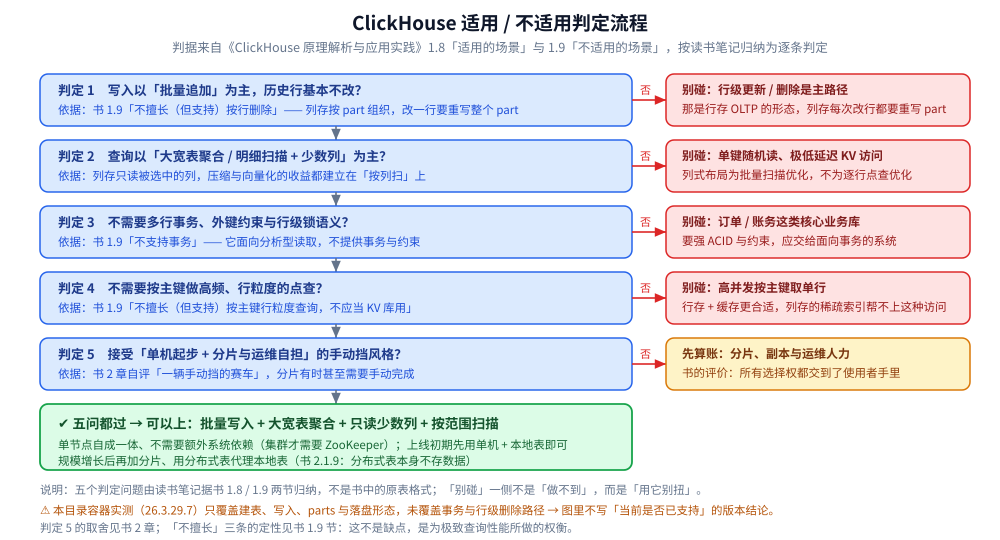

# 定位与适用场景

> 素材来源：《ClickHouse原理解析与应用实践》（朱凯，机械工业出版社 2020 年）第 1 章「ClickHouse 的前世今生」、
> 第 2 章「ClickHouse 架构概述」的读后整理，**按主题归纳而非逐字摘录**；其余整理自个人学习笔记与官方文档，
> 素材见 [素材清单](../../../../素材清单.md)。
>
> ⚠️ 书为 **2020 年**（全书基于 **19.17.4.11** 编写，演示环境 CentOS 7.7），本目录的容器实测为 **26.3.29.7**
> （`clickhouse/clickhouse-server:26.3-alpine`，容器名 `devnotes-ch`，宿主端口 HTTP 18123 → 8123、native 19000 → 9000，
> 时区 UTC）。两者不一致或书里已过时之处（默认值、参数名、目录结构、引擎能力）**逐处标注「书 2020 口径 vs 26.3 实测」**。

---

## 一、ClickHouse 是什么？它填的是哪一个空缺

**本节要点**：先把定位钉死 —— 它是一个**用 SQL 做实时聚合的列式分析库**，用「实时聚合」而不是「预聚合」解决 OLAP 的性能问题；
后面所有「适合 / 不适合」的判断都从这条定位推出来。

### 1.1 书的切入点：经典 OLAP 架构的两条死路

书第 1 章从 BI 的演变讲起（1.1~1.4 节），先把两类经典架构的代价摆出来：

| 架构 | 做法（书的口径） | 代价 |
|---|---|---|
| **ROLAP** | 直接建在关系模型上，常用星型 / 雪花模型，**无预处理** | 海量数据下 `GROUP BY` 性能吃紧；书里反问：上亿行表同时跑数十个字段的 `GROUP BY` 会怎样 |
| **MOLAP** | 多维数组存储，**预先聚合、空间换时间**，只留聚合结果 | 三宗罪：维度组合爆炸导致数据膨胀、预处理带来滞后性、**无法查明细** |
| **HOLAP** | ROLAP 与 MOLAP 的集成 | 书里明确「不再展开」 |

维度组合的代价是可量化的：组合方式数 = **2^N**（N 为维度个数）→ 5 个维度 32 种、9 个维度 512 种；
高基数时立方体预聚合后的数据量可达 **10~20 倍**膨胀，千万级表能膨胀到亿级体量。

⭐ 书由此抛出的问题意识是：**是否存在既用 ROLAP 模型、又有比肩 MOLAP 性能的技术？**
这条悬念就是 ClickHouse 的位置 —— 它选的是**关系模型 + 列式存储 + 实时聚合**这条路，而不是预聚合。

### 1.2 名称、定位语与架构定性

- 名称是 **Click Stream, Data WareHouse** 的缩写（书 1.7 节）。
- 定位语是书的原话：**「其他的开源系统太慢，商用的系统太贵」** —— 它在成本与性能之间取平衡。
- 第 2 章的架构定性：它更像一款**「传统」MPP 架构的数据库**，没有采用 Hadoop 生态常见的 Master-Slave 主从架构，
  而是**多主对等（Multi-Master）网络结构**，同时也是基于关系模型的 **ROLAP** 方案。
- 选型的核心结论在 1.6.4 节：书的取舍倾向**实时聚合**（预聚合有三条难题，见第三节 3.4）。

### 1.3 九项核心特性（书 2.1 节）

**本节要点**：书的说法是「合力」而非单项 —— 九项里任何一项单独看都有别的系统更强，组合起来才有它的位置。

| 特性 | 书的要点 |
|---|---|
| **完备的 DBMS 功能** | 有 DDL / DML / 权限控制 / 数据备份与恢复 / 分布式管理，所以叫 DBMS 而不只是 database |
| **列式存储与数据压缩** | 列存同时减少扫描范围与传输体量；压缩与列存是伴生关系（同一列的数据重复最多、压缩率最高）；落盘时列与列由不同文件分别保存（书注明这主要指 MergeTree 表引擎） |
| **向量化执行引擎** | 书定义为「可以简单地看作一项消除程序中循环的优化」，靠 CPU 的 SIMD 指令在寄存器层面并行；榨汁机比喻是 40 分钟 → 5 分钟 |
| **关系模型与 SQL** | 用关系模型 + 完整 SQL，迁移成本低；⚠️ 书明确 **SQL 解析是大小写敏感的**（`SELECT a` 与 `SELECT A` 语义不同） |
| **多样化的表引擎** | 书称「6 大类 20 多种」表引擎；用信天翁（粗粒度按批、普通硬件）与蜂鸟（细粒度、需高性能硬件）比喻取舍哲学 |
| **多线程与分布式** | SIMD 不适合分支判断多的场景 → 用多线程互补；一条设计原则是「**计算移动比数据移动更划算**」 |
| **多主架构** | Multi-Master 对等，无主控节点，天然规避单点故障，适合多数据中心与异地多活 |
| **在线查询** | 与 Vertica / SparkSQL / Hive / Elasticsearch 的对照（见 2.4 节版本差异） |
| **数据分片与分布式查询** | 本地表（Local Table，等同一份数据的分片）+ 分布式表（Distributed Table，**本身不存数据**，是本地表的访问代理，作用类似分库中间件） |

### 1.4 这九项里哪些口径已经变了（书 2020 口径 vs 26.3 实测）

- **压缩算法**：书写「默认使用 **LZ4** 算法压缩」。26.3 实测的 part 目录里有一个 `default_compression_codec.txt`，
  本次 1000 万行宽表实测压缩比约 **4.6:1**（`bytes_on_disk` 161.8 MB / `data_uncompressed_bytes` 751.4 MB），
  实验记录注为「默认 LZ4 编解码」；⚠️ 该编解码名本身未单独查询核实，不据此断言 26.3 的默认算法。
- **向量化执行依赖的指令集**：书写 19.x 时利用 **SSE4.2** 指令集实现向量化执行。26.3 实测查 `system.build_options`
  里 `USE_SSE42` / `USE_AVX` / `USE_AVX2` / `USE_AVX512` / `USE_BMI` / `USE_LZ4` / `USE_ZSTD` 这些键，
  **一个都没返回行**（该表只返回了 `BUILD_TYPE` / `CXX_COMPILER` / `USE_SSL` / `VERSION_DESCRIBE` / `VERSION_FULL`）
  → 编译开关名在本版本已变，**「当前向量化基线的指令集是什么」不能凭书断言**。
- **表引擎数量**：书 2.1.5 正文称「**6 大类** 20 多种」，紧接着只列举了「合并树、内存、文件、接口和其他」**5 类**，
  第 8 章目录同样只有 5 类 —— 书内自相矛盾。26.3 的真实清单需查 `system.table_engines`，本批实验未采集，**不写数字**。
- **集群结论（1 节点只能 1 分片、分布式表不存数据、1 分片 1 副本至少 2 个节点）**：这些结论集中在本目录的
  [架构与存储引擎.md](架构与存储引擎.md) 第一节，且本批实验**未在集群形态下实测**，只照抄书的口径。
- **在线查询的对照对象**：书 1.5.1 给出的基准是「1 亿数据集体量下，ClickHouse 平均响应速度是 Vertica 的 2.63 倍、
  InfiniDB 的 17 倍、MonetDB 的 27 倍、Hive 的 126 倍、MySQL 的 429 倍、Greenplum 的 10 倍」（官方公布、单节点相同配置）。
  ⚠️ 这是 **2020 年口径**的第三方对比，本仓库不引用它当现状结论，也不复述此类跑分。

## 二、它擅长哪些场景？（书 1.8 节）

**本节要点**：书按行业列清单，但把这些行业抽象一层，共同的技术形状只有一条 ——
**数据量大、以追加写入为主、查询是「带条件的范围扫描 + 聚合」而不是取单行**。

### 2.1 书列的行业

BI、广告 / Web / App 流量、电信、金融、电商、安全、游戏、物联网（书 1.8 节）。

### 2.2 把清单抽象成技术形状

| 书的行业 | 数据形状 | 契合它的哪个设计 |
|---|---|---|
| 广告 / Web / App 流量分析 | 海量埋点事件持续追加，查询多为按维度聚合 | 列式存储 + 实时聚合（不必预先建好立方体） |
| 电信 / 物联网 | 设备与线路持续上报，按对象 + 时间段查 | 分区 + 稀疏索引按范围剪枝（见架构篇第四、五节） |
| 电商 / 金融 / 游戏 | 宽表明细，要求明细可下钻 | 保留明细（对比 MOLAP 只留聚合结果） |
| 安全（日志与审计） | 只追加、不可变的记录 | 追加写入友好，压缩比高 |
| BI 报表 | 查询是 `GROUP BY` + 过滤 | SQL 与关系模型，迁移成本低 |

⭐ 一条判据：**数据是否「以秒级或更高频率、批量地往历史里追加」，而查询只在需要时扫其中的一部分？**
是 → 它的存储布局在为你优化；不是 → 先回到第三节。

### 2.3 书给的两条量级佐证（均为 2020 口径）

- Yandex.Metrica 生产环境的**数据总体压缩比可达 8:1**（未压缩 17PB → 压缩后 2PB）。
- ClickHouse 为 Yandex.Metrica 存储超过 **20 万亿行**数据，**90% 的自定义查询能在 1 秒内**返回。

⚠️ 这两条是书里的生产量级，不是本机实测，也不是当前版本的容量承诺；它们的用处是说明
「列存 + 实时聚合」这条路在真实业务量级上站得住。

## 三、哪些场景明确不适用？（书 1.9 节）

**本节要点**：书只列了三条，但三条指向同一件事 —— 它**不为「点」操作优化，只为「面」扫描优化**。
书对此的定性是：**这不是缺点，是为极致查询性能所做的权衡。**

### 3.1 不支持事务

书 1.9 的第一条：**不支持事务**。因此需要多行 / 多表 ACID、外键约束、行级锁语义的核心业务库不该放在它上面。

### 3.2 不擅长（但支持）按主键行粒度的查询

书明确「不应当把它当 KV 库用」：按主键取单行、且要求低延迟高并发的访问形态，
与「按列批量扫描」的存储布局正好相反（列存的收益来自批量扫描与裁剪）。

### 3.3 不擅长（但支持）按行删除

书 1.9 第三条。原因在架构篇里：数据以**不可变的 part** 为单位落盘，
改一行或删一行都要重写 part，而不是就地修改。

### 3.4 还有一条隐含的「不用它」：为固定报表做预聚合

书 1.6.4 节权衡「预聚合 vs 实时聚合」时，列出预先聚合的三条难题：

1. 只支持固定分析场景，无法满足自定义分析；
2. 维度组合爆炸造成不必要的计算与存储开销（用户不一定用到所有组合）；
3. 流量数据在线实时接收，预聚合还要考虑如何及时更新。

⭐ 结论倾向**实时聚合**：若查询性能有保障，实时聚合是更简洁的架构。所以「需求就是几张固定报表」
这类场景，更适合 MOLAP 一类预聚合引擎，而不是让 ClickHouse 去模拟预聚合。

### 3.5 三条「不擅长」在 26.3 的现状

⚠️ **本批实验未覆盖**：实验 01、02 只采集了环境信息、建表、写入、parts 与落盘形态，
**没有测事务与行级删除路径**。所以下面这些**不给结论**，只列出书自身标记为待核对的方向：

- 1.9 节「不支持事务」—— 26.3 是否有试验性事务支持？
- 1.9 节「不擅长按行删除」—— 除 `ALTER ... DELETE`（Mutation）外是否已有 lightweight delete 路径？

## 四、发展历程：四次换架构，每次是为了解决什么（书 1.6 节）

**本节要点**：书 1.6 的四阶段不是版本迭代，而是**四次换掉数据组织方式**；
每个阶段的遗留痛点正好是下一阶段要解决的对象 —— 这条因果链是理解后面所有设计取舍的源头。

```text
Yandex.Metrica 底层四次换架构（书 1.6 节）：

  MySQL(MyISAM)  ──▶  Metrage  ──▶  OLAPServer  ──▶  ClickHouse
       │               │                │                │
   随机写 + 碎片    KV + LSM 树      关系模型 + SQL   补全为完备 DBMS
   磁盘寻道瓶颈    + 预聚合立方体    + 稀疏索引 + 列存   2016 年开源
                   维度爆炸          只有一种数据类型   倾向实时聚合
```

| 阶段 | 数据模型与索引 | 要解决的痛点 | 遗留的问题 |
|---|---|---|---|
| **MySQL（MyISAM）** | MyISAM 用 B+ 树存索引、数据单独文件 | ——（起点） | 写入来自分布式系统的并行随机写 → 数据物理随机存储 + 磁盘碎片 |
| **Metrage** | 数据模型 **KV 化**、索引换 **LSM 树**、处理方式改**预聚合** | 随机存储导致的查询慢 | 只提供内置的 **40 多种固定分析场景**（自定义分析无解），维度爆炸 |
| **OLAPServer** | 换回**关系模型 + SQL**；索引不完全沿用 LSM，只用其**稀疏索引**；数据文件沿用 LSM 的**数据段**思想；再引入**列式存储** | Metrage 的固定场景与 KV 描述能力不足 | 只有一种数据类型（固定长度数值型）、没有 DDL 等 DBMS 管理功能 → 「只能称为数据库，不能称为 DBMS」 |
| **ClickHouse** | 以 OLAPServer 为基础，目标是**完备的 DBMS** | 补齐 DBMS 能力，并在预聚合与实时聚合之间定取舍 | ——（2016 年开源） |

### 4.1 每个阶段的两个关键洞察

1. **为什么从 B+ 树换到 LSM 树**：书 1.6.1 的量化很有说服力 —— 典型 **7200 转 SATA 磁盘 IOPS 仅约 100**，
   即每秒只能做 100 次随机读；假设一次随机读返回 10 行，查 10 万行至少需要 **100 秒**。
   书由此断言「**按顺序存储的数据会拥有更高的查询性能**」（少磁盘寻道与旋转延迟、可利用 OS 文件缓存预读）。
   LSM 树的机制正是为此：写入只在内存建小树（配预写日志防丢失），小树达阈值由后台线程刷盘成**局部有序**的数据段，
   于是可用**稀疏索引**定位数据段、拿到磁盘顺序读与预读缓存。
2. **为什么最终放弃预聚合**：Metrage 靠立方体预算所有维度组合，换来「固定场景可立即返回」；
   但代价是维度爆炸（2^N）与实时更新的滞后性。OLAPServer 换回关系模型 + 实时聚合后发现
   **查询性能并不比 Metrage 差太多，灵活性却更胜一筹** —— 这就是 ClickHouse 继续走这条路的依据。

### 4.2 书里的量级（⚠️ 均为 2020 口径，不是当前值）

- 截至 **2011 年**，MySQL 中的数据超过 **5800 亿行**；经额外优化后把 **90% 的分析报告控制在 26 秒内**返回。
- 截至 **2015 年**，Metrage 内存储超过 **3 万亿行**，集群规模超 **60 台**服务器，查询性能从 26 秒降到 **1 秒以内**。
- ClickHouse **2016 年**开源；在存储数据**超 20 万亿行**的情况下做到 **90% 的查询在 1 秒内**返回。
- 截至本书完稿，全球范围**接近 400 位贡献者**，发版频率**基本每月一次**，遵循 **Apache License 2.0**。

⚠️ 上面四条是历史事实与 2020 年口径的量级；「贡献者数量、当前发版节奏、官网域名（书里的 `clickhouse.yandex`
是否已迁到 `clickhouse.com`）」都属于**待核对项，本批未核实**，笔记不写结论。

## 五、有谁在用（书 1.10 节）

- **CERN**：用于保存强对撞机试验后记录的**数十亿**事件测量数据，把查找时间**由几个小时缩短到几秒**。
- **CloudFlare**。
- **国内**：头条、阿里、腾讯、新浪。

⚠️ 以上是书 2020 年的使用者案例，本批未核实这些案例的现状与新增典型用户。
本仓库里另一个会遇到 ClickHouse 的地方是可观测性：**Jaeger v2 把 ClickHouse 作为官方原生存储**
（见 [Jaeger.md](../../../../06-工程实践/可观测性/Jaeger.md) 第四节），这是一个「Trace 明细 + 大范围聚合查询」的典型用法。

## 使用：什么条件下该选它、什么条件下别碰它

把需求逐条对照下表。**同一列里「右」出现得多，就说明它不是你该选的第一个系统。**

| 判断问题 | 更该选 ClickHouse | 更该另选系统 |
|---|---|---|
| 写入模式 | 批量追加为主，历史行基本不改 | 频繁行级 UPDATE / DELETE 是主路径 → 行存 OLTP |
| 查询形态 | 大宽表聚合、明细范围扫描、只读少数列 | 单键随机读、极低延迟 KV 访问 → 行存 + 缓存 |
| 数据量 | 单表到亿级且继续增长、成本敏感 | 数据量小、普通关系库足够 |
| 一致性诉求 | 分析型读取即可，不需要多行事务 | 需要多行 ACID 与外键约束 → 关系型 OLTP |
| 延迟目标 | 秒级（书：90% 查询 1 秒内） | 单请求毫秒级 → 换预聚合 / 缓存 / 行存 |
| 建模中心 | 宽表 + 维度聚合 | 实体之间的复杂关系 → 图库或关系型 |
| 明细留存 | 要留明细、随时下钻 | 只要固定报表结果 → 预聚合引擎（MOLAP 一类） |
| 查询语言 | 接受 SQL 生态（迁移成本低） | 要求原系统专有查询语言逐条兼容 |
| 运维投入 | 接受手动分片、自己搭副本与监控 | 要求高度自动化运维 → 托管服务或更自动化的引擎 |



使用建议（下面三步的判定先后顺序不能颠倒，颠倒容易误判）：

1. **先看前三条**（写入模式、查询形态、数据量）—— 它们决定大方向，这三条不对就别往下看；
2. **再看一致性与延迟**—— 需要事务或毫秒级点查时，列存再快也补不回结构错配；
3. **最后看明细留存这条隐藏项**—— 只想「把明细算成几张固定报表」，那么预聚合引擎更省事，
   用 ClickHouse 去模拟立方体，等于把它最贵的灵活性浪费掉。

⚠️ 这张表由读书笔记据书 1.8 / 1.9 / 1.6.4 三处归纳，不是书里的原表格式；
「别碰」一侧不是「做不到」（书明确三条里两条是「不擅长但支持」），而是「用它别扭、代价不划算」。

## 延伸追问

- **它和「传统 MPP 数据仓库」到底像在哪、不像在哪？** → 像在关系模型 + SQL + 列式执行；
  不像在它**没有主控节点**（Multi-Master 对等），且把分片与副本的选择权交给使用者（书自评「一辆手动挡的赛车」）。
- **为什么说它「不需要预聚合」也能快？** → 因为它在**查询时**实时聚合：列存减少要读的字节、向量化减少要执行的循环、
  稀疏索引与分区减少要扫的范围。书 1.6.4 的取舍正是「性能有保障时，实时聚合的架构更简洁」。
- **MOLAP 的立方体膨胀到底多严重？** → 维度组合数是 2^N（5 维 32 种、9 维 512 种），
  书给的经验值是高基数时预聚合后数据量膨胀 **10~20 倍**，千万级表变亿级。
- **「不擅长按行删除」是不是意味着删不了？** → 书用的是「不擅长（但支持）」的措辞；根因是数据以不可变 part 落盘，
  删除要重写 part（见 [架构与存储引擎.md](架构与存储引擎.md) 第四节）。⚠️ 26.3 的删除路径本批未实测。
- **为什么按主键取单行会慢？** → 稀疏索引只为「一段数据」记录区间位置，命中一行也要读回整个 granule
  （默认 8192 行的粒度）；按主键点查属于行存与缓存的强项。
- **它的 SQL 是标准 SQL 吗？** → 是完整 SQL 但不是标准 SQL 的全部，且书明确**解析大小写敏感**；
  关系模型 + SQL 的价值主要在迁移成本低（书 2.1.4）。
- **物联网 / 车联网这类设备上报适合它吗？** → 书 1.8 把物联网列进适用场景；判据仍是「追加写 + 按对象和时间段查」。
- **它能不能当主业务库？** → 书 1.9 第一条就排除：不支持事务。订单、账务这类库应交给面向事务的系统。
- **它和时序数据库、全文检索是什么关系？** → 横向选型不在本篇展开：时序侧见
  [时序数据库选型对比.md](../../时序数据库/时序数据库选型对比.md)，检索与分析两条线见
  [搜索与分析选型对比.md](../../搜索与分析/搜索与分析选型对比.md)。
- **只想看「为什么快」的机制，从哪读起？** → 直接进 [架构与存储引擎.md](架构与存储引擎.md)：
  模块链 → MergeTree 落盘形态 → 索引与数据标记。

## 关联

- [架构与存储引擎.md](架构与存储引擎.md) — 上面每条「为什么」的底层依据：模块链、MergeTree 落盘形态、索引与数据标记、家族引擎
- [存储选型.md](../../存储选型.md) — 七类存储的定位矩阵；第七节是「ClickHouse vs Elasticsearch」的差异表
- [搜索与分析选型对比.md](../../搜索与分析/搜索与分析选型对比.md) — 分析族四路横评（单机列存 / MPP / 实时 OLAP / 湖上分析）与本仓的实测边界
- [时序数据库选型对比.md](../../时序数据库/时序数据库选型对比.md) — 它作为「通用列存自建时序语义」这条路线的代价
- [定位与适用场景.md](../../时序数据库/GreptimeDB/定位与适用场景.md) — 邻居目录里「一库多信号」的另一种定位，便于对照
- [Jaeger.md](../../../../06-工程实践/可观测性/Jaeger.md) — 本仓库里 ClickHouse 的真实落点：Jaeger v2 的官方原生存储
- [可观测性选型.md](../../../../06-工程实践/可观测性/可观测性选型.md) — 可观测性栈层面它适合承载哪一类信号
- [素材清单.md](../../../../素材清单.md) — 本篇素材出处登记
> 反向引用（本篇被下列文档引到）：[写入与数据导入.md](写入与数据导入.md)、[性能调优与基准测试.md](性能调优与基准测试.md)、[数据模型与表设计.md](数据模型与表设计.md)、[物化视图与实时聚合.md](物化视图与实时聚合.md)、[索引原理与查询优化.md](索引原理与查询优化.md)、[选型对比与落地案例.md](选型对比与落地案例.md)、[列式数据库选型对比.md](../列式数据库选型对比.md)
