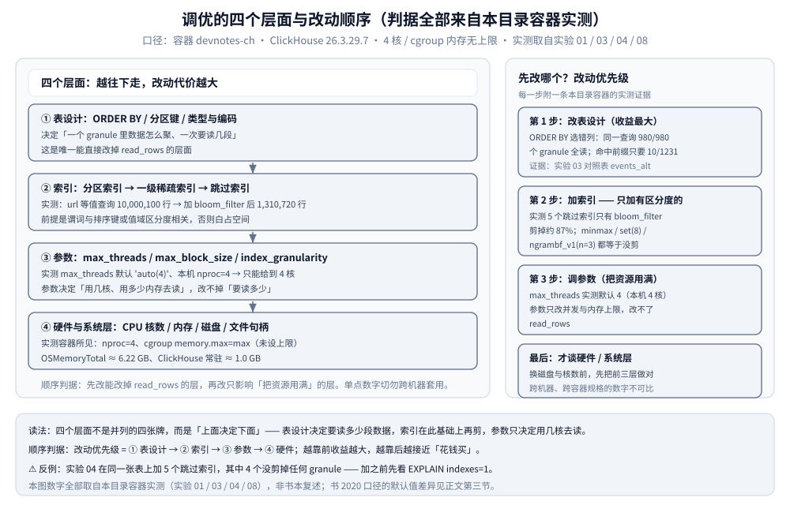
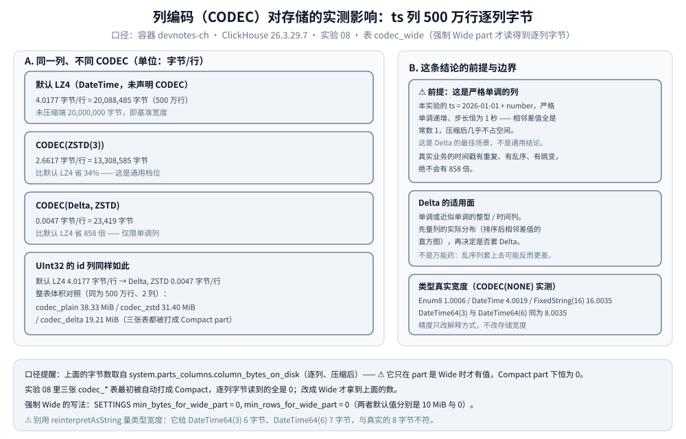
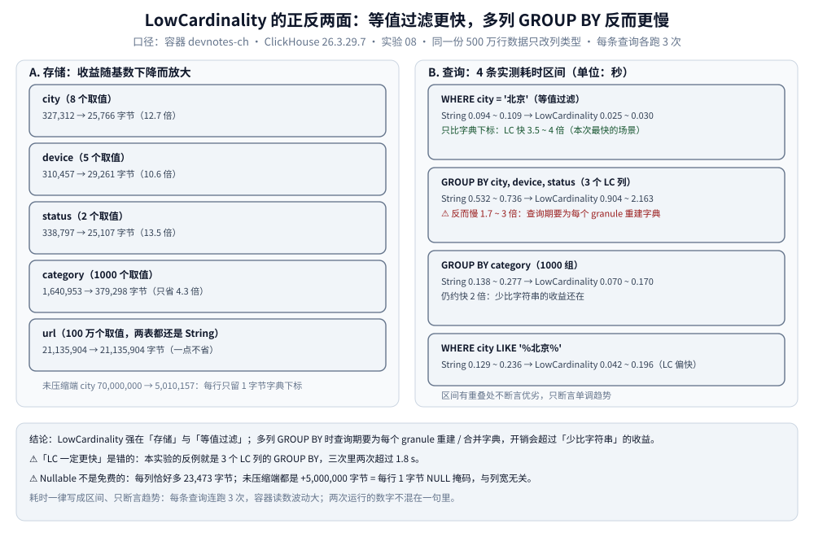

# 性能调优与基准测试

> 本篇覆盖 ClickHouse 的**调优层面与基准测试方法**：性能由哪四个层面决定、用哪几张系统表定位慢查询、关键参数在本目录容器里的实测默认值、压缩与编码对「存储 + 扫描」的代价、`LowCardinality` 的反例、基准测试纪律、`EXPLAIN` 与 `ProfileEvents` 的耗时归因，以及容量规划与常见反模式。
>
> 素材来源：《ClickHouse原理解析与应用实践》（朱凯，机械工业出版社 2020 年）第 11 章「管理与运维」与第 3 章「安装与部署」的读后整理，**按主题归纳而非逐字摘录**；实测读数取自本目录容器（实验 01 / 03 / 04 / 08），素材见 [素材清单](../../../../素材清单.md)。
>
> ⚠️ 书为 **2020 年**（全书基于 **ClickHouse 19.17.4.11** 编写，演示环境 CentOS 7.7），本目录容器实测为 **26.3.29.7**（`clickhouse/clickhouse-server:26.3-alpine`，容器名 `devnotes-ch`，4 核 / cgroup 内存无上限 / 时区 UTC）。凡书里的默认值、参数名、系统表字段与当前不一致之处，本篇逐处标注「**书 2020 口径 vs 26.3 实测**」；本批未采集的项标「**未实测**」，不作断言。

---

## 一、ClickHouse 的性能由哪些层面决定？

**本节要点**：性能问题先分层归因 —— **表设计 → 索引 → 参数 → 硬件**；四层不是并列的四张牌，而是**上面决定下面**，所以「先改哪个」的顺序与「改动代价」正好相反。

### 1.1 四个层面各管什么

| 层 | 管什么 | 26.3 实测证据 |
|---|---|---|
| 表设计 | `ORDER BY` / 分区键 / 类型与编码 / part 粒度 | 同一查询，命中主键前缀只读 **10/1231** 个 granule，`ORDER BY` 选错列读 **980/980**（实验 03） |
| 索引 | 分区索引 → 一级稀疏索引 → 跳过索引 | 加 `bloom_filter` 后 `read_rows` 从 **10,000,100** 降到 **1,310,720**（实验 04） |
| 参数 | `max_threads` / `max_block_size` / `index_granularity` / 熔断 | `max_threads` 默认 `'auto(4)'`，本机 `nproc=4` → 只能给到 4 核（实验 01） |
| 硬件与系统 | CPU 核数 / 内存 / 磁盘 / 文件句柄 | 容器所见 `cgroup memory.max=max`（未设上限）、`OSMemoryTotal ≈ 6.22 GB`（实验 01） |

### 1.2 为什么顺序是「先表设计、再参数」

- 参数层能改变的只有「用几核、花多少内存去读」，它改不掉「要读多少行」。实测 `max_threads` 的默认值 `'auto(4)'` 在本机解析为 **4**，而容器只有 **4 核** —— 也就是说这一层**已经吃满**，再调也没有空间。
- 反过来，表设计层的改动是**数量级**的：命中主键前缀读 **10** 个 granule，`ORDER BY` 选错列的对照表要读 **980** 个（实验 03 的 `events_alt`），相差近两个数量级。
- 索引层介于两者之间：加对了是数量级收益（`read_bytes` 208,889,400 → 27,372,220，约 **1/7.6**），加错了则是**纯成本**（实验 04 里 5 个跳过索引只有 1 个剪掉约 87%）。



图里左栏是四个层面、右栏是「先改哪个」的结论。读法：**从下往上看代价、从上往下看收益** —— 越靠上的层收益越大，越靠下的层越接近「花钱买」；图内每个数字都回指正文对应小节。

---

## 二、怎么用系统表定位慢查询？

**本节要点**：定位慢查询看的是**读了多少**而不是**跑了多久** —— `system.query_log` 给已完成查询的 `read_rows` / `read_bytes`，`system.processes` 给正在跑的查询，`system.parts` 给数据侧的 part 形态与体积。

### 2.1 书 2020 口径：监控三表与五类查询日志

书的 11.5 节把服务监控分成两条路，先是三张系统表：

| 系统表 | 记什么 | 字段 |
|---|---|---|
| `system.metrics` | 运行时**当前正在执行**的高层概要 | `metric` / `value` / `description` |
| `system.events` | **已执行过**的**累积**概要 | `event` / `value` |
| `system.asynchronous_metrics` | **后台异步运行**的概要（含 `jemalloc.*` 系列） | `metric` / `value` |

书里给的示例指标是 `Query` / `Merge` / `PartMutation` / `ReplicatedFetch` / `ReplicatedSend`。第二条路是查询日志：书称「主要有 6 种类型」但只详列了 **5 种**（`query_log` / `query_thread_log` / `part_log` / `text_log` / `metric_log`），并强调 ⚠️ **所有查询日志默认关闭，需在 `config.xml` 里开启**；开启后 ClickHouse 为每种日志自动生成对应系统表。用户级开关写在 profile 里：`<log_queries>1</log_queries>`、`<log_query_threads>1</log_query_threads>`；`query_log` 的 `type`（书 2020 口径）取值为 `QueryStart` / `QueryFinish` / `ExceptionBeforeStart`。

⚠️ **书 2020 口径 vs 26.3 实测**，这一节有两处差异：

- **「查询日志默认全关」在本容器不成立**：实验 03 没有做任何开启动作，`SYSTEM FLUSH LOGS` 之后就能从 `system.query_log` 读到 `QueryFinish` 记录。
- `system.asynchronous_metrics` 在 26.3 实测可用：实验 01 从它取到了 `MemoryResident`（1,006,755,840 字节）与 `OSMemoryTotal`（6,217,281,536 字节）。
- ⚠️ 其余几类日志（`query_thread_log` / `part_log` / `text_log` / `metric_log`）**本批未采集**，它们在 26.3 是否也默认开启**未实测**。

### 2.2 `query_log` 怎么读：打 tag、取 3 次的区间

下面是实验 04 脚本里真实用过的读法 —— `tag` 从 SQL 注释里截出来，靠它把同一批查询聚到一组：

```sql
SELECT substring(query, position(query, '/*SK') + 2, 3) AS tag,
       count() AS runs,
       min(read_rows) AS read_rows_min, max(read_rows) AS read_rows_max,
       min(read_bytes) AS read_bytes_min, max(read_bytes) AS read_bytes_max,
       min(ProfileEvents['SelectedMarks']) AS marks_min, max(ProfileEvents['SelectedMarks']) AS marks_max,
       min(query_duration_ms) AS ms_min, max(query_duration_ms) AS ms_max
FROM system.query_log
WHERE type = 'QueryFinish' AND match(query, '/\*SK[ABCDE]\*/') AND event_time > now() - 600
GROUP BY tag ORDER BY tag;
```

三条读法要点：

- **先 `SYSTEM FLUSH LOGS` 再查** —— `query_log` 有刷盘缓冲（书 2020 口径给的示例值是 `flush_interval_milliseconds` 7500）；
- `type` 要筛成 `QueryFinish`，一次查询在日志里不止一条记录；
- **同一批查询连跑 3 次再取 `min` / `max`** —— 这样拿到的是区间，而不是一次运气好的读数。

### 2.3 三类查询的实测读数（关掉查询条件缓存、各 3 次）

实验 03 的表 `events`（1000 万行，`PARTITION BY toDate(event_time)`、`ORDER BY (city, user_id)`、`index_granularity=8192`）上，`read_rows` 三次完全一致：

| 查询 | read_rows | read_bytes | SelectedMarks | SelectedRanges | 耗时区间（ms） |
|---|---|---|---|---|---|
| `city='北京' AND user_id=123456`（命中主键前缀） | **81,920**（= 10 × 8192） | 339,370 | 10 | 10 | 14 ~ 20 |
| `user_id=123456`（只命中非前缀列） | **1,228,800**（= 150 × 8192） | 4,915,200 | 150 | 140 | 13 ~ 18 |
| 同上查询跑在对照表 `events_alt`（`ORDER BY (event_time)`） | **8,000,000**（全部行） | 21,074,796 | 980 | 36 | 37 ~ 147 |

⭐ 判据：**`read_rows = SelectedMarks × 8192`** 在两个非全扫的例子里精确成立 —— 「读了几个 granule」就等于「读了多少行」。所以**先看 `read_rows` 定位「多读了多少」，再看耗时**：耗时的波动（第三行 **37 ~ 147** ms）比读行数的波动大得多，**只断言趋势**，而且**两次运行的数字不混在一句里**。

### 2.4 数据侧的三张表

| 表 | 看什么 | 本批状态 |
|---|---|---|
| `system.parts` | `partition` / `name` / `part_type` / `rows` / `marks` / `bytes_on_disk` / `primary_key_bytes_in_memory` | ✅ 实测（实验 02、03）；⚠️ 该表**没有** `columns` 列，查它会报 `UNKNOWN_IDENTIFIER` |
| `system.merges` | 正在进行的后台合并 | ⚠️ **未实测**（本批未采集读数） |
| `system.part_log` | 分区级操作日志（合并 / 变更等） | ⚠️ **未实测**（本批未采集读数） |

`system.parts` 的两条实测用法：

- **`OPTIMIZE TABLE events FINAL` 的前后对照**：part 数从 **18** 降到 **10**，`bytes_on_disk` 合计从 **161,802,039** 降到 **160,870,848** 字节（实验 02）；这次合并的耗时实测 **8.259 s**（单次读数，非区间）。
- **同分区可以并存两种 part 形态**：`20260902_56_56_0`（111,953 行 / 1,940,422 字节）是 `Compact`，同一分区的 `20260902_57_57_0`（888,047 行 / 14,305,652 字节）是 `Wide`。这个现象直接引出下一节的读数字陷阱。

---

## 三、必须知道的关键参数与实测默认值

**本节要点**：默认值要**现场查、不要背** —— 本容器里 `max_block_size` 是 **65409**（不是常被误传的 65536）、`max_memory_usage` 是 **0**；建表级的 `min_bytes_for_wide_part` 还会决定「逐列字节读不读得到」。

### 3.1 查询级：`system.settings`（26.3 实测默认）

```sql
SELECT name, value, default FROM system.settings
WHERE name IN ('max_threads', 'max_memory_usage', 'max_block_size', 'max_insert_block_size')
ORDER BY name;
```

```text
max_block_size	65409	65409
max_insert_block_size	1048449	1048449
max_memory_usage	0	0
max_threads	\'auto(4)\'	\'auto(4)\'
```

| 参数 | 实测默认值 | 说明 |
|---|---|---|
| `max_threads` | `'auto(4)'` → `getSetting` 返回 **4** | 默认值是字符串 `auto(N)`；本机 `nproc=4`，所以解析为 4 |
| `max_memory_usage` | **0** | 0 = 不施加查询级上限，实际由服务器 / cgroup 约束 |
| `max_block_size` | **65409** | 不是 65536 |
| `max_insert_block_size` | **1048449** | 与 `max_block_size` 不同，别记混 |

（上面 `\'` 是外层 shell 把双引号包进单引号时留下的转义，原始输出如此。）

### 3.2 建表级：`system.merge_tree_settings`（26.3 实测默认）

```sql
SELECT name, value, default FROM system.merge_tree_settings
WHERE name IN ('index_granularity', 'index_granularity_bytes', 'min_index_granularity_bytes',
               'enable_mixed_granularity_parts', 'min_bytes_for_wide_part', 'min_rows_for_wide_part')
ORDER BY name;
```

| 参数 | 实测默认值 | 影响 |
|---|---|---|
| `index_granularity` | **8192** | 一个 granule 的行数上限，`marks ≈ rows / 8192` |
| `index_granularity_bytes` | **10485760**（10 MiB） | 自适应粒度的字节上限 |
| `min_index_granularity_bytes` | **1024** | 自适应粒度的下限 |
| `enable_mixed_granularity_parts` | **1** | 允许混合粒度 part |
| `min_bytes_for_wide_part` | **10485760**（10 MiB） | 小于它按 `Compact` 存，达到它按 `Wide` 存 |
| `min_rows_for_wide_part` | **0** | 按行数的阈值未启用 |

### 3.3 书 2020 口径的熔断与用量限制

书的 11.3 节把熔断分两类：

- **按时间周期累积用量（`quotas`）**：写在 `user.xml` 里，项是 `duration`（累积周期，秒）/ `queries` / `errors` / `result_rows` / `read_rows` / `execution_time`，**0 = 不限制**；示例配额 `limit_1` 是「3600 秒内只允许 100 次查询」，触发后报 `Quota for user ... has been exceeded. Total result rows: 149, max: 100.` —— 语义是**到下个计算周期开始前该用户都无法继续操作**（不是降级）。
- **按单次查询用量**：配置项写在**用户 profile** 里，超阈值即中断本次查询。⚠️ 书里明确的反直觉点：**单次查询用量的统计以「分区」为最小单元（不是数据行粒度）→ 实际内存用量有可能超过阈值**。

| 参数 | 书 2020 口径 | 26.3 实测 |
|---|---|---|
| `max_memory_usage` | 默认 **10 GB**（10000000000） | 默认 **0** |
| `max_memory_usage_for_user` / `..._for_all_queries` | 默认 0（不限制） | ⚠️ 未实测 |
| `max_partitions_per_insert_block` | 默认 **100** | ⚠️ 未实测 |
| `max_rows_to_group_by` / `group_by_overflow_mode` | 默认 0（不限制）/ `throw` | ⚠️ 未实测 |
| `max_bytes_before_external_group_by` | 默认 0（不限制） | ⚠️ 未实测 |

书里还有一条与查询性能直接相关的负面结论：**使用行级数据权限（`<databases>` 里的 `<filter>`）后，PREWHERE 优化将不再生效**（日志里不再出现 `MergeTreeWhereOptimizer: condition ... moved to PREWHERE`）。它的另一半（PREWHERE 与谓词下推的边界）在 [索引原理与查询优化.md](索引原理与查询优化.md) 第六节。⚠️ 26.3 是否已由 `CREATE ROW POLICY` 取代 XML 写法、这个副作用是否仍在，**本批未实测，不作断言**。

### 3.4 Compact → Wide 的实测陷阱：逐列字节为什么会读到 0

实验 08 踩到的坑，值得单独记一条：**part 是 `Compact` 形态时，`system.parts_columns.column_bytes_on_disk` 恒为 0**。

```text
$ # 三张 codec_* 表只有 2 列、体积小，被自动打成 Compact part
codec_delta	Compact	5000000	19.21 MiB
codec_plain	Compact	5000000	38.33 MiB
codec_zstd	Compact	5000000	31.40 MiB
$ # 此时 system.parts_columns 的逐列字节读不到

$ # 重建时用 SETTINGS 强制 Wide 才拿到数：
CREATE TABLE codec_wide ( ... ) ENGINE = MergeTree ORDER BY id
SETTINGS min_bytes_for_wide_part = 0, min_rows_for_wide_part = 0;
```

- 判据是 `min_bytes_for_wide_part`（26.3 实测默认 **10485760**，即 10 MiB）：**小于阈值打包成 `Compact`，达到阈值按列拆成 `Wide`**；`min_rows_for_wide_part` 实测默认 **0**。
- ⚠️ **看到 0 不是「没数据」，而是「part 形态不对」** —— 读逐列字节之前先查 `part_type`，能省掉一整轮排查。
- 两种形态的落盘差异（`Wide` 每列一个 `.bin`，`Compact` 全部列挤进一个 `data.bin`）见 [架构与存储引擎.md](架构与存储引擎.md) 第三节，本篇不重复。

---

## 四、压缩与编码对「存储 + 扫描」的影响

**本节要点**：CODEC 的收益**完全取决于列的性质** —— 单调时间列上 `Delta, ZSTD` 实测把 `ts` 打到 **0.0047 字节/行**，这是**最佳场景、绝不能当通用结论**；通用档位是 `ZSTD(3)` 的约 **34%**。

### 4.1 实测：同一列换不同 CODEC（`codec_wide`，500 万行）

| 列与写法 | `bytes_on_disk` | 字节/行 | 相对默认 |
|---|---|---|---|
| `ts` 默认 LZ4（`DateTime`） | 20,088,485 | **4.0177** | 基准 |
| `ts` `CODEC(ZSTD(3))` | 13,308,585 | **2.6617** | 省 **34%** |
| `ts` `CODEC(Delta, ZSTD)` | 23,419 | **0.0047** | 省约 **858 倍** |
| `id`（`UInt32`）默认 LZ4 | 20,088,449 | **4.0177** | 基准 |
| `id` `CODEC(Delta, ZSTD)` | 23,422 | **0.0047** | 同上 |

整表体积（同为 500 万行、2 列）：`codec_plain` **38.33 MiB** / `codec_zstd` **31.40 MiB** / `codec_delta` **19.21 MiB**。



图左栏是同一列换编码后的逐列字节，右栏是这条结论的前提与边界。**最该看的是右栏**：858 倍这个数字只在「严格单调、步长恒定」的列上成立，换个分布就完全不成立。

### 4.2 前提必须写清：单调列才有这个效果

本实验的 `ts` 是 **`2026-01-01 + number`**：严格单调递增、步长恒为 1 秒 —— 相邻差值全是常数 1，`Delta` 之后几乎全是 0，所以压缩后几乎不占空间。**这是 `Delta` 的最佳场景。**

真实业务里的时间戳**有重复、有乱序、有跳变**，绝不会有 858 倍。`Delta` 的适用面是「**单调或近似单调的整型 / 时间列**」：要不要用，先量这一列的实际分布（排序后相邻差值的直方图），而不是无脑套上去。

### 4.3 类型真实宽度：用 `CODEC(NONE)` 量，不要用 `reinterpretAsString`

| 类型 | 实测字节/行（`CODEC(NONE)`，500 万行） | 说明 |
|---|---|---|
| `Enum8` | **1.0006** | 1 字节，等价 `UInt8` |
| `FixedString(16)` | **16.0035** | 定长 16 字节，不足补 `\0` |
| `DateTime` | **4.0019** | 秒级，底层 `UInt32` |
| `DateTime64(3)` | **8.0035** | 毫秒级 |
| `DateTime64(6)` | **8.0035** | 微秒级，**与 (3) 同宽** |

两个反直觉点：

- **`DateTime64` 一律 8 字节**（精度 3 与 6 一样宽），因为它底层是 `Decimal64`（实测 `toTypeName(toDecimal64(0, 3))` = `Decimal(18, 3)`）—— 精度只影响**解释方式**，不影响存储宽度；比 `DateTime` 贵一倍。
- ⚠️ **别用 `reinterpretAsString` 量宽度**：它对 `DateTime64(3)` 给出 **6**、对 `DateTime64(6)` 给出 **7**，与真实的 **8** 不符。要给类型占地定量，用 `CODEC(NONE)` + `system.parts_columns` 才准。

### 4.4 编码收益要按列判

- `Enum8` 是本实验最省的列：**23,704 字节 / 500 万行 = 0.0047 字节/行** —— 取值只有 4 种、`ORDER BY id` 又让同值高度聚集，LZ4 几乎压没了。
- 编码只改「同样这些行落盘占多少字节」，**不改读的行数**：它的收益落在 `read_bytes` 与存储成本上。要改 `read_rows`，还得回到表设计与索引（第一节）。

---

## 五、`LowCardinality` 什么时候反而更慢？

**本节要点**：`LowCardinality`（下称 LC）强在**存储**与**等值过滤**；**多列 `GROUP BY` 时它可能反而更慢** —— 「LC 一定更快」是错的，本篇有实测反例。

### 5.1 存储侧：收益随基数下降而放大

同一份 500 万行数据，只把列类型从 `String` 换成 `LowCardinality(String)`，比较 `bytes_on_disk`：

| 列（基数） | `String` | `LowCardinality` | 倍数 |
|---|---|---|---|
| `city`（8 值） | 327,312 | **25,766** | **12.7 倍** |
| `device`（5 值） | 310,457 | **29,261** | **10.6 倍** |
| `status`（2 值） | 338,797 | **25,107** | **13.5 倍** |
| `category`（1000 值） | 1,640,953 | **379,298** | 只 4.3 倍 |
| `url`（100 万值，两表都还是 `String`） | 21,135,904 | 21,135,904 | **一点不省** |

- ⭐ 判据：**`LowCardinality` 强在低基数列** —— 1000 个值的 `category` 只省 4.3 倍，而 100 万值的 `url` 完全不省（字典本身也会变大，还要额外维护字典）。
- 另一个实证细节：`city` 的**未压缩**字节从 **70,000,000** 降到 **5,010,157** —— 每行只留 **1 字节的字典下标**，所以低基数列连压缩都不用就省一大截。

### 5.2 查询侧：等值过滤更快，多列 GROUP BY 反向

各查询连跑 3 次，单位秒：

| 查询 | `String` | `LowCardinality` | 判定 |
|---|---|---|---|
| `WHERE city = '北京'` | 0.094 ~ 0.109 | **0.025 ~ 0.030** | LC **快 3.5 ~ 4 倍**（只比字典下标） |
| `GROUP BY city, device, status`（3 个 LC 列） | 0.532 ~ 0.736 | **0.904 ~ 2.163** | ⚠️ LC **反而慢 1.7 ~ 3 倍** |
| `GROUP BY category`（1000 组） | 0.138 ~ 0.277 | **0.070 ~ 0.170** | LC 约快 2 倍 |
| `WHERE city LIKE '%北京%'` | 0.129 ~ 0.236 | 0.042 ~ 0.196 | LC 偏快（区间有重叠） |

反例那条的原因：多列 LC 列做聚合时，查询期要**为每个 granule 重建 / 合并字典**，分组键列数一多，这部分开销就超过了「少比字符串」的收益。实验里这条查询的 LC 版本**三次中两次超过 1.8 s**。



图左栏是存储侧的倍数（随基数下降放大），右栏是四条查询的耗时区间 —— **右栏第二行就是反例**：同样是 LC 列，等值过滤快 3.5 ~ 4 倍，三列 `GROUP BY` 却慢 1.7 ~ 3 倍。

### 5.3 顺带一条：`Nullable` 不是免费的

- 给列加 `Nullable` 后，**每列恰好多 23,473 字节**（`city` 327,312 → 350,785、`device` 310,457 → 333,930、`price` 19,377,176 → 19,400,649，**三者增量完全相同**）；**未压缩**端都是 **+5,000,000 字节** = **每行多 1 字节的 NULL 掩码**。
- 成本**与列宽无关**：宽列 `price` 的相对增幅只有 0.12%，窄列 `city` 有 7.2%。**能用非空就别用 `Nullable`，尤其别给窄列加**。
- `Nullable` 对**过滤耗时**的影响不明显：`price > 500` 非空 **0.122 ~ 0.374 s** vs Nullable **0.090 ~ 0.294 s**，区间重叠、无一致劣化 —— 代价主要在**存储**与「不能用某些优化」上，不在这一条查询的墙钟上。
- 建表侧的约束（`Nullable` 不能作为索引字段、会派生额外的 null 文件等）见 [数据模型与表设计.md](数据模型与表设计.md) 第二节，本篇只补**实测字节与耗时**。

---

## 六、基准测试怎么做才对？

**本节要点**：基准的第一性原则是**把变量锁死、把读数取成区间** —— 查询条件缓存、part 形态、异步 mutation、冷热缓存，每一个都能让结论作废。

### 6.1 六条纪律

```text
[ ] 1. 做对比前先 SET use_query_condition_cache = 0（否则第二次的 read_rows 会变小）
[ ] 2. 每条查询连跑 3 次，报区间不报单点（同一查询实测 61 / 37 / 147 ms，波动极大）
[ ] 3. 同一句里只引用同一次实验的数字，两次运行的数字绝不混用
[ ] 4. 读逐列字节前先确认 part_type = Wide，否则 column_bytes_on_disk 恒为 0
[ ] 5. ALTER 之后别立刻读计数：MATERIALIZE INDEX 是异步 mutation
[ ] 6. 冷热缓存要显式区分（本批未做冷热对照实验，未实测）
```

### 6.2 书 2020 口径的 `clickhouse-benchmark`（本篇未实测）

书 3.3.2 节介绍的内置基准工具，参数与默认值（书 2020 口径）：

```text
-i / --iterations    SQL 执行次数，默认 0
-c / --concurrency   并发数，默认 1
-r / --randomize     多条 SQL 按随机顺序执行
-h / --host          服务端地址，默认 localhost；可声明两次做对比测试
--confidence         对比测试的置信区间，默认 5（99.5%）
                     取值范围 0(80%) / 1(90%) / 2(95%) / 3(98%) / 4(99%) / 5(99.5%)
```

- 报告字段：**QPS / RPS / MiB/s / result RPS / result MiB/s**，以及 **14 档百分位**（0.000% ~ 99.990%）的查询耗时。
- 对比测试走**抽样**比较两组指标，默认置信区间 **99.5%**；区间内无显著差异时输出 `No difference proven at 99.5% confidence`。
- 书里的示例读数（⚠️ **只是文档示例，不是基准结论**）：单服务 `queries 5, QPS 1112.974, RPS 111297.423, MiB/s 0.849`；对比测试两组 `QPS 848.154` 与 `QPS 1147.579`，结论 `No difference proven at 99.5% confidence`。
- ⚠️ **未实测**：本批没有在 26.3 容器里跑过 `clickhouse-benchmark`，它的参数默认值、报告字段与置信区间口径是否变化，**不作断言**；要用就先现场跑一条。

### 6.3 三个会让读数作废的坑

- ⚠️ **坑一：查询条件缓存。** 不关缓存连跑 3 次，`read_rows` 会**逐次下降**（只过滤 `user_id` 时 1,228,800 → 655,360 → 655,360；对照表全扫时 8,000,000 → 524,288 → 524,288）—— ClickHouse 会把「某 granule 不满足条件」的结论缓存起来。**做基准必须显式 `SET use_query_condition_cache = 0`**。
- ⚠️ **坑二：part 形态。** 见 3.4 节 —— `Compact` part 下逐列字节恒为 0，读到的「0 字节」会被误当成「这列不占空间」。
- ⚠️ **坑三：异步 mutation。** `MATERIALIZE INDEX` 不加 `mutations_sync` 时，`--time` 只量到**入队时间**（实测 0.012 ~ 0.025 s，看着像瞬间完成）；给同一个索引加上 `SETTINGS mutations_sync=1` 后耗时实测 **3.221 s**（单次读数）。**ALTER 之后立刻读 `system.data_skipping_indices` 会读到旧值**（第一遍看到 121 字节，等 mutation 跑完才是 701,441 字节）。
- ⚠️ **冷热缓存**：本批**没有做冷热对照实验**（未实测）。只能给一条纪律 —— 第一轮的数字单独标出来，别和后续轮次混在同一个区间里。

---

## 七、`EXPLAIN` 与 `ProfileEvents` 怎么读：耗时归因

**本节要点**：三个问题要三种读数 —— **该读多少**看 `EXPLAIN indexes=1`，**实际读了多少**看 `query_log` 的 `read_rows` / `read_bytes`，**时间花在哪**看 `ProfileEvents`；三者不能互相替代。

### 7.1 分工：本篇只讲耗时归因

| 想知道 | 用哪个 | 判据 |
|---|---|---|
| 索引**该**剪掉多少 | `EXPLAIN indexes=1` | 各分支的 `Granules: 命中/总数` 与 `Search Algorithm` |
| **实际**读了多少 | `query_log` 的 `read_rows` / `read_bytes` | `read_rows = SelectedMarks × 8192` |
| 时间**花在哪** | `ProfileEvents`（在 `query_log` 里就是一列） | 只能做归因，不能替代上面两个 |

⭐ 前两列的完整读法（`EXPLAIN indexes=1` 的分支骨架、`Skip` 分支怎么判、`Granules` 比值怎么用）在 [索引原理与查询优化.md](索引原理与查询优化.md) 第五节，本篇不重复；这里只讲**耗时归因**这一栏。

### 7.2 `ProfileEvents` 的两个实测反例

（1）⚠️ **`SelectedMarks` 不随跳过索引的剪枝变化**。`bloom_filter` 生效时 `read_rows` 已降到 **1,310,720**（= 160 × 8192，与 `EXPLAIN` 的 `Granules: 160/1230` 对得上），而同一次查询的 `SelectedMarks` **仍报 1231**（未剪枝的全量）；另有 `FilteringMarksWithSecondaryKeysMicroseconds: 13566` 说明二级索引确实执行了。对得上的是 `SelectedRows = 1,310,720`。

→ 判据：**判断跳过索引是否生效，用 `EXPLAIN indexes=1` 的 `Skip` 分支或 `read_rows`，不要用 `SelectedMarks`**。

（2）**耗时类事件只能看趋势**：`query_duration_ms` 是墙钟，受宿主机影响；同一批查询三次读数可以差好几倍（实测 61 / 37 / 147 ms）。所以断言只用 `read_rows` / `read_bytes` 这类**三次完全一致的确定性事实**，耗时只用来判断方向。

### 7.3 本批未采集的项

- ⚠️ **`ProfileEvents` 的完整键名表未采集**：本批只用到 `SelectedMarks`，另有 `SelectedRows` 与 `FilteringMarksWithSecondaryKeysMicroseconds` 出现在实验输出里；`RealTimeMicroseconds` 这类细粒度耗时事件**本篇未实测、不作断言**，需要时用 `SELECT ProfileEvents FROM system.query_log WHERE type = 'QueryFinish' LIMIT 1` 现场看键名。
- ⚠️ `EXPLAIN PLAN` / `EXPLAIN PIPELINE` / `EXPLAIN SYNTAX` / `EXPLAIN AST` 这些形态**本篇未实测**（素材里只有 `EXPLAIN indexes=1`）。

---

## 八、容量规划与常见性能反模式

**本节要点**：容量按「**原始行宽 → 压缩后字节 → part 数 → 内存（索引 + 读缓冲）**」四步粗算；下面几条反模式则都能指回正文的实测。

### 8.1 用实测数字搭一条粗算链条

以实验的 `events` 表（1000 万行）为例：

| 量 | 实测值 | 怎么用 |
|---|---|---|
| `sum(rows)` | 10,000,000 | 行数 |
| `sum(bytes_on_disk)` | 160,870,848 字节（≈ **153.4 MiB**） | 实际落盘体积 |
| `sum(data_uncompressed_bytes)` | 751,431,512 字节（≈ **716.6 MiB**） | 未压缩体积 |
| 压缩比 | **≈ 4.67 : 1** | 上面两者之比 |
| `primary_key_bytes_in_memory` 合计 | **7,400 字节**（约 7.2 KB） | 主键索引几乎不占内存 |

- **磁盘**：每 1000 万行约 **153 MiB** 落盘。⚠️ 线性外推（1 亿行约 1.5 GiB）**未实测** —— 压缩比会随数据分布变。
- **内存**：真正要留的不是索引（7.2 KB 量级），而是**查询读缓冲与聚合中间态**。本容器实测所见：`cgroup memory.max=max`（未设上限）、`OSMemoryTotal ≈ 6.22 GB`、ClickHouse 常驻 `MemoryResident ≈ 1.0 GB`。
- ⚠️ 这只是**单机、无副本、无 ZooKeeper** 的粗算；书也强调跨硬件、跨规模不能直接比数字，别拿它去套集群。

### 8.2 五条反模式

| 反模式 | 为什么错 | 对应的实测 |
|---|---|---|
| 只跑一次就下结论 | 查询条件缓存会让第二次起读数变小 | `read_rows` 1,228,800 → 655,360 → 655,360 |
| 把单机数字套到集群 | 规模、副本、协调组件全变了 | 本容器只有单机 4 核、无副本 |
| 给宽列 / 窄列随手加 `Nullable` | 每列固定 +23,473 字节、每行 +1 字节掩码 | 窄列 `city` 相对增幅 7.2% |
| 无脑上跳过索引 | 与排序键无关的列加了等于没加，还占空间 | 5 个索引只 1 个剪掉约 87% |
| 用 `SelectedMarks` 判断剪枝 | 它实测不随剪枝变化 | `SelectedMarks` 仍报 1231 |

### 8.3 系统层的几个旋钮（书 2020 口径）

- **目录**：书建议把**数据目录**（默认 `/var/lib/clickhouse`）与**日志目录**（默认 `/var/log/clickhouse-server`）改到大容量磁盘挂载路径。
  ⚠️ **书 2020 口径 vs 26.3 实测**：书里给的布局是 `<path>/data/<db>/<table>/<partition>/`，但 26.3 实测 `default` 库是 **Atomic 引擎**，`/var/lib/clickhouse/data/default/` **不存在** —— 数据落在 `/var/lib/clickhouse/store/<uuid>/`，元数据是 `/var/lib/clickhouse/metadata/default.sql`。
- **文件句柄**：`/etc/security/limits.d/clickhouse.conf` 里默认 **262144**（书 2020 口径），也可用 `config.xml` 的 `max_open_files` 改。⚠️ 26.3 的默认值是否仍是 262144，**未实测**。
- **CPU 特性**：书 3.1 节说 **SSE 4.2 是硬门槛**（向量化执行依赖它），不支持就只能源码编译。⚠️ 26.3 是否已按 CPU 特性编译多版本可执行文件，**未实测**。
- **服务守护**：书里是 `service clickhouse-server` 加 `/etc/cron.d/clickhouse-server`（**每 10 秒**用 `condstart` 尝试启动一次）。⚠️ 26.3 是否已改为 systemd unit，**未实测**（容器里根本不走这条路）。

---

## 使用：查慢查询与看 ProfileEvents 的常用 SQL 模板

**本节要点**：下面六段可直接复跑 —— ①② 是「找可疑查询」，③④ 是「量它读了多少」，⑤⑥ 是「归因」。⚠️ 表名 / 列名以你自己的库为准，本批只在 `default.events` 上验证过。

**① 现在正在跑什么**（先看长查询）：

```sql
SELECT query_id, user, elapsed, read_rows, read_bytes, memory_usage, query
FROM system.processes
ORDER BY elapsed DESC
LIMIT 10;
```

⚠️ `system.processes` 的读数**本批未采集**（未实测）；列名先用 `DESCRIBE system.processes` 确认。

**② 最近一小时最慢的查询**：

```sql
SELECT type, query_duration_ms, read_rows, read_bytes, result_rows, memory_usage, query
FROM system.query_log
WHERE event_time > now() - 3600
  AND type = 'QueryFinish'
  AND query NOT LIKE '%system.query_log%'
ORDER BY query_duration_ms DESC
LIMIT 10;
```

**③ 给查询打 tag、跑 3 次后取区间**（基准的最小形态）：

```sql
SET use_query_condition_cache = 0;

SELECT count() /*TAG_slow_1*/ FROM events WHERE url = '/api/v1/item/12345';   -- 连跑 3 次
SYSTEM FLUSH LOGS;

SELECT count() AS runs,
       min(read_rows) AS read_rows_min, max(read_rows) AS read_rows_max,
       min(read_bytes) AS read_bytes_min, max(read_bytes) AS read_bytes_max,
       min(query_duration_ms) AS ms_min, max(query_duration_ms) AS ms_max
FROM system.query_log
WHERE type = 'QueryFinish' AND query LIKE '%TAG_slow_1%' AND event_time > now() - 600;
```

**④ 看 part 形态与体积**（读逐列字节前必须走这一步）：

```sql
SELECT partition, name, part_type, rows, marks, bytes_on_disk, primary_key_bytes_in_memory
FROM system.parts
WHERE database = 'default' AND table = 'events' AND active
ORDER BY partition, name;
```

**⑤ 逐列字节**（只有 `part_type = Wide` 时才有值，见 3.4 节）：

```sql
SELECT column, part_type, column_bytes_on_disk
FROM system.parts_columns
WHERE database = 'default' AND table = 'events' AND active
ORDER BY column_bytes_on_disk DESC;
```

⚠️ 未压缩字节的列名（`column_data_uncompressed_bytes` 之类）本批未记录，用前先 `DESCRIBE system.parts_columns` 核对。

**⑥ ProfileEvents 归因**（`query_log` 里 `ProfileEvents` 本身就是一列）：

```sql
SELECT query_duration_ms, read_rows, read_bytes,
       ProfileEvents['SelectedMarks'] AS marks
FROM system.query_log
WHERE type = 'QueryFinish' AND query LIKE '%TAG_slow_1%';
```

⚠️ 实测教训：`SelectedMarks` **不随跳过索引的剪枝变化**（见 7.2 节），判断剪枝请回看 `EXPLAIN indexes=1` 的 `Skip` 分支或 `read_rows`。

---

## 延伸追问

- **为什么不能一上来就调参数？** → 参数只决定「用几核、花多少内存去读」，改不掉「要读多少行」。实测 `max_threads` 默认 `'auto(4)'` 在本机 4 核上已经吃满；而 `ORDER BY` 选错列会让同一条查询从 10 个 granule 变成 980 个（第一节）。
- **`max_block_size` 的默认值到底是多少？** → 26.3 实测 **65409**，不是常被误传的 65536；同批实测 `max_insert_block_size` 是 **1048449**。默认值请现场查 `system.settings`，不要背。
- **为什么书里说查询日志默认全关，我的容器却能直接查到？** → 书是 19.17 + CentOS 7.7 的默认行为；本容器 26.3.29.7 实测**不做任何开启动作**就能从 `system.query_log` 读到 `QueryFinish`。**先信现场，别信记忆。**
- **为什么书里的 `max_memory_usage` 默认 10 GB，实测却是 0？** → 书 2020 口径是 10 GB（profile 默认值）；26.3 实测 `system.settings` 的默认是 **0**（不施加查询级上限，实际由服务器 / cgroup 约束）。本机尤其明显：容器 `cgroup memory.max=max`，等于把上限交给了宿主机。
- **单次查询的内存限制为什么可能被突破？** → 书里明确：单次查询用量的统计**以「分区」为最小单元**（不是数据行粒度），所以实际内存**可能超过阈值**。⚠️ 这条在 26.3 是否仍成立**未实测**。
- **`system.parts_columns` 的逐列字节为什么全是 0？** → part 是 `Compact` 形态时该字段恒为 0（实验 08 踩到）。先查 `part_type`，必要时用 `SETTINGS min_bytes_for_wide_part = 0, min_rows_for_wide_part = 0` 强制 Wide 重写一遍（见 3.4 节）。
- **`CODEC(Delta, ZSTD)` 省 858 倍，是不是该给所有时间列都加上？** → **不能**。那个数字来自「严格单调、步长恒为 1 秒」的列，是 `Delta` 的最佳场景；真实时间戳有重复、乱序、跳变。适用面是「单调或近似单调的整型 / 时间列」，先量分布再决定（第四节）。
- **`LowCardinality` 到底该不该用？** → 按场景：低基数列的**存储**收益很大（8 个值的 `city` 省 12.7 倍），**等值过滤**也快 3.5 ~ 4 倍；但**多列 `GROUP BY`** 实测反而慢 1.7 ~ 3 倍。100 万取值的 `url` 换成 LC 则一点不省（第五节）。
- **`Nullable` 是不是可以随手加？** → 不是。每列固定多 **23,473 字节**、未压缩端每行多 **1 字节 NULL 掩码**，且**与列宽无关**（窄列相对增幅更大）；它对过滤耗时的实测影响不明显（区间重叠）。能用非空就别用。
- **`ProfileEvents['SelectedMarks']` 能不能判断跳过索引生效了没有？** → **不能**。实测 `bloom_filter` 生效时 `read_rows` 已降到 1,310,720，而 `SelectedMarks` 仍报 1231（第七节）。用 `EXPLAIN indexes=1` 的 `Skip` 分支或 `read_rows` 判断。
- **`clickhouse-benchmark` 现在还是书里那个用法吗？** → ⚠️ **未实测**。书 2020 口径的参数（`-i` 默认 0、`-c` 默认 1、`--confidence` 默认 5）与报告字段（QPS / RPS / MiB/s 加 14 档百分位）**是否变化，本篇不作断言**；要用先现场跑一条。
- **备份能不能代替副本，或者反过来？** → 书里的论断是「**数据副本并不能处理误删数据这类行为**」，所以副本之外仍需备份；按数据规模三选（dump TSV / 快照表 / 分区级 `FREEZE` 硬链接，`FREEZE` 不额外占空间但**不备份元数据**）。⚠️ 26.3 是否已有原生 `BACKUP` / `RESTORE`、`FREEZE` 行为是否变化，**本批未实测**。

---

## 关联

- [索引原理与查询优化.md](索引原理与查询优化.md) — 姊妹篇：它讲「索引怎么用、`EXPLAIN` 怎么读」，本篇讲「参数 / 日志 / 基准方法」
- [数据模型与表设计.md](数据模型与表设计.md) — 建表三要素与 `Nullable` / `LowCardinality` 的取舍约束（本篇只补它们的实测字节与耗时）
- [SQL查询与优化.md](SQL查询与优化.md) — 同目录：查询级 `SET` 与建表 `SETTINGS` 的写法、同一条查询的三种命运
- [架构与存储引擎.md](架构与存储引擎.md) — `Wide` / `Compact` 两种 part 形态的落盘差异与 MergeTree 家族
- [写入与数据导入.md](写入与数据导入.md) — 写入侧参数（`max_insert_block_size`、`max_partitions_per_insert_block`）与批量导入
- [物化视图与实时聚合.md](物化视图与实时聚合.md) — 把聚合成本前置到写入侧，是查询调优的另一条路
- [定位与适用场景.md](定位与适用场景.md) — 动手调优前先确认这个场景该不该用 ClickHouse
- [性能调优与基准测试.md](../../时序数据库/GreptimeDB/性能调优与基准测试.md) — 同题异构：另一款时序库的调优抓手与 TSBS 基准口径
- [性能调优与基准测试.md](../../时序数据库/VictoriaMetrics/性能调优与基准测试.md) — 同题异构：对照它的缓存与查询护栏参数
- [参数调优.md](../../关系型/MySQL/参数调优.md) — 另一个数据库的参数调优口径（同类问题的行存视角）
- [数据库选型对比.md](../../数据库选型对比.md) — 存储在系统中的横向定位
- [位图与布隆过滤器.md](../../../../02-计算机基础/数据结构/高级数据结构/位图与布隆过滤器.md) — 跳过索引里 `bloom_filter` 的底层结构
- [Jaeger.md](../../../../06-工程实践/可观测性/Jaeger.md) — ClickHouse 作为 Trace 后端时的查询侧性能账
- [素材清单.md](../../../../素材清单.md) — 本篇素材的登记
> 反向引用（本篇被下列文档引到）：[选型对比与落地案例.md](选型对比与落地案例.md)、[集群与高可用.md](集群与高可用.md)、[列式数据库选型对比.md](../列式数据库选型对比.md)
