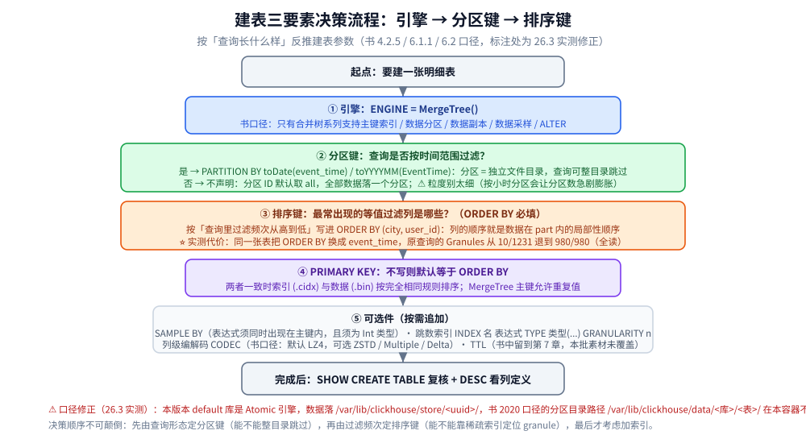
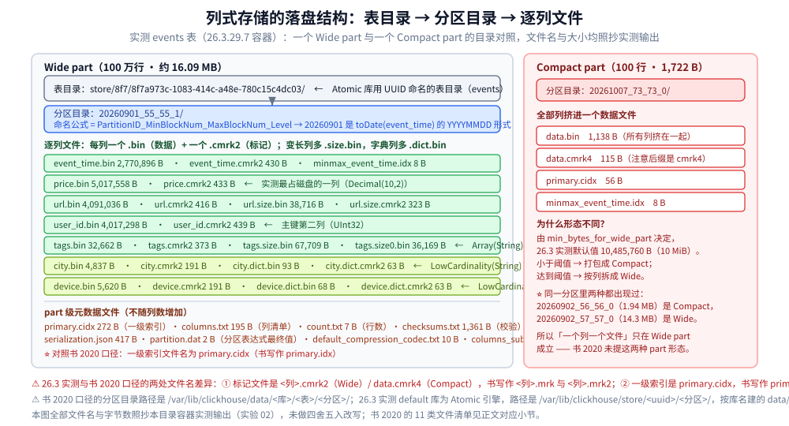

# 数据模型与表设计

> 素材来源：《ClickHouse原理解析与应用实践》（朱凯，机械工业出版社 2020 年）第 4 章「数据定义」、第 5 章「数据字典」、第 6 章「MergeTree 原理解析」的读后整理，**按主题归纳而非逐字摘录**；其余整理自个人学习笔记与官方文档，素材见 [素材清单](../../../../素材清单.md)。
>
> ⚠️ 书为 **2020 年**（全书基于 **ClickHouse 19.17.4.11** 编写，演示环境 CentOS 7.7），本目录的容器实测为 **26.3.29.7**（`clickhouse/clickhouse-server:26.3-alpine`，容器名 `devnotes-ch`，时区 UTC）。凡书里的默认值、参数名、系统表字段、文件名、类型能力与当前不一致或已过时之处，本篇逐处标注「**书 2020 口径 vs 26.3 实测**」。书中表格与配图在 PDF 抽取时大量丢失（表 4-1~4-5、表 5-1~5-4、表 6-1，以及第 4/6 章全部配图），凡素材缺失处标「**书中该处 PDF 抽取不清**」，不作补写。

---

## 一、ClickHouse 的数据类型分哪三类？

**本节要点**：类型系统只分三档 —— **基础类型**（能描述数据即可，比常规数据库更精简）、**复合类型**（其他数据库原生不具备，表达力更强）、**特殊类型**（场景很少，需慎用）。两条反直觉的事实：**没有 Boolean 类型**，**没有时间戳类型**。

### 1.1 三类划分与基础类型全景

书 4.1 节按「基础 / 复合 / 特殊」三档划分：基础类型是**数值、字符串、时间**三种（使 ClickHouse 具备描述数据的基本能力，**比常规数据库更精简**）；复合类型是 **Array、Tuple、Enum、Nested** 四种（常规数据库通常原生不具备）；特殊类型是 **Nullable、Domain（IPv4 / IPv6）**（使用场景较少、各有代价）。三类基础类型的全貌（照抄书 4.1.1 节，表格内容缺失处按正文线索补全）：

```text
数值
  整数：Int8 / Int16 / Int32 / Int64（末尾数字 = 占用字节，8 位 = 1 字节，有符号）；无符号加前缀 U
  浮点：Float32（单精度）、Float64（双精度）
  定点：Decimal32(S) / Decimal64(S) / Decimal128(S)（简写）、Decimal(P,S)（原生）；P 取 1～38、S 取 0～P
字符串
  String        长度不限、无须声明大小，代替 Varchar/Text/Clob/Blob；不限定字符集
  FixedString(N) 定长字符串，末尾用 null 字节填充（对比 Char 通常用空格填充）
  UUID          32 位，格式 8-4-4-4-12；写入时未被赋值则依格式用 0 填充
时间
  DateTime 精确到秒；DateTime64 在其上增加亚秒精度（如 DateTime64(2)）；Date 只精确到天
```

- ⚠️ **没有 Boolean 类型**，可用整型的 `0` / `1` 替代；**没有时间戳类型、时间类型最高精度是秒**，处理毫秒、微秒只能借助 `UInt` 类型实现（均为书 2020 口径）。26.3 是否仍无时间戳类型、是否新增 `Bool` / `Decimal256`，本书未涉及，本篇不予断言。
- **浮点有效精度**：`Float32` 从**小数点后第 8 位**起、`Float64` 从**小数点后第 17 位**起产生数据溢出；另支持 `inf`（`0.8/0`）、`-inf`（`-0.8/0`）、`nan`（`0/0`）。
- `Decimal128` 是**软件层面模拟实现**（现代 CPU 只支持 32/64 位），速度明显慢于 `Decimal32` / `Decimal64`；`Decimal32/64/128` 与 `Decimal(P,S)` 的简写对应关系在书表 4-4 中，**书中该处 PDF 抽取不清**。**四则运算后 S 的变化**（⚠️ 书表 4-5 **PDF 抽取不清**，以下由正文示例反推）：加、减取两者 S 的**最大值**；乘取 S 的**和**；除取**被除数的 S**，且要求被除数 S 大于除数 S，否则报错。

### 1.2 复合类型：Array、Tuple、Enum 与最容易误解的 Nested

- **`Array`**：常规写法 `array(T)`，简写 `[T]`；**表字段定义时必须指定元素类型**（`c1 Array(String)`）。
- **`Tuple`**：1~n 个元素，元素间**允许不同类型且不要求兼容**；写入做类型检查（`('abc',123)` 可行，`('abc','efg')` 报错）。
- **`Enum`**：`Enum8 = (String:Int8)`、`Enum16 = (String:Int16)`；**Key 与 Value 都不允许重复**、都不能为 `Null`（但 Key 允许空字符串）；写入只用 Key 字符串，排序 / 分组 / 去重 / 过滤时用 Int 型的 Value（性能考虑）。
- **`Nested`**：⭐ **本质是多维数组结构，不是一对一的包含关系**。按字面理解写 `INSERT INTO nested_test VALUES ('nauu',18, 10000, '研发部')` 会得到 `Type mismatch ... Expected: Array(UInt8). Got: UInt64` —— 期望写入的是一个数组。

```text
Nested 三条规则：
1. 嵌套表中的每个字段都是一个数组；
2. 行与行之间数组的长度无须对齐；
3. 同一行内每个数组字段长度必须相等 —— 否则抛 Elements 'dept.id' and 'dept.name' of Nested data structure 'dept' (Array columns) have different array sizes.
```

访问用点符号（`SELECT name, dept.id, dept.name FROM nested_test`）；**每个字段的嵌套层级只支持一级**。类型推断原则是「**以最小存储代价为原则**」：`array(1,2)` → `Array(UInt8)`，`[1, 2, null]` → `Array(Nullable(UInt8))`，`tuple(1,'a',now())` → `Tuple(UInt8, String, DateTime)`；同一数组可含多种类型（`[1, 2.0]`）但**必须彼此兼容**（`[1,'2']` 报错）。

### 1.3 特殊类型：Nullable 与 Domain

- **`Nullable`**：不是独立类型，是**辅助修饰符**，需与基础类型搭配；**不能用于数组和元组等复合类型**。代价见第二节。
- **`Domain`**：`IPv4` 基于 `UInt32` 封装、`IPv6` 基于 `FixedString(16)` 封装；**不支持隐式自动类型转换**，需显式调用 `IPv4NumToString` / `IPv6NumToString`。

---

## 二、Nullable、LowCardinality、DateTime64 怎么取舍？

**本节要点**：`Nullable` 要付「一倍的额外文件操作」代价，**且不能作为索引字段** —— 这是最该记住的设计约束；`LowCardinality` 书 4.1 节根本没讲，只能靠实测落盘文件佐证。

### 2.1 Nullable 的额外代价（书 4.1.3 节原文）

> 正常情况下，每个列字段的数据会被存储在对应的 **`[Column].bin`** 文件中。
> **一个列字段被 Nullable 修饰后，会额外生成一个 `[Column].null.bin` 文件专门保存它的 Null 值** ——
> 这意味着在读取和写入数据时，**需要一倍的额外文件操作**。

配套的三条限制与结论：Nullable **只能和基础类型搭配使用**、**不能用于数组和元组这些复合类型**、⭐ **不能作为索引字段**，因此**应该慎用 Nullable 类型**，否则会使查询和写入性能变慢。26.3 的旁证：实测 `LowCardinality(String)` 列会额外出现 `city.dict.bin` 这类字典文件，说明「特殊修饰符派生额外文件」的机制在本版本仍成立；但 26.3 是否仍为 `Nullable` 生成 `<列>.null.bin`、以及「不能作为索引字段」是否放宽，本篇未实测，**不作断言**。

### 2.2 LowCardinality：书 4.1 未涵盖，靠实测佐证

⚠️ **书 4.1 节完全没有出现 `LowCardinality`**（连同 `Map`、`JSON`、`AggregateFunction` 等类型一并缺席）。因此只在「实测证据」范围内记一条：实测 `events` 表里 `city` 只有 **8** 个不同值、`device` 只有 **5** 个；落盘时两列各多出一对字典文件（`city.dict.bin` 93 B + `city.dict.cmrk2` 63 B，`device.dict.bin` 68 B + `device.dict.cmrk2` 63 B）；对照 `user_id.bin`（4,017,298 B），`city.bin` 只有 **4,837 B**、`device.bin` 只有 **5,620 B**。由此可证的只有一句：**低基数列用 `LowCardinality` 后落盘体积极小、并派生字典文件**。

### 2.3 DateTime 与 DateTime64

| 类型 | 精度 | 书的要点 |
|---|---|---|
| `DateTime` | 秒 | 含时、分、秒，**支持字符串形式写入** |
| `DateTime64` | 亚秒（如 `DateTime64(2)`） | 在 DateTime 之上增加精度设置，可记录亚秒 |

⚠️ **书内不一致**：4.1.1 节 `DateTime64` 示例中 `toTypeName(c1)` 的返回值原文写作 **`DateTime`**（按语义应为 `DateTime64(2)`）—— **原文抽取不清或书中笔误**，本篇照抄保留、不擅自更正；26.3 的真实返回值本篇未实测。

---

## 三、建表的三要素怎么配合？

**本节要点**：真正决定「数据怎么放、查询怎么快」的是三个子句 —— `ENGINE`（只能用合并树家族）、`PARTITION BY`（纵向切目录）、`ORDER BY`（决定 part 内排序与一级索引）。三者按「查询长什么样」反推，顺序不可颠倒。

### 3.1 建表语法与五类子句

书 6.1.1 节的建表语法（原文成块保留）：

```sql
CREATE TABLE [IF NOT EXISTS] [db_name.]table_name (
    name1 [type] [DEFAULT|MATERIALIZED|ALIAS expr],
    ...省略
) ENGINE = MergeTree()
[PARTITION BY expr]
[ORDER BY expr]
[PRIMARY KEY expr]
[SAMPLE BY expr]
[SETTINGS name=value, ...省略]
```



各子句的选填性与默认值（书 6.1.1 节 + 26.3 实测 `system.merge_tree_settings`）：

| 子句 / 参数 | 选填 | 默认值 | 说明 |
|---|---|---|---|
| `ENGINE` | 必填 | — | 只有**合并树（MergeTree）系列**支持主键索引 / 数据分区 / 数据副本 / 数据采样，也只有它支持 ALTER（书 6 章开篇） |
| `ORDER BY` | **必填** | — | 排序键；指定**单个数据片段内**数据以何种标准排序，多列时按元组顺序逐列排序 |
| `PRIMARY KEY` | 选填 | **默认与 ORDER BY 相同** | 声明后依主键字段生成一级索引；**MergeTree 主键允许存在重复数据** |
| `PARTITION BY` | 选填 | 不声明则分区 ID 为 **`all`** | 分区键；支持单列、元组多列、列表达式 |
| `SAMPLE BY` | 选填 | — | 抽样表达式；**若使用，主键配置中也须声明同样的表达式** |
| `index_granularity` | 选填 | **8192**（26.3 实测同值） | 索引粒度，每间隔 8192 行才生成一条索引 |
| `index_granularity_bytes` | 选填 | **10M**（26.3 实测 10485760） | **自适应索引间隔**，按每批次写入体量动态划分；设为 0 表示不启动 |

⚠️ 书 6.1.1 节还列了 `enable_mixed_granularity_parts`（是否开启自适应索引间隔，26.3 实测默认 1）、`merge_with_ttl_timeout`（**19.6 起**）与 `storage_policy`（**19.15 起**），后两者详解在第 7 章、**本批素材未覆盖**，本篇不展开。

### 3.2 ORDER BY 与 PRIMARY KEY 是什么关系？

主键用 `PRIMARY KEY` 显式定义时，MergeTree 依 `index_granularity` 间隔（默认 8192 行）生成一级索引存入 `primary.idx`，**索引数据按 PRIMARY KEY 排序**；更常见的简化写法是**用 `ORDER BY` 指代主键**，此时 PRIMARY KEY 与 ORDER BY 定义相同，**索引与数据按完全相同的规则排序**。因此设计时的实际抓手是 `ORDER BY` —— 它既决定 part 内的局部排序，又默认决定一级索引；`PRIMARY KEY` 只有在「想和排序键取不同列」时才需要单独写。

### 3.3 分区键与分区 ID 的四种生成规则

先澄清概念：**数据分区（partition）与数据分片（shard）是完全不同的两个概念** —— 分区是对**本地数据**的**纵向切分**，分片是对数据的**横向切分**；分区**不能把一张表的数据分布到多个节点**。

```text
分区 ID 的四种生成规则（书 6.2.1 节）：
① 不指定分区键 → 分区 ID 默认为 all，所有数据写入这个 all 分区；
② 整型（兼容 UInt64）且无法转 YYYYMMDD → 取该整型的字符形式；
③ 日期类型，或能转 YYYYMMDD 的整型 → 按 YYYYMMDD 格式化后的字符形式；
④ 其他类型（String、Float 等）→ 通过 128 位 Hash 算法取 Hash 值；
   多字段用元组、多 ID 用 `-` 拼接，例 PARTITION BY (length(Code), EventTime) → 2-20190501。
```

### 3.4 分区目录的命名公式与生命周期

**命名公式是 `PartitionID_MinBlockNum_MaxBlockNum_Level`**，以书的示例 `201905_1_1_0` 拆解：`PartitionID` = `201905`；`MinBlockNum` / `MaxBlockNum` 是**整型自增长编号**、单表内全局累加、**n 从 1 开始**，每新建一个分区目录 n 就 +1，对新目录而言 **Min = Max = n**（⚠️ 书特别提示：这里的 BlockNum **与「压缩数据块」毫无关系**）；`Level` 是**合并的层级**（「分区年龄」），**不是全局累加** —— 新目录初始为 **0**，同分区每次合并 **+1**。合并时三项取值：Min 取同分区内最小、Max 取最大、Level 取最大 **+1**；示例 `201905_1_1_0` + `201905_2_2_0` → **`201905_1_2_1`**。目录生命周期的四条关键事实（书 6.2.3 节）：① 分区目录**不是建表就存在**，而是**数据写入过程中被创建**，表里没数据就没有任何分区目录；② **每一批数据写入（一次 INSERT）都生成一批新的分区目录**，即便不同批次属于相同分区也生成不同目录 → 同一分区会有多个目录；③ **写入后 10~15 分钟**（或手动 `optimize`）由后台任务把属于相同分区的多个目录合并成一个（⚠️ **书 2020 口径，本批未实测**）；④ 旧目录不会立即删除（**书口径默认 8 分钟后**才由后台任务删除），期间**不再是激活状态（`active=0`），查询时会被自动过滤掉**。

### 3.5 26.3 实测：目录命名、part 形态与文件名的三处修正

本目录实测 `events` 表（1000 万行，`PARTITION BY toDate(event_time)`，`ORDER BY (city, user_id)`，`index_granularity=8192`），`system.parts` 真实输出如下（实验 02、03）：

```text
$ clickhouse-client -q "SELECT partition,name,part_type,rows,marks,bytes_on_disk,primary_key_bytes_in_memory FROM system.parts WHERE database='default' AND table='events' AND active ORDER BY partition,name FORMAT PrettyCompactMonoBlock"
    ┌─partition──┬─name─────────────┬─part_type─┬────rows─┬─marks─┬─bytes_on_disk─┬─primary_key_bytes_in_memory─┐
 1. │ 2026-09-01 │ 20260901_55_55_0 │ Wide      │ 1000000 │   124 │      16086941 │                         740 │
 2. │ 2026-09-02 │ 20260902_56_56_0 │ Compact   │  111953 │    15 │       1940422 │                         195 │
 ...  (共 18 个 part)
18. │ 2026-09-10 │ 20260910_72_72_0 │ Wide      │ 1000000 │   124 │      16086939 │                         740 │
```

三条读数：`OPTIMIZE` 前是 **18 个 part**（不是直觉上的 10 天 = 10 part）；`OPTIMIZE TABLE events FINAL` 用 **8.259 s** 合并后变成 **10 个 part**、每分区恰好 1,000,000 行；一个 100 万行 part 的主键索引常驻内存仅 **740 字节**。

part 形态与文件名上，26.3 实测与书 2020 口径有三处必须标出的差异：

| 项 | 书 2020 口径 | 26.3 实测 |
|---|---|---|
| 列标记文件 | `<列>.mrk` / `<列>.mrk2` | **`<列>.cmrk2`**（Wide）；Compact 用 `data.cmrk4` |
| 一级索引文件 | `primary.idx` | **`primary.cidx`** |
| part 形态 | 未提及 Compact / Wide 之分 | 每列一个 `.bin` 只在 **Wide part** 成立；小批（100 行）写入产生 **Compact part**，全部列挤进一个 `data.bin` |

Compact 与 Wide 的判据是 `min_bytes_for_wide_part`（26.3 实测默认 **10485760**，即 10 MiB）：小于阈值打包成 Compact，达到阈值按列拆成 Wide；实测里**同一分区里两种都出现过**（`20260902_56_56_0` 1.94 MB 是 Compact，同分区 `20260902_57_57_0` 14.3 MB 是 Wide）。



⚠️ 另两处口径差异：目录路径上，书 2020 是 `/var/lib/clickhouse/data/<库>/<表>/<分区>/`，26.3 实测 `default` 库是 **Atomic 引擎**，数据落在 `/var/lib/clickhouse/store/<uuid>/<分区>/`，**按库名建的 `data/default/` 目录不存在**；系统表上，书里用的 `columns`、`system.tables.path` 在 26.3 都会报 `UNKNOWN_IDENTIFIER`，可用字段是 `partition` / `name` / `part_type` / `rows` / `marks` / `bytes_on_disk` / `active` / `primary_key_bytes_in_memory`，表路径走 `system.tables.data_paths`。

---

## 四、默认值表达式 DEFAULT / MATERIALIZED / ALIAS 差在哪？

**本节要点**：三者名字都带「默认值」，但在**写入、查询、存储**三个维度上表现完全不同 —— 记住一张三维表即可（书 4.2.3 节）。

| 维度 | DEFAULT | MATERIALIZED | ALIAS |
|---|---|---|---|
| **数据写入** | **可以**出现在 INSERT 中 | **不能**被显式赋值（只能靠计算取值） | **不能**被显式赋值 |
| **数据查询** | **可以**通过 `SELECT *` 返回 | **不会**出现在 `SELECT *` 结果集 | **不会**出现在 `SELECT *` 结果集 |
| **数据存储** | **支持持久化** | **支持持久化** | **不支持持久化**，取值总靠计算产生，**数据不落磁盘** |

- 为 MATERIALIZED 字段显式写入会报 `Cannot insert column URL, because it is MATERIALIZED column.`；修改默认值用 `ALTER TABLE [db_name.]table MODIFY COLUMN col_name DEFAULT value`，**不会影响表内先前已存在的数据**（⚠️ 合并树表引擎中主键字段无法被修改，某些引擎如 TinyLog **完全不支持修改**）。
- **类型推断**：字段一旦定义了默认值，**便不再强制要求定义数据类型**；若同时定义了数据类型与默认值，**以明确定义的数据类型为主**。例：`c1 DEFAULT 1000` 推断为 **UInt16**；`c2 String DEFAULT c1` 类型取 **String**。

---

## 五、临时表、普通视图与物化视图怎么选？

**本节要点**：临时表是会话级的临时容器；普通视图只是查询映射（**对性能无任何增强**）；物化视图才有独立存储、才可能提速。

书 4.2.4 节的临时表 —— `CREATE TEMPORARY TABLE [IF NOT EXISTS] table_name ( ... )`，三条特性：**生命周期会话绑定**（会话结束即失效）、**只支持 Memory 表引擎**、**不属于任何数据库**（所以建表语句里既没有数据库参数也没有表引擎参数）；⚠️ **同名时临时表的优先级大于普通表**。

| | 普通视图 | 物化视图 |
|---|---|---|
| 存储 | **不存储任何数据**，只是一层 SELECT 查询映射 | **拥有独立存储**、**支持表引擎**；用 **`.inner.`** 前缀命名，删除用 **`DROP TABLE`** |
| 性能 | **对查询性能不会有任何增强** | 源表被写入新数据会**同步更新**；本质是一张特殊的数据表 |
| 初始化 | — | **`POPULATE`** 决定初始化：带 → 创建时连带导入源表已有数据；不带 → 创建后没有数据，只同步此后写入的 |
| 删除同步 | — | ⚠️ **物化视图目前并不支持同步删除** —— 源表删数据后，物化视图的数据**仍会保留** |

视图语法（书 4.2.6 节，⚠️ `CREATE [MATERIALIZED] VIEW` 的方括号在原文中**丢失**、写作 `CREATE MATERIALIZED] VIEW`，此处按语义补回）：

```sql
CREATE VIEW [IF NOT EXISTS] [db_name.]view_name AS SELECT ...           -- 普通视图
CREATE [MATERIALIZED] VIEW [IF NOT EXISTS] [db.]table_name             -- 物化视图（TO / ENGINE 两条路径）
    [TO [db.]name] [ENGINE = engine] [POPULATE] AS SELECT ...
```

---

## 六、表结构与数据分区怎么改？

**本节要点**：`ALTER` 的第一道门槛在引擎 —— 书 4.3 节「只有 **MergeTree、Merge 和 Distributed** 三类表引擎支持 ALTER」，书 4.4 节「只有 **MergeTree 系列**支持数据分区」。

### 6.1 表结构操作

```sql
-- 追加新字段（旧数据用默认值补全；⚠️ 原文 AFTER name_after] 的方括号丢失，按 SQL 语法补回）
ALTER TABLE tb_name ADD COLUMN [IF NOT EXISTS] name [type] [default_expr] [AFTER name_after]
-- 修改数据类型或默认值（实质调用 toType 转型方法，不兼容则失败）
ALTER TABLE tb_name MODIFY COLUMN [IF EXISTS] name [type] [default_expr]
-- 删除字段（列被删除后，它的数据也会被连带删除）；另有 COMMENT COLUMN 修改字段备注
ALTER TABLE tb_name DROP COLUMN [IF EXISTS] name
-- 移动 / 重命名（⚠️ 只能在单个节点范围内）/ 清空
RENAME TABLE [db11.]tb11 TO [db12.]tb12, [db21.]tb21 TO [db22.]tb22, ...
TRUNCATE TABLE [IF EXISTS] [db_name.]tb_name
```

书里的失败示例：`MODIFY COLUMN IP IPv4` 可行，但 `MODIFY COLUMN OS UInt32` 会报 `Cannot parse string 'mac'`（原值不是数字）。

### 6.2 数据分区操作

书 4.4 节把分区操作分成查询 / 删除 / 复制 / 重置 / 卸载装载五类，备份还原留第 11 章：

```sql
-- 查询分区信息
SELECT partition_id,name,table,database FROM system.parts WHERE table = 'partition_v2'
-- 删除指定分区（配合重新写入即可达到数据更新目的）
ALTER TABLE tb_name DROP PARTITION partition_expr
-- 复制分区数据（A 表分区复制到 B 表）——⚠️ 前提：两表分区键相同、表结构完全相同
ALTER TABLE B REPLACE PARTITION partition_expr FROM A
-- 重置分区数据（默认值表达式优先，否则用类型默认值，如 String 默认空串）
ALTER TABLE tb_name CLEAR COLUMN column_name IN PARTITION partition_expr
-- 卸载与装载分区
ALTER TABLE tb_name DETACH PARTITION partition_expr
ALTER TABLE tb_name ATTACH PARTITION partition_expr
```

⚠️ 卸载的两个注意点（书 4.4.5 节）：分区被卸载后**物理数据并没有删除**，而是被转移到当前数据表目录的 **`detached` 子目录**下；一旦进入 `detached`，就**脱离了 ClickHouse 的管理，ClickHouse 并不会主动清理这些文件** —— 除非主动删除或用 `ATTACH` 重新装载。

### 6.3 删除与修改：Mutation 的真实实现

**ClickHouse 的 DELETE 与 UPDATE 被称为 Mutation，可看作 ALTER 语句的变种。** 三条定性：**很重**（更适合批量数据）、**不支持事务、无法回滚**、**异步的后台过程**（提交后立即返回，进度靠 `system.mutations` 查询，`is_done = 1` 表示完毕）。语法与进度查询：

```sql
ALTER TABLE [db_name.]table_name DELETE WHERE filter_expr
ALTER TABLE [db_name.]table_name UPDATE column1 = expr1 [, ...] WHERE filter_expr
SELECT database, table, mutation_id, block_numbers.number as num, is_done FROM system.mutations
```

物理执行形态：每执行一条 `ALTER DELETE` 都会在表根目录以 `mutation_id` 为名生成日志文件，并把每个原有数据目录重写成加了后缀的新目录：

```text
# cat mutation_6.txt
format version: 1
create time: 2019-07-06 15:03:27
commands: DELETE WHERE ID = \'A003\'
201905_1_1_0  →  201905_1_1_0_6
```

删除过程**以数据表的每个分区目录为单位，将所有目录重写为新的目录**（新目录名 = 原名 + `system.mutations.block_numbers.number`）。⚠️ **旧目录不会立即删除，而是被标记为非激活（`active` 为 0）**；等到 **MergeTree 引擎的下一次合并动作触发时才真正从物理意义上删除**。`UPDATE` 逻辑与删除别无二致，只是要指定具体列字段，且**分区键和主键不能作为修改字段**。⚠️ 26.3 是否已提供 lightweight delete（`DELETE FROM ... WHERE`）作为另一条路径，本批素材未覆盖，**不作断言**。

---

## 七、数据字典能替代哪些 JOIN？

**本节要点**：字典是**常驻内存的键值 / 属性映射**，首要价值是**消除不必要的 JOIN**（如「根据 ID 转名称」）；核心机制围绕「**怎么定义结构 → 怎么放布局 → 怎么喂数据源 → 怎么保鲜**」四问展开。

### 7.1 两类字典与配置骨架

- **内置字典**：书 5.1 节说 ClickHouse 自带**只有一种** —— **Yandex.Metrica** 字典，设计意图是快速存取 geo 地理数据；因版权原因 Yandex 未开放 geo 数据，现状「较为尴尬」：只有字典定义机制与取数函数，**没有任何现成的内置数据**。默认禁用，需在 `config.xml` 打开 `path_to_regions_hierarchy_file` / `path_to_regions_names_files` 两项配置才可用，且都是**惰性加载**。
- **外部扩展字典**：以插件形式注册、用户自定义数据模式与来源，**这才是更常用的功能**。由 `config.xml` 的 `dictionaries_config` 指定加载范围（默认 `*_dictionary.xml`），**能动态感知目录变化、支持不停机在线更新**；单个配置文件内可定义多个字典，每个字典的 5 个子元素**全部必填**：

```xml
<dictionaries>
  <dictionary>
    <name>dict_name</name>
    <structure><!--字典的数据结构--></structure>
    <layout><!--在内存中的数据格式类型--></layout>
    <source><!--数据源配置--></source>
    <lifetime><!--字典的自动更新频率--></lifetime>
  </dictionary>
</dictionaries>
```

### 7.2 结构：key 与 attribute

`structure` 分 **key**（定位数据，类似主键）与 **attribute**（字段属性）：**数值型 key** 由 **UInt64** 定义 → 支持 `flat` / `hashed` / `range_hashed` / `cache`；**复合型 key** 用 **Tuple 元组**定义（1 到多个字段）→ **仅支持** `complex_key_hashed` / `complex_key_cache` / `ip_trie`。`attribute` 下共 **7 个配置项**，其中 **`name`、`type`、`null_value` 为必填**，另外 4 项是 `expression`、`hierarchical`、`injective`、`is_object_id`（⚠️ 书表 5-3 **PDF 抽取不清**）。

### 7.3 七种 layout 怎么取舍

| layout | 内存结构 | key | 关键约束（书 2020 口径） |
|---|---|---|---|
| `flat` | 数组 | UInt64 | **所有类型中性能最高**；数组初始 1024、**上限 500000**，超限则**创建失败** |
| `hashed` | 散列结构 | UInt64 | **没有存储上限的制约** |
| `range_hashed` | 散列 + 按时间排序 | UInt64 | hashed 变种，用 `range_min` / `range_max` 指定区间字段，**必须是 Date 或 DateTime** |
| `cache` | 定长向量数组（cells） | UInt64 | 长度由 `size_in_cells` 指定，**必须是 2 的整数倍，否则自动向上取**；**不一次性载入全部数据**，未命中才回源；**性能最不稳定** |
| `complex_key_hashed` / `complex_key_cache` | 同 hashed / 同 cache | 复合 | 仅 key 换成复合型 |
| `ip_trie` | **trie 树** | 复合 | **只能指定单个 String 类型字段**；专用于 IP 前缀查询 |

书的核心结论：**`flat`、`hashed`、`range_hashed` 依次拥有最高的性能**，而 **`cache` 最不稳定**（优劣完全取决于缓存命中率，若做不到 99% 或更高最好不要用）。另两条：本地文件作 `cache` 数据源时**必须使用 executable 形式**；`size_in_cells` 在内存宽裕时设成 1000000000 也可行。

### 7.4 数据源与更新策略

`source` 决定数据从何而来，书 5.2.5 节称「现阶段支持 **3 大类共计 9 种**」（⚠️ 与 5.2 节开头「4 类数据来源」的**书内口径不一致**）：① **文件类型**（3 种，适合静态数据）——本地文件 `file`、可执行文件 `executable`（走 `cat`；**cache / complex_key_cache 必须用此类型**）、远程文件 `http`（支持 HTTP 与 HTTPS）；② **数据库类型**（3 种，更适合生产）——MySQL / ClickHouse 本身 / MongoDB；③ **其他类型**——通过 **ODBC** 连接 PostgreSQL 与 MS SQL Server（书不再展开）。

更新机制：`lifetime` 用 `<min>` / `<max>`（单位秒）指定更新间隔上下限，**ClickHouse 在区间内随机触发更新**以错开各字典；**min 与 max 都是 0 时禁用更新**；**对 cache 字典而言 lifetime 还代表缓存失效时间**。字典内部有**版本概念** —— 更新期间旧版本持续服务、**更新完全成功后新版本才替代旧版本**，所以更新或更新中的异常**不会影响字典使用**；**不支持增量更新**。ClickHouse 后台进程**每隔 5 秒**刷新一次，对比前后两次 `previous` 值：相同则跳过、不同且满足频率才更新。

| 数据源 | `previous` 取法（共四种） |
|---|---|
| 文件数据源 | 系统文件的**修改时间**（类似 Linux `stat`） |
| **MySQL(InnoDB) / ClickHouse / ODBC** | **`invalidate_query` 里定义的 SQL 语句**（要求源表有能判断数据是否更新的字段） |
| **MySQL(MyISAM)** | `SHOW TABLE STATUS` 查询到的 **`Update_time`** |
| 其他数据源 | **无法依标识跳过更新**，只要满足 lifetime 就执行更新（书评价：效率更低） |

主动触发用 `SYSTEM RELOAD DICTIONARIES`（全部）与 `SYSTEM RELOAD DICTIONARY [dict_name]`（指定）。

### 7.5 取数与元数据

`system.dictionaries` 系统表是关键元数据，字段有 `name` / `type` / `key` / `attribute.names` / `attribute.types`（两数组**顺序一致**）/ `bytes_allocated` / `query_count` / `hit_rate` / `element_count` / `load_factor` / `source` / `last_exception`（**获取字典调试信息的主要方式**）。取数正常只能通过字典函数，复合 key 需用 `tuple(...)` 传参；把字典挂成代理表可用 `ENGINE = Dictionary(...)`，从而与普通表 JOIN：

```sql
SELECT name, type, key, attribute.names, attribute.types, source FROM system.dictionaries;
SELECT dictGet('test_flat_dict','name',toUInt64(1));
SELECT dictGet('test_ip_trie_dict', 'asn', tuple(IPv4StringToNum('82.118.230.0')));
CREATE TABLE tb_test_flat_dict (id UInt64, code String, name String) ENGINE = Dictionary(test_flat_dict);
```

**DDL 创建字典**：**从 19.17.4.11 版本开始支持**，配置参数与 XML 无差异，只是转成 DDL 形式：`CREATE DICTIONARY test_dict(id UInt64, value String) PRIMARY KEY id LAYOUT(FLAT()) SOURCE(FILE(PATH '/usr/bin/cat' FORMAT TabSeparated)) LIFETIME(1);`

---

## 八、Schema 设计有哪些实战建议？

**本节要点**：分区键按查询场景设计、粒度别太细；排序键按过滤频次排；TTL 与 CODEC 是本批素材的空白区，只记坐标不编细节。

- **分区键**：**应针对查询场景设计，不应该使用粒度过细的字段** —— 书的例子是「按小时分区会导致分区数量急剧增长，从而性能下降」。26.3 实测辅证：本目录 `events` 表按 `toDate(event_time)`（天粒度）分出 **10 个分区**，每分区 1,000,000 行、约 16.09 MB；若不声明分区键则全部落进 `all` 分区，**查询时无法整目录跳过**。
- **排序键**：排序键决定 part 内数据顺序，也默认决定一级索引；**按查询里过滤频次从高到低**把列写进 `ORDER BY`。⭐ 实测代价：同一份数据、同一张表只把 `ORDER BY (city, user_id)` 换成 `ORDER BY (event_time)`，原查询 `WHERE city='北京' AND user_id=123456` 的 `PrimaryKey` 分支从 **10/1231 Granules** 退化成 **980/980（全读）**（实验 03）。
- **TTL**：⚠️ **本批素材未覆盖** —— 书把 TTL 详解放在第 7 章，而第 7 章不在本批素材内。这里只记书里出现的两处坐标：`merge_with_ttl_timeout`（**19.6 起**）与 `storage_policy`（**19.15 起**）。**其余细节不展开、不编造。**
- **CODEC**：书 6.5.1 节说 `.bin` 写入前数据**是经过压缩的**，支持 **LZ4、ZSTD、Multiple、Delta** 几种算法、**默认 LZ4**；26.3 实测每个 part 目录里有一个 `default_compression_codec.txt`（**10 字节**）。压缩比实测参照：`OPTIMIZE` 前 `bytes_on_disk` = **161,802,039 B ≈ 161.8 MB**、`data_uncompressed_bytes` = **751,432,295 B ≈ 751.4 MB** → 压缩比约 **4.6 倍**，平均**每行约 16.1 字节**落地（实验 02）。⚠️ 26.3 编解码器清单是否已含 `DoubleDelta` / `Gorilla` / `T64`，书只列 4 种，本篇**未实测，不作断言**。

---

## 九、建表 checklist

**本节要点**：把前面的取舍压成一张按顺序执行的清单 —— 每一项都能回指正文某节。

```text
[ ] 1. 引擎：确认用 MergeTree 系列（只有它支持主键索引 / 分区 / 副本 / 采样 / ALTER）——§3.1
[ ] 2. 分区键 PARTITION BY：查询是否按某维度范围过滤？别选粒度过细的字段（按小时会炸分区数）——§3.3 / §8
[ ] 3. 排序键 / 主键：ORDER BY 必填、按过滤频次从高到低写列；PRIMARY KEY 不写则默认等于 ORDER BY——§3.1 / §3.2 / §8
[ ] 4. 空值：能不用 Nullable 就不用（多一个 .null.bin、需一倍的额外文件操作，且不能作为索引字段）——§2.1
[ ] 5. 低基数列：city / device 这类小基数列考虑 LowCardinality（实测落盘体积极小、多一对 .dict 文件）——§2.2
[ ] 6. 时间列：秒精度用 DateTime，亚秒用 DateTime64，只到天用 Date；无时间戳类型——§2.3
[ ] 7. 默认值：区分 DEFAULT（可写、可 SELECT *、可持久化）/ MATERIALIZED / ALIAS（不持久化）——§4
[ ] 8. 采样：要用 SAMPLE 就声明 SAMPLE BY，表达式须同时出现在主键内、且须为 Int 类型——§3.1
[ ] 9. 跳过索引：确认过滤列不在主键里再考虑加（见姊妹篇判据，别白占空间）——§3.1
[ ] 10. CODEC / TTL：默认 LZ4；TTL 本批素材未覆盖，另查第 7 章——§8
[ ] 11. 建完后复核：SHOW CREATE TABLE + DESC，并在 system.parts 里看 part_type / marks / rows——§3.5
```

---

## 使用：拿实测的 events 表走一遍设计决策

本目录的容器实测表 `events`（实验 02/03/04 复用）是一个完整的「按查询反推建表」样本：

```sql
CREATE TABLE events
(
    event_time DateTime,
    user_id    UInt32,
    city       LowCardinality(String),
    device     LowCardinality(String),
    url        String,
    price      Decimal(10, 2),
    tags       Array(String)
)
ENGINE = MergeTree
PARTITION BY toDate(event_time)
ORDER BY (city, user_id)
SETTINGS index_granularity = 8192;
```

这段在演示什么：一张 1000 万行的**明细宽表**，把「查询按时间范围过滤 + 按 city/user_id 定位」这两条需求，落成了「天粒度分区 + (city, user_id) 排序键」的组合。它的每个决策点：

| 决策点 | 这一版的选择 | 依据 |
|---|---|---|
| 引擎 | `MergeTree` | 需要分区 + 主键索引（§3.1） |
| 分区键 | `toDate(event_time)`（天） | 查询按天过滤；天粒度避免分区数爆炸（§8） |
| 排序键 | `(city, user_id)` | 这两列是等值过滤的主角（§8） |
| 空值 | 全部非 Nullable | 规避 `.null.bin` 与索引限制（§2.1） |
| 低基数列 | `city` / `device` 用 `LowCardinality` | 各只有 8 / 5 个取值（§2.2） |

后续要验证建表是否合理，就直接 `EXPLAIN indexes=1` 看 Granules 命中率，方法与三种命运对照见 [索引原理与查询优化](索引原理与查询优化.md)。

---

## 延伸追问

- **为什么 ClickHouse 没有 Boolean 类型？** → 书 2020 口径下确实没有，可用整型的 `0` / `1` 替代；26.3 是否新增 `Bool` 本篇未实测。
- **Nullable 为什么不能作索引字段？** → 它需额外 `[Column].null.bin` 文件承载 Null 值、读写多一倍文件操作；书把它列为「应该慎用」的类型并明确禁止作为索引字段。
- **`LowCardinality` 和 `Enum` 都能压基数，怎么选？** → 本批素材只覆盖了 `Enum`（键值对、写入只用 Key、操作走 Int Value）；`LowCardinality` 书 4.1 未讲，只从实测的 `.dict.bin` 佐证其「低基数列落盘极小」。具体取舍不在素材内，不推断。
- **字典的 `previous` 在所有数据源都能判断更新吗？** → 不能，文件源看 mtime、MySQL(InnoDB)/ClickHouse/ODBC 看 `invalidate_query`、MyISAM 看 `Update_time`，**其他数据源无法依标识跳过更新**。
- **书里的 `primary.idx` / `.mrk` 为什么实测对不上？** → 26.3 实测一级索引是 `primary.cidx`、列标记是 `<列>.cmrk2`（Wide）/ `data.cmrk4`（Compact），这是「书 2020 口径 vs 26.3 实测」的典型一处。

---

## 关联

- [索引原理与查询优化.md](索引原理与查询优化.md) — 姊妹篇：本篇讲「怎么建」，它讲「建完为什么快、怎么读执行计划」
- [定位与适用场景.md](定位与适用场景.md) — 同目录：先看它确认 ClickHouse 的定位与适用边界
- [SQL查询与优化.md](SQL查询与优化.md) — 同目录：查询子句全集（本篇只取与建表 / 索引相关的部分）
- [存储选型.md](../../存储选型.md) — 横向对比各存储引擎
- [搜索与分析选型对比.md](../../搜索与分析/搜索与分析选型对比.md) — 分析型选型对比
- [时序数据库选型对比.md](../../时序数据库/时序数据库选型对比.md) — 时间序列场景的横向对比
- [索引设计与查询优化.md](../../时序数据库/GreptimeDB/索引设计与查询优化.md) — 另一款列存 / 时序库的同类问题写法
- [位图与布隆过滤器.md](../../../../02-计算机基础/数据结构/高级数据结构/位图与布隆过滤器.md) — 跳过索引里 `bloom_filter` / ngram 系列的底层结构
- [素材清单.md](../../../../素材清单.md) — 本篇与姊妹篇所用素材的登记
> 反向引用（本篇被下列文档引到）：[写入与数据导入.md](写入与数据导入.md)、[性能调优与基准测试.md](性能调优与基准测试.md)、[物化视图与实时聚合.md](物化视图与实时聚合.md)、[集群与高可用.md](集群与高可用.md)
